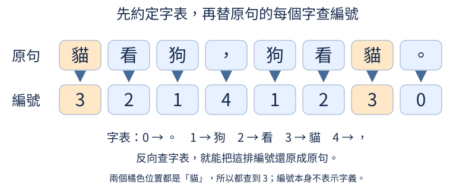

# 小小感知機 Tiny Perceptron

看到「今天天氣」，電腦怎麼猜下一個字？這套教材從幾個字的編號與接字表開始，用完整例子、圖解和短程式，逐步解釋文字、圖片與聲音模型的運作。

繁體中文 | [English](README_en.md)

**[線上教材](https://birdhackor.github.io/tiny-perceptron-vlm/) · [閱讀路線](course/README.md) · [操作與數學暖身](course/first-steps.md) · [222 個小節](course/lessons.md) · [訓練操作](course/training.md)**

教材預覽版：網站提供正文、SVG 圖解與實際 CPU 輸出。每節按「在 Colab 動手做」可開啟同一課的完整 Notebook；第一個程式格會準備專案與套件，小實驗不必先租 GPU。也可下載本節 `.ipynb` 後依下方步驟在本機練習。Colab 雲端執行尚未實機驗證。



## 教材提供什麼

18章與A／B／C支線、每節一份獨立 Notebook，以及自製 SVG 圖解與逐步提示。前段只用小矩陣、接字表、MLP與手寫注意力；後段才加入現代架構、Dense／MoE、cache／SDPA、量化與蒸餾。可以來回跳章，不需要從頭把同一個模型訓練到底。

文字與圖音模型、對話遮罩、DPO、量化儲存與訓練基本件直接以 PyTorch 實作。資料、訓練、推論與評估有可執行入口。LoRA、QAT 與小型 RL 等概念提供局部實驗；影片目前提供逐幀切片的輔助函式，完整教學列為後續擴充。此版本沒有提供已訓練的通用影音助理。

第一次接觸本專案也能從第一節開始；Python、tensor、機率、矩陣與梯度都有可按需查閱的暖身，不必先修完所有數學。每節先說明問題與具體例子，所需背景提供可點擊的小節連結。CPU 小程式用來核對零件；另外的正式訓練會更新權重、固定留出題，並保存程式版本、資料來源與逐題結果。合成小任務與自然資料的短訓成績各有適用範圍，不能合起來宣稱通用助理能力。見[正式實驗與進度](docs/course-experiments/README.md)及[驗證報告](docs/validation.md)。

## 安裝與開啟 Notebook

先安裝 [uv](https://docs.astral.sh/uv/getting-started/installation/) 與 Git。CPU 閱讀與練習：

```bash
git clone https://github.com/birdhackor/tiny-perceptron-vlm.git
cd tiny-perceptron-vlm
uv sync --frozen --extra cpu --group notebook
source .venv/bin/activate
python scripts/check_env.py
python -m ipykernel install --sys-prefix --name tiny-perceptron --display-name "Tiny Perceptron"
jupyter lab notebooks
```

Windows PowerShell 啟用指令是 `.venv\Scripts\Activate.ps1`。選擇 **Tiny Perceptron** kernel，先開啟 `notebooks/01/1.1.ipynb`。詳細操作見[暖身指南](course/first-steps.md)。

| 環境 | 安裝選擇 |
| --- | --- |
| CPU | `uv sync --frozen --extra cpu --group notebook` |
| Apple Silicon | `uv sync --frozen --group notebook` |
| NVIDIA CUDA 13.0 相容硬體／驅動 | `uv sync --frozen --extra cu130 --group notebook` |
| NVIDIA CUDA 12.6 相容硬體／驅動 | `uv sync --frozen --extra cu126 --group notebook` |

各版本的顯卡與驅動限制、Colab和鏡像設定見[環境說明](docs/environment.md)。使用 extra 後，啟用 `.venv` 直接用 `python`，或每次 `uv run` 都帶相同 extra，避免更換 PyTorch。本機小節核驗使用CPU；正式訓練另在Modal的NVIDIA L4、PyTorch 2.14.1+cu126上實測，版本與結果保存於[實驗報告](docs/course-experiments/README.md)。Apple MPS執行尚未實機驗證。

只想閱讀，可直接開啟線上教材。全站使用 [Zensical](https://zensical.org/) 建置，提供全文搜尋、章節目錄、頁內目錄、深淺色模式與程式碼複製；每節仍可下載 Notebook 或在 Colab 練習。SVG 可放大並保留靜態標註，支援系統減少動態效果。網站建置另需 `--group site`；本機閱讀與 GitHub Pages 操作見[教材發布](docs/publishing.md)。公式由 MathJax 連網排版。

## 最小流程

```bash
python scripts/prepare_data.py --kind toy-text
python scripts/train.py --task text --data data/generated/toy-text/train.jsonl
```

預設只做一個 batch 的 forward/backward，不更新權重。正式訓練再明確加 `--train`；字元模型、多模態、風格與安全、偏好和蒸餾配方在[訓練操作](course/training.md)。[首批固定訓練資料](assets/training/README.md)以 Git LFS 發布，執行 `python scripts/fetch_training_assets.py --list` 查看並按需解包。原始快取與權重仍放在被 Git 忽略的 `data/`、`checkpoints/`；分工見[資產管理](docs/asset-storage.md)。

已設定 Modal 與 Hugging Face 帳號時，可手動執行 GitHub Actions 的 **GPU training smoke test**，驗證 GPU 權重更新、HF checkpoint 上傳與下載續訓。帳號設定、時間限制與結果判讀見 [GPU 操作說明](docs/gpu-training.md)。

想先觀察訓練後的模型，可下載[公開學生權重](https://huggingface.co/birdhackor/tiny-perceptron-course-models)：30組實驗共120份存檔，包含不同尺寸與教師／學生等比較版本。[下載清單](docs/course-experiments/public-models.json)只列已發布的固定版本，下載程式逐檔核對指紋；模型卡說明每份權重的用途、資料許可與實際成績。例如在上面已安裝的 CPU 環境中：

```bash
python scripts/fetch_course_models.py --list
python scripts/check_course_models.py --model text_foundation
```

第二條會匿名下載基礎文字模型、核對檔案並在 CPU 上執行推論。這是檔案與執行通路的檢查；回答是否正確要看對應的留出題評估。推論權重已去除更新器與隨機狀態，不能拿來精確接續同一次訓練；教材的完整訓練備份另行保存。

## 專案結構與維護

```text
course/chapters/     教材正文與短程式，單一來源
course/figures/      自製 SVG
notebooks/          每小節一份，由正文產生
tiny_perceptron/    模型、資料、對齊、模態與壓縮零件
scripts/            資料、訓練、推論、評估與教材建置
tests/              離線契約測試
docs/               大綱、研究、環境與驗證紀錄
```

```bash
python scripts/build_visuals.py
python scripts/format_course_code.py course/chapters/01.md
python scripts/build_course.py
python scripts/build_course.py --check
python scripts/check_course_reviews.py
python scripts/check_technical_reviews.py
python scripts/check_notebooks.py --mode python
python scripts/check_notebooks.py --mode kernel --lesson 3.6
pytest -ra
ruff check .
ruff format --check .
```

修改教材請改 `course/chapters/`，先格式化該檔的 Python 範例再產生 Notebook。每節須由獨立讀者核對目前正文與 SVG，再由另一位審閱者查核事實、原始來源與實測結果，分別見[編輯說明](docs/editorial-guide.md)與[正確性審閱](docs/technical-review-guide.md)；版本不符會阻止發布。執行輸出與網頁放在 `outputs/`。完整 kernel 檢查用 `--mode kernel`，每節開獨立工作桌。GitHub Actions 保留 Linux、macOS、Windows 的核心測試；Notebook整套驗證另行執行。

## 參考與授權

參考 [nanoGPT](https://github.com/karpathy/nanoGPT)、[nanochat](https://github.com/karpathy/nanochat)、[MiniMind](https://github.com/jingyaogong/minimind)、[MiniMind-V](https://github.com/jingyaogong/minimind-v) 與 [nanoVLM](https://github.com/huggingface/nanoVLM)。公開課與學習者回饋的來源、取捨與查證限制保留在[大綱](docs/curriculum.md)與研究筆記。

程式、教材與自製圖解使用 [MIT](LICENSE)。外部資料依各自授權。
