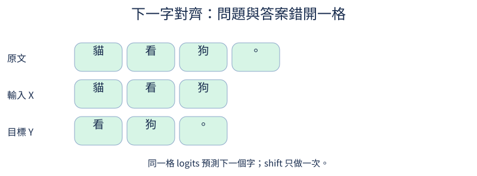
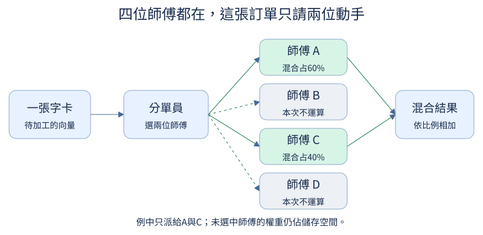

# 小小感知機：一次看懂一件事

這套教材把「一張只會接字的表」，慢慢擴展成能接收文字、圖片與聲音的小模型。每節只回答一個問題：先猜結果、看圖，再用幾行程式驗算，最後只改一個條件。

有大學微積分、工程數學或線性代數的印象就能開始。忘記公式也沒關係，[操作與數學暖身](first-steps.md)會重新說明字卡、矩陣與梯度的意思。需要名詞時再查[譬喻與名詞對照](glossary.md)。

## 怎麼使用

純閱讀可直接看下方的章節正文。想動手，依[操作指南](first-steps.md)開啟 JupyterLab，再從[全部 222 個小節](lessons.md)選一份 Notebook。每份都能從乾淨環境單獨執行；共享的零件在 `tiny_perceptron/`，不需要一路沿用前章的模型存檔。

也提供離線網頁：啟用專案 `.venv` 後執行 `python scripts/export_course.py`，在檔案管理器打開 `outputs/site/index.html`。網頁可搜尋小節並播放 SVG 的逐步提示；修改數字與執行程式仍使用 Notebook。圖的橘色邊框提示閱讀順序，所有標註一直保留；系統的「減少動態效果」設定會停用動畫。

Notebook 預設做小數值實驗、推論或一個 batch 的梯度檢查。需要模型已學會某種能力的單元，會指出前置條件與[GPU 訓練操作](training.md)。教材沒有預填訓練成果，也沒有把隨機模型的輸出當成能力展示。

## 選一條適合你的閱讀路線

| 想先理解什麼 | 建議順序 |
| --- | --- |
| 語言模型怎麼接出下一個字 | 暖身 → 1 → 2 → 3 → 4；再補 5–7 的資料與訓練 |
| 怎麼調整個性、指令遵循與安全 | 1.4–1.8 → 7 → 8 → 9；需要偏好比較時再讀 13 |
| 圖片或聲音怎麼接進來 | 2.1–2.4 的向量 → 7 的答案遮罩 → 10 → 11；音訊走 12.5–12.12 |
| Dense、MoE 與現代模型的差別 | 4 的初始 Transformer → 14 的單項架構比較 → 15 的專家分工 |
| 模型太大或太慢 | 4 的基準 → 16 的量測 → 17 的量化 → 18 的蒸餾 |
| 檢索、工具與推理 | 能讀懂對話序列後，獨立選 A、B、C；不要求完成所有模型訓練 |

可以跳章，也可以回到三個數字重新驗算。相同現象用較小模型能說清楚時，就先用小模型；早期不塞入 Flash Attention 或 MoE。

## 章節

| 章 | 要回答的問題 |
| --- | --- |
| [1．從接字表開始](chapters/01.md) | 怎麼把文字變成數字、算猜錯的代價、沿梯度調整？ |
| [2．多看幾張字卡](chapters/02.md) | 窗口、向量、矩陣乘法與小型 MLP 是什麼？ |
| [3．查閱相關筆記](chapters/03.md) | 注意力怎麼挑線索，如何禁止偷看未來？ |
| [4．拼成初始 Transformer](chapters/04.md) | 怎麼保留原訊息、疊零件，得到完整文字模型？ |
| [5．讓訓練可重現](chapters/05.md) | batch、更新、存檔、資料切分與評估如何配合？ |
| [6．文字怎麼切成 token](chapters/06.md) | 字元、位元組、BPE，各自省下或增加什麼？ |
| [7．只考模型的回答](chapters/07.md) | 對話模板、答案遮罩、padding 與截斷如何對齊？ |
| [8．個性與指令遵循](chapters/08.md) | 生動、簡潔、格式可靠，怎麼分開教與評估？ |
| [9．誠實、安全與過度拒絕](chapters/09.md) | 資訊不足、權限邊界與無害問題該怎麼處理？ |
| [10．把圖片接進來](chapters/10.md) | 像素如何切成小方塊，再接到文字向量？ |
| [11．真的有用到圖片嗎](chapters/11.md) | 凍結策略、錯配圖、遮圖、數字圖片怎麼驗證？ |
| [12．影片片段與聲音](chapters/12.md) | 時間順序、波形、頻譜與圖音聯合問答如何表示？ |
| [13．從兩個答案學偏好](chapters/13.md) | DPO 怎麼改變選擇，和 SFT、RLHF 有何關係？ |
| [14．逐一比較現代架構](chapters/14.md) | RMSNorm、RoPE、gating、共享權重、GQA 解決什麼？ |
| [15．Dense 與 MoE](chapters/15.md) | 分單員、專家、負載與實際成本如何配合？ |
| [16．先量，再加速](chapters/16.md) | cache、SDPA、packing、線上 softmax 與 GPU 的關係？ |
| [17．量化](chapters/17.md) | 粗刻度、誤差、真正的低位元儲存與 QAT 如何區分？ |
| [18．蒸餾](chapters/18.md) | 學答案、學候選分佈，如何讓學生更小而仍可靠？ |
| [A．檢索與外部知識](chapters/0A.md) | 找到資料、引用資料與答對問題，分別怎麼核對？ |
| [B．工具](chapters/0B.md) | 模型開工單，程式怎麼核對並真的執行？ |
| [C．推理與額外計算](chapters/0C.md) | 多試幾次、驗證答案與獎勵訊號能改善什麼？ |

## 譬喻怎麼用

「查筆記」用來說明注意力選擇與混合資訊；模型仍在做可微分的數值運算，並沒有人的理解。「分單給師傅」用來說明 MoE 的稀疏分工；專家不會自動具有語言或醫學專長。每個譬喻都要回到小實驗，看它在哪裡有用、在哪裡不適用。

## 素材與實作

40 張 SVG 由本專案自行繪製，原始碼在 [build_visuals.py](../scripts/build_visuals.py)，沿用專案 MIT 授權。圖片、聲音、字形資料可離線生成。模型與前處理直接使用 PyTorch；沒有導入外部預訓練編碼器。[首批固定訓練資料](../assets/training/README.md)使用 Git LFS 發布，解包快取與權重放在被 Git 忽略的目錄；存放原則見[資產管理](../docs/asset-storage.md)。

教學設計參考 nanochat、MiniMind-V、公開課與學習者回饋；可核對的來源與限制保留在[大綱](../docs/curriculum.md)和相關研究筆記。這套實作涵蓋核心機制與玩具任務；影片序列、QAT、LoRA、RL 的部分單元是局部實驗，沒有宣稱提供已訓練的通用影音助理。
