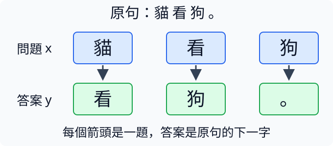
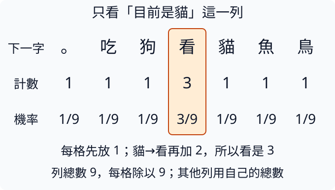

# 第 1 章：從猜下一個字開始

在手機上打一個字，輸入法常會提供下一個字的候選。本章從這個小問題出發：先把短句整理成電腦能記錄的編號，再數一數字與字的關係，最後讓一張可調整的數字表逐步改善猜法。每一步都用很短的例子看清輸入、答案與改變，讀到需要的新工具時再補上背景。完成這章後，你會知道文字模型的「學習」實際上改了什麼，也會分清楚訓練時改數字與生成時接著寫字這兩件事。

## 1.1 文字怎麼變成數字？

你傳給朋友「貓看狗」，朋友會直接讀出字義。但我們接下來寫的程式要做的是：看到「貓」後，猜下一個字是什麼。為了記錄它猜過哪些候選字，先要替每種字安排一個固定位置。想像圖書館替書貼上編號：編號幫我們找到書，並不替書解釋內容。文字的第一步也是這樣，先建立字與數字的對照，再談如何學會預測。

若你不熟悉 Python 的清單、字典與方括號，可以先讀 [W.2](../first-steps.md#W.2)；本節只會使用這些資料整理工具。把一種字指定給一個整數，這個整數叫 ID，也就是識別編號。例如約定「貓」對應 3，「狗」對應 1，只表示查到 3 時拿出「貓」。它不表示貓比狗大三倍，也不表示兩者意思相近。這份包含所有可用字的清單叫字表；字表中每個字都有唯一的位置。

我們用「貓看狗，狗看貓。」作例子。它有重複的字，但只需要替每種字編號一次。`set(text)` 把重複字收成一份不重複的集合；`sorted` 再把集合排成固定順序，因此同一段文字每次執行都會得到同一張表。Python 依每個字元在 Unicode（電腦統一記錄文字的編碼標準）中的數值排序，並非筆畫排序，順序本身沒有語言上的意義。

```python
text = "貓看狗，狗看貓。"
chars = sorted(set(text))
to_id = {}
for i, char in enumerate(chars):
    to_id[char] = i
ids = [to_id[char] for char in text]
restored = "".join(chars[i] for i in ids)
print(chars)
print(ids)
print(restored)
assert restored == text
```

輸入 `text` 是原句。`enumerate(chars)` 逐一提供「位置、字」這一對材料，像 `0, "。"`；迴圈把它存進字典 `to_id`，於是能由字找到位置。`[to_id[char] for char in text]` 是把迴圈寫在清單中的簡寫：按原句順序取出每個字，查出它的 ID，再收成清單。第一行輸出是 `['。', '狗', '看', '貓', '，']`，因此第二行是 `[3, 2, 1, 4, 1, 2, 3, 0]`。兩次「貓」都變成 3，標點也各有編號，沒有被丟掉。

下圖把原句、ID 清單與字表排在一起：上列是原句各字，下列是同一位置的 ID；橘色的兩張「貓」卡都連到 3，表示相同字每次使用相同編號。底下的字表是查找約定，讀到 3 就能逆向找到「貓」，讀到 0 就找到句號。箭頭只表示對應，沒有表示字義或數值大小。


最後的 `chars[i]` 走相反方向，從 ID 查回字。`"".join(...)` 用空字串連接查回來的每個字，得到原句 `貓看狗，狗看貓。`。把文字換成 ID 叫編碼（encode），把 ID 換回文字叫解碼（decode）。`assert` 檢查兩個方向接起來能否還原原文；通過時它不印訊息。現在程式只完成可還原的記錄，尚未學會貓或狗的意義，也還沒有調整任何數字。

這套做法還有一個限制：字表中沒有的字無法查 ID。若編碼時改成「貓看鳥」，卻仍使用上面的 `to_id`，查「鳥」會出現 `KeyError`，因為字典找不到那個鍵。後面製作更實用的文字處理工具時會處理這個問題；眼前先使用字表涵蓋的小句子。

練習只把建立字表那行改成 `chars = sorted(set(text), reverse=True)`，其餘照跑。`reverse=True` 要求排序結果反過來，原本最後一種字會排到第一個位置。先預測原句的 ID 會變，還是還原的文字會變。結果應是編號改變、`restored` 仍相同，`assert` 仍通過。因為編碼表與解碼表一起更新了，這正好檢驗 ID 是一套約定，而不是字義本身。

## 1.2 記住資料等於學會嗎？

老師把十道題目和答案交給學生，隔天考完全相同的十題。滿分可能表示學生理解，也可能只是背熟了。要分辨兩者，至少要留下沒拿來練習的題目。文字模型也是：用同一段文字讓模型學習，再用那段文字評分，不能知道它遇到新文章會怎樣。在 [1.1](#1.1) 我們已經能儲存一段文字；現在先決定哪些文字可以用來練習，哪些應留作檢查。

通常把資料分成三份。訓練資料（training）用來調整模型的數字；驗證資料（validation）用來選設定，例如稍後比較看一字或看三字的模型；測試資料（test）留到設定選完，才評一次最後成績。驗證集若被反覆參考，也可能被間接迎合，因此不能把選設定時得到的最高分直接當最後能力。這三個名字指資料用途，不是三種模型。

切分時應先分完整檔案，再從各檔案取出短片段。例如把「貓看狗。狗看貓。」切成相鄰的四字片段，將「貓看狗。」放訓練組、把「看狗。狗」放驗證組，兩組共享同一段原文「看狗。」。模型訓練時已見過這段連續內容，驗證卻又用它考一次，因此不是獨立的新文件。共用同一套中文字並不算洩漏；這裡的問題是同一來源中高度重疊的內容被拆到兩邊。這叫資料洩漏（data leakage）。完全一樣的檔案也要先去重，否則兩份複本會造成同樣問題。

下面用專案內的 `split_documents` 做一個可看清的例子。它先移除完全重複的文字，打亂順序，再保留至少一份驗證、一份測試；這個小例子有五筆輸入，卻只有四份不同檔案。執行位置與工具箱見 [W.1](../first-steps.md#W.1)，清單和字典見 [W.2](../first-steps.md#W.2)。

```python
from tiny_perceptron.data import split_documents

docs = ["貓看狗。", "狗看貓。", "鳥看魚。", "魚看鳥。", "貓看狗。"]
parts = split_documents(docs, seed=42)
for name, documents in parts.items():
    print(name, len(documents), documents)
assert not (set(parts["train"]) & set(parts["validation"]))
```

輸入 `docs` 裡的「貓看狗。」重複兩次。輸出會列出 train 兩份、validation 一份、test 一份，合計四份；可直接讀每份文字確認沒有同一句跨組。`seed=42` 是打亂順序時的起始設定，固定它讓本次切分可重現，並沒有特殊的學習意義。`.items()` 逐項提供字典的鍵和值，分別存到 `name`、`documents`，所以可以一起印出用途與檔案。

最後的 `set` 取出各組不重複的文字，`&` 找兩組共同的文字。若交集為空，`not` 就為真，檢查通過。這只是檢查完全相同的文字；「貓望著狗。」和「貓看狗。」仍可能來自同一原文的改寫。真實資料要連同同一來源、同一對話或同一家族的近似版本一起分組，不能只靠字串相等。

練習在 `docs` 再加一份「貓看狗。」，先預測各組總數是否從四變五。執行後仍應是四；再把新增那份改成新句「鳥看貓。」，總數才會變成五，具體各組內容也可能重排。這個核對教你先問「有多少不同材料」，而不是把檔案行數當作有多少新知識。

## 1.3 模型到底在猜什麼？

如果把「貓看狗。」完整交給程式，又要求它寫出同一句，它只要照抄就能成功。我們要練的則是：還沒看到後面的字，先猜下一字。這個差別必須寫進資料，否則後面再漂亮的計算都會在學錯任務。延續 [1.1](#1.1) 的文字記錄，本節把一句話拆成一串「問題、答案」，不需要先懂模型如何學習。

拿「貓看狗。」逐位置看：目前是「貓」，下一字答案為「看」；目前是「看」，答案為「狗」；目前是「狗」，答案為「。」。句號之後沒有提供下一字，所以暫時不拿它當問題。這裡每個問題只看一字，後續章節才會擴大前文；但答案永遠是問題位置右邊一格的字。

把原句叫 `s`，取掉最後一項得到輸入 `x`，取掉第一項得到答案 `y`。Python 的切片（slice）可一次取出一段清單：`s[:-1]` 從開頭取到最後一項之前，`s[1:]` 從位置 1 取到結尾。負索引 -1 代表最後一項，切片的右端不包含在結果中。索引與清單背景見 [W.2](../first-steps.md#W.2)。

```python
s = list("貓看狗。")
x = s[:-1]
y = s[1:]
print(x)
print(y)
for current, answer in zip(x, y, strict=True):
    print("看到", current, "下一字", answer)
assert len(x) == len(y) == 3
```

`list` 把字串拆成依序排列的字，原句 `s` 共有四個項目；問題 `x` 和答案 `y` 則各三個。前兩行輸出分別是 `['貓', '看', '狗']` 和 `['看', '狗', '。']`，長度都是三。`zip` 把兩份清單同一位置配對，迴圈逐對印出三道問題；`strict=True` 要求兩份長度相同，不同就報錯，免得悄悄少掉答案。最後檢查同時確認兩邊都是三項。

下圖上列藍框是問題 x，下列綠框是同位置的答案 y。每個向下箭頭代表一題，不表示把同一個字複製下來：左邊是貓配看，中間看配狗，右邊狗配句號。最上方的原句有四字，問題與答案則各三格。



這個右移一格的對齊叫 shift。名字雖像「移動」，實際並沒有修改原句，而是用兩個切片建立對應關係。後面用 ID 取代字時，也要保持同樣的對齊。如果輸入與答案都用 `s[:-1]`，第一題就變成「看到貓，回答貓」，整份資料會獎勵複製目前字，而不是預測下一字。

也別把 shift 和「防止偷看」混成一件事。shift 決定哪個位置該配哪個答案；當模型一次處理多個位置時，還需要限制每個位置只能讀到當下及以前的資料。後者會在 [3.6](03.md#3.6) 說明。現在用單字問題，可以直接看出答案沒有塞在輸入裡。

練習先在紙上寫下「鳥飛。」的所有問題答案，再把 `s` 的字串改成它，並把檢查中的 3 改成 2。核對應有「鳥→飛、飛→。」兩對。最後故意把 `y` 改成 `s[:-1]`，觀察輸出如何變成自己配自己；這次長度檢查仍會通過，提醒我們形式對齊不代表任務正確，還要逐題讀一遍。

## 1.4 不看上下文能怎麼猜？

假設一個人沒看題目，只知道答案袋裡有三張貓、一張狗、一張鳥。如果必須猜一張，猜貓比猜鳥更容易中；若要按常見程度隨機抽，也應讓貓拿到三倍的機會。文字模型在讀前文之前，可以先用這個極簡猜法：只數每種字有多常見，不管它出現在哪裡。這讓我們有一個起點，之後才能看出「讀前文」究竟增加了什麼。

這種方法叫 unigram，表示一次只統計一個字的頻率。頻率是出現次數；用某字次數除以全部字的總次數，才得到機率。機率的範圍與加總規則見 [W.4](../first-steps.md#W.4)。例子總共五個字，貓的機率是 3/5=0.6，狗與鳥各是 1/5=0.2。這三個數加起來為 1，涵蓋袋子裡所有可能的結果。

```python
from collections import Counter

text = "貓貓貓狗鳥"
counts = Counter(text)
total = sum(counts.values())
probability = {}
for char, count in counts.items():
    probability[char] = count / total
print(counts)
print(probability)
assert abs(sum(probability.values()) - 1) < 1e-6
```

輸入 `text` 是五個字。`Counter` 是 Python 內建的計數工具，會將每種字作為鍵、出現次數作為值，輸出貓 3、狗 1、鳥 1。`.values()` 取出這些次數，`sum` 加總成 `total=5`。`counts.items()` 逐項提供「字、次數」配對，`char` 接收字、`count` 接收次數；迴圈再把次數除以總數，存到 `probability`，第二行輸出是 `{'貓': 0.6, '狗': 0.2, '鳥': 0.2}`。字典與迴圈可回看 [W.2](../first-steps.md#W.2)。

最後檢查機率和離 1 的差距是否小於百萬分之一。`abs` 取絕對值，`1e-6` 表示 0.000001。電腦用有限精度儲存小數，像 0.6 未必能完全精確記錄，所以這裡接受非常小的數值誤差，而不用 `== 1` 嚴格比較。這不代表容許漏掉某個候選字；漏掉鳥造成的差 0.2 遠大於容忍值。

這個起點稱為基準（baseline），就是一個容易理解、用來比較的簡單方法。它沒有看題目，所以「貓看」和「狗吃」後面會給完全相同的分配。若資料中貓最常見，它到處偏向貓；這可能得到不少正確答案，卻不能算抓住了詞語關係。下一節會把「前一個字」也帶進計數。

另外，若始終只選最高機率，這個例子每次都選貓；若按 0.6、0.2、0.2 抽樣，狗和鳥仍有機會出現。「機率分配」和「怎麼從分配選答案」是兩個步驟，生成時會再拆開。現在只核對分配，不需要寫隨機抽樣程式。

練習把 `text` 改成 `"貓貓貓狗狗狗鳥"`，先手算總數七與狗的機率 3/7，再跑程式。貓和狗應各約 0.429，鳥約 0.143；貓的次數雖沒少，機率仍下降，因為總數增加了。這正是「比例」與「次數」的差別。

## 1.5 前一個字提供什麼資訊？

在「貓看狗。狗吃魚。貓看鳥。」裡，貓後面兩次都是「看」，狗後面則可能是句號或「吃」。如果只用 [1.4](#1.4) 的整體頻率，問貓後面接什麼與問狗後面接什麼，答案分配完全一樣。我們現在多看一件事：目前是哪個字，再從它曾經接過的字中估計下一字。這不是理解句子，只是比完全不看前文多了一條線索。

相鄰的兩個字叫 bigram。把所有候選字排成一張表，列是目前字，欄是下一字；例如「貓→看」出現一次，就在貓那列、看那欄加一。固定看貓那列，只用這列的總次數來除，就得到「已知目前是貓時」下一字的機率。這叫條件機率，寫 `p(看|貓)`，豎線讀作「在貓這個條件下」。表格軸與 tensor 的操作見 [W.3](../first-steps.md#W.3)，字與 ID 的約定見 [1.1](#1.1)。

若某組合沒出現過，直接計數會給它零機率；資料太少時，這未必合理。我們先在每格放 1，等於每個候選預留一份小支援，再加入真正的次數，這叫加一平滑（smoothing）。假設字表共 V 個字，某列實際觀察 N 次，分母便是 N+V。V 只是字表大小，不是 Python 內建名稱。

```python
import torch

text = "貓看狗。狗吃魚。貓看鳥。"
chars = sorted(set(text))
ids = [chars.index(char) for char in text]
counts = torch.ones(len(chars), len(chars))
for current, answer in zip(ids[:-1], ids[1:]):
    counts[current, answer] += 1
probability = counts / counts.sum(dim=1, keepdim=True)
row = chars.index("貓")
print(chars)
print(counts[row])
print(probability[row])
assert torch.allclose(probability.sum(dim=1), torch.ones(len(chars)))
```

`chars.index(char)` 找到字在字表中的位置，完成編碼。`torch.ones` 建立初值全為 1 的表；切片配對與 [1.3](#1.3) 相同。`sum(dim=1, keepdim=True)` 將每列的欄位相加，卻保留一欄的形狀，好讓每列除以自己的總數。這種讓一欄數字配到整列的運算叫廣播（broadcasting），這裡只需看它為每列提供同一個分母。

字表順序是 `['。','吃','狗','看','貓','魚','鳥']`，V=7。貓那列除「看」為 3 外，其餘都是 1：初始的 1 加上兩次觀察，總數為 9。因此「看」機率是 3/9，其餘各是 1/9；不是百分之百認為貓後面只會接看。`allclose` 檢查每列和在小數容忍範圍內都為 1。表中其他列各用自己的分母，不能把整張表除以一個總數。

下圖只展開貓那一列，橫向的七欄是候選下一字。橘框標出「看」這欄：初始1加兩次觀察得到3；下面同欄的3/9就是它的機率。其他欄各1/9，整列加起來才是1。這讓你看見平滑留下的支援，並不是把未見組合當成實際觀察過。



練習只將 `torch.ones(...)` 改成 `torch.full((len(chars), len(chars)), 0.1)`，表示每格初始支援為 0.1。先算貓那列總數應是 `2+7×0.1=2.7`，「看」應是 `2.1/2.7≈0.778`，其他各約 0.037，再執行核對。降低平滑讓已見組合更佔優勢，但仍給未見組合一點機會。

## 1.6 如何用參數列示預測偏好？

[1.5](#1.5) 的表靠次數決定機率。現在想換一種方式：不手動計數，而是讓每格存一個可調分數，之後依據答案好壞逐步調整。像評審先為候選人記分，再依得分決定推薦比例，分數可以為正、為負，也不必加總為 1。我們把這些可調的數字叫參數（parameter）；學習將改它們，文字 ID 的對照則仍固定。

用三個字「貓、看、狗」建立三列三欄的分數表。第 0 列代表目前字是貓，第 1 列是看，第 2 列是狗；每欄分別評下一字為貓、看、狗的偏好。若第 0 列是 `[0,2,0]`，表示看到貓時比較偏好看。它還不是機率；下一節會把分數轉成合法比例。本節只核對查表是否取對了列。

PyTorch 的 `nn.Embedding` 是可學習的查表工具，Embedding 常譯為嵌入層。`nn.Embedding(3,3)` 建立三列，每列三個數。這裡故意直接拿三個數當三個候選字的分數；第 2 章會用同一工具取得少量特徵，再交給後續計算，功能相同、用途不同。tensor 與軸見 [W.3](../first-steps.md#W.3)。

```python
import torch
from torch import nn

scores = nn.Embedding(3, 3)
with torch.no_grad():
    scores.weight.zero_()
    scores.weight[0, 1] = 2.0
inputs = torch.tensor([0, 2])
output = scores(inputs)
print(scores.weight)
print(output)
```

輸入 `[0,2]` 要求分別查「目前是貓」與「目前是狗」兩列。`scores.weight` 是層儲存的那張參數列，`zero_()` 把每格設為 0，再手動把第 0 列第 1 欄設為 2。結尾底線提醒這個方法直接修改原物件。`torch.no_grad()` 表示這次手動設定不用記錄求導關係，後面的學習會在 [1.9](#1.9) 開始介紹求導。

第一個輸出顯示整張表 `[[0,2,0],[0,0,0],[0,0,0]]`，可能附帶 `Parameter` 等標記，那是在提醒你這是可調參數。第二個輸出只有 `[[0,2,0],[0,0,0]]`，形狀 `[2,3]`：兩個輸入各取一列，每列仍有三個候選分數。第 1 列因為沒有被輸入查詢，就不在第二個輸出裡。這裡尚未執行任何更新，數字都是我們指定的。

若字表有 V 個字，這種方法需要 V×V 個參數；每個目前字都有一整排下一字候選分數。比如一百個字便有一萬格。這是一個很小的語言模型：根據輸入產生候選分數、數字可以改進，但目前仍只看前一字，無法知道更遠的內容。ID 之間的距離沒有拿來計算，查第 0 列或第 2 列只是選不同的規則。

練習在設定區加入 `scores.weight[2, 0] = 3.0`。執行前預測查表結果 `output` 的第0列是否改變；核對 `output[0]` 應仍是 `[0,2,0]`，`output[1]` 變成 `[3,0,0]`。你只調了狗那列，不會影響貓那列。這讓「參數在哪裡」和「哪個輸入用到它」變成可以直接追蹤的事。

## 1.7 分數怎麼變成機率？

[1.6](#1.6) 用可調分數表示偏好，但 `[1,2,-1]` 不能直接拿去抽字：有負數，總和也不是 1。怎樣既保留高分比較受偏好的順序，又得到合法機率？先把每個分數換成正數，再除以這些正數的總和。常用的換法是指數函式 `exp`，接著做比例化，這一整套叫 softmax。

`exp(z)` 是 e 的 z 次方，e 約是 2.718。分數為 1、2、-1 時，轉成的權重大約是 2.718、7.389、0.368；總和約 10.475。逐個除以總和，得到約 0.259、0.705、0.035。第二個候選仍最受偏好，而且分數差經過指數轉換後會影響機率比值。機率背景見 [W.4](../first-steps.md#W.4)，tensor 見 [W.3](../first-steps.md#W.3)。

如果所有分數一起加 100，候選之間的差沒有變，機率也不該變。指數的乘法關係告訴我們，每個 `exp(z+100)` 都比原先多同一個因子 `exp(100)`；除以總和時，它便抵消。這個性質還能幫我們避免數字太大：先減去最大分數，最高者變成 0，其他都不大於 0，指數就不會因分數很大而超過可表示範圍。

```python
import torch

z = torch.tensor([1.0, 2.0, -1.0])
weights = (z - z.max()).exp()
p = weights / weights.sum()
print(weights)
print(p, p.sum().item())
print((z + 100).softmax(dim=0))
assert torch.allclose(p, z.softmax(dim=0))
```

輸入是三個候選分數，最大值為 2。減掉它後得到 `[-1,0,-3]`，所以第一行的正權重是約 `[0.368,1,0.050]`。這與前段直接計算的權重不同，但除以各自總和得到同樣的比例。第二行應看到 `[0.2595,0.7054,0.0351]` 和接近 1 的總和。第三行把每個分數加 100 再交給 PyTorch 內建的 `.softmax`，結果仍相同。

`dim=0` 指沿這唯一的候選軸換算；若是一批分數 `[筆數,候選數]`，就應沿候選軸 `dim=1` 或 `dim=-1`，使每筆各自加總為 1，不能跨不同句子一起分配。`allclose` 是容許極小小數誤差的比較，用來確認我們逐步計算和內建工具相符。這段沒有改參數，只有把同一組偏好換個可解讀的表示。

還要留意「最高機率」不等於「正確答案」。softmax 不知道哪個答案正確，只負責整理我們給的分數。如果錯字分數最高，它也會忠實給錯字最多機會。下一節才會把真實答案帶進來，衡量這次分配的代價。

練習只把第一個分數從 1 改成 3。執行前先預測第二、第三個候選的機率是否也會變。核對約 `[0.7214,0.2654,0.0132]`；另外兩個分數雖沒動，機率仍下降，因為大家共享同一個總和。這能提醒你：改一個分數，會改整份分配。

## 1.8 猜錯要付出多少代價？

兩次預測都把「看」排第一，第一回給它 0.5，第二回給它 0.9。如果答案確實是「看」，第二回應算更好，因為它把更多機會放到正確答案上。只記「有沒有選對第一名」看不出這個差別；訓練需要一個能隨信心連續改變的代價，才知道分數調整是進步還是退步。

接續 [1.7](#1.7) 的機率分配，我們只取正確答案那一格的機率 p，再計算 `-log(p)`。代價也叫 loss；這個名稱是在說「希望降低的數字」，並不是猜錯題數。[W.4](../first-steps.md#W.4) 解釋了對數與數值直覺：給正確答案 0.5，代價約 0.693；給 0.9，代價約 0.105；給 0.1，代價約 2.303。因此越有把握地忽略正確答案，處罰越大。

如果一批例子每個都有唯一正確類別，把它們的負對數代價取平均，通常叫交叉熵（cross entropy）。這裡不需要先學整套資訊理論，只要能追到「正確答案的機率是哪一格」。自然對數的代價單位叫 nat；除以 `log(2)` 才換成 bit。換單位不改誰比較好。

```python
import torch
from torch.nn import functional as F

p = torch.tensor([0.1, 0.5, 0.9])
print("正確機率", p, "代價", -p.log())
logits = torch.tensor([[0.0, 2.0, 0.0]])
target = torch.tensor([1])
probabilities = logits.softmax(dim=-1)
manual = -probabilities[0, 1].log()
loss = F.cross_entropy(logits, target)
print(probabilities, manual.item(), loss.item())
assert torch.allclose(loss, manual)
```

第一段輸入三個正確機率，直接列出上述代價。第二段是一個問題、三個候選分數，形狀 `[1,3]`；這種未換成機率的分數常叫 logits。`target=[1]` 表示這一題的答案是索引 1 的候選，也就是從左數第二個，索引仍從 0 開始。`probabilities[0,1]` 因而取第一題的正確機率。分配約 `[0.1065,0.7870,0.1065]`，手算負對數和內建交叉熵都約 0.2395。

`F` 是給 `torch.nn.functional` 取的簡短名字，裡面提供直接計算的函式。`F.cross_entropy` 接收原始 logits 和答案 ID，內部已用數值穩定的方式處理 softmax 與對數；不應把 `probabilities` 再送進它。否則機率會被當成另一組分數再換算一次，得到不同代價。這個介面也不用輸入完整的正確機率表，只需一個答案位置。

比較平均 loss 要說清楚在哪份資料、哪種文字拆分上。相同文字若被拆成不同數量的片段，每片段平均的意義就不同；第 6 章會討論更公平的比較。現在先固定字表與例子，讓代價變化可以歸因於分數變化。

練習只把 `target` 改成 `[0]`，並把手算索引 `[0,1]` 改成 `[0,0]`。先預測代價會高於還是低於 0.2395，再核對應約 2.2395。分數表完全沒變，只換了哪一格是答案；這說明 loss 同時需要預測與真實答案，光看分數高低無法判斷好壞。

## 1.9 梯度代表多敏感？

[1.8](#1.8) 給了衡量猜法好壞的代價。接下來要調參數，卻有一個問題：目前代價高，並不直接告訴我們哪個數字應該增加、哪個減少。先離開文字表，用一個旋鈕看清「附近的變化」。假設旋鈕 w 的理想位置是 3，代價為 `(w-3)²`。目前 w=1，代價是 4；把它稍微增大，會靠近 3，代價應下降。

敏感度用「代價改變多少，除以旋鈕改變多少」來量。若 w 增加 0.1，代價從 4 變成 3.61，比值是 -3.9；若增加 0.01，比值接近 -3.99。當改變數趨近零，這個比例趨近 -4，這叫導數。對多個參數各計一個導數，排列起來便叫梯度；[W.6](../first-steps.md#W.6) 用自動求導介紹同一個概念，本節先用普通數值自己估算。

可以同時往左與往右試：令 h 是一個很小的距離，取 w+h 與 w-h 的代價差，再除以兩點距離 2h。這叫有限差分（finite difference），因為用有限的小步取代無限靠近。它常用來核對自動求導，但不是大型模型通常用的訓練方法；每個參數都這樣試會很慢。

```python
def loss(w):
    return (w - 3) ** 2


w = 1.0
h = 0.001
left = loss(w - h)
right = loss(w + h)
gradient = (right - left) / (2 * h)
print(left, right)
print(gradient, "公式計算", 2 * (w - 3))
```

輸入位置 w=1 與距離 h=0.001。`def loss(w)` 定義一個做法，每次提供 w 就回傳代價；`** 2` 是平方。左點 0.999 的代價約 4.004001，右點 1.001 的代價約 3.996001，兩者相差 -0.008，再除以 0.002，得到約 -4。平方函式的精確導數為 `2*(w-3)`，代入同樣位置也得到 -4，所以這次估算能和公式相互核對。

負號的意思是「在目前附近，增加 w 會降低代價」，不是叫我們把 w 改成負數。若 w=5，同樣計算得到正 4，表示再增加會遠離目標，應反方向走。若 w=3，導數是零，當前位置正好在谷底。這些都是區域性資訊，不能據此說任何大小的一步都能改善代價。

h 也有取捨：太大可能跨過曲線變化，算出來不再代表附近。電腦通常用有限位數近似保存小數，這種數字表示叫浮點數；近似值與理想值之間的小差距叫捨入誤差。若 h 太小，左右代價幾乎相同，相減得到的差值本來就很小，兩個近似值的誤差可能在其中佔很大比例。再除以很小的 2h，這個偏差也會被放大，讓梯度估算不準。本例平方函式的左右差分恰好很準，不能用它證明所有函式都不怕大步子。

練習只把 w 改成 5，先預測左右哪個代價小、梯度應是什麼符號，再執行。應看到左點較好、梯度約 +4。接著試 w=3，核對梯度約零。這次不需要真正更新參數，只要能把數字的符號翻譯成「往哪邊微調比較好」。

## 1.10 影響怎麼穿過多個運算？

[1.9](#1.9) 用一個旋鈕直接算代價。真實模型卻會先查表、再混合數字、最後才得到代價；參數的影響怎樣穿過中間步驟？想像水龍頭旋鈕增加一格，流量增加兩單位，而每增加一單位流量，裝滿水桶的成本又增加十二單位。旋鈕的一格影響最後成本就是 `2×12=24`，不是把兩段影響相加。

我們用兩段運算精確追蹤這件事：先令 `u=2*w`，再令 `loss=u²`。目前 w=3，u=6，代價為 36。第一段對 w 的敏感度是 2，第二段在 u=6 附近對 u 的敏感度是 `2*u=12`。若 w 微增 0.001，u 微增 0.002；代價約增加 `12×0.002=0.024`。所以相對於 w，總代價的敏感度是 `0.024/0.001≈24`。

把相連步驟的區域性敏感度相乘，叫鏈式法則（chain rule）。用符號寫就是 `dL/dw = (dL/du) × (du/dw)`：L 是最後的 loss，`dL/du` 問 u 微動會讓 L 改多少，`du/dw` 問 w 微動讓 u 改多少。不是另一種神秘公式，只是把「每單位」從 u 換回 w。這裡用平方代價方便手算，並非所有模型代價都是平方。

```python
import torch

w = torch.tensor(3.0, requires_grad=True)
u = 2 * w
loss = u.square()
loss.backward()
print("中間值", u.item(), "代價", loss.item())
print("兩段敏感度", 2 * u.detach().item(), 2)
print("合成梯度", w.grad.item())
assert w.grad.item() == 24
```

輸入 w=3，`requires_grad=True` 要 PyTorch 記錄相關運算。前兩行計算依序產生 u=6、loss=36，這一方向叫前向計算（forward）。`backward()` 再沿運算關係反方向求導，最後把 24 放在 `w.grad`。第二行印出手算兩段敏感度 12 與 2，所以可以親眼核對它們的乘積等於自動算出的梯度。

`.detach()` 表示拿出一份不再追蹤求導關係的數值，用來顯示手算結果，沒有改變 w 或 u。PyTorch 的自動求導系統叫 autograd；它在前向時記住哪些運算連在一起，這份關係叫計算圖（computational graph）。`backward` 使用各工具已知道的區域性求導規則沿圖傳回，並不是從程式文字猜公式。若一個參數走兩條路影響同個代價，兩條路算出的影響還要相加，因為兩路同時受到那個參數的改變。

這個例子中梯度為正，只說明當前附近增加 w 會增加代價。程式沒有更新參數，跟 [1.9](#1.9) 一樣仍在測敏感度。後面真正的模型雖有更多步驟，也遵守相同的追蹤方式。

下圖上方藍箭頭跟著程式前向走：w=3乘2得到u=6，再平方得到L=36。下方橘箭頭反方向讀，先從L回到u得到敏感度12，再從u回到w乘敏感度2；底部24才是對w的總梯度。箭頭方向區分算數值和算影響，沒有把數值36當成梯度。


練習把 `u = 2 * w` 改成 `u = 3 * w`，把列印「兩段敏感度」那行最後的常數 `2` 改成 `3`，並把斷言的預期值改成你算的結果。列印行是在顯示手算結果，不會自動讀取前面的倍率，所以也要一起修改。先算 w=3 時 u=9、兩段敏感度為 18 和 3，合成應為 54，代價為 81。執行核對這些數；若只把舊梯度 24 乘 1.5 會得到 36，那是忘記第二段也因 u 的位置改變了。

## 1.11 參數往哪裡改？

一個旋鈕容易追蹤，如果同時有兩個呢？假設第一個旋鈕 w0 想靠近 3，第二個 w1 想靠近 0，但第二個的誤差只計半份代價。總成本寫成 `(w0-3)² + 0.5*w1²`。現在位置是 `[1,2]`：第一項代價 4，第二項代價 2，總共 6。兩個旋鈕應朝不同方向走，因此不能只拿總代價 6 當成共同的調整量。

[1.9](#1.9) 教我們用附近敏感度找方向，[1.10](#1.10) 說明敏感度怎樣穿過中間運算。現在對每一個參數分別問：「其他參數不動，只讓這一格微增，總代價會改多少？」這叫偏導數（partial derivative）。把各格偏導數依同樣位置排好就是梯度。第一格應為 `2*(1-3)=-4`，第二格應為 `0.5*2*2=2`，合起來是 `[-4,2]`。

```python
import torch

w = torch.tensor([1.0, 2.0], requires_grad=True)
first_cost = (w[0] - 3).square()
second_cost = 0.5 * w[1].square()
loss = first_cost + second_cost
loss.backward()
print("參數", w.detach())
print("各項與總代價", first_cost.item(), second_cost.item(), loss.item())
print("梯度", w.grad)
assert torch.allclose(w.grad, torch.tensor([-4.0, 2.0]))
```

輸入 w 是兩格的一維 tensor，`requires_grad=True` 告訴 PyTorch 要追蹤這兩格。程式先分別算兩項再相加，讓你能核對 4、2、6；`backward()` 則對最後的單個代價求導。輸出參數仍為 `[1,2]`，梯度為 `[-4,2]`。兩者形狀相同，因為每個梯度格子都要對上自己的參數格子；一個有一萬格的參數列，梯度也需要一萬格。

最後的 `torch.allclose` 逐格比較算出的梯度與手算值，容許浮點數的小幅誤差；全部夠接近就回傳 `True`。`assert` 要求這個結果為真：通過時沒有額外輸出，若有格子差太多就以 `AssertionError` 停下，提醒你重新核對計算或預期值。它是在檢查結果，不會調整參數。

為什麼從一個總代價能得出兩個方向？前向計算記錄第一格隻影響第一項、第二格隻影響第二項；求導沿這些關係回傳。w 本身是我們直接建立、要調整的來源，常叫葉節點（leaf）；`first_cost` 和 `loss` 是由它算出的中間結果。一般會在葉參數的 `.grad` 讀取要更新的梯度，而不是期待每個中間結果都自動保留 `.grad`。

梯度不是新參數，不是機率，也不是要求直接把 w 設成 `[-4,2]`。為了降低代價，第一格應稍微增加，因為它的梯度負；第二格應稍微減少，因為梯度正。步子多大還要另設學習率，[1.12](#1.12) 將分開實際更新。這一節只確定每個旋鈕的方向與相對敏感度。

練習只把第二項的係數 0.5 改成 2，並把檢查中的第二格預期值改成 8。執行前先算新總代價為 `4+2×4=12`，梯度應 `[-4,8]`。核對第一格仍 -4，說明改變一項權重不一定影響所有參數；第二格變四倍，因為這一項在總成本中的重要程度變四倍。

## 1.12 更新一次有什麼效果？

知道方向之後，還得真的動一步才能改善猜法。[1.11](#1.11) 顯示梯度與參數分開儲存；`backward()` 算出敏感度，不會替你把參數移到更好的位置。本節繼續一個旋鈕，刻意只更新一次，讓「求導」與「更新」兩個動作可以分別核對。

沿用代價 `(w-3)²`，w 從 1 開始，代價 4，梯度 -4。為了降低代價，我們沿梯度的反方向走：`新w = 舊w - 學習率×梯度`。學習率（learning rate）通常寫成 η，是每次步子的比例；η=0.1 時，`1-0.1×(-4)=1.4`。負梯度配上減號讓 w 增加，恰好往目標 3 靠近。新的代價為 `(1.4-3)²=2.56`。

這個方法叫梯度下降（gradient descent）：「下降」指希望代價降低，並不是所有參數都一定往小的方向改。把所有模型參數依各自梯度調一次，就是一次參數更新。多次用資料求導與更新才組成訓練，但我們先把這一個可驗算的動作做好。

```python
import torch

w = torch.tensor(1.0, requires_grad=True)
before = (w - 3).square()
before.backward()
print("更新前", w.item(), before.item(), w.grad.item())
with torch.no_grad():
    w -= 0.1 * w.grad
after = (w - 3).square()
print("更新後", w.item(), after.item())
assert after.item() < before.item()
```

輸入是一個要追蹤導數的 w。`before` 儲存更新前算出的代價，`before.backward()` 求出 -4。第一行輸出應為 `1,4,-4`。`w -= ...` 直接修改 w 本身，稱為原地更新；w 是我們直接建立且需追蹤梯度的來源參數，PyTorch 在一般求導模式下會拒絕這種修改，以免破壞求導所需的數值。若移除 `torch.no_grad()`，本例會在這一行立即以 `RuntimeError` 停下。在 `with torch.no_grad():` 的縮排範圍裡，則明確把這次更新排除在求導記錄之外，允許我們移動參數，再用新位置重新評估代價。離開這個縮排範圍後，w 仍需追蹤梯度，所以計算 `after` 時會建立新的求導關係。

`after` 必須用更新後的 w 重新計算，不能拿舊的 `before` 當新代價。第二行會顯示 w 約 1.4，代價約 2.56；浮點數可能顯示 `1.399999...`，這是有限精度，不影響結論。最後的檢查確認這次小步有改善，而非替任何學習率作保證。這段只做一次求導，因此沒有累積舊梯度的問題，下一節才會看重複求導。

若 η 太大，正確方向也可能跨過谷底再爬上另一邊。例如 η=2，讓 w 從 1 跳到 9，代價變成 36，比原來更差。反過來，η 極小則可能每步都改善卻要走很久。真正訓練時要同時看代價是否下降與變化是否穩定，不能只看「有梯度」就當成功。

同樣的動作也能用在接字表：每次用短文算代價、求梯度，再更新表裡的分數。我們實際讓一張可學習的接字表練習200次，教過的9篇短文平均代價由3.7733降到1.0568。這證明多次更新確實改變了猜法，卻還沒有證明它能寫出合理的完整句子。想親自重做，可以在[訓練操作T.3](../training.md#T.3)看到資料、命令和沒教過的短文測驗；眼前先掌握這一次更新怎麼發生即可。

練習先把步長 0.1 改成 0.6，手算新 w=3.4、代價 0.16，再執行核對，原檢查應通過。接著改成 2，先預測最後 `assert` 會失敗，再執行：它應該明確提醒代價沒有下降。這是有意安排的反例，幫你區分程式運作正確和設定是否合適。

## 1.13 第二次 backward 為什麼梯度變大？

你按同一個按鈕兩次，本來想得到同樣結果，卻發現記錄的數字翻倍。不是參數突然變得更敏感，而是軟體把第二次結果加在第一次上了。PyTorch 的 `.grad` 就像一個收集桶：每次 `backward()` 把新梯度倒進去，不會自動先清空。若我們想每輪只按當前這批資料更新，就要把上輪的桶清掉。

先回顧 [1.10](#1.10) 的前向計算與求導：運算建立關系，`backward` 再往回算敏感度。這裡用 w=2、代價 w²，梯度是 `2*w=4`。不更新 w，再建立一次同樣代價並求導，新的梯度仍是 4；但 `.grad` 存放的是舊4+新4=8。這種累加是設計的一部分，後面可利用它合並多小份資料的梯度；忘記它才會成為錯誤。

```python
import torch
from torch import nn

w = nn.Parameter(torch.tensor(2.0))
(w.square()).backward()
first = w.grad.clone()
(w.square()).backward()
second = w.grad.clone()
w.grad = None
(w.square()).backward()
print(first.item(), second.item(), w.grad.item(), w.item())
assert second.item() == 2 * first.item()
```

`nn.Parameter` 把 tensor 標成模型的可調參數，並預設追蹤梯度。輸入 w=2。每行 `w.square()` 都重新做一次前向計算，再對這次結果求導。`clone()` 把當時梯度複制一份，讓 `first`、`second` 儲存當時的數字，而不是以後跟著桶裡的內容變。輸出應為 `4,8,4,2`：前兩次記錄4與8，清除後第三次又只存4，參數始終2。

`w.grad=None` 表示把收集桶清空，下次求導會重新建立梯度。也可將現有梯度設為零；正式使用最佳化器時通常呼叫 `optimizer.zero_grad()`，這會對它負責的參數一起清除。最佳化器（optimizer）是按更新規則管理參數的工具，本例還沒有建立它。`backward` 只負責求導和累加，最佳化器的 `step()` 才會動參數。

要分清另一個不同問題：對同一個 `loss` 物件連續呼叫兩次 `backward`，可能出現「計算圖已經釋放」的錯誤。PyTorch 預設第一次求導後釋放部分中間材料；本例每次重新算 `w.square()`，所以用的是新關係，不需要保留舊圖。累加發生在可調參數 w 自己的 `.grad`，不需要把舊前向圖保留到下一輪。

通常一輪訓練依序是清除舊梯度、算新預測與代價、求導、更新。刻意跨小份累積時則會改變清除與更新的時機，第 [5.3](05.md#5.3) 節會展開。現在先把「新的敏感度」與「桶裡累積的總和」分開讀。

練習只註釋掉 `w.grad = None`，在行首加 `#` 就會讓它不執行。先預測第三次記錄應為12、參數仍2，再跑核對。最後的檢查仍只比較前兩次，所以會通過；要判斷清除是否正確，還得看第三個輸出。這提醒我們，某個檢查通過只說明它檢查的那件事。

## 1.14 如何接著寫下去？

學習時每道題都有已知答案，寫新文字時卻沒有答案可對照。我們給模型一個開頭，讓它分配下一字的機率，選出一字，接到句尾，再把新字當成下一輪的前文。這樣反覆使用「猜下一字」，就是生成（generation）。模型不是一次拿出整篇文章，而是一步一步延長當前內容。

為了看清流程，本節不訓練參數，直接指定 [1.5](#1.5) 那種 bigram 機率表。字表為 `['貓','看','狗','。']`，目前是貓就取第0列，下一字「看」有0.85的機會；目前是看就取第1列，狗0.5、貓0.4。每列獨立加總為1。這張表只看最近一字，所以不保證能維持長句意義。

```python
import torch

chars = ["貓", "看", "狗", "。"]
p = torch.tensor(
    [
        [0.05, 0.85, 0.05, 0.05],
        [0.40, 0.05, 0.50, 0.05],
        [0.05, 0.70, 0.05, 0.20],
        [0.50, 0.05, 0.40, 0.05],
    ]
)
g = torch.Generator().manual_seed(42)
current = 0
output = [chars[current]]
for _ in range(12):
    current = torch.multinomial(p[current], 1, generator=g).item()
    output.append(chars[current])
print("".join(output))
assert len(output) == 13
```

輸入是這張固定表與起始ID0，也就是貓。`torch.multinomial` 按給定的機率隨機抽候選，第二個輸入1表示抽一個；回傳tensor，再用 `.item()` 取出普通整數，成為新 `current`。下一行把它對應的字加入 `output`。`append` 是清單的「在尾端增加一項」方法。第一次從貓那列抽，下一次究竟查哪列，要由剛才抽中的字決定，而不是一直查貓。

`for _ in range(12)` 重複十二次；`range(12)` 提供十二個編號，`_` 表示我們不需要使用那個編號。開頭已經存一字，所以結尾長度是十三。`join` 將清單接回文字，解碼概念可回看 [1.1](#1.1)。可以有「貓看狗」這樣的片段，也可能抽到不常見的「貓貓」或連續句號，因為它們的機率不是零。

`torch.Generator` 是本段專用的隨機數工具，`manual_seed(42)` 固定起始狀態。相同PyTorch環境、相同表、相同種子重新從頭執行，通常會重現同一個抽樣序列；更換種子只換抽到的結果，不改變表中的知識。固定種子方便比較實驗，但不能保證跨不同軟體版本與裝置一律完全相同。

這個程式沒有遇到句號就停止，因為這裡的句號是普通候選字。我們明確規定「再抽十二次」才結束。後面做對話會有獨立的結束標記，讓模型有機會自己表示回答完成；別把標點和那種標記混為一談。短句看起來順，也不能據此說這張四字表理解了動物。

換成真的訓練過的接字表，生成流程仍是一字接一字。[T.3的實驗](../training.md#T.3)用12篇「顏色=紅；形狀=圓。」這類短文，拿其中9篇練習200次。訓練後給它開頭`顏色=`，這次每一步選機率最高的一字，它卻接出`三角。`，合起來成了「顏色=三角。」。三角是形狀，沒有完成顏色欄位；這是實際模型的輸出，不是我們指定的機率表。

為什麼會混在一起？「顏色=」和「形狀=」最後都是等號，只看上一字的表在這兩處收到相同輸入，無從知道正在填哪一欄。平均下一字代價可以下降，自己接出來的句子卻仍可能出錯。下一章會把更多前文交給模型，讓它有機會分清這兩種情境；仍要實際訓練與生成，才能知道它用了沒有。

練習只把種子42改成7，先預測哪些東西應保持不變：字表、每列機率、起始貓、總長度十三。重新執行核對這些，再比較文字有沒有不同；個別位置可能恰好相同，是抽樣允許的結果。最後把迴圈次數12改成3，並把檢查長度改成4，核對一次生成只新增一字的規則。

## 1.15 同一模型為什麼會寫出不同答案？

[1.14](#1.14) 用相同的機率表、不同隨機種子得到不同文字。除了抽樣過程，選答案的規則也會改結果。比如一個候選機率0.8，另外兩個各0.1：每次都選最高者，就很穩定；按機率抽取，偶爾也會選另兩個。這些改變可以發生在模型參數完全不動的時候，因此比較訓練前後表現，需要同時固定生成設定。

總選最高分的方法叫 greedy，中文常叫貪婪選取；`argmax` 回傳最大值所在的位置。按分配抽選則叫 sampling，也就是抽樣。貪婪不代表答案一定正確，抽樣也不代表一定有創意；它們只是如何使用同一份預測的不同方式。還有一個常見旋鈕叫溫度（temperature），會先把原始分數除以正數T，再按 [1.7](#1.7) 的softmax換成機率。

分數是 `[3,1,0]` 時，T=1保留原分數；T=0.5 等於放大差距，換成 `[6,2,0]`，最高候選更佔優勢。T=2則縮小差距成 `[1.5,0.5,0]`，分配更平均。這裡「溫度」是一個借來的名字，不表示電腦或模型有物理熱量。推論是使用目前參數替輸入算出候選分數；生成時反覆做這件事，再選出下一字。溫度改的是這時使用的機率分配，不是把已學參數更新成別的數字。

```python
import torch

z = torch.tensor([3.0, 1.0, 0.0])
for temperature in [0.5, 1.0, 2.0]:
    probability = (z / temperature).softmax(dim=0)
    print(temperature, probability)
print("greedy的候選ID", z.argmax().item())
```

輸入 z 是三個候選分數，每次迴圈換一個溫度。輸出的最高候選機率依序約為0.980、0.844、0.629；同時最後一個候選從約0.002變成0.042再到0.140。每行仍加總為1。`argmax` 最後印0，因為3是最高分；只要溫度為正，除以它不會改變排序，所以這三種溫度的greedy結果都相同。

溫度必須大於0。非常小的正數讓抽樣越來越集中於最高者，但不是把T直接設成0，後者無法做除法。當多個候選並列最高，即使溫度趨近零也不能說它自動只有一個唯一選擇；程式的取最大規則還要處理並列。這些細節提醒我們，公式描述分配，實際選字另有規則。

高溫度會讓低分字更常出現，可能增加多樣性，也可能增加不通順結果；低溫度可能反覆輸出常見句，仍不保證事實正確。若換設定後看起來更禮貌、更多話，不能立刻說模型學會新風格，可能只是抽樣時常選了另一條路。訓練與推論設定的比較要分開記錄。

練習只把最後一個分數0改成2，先預測它仍低於第一個，但會得到更高機率；再執行核對。三行最高候選機率約為0.867、0.665、0.506，而greedy仍選ID0。若想確認差別來自溫度，就保持z固定；若想比較兩個模型，就保持溫度和選取方式固定。你現在已能把「模型怎樣給分」與「怎樣挑字」分別解釋。
