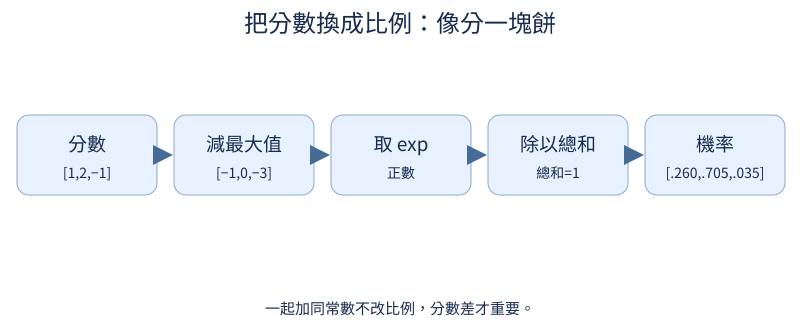

# 第 1 章：從猜下一個字開始

前置：讀過入門指南的 Python 與 tensor 部分即可。這一章只用幾個字；不要先開完整 Transformer。每段 code 都可單獨執行。

## 1.1 文字怎麼變成數字？

**先想一想：**如果把貓的 ID 改成 99，意思會變嗎？


電腦先處理編號，不直接處理字義。編號只是索引：「貓=0」不表示貓比狗小。反向表讓結果重新變成文字。

**把直覺寫成數學：**一個有限集合到整數的對應；這一步沒有可學參數。

**最小實驗：**以下程式只處理這節的問題。

```python
text = "貓看狗，狗看貓。"
chars = sorted(set(text))
to_id = {c: i for i, c in enumerate(chars)}
ids = [to_id[c] for c in text]
restored = "".join(chars[i] for i in ids)
print(to_id, ids, restored)
assert restored == text
```

**如何讀結果：**assert 檢查編碼再解碼仍是原文；排序只為讓每次編號可重現。

**只改一件事：**只交換兩個 ID，同時更新反向表，檢查還原是否不變。

## 1.2 記住資料等於學會嗎？

**先想一想：**同一句話重複三次，算三份新的驗證知識嗎？


先把整份文件分開，才從各自文件取窗口。若先切窗口，相鄰窗口很可能把同一句話送到兩邊，驗證就變成考背誦。

**把直覺寫成數學：**training 用來改參數；validation 用來選設定；test 留到最後。三者不是三種模型。

**最小實驗：**以下程式只處理這節的問題。

```python
from tiny_perceptron.data import split_documents

docs = ["貓看狗。", "狗看貓。", "鳥看魚。", "魚看鳥。", "貓看狗。"]
parts = split_documents(docs, seed=42)
print(parts)
assert not (set(parts["train"]) & set(parts["validation"]))
```

**如何讀結果：**先去完全重複，文件互不重疊；真實資料還需把改寫版本放在同一家族。

**只改一件事：**只加一份重複文件，觀察去重後的文件總數。

## 1.3 模型到底在猜什麼？

**先想一想：**X 和 Y 相同時，模型會被教成什麼？


把「貓看狗」看成兩個問題：看到貓，下一字是看；看到看，下一字是狗。最後一個字沒有下一字，除非我們另外放結束標記。

**把直覺寫成數學：**$X=[s_0,\ldots,s_{n-2}]$，$Y=[s_1,\ldots,s_{n-1}]$；兩者長度相同。

**最小實驗：**以下程式只處理這節的問題。

```python
s = list("貓看狗。")
x, y = s[:-1], s[1:]
print(list(zip(x, y, strict=True)))
assert len(x) == len(y)
```

**如何讀結果：**逐格列出問題與答案；shift 是資料對齊，和 attention mask 是不同工作。

**只改一件事：**只把 Y 改成原序列，指出第一個錯誤訓練目標。

## 1.4 不看上下文能怎麼猜？

**先想一想：**資料中有十隻貓、一隻狗，這個方法會偏向誰？



還沒看前文時，最合理的簡單猜法是照常見程度抽字。這是基準，幫我們知道加入上下文是否有用。

**把直覺寫成數學：**$p(c)=n_c/\sum_j n_j$。機率是非負且加總為 1 的數。

**最小實驗：**以下程式只處理這節的問題。

```python
from collections import Counter

counts = Counter("貓貓貓狗鳥")
probability = {c: n / sum(counts.values()) for c, n in counts.items()}
print(probability)
assert abs(sum(probability.values()) - 1) < 1e-6
```

**如何讀結果：**只知道整體頻率，無法區分「貓看」和「狗喫」後面需要不同字。

**只改一件事：**只增加狗的出現次數，重新估計分佈。

## 1.5 前一個字提供什麼資訊？

**先想一想：**貓之後常見「看」，狗之後常見「喫」，整體頻率能分清嗎？

bigram 就是相鄰的兩個字。每一列記錄「前一個字固定時，下一字各出現幾次」，所以每列要自己除以總數。

**把直覺寫成數學：**$p(j\mid i)=(n_{ij}+1)/(\sum_k n_{ik}+V)$；加 1 避免未見組合機率為零。

**最小實驗：**以下程式只處理這節的問題。

```python
text = "貓看狗。狗喫魚。貓看鳥。"
chars = sorted(set(text))
ids = [chars.index(c) for c in text]
counts = torch.ones(len(chars), len(chars))
for a, b in zip(ids[:-1], ids[1:]):
    counts[a, b] += 1
probability = counts / counts.sum(-1, keepdim=True)
print(chars, probability)
assert torch.allclose(probability.sum(-1), torch.ones(len(chars)))
```

**如何讀結果：**列是條件，欄是候選答案；加 1 是平滑，不是模型已理解語意。

**只改一件事：**只把平滑常數 1 改成 0.1，比較未見組合。

## 1.6 如何用參數表示預測偏好？

**先想一想：**改一列會影響所有輸入，還是隻影響那個輸入？

不直接存機率，改存可以自由調整的分數。每個輸入 ID 查出一列分數，再讓 softmax 轉成機率。這張表本身就是最小神經語言模型。

**把直覺寫成數學：**分數表 $W\in\mathbb R^{V\times V}$；輸入 $i$ 取第 $i$ 列，輸出有 $V$ 個分數。

**最小實驗：**以下程式只處理這節的問題。

```python
scores = nn.Embedding(3, 3)
with torch.no_grad():
    scores.weight.zero_()
    scores.weight[0, 1] = 2
print(scores(torch.tensor([0, 2])))
```

**如何讀結果：**Embedding 是查表，這裡不是輸入語意向量；兩個用途在第 2 章分開。

**只改一件事：**只改第 2 列，看第 0 列的輸出是否不變。

## 1.7 分數怎麼變成機率？

**先想一想：**所有分數加 100，會讓模型更有信心嗎？

softmax 把較高分數變成較高機率。所有分數一起加同一常數不改相對差異，因此不改分佈；先減最大值可避免 exponential 太大。

**把直覺寫成數學：**$p_i=e^{z_i-m}/\sum_j e^{z_j-m}$，$m=\max z$。

**最小實驗：**以下程式只處理這節的問題。

```python
z = torch.tensor([1.0, 2.0, -1.0])
p = (z - z.max()).exp()
p = p / p.sum()
print(p)
assert torch.allclose(p, z.softmax(0))
assert torch.allclose(p, (z + 100).softmax(0))
```

**如何讀結果：**只看分數差；總和約等於 1。浮點數計算用 allclose，不要求逐 bit 相同。

**只改一件事：**只提高第一個分數，預測另外兩個機率如何變。

## 1.8 猜錯要付出多少代價？

**先想一想：**正確機率從 0.5 升到 0.9，loss 應該上升嗎？

答案越不被相信，代價越大。cross-entropy 對一個確定答案就是正確答案機率的負對數；它不是「猜錯一次就扣一分」。

**把直覺寫成數學：**$L=-\ln p_y$；當 $p_y\to0$，loss 變大。使用自然對數時單位是 nats。

**最小實驗：**以下程式只處理這節的問題。

```python
p = torch.tensor([0.1, 0.5, 0.9])
print("正確機率", p, "loss", -p.log())
logits = torch.tensor([[0.0, 2.0, 0.0]])
assert torch.allclose(F.cross_entropy(logits, torch.tensor([1])), -logits.softmax(-1)[0, 1].log())
```

**如何讀結果：**同一批資料才適合直接比較；不同 tokenizer 的 token 平均值先不要混比。

**只改一件事：**只把正確類別換成分數最低者，觀察代價。

## 1.9 梯度代表多敏感？

**先想一想：**在 f(w)=(w-3)²、w=1，應向左還是向右走？


先把一個旋鈕稍微轉動，看 loss 變多少。梯度就是局部變化率：正號表示稍微增加參數會讓 loss 增加。

**把直覺寫成數學：**$f\prime(w)\approx[f(w+h)-f(w-h)]/(2h)$。太大的 h 不夠局部，太小會受數值捨入影響。

**最小實驗：**以下程式只處理這節的問題。

```python
def loss(w):
    return (w - 3) ** 2


w, h = 1.0, 0.001
gradient = (loss(w + h) - loss(w - h)) / (2 * h)
print(gradient, "解析值", 2 * (w - 3))
```

**如何讀結果：**負梯度表示把 w 增大會降低 loss；不是要求參數本身一定變成負數。

**只改一件事：**只改 h，比較估計誤差。

## 1.10 影響怎麼穿過多個運算？

**先想一想：**兩條變化率相乘，為什麼不是相加？

把整條計算看成兩個相連的局部變化：w 改一點，u 改多少；u 改一點，loss 改多少。乘起來就知道最終敏感度。

**把直覺寫成數學：**$u=2w$，$L=u^2$；$dL/dw=(dL/du)(du/dw)=2u\cdot2$。

**最小實驗：**以下程式只處理這節的問題。

```python
w = torch.tensor(3.0, requires_grad=True)
u = 2 * w
loss = u**2
loss.backward()
print("局部", 2 * u.detach(), 2, "合成", w.grad)
assert w.grad.item() == 24
```

**如何讀結果：**鏈式法則是 autograd 的基礎；backward 遍歷已建立的計算圖，不猜公式。

**只改一件事：**只把 u=2w 改為 u=3w，手算再核對。

## 1.11 參數往哪裡改？

**先想一想：**兩個參數對 loss 有不同影響，會收到相同梯度嗎？

requires_grad 把參數當成要追蹤的變量。forward 建立運算關係，backward 把最後 scalar loss 的敏感度傳回每個 leaf 參數。

**把直覺寫成數學：**gradient 的 shape 和參數相同：每一格都對應自己的偏導數。

**最小實驗：**以下程式只處理這節的問題。

```python
w = torch.tensor([1.0, 2.0], requires_grad=True)
loss = (w[0] - 3) ** 2 + 0.5 * w[1] ** 2
loss.backward()
print("參數", w.detach(), "梯度", w.grad)
assert torch.allclose(w.grad, torch.tensor([-4.0, 2.0]))
```

**如何讀結果：**grad 是 sensitivity，不是新的參數，也不是機率。

**只改一件事：**只改第二項係數，觀察哪一格梯度改變。

## 1.12 更新一次有什麼效果？

**先想一想：**負梯度配合減號，參數會變大還是變小？

要降低 loss，沿梯度反方向走一小步。這個一變量實驗只做一次更新，讓公式與程式對上；不跑模型訓練。

**把直覺寫成數學：**$w_{new}=w-\eta\nabla L(w)$；learning rate $\eta$ 決定走多遠。

**最小實驗：**以下程式只處理這節的問題。

```python
w = torch.tensor(1.0, requires_grad=True)
before = (w - 3).square()
before.backward()
with torch.no_grad():
    w -= 0.1 * w.grad
after = (w - 3).square()
print(float(before.detach()), float(after.detach()), w.detach())
assert after < before
```

**如何讀結果：**no_grad 是因為更新不是本次要微分的 forward；loss 降低不是對所有 learning rate 的保證。

**只改一件事：**只把 learning rate 改成 2，解釋可能跳過谷底。

## 1.13 第二次 backward 為什麼梯度變大？

**先想一想：**同一 loss 做兩次新的 forward/backward，grad 會一樣嗎？


PyTorch 的 grad 預設會累加，而不是每次覆蓋。這能刻意合併 micro-batch，但忘記清零就改了本來的更新規則。

**把直覺寫成數學：**$g_{stored}\leftarrow g_{stored}+g_{new}$；zero_grad 才把上一輪梯度清掉。

**最小實驗：**以下程式只處理這節的問題。

```python
w = nn.Parameter(torch.tensor(2.0))
(w**2).backward()
first = w.grad.clone()
(w**2).backward()
second = w.grad.clone()
w.grad = None
(w**2).backward()
print(first, second, w.grad)
assert torch.allclose(second, 2 * first)
```

**如何讀結果：**每次使用新的 forward 計算圖，沒有重用已釋放的圖。

**只改一件事：**只移除清零那一行，預測第三次的梯度。

## 1.14 如何接著寫下去？

**先想一想：**固定 seed 後重跑，能得到同一段文字嗎？

每抽出一個字，就把它當成下一次的前文。生成是把同一個「猜下一字」問題重複使用，不是一次吐出整篇文章。

**把直覺寫成數學：**bigram 生成 $s_{t+1}\sim p(\cdot\mid s_t)$；這裡用計數分佈，不需要訓練權重。

**最小實驗：**以下程式只處理這節的問題。

```python
chars = ["貓", "看", "狗", "。"]
p = torch.tensor([[0.05, 0.85, 0.05, 0.05], [0.4, 0.05, 0.5, 0.05], [0.05, 0.7, 0.05, 0.2], [0.5, 0.05, 0.4, 0.05]])
g = torch.Generator().manual_seed(42)
current = 0
output = [chars[current]]
for _ in range(12):
    current = torch.multinomial(p[current], 1, generator=g).item()
    output.append(chars[current])
print("".join(output))
```

**如何讀結果：**隨機抽樣可以有不常見結果；短字串通順不代表模型理解世界。

**只改一件事：**只改 seed，保持 p 不變。

## 1.15 同一模型為什麼會寫出不同答案？

**先想一想：**增加溫度會讓最大候選更佔優勢嗎？

greedy 永遠取最大機率；sampling 保留其他候選。temperature 改變分佈尖銳程度，沒有更改權重，因此不是性格訓練。

**把直覺寫成數學：**$p_i(T)=softmax(z/T)_i$，$T>0$；$T$ 小接近 greedy，大則較平坦。

**最小實驗：**以下程式只處理這節的問題。

```python
z = torch.tensor([3.0, 1.0, 0.0])
for temperature in (0.5, 1.0, 2.0):
    print(temperature, (z / temperature).softmax(0))
print("greedy", z.argmax().item())
```

**如何讀結果：**比較行為微調時固定抽樣設定，避免把抽樣變化當成訓練效果。

**只改一件事：**只把最後一個分數提高，比較三個溫度。
