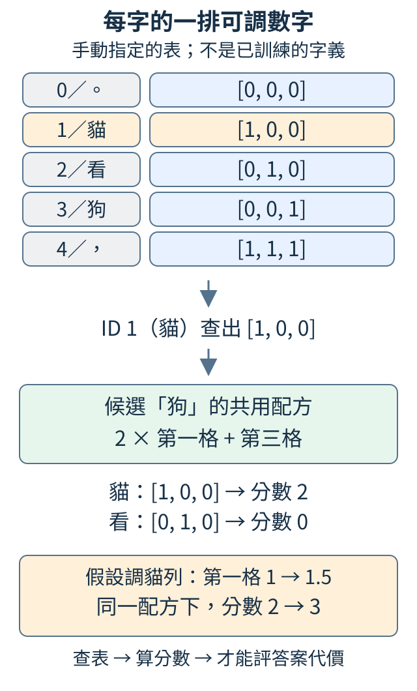
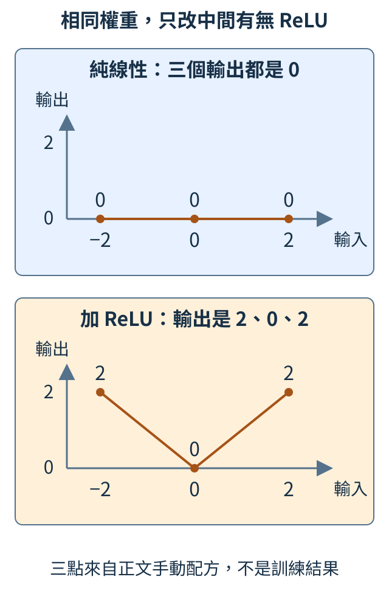
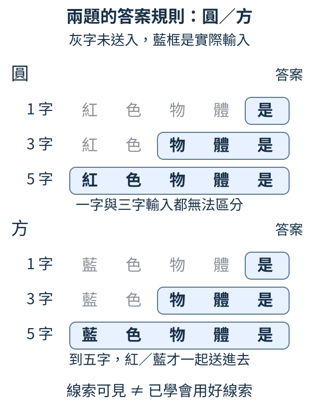

# 第 2 章：讓模型看更長的上下文

「顏色=」與「形狀=」都以等號結尾，上一章的接字表卻只收到這個等號。本章把更多前文送進猜字計算：每字先查一排可調數字，按位置接起來，再用可調配方算新特徵與候選分數。我們會分清「線索已經送進去」與「模型真的用好線索」。

## 2.1 每字的一排可調數字，為什麼能幫忙猜下一字？

上一章每字直接查出一整排候選分數。現在想讓幾個字共同參與預測，先替每字準備一小排可調數字，後面再用共用配方將這些數字變成候選分數。這排中間數字叫**特徵向量**：向量是一排數，特徵是供後續計算使用的線索，不必每格都有「動物」這類人類名稱。

為了手動填一張五列的特徵表，本節使用新的列順序：0 是句號、1 是貓、2 是看、3 是狗、4 是逗號。ID 仍只是選列約定；接下來的文字與 ID 都按這張表對應。每字先存三數；看到「貓看貓」，就按 `[1,2,1]` 查三次。

| ID／字 | 本節手動指定的三個特徵 |
| --- | --- |
| 0／。 | `[0,0,0]` |
| 1／貓 | `[1,0,0]` |
| 2／看 | `[0,1,0]` |
| 3／狗 | `[0,0,1]` |
| 4／， | `[1,1,1]` |

為什麼不直接用 ID？ID 只選列，數字 1 或 2 本身不代表字義；另外存一排參數，才讓訓練能改「這個字提供哪些數字」，又不改編碼約定。這張表與查出的表示叫 **embedding**，即嵌入表示。

```python
import torch
from torch import nn

embedding = nn.Embedding(5, 3)
with torch.no_grad():
    embedding.weight.copy_(
        torch.tensor(
            [
                [0.0, 0.0, 0.0],
                [1.0, 0.0, 0.0],
                [0.0, 1.0, 0.0],
                [0.0, 0.0, 1.0],
                [1.0, 1.0, 1.0],
            ]
        )
    )
ids = torch.tensor([[1, 2, 1]])
x = embedding(ids)
print(x.shape)
print(x)
assert torch.equal(x[0, 0], x[0, 2])
```

輸出是 `[1,3,3]`：一筆、三位置、每位置三特徵；三排依序是 `[1,0,0]`、`[0,1,0]`、`[1,0,0]`。兩次貓使用同一列，所以 `torch.equal` 的檢查成立。

查表後還要做什麼？先看一個額外的手算配方，並未放進上面的程式：假設候選「狗」的分數為 `2×第一格+第三格`。貓的 `[1,0,0]` 會算出 2，看的 `[0,1,0]` 會算出 0。同一配方遇到不同字，就因查出的特徵不同而給不同分數。



圖的上半是查表，下半接到剛才的候選配方。假設稍後把貓列第一格由 1 調成 1.5，狗分數會由 2 變 3；調那個配方的乘數也會改分數。模型便能同時調字表與後續配方，讓正確下一字取得更高機率。這裡只是說明數字如何影響預測，沒有用這個假設證明訓練已成功。

真正訓練時，答案代價的梯度沿運算關係傳回用到的表格列，再由更新步驟改表；只建立 `nn.Embedding` 不會自動學會關係。未手動填表時，它先從亂數開始。

練習將第二格 ID 2 改成 1，三個位置便都查出 `[1,0,0]`，形狀保持不變。同一字起始向量相同；加入鄰字與位置後，各位置的中間表示才可能不同。

<details>
<summary>補充與重做</summary>

查表工具見 [1.6](01.md#1.6)，梯度傳回與更新見 [1.10](01.md#1.10)、[1.12](01.md#1.12)，三個軸見 [W.3](../first-steps.md#W.3)。V 個字、每字 D 格的表有 V×D 個參數，D 不必等於候選數 V。上面的候選配方是手算示意，並非程式已建立的輸出層。

</details>

## 2.2 三個位置怎樣一起送進猜字計算？

假設前文是「我想喝」，我們想讓三字共同影響下一字。先約定 ID 1=我、2=想、3=喝，手動給它們兩個特徵：`[1,10]`、`[2,20]`、`[3,30]`。這些數字只是為了追蹤，不是在說「我」有十倍某種意思。

最直接的方法是按位置把三排接成一條長卡：

`我｜想｜喝 → [1,10｜2,20｜3,30]`

這叫**拼接**。如果換成「喝想我」，得到 `[3,30｜2,20｜1,10]`。數字沒有相加，順序沒有丟掉。後面的配方可為長卡每格配置不同乘數，因此第一個位置和最後一個位置能有不同作用。

```python
import torch
from torch import nn

embedding = nn.Embedding(4, 2)
with torch.no_grad():
    embedding.weight.copy_(torch.tensor([[0.0, 0.0], [1.0, 10.0], [2.0, 20.0], [3.0, 30.0]]))
ids = torch.tensor([[1, 2, 3], [3, 2, 1]])
x = embedding(ids)
context = x.reshape(2, -1)
print(x.shape)
print(context)
assert context.shape == (2, 6)
```

輸入有兩筆、每筆三位置，形狀 `[2,3]`；查表後每位置多兩個特徵，成 `[2,3,2]`。`reshape(2,-1)` 保留兩筆，把每筆六格依原順序排成一軸，輸出是：

```text
[1,10,2,20,3,30]
[3,30,2,20,1,10]
```

這裡 `-1` 要求按總格數推算長度：12 格分兩筆，就是每筆 6 格。reshape 只改排列的形狀，沒有產生新資訊。

如果筆數是 B、每筆看 C 個位置、每位置 D 格，便是 `[B,C,D]→[B,C×D]`。這次 B=2、C=3、D=2。C 越大，後面配方收到的格數越多，因此這種做法要先規定固定視窗長度；三字與五字長卡無法直接交給同一個固定輸入大小的配方。

練習只把第一筆改成 `[2,1,3]`，應得 `[2,20,1,10,3,30]`，第二筆不變。先逐段寫出再執行；光看總和無法分辨這次順序變化。

<details>
<summary>補充與重做</summary>

`no_grad()` 只包住手動填表，離開區塊後查表與拼接仍記錄求導關係，見 [1.12](01.md#1.12)。顯示的 `grad_fn=<ViewBackward0>` 是 reshape 的求導記錄；本節沒有求導或更新。視窗不足時的補齊與過長時的擷取，後面再處理。

</details>

## 2.3 一條長卡怎樣混成新的特徵？

拼接保留了各字特徵，但要猜下一字，還需要讓不同格共同影響結果。做法像配方：各輸入乘自己的權重，再加總；每套配方產生一個新數字。

先把長卡縮成三格 `[1,2,4]`，手算兩套：

| 配方 | 三個乘數 | 最後再加的偏移 | 輸出 |
| --- | --- | ---: | --- |
| 第一套 | `[1,0,2]` | 1 | `1×1+2×0+4×2+1=10` |
| 第二套 | `[0,-1,1]` | 0 | `1×0+2×(-1)+4×1=2` |

乘數叫**權重**，加總後再加的數叫**偏移**。它們都可調；本節先指定，看看程式是否得到 `[10,2]`。

```python
import torch
from torch import nn

layer = nn.Linear(3, 2)
with torch.no_grad():
    layer.weight.copy_(torch.tensor([[1.0, 0.0, 2.0], [0.0, -1.0, 1.0]]))
    layer.bias.copy_(torch.tensor([1.0, 0.0]))
x = torch.tensor([[1.0, 2.0, 4.0]])
y = layer(x)
manual = x @ layer.weight.T + layer.bias
print(layer.weight.shape, y)
assert torch.allclose(y, manual)
```

`nn.Linear(3,2)` 建立三格輸入、兩格輸出的線性層。`layer.weight` 是 `[2,3]`：每列一套配方，每套三個乘數；`bias` 則儲存兩個偏移。手動填入後，`layer(x)` 得到 `[[10,2]]`。

`manual=x @ layer.weight.T+layer.bias` 是同一運算的展開。`.T` 交換權重的列欄，使 `[1,3] @ [3,2]` 能把三格相乘加總，留下兩個輸出。若忘記轉置，這個非方形例子會直接顯示尺寸不符；方形表即使寫錯，也可能不報錯而算出另一套配方。

Linear 只沿最後一個特徵軸計算。輸入若是 `[2,4,3]`，它會讓每筆、每位置共用這兩套配方，輸出 `[2,4,2]`。若要混合整段前文，就先像上一節拼成長卡，再讓輸入格數等於 C×D；不會把不同筆材料混成一筆。

練習把第一套第三個乘數由 2 改成 3，第一輸出增加 4，第二不變，應得 `[[14,2]]`。這個具體差額比只看形狀，更能指出哪個參數影響哪個結果。

<details>
<summary>補充與重做</summary>

加權和與矩陣見 [W.5](../first-steps.md#W.5)。訓練會依答案代價調整 `weight` 和 `bias`，見 [1.11](01.md#1.11)、[1.12](01.md#1.12)；本例數字由人指定，沒有學習或能力評測。

</details>

## 2.4 為什麼多接線性配方仍不夠？

我們希望輸出「離零多遠」：輸入 -2、0、2，答案應是 2、0、2。單一加權公式 `y=k*x+b` 是一直線，無法同時透過這三點。

多接一個 Linear 也不自動解決。先乘 2 再乘 3 仍是乘 6；一般的兩套純線性加權與偏移也能合成一套。需要插入一個會轉折的規則，叫**非線性**。

本節用 **ReLU**：保留正數，把負數改為 0。先產生 x 與 -x 兩格，再比較直接相加和先做 ReLU 再相加：

| x | 中間 `[x,-x]` | 直接相加 | 清掉負數後相加 |
| --- | --- | ---: | ---: |
| -2 | `[-2,2]` | 0 | 2 |
| 0 | `[0,0]` | 0 | 0 |
| 2 | `[2,-2]` | 0 | 2 |

```python
import torch
from torch import nn
from torch.nn import functional as F

a = nn.Linear(1, 2, bias=False)
b = nn.Linear(2, 1, bias=False)
with torch.no_grad():
    a.weight.copy_(torch.tensor([[1.0], [-1.0]]))
    b.weight.copy_(torch.tensor([[1.0, 1.0]]))
x = torch.tensor([[-2.0], [0.0], [2.0]])
hidden = a(x)
linear = b(hidden)
curved = b(F.relu(hidden))
combined = x @ (b.weight @ a.weight).T
print(hidden)
print("純線性", linear.squeeze(-1))
print("加ReLU", curved.squeeze(-1))
assert torch.allclose(linear, combined)
```

`a` 用一格輸入生成兩格 `[x,-x]`，`b` 再把兩格相加。`bias=False` 省去偏移，只觀察乘數。

`combined` 另用合成配方核對這兩步。`@` 表示矩陣相乘；`b.weight @ a.weight` 把 b 的兩個乘數，分別乘上 a 產生兩格時的乘數，再相加。本例是 `[1,1]` 與 `[[1],[-1]]` 相乘，得到唯一乘數 `1×1+1×(-1)=0`，對應先產生 x 與 -x、再相加的抵銷。`.T` 把行列對調，讓合成權重配合 x 的「每排一筆輸入」排列；本例合成權重只有一行一列，對調後仍是 0。於是 x 乘合成權重的三項輸出全為 0，與逐層算出的 `linear` 相同；斷言核對這件事。

`F.relu(hidden)` 使中間三排變 `[0,2]`、`[0,0]`、`[2,0]`，因此 `curved` 得 `[2,0,2]`，正好是希望的答案。`squeeze(-1)` 只去掉長度為 1 的最後軸，讓列印更好讀。



圖中上方輸出是水平的 0，下方是 V 形。下方從 -2 到 0，每增加一單位輸入，輸出減一；從 0 到 2，輸出改為增加一。變化比例，也就是斜率，在兩段不同，這才是純 Linear 不能直接做到的規則。

這類層間轉換也叫**啟用函式**，只是計算名稱，不表示模型有意識。增加非線性讓更多規則可被表示，還需訓練才可能找到有用的權重。本節手動填配方，只展示「算得出什麼」。

練習把最後的輸入 2 改成 3，純線性仍輸出 0，ReLU 路徑輸出 3。再把 `F.relu(hidden)` 改回 `hidden`，確認它退回 0；真正增加轉折的是那個轉換。

<details>
<summary>補充與重做</summary>

`copy_` 在 `no_grad()` 區塊手動填權重，見 [1.12](01.md#1.12)。輸出附的 `grad_fn` 只標記矩陣乘法或 reshape 等計算關係，本節沒有 `backward()`、更新或泛化評測。

</details>

## 2.5 視窗多長，才把必要線索交給模型？

本節用一個小資料世界：紅色物體後接「圓」，藍色物體後接「方」。材料與答案是「紅色物體是→圓」和「藍色物體是→方」；這是例子的答案規則，不是說現實中顏色決定形狀。

如果只給最後一字「是」，模型收到完全相同的輸入，卻希望它分別答圓與方。再練多久也不能知道這一回是哪種顏色。因此先問：關鍵的紅或藍，有沒有送進去？

預測時能使用的前文叫**上下文**；實際取出最近幾個位置的範圍叫**視窗**。下面只整理材料，沒有訓練。

```python
examples = [("紅色物體是", "圓"), ("藍色物體是", "方")]
for length in [1, 3, 5]:
    visible = []
    for prefix, answer in examples:
        visible.append((prefix[-length:], answer))
    print(length, visible)
```

一字視窗的兩筆都是「是」，三字都是「物體是」；五字才分別得到「紅色物體是」與「藍色物體是」。四字也不夠，因為都剩「色物體是」。



圖中灰字沒有送入，藍框是實際輸入。相同輸入只能得到相同候選分配；模型能給圓、方各一些機率，卻無法根據不存在的顏色線索穩定挑對。五字則使兩題可區分，提供學會的機會，還不等於已經用好線索。

多看字也有成本。每字 D 格、視窗 C 字，拼接就有 C×D 格；若接 H 個輸出，每套配方要為每個輸入存乘數，因此需要 H×C×D 個權重。其他固定時，視窗翻倍會讓這部分權重翻倍。

現有另一個小實驗讓模型看 12 篇欄位短文，如「顏色=紅；形狀=圓。」。三個模型分別看最近 1、3、5 字，都使用相同 9 篇訓練、1 篇驗證，更新 200 次。它們先查表、拼接，再經線性與非線性層猜下一字；這樣的小網路叫**多層感知器**，簡稱 MLP。

| 可見視窗 | 參數格數 | 9 篇訓練平均代價 | 1 篇驗證平均代價 |
| --- | ---: | ---: | ---: |
| 1 字 | 833 | 0.33352 | 0.43103 |
| 3 字 | 1,345 | 0.21302 | 0.30577 |
| 5 字 | 1,857 | 0.19883 | 0.51252 |

從 1 字到 3 字，兩份代價都降低；到 5 字，訓練繼續改善，驗證卻升高。更多線索沒有保證新材料更好。而視窗變長時參數也增加，驗證只有一篇，這份結果不能證明所有任務三字最好。

練習把前文改成「紅色的小小物體是」與「藍色的小小物體是」，答案不變。整句八字，紅與藍在第一格；最近七字仍相同，八字才可區分。先手數再新增視窗 7、8 核對，把資訊是否可見與學習是否成功分開。

<details>
<summary>補充與重做</summary>

短文實驗使用特徵寬度 16、種子 42，完整切分、重做命令與另兩篇最後檢查見 [T.3](../training.md#T.3)。原來的曲線圖保留同一表格資料：[視窗訓練與驗證代價](../figures/window_training.svg)，橫軸是視窗，不是訓練時間。這組比較同時改了視窗與參數量；要回答嚴格的單因素因果問題，還需別的受控設計。

</details>
