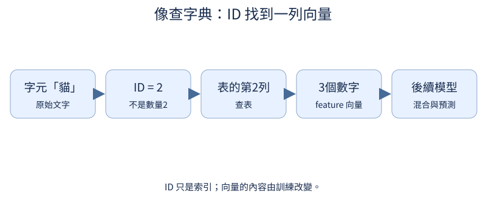
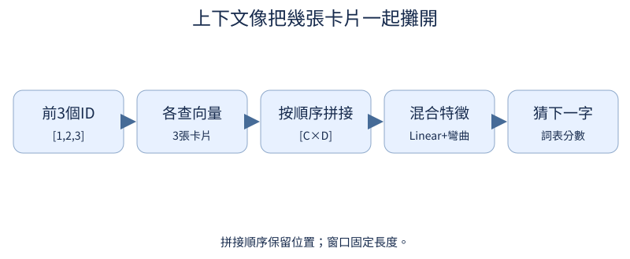

# 第 2 章：讓模型看更長的上下文

前置：第1章的索引、loss、梯度。這章只增加固定上下文，沒有 attention。向量是可以學習的數字列表，不是先驗語意標籤。

## 2.1 ID 怎麼變成可學習的特徵？

**先想一想：**同一 ID 在兩個位置，初始查表結果會不同嗎？



與第1章的 V×V 分數表不同，這裡每個字只取 D 個特徵；後面還有輸出層。特徵會隨任務梯度改變。

**把直覺寫成數學：**$E\in\mathbb R^{V\times D}$，輸入 ID 的 shape [B,T]，查表後 [B,T,D]。

**最小實驗：**以下程式只處理這節的問題。

```python
embedding = nn.Embedding(5, 3)
ids = torch.tensor([[1, 2, 1]])
x = embedding(ids)
print(x.shape, x)
assert torch.equal(x[0, 0], x[0, 2])
```

**如何讀結果：**還沒加位置資訊，相同 ID 的原始向量相同；上下文混合後可以不同。

**只改一件事：**只把 D 從 3 改為 4。

## 2.2 怎麼同時看前面幾個字？

**先想一想：**交換前兩個字會改變拼接結果嗎？



固定看前三個字，就把三個向量依順序接成一個長向量。順序由拼接位置保留，代價是 context 長度固定。

**把直覺寫成數學：**$[B,C,D]\to[B,C\cdot D]$；reshape 改擺法，不增加數值。

**最小實驗：**以下程式只處理這節的問題。

```python
ids = torch.tensor([[1, 2, 3], [3, 2, 1]])
embedding = nn.Embedding(4, 2)
context = embedding(ids).reshape(2, -1)
print(context.shape, context)
assert context.shape == (2, 6)
```

**如何讀結果：**B 是兩筆例子，C 是每筆可看字數，D 是特徵數，不要把軸名和數值混淆。

**只改一件事：**只交換第一筆的前兩個 ID。

## 2.3 怎麼混合上下文特徵？

**先想一想：**輸入3維、輸出2維，weight 是3×2還是2×3？

一個輸出 feature 是輸入各 feature 的加權和加偏置。Linear 可以對非方陣輸入運作；用非方陣最能暴露 transpose 寫反。

**把直覺寫成數學：**$y=xW^T+b$；PyTorch 的 weight 是 [out,in]，x 是 [B,in]。

**最小實驗：**以下程式只處理這節的問題。

```python
layer = nn.Linear(3, 2)
x = torch.tensor([[1.0, 2.0, 4.0]])
y = layer(x)
manual = x @ layer.weight.T + layer.bias
print(layer.weight.shape, y)
assert torch.allclose(y, manual)
```

**如何讀結果：**矩陣乘法內側維度相等：1×3 乘 3×2 得到1×2。

**只改一件事：**只改輸出維度，先預測每個 shape。

## 2.4 為什麼需要非線性？

**先想一想：**兩層 Linear 一定比一層有更多種函數嗎？

純 Linear 疊再多層，仍可合成一個 Linear。加入彎曲的 activation 才能表達輸入區域不同的規則。

**把直覺寫成數學：**$A(Bx+b)+a=(AB)x+(Ab+a)$；ReLU(x)=max(0,x) 無法整體寫成線性。

**最小實驗：**以下程式只處理這節的問題。

```python
a, b = nn.Linear(3, 4), nn.Linear(4, 2)
x = torch.randn(5, 3)
combined = x @ (b.weight @ a.weight).T + (b.weight @ a.bias + b.bias)
print("線性合成誤差", (b(a(x)) - combined).abs().max().item())
print("加入ReLU的改變", (b(F.relu(a(x))) - combined).abs().mean().item())
```

**如何讀結果：**非線性改變可表示的函數家族；增加參數不等於一定有更好的泛化。

**只改一件事：**只把 ReLU 改成 tanh。

## 2.5 記憶範圍怎麼影響預測？

**先想一想：**「紅色物體是圓」「藍色物體是方」，只看到「物體是」能答嗎？

如果答案取決於三格前的線索，只看最後一格的模型無法分辨兩個問題。先檢查資料可辨識性，再怪模型不會學。

**把直覺寫成數學：**若兩例的可見 X 完全相同、Y 卻不同，任何確定性模型都不能同時答對。

**最小實驗：**以下程式只處理這節的問題。

```python
examples = [("紅色物體是", "圓"), ("藍色物體是", "方")]
for length in (1, 3, 5):
    print(length, [(prefix[-length:], answer) for prefix, answer in examples])
```

**如何讀結果：**足夠上下文是必要條件，不是學會規則的保證；增加窗口也增加輸入層參數。

**只改一件事：**只把區別詞放得更遠，找最小可辨識窗口。
