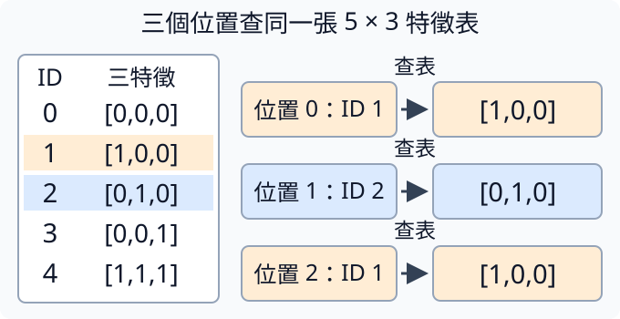
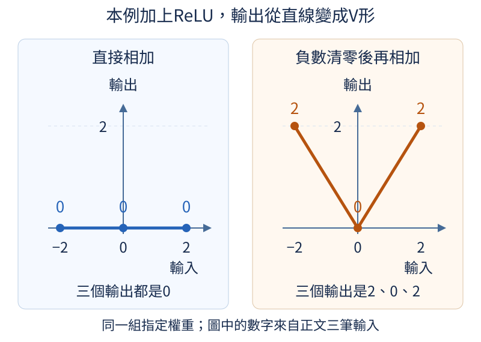
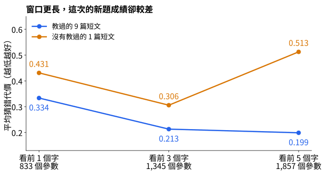

# 第 2 章：讓模型看更長的上下文

上一章只看前一個字，很容易把需要不同答案的句子混在一起。本章先把每個字表示成一排可調數字，再依順序把幾個位置接起來，讓模型能從更長的前文找線索。我們會一步一步看見查表、拼接、加權混合與彎曲的計算各做了什麼，最後用兩個看似相同的問題檢查：有些錯誤不是學得太慢，而是模型根本沒收到能區分答案的資訊。

## 2.1 ID 怎麼變成可學習的特徵？

[1.6](01.md#1.6) 讓每個字查出一整排下一字分數，看到貓就只套用貓那列的規則。如果我們想同時看三個字，並讓它們的資料一起參與計算，就需要另一種中間表示：每個字先查出一小排描述它的數字，後面再把這些數字混合，最後才算候選分數。這小排數字叫特徵向量；向量是一排數，特徵表示它提供後續計算使用的資訊，不一定有「是否動物」這樣的人類名字。

ID 只是字的位置約定，不能直接把貓的ID3乘兩倍當成貓的特徵。我們另外建立一張可調表，每個ID對上一列D個數，叫 embedding（嵌入表示）。字表V個字，表的形狀就是 `[V,D]`；D可以比V小很多。與第1章直接輸出V個候選分數不同，這些D個數還要經過其他層才能回答下一字。

下面先手動指定五列、每列三數，避免把初始亂數誤讀成固定字義。輸入 `[[1,2,1]]` 表示一筆文字、三個位置，第1與第3位置用了同一個ID。tensor軸背景見 [W.3](../first-steps.md#W.3)。

```python
import torch
from torch import nn

embedding = nn.Embedding(5, 3)
with torch.no_grad():
    embedding.weight.copy_(
        torch.tensor(
            [
                [0.0, 0.0, 0.0],
                [1.0, 0.0, 0.0],
                [0.0, 1.0, 0.0],
                [0.0, 0.0, 1.0],
                [1.0, 1.0, 1.0],
            ]
        )
    )
ids = torch.tensor([[1, 2, 1]])
x = embedding(ids)
print(x.shape)
print(x)
assert torch.equal(x[0, 0], x[0, 2])
```

`nn.Embedding(5,3)` 建立可學習查表層；`weight` 儲存表格，手動抄入的數字只是本次例子。`embedding(ids)` 對每個位置找出那一列，輸出形狀為 `[1,3,3]`：一筆、三位置、每位置三特徵。三列向量依序是 `[1,0,0]`、`[0,1,0]`、`[1,0,0]`。最後的 `torch.equal` 檢查兩次ID1確實取到完全相同的數值。

下圖左側是同一張五列三欄的表，右側三個位置各查一次。橘色對應ID1，藍色對應ID2；向右箭頭只是查出那列，不是把ID乘成向量。右上與右下同樣得到 `[1,0,0]`，說明第0與第2位置用相同ID，就共用同一列參數。



它為什麼叫可學習？因為這張 `weight` 是參數，後面混合特徵、計算答案代價後，梯度能沿 [1.10](01.md#1.10) 的運算關係傳回用到的表格列，再按 [1.12](01.md#1.12) 更新。若沒有像本例手動抄入數字，`nn.Embedding` 預設先填入亂數，這些初始數字還沒有從訓練文字中學到字的關係。亂數的大小由初始化方法決定，不能一概當成很小；逐步調過後，相似任務中有用的關係才可能體現在向量裡。不是先把「貓很像狗」寫成標籤塞進去。

此時相同ID在任何位置仍查到同一個原始向量。兩次「看」放在不同句子中，先查出的向量一樣；當後面加入鄰字和位置資訊，兩個位置的中間表示才可能不同。要區分字的初始embedding與經過上下文混合的表示，別因某層輸出不同就以為查表也變了。

練習只把輸入第二格ID2改成ID1，先預測三個位置的向量都會相同，再執行核對形狀仍 `[1,3,3]`、三格均 `[1,0,0]`。這次只改查哪列，沒有改表；下一節會保留這三個位置的順序，讓它們一起提供預測資訊。

## 2.2 怎麼同時看前面幾個字？

看到「我想喝」和「我想看」，即使最後一字不同，前面兩個字也能提供線索。上一章每次只查目前一字，現在要讓一個問題同時帶入前三個位置。[2.1](#2.1) 已經把每個字查成特徵向量；最直接的做法是不先混合，而是按順序把三排數字接成一長排。這叫拼接（concatenation），像把三張有固定欄位的小卡貼在同一張長卡上。

用每字兩個特徵的玩具表，ID1對應 `[1,10]`，ID2是 `[2,20]`，ID3是 `[3,30]`。第一筆前文ID順序是1、2、3，拼成 `[1,10,2,20,3,30]`；第二筆3、2、1則拼成 `[3,30,2,20,1,10]`。沒有把數字相加，也沒有丟掉順序。後面會用一個混合步驟，讓各格乘上各自可調的數字再相加；這些可調數字叫權重，下一節會逐步展開這個混合步驟。不同輸入位置使用不同權重，因此最前面字的兩格與最後面字的兩格可以有不同作用。

```python
import torch
from torch import nn

embedding = nn.Embedding(4, 2)
with torch.no_grad():
    embedding.weight.copy_(torch.tensor([[0.0, 0.0], [1.0, 10.0], [2.0, 20.0], [3.0, 30.0]]))
ids = torch.tensor([[1, 2, 3], [3, 2, 1]])
x = embedding(ids)
context = x.reshape(2, -1)
print(x.shape)
print(context)
assert context.shape == (2, 6)
```

`with torch.no_grad():` 包住手動設定表格的部分，讓 `copy_` 把指定數字抄入可調表格時，不將這次原地設定記錄成求導運算；這與[1.12的參數更新範圍](01.md#1.12)同樣用來允許直接修改參數。離開縮排後，查表和拼接會照常記錄求導關係。

輸入 `ids` 形狀 `[2,3]`，表示兩筆、每筆三位置。查表後是 `[2,3,2]`，每位置多了一排兩個特徵。`reshape(2,-1)` 保留兩筆，把每筆剩下的格子依原順序排成一軸；這裡的-1不是最後一軸索引，而是要求PyTorch由總格數推算該軸長度。總共有12個數，分兩筆，因而自動算出每筆6格。輸出正是前段兩條長卡。列印的 `grad_fn=<ViewBackward0>` 是PyTorch附上的求導關係名稱，記住 `context` 如何由查表結果重新分組，日後求梯度可以沿這條關係傳回表格；此處尚未呼叫 `backward()` 或更新參數。

把形狀寫成 `[B,C,D] → [B,C×D]`，B是同時有幾筆例子，C是每筆能看的位置數，D是每位置特徵數。三個字母不是特定數值，更不是PyTorch指令；這次B=2、C=3、D=2。reshape只改分組，不創造特徵，軸的背景可回看 [W.3](../first-steps.md#W.3)。

這個做法的限制也是它的優點：每個位置有固定欄位，容易追蹤，但前文長度C要先決定。若一會給三字、一會給五字，長卡格數不同，後面的混合計算無法直接共用同一個輸入大小。可以先規定固定窗口，太長只取最近C個位置，太短則補齊；補齊策略會在第7章仔細講。這裡用兩筆恰好三字，不把新問題混進例子。

練習只把第一筆改成 `[2,1,3]`，先寫出預期長卡 `[2,20,1,10,3,30]`，再跑核對。第二筆應原封不動，形狀仍 `[2,6]`。如果你只看總和，兩種順序可能一樣；直接看分段位置，才知道拼接保留了哪些資訊。

## 2.3 怎麼混合上下文特徵？

[2.2](#2.2) 把前文的數字按位置排好，但還沒讓它們互相影響。現在像調飲料配方一樣，每種材料給一個權重，乘完再相加；一種配方產生一個輸出特徵，多種配方就產生一排新特徵。這樣模型纔有機會把「前面出現我、最後出現喝」兩條線索放在同一個計算裡，而不是隻保存兩張卡。

本節先縮小成三個輸入特徵 `[1,2,4]`，做兩套配方。第一套權重 `[1,0,2]`、偏移1，結果為 `1×1+2×0+4×2+1=10`；第二套 `[0,-1,1]`、偏移0，結果為 `0-2+4=2`。偏移量（bias）是一個不看輸入也會加上的常數。加權和與矩陣背景見 [W.5](../first-steps.md#W.5)。

```python
import torch
from torch import nn

layer = nn.Linear(3, 2)
with torch.no_grad():
    layer.weight.copy_(torch.tensor([[1.0, 0.0, 2.0], [0.0, -1.0, 1.0]]))
    layer.bias.copy_(torch.tensor([1.0, 0.0]))
x = torch.tensor([[1.0, 2.0, 4.0]])
y = layer(x)
manual = x @ layer.weight.T + layer.bias
print(layer.weight.shape, y)
assert torch.allclose(y, manual)
```

輸入x是一筆三特徵，形狀 `[1,3]`。`nn.Linear(3,2)` 建立三個輸入、兩個輸出的線性層，保存兩套可調權重。我們手動設定數字，輸出便可精確核對為 `[[10,2]]`。`manual` 是同一件事的展開：`@` 將對應特徵相乘再加總，`.T` 把權重表的列欄交換，最後每筆加同一套偏移。

為什麼需要轉置？PyTorch保存的權重是 `[out,in]`，也就是 `[2,3]`：每列一套輸出配方，每列包含三個輸入權重。左邊x是 `[1,3]`，相乘的內側格數必須相等，所以右邊要轉成 `[3,2]`，結果纔是 `[1,2]`。這個非方陣例子能讓轉置方向看清楚；若都用3×3，有時寫反也不會形狀報錯，卻算出另一套配方。

Linear沿輸入的最後一個特徵軸工作，前面的筆數和位置分組保留。例如 `[2,4,3]` 交給這層會變 `[2,4,2]`，每個位置都共用同一套三到二的配方。如果想混合 [2.2](#2.2) 的整段前文，則先拼成長卡，再讓Linear的輸入數等於C×D。這裡「混合」不是把所有筆資料混在一起，而是每筆各自使用同樣的規則。

目前例子的數字由人指定，後續訓練會依答案代價調整 `weight` 與 `bias`，求導與更新的前置見 [1.11](01.md#1.11) 和 [1.12](01.md#1.12)。多一層只表示多一套可調計算，效果仍要用沒拿來訓練的資料驗證。

練習只把第一套配方的第三個權重從2改成3，先預測第一個輸出增加4而第二個不變，再執行核對應為 `[[14,2]]`。這次用具體數值追蹤「哪個參數影響哪個輸出」，比只看新的shape更能理解計算。

## 2.4 為什麼需要非線性？

如果一套配方只能把輸入乘權重再相加，多接一套配方是否就能做到更多事？不一定。假設第一套把x變成2x，第二套再乘3，合起來仍只是6x。即使中間用了多個特徵、加了偏移，兩層純Linear仍可合成一層Linear。這不是說多層程序沒執行，而是它能表示的規則沒有離開同一類加權配方。

有些規則需要輸入處於不同區域時做不同處理。比如我們要量「離零有多遠」，x=-2與x=2都應輸出2，x=0輸出0；任何單一的 `y=k*x+b` 都不能把這三點同時連上。因此需要一個會拐彎的運算，叫非線性（nonlinearity）。常用的ReLU會保留正數、把負數改成0：`ReLU(x)=max(0,x)`；它也叫激活函數（activation），表示夾在層與層之間的數值轉換，不是模型有意識地被激活。

下面用 [2.3](#2.3) 的Linear建立兩條中間線索x與-x，再看「直接相加」和「負的先清零再相加」會差多少。輸入三筆，分別為-2、0、2，每筆一特徵。

```python
import torch
from torch import nn
from torch.nn import functional as F

a = nn.Linear(1, 2, bias=False)
b = nn.Linear(2, 1, bias=False)
with torch.no_grad():
    a.weight.copy_(torch.tensor([[1.0], [-1.0]]))
    b.weight.copy_(torch.tensor([[1.0, 1.0]]))
x = torch.tensor([[-2.0], [0.0], [2.0]])
hidden = a(x)
linear = b(hidden)
curved = b(F.relu(hidden))
combined = x @ (b.weight @ a.weight).T
print(hidden)
print("純線性", linear.squeeze(-1))
print("加ReLU", curved.squeeze(-1))
assert torch.allclose(linear, combined)
```

`with torch.no_grad():` 暫停這個縮排區塊裡的求導記錄，讓我們用 `copy_` 手動填入權重；它只影響填表的兩行，離開區塊後仍會記錄模型計算。求導是計算參數變動對結果有多敏感，這個操作範圍可詳讀 [1.12](01.md#1.12)；本節沒有求導或更新，只比較指定權重能算出哪些規則。

`bias=False` 省去偏移，讓例子只看權重。`hidden` 依序是 `[-2,2]`、`[0,0]`、`[2,-2]`。直接交給b，每列兩數相加，三個輸出全為0；合成權重 `b.weight @ a.weight` 也是0。`squeeze(-1)` 只去掉長度1的最後軸，方便印成一排三個結果。畫面中的 `tensor(...)` 是數值容器的顯示格式，先核對方括號裡的數字；有些零會顯示為 `-0.`，在本例的數值比較中仍等於 0。附帶的 `grad_fn=<MmBackward0>` 或 `grad_fn=<SqueezeBackward1>` 是工具保存的計算記錄標記，分別表示矩陣相乘或去掉軸的運算，並不改變這裡列出的數字。

最後的 `torch.allclose` 逐格比較 `linear` 與 `combined` 是否在容許的小數誤差內相同，相符時回傳 `True`，也就是「成立」。`assert` 要求這個比較成立：通過時不印字，所以正常執行只看到前面三次列印；不成立時會報 `AssertionError` 並停止程式。這次檢查通過，配合合成權重的計算，核對了兩層純線性在這組輸入上與一層相同。

加入 `F.relu` 後，三列變成 `[0,2]`、`[0,0]`、`[2,0]`，相加得到 `[2,0,2]`，正好表現距離零的大小。斜率描述輸入增加一單位時，輸出改變多少：左段輸入從-2增加到0，輸出從2降到0，每增加1就減少1；右段輸入從0增加到2，輸出從0升到2，每增加1就增加1。左右兩段的斜率分別為-1與1，一個固定加權的Linear無法同時表示這兩種變化。實際模型可以增加中間的特徵數，也可以選用其他非線性轉換，但這個三點例子已把「多層配方」與「增加能拐彎的規則」分清。

下面把輸入排成橫向，把對應輸出的大小畫成縱向。左圖的三個藍點都在0；右圖的三個橘點是2、0、2，連起來呈V字形。兩邊使用同一組權重，差別是右邊先把中間特徵的負數清零，再交給下一層相加。



非線性增加可表達的規則，不保證訓練一定找到好規則，也不保證新資料表現更好。參數更多、規則更多時，仍要按 [1.2](01.md#1.2) 留驗證資料。這裡沒有訓練，只是親手設定兩套權重說明什麼計算是可能的。

練習只把最後輸入2改成3，先預測純線性仍0、ReLU輸出3，再執行核對。接著把 `F.relu(hidden)` 改成 `hidden`，確認它退回純線性結果。這兩次操作讓你定位真正改變行為的是哪一行，而不是看到層數增加就猜能力也必然增加。

## 2.5 記憶範圍怎麼影響預測？

兩句前文是「紅色物體是」與「藍色物體是」，希望分別接「圓」與「方」。如果只把最後一字「是」交給模型，兩題輸入完全一樣，答案卻不同。即使訓練很久，它也無法知道這一回究竟是哪種顏色：關鍵資訊從來沒有傳進去。先檢查可見資料，往往比先把模型加大更有用。

上下文（context）指預測當前字時能夠使用的前文，窗口（window）則是我們實際取出的有限範圍。[2.2](#2.2) 把窗口內的字拼成固定長卡，所以窗口越長，可能保留更遠的線索；但眼前要知道多長才夠，而不是假定越長越好。

```python
examples = [("紅色物體是", "圓"), ("藍色物體是", "方")]
for length in [1, 3, 5]:
    visible = []
    for prefix, answer in examples:
        visible.append((prefix[-length:], answer))
    print(length, visible)
```

輸入是兩組「前文、答案」，用Python的兩項小組（tuple）保存；圓括號裡兩項的次序固定。每輪 `length` 指模型可見最近幾字。`prefix[-length:]` 從倒數第length個位置取到最後，這是 [1.3](01.md#1.3) 切片的延伸，不是反過來讀文字。`visible` 逐筆保存目前能見到的片段與應答。

輸出第一輪是 `('是','圓')` 與 `('是','方')`；第三字窗口則都是 `物體是`，仍不能區分。五字窗口纔看到完整的 `紅色物體是` 與 `藍色物體是`。模型給相同輸入就只能算出相同的一套候選分配；它可以同時給圓與方各一些機率，卻不能在沒有顏色線索時穩定挑對每題的唯一答案。隨機選擇也不會憑空補回被刪掉的資訊。

這叫可辨識性問題：資料中是否有足以區分答案的線索。對這兩題，四字窗口其實也不夠，因為 `色物體是` 仍相同；必須到五字。反過來，即使五字已能辨識，也只是「有機會學」，不是「一定已學會」。模型如何用顏色建立規則、訓練資料是否夠、是否記住了特例，仍要另外驗證。

擴大固定窗口還會增加計算與參數。若每字D個特徵、窗口C字，拼接後有C×D個輸入。Linear（線性層）用各輸入乘權重再相加來混合特徵，每個輸出有自己的一套權重，還可另加一個可調常數。接H個輸出就需要H×C×D個權重，因為「每個輸出都為每個輸入保存一個權重」；例如D=2、C從3變6，其他固定，輸入層權重也翻倍。更長窗口有代價，要用任務中線索的距離判斷是否值得。

那麼，真的多看幾字就會猜得更好嗎？我們另外用12篇「顏色=紅；形狀=圓。」這類規則短文，讓三個小模型分別看最近1、3、5字。每個模型先查表、拼接，再把結果交給多層小網路猜字。這種由線性層與非線性轉換串成的網路，叫多層感知器（multilayer perceptron，MLP）；非線性讓它能表示[2.4](#2.4)講過的彎曲規則。三個模型都用相同的9篇練習、相同的1篇驗證短文，以及種子42、特徵寬度16，更新200次。下表是更新完成後重新計算的平均下一字代價；數字越低，代表這批文字的正確下一字獲得越高機率。

| 可見窗口 | 參數格數 | 教過的9篇：訓練代價 | 未教過的1篇：驗證代價 |
| --- | ---: | ---: | ---: |
| 1字 | 833 | 0.33352 | 0.43103 |
| 3字 | 1,345 | 0.21302 | 0.30577 |
| 5字 | 1,857 | 0.19883 | 0.51252 |

從1字改成3字，這次訓練與驗證的代價都降低了；再改成5字，教過的短文代價繼續降低，那篇新短文卻從0.30577升到0.51252。更多線索只是讓模型有機會學得更好，沒有保證它會把所學用在新句子上。如果只看練習過的題目，我們就會漏掉這個差別。



圖中的橫軸是窗口長度，兩條線分別連起表裡的訓練與驗證代價，並不是訓練隨時間的變化。還要記得，窗口加長時，參數也從833增至1,857，因此這不是只改可見範圍、其他完全相同的比較。而驗證只有一篇「顏色=紅；形狀=圓。」，不能由它宣布所有任務都以3字最好。這次實驗支持的是：先把需要的線索送進去，再用未教過的題目檢查，別只追訓練代價。[T.3](../training.md#T.3)保留完整切分、重做命令及另外兩篇最後檢查的結果。

練習把兩句前文改成「紅色的小小物體是」與「藍色的小小物體是」，保持答案不變。先手數顏色區別字離末尾多遠，再加入窗口長度8、7進行核對；區別紅與藍的是第一個字，整句八字，所以八字能區分、七字仍不能。你不是在訓練模型，而是在確認題目有沒有把所需線索交出去。
