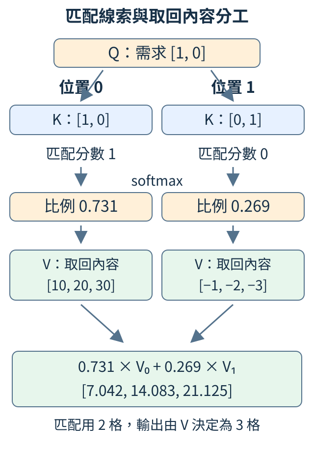
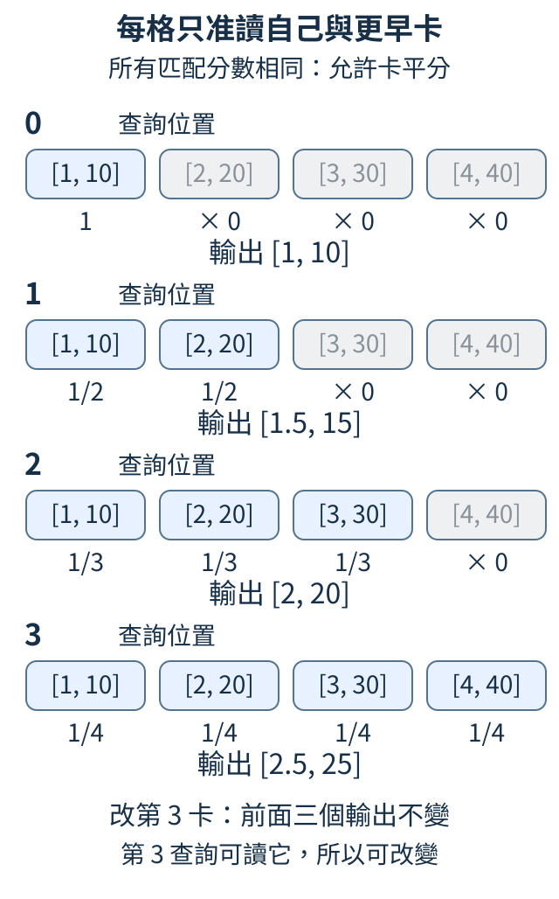
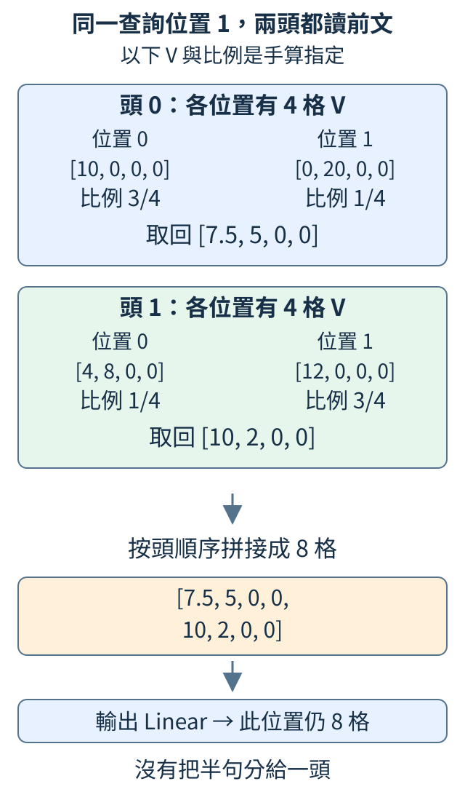

# 第 3 章：注意力，按內容決定讀哪些位置

「紅色物體是」與「藍色物體是」的答案差在前面的顏色。固定視窗把線索送進去後，模型還需要決定哪些位置該讀多些。本章先把幾張數字卡按比例混成一張，再用內容算比例，分清「提出需求、匹配位置、取回內容」三個角色，最後限制不能讀未來，並讓幾種讀法同時工作。

## 3.1 幾個位置的資訊，怎樣按比例混在一起？

兩個位置的數字卡分別是 `[2,0]` 和 `[0,4]`。希望多用第一張時，可以取第一張九成、第二張一成：第一格得 `0.9×2+0.1×0=1.8`，第二格得 `0.9×0+0.1×4=0.4`。

這叫**加權平均**。每張卡乘自己的比例，再逐格相加；比例非負、總和為 1，結果便是各卡的混合。它與把卡片原封拼接不同：兩張兩格卡混完，只剩一張兩格卡 `[1.8,0.4]`。

```python
import torch

values = torch.tensor([[2.0, 0.0], [0.0, 4.0]])
weights = torch.tensor([0.9, 0.1])
output = weights @ values
print(output)
assert torch.allclose(output, torch.tensor([1.8, 0.4]))
```

`values` 每列是一個位置，`weights` 為每位置指定比例；`@` 把相同特徵欄加權相加。輸出與手算一致，斷言核對兩格。

**注意力**（attention）的核心讀取動作就是這種按比例混合。這裡還是由人指定 0.9、0.1；下一節才讓內容決定比例。注意力不一定只挑一個位置，本例兩張都有參與。

比例較大也不直接代表帶回數值較大。例如同一格中 `0.9×1=0.9`，而 `0.1×100=10`。需要一起看比例與內容；更不能只憑比例宣佈模型理解某個概念。本節的兩格沒有固定語意，只是手算材料。

練習交換比例成 `[0.1,0.9]`，預期輸出 `[0.2,3.6]`，將斷言同步修改再核對。你改的是讀法，兩張來源卡沒有改。

<details>
<summary>補充與重做</summary>

一般 Linear 權重可負、也不必加總為 1；這裡的讀取比例遵守機率式分配。矩陣與特徵軸見 [W.3](../first-steps.md#W.3)、[W.5](../first-steps.md#W.5)。`allclose` 只作數值核對，本例沒有可調參數或訓練。

</details>

## 3.2 能不能根據當前需求，改變讀取比例？

剛才九成與一成是人指定的。現在準備一個「目前要找什麼」的數字卡 `[1,0]`，以及三個候選位置的線索 `[1,0]`、`[0,1]`、`[-1,0]`。我們希望第一個位置匹配最高，第二個其次，第三個最低，讓讀取隨需求改變。

需求卡叫 **query**，縮寫 q；候選的匹配卡叫 **key**。像用需求對照書目，但這裡每張都是實際數字，而不是人寫的關鍵詞。兩格僅是手動例子，不宣稱第一格代表顏色。

匹配方法是對應格相乘再相加，叫**點積**：三個分數依序是 `1×1+0×0=1`、0、-1。再用上一章的 softmax 將分數變成非負、總和為 1 的讀取比例。

```python
import torch

q = torch.tensor([1.0, 0.0])
keys = torch.tensor([[1.0, 0.0], [0.0, 1.0], [-1.0, 0.0]])
scores = q @ keys.T
weights = scores.softmax(dim=0)
print(scores)
print(weights)
```

`q @ keys.T` 得 `[1,0,-1]`；交換 key 的列欄，讓一次乘法算三個匹配。比例約 `[0.665,0.245,0.090]`。第一個最多，另外兩個仍有份。

若需求改 `[0,1]`，分數變 `[0,1,0]`，第二個位置取得最多。候選位置沒有改，偏好已因需求改變；這就是用內容決定讀法。

點積也受數字大小影響。將第一個 key 改 `[2,0]`，方向沒變，對 `[1,0]` 的分數卻變 2。它不是只量方向的相似度，稍後還要控制分數尺度。

練習先改 q 成 `[0,1]`，核對第二個最高；再只把第三個 key 改成 `[-1,1]`，後兩者都得 1，各分到約 0.422。需求和候選線索都能改比例。

<details>
<summary>補充與重做</summary>

本節只算匹配與比例，沒有取回內容，也先不限制讀哪些位置。分數尚未除以特徵數平方根；[3.5](#3.5) 再加入尺度規則，[3.6](#3.6) 加入防偷看許可。softmax 見 [1.7](01.md#1.7)。

</details>

## 3.3 同一個位置，為什麼要有查詢與匹配兩份表示？

一個位置既會問「我現在需要哪些線索」，又會成為別的位置可讀的資料。這兩份工作不必用同一套數字：**query 表示提出需求，key 表示提供匹配線索**，所以模型為它們準備不同的可調配方。

例如已有特徵 `[1,2]`，手動指定 query 配方保留兩格，key 配方交換兩格，就分別得到 `[1,2]` 與 `[2,1]`。它們來自同一份資訊，卻可因不同配方扮演不同角色。這是數字轉換，並不是先為位置貼上某個文法標籤。

下面先直接給轉換後的卡：兩個查詢與三個候選。所有查詢排成表 Q，所有 key 排成表 K。希望每個查詢各自比較全部三候選，得到兩列三欄的分數。

```python
import torch

q = torch.tensor([[1.0, 0.0], [0.0, 1.0]])
k = torch.tensor([[1.0, 0.0], [0.0, 1.0], [1.0, 1.0]])
scores = q @ k.T
print("Q", q.shape, "K轉置", k.T.shape)
print(scores)
assert scores.shape == (2, 3)
```

第一列 query `[1,0]` 得 `[1,0,1]`，第二列 `[0,1]` 得 `[0,1,1]`。第三個 key `[1,1]` 對兩種需求都得 1。輸出每列是一個問的人，每欄是一個可讀位置；`k.T` 只改排列以便相乘，不會把 key 改成 query。

用尺寸核對：Q 是 `[2,2]`，K 轉置是 `[2,3]`，共同的內側 2 是匹配特徵數，輸出 `[2,3]`。查詢數與候選數不必相等，但兩邊的匹配特徵數要相同。

真實模型讓位置表示 X 各經過一套 Linear，得到 Q 與 K；這種特徵轉換也叫**投影**，這裡先理解為不同的加權配方。若 Q、K 都由同一組文字位置產生，叫**自注意力**。位置來源相同，角色仍不同。

練習在 K 最後加 `[2,0]`，輸出變兩列四欄，新欄為 2、0。改斷言為 `(2,4)` 再核對。若再做 softmax，要沿每列的候選欄，讓每個問題自己分配讀取比例。

<details>
<summary>補充與重做</summary>

Q `[Tq,Dk]`、K `[Tk,Dk]` 得分數 `[Tq,Tk]`，Tq 是查詢數，Tk 是候選數，Dk 是匹配特徵數。不同查詢之間不一起做 softmax，否則會讓不同問題互搶比例。Linear 見 [2.3](02.md#2.3)；本例直接指定 Q/K，沒有建立或訓練投影權重。

</details>

## 3.4 找到位置後，實際取回的是什麼？

書目幫你找到一本書，真正讀的是書的內容。注意力也把匹配線索與取回內容分開：每個候選位置除了 key，還準備 **value**，縮寫 V，表示要按比例帶回的數字。

本節需求為 `[1,0]`，兩個 key 是 `[1,0]` 與 `[0,1]`，匹配分數是 1、0，softmax 後比例約 0.731、0.269。兩個位置的 value 則各有三格：`[10,20,30]` 與 `[-1,-2,-3]`。key 兩格足以做本例匹配，不表示取回內容也只能兩格。

```python
import torch

q = torch.tensor([[1.0, 0.0]])
k = torch.tensor([[1.0, 0.0], [0.0, 1.0]])
v = torch.tensor([[10.0, 20.0, 30.0], [-1.0, -2.0, -3.0]])
weights = (q @ k.T).softmax(dim=-1)
output = weights @ v
print(weights)
print(output, output.shape)
```

第一格輸出為 `0.731×10+0.269×(-1)≈7.042`；其餘兩格為 14.083、21.125。每個查詢取回一張三格卡，所以輸出形狀 `[1,3]`，由 V 的寬度決定。



圖中兩位置始終按相同順序排列。左比例乘左 V，右比例乘右 V；若調換 V 的列卻不調換對應 key，會把找到第一份的比例套到第二份內容，算出另一個答案。

整條運算可寫 `softmax(QKᵀ)V`：先匹配，再分配讀取比例，最後混合內容。Q、K、V 都是數字表示；實際自注意力用 X 經三套 Linear 產生它們，三套權重都可訓練。

練習只將第一個 V 改成 `[20,40,60]`，Q/K 不動，比例保持相同，輸出變約 `[14.352,28.704,43.057]`。這是最直接的角色檢查：定位線索沒改，帶回內容改了。

混合多張卡後只留一張，通常不能由結果完整還原每張來源。注意力是在建立此刻有用的表示，後面還會另留一條原表示的路線。

<details>
<summary>補充與重做</summary>

Tq 個查詢、Tk 個候選、每份 V 有 Dv 格，則權重 `[Tq,Tk]` 乘 V `[Tk,Dv]` 得 `[Tq,Dv]`。本節仍用未縮放的透明算例；完整縮放規則在下一節。

</details>

## 3.5 匹配特徵越多，為什麼要除以平方根？

同樣兩個候選，softmax 對分數 `[1,0]` 給約 `[0.731,0.269]`，對 `[8,0]` 卻給約 `[0.9997,0.0003]`。分數差越大，讀法越集中。若只增加匹配特徵數，就順帶讓分數起伏大很多，我們可能無意間改變讀取方式。

點積把每格乘積相加。先想像各格乘積的取值互不影響，這叫獨立；每格有一半機會為 -1、一半為 +1；它的平均是 0，平方偏離平均後再取平均為 1，這個起伏量叫**變異數**。取變異數平方根得到**標準差**，能用原數字的尺度看典型起伏。

加兩格時，四種等可能結果是 -2、0、0、2。變異數為 `(4+0+0+4)/4=2`，標準差為 √2，沒有直接翻倍，因為正負可能抵消。對 D 個獨立、平均為 0、變異數為 1 的格子，加總變異數為 D，標準差為 √D。

因此常將 Q/K 點積除以 `sqrt(D)`，D 是每個匹配向量的格數。這叫**縮放點積注意力**，完整讀取為 `softmax(QKᵀ/√D)V`。四格除以 2，六十四格除以 8，使指定假設下的典型起伏接近同一尺度。

```python
import math
import torch

torch.manual_seed(42)
for d in [4, 64]:
    q = torch.randn(1000, d)
    k = torch.randn(1000, d)
    scores = (q * k).sum(dim=-1)
    scaled = scores / math.sqrt(d)
    print(d, scores.std().item(), scaled.std().item())
```

`randn` 產生平均約 0、標準差約 1 的亂數，每組 q、k 有 d 格，共一千組。`q*k` 逐格相乘，`sum` 得每組點積，`std()` 量這一千個結果的起伏。

d=4 時，未縮放標準差應靠近 2；d=64 時靠近 8。縮放後兩者都靠近 1，樣本有限所以不會恰好等於理論值。這次是檢查尺度推算，沒有做完整匹配表或訓練。

真實訓練後的 q/k 未必符合獨立、零平均、每格變異數為 1 的假設，所以除以 √D 不保證分數永遠同樣大。練習先讓 q、k 都乘 2，點積各乘四倍，縮放前後標準差也都約四倍。它控制特徵數的影響，不能抵消全部數值變化。

<details>
<summary>補充與重做</summary>

「獨立」表示知道一格取什麼，不改另一格的機會。變異數相加用到這項假設。√D 的效果與 [1.15](01.md#1.15) 的分數除溫度相似，但這裡控制的是注意力匹配，生成溫度控制的是選下一字。分成多頭時，D 要用每頭 Q/K 的寬度。

</details>

## 3.6 整段一起算，怎樣禁止讀後面的答案？

「貓看狗。」會配成「貓→看、看→狗、狗→。」。訓練時已知完整文字，可以同時計算各位置；但貓位置若讀到右邊的看，就是把答案拿來猜答案。生成時只給貓，又沒有這個答案可讀。

所以每個查詢要有讀取許可：位置 i 只准讀位置 j≤i，即自己與更早的位置。這份真／假的許可表叫**因果遮罩**。目前字允許讀，因為要猜的是它右邊一字。

下面改成四張透明數字卡，q/k 全為 0，所有允許位置分數相同，就會平分讀取比例。value 為 `[1,10]`、`[2,20]`、`[3,30]`、`[4,40]`；希望前面查詢不受後面資料改動影響。

```python
import torch
from tiny_perceptron.attention import manual_attention

q = torch.zeros(1, 1, 4, 2)
k = torch.zeros_like(q)
v = torch.tensor([[[[1.0, 10.0], [2.0, 20.0], [3.0, 30.0], [4.0, 40.0]]]])
allowed = torch.ones(4, 4, dtype=torch.bool).tril()[None, None]
out, weights = manual_attention(q, k, v, allowed)
changed = v.clone()
changed[:, :, 3] += 100
other, _ = manual_attention(q, k, changed, allowed)
print(weights[0, 0])
print(out[0, 0])
assert torch.allclose(out[:, :, :3], other[:, :, :3])
```

`tril()` 留下對角線與下方的 True。`[None,None]` 補入筆數與讀法兩軸，資料形狀為 `[1,1,4,2]`：一筆、一種讀法、四位置、每張兩格。



圖中每列四卡從左到右是位置 0、1、2、3，卡內是 V 的兩個特徵。第 0 查詢只讀第 0 卡，輸出 `[1,10]`；第 1 查詢平分前兩卡，得 `[1.5,15]`；第 2 得 `[2,20]`；最後可讀四卡，得 `[2.5,25]`。灰色未來卡的比例為 0，不參與該列混合。

工具在 softmax 前將禁止位置的分數設 `-inf`，即負無限；它的指數權重為 0，所以最後比例也為 0。若只是把分數設成普通 0，softmax 仍會給它機會，不能排除。

程式把第 3 卡加 100，再算一次。前面三個輸出不變，最後可以改變；斷言查的是這個實際影響，而不只是圖形是否三角形。

練習移除 `tril()`，讓每格都可讀。四張卡會平分，改最後卡會影響所有輸出，斷言應失敗。答案配對決定「猜什麼」，因果許可決定「能用什麼猜」；兩者都要正確。

<details>
<summary>補充與重做</summary>

前面的 shift 見 [1.3](01.md#1.3)。`manual_attention` 同時回傳混合結果與權重表，`clone()` 避免改動原 V。這段只測讀取範圍，沒有更新模型；低答案代價不能代替防偷看檢查。

</details>

## 3.7 幾種讀法怎樣並行，再交回同一位置？

同一位置可能需要讀不同線索。注意力可以準備幾組各自的 Q/K/V 配方，各算匹配與混合，再把結果拼回來。每組叫一個**注意力頭**，多組同時使用就叫**多頭注意力**。

先看一個指定比例的手算，不代表訓練後必然如此。當前查詢在位置 1，可讀位置 0、1。兩頭各取回四格：

| 讀法 | 位置 0 的 V | 位置 1 的 V | 讀取比例 | 混合輸出 |
| --- | --- | --- | --- | --- |
| 頭 0 | `[10,0,0,0]` | `[0,20,0,0]` | 3/4、1/4 | `[7.5,5,0,0]` |
| 頭 1 | `[4,8,0,0]` | `[12,0,0,0]` | 1/4、3/4 | `[10,2,0,0]` |

兩份按頭順序拼接，得到此位置的八格 `[7.5,5,0,0,10,2,0,0]`，再經一個輸出 Linear 混合成八格。**兩頭都讀整串允許的位置**，不是各分到半句。



實際比例由各頭 Q/K 匹配產生，V 也由各自配方得到。不同頭的自由度允許不同讀法，卻沒有預設第一頭懂文法、第二頭懂物體。

下面將這個機制封裝成一層，改用四位置的隨機特徵，檢查尺寸：每位置總寬度 8，頭數 2，所以每頭 4 格。

```python
import torch
from tiny_perceptron.attention import CausalAttention

torch.manual_seed(42)
layer = CausalAttention(width=8, heads=2)
x = torch.randn(1, 4, 8)
out, cache = layer(x)
print("輸出", out.shape)
print("保存的K", cache[0].shape)
assert out.shape == x.shape
```

輸入 `[1,4,8]` 先經三套 Linear 產生 Q/K/V。每份最後八格分兩組四格，從 `[1,4,8]` 排成 `[1,4,2,4]`，再交換位置與頭軸，成為 `[1,2,4,4]`。每頭各有四位置，每位置四格；沒有把四位置分給不同頭。

混合後按頭拼回 `[1,4,8]`，經輸出配方，輸出仍與輸入同形狀。內容已經更新，位置數沒有增加。工具還回傳儲存的 K/V，叫**快取**，後面逐字生成可以重用；本節只印 K 的形狀 `[1,2,4,4]`。K 的最後軸是特徵，不是讀取比例表的候選位置，兩種 4 要分清。

練習把頭數 2 改成 4。總寬度不動，每頭變兩格，K 應為 `[1,4,4,2]`，輸出仍 `[1,4,8]`。頭數要整除總寬度；八格不能均分三頭。本例用亂數且未訓練，輸出或頭數的變化不提供哪個較聰明的證據。

<details>
<summary>補充與重做</summary>

種子 42 固定隨機起點，只為重現這次初始化。`CausalAttention` 包含各頭的因果許可、縮放匹配、混合 V、拼接和輸出配方。上面的指定 V 與比例是解釋輸出的手算；下面程式使用另一份隨機輸入，沒有聲稱會印出那些手算數值。

</details>
