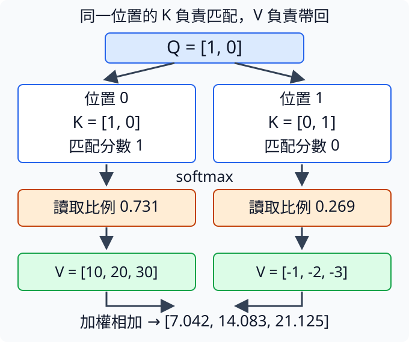
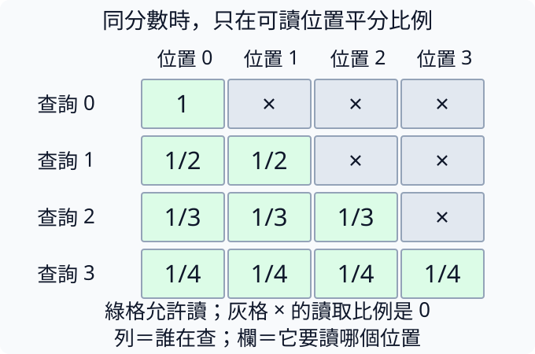
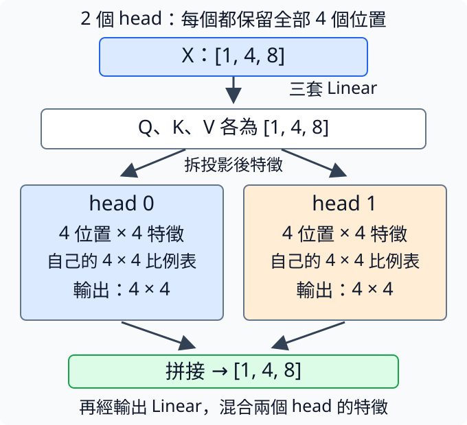

# 第 3 章：Attention，自己決定看哪裡

前文越長，並不是每個位置都對眼前問題同樣有用。讀到「貓追狗，牠跑得很快」，你可能回頭找「牠」指的是誰；不同問題會讓你注意不同線索。本章從兩張數字卡的加權平均出發，逐步把讀取比例交給內容決定，再拆開查詢、匹配線索與取回資料的角色。最後加入不能偷看未來的限制，以及同時建立多種讀法的方法，讓每一步都有可以核對的小表格。

## 3.1 怎麼彙整多個位置？

兩個位置各放一張數字卡，第一張 `[2,0]`，第二張 `[0,4]`。如果兩張各取一半，得到 `[1,2]`；如果我們此刻更需要第一張的資訊，就取第一張九成、第二張一成，結果應更靠近第一張。與 [2.2](02.md#2.2) 把所有卡原封不動接起來不同，這次把多張卡混成一張，而且可以決定每張佔多少。

這種操作叫加權平均：每張向量乘上自己的比例，再逐欄相加。比例非負、加總為1，才能表示一份完整的分配。這與 [2.3](02.md#2.3) 的一般配方稍有區別：Linear的權重可以負、也不必加總為1；這裡先使用可解讀的讀取比例，讓結果成為各位置資訊的混合。向量與矩陣見 [W.3](../first-steps.md#W.3)。

```python
import torch

values = torch.tensor([[2.0, 0.0], [0.0, 4.0]])
weights = torch.tensor([0.9, 0.1])
output = weights @ values
print(output)
assert torch.allclose(output, torch.tensor([1.8, 0.4]))
```

輸入 `values` 是兩個位置、每位置兩個特徵，形狀 `[2,2]`；`weights` 是兩個讀取比例。`@` 完成加權平均，第一個輸出特徵為 `0.9×2+0.1×0=1.8`，第二個為 `0.9×0+0.1×4=0.4`。輸出只剩一張兩數的卡 `[1.8,0.4]`，位置軸已經加總掉，但特徵軸仍保留。並不是先把每張的特徵自己平均成一個數。

`torch.allclose` 逐格比較計算結果與手算值，容許浮點表示造成的小幅誤差，全部夠接近就回傳`True`。最後的`assert`在通過時沒有額外輸出；若結果不夠接近，就以`AssertionError`停下，提醒你檢查讀取比例、數值或手算結果。

這是注意力（attention）最核心的讀取動作：把不同位置的資訊按比例取回。它沒有真的把視線移到某一字，也不一定只選擇一個位置；例中兩張都參與，只是第一張多些。我們目前手工給0.9與0.1，下一節才問怎樣根據目前內容產生比例。先分開「如何混合」與「如何決定混合比例」，就能避免把整套機制當成一個黑盒名字。

注意力輸出也不告訴你究竟哪張卡包含什麼語意。這兩個特徵只是為了算得清楚而指定的數字；真實模型中的特徵由訓練學習，一張卡可能同時記錄多種資訊。讀取比例較高，只能說對這次混合貢獻較大，不能單靠它證明模型理解了某個概念。

如果這兩個比例都是0.5，結果就在兩卡中間；若為1、0，結果等於第一張。這些端點能幫你核對加權平均的方向是否寫對。對所有位置同樣平均也是一種讀法，但沒有能力依不同問題改讀取重點。

練習把`weights = torch.tensor([0.9, 0.1])`內的兩個比例交換成`[0.1,0.9]`，並把檢查的預期輸出改成你手算的值。先算應為 `[0.2,3.6]`，再執行核對；結果應更靠近第二張。你改的是讀法，不是兩張卡的內容，這個區別會貫穿後面Q、K、V的拆解。

## 3.2 權重能由內容決定嗎？

查資料時，問「哪條是紅色物體？」和問「哪條是圓形物體？」，應該關注不同記錄。[3.1](#3.1) 手動給讀取比例，現在讓一個表示需求的向量與各位置的線索比較，匹配程度高的就取得較多比例。模型就不用為所有問題永遠採相同平均。

為了能逐數追蹤，先用兩特徵的小世界。當前需求寫成q=`[1,0]`，三個候選線索分別 `[1,0]`、`[0,1]`、`[-1,0]`。我們把需求向量叫query（查詢），候選的匹配線索叫key（鍵）。這是臨時人為指定的數值，不是說真實模型第一格一定代表顏色；模型會在後續學習怎樣形成有用的線索。

如何匹配？對應格相乘，再相加，這叫點積（dot product），與 [W.5](../first-steps.md#W.5) 一套加權配方相同。q與第一候選得到 `1×1+0×0=1`，與第二得到0，第三得到-1。然後按 [1.7](01.md#1.7) 的softmax換成非負、加總為1的讀取權重。

```python
import torch

q = torch.tensor([1.0, 0.0])
keys = torch.tensor([[1.0, 0.0], [0.0, 1.0], [-1.0, 0.0]])
scores = q @ keys.T
weights = scores.softmax(dim=0)
print(scores)
print(weights)
```

輸入是一個需求和三個候選，各有兩數。`keys.T` 交換列欄，讓 `[2] @ [2,3]` 產生三個分數。輸出先是 `[1,0,-1]`，再約為 `[0.665,0.245,0.090]`。第一候選最多，但其餘仍參與。把需求q改成 `[0,1]`，分數變成 `[0,1,0]`，第二候選才會得到最多比例，說明讀取偏好由當前內容決定。

點積常被解釋成方向是否相近，但也受長度影響。把第一key從 `[1,0]` 改成 `[2,0]`，方向完全沒變，對原q的分數卻從1升2。不要把它當作已經排除長度差的相似度。這種分數在訓練中可以被利用，但過大時會讓softmax過於集中，稍後 [3.5](#3.5) 會處理尺度。

這段還沒有取回資料，也沒有限制能讀哪些位置，只完成匹配與比例化。若用在猜下一字，不能讓查詢去比對未來字的key，否則會偷看到答案；限制會在 [3.6](#3.6) 另做。本節先讓三候選都可見，清楚觀察需求變化。

練習把q的兩個數改成 `[0,1]`，先寫下三個分數及哪個候選最高，再執行核對：應為 `[0,1,0]`，第二個候選得到最多比例。保持這個q，再把keys最後一列`[-1,0]`改成`[-1,1]`，只動第二格。先手算第三個候選也得1，預測後兩個候選並列最高、權重相等，再執行看它們各佔約0.422。需求與候選都影響讀法，沒有固定哪個位置永遠重要。

## 3.3 查詢與被查詢為什麼分開？

圖書館裡的讀者用「我想學做菜」表達需求，書目則記「烹飪、家常菜、食材」。兩邊參與同一次搜尋，卻不必原先就用同一套描述。模型也可以把每個位置的資訊轉換成兩種向量：query表示現在要找什麼，key表示這個位置可以被什麼需求找到。分開不是因為它們來自不同世界，而是讓「提出需求」與「提供匹配線索」各有可學的配方。

延續 [3.2](#3.2) 的點積，現在同時有兩個查詢、三個候選。把所有query排成矩陣Q，所有key排成K；每個query分別與每個key比較，形成兩列三欄的分數表。列是查詢，欄是被查詢的位置，不能把這兩個軸都籠統叫文字長度就忘掉角色。

```python
import torch

q = torch.tensor([[1.0, 0.0], [0.0, 1.0]])
k = torch.tensor([[1.0, 0.0], [0.0, 1.0], [1.0, 1.0]])
scores = q @ k.T
print("Q", q.shape, "K轉置", k.T.shape)
print(scores)
assert scores.shape == (2, 3)
```

輸入Q有兩列、每列兩特徵，K有三列、每列兩特徵。第一query的分數是 `[1,0,1]`，第二是 `[0,1,1]`；第三key同時帶有兩條線索，所以兩種需求都能找到它。`k.T` 只把表的列欄互換，好讓矩陣乘法遍歷三候選，不會把key變成query。形狀 `[2,2] @ [2,3] → [2,3]` 的內側2是兩邊共同的匹配特徵數。

若用符號寫，Q形狀 `[Tq,Dk]`，K形狀 `[Tk,Dk]`，分數形狀 `[Tq,Tk]`。Tq是查詢數，Tk是候選數，Dk是每向量用來比對的特徵數。兩邊Dk必須一致，查詢與候選數卻可以不同；這就是例子故意用非方表的原因。自注意力（self attention）通常兩者來自同一組文字位置，因此Tq與Tk相同，但仍是兩個角色。

真實模型先有位置表示X，再用 [2.3](02.md#2.3) 的Linear各算一次，得到Q與K。這種加權轉換常叫投影（projection）；這裡先把它理解為兩套不同的特徵配方，不要求幾何投影的先備知識。配方權重可以隨任務訓練，讓某個位置提出的需求不必與它作為候選時的線索完全一樣。

這裡只印分數，沒有softmax。做讀取比例時要沿候選欄換算，使每列查詢各自加總為1；跨查詢列一起換算則會讓不同問題互相搶比例，算錯了角色。對於軸不確定時，先寫「每列是一個問的人，每欄是一個可找的位置」。

練習在K最後加 `[2,0]`，先預測形狀變 `[2,4]`，新欄分數依序2、0，再執行並把檢查改成新形狀。查詢仍兩個，所以列數不變。這讓矩陣的大小不再只是要背的式子，而是數清楚有幾個問題、每題比幾個候選。

## 3.4 找到位置後取回什麼？

圖書館用書目關鍵詞找書，找到了卻要讀書的內容，而不是只拿回關鍵詞。[3.3](#3.3) 的Q和K負責匹配，現在還要給每個候選一份真正要取回的資料V，叫value（值向量）。key與value對應同一個位置，但承擔不同工作，因此特徵數也可以不同。需要多少特徵才能「找到」，不一定等於要「帶回」多少資訊。

用一個query、兩個key，每個匹配向量兩數；兩份value則每份三數。query `[1,0]` 對key `[1,0]` 得1，對 `[0,1]` 得0。接著用 [1.7](01.md#1.7) 的 softmax 將分數換成加總為1的比例：先取指數，`exp(1)` 約為2.718、`exp(0)` 為1，再各除以總和3.718，得到約0.731、0.269。然後拿這兩個比例去混合三數的value，不是混合key。

```python
import torch

q = torch.tensor([[1.0, 0.0]])
k = torch.tensor([[1.0, 0.0], [0.0, 1.0]])
v = torch.tensor([[10.0, 20.0, 30.0], [-1.0, -2.0, -3.0]])
weights = (q @ k.T).softmax(dim=-1)
output = weights @ v
print(weights)
print(output, output.shape)
```

輸入Q是 `[1,2]`，K是 `[2,2]`，V是 `[2,3]`。`q @ k.T` 形成一列兩個匹配分數；`dim=-1` 中的 -1 表示最後一個軸，這張分數表的最後軸是兩個候選位置，所以 `softmax(dim=-1)` 將它們一起換成讀取比例。`weights @ v` 完成 [3.1](#3.1) 的加權平均，第一特徵為 `0.731×10+0.269×(-1)≈7.042`，其餘約14.083、21.125。因此輸出為一筆三特徵 `[1,3]`，由V的特徵數決定，而不是Q/K的兩特徵。

下圖上方的Q分別與兩位置的K匹配，箭頭往下經過分數與softmax，得到橘框中的讀取比例。左右兩欄始終對應位置0、1，因此左比例0.731乘左邊綠框的V，右比例0.269乘右邊V，最後逐特徵相加。最底下三數是混合結果；箭頭沒有把K的兩數當成要取回的內容。



寫成一條運算是 `softmax(QKᵀ)V`。QKᵀ先算匹配分數，softmax才回答「每個查詢讀各候選多少」，再乘V回答「按這些比例帶回什麼」。如果有Tq個query、Tk個候選、每份value有Dv特徵，權重是 `[Tq,Tk]`，乘 `[Tk,Dv]` 得 `[Tq,Dv]`。內側Tk是要被混合的候選位置；候選排列與V列排列一定要一致，否則會把找第一本書的比例套到第二本內容。

實際自注意力中，X通常各經過一套Linear配方得到Q、K、V，三套權重都能學習。這裡手動指定它們，是為了讓每個角色可追蹤，不意味key只是標籤、value永遠是完整原文。它們都是模型內部的數字表示，只是在這次計算裡分工不同。

也要留意，讀取很多value後只剩一份加權結果，不能從結果完整還原每份來源。因此注意力是在建立當前位置需要的表示，不是無損保存所有前文。後面會保留原輸入的路線，讓新資訊與已有資訊一起使用。

練習只把第一份V改成 `[20,40,60]`，保持Q、K固定。先預測權重完全不變，三個輸出卻升到約14.352、28.704、43.057，再執行核對。若權重也改變，就檢查是否不小心改了K。這次將「定位方法」和「取回內容」分開觀察，是理解Q/K/V最直接的一步。

## 3.5 分數為什麼需要縮放？

兩特徵的點積容易看清楚，模型卻可能用六十四個或更多特徵。每格相乘後再全部相加，即使每個數都差不多大，總分的起伏也可能隨格數增加。若softmax收到差距很大的分數，讀取比例會集中到一兩個候選，其餘候選的比例接近0，對混合結果的影響便很小。我們希望增加特徵時，不要同時無意間把讀法推得特別尖銳；這裡談的是讀取哪些資料及各自占多少，不是在計算訓練時怎樣調整參數。

回看 [3.2](#3.2)，點積把對應特徵乘起來，再加總。我們先把每格的乘積簡化成一半機會取-1、一半機會取+1，平均便是0。量起伏時，先看每個數偏離平均多少，平方後再取平均：這裡是 `(1+1)/2=1`，叫變異數（variance）。再取變異數的平方根，得到標準差（standard deviation）；平方根是平方後會得到原數、而且不小於0的那個數，所以這裡標準差也是1。它讓我們用和原數相同的尺度讀出典型起伏。

現在加兩格。假設各格獨立，也就是知道第一格取了哪個值，不會改變第二格取-1或+1的機會。四種組合 `(-1,-1)、(-1,+1)、(+1,-1)、(+1,+1)` 各有一樣的機會，加總分別為 `-2、0、0、2`，平均仍是0。偏離量平方後取平均，得到 `(4+0+0+4)/4=2`；標準差是√2，約1.414。兩格各有變異數1，加起來的變異數為2，但標準差並沒有直接變成2，因為正負起伏也有互相抵消的組合。

對更多獨立的格子，也使用同一條變異數相加規則。若各格平均為0、變異數為1，D格加總的變異數為D，標準差就是√D。四格對應變異數4、標準差2；六十四格對應變異數64、標準差8，因此要分別除以2與8才把典型起伏拉回1。這是指定假設下的尺度推算，下面再用隨機數核對；真正訓練過的向量未必獨立、平均為0或每格變異數恰好為1，不能把這個推算當成所有模型都成立的數值保證。

因而常把匹配分數除以 `sqrt(D)`，稱縮放點積注意力（scaled dot-product attention）。D是每個query/key的匹配特徵數。[多頭注意力](#3.7)同時用幾組各自的配方做匹配和讀取，每組叫一個head（頭）；若已分成多頭，D要數該組query/key的特徵，而非整層總寬度。下面不做完整注意力，只測分數起伏。

```python
import math
import torch

torch.manual_seed(42)
for d in [4, 64]:
    q = torch.randn(1000, d)
    k = torch.randn(1000, d)
    scores = (q * k).sum(dim=-1)
    scaled = scores / math.sqrt(d)
    print(d, scores.std().item(), scaled.std().item())
```

輸入各是1000組隨機q、k，每組d個數。`randn` 產生平均約0、標準差約1的數字；固定種子便於重現。`q*k` 是逐格相乘，不是矩陣乘法，再沿最後特徵軸相加，形成1000個匹配分數。`std()` 計算這1000個分數的標準差。d=4時未縮放值應靠近2，d=64時靠近8；除以2或8後，兩者都應靠近1，具體值因取樣而有些偏差。

這個實驗的結論是「在指定隨機假設下，縮放能讓尺度較可比」，不是「所有已訓練q/k的標準差恰好1」。如果兩組向量本身數值變大，除以√D並不會自動消除全部變化。模型還需要後面章節的數值尺度控制，而且softmax是否合適集中也跟任務有關。

尺度還與 [1.15](01.md#1.15) 的溫度有相似數學效果：除以大數會使分配較平，但這裡的√D是注意力匹配的固定規則，目的在控制隨特徵數增長的波動，不是生成答案時為多樣性選的溫度。

練習只把q與k各乘2，再算分數，先預測每個乘積會變四倍，所以未縮放與縮放的標準差都約四倍。執行核對；不能說縮放後一定又回1。這個反例讓你看見√D控制的是特徵數量帶來的變化，而不是所有來源的數值大小。

## 3.6 能不能偷看答案？

[1.3](01.md#1.3) 把「貓看狗。」對齊成三個下一字問題，看到貓時應預測看。若一次把整句交給注意力，貓位置就可能讀到右邊的看；它不必學關係，照著答案讀就能有低代價。這會讓訓練看似成功，真正只給開頭生成時卻失敗。我們需要給每個查詢一份「可讀哪些位置」的許可表。

這份表叫遮罩（mask）。因果遮罩（causal mask）規定：第i個查詢可以讀第j個位置，當且僅當j≤i，也就是過去與目前，不能讀未來。對角線j=i是允許的，因為目前字本來就在輸入裡；要預測的是下一字，不是目前字。將被禁止位置的匹配分數設為負無限 `-inf`，softmax後其讀取比例為0，才不會從它的value帶回資訊。這個0來自 [1.7](01.md#1.7) 的 softmax：先取指數，再除以總和；分數越往負方向變大，指數權重就越接近0。負無限表示比所有有限分數都小，工具將它的指數權重記為0，再除以允許位置帶來的正數總和，比例仍為0。因此這裡把它當作完全排除候選的特殊標記。匹配與讀取的前置見 [3.4](#3.4)。

```python
import torch
from tiny_perceptron.attention import manual_attention

q = torch.zeros(1, 1, 4, 2)
k = torch.zeros_like(q)
v = torch.tensor([[[[1.0, 10.0], [2.0, 20.0], [3.0, 30.0], [4.0, 40.0]]]])
allowed = torch.ones(4, 4, dtype=torch.bool).tril()[None, None]
out, weights = manual_attention(q, k, v, allowed)
changed = v.clone()
changed[:, :, 3] += 100
other, _ = manual_attention(q, k, changed, allowed)
print(weights[0, 0])
print(out[0, 0])
assert torch.allclose(out[:, :, :3], other[:, :, :3])
```

輸入q、k形狀 `[1,1,4,2]`：一筆、一種讀法、四位置、每位置兩特徵。先只用一種讀法，下一節再增加。它們全0，因此匹配分數相同，允許讀的各位置就平分比例。`torch.bool` 表示真/假許可；`tril()` 只留下主對角線和下面，`[None,None]` 新加兩個長度1的軸，配合資料的筆數與讀法分組。

印出的權重第0列是 `[1,0,0,0]`，第1列 `[0.5,0.5,0,0]`，第2列約 `[1/3,1/3,1/3,0]`，最後各0.25。輸出依序為 `[1,10]`、`[1.5,15]`、`[2,20]`、`[2.5,25]`，可直接按可見範圍平均核對。

下圖每列是一個查詢，四欄由左至右是位置0、1、2、3。綠格允許讀，數字是匹配分數相同時的讀取比例；灰格的×表示禁止，比例為0。對角線也綠。查詢0只有左邊一格可讀，查詢3則四格都可讀，正好對應剛才的權重。右上角灰區是每個位置尚未得到的未來，不是未來永遠不存在。



程式再把最後一個value增加100。`clone()` 保存原資料不被改；前面三個輸出應不受影響，因為它們無權讀第四格，`allclose` 的檢查則容許極小浮點誤差。最後輸出可以改，這正是「防偷看」的可觀察反例，不是只看矩陣長得像三角形。

練習移除 `tril()`，保留全為True的許可表。先預測每個查詢都平分四位置，改變最後value會影響所有輸出，最後檢查應失敗，再執行核對。shift負責配答案、因果mask負責限制讀資料，兩件事要同時正確。loss指用正確下一字核對預測的猜錯代價；若模型能偷看答案，代價也可能很低，因此還需要這裡的讀取許可與反例檢查。

## 3.7 能同時找不同關聯嗎？

讀「小貓追著拿球的孩子」時，你可能一方面找誰在追，一方面找球屬於誰。若只用一種匹配與混合方式，所有資訊都擠進同一份讀取結果。注意力可以同時建立幾種分別計算的讀法，各有自己的Q、K、V與讀取比例，再把取回的向量拼接。每種讀法叫一個head（注意力頭），整個機制叫多頭注意力（multi-head attention）。

「不同讀法」是可學習的自由度，不是作者預先把第一個head命名為文法、第二個命名為物體。要觀察訓練後是否分工，必須看實際行為，不能光看圖上的不同顏色就下結論。每個head仍按 [3.4](#3.4) 匹配與混合，猜下一字時也都要遵守 [3.6](#3.6) 的因果許可。

假設整個位置表示有D=8個特徵，使用H=2個head，通常讓每個head用D/H=4個特徵。先回顧 [2.3](02.md#2.3)：Linear（線性層）用各輸入乘上可調權重再相加，形成新特徵，也可另加可調的偏移量。這裡把用線性配方重新組合特徵的操作叫投影。X先用三套各自的配方形成Q、K、V，每份在每個位置都有八數；分頭發生在投影之後。

以一筆四位置的Q為例，原形狀 `[筆數,位置,特徵]=[1,4,8]`。先把最後的八格分成兩組四格，得到 `[筆數,位置,頭,每頭特徵]=[1,4,2,4]`。若某位置的八數是 `[1,2,3,4,5,6,7,8]`，head0取 `[1,2,3,4]`，head1取 `[5,6,7,8]`；四個位置都各自這樣分，沒有把位置分給不同頭。再交換「位置」與「頭」兩個軸，得到 `[筆數,頭,位置,每頭特徵]=[1,2,4,4]`，讓每個head各自處理整串四位置。K、V也各自這樣分組。各head輸出四特徵，最後按head順序拼接回每位置八特徵，再經過輸出配方混合；拼接的背景見 [2.2](02.md#2.2)。

```python
import torch
from tiny_perceptron.attention import CausalAttention

torch.manual_seed(42)
layer = CausalAttention(width=8, heads=2)
x = torch.randn(1, 4, 8)
out, cache = layer(x)
print("輸出", out.shape)
print("保存的K", cache[0].shape)
assert out.shape == x.shape
```

`torch.manual_seed(42)`固定PyTorch產生隨機數的起點，讓從頭重跑時的初始權重與輸入可重現。`torch.randn`產生隨機浮點數，這裡用來模擬位置特徵，只測分組形狀，不把它當成真實句子或已學好的表示。

輸入x是一筆、四位置、每位置八特徵，形狀 `[1,4,8]`。`CausalAttention` 是專案封裝好的因果多頭層，內部用Linear形成Q/K/V，分組後做注意力，再拼回。輸出仍 `[1,4,8]`，表示每位置的資訊被更新，而不是字數增加了或head變成另一筆句子。

這個工具還回傳一對保存的K、V，叫cache（快取），讓之後逐字生成有機會重用已算過的資料；此處只看其形狀，不需要使用快取生成。`cache[0]` 是K，形狀 `[1,2,4,4]`：一筆、兩head、四位置、每head四特徵。真正每head的讀取比例則是一張四乘四表；本節印的K不是那張權重表，要分清特徵軸與候選位置軸。

下圖兩條分支是head0、head1。分支中的「4位置×4特徵」表示每個head都讀整串，並不是第一個只讀前兩字、第二個只讀後兩字。「4×4比例表」的列是查詢位置、欄是可讀位置，與每位置四個特徵的4用途不同。向下的箭頭把兩份每位置四數的輸出拼成八數，才交給最後的Linear。兩種顏色只是分組標記，沒有指定它們要學哪種語意。



若D固定、把H增加，每head的特徵數會減少，並不是每個head都繼續拿到完整D個新特徵。D必須能被H整除，否則八格無法平均分成三組，工具會報錯。這也是讀shape時要把「位置數」「head數」「每head特徵數」分別寫清楚的理由。

練習只把heads從2改成4，先預測輸出形狀保持 `[1,4,8]`，K改成 `[1,4,4,2]`，再執行核對。隨機初始數值可能改變，但不能憑這一次輸出說四head已比兩head聰明；這個實驗只驗證拆分與合併的接口，能力仍須訓練與評估。
