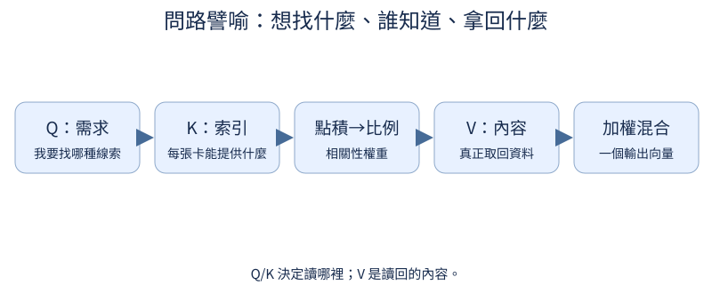

# 第 3 章：Attention，自己決定看哪裡

前置：向量、矩陣乘法和 softmax。先用單 head；每個小節都畫得出矩陣。完整模型仍留到第4章。

## 3.1 怎麼彙整多個位置？

**先想一想：**[0.9,0.1] 會讓結果靠近哪一個向量？



先用已知權重做平均：想讀第一個位置，就把它的權重提高。attention 先是這件簡單的事，後面才讓內容決定權重。

**把直覺寫成數學：**$o=\sum_j a_j v_j$；$a_j\ge0$ 且總和1，o 是加權平均。

**最小實驗：**以下程式只處理這節的問題。

```python
values = torch.tensor([[2.0, 0.0], [0.0, 4.0]])
weights = torch.tensor([0.9, 0.1])
print(weights @ values)
assert torch.allclose(weights @ values, torch.tensor([1.8, 0.4]))
```

**如何讀結果：**權重控制混合比例，不需要先把所有向量平均再挑。

**只改一件事：**只交換兩個權重。

## 3.2 權重能由內容決定嗎？

**先想一想：**q=[1,0] 比較偏好哪個 key？


用點積看兩個向量是否朝相近方向，再把分數 softmax 成權重。現在 query 改變就會改變讀取偏好。

**把直覺寫成數學：**$s_j=q\cdot k_j$，$a=softmax(s)$。點積同時受方向與長度影響。

**最小實驗：**以下程式只處理這節的問題。

```python
q = torch.tensor([1.0, 0.0])
keys = torch.tensor([[1.0, 0.0], [0.0, 1.0], [-1.0, 0.0]])
scores = q @ keys.T
print(scores, scores.softmax(0))
```

**如何讀結果：**這裡還沒有 causal 限制；不能直接用來訓練自回歸模型。

**只改一件事：**只把 q 改成 [0,1]。

## 3.3 查詢與被查詢為什麼分開？

**先想一想：**兩個查詢、三個候選，分數矩陣是幾乘幾？

查詢 Q 表示「我在找什麼」，K 表示「我能被什麼需求找到」。兩組投影讓找的人與被找的人不必用同一種特徵。

**把直覺寫成數學：**$Q:[T_q,D_k]$，$K^T:[D_k,T_k]$，分數是 $[T_q,T_k]$；一列是一個 query。

**最小實驗：**以下程式只處理這節的問題。

```python
q = torch.tensor([[1.0, 0.0], [0.0, 1.0]])
k = torch.tensor([[1.0, 0.0], [0.0, 1.0], [1.0, 1.0]])
scores = q @ k.T
print("Q", q.shape, "K.T", k.T.shape, "scores", scores)
assert scores.shape == (2, 3)
```

**如何讀結果：**非方陣清楚顯示軸的角色；transpose 只換軸，不把 query 變成 key。

**只改一件事：**只增加一個 key，先預測輸出 shape。

## 3.4 找到位置後取回什麼？

**先想一想：**key 兩維、value 三維，輸出是兩維嗎？

找到位置後要拿回的內容是 Value。K 可以只描述索引線索，V 保存真正要混合的資料，兩者的維度也可不同。

**把直覺寫成數學：**$softmax(QK^T)V$ 的 shape 是 $[T_q,D_v]$。

**最小實驗：**以下程式只處理這節的問題。

```python
q = torch.tensor([[1.0, 0.0]])
k = torch.tensor([[1.0, 0.0], [0.0, 1.0]])
v = torch.tensor([[10.0, 20.0, 30.0], [-1.0, -2.0, -3.0]])
weights = (q @ k.T).softmax(-1)
print(weights, weights @ v)
```

**如何讀結果：**Q/K 決定讀哪裡，V 決定讀回什麼；輸出 feature 數由 V 決定。

**只改一件事：**只更改 V，檢查權重不變。

## 3.5 分數為什麼需要縮放？

**先想一想：**D 變為4倍時，標準差大約怎麼變？

相加的 feature 越多，隨機點積通常波動越大，softmax 容易過早變尖。除以平方根維度讓尺度比較穩定。

**把直覺寫成數學：**獨立零均值項相加的 variance 約為 D，standard deviation 約為 √D；因此用 $QK^T/\sqrt D$。

**最小實驗：**以下程式只處理這節的問題。

```python
import math

for d in (4, 64):
    q, k = torch.randn(1000, d), torch.randn(1000, d)
    scores = (q * k).sum(-1)
    print(d, scores.std().item(), (scores / math.sqrt(d)).std().item())
```

**如何讀結果：**是隨機獨立假設下的尺度直覺，不是每個已訓練向量的嚴格保證。

**只改一件事：**只把兩組向量的標準差加倍。

## 3.6 能不能偷看答案？

**先想一想：**改最後一格的 value，第一格輸出應該變嗎？


第 t 個位置是在猜下一個 token；它可以看目前與過去，不能看未來的答案。對角線可見，所以不是嚴格下三角。

**把直覺寫成數學：**allowed[i,j]=(j≤i)；被禁止的 score 設為 −∞，softmax 後權重0。

**最小實驗：**以下程式只處理這節的問題。

```python
from tiny_perceptron.attention import manual_attention

q, k, v = [torch.randn(1, 1, 4, 2) for _ in range(3)]
allowed = torch.ones(4, 4, dtype=torch.bool).tril()[None, None]
out, weights = manual_attention(q, k, v, allowed)
changed = v.clone()
changed[:, :, 3] += 100
other, _ = manual_attention(q, k, changed, allowed)
print(weights[0, 0])
assert torch.allclose(out[:, :, :3], other[:, :, :3])
```

**如何讀結果：**反例檢查「不偷看」比只是看 loss 正常更重要。

**只改一件事：**只移除 tril mask，確認反例開始失敗。

## 3.7 能同時找不同關聯嗎？

**先想一想：**D固定、head變多，每個head維度會怎樣？

多個 head 各自讀取，再把讀迴向量接起來。可以學不同關聯，但不能光看不同顏色就宣稱某 head 有固定語意職位。

**把直覺寫成數學：**$[B,T,D]\to[B,H,T,D/H]$，每個 head 有自己的 T×T 權重。

**最小實驗：**以下程式只處理這節的問題。

```python
from tiny_perceptron.attention import CausalAttention

layer = CausalAttention(width=8, heads=2)
x = torch.randn(1, 4, 8)
out, cache = layer(x)
print(out.shape, "K cache", cache[0].shape)
assert out.shape == x.shape
```

**如何讀結果：**拆 head 是 reshape 加 transpose；要讓 D 能整除 H。手寫權重圖見 3.6。

**只改一件事：**只把 heads 改成4，核對每head的維度。
