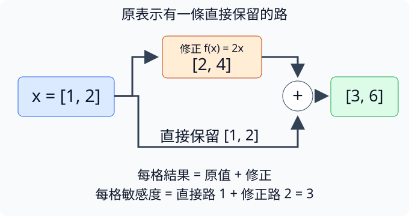
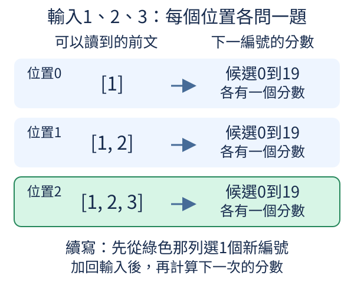

# 第 4 章：第一個 Dense Transformer 語言模型

注意力讓位置可以讀取前文，但完整文字模型還需要知道位置、保存既有資訊、控制數字尺度，並把更新後的表示換成下一字分數。本章把這些零件接成一條能求導的路線。這種由注意力與每位置特徵處理組成、可重複堆疊的結構叫Transformer；我們先使用每個位置都經過完整特徵配方的Dense版本。讀到最後，你會能指着每一軸說明它代表幾筆、幾位置、幾候選，也能核對一次訓練到底在配哪些答案。

## 4.1 怎麼知道字的順序？

「貓追狗」與「狗追貓」用了同樣三個字，角色卻交換了。[2.1](02.md#2.1) 的字向量只由ID查出，相同字在不同位置會得到相同起始數字；而 [3.6](03.md#3.6) 的因果許可決定誰能讀誰，也不是直接替每格提供「這是第幾個位置」的特徵。因此我們再準備一張位置表，讓文字內容與位置一起成為後續計算的線索。

每個文字位置也查出一個向量，與字向量逐格相加。若字向量有D數，位置向量也必須有D數，才能相加而不丟掉特徵。這叫位置表示（positional embedding）。本節用可調查表的絕對位置：位置0、1、2各有一列參數，訓練時可按答案代價改變，不是直接把位置編號乘進字ID。

```python
import torch
from torch import nn

e = nn.Embedding(4, 3)
p = nn.Embedding(5, 3)
with torch.no_grad():
    e.weight.copy_(torch.tensor([[0.0, 0.0, 0.0], [1.0, 0.0, 0.0], [0.0, 1.0, 0.0], [0.0, 0.0, 1.0]]))
    p.weight.copy_(torch.tensor([[0.0, 0.0, 0.0], [0.1, 0.2, 0.3], [0.2, 0.4, 0.6], [0.3, 0.6, 0.9], [0.4, 0.8, 1.2]]))
ids = torch.tensor([1, 2, 1])
positions = torch.arange(3)
x = e(ids) + p(positions)
print(positions)
print(x)
assert not torch.equal(x[0], x[2])
```

輸入ID為1、2、1，兩次ID1原先都查到 `[1,0,0]`。`torch.arange(3)` 建立位置編號 `[0,1,2]`，每個位置使用相應的p列。位置0加入 `[0,0,0]`，結果仍 `[1,0,0]`；位置1為 `[0.1,1.2,0.3]`；位置2的ID1則變 `[1.2,0.4,0.6]`。輸出尾端的 `grad_fn=<AddBackward0>` 是工具附加的求導記錄名稱，表示它記住了字向量與位置向量相加的關係；本節尚未求導，先核對前面的三排數值即可。最後檢查兩個相同字的表示確實不再完全一樣。

這些手動小數只是讓例子透明，並不是某種公認的位置公式。正式模型中p通常從亂數開始，與字表一同學習。相加後的向量同時含有兩種資訊。後面的[Linear（線性層）](02.md#2.3)會用權重把多個輸入特徵加權混合成新數字；它與注意力還需要在訓練中學會使用內容與位置線索。相加本身沒有確保模型已懂語序，也無法從一個數值看出它「知道第一個字」。

查表法還有明確的長度限制。`nn.Embedding(5,3)` 只提供位置0到4；若輸入位置5，就索引超出範圍。模型不能把沒學過的新位置悄悄當成舊位置重用，否則遠處的順序會被混淆。後續的其他位置方法會改變計算方式，眼前先用表格建立可檢驗的起點。

練習把所有位置向量清零。請在`with torch.no_grad():`區塊內，第二個`p.weight.copy_(...)`完整呼叫結束後新增`p.weight.zero_()`，行首保留與`copy_`相同的四個空格；下一行`ids = torch.tensor([1, 2, 1])`仍從最左邊開始。這個區塊包住手動設定參數的操作，背景可看[1.12](01.md#1.12)。同時把最後檢查改成`assert torch.equal(x[0], x[2])`。先預測相同ID1又會得到相同`[1,0,0]`，再從頭執行核對。這次字表沒改，變化完全來自位置資訊，能明確指出兩張表各貢獻了什麼。

## 4.2 怎麼保留原本的資訊？

你收到一份草稿，編輯建議只修第二句。如果每次都把整份內容全部重寫，新方法暫時失誤時就可能丟掉原本有用的部分。模型也可以留一條直接帶著原表示的主路線，另外計算一份修正，最後把它加回去。這叫殘差連接（residual connection）：輸出是原輸入加上新修正，而不是要求每個分支都重新創造全部資訊。

寫成 `y=x+f(x)`，x是文字序列中某一位置已有的表示：用一排特徵數字記錄該位置的線索，背景可看 [4.1](#4.1)。本節先把這一排簡化成 `[1,2]`；兩格都屬於同一個位置，並不是兩個位置各有一格。表示的「寬度」就是這排特徵的格數，這裡為2。f是注意力或另一種計算產生的修正，兩邊形狀必須相同才能逐格相加。先用f(x)=2x看清數值：修正為 `[2,4]`，結果 `[3,6]`。這個例子故意簡單，但已經展現「分支計算」與「直接保留」兩條路。

下圖左邊 `[1,2]` 分成兩路：上路乘2得到橘框 `[2,4]`，下路直接保留 `[1,2]`。兩支箭頭到加號才合流，右邊逐格相加得到 `[3,6]`。底下敏感度1與2相加為3，對應稍後程式的梯度，不是把兩份答案代價相加。



```python
import torch

x = torch.tensor([1.0, 2.0], requires_grad=True)
correction = 2 * x
y = x + correction
y.sum().backward()
print("結果", y.detach())
print("對輸入的敏感度", x.grad)
assert torch.equal(x.grad, torch.tensor([3.0, 3.0]))
```

輸入x是兩特徵向量並追蹤梯度。`y.sum()` 把兩個輸出加成一個數，只為測總輸出對x的敏感度，不是本章訓練文字時的答案代價。它對每格x的導數為3：一條直接路的敏感度1，加上修正路的2。這與 [1.10](01.md#1.10) 的鏈式法則相容；同一輸入走不同路影響最終結果，兩路影響要相加。`detach` 只讓顯示結果不附求導關係，沒有改變值。

程式會印出下面兩行；`tensor(...)` 是數字容器的顯示格式，`3.` 表示3.0。`torch.equal` 檢查兩個tensor的形狀和值是否完全相同，這裡回傳 `True`，所以 `assert` 通過且不再印出東西；若檢查結果為 `False`，則會出現 `AssertionError` 並停止。

```text
結果 tensor([3., 6.])
對輸入的敏感度 tensor([3., 3.])
```

所以殘差常有助原有資訊沿直接路傳到後續層，也讓求導時的梯度沿計算關係反向傳回較早的層。這是兩種不同方向：資訊從輸入算到結果，敏感度則從結果回查輸入。即使修正分支暫時接近0，主路仍能帶上已有內容，導數也仍有那份直接的1。它不保證訓練不會失敗，也不是把所有輸入永久保存成可還原原文；後面還會有其他計算。但它讓每層學習「在現有表示上補哪些資訊」，比強制整個表示通過一條新分支更容易保持連續。

有時公式寫導數 `I+df/dx`，I叫單位矩陣，代表每個特徵沿直接路原樣傳遞：自己的改動影響自己一倍，不影響別格。對目前不需要交叉特徵的例子，只需看每格1+2=3，就已掌握這個I的用途，不必先修完矩陣微積分。

這裡相加的是同一個位置的兩份表示，不是兩個loss相加，也不是將不同句子混為一筆。[3.4](03.md#3.4) 的注意力按讀取比例混合各個允許位置的value，為當前位置帶回新資訊；用作殘差的修正分支時，輸出還必須與原當前表示有同樣的特徵格數，才能相加。下一步會在這種路線上控制各位置數值的尺度。

練習只把 `correction = 2*x` 改成 `0*x`，先預測結果等於 `[1,2]`，敏感度為 `[1,1]`，再把檢查改成這個新梯度核對。修正不提供任何變化，主路仍完整工作，這正是保留路線最容易驗證的情況。

## 4.3 各位置的數值尺度怎麼控制？

一張卡的特徵是 `[1,2,3]`，另一張是 `[10,20,30]`。兩張內部的相對排列相同，但第二張數值大十倍；如果每一層都任由尺度變化，後續加權與softmax可能難以保持穩定。模型常先把每個位置的特徵調到較一致的尺度，再交給分支計算。這裡需要的是每張卡各自整理，不是讓整句話或整個班級共用一個平均。

層正規化（LayerNorm，簡稱LN）沿每個位置的最後特徵軸，先減去該位置的平均，再除以它的標準差。標準差與變異數的回顧見 [3.5](03.md#3.5)。第一張平均2，減平均後為 `[-1,0,1]`；用平方偏離的平均算變異數為2/3，標準差約0.816，整理後約 `[-1.225,0,1.225]`。第二張按自己的平均20與標準差8.165整理後，也得到相同排列。

```python
import torch
from torch import nn

x = torch.tensor([[[1.0, 2.0, 3.0], [10.0, 20.0, 30.0]]])
layer = nn.LayerNorm(3)
y = layer(x)
print(y)
print("平均", y.mean(dim=-1))
print("變異數", y.var(dim=-1, unbiased=False))
assert torch.allclose(y.mean(dim=-1), torch.zeros(1, 2), atol=1e-6)
```

輸入形狀 `[1,2,3]`：一筆、兩位置、每位置三特徵。`nn.LayerNorm(3)` 指明最後軸的長度3，各位置共用同一整理規則，卻各自計算平均和變異數。輸出兩張都約 `[-1.225,0,1.225]`，每張平均約0、變異數約1。`unbiased=False` 表示用這三格的平方偏離平均，不做樣本數減一的估計修正，這才與LN內部約定一致。

這裡的tensor是按「筆、位置、特徵」三個軸排列的數字容器。`dim=-1` 表示最後一個軸，所以 `mean` 和 `var` 都只沿每位置自己的三格計算。索引從0開始：`x[0,1]` 取第0筆、第1位置的整排三數 `[10,20,30]`，`x[0,1,0]` 才取這排的第0格10。`print` 的 `tensor(...)` 包住實際數值；尾端若出現 `grad_fn=<NativeLayerNormBackward0>`，那是工具保存的求導關係名稱，本節先讀中括號裡的數字即可。

LN的分母實際用 `sqrt(變異數+epsilon)`，epsilon是小正數，防止所有特徵相同時除以零。因此變異數通常接近1，不必嚴格等於1。它還有縮放γ和偏移β：若這個位置的平均為m、變異數為v，第j格先算 `z_j=(x_j-m)/sqrt(v+epsilon)`，再算 `y_j=γ_j*z_j+β_j`。j是特徵格編號，每格都有自己的γ、β，而不同位置的同一格共用這組參數。初始各γ=1、各β=0，所以目前只看到整理後的數字。「可學」指後續訓練能按答案代價調整它們；本節尚未訓練。

例如暫時把每格γ都設成2、β都設成1，原本約 `[-1.225,0,1.225]` 就先乘2再加1，變成約 `[-1.45,1,3.45]`，平均變成1、變異數接近4。這說明LN先整理，再讓模型選擇需要的特徵尺度，最後輸出不必永遠保持零平均與單位變異數。

關鍵是不要跨位置去算這個平均。若第0位置用到第1位置的數，就可能把未來資訊帶進來，破壞 [3.6](03.md#3.6) 的防偷看，即使注意力mask正確也不夠。也不要和BatchNorm混淆：這裡只提名字作區分，LN的結果不依賴同時放了多少其他句子，每張位置卡自己整理。

練習在原程式最後接上下面幾行，在兩次 `layer(x)` 之間把 `x[0,1]` 的整排加100。`first` 保存第一次結果，`shifted` 保存修改後的結果；`torch.allclose` 逐格比較並容許小浮點誤差，一致就回傳 `True`。先預測第0位置完全不變，第1位置也因平均同步增加100而近乎不變，再執行核對，兩行都應印 `True`。

```python
first = layer(x)
x[0, 1] += 100
shifted = layer(x)
print(torch.allclose(first[0, 0], shifted[0, 0]))
print(torch.allclose(first[0, 1], shifted[0, 1]))
```

接著從原始x重新開始，只把練習中間那行換成 `x[0,1,0] += 100`，只改第1位置的第0格。先預測第一行仍為 `True`、第二行改成 `False`，再從頭執行。這兩種修改能分清整張平移與相對特徵變化。

## 4.4 混合位置後怎麼處理特徵？

注意力讀了其他位置，回到當前位置時已經帶回一排新特徵。但位置之間的交流與一張卡內如何組合特徵，是兩件不同的事。像先從鄰居收集食材，再在自己的廚房調配；模型通常讓注意力負責前者，再讓每個位置使用同一套配方處理自己手上的數。這套位置內計算叫前饋網路（feed-forward network，FFN）。

本章用兩個Linear夾一個非線性：先把D特徵擴成較多隱藏特徵，經過轉換，再縮回D，才能與 [4.2](#4.2) 的主路相加。Linear與非線性的原因見 [2.3](02.md#2.3)、[2.4](02.md#2.4)。擴張提供更多中間組合，不是創造更多文字位置；序列長度從頭到尾不改。

```python
import torch
from tiny_perceptron.modern import DenseFFN

torch.manual_seed(42)
layer = DenseFFN(4)
x = torch.ones(1, 2, 4)
y = layer(x)
print("擴張權重", layer.up.weight.shape)
print("縮回權重", layer.down.weight.shape)
print(y.shape, y)
assert torch.allclose(y[:, 0], y[:, 1])
```

`torch.manual_seed(42)`固定亂數種子，讓這次權重初始化與結果可以重現；42只是本次選定的起點，沒有特殊模型意義。輸入一筆、兩位置、每位置四個1，形狀 `[1,2,4]`。`DenseFFN(4)` 預設先擴到16，再縮回4，兩張權重分別為 `[16,4]` 與 `[4,16]`。每位置依序做四到十六、非線性、十六到四，輸出仍 `[1,2,4]`。兩個位置輸入完全相同，輸出兩排也相同；比較的是具體四個數逐格一致，不是只比較shape。

這個工具預設的非線性叫GELU，它平滑地按輸入大小調整數值，較負的輸入被縮小、較正的通常保留更多；與ReLU直接把負數截成零不同，GELU會保留部分小負值。本節重點是非線性夾在兩個配方之間，暫時不必記完整公式。權重與偏移都從亂數開始，所以數值代表這次初始化，不表示兩張全1卡有固定語意。

Dense的意思是每個位置都使用這套完整FFN參數，不依當前字選擇只用某部分配方。這是本章的簡單起點，後續會介紹選擇專家配方的方法；現在先確認各位置共用參數、獨立處理特徵。共享不表示位置相互讀取：改第1位置的輸入，不會通過這層FFN改變第0位置，跨位置依賴已經在注意力層完成。

數學上可寫「擴張Linear→GELU→縮回Linear」，每一步都作用在最後特徵軸，其餘軸保留。若兩位置的表示在注意力後不同，FFN也可能給不同結果，即使使用同樣配方；它不負責讓所有位置統一成同一張卡。

練習保存y後把 `x[0,1,0]` 改成2，再算一次 `changed=layer(x)`。先預測 `changed[:,0]` 與 `y[:,0]` 相同，而第二位置通常不同，再用 `torch.allclose` 核對。這次明確只改某個位置一格，讓你看見位置內計算和跨位置混合的界線。

## 4.5 一層模型怎麼組成？

我們現在有了讀前文的注意力、位置內的FFN、保留原資訊的殘差，以及整理尺度的LayerNorm。它們要按哪個順序連在一起，才能讓每個位置逐步更新而不改成另一種形狀？本節把這些零件組成一個可重複的單位，叫block，也就是模型層塊。後面說一層、兩層，通常就是這種block重複幾次。

本章採用pre-norm，意思是分支先正規化再做計算。第一段 `u=x+Attention(LN(x))`：主路帶著原x，分支把x整理後讀前文，再加回修正。第二段 `y=u+FFN(LN(u))`：同樣保留u，分支整理後處理特徵，再加回。前置分別見 [4.2](#4.2)、[4.3](#4.3)、[4.4](#4.4)；此時每個名字都對應已拆過的動作。

```python
import torch
from tiny_perceptron.model import Block, ModelConfig

torch.manual_seed(42)
config = ModelConfig(width=8)
block = Block(config)
x = torch.randn(2, 3, 8)
y, cache, auxiliary = block(x)
print("輸入", x.shape, "輸出", y.shape)
print("額外代價", auxiliary.item())
assert y.shape == x.shape
```

輸入x是兩筆、三位置、每位置八特徵。`ModelConfig` 是記錄模型選項的小表，`width=8` 指定每位置表示寬度；其餘先用預設單head和DenseFFN。`Block(config)` 按這個設定建立一組有參數的零件。輸出y仍 `[2,3,8]`，但數值已經過兩次修正，shape相同不代表內容不動。

工具還返回 `cache` 和 `auxiliary`。cache是 [3.7](03.md#3.7) 提到的K/V保存結果，用於後續生成；本節不用它。auxiliary是額外訓練代價，本章Dense版本沒有額外那項，所以印0。主答案代價尚未計算，不能把這個0當作模型已完全猜對。這個接口預留給後面的其他配方形式，現在只要分清它不是本章語言loss。

`auxiliary.item()` 把只含一個數的tensor取成普通Python數字，方便列印；它不會更新參數。`.shape` 則回傳尺寸，列印成 `torch.Size([...])`，中括號裡依序是筆數、位置數、特徵數。這次兩行完整輸出為：

```text
輸入 torch.Size([2, 3, 8]) 輸出 torch.Size([2, 3, 8])
額外代價 0.0
```

pre-norm的「先」是在每個分支裡，並不是先把主路原x永久替換成LN(x)。主路仍帶著舊表示，分支才拿整理後的副本計算。這也解釋為什麼 [4.2](#4.2) 的直接路能保留。另有把正規化放在相加後面的排列，稱post-norm；順序不同會改變資訊與梯度路徑，不應只因為用了相同零件就當相同模型。

輸入輸出的筆數、位置數與寬度都一致，這種block就能接到另一個同寬block前面。每層有自己的參數，可以在前一層的表示上繼續讀取與修正。這一節只驗證連線與形狀，還沒有用答案訓練，所以不能從隨機輸出評估它的語言能力。

練習只把輸入的筆數2改成1，先預測輸出 `[1,3,8]`、額外代價仍0，再執行核對。若改位置數3為4，輸出位置也會相應變4；只改寬度8卻不改設定會不匹配。每次都寫下哪個軸在變，比試到程式不報錯更有用。

## 4.6 隱藏向量怎麼變成下一字的分數？

經過注意力讀取前文，再由[前饋網路FFN](04.md#4.4)逐位置混合特徵後，每個位置仍只是一排數，例如八個特徵。讀者卻要看到「下一字是貓還是狗」，所以還需要把這排內部資訊轉換成每個候選字的分數。這個最後的加權配方通常叫輸出層，或語言模型head；此處的head指輸出功能，與 [3.7](03.md#3.7) 的注意力head不同，要按上下文區分。

字表有V個候選、位置表示有D特徵，就用一個D到V的Linear，為每個候選準備一套配方。隱含在中間計算中的向量常叫隱藏表示（hidden representation），並不是隱藏祕密，只是還沒有轉成最終預測。Linear原理見 [2.3](02.md#2.3)，原始分數logits與機率區別見 [1.7](01.md#1.7)。

```python
import torch
from tiny_perceptron.model import TinyLM, ModelConfig

torch.manual_seed(42)
model = TinyLM(ModelConfig(vocab_size=20, width=8))
ids = torch.tensor([[1, 2, 3]])
logits = model(ids)["logits"]
print(logits.shape)
print("第一位置的前五個候選分數", logits[0, 0, :5])
print("各位置最高分ID", logits.argmax(dim=-1))
assert logits.shape == (1, 3, 20)
```

輸入是一筆三位置的ID，字表大小`vocab_size=20`，每位置內部寬度8。`TinyLM`把查字向量表、加位置、重複計算單元block、最後正規化、輸出層接好。[block](04.md#4.5)包含讀前文的注意力與逐位置混合特徵的FFN；[正規化](04.md#4.3)則調整各位置的數值尺度。回傳字典中的`"logits"`就是分數表。形狀`[1,3,20]`表示一筆、三個預測位置、每位置二十候選。程式印的五個數只是第一位置二十個候選的一部分。

這三個位置在回答不同的下一字問題：第0位置讀到`[1]`後猜下一編號，第1位置讀到`[1,2]`後猜下一編號，第2位置讀到`[1,2,3]`後猜下一編號。圖中每列左邊是該位置可讀的前文，箭頭右邊是它的20個候選分數；綠色最後一列才使用了目前提供的全部前文。



`argmax(dim=-1)`沿每位置的候選軸取最大值位置，所以結果是`[1,3]`，每個原有輸入位置各有一個最偏好的ID。它們是上述三道題各自的猜測；續寫時先用最後位置的分數選一個新ID，接到`[1,2,3]`後面，再重算更長前文的分數，才得到下一個新ID。這些初始化分數可能有正有負、總和不為1，仍不是機率。若想按比例抽樣，要先沿最後軸softmax；若要計算答案代價，則使用原始logits而不先softmax，交叉熵的含義見[1.8](01.md#1.8)。

本節的分數表有三個軸，不能原樣套進1.8的二軸接口。要把每個位置看成一題，將 `[1,3,20]` 整理為 `[3,20]`，答案也由 `[1,3]` 整理為 `[3]`。假設已知這三道題的下一字答案依序是2、3、4，可在原程式後加上：

```python
import torch.nn.functional as F

target = torch.tensor([[2, 3, 4]])
scores_for_questions = logits.reshape(-1, logits.shape[-1])
answers_for_questions = target.reshape(-1)
print("三題平均代價", F.cross_entropy(scores_for_questions, answers_for_questions).item())
```

`reshape` 只整理數字的排列形狀，不改值或題目順序；它的參數 `-1` 表示按總格數自動算出題數，這裡是3。`logits.shape[-1]` 取最後候選軸的大小20，讓每題仍有完整的候選分數；字表改成25時這裡也自動用25。交叉熵將第0、1、2列分別與答案2、3、4比較，取三題平均；目前初始化下約為3.336。完整序列如何建立這份答案，下一節[4.7](#4.7)會再拆開。

模型沒訓練，最大分ID不表示它已經知道下一字。此時的實驗目的在核對「八個內部特徵怎樣變成二十個候選分數」。若字表有20個項目，合法ID是0到19，輸入20就超出範圍；輸出層大小也要與編碼表一致，否則某些字沒有分數，或多出不能解碼的候選。

這裡選不共享權重的簡單起點：輸入embedding是[按ID查起始向量的工具](02.md#2.1)，輸出Linear則為候選打分，兩者各有一張可調數字表。它們一個負責提供起始特徵，一個負責給候選分數，功能不同；後續可能讓兩者共用權重來省參數，但不能只因形狀相似就預設已經共享。

練習把 `vocab_size` 從20改成25，保留輸入ID不動，先預測輸出 `[1,3,25]`，再改檢查核對。最高分ID可能變，因為模型重新初始化；真正可確定的是候選軸增加五格。若要觀察參數成本，再印 `model.description()["parameters"]`，比較加入字表候選需要保存更多數字。

## 4.7 一次訓練多個位置怎麼對齊答案？

模型已能替整段輸入的每個位置產生分數，但它究竟該跟哪個答案比？回到 [1.3](01.md#1.3) 的下一字對齊，原序列 `[1,2,3,4]` 應建立輸入 `[1,2,3]`、答案 `[2,3,4]`。第0位置看到1就猜2，第1位置已能讀到1、2而猜3，第2位置讀到1、2、3而猜4。候選軸上的ID與原文字位置不要混為同一個編號。

訓練時整份正確序列已經給定，所以可以一次輸入三個位置，在 [3.6](03.md#3.6) 的因果許可下平行計算三個預測；每個位置都只能讀自己及更早的位置：第0位置只能讀輸入1，第1位置只能讀1、2，第2位置才可讀1、2、3。這樣才不會因為整段同時放入而偷看後面的答案。生成新內容時則還不知道下一字，所以仍需按 [1.14](01.md#1.14) 逐步延長。資料知道答案和模型有權看到答案，是兩件事。

```python
import torch
from tiny_perceptron.data import shifted
from tiny_perceptron.model import TinyLM, ModelConfig, masked_loss

torch.manual_seed(42)
x, y = shifted([1, 2, 3, 4])
model = TinyLM(ModelConfig(vocab_size=5, width=8))
logits = model(x[None])["logits"]
loss = masked_loss(logits, y[None])
print("問題答案", list(zip(x.tolist(), y.tolist())))
print("分數形狀", logits.shape, "平均代價", loss.item())
loss.backward()
```

`shifted` 是專案把一次右移對齊封裝成的工具，回傳長整數tensor，因為ID是索引而非小數特徵。`x[None]` 新加筆數軸，把 `[3]` 變 `[1,3]`，模型輸出 `[1,3,5]`。`y[None]` 對應一筆三個答案。第一行應印 `(1,2),(2,3),(3,4)`，第二行確認候選數5；代價是三個位置的交叉熵平均，含義見 [1.8](01.md#1.8)，未訓練時通常為正。

`masked_loss` 名字中的masked表示這工具還能忽略某些答案，本例沒有忽略項，所以三題都計入。它用相同位置的logits與y比，不會再幫你shift。每個參數都是可調的數字；[梯度](01.md#1.9)記錄它稍微改動時，代價會往哪個方向變、變得多快。`backward()`只計算並保存這些影響量，不會改動參數。若要讓模型學習，還要另做[1.12的參數更新](01.md#1.12)；基本做法是 `新參數=舊參數−學習率×梯度`，由學習率控制這次調多少。本例到計算梯度為止，目的是核對從答案代價到可調參數的計算能接通。

若資料工具已shift一次，模型內再把答案右移，就會把「看到1猜2」改成「看到1猜3」，甚至兩端長度不同。注意力mask再正確也補救不了錯誤的訓練目標。你應先逐格列出問題答案再看loss，不能期待一個合理數字自動證明對齊無誤。

這份輸入還只用了四種小ID，並未接自然語料；我們刻意把編碼、對齊與模型接口拆開，讓第一次完整實驗不用下載資料。以後從文件切窗口時，也要保持每筆原序列先取成x、y再合批的約定。

把ID換成真的文字，這個對齊規則仍然一樣。[T.4的實跑](../training.md#T.4)用12篇`color=red;shape=circle;side=left.`這類短文，讓每個位置猜下一個文字單位，再用9篇訓練、1篇驗證、2篇最後檢查。這份模型另做了防偷看核對：[公開原始報告](https://github.com/birdhackor/tiny-perceptron-vlm/blob/main/docs/course-experiments/results/text_foundation.json)中的 `results.causal_max_difference` 記錄其結果。檢查輸入是 `[1,10,11,12,13]`，只把最後ID改成14，逐格比較前四個位置的所有候選分數，再取差的絕對值中最大的數；本次為0.0，表示這四個位置的分數沒有受到後面那格改動影響。這把「答案只移一次」與「前面不能偷看後面」接回同一個完整流程；單看loss下降，不能代替這兩項核對。

練習先將原序列延長成 `[1,2,3,4,0]`，手寫四對 `(1,2),(2,3),(3,4),(4,0)`，再執行核對輸出 `[1,4,5]`。接著只故意把 `y` 改為 `x.clone()`，長度仍可匹配、程式仍能跑，卻會學複製目前字。逐對讀輸出，才是辨認這種語意錯誤的依據。

## 4.8 增加深度改變了什麼？

一輪討論後，人會帶著已有認識再讀一次資料；模型堆更多block，也讓當前位置表示反覆讀前文、處理特徵、加上修正。這個重複次數叫深度（depth）。第二層讀的是第一層更新後的表示，不是把同樣的原卡重複平均一次，所以它有機會建立更複雜的關係。但機會、參數成本與實際學會多少，必須分開看。

[4.5](#4.5) 的block輸入輸出形狀一致，因此同寬度的block可以依序接好。整個模型還需要輸入字表、位置表、最後正規化與輸出層；增加block時，這些入口出口不會每層複製一次。字表是[2.1的查表特徵](02.md#2.1)：本例20個字編號各有一列8個可調數字。位置表是[4.1的位置提示](#4.1)：最多128個位置各有一列8個可調數字，查出後與字特徵相加。兩張表每列都寬8，才能接到每位置8特徵的block。於是兩層模型的參數總數通常不等於一層的兩倍。

```python
import torch
from tiny_perceptron.model import TinyLM, ModelConfig

for depth in [1, 2, 3]:
    model = TinyLM(ModelConfig(vocab_size=20, width=8, layers=depth))
    count = model.description()["parameters"]
    logits = model(torch.tensor([[1, 2]]))["logits"]
    print("層數", depth, "參數格數", count, "輸出", logits.shape)
    assert logits.shape == (1, 2, 20)
```

輸入模型設定字表20、每位置8特徵，深度分別1、2、3；`[[1,2]]`是一筆含兩個字編號的輸入，模型先查表，再讓兩位置依序通過各block。最後[4.6的輸出層](#4.6)把每位置8個內部特徵轉成20個候選字的原始分數logits，尚未轉成機率或生成文字。因此輸出三軸是筆數1、位置數2、候選數20；最後一軸由字表大小決定，不是模型寬度。`.description()` 返回設定與總參數格數，計的是所有可調表格裡有多少數，不是文件多少行或執行耗時。這個預設位置表上限128的例子，三個參數數量應為2200、3040、3880；每新增一block增加840，輸出始終 `[1,2,20]`。

先拆清楚零件，才算成本。注意力的Q與K用來算讀取比例，V提供按比例混合的內容；三者各用一張可調權重表把輸入特徵轉成需要的數字，混合後還有一張輸出配方，背景見[3.7](03.md#3.7)。[前饋網路FFN](#4.4)在每個位置內先擴張特徵、做非線性轉換，再縮回原寬度；本例中間寬度是8的四倍32。[層正規化LayerNorm，簡稱LN](#4.3)整理尺度後，每個特徵有一個可調縮放倍率與一個可調偏移，因此寬8的一個LN有8+8=16個參數。

本例的注意力四張配方與最終候選輸出層都不帶偏移，FFN的兩個Linear則各有偏移。[Linear的權重與偏移](02.md#2.3)分別是輸入數字的乘數，以及加權和算完再加的數字。字表20×8=160，位置表128×8=1024，最後LN有16格，輸出權重8×20=160，固定入口出口共 `160+1024+16+160=1360`。每個block的明細為：

| 本例每block的參數 | 格數怎麼算 | 格數 |
| --- | --- | ---: |
| Q、K、V及注意力輸出的四張權重表 | 4×8×8 | 256 |
| FFN擴張與縮回的權重表 | 32×8 + 8×32 | 512 |
| FFN兩個配方的偏移 | 32+8 | 40 |
| 兩次LN的縮放與偏移 | 2×(8+8) | 32 |

所以每block有 `256+512+40+32=840` 格，總數是「固定入口出口1360 + 深度×每block840」。FFN中間的非線性轉換本身沒有可調參數；各block的這些表則每層各自保存一份。這個拆法解釋了為什麼三層並非2200乘3，也讓你知道限制模型預算時哪些部分會跟著深度改變。

更深通常也增加每次前向與求導的運算，並保存更多中間材料。寬度增加則影響許多矩陣的兩邊，像8×8變成16×16是四倍，不只是兩倍；字表與位置表的成本才大致隨寬度線性增加。因而不能把深度、寬度、字表三種變化都用相同的倍率估算。

這段模型全部未訓練，隨機輸出或初始loss只說明設定建立成功，不足以證實深層模型更準。公平比較要用相同資料，說清訓練步數或總計算預算，並按 [1.2](01.md#1.2) 在留出的資料評估。更大模型也可能因資料太少只記住訓練句，深度不是保證。

課程已另外選一個字表264項、兩層、每位置64個特徵、最多128個位置的模型，完成[T.4的短文訓練](../training.md#T.4)。264是包含一般文字內容與特殊控制編號的完整候選字表，不是264個中文字。把上述加總規則換成這份設定，固定入口出口為42,112，每block為49,728，所以總數為 `42,112+2×49,728=141,568`。數量同時受字表、寬度、位置上限和層數影響，不能套用上面width8、字表20的數字。它讓我們看到一個指定模型從建立到學習、存檔與生成的結果；因為沒有在這次流程中另跑同預算的一層模型，所以還不能說「兩層比一層更準」。增加深度改變了哪些成本，與增加深度是否值得，是兩個要分開回答的問題。

練習只把width從8改成16，其他固定，先預測三個輸出仍 `[1,2,20]`，參數量會增但不是一律兩倍，再執行核對。記錄每加一層的差值，對比原先840；若想判斷品質，則另安排訓練實驗，不要把這份結構檢查當能力排行榜。
