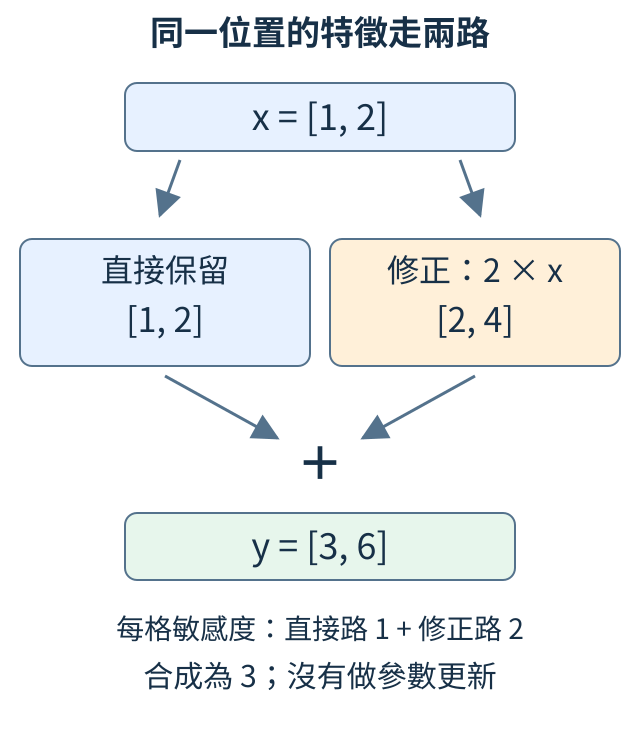
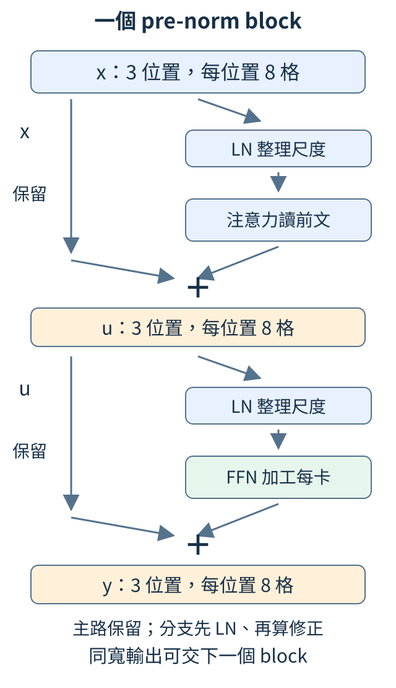
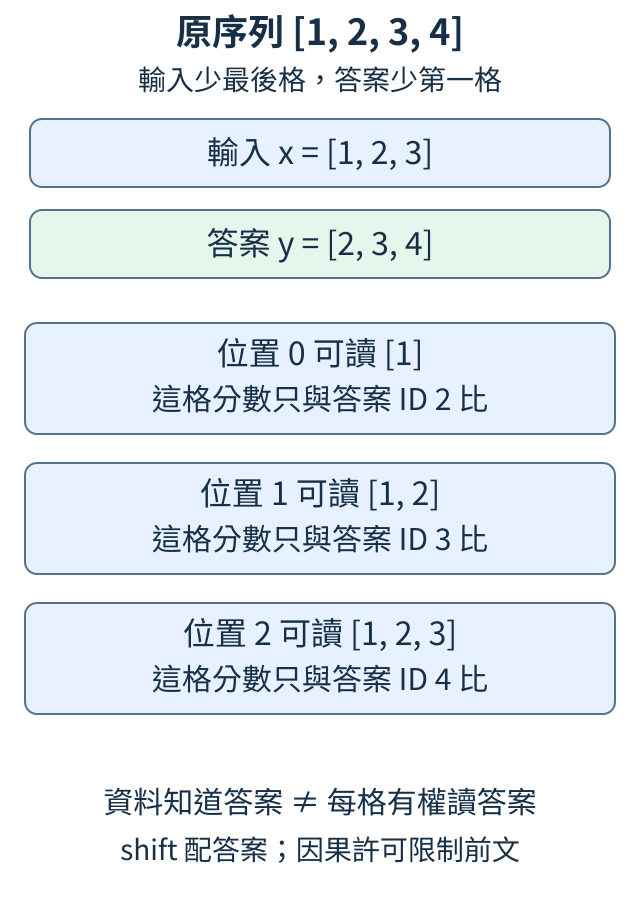

# 第 4 章：把零件接成第一個 Transformer

上一章已能按內容讀取前文。現在讓整段文字走完一條猜字路線：查字特徵與位置，經注意力讀前文、在各位置處理特徵，最後替候選字打分。把這些計算接成可重複的層，就得到本章的 Transformer。我們先採每個位置都用完整特徵配方的 Dense 版本，核對輸入、答案與求導，再談增加層數會改變什麼。

## 4.1 同一個字放不同位置，怎樣提供不同線索？

「貓追狗」與「狗追貓」字相同、順序不同。字特徵只靠 ID 查表，單看「貓」那一排不知道它放在哪格。因此除了文字內容，我們再提供位置線索。

先用「貓看貓」，約定 ID 1=貓、2=看。兩次貓都查到 `[1,0,0]`；再讓位置 0、1、2 各查一排三數，與字向量逐格相加。這叫**位置表示**，本節使用可調的絕對位置表。

| 位置 | 字特徵 | 本節指定的位置特徵 | 相加後 |
| --- | --- | --- | --- |
| 0／貓 | `[1,0,0]` | `[0,0,0]` | `[1,0,0]` |
| 1／看 | `[0,1,0]` | `[0.1,0.2,0.3]` | `[0.1,1.2,0.3]` |
| 2／貓 | `[1,0,0]` | `[0.2,0.4,0.6]` | `[1.2,0.4,0.6]` |

```python
import torch
from torch import nn

e = nn.Embedding(4, 3)
p = nn.Embedding(5, 3)
with torch.no_grad():
    e.weight.copy_(torch.tensor([[0.0, 0.0, 0.0], [1.0, 0.0, 0.0], [0.0, 1.0, 0.0], [0.0, 0.0, 1.0]]))
    p.weight.copy_(torch.tensor([[0.0, 0.0, 0.0], [0.1, 0.2, 0.3], [0.2, 0.4, 0.6], [0.3, 0.6, 0.9], [0.4, 0.8, 1.2]]))
ids = torch.tensor([1, 2, 1])
positions = torch.arange(3)
x = e(ids) + p(positions)
print(positions)
print(x)
assert not torch.equal(x[0], x[2])
```

`e` 是字表，`p` 是位置表。`torch.arange(3)` 產生 `[0,1,2]`，選位置表的相應列；`e(ids)+p(positions)` 正是表中的逐格相加。最後檢查兩次貓的相加結果不同。

這些位置小數由人指定，沒有「位置越後，每格必須等差增加」的要求。真正使用這種模型時，位置表通常從亂數開始，與字表一起訓練。加入位置使線索可用，後面的計算還要學會使用它，不代表相加後已懂語序。

因果許可決定誰能讀誰，位置特徵給每位置額外數字，兩者用途不同。即使模型能從許可範圍取得一些順序線索，本節也讓位置明確參與特徵計算。

練習在填表的 `with torch.no_grad():` 區塊加 `p.weight.zero_()`，並把斷言改成 `assert torch.equal(x[0],x[2])`。兩次貓又相同，差異正是位置表帶來的。

位置表有五列，只容許位置 0 到 4。設定能放五格，只表示這些索引有效；某位置是否被充分訓練、長文是否能用好線索，仍是別的問題。

<details>
<summary>補充與重做</summary>

字特徵見 [2.1](02.md#2.1)，逐格相加要兩表同寬。本例輸入位置 5 會超出表格範圍。`no_grad()` 的縮排範圍只包手動修改，見 [1.12](01.md#1.12)；輸出附的 `AddBackward0` 是相加的求導記錄。後面的 RoPE 與視窗延伸會改變位置方法，本節先建立查表起點。

</details>

## 4.2 新計算怎樣加回去，又保留已有表示？

假設一個位置已經有兩格 `[1,2]`，分支算出修正 `[2,4]`。我們希望用新資訊，又不讓原表示必須整份透過新分支，所以留一條直接路，最後逐格相加，得 `[3,6]`。

這叫**殘差連線**，寫成 `y=x+f(x)`。x 是已有表示，f(x) 是修正；兩邊必須同形狀。本節用簡單 `f(x)=2*x` 看清兩路，並測試輸出對輸入的敏感度。



圖中直接路保留 `[1,2]`，修正路產生 `[2,4]`。前向數值相加，反向求導時同一格也有兩條影響路徑。

```python
import torch

x = torch.tensor([1.0, 2.0], requires_grad=True)
correction = 2 * x
y = x + correction
y.sum().backward()
print("結果", y.detach())
print("對輸入的敏感度", x.grad)
assert torch.equal(x.grad, torch.tensor([3.0, 3.0]))
```

輸出印 `[3,6]`，梯度印 `[3,3]`。為什麼每格敏感度是 3？讓某格 x 微增 0.001，直接路使相應輸出增 0.001，乘二路再增 0.002，總共增 0.003。因此兩路影響是 1+2=3，與鏈式法則的各路求導相容。

`y.sum()` 只為把兩格輸出加成單個數，以便測敏感度；它不是文字答案的 loss。程式也沒有可調分支參數或更新步驟。

殘差讓已有資訊沿直接路往後算，也讓梯度沿這條路往前層傳回。即使修正暫時接近 0，直接路仍有一份資訊與敏感度。它不保證訓練永不失敗，也不表示所有原文能完整還原；作用是讓每層可在已有表示上學修正。

練習把 `correction=2*x` 改成 `0*x`，輸出變 `[1,2]`，梯度變 `[1,1]`，將斷言同步修改再核對。分支不提供改變時，主路仍工作。

<details>
<summary>補充與重做</summary>

兩格屬於同一位置的特徵，不是兩個文字位置。更一般的導數寫 `I+df/dx`，I 代表各特徵沿直接路原樣傳遞。本例不需矩陣微積分，只要看每格 1+2；多路求導背景見 [1.10](01.md#1.10)。

</details>

## 4.3 每位置的一排數字，怎樣先整理尺度？

兩個位置的特徵是 `[1,2,3]` 與 `[10,20,30]`，相對排列相同，大小卻差十倍。送入後續配方前，常先讓每張卡各自整理尺度，避免數值任意放大。

**層正規化**叫 LayerNorm，簡稱 LN。每位置先減自己的平均，再除自己的標準差：第一排平均 2，減後 `[-1,0,1]`；平方偏離的平均是 2/3，標準差約 0.816，整理後約 `[-1.225,0,1.225]`。第二排用平均 20、標準差約 8.165，也得到近似相同結果。

```python
import torch
from torch import nn

x = torch.tensor([[[1.0, 2.0, 3.0], [10.0, 20.0, 30.0]]])
layer = nn.LayerNorm(3)
y = layer(x)
print(y)
print("平均", y.mean(dim=-1))
print("變異數", y.var(dim=-1, unbiased=False))
assert torch.allclose(y.mean(dim=-1), torch.zeros(1, 2), atol=1e-6)
```

輸入形狀 `[1,2,3]` 表示一筆、兩位置、每位置三格。`LayerNorm(3)` 沿最後三格，給每張卡各算平均與變異數；不是沿兩個位置一起算。輸出兩排都接近上面的結果，平均約 0，變異數約 1。斷言核對平均接近 0；`atol=1e-6` 指定百萬分之一的絕對差容許量，讓微小浮點誤差不會被當成不相等。

實際分母是 `sqrt(變異數+epsilon)`，加小正數 epsilon 防止三格全相同時除以 0。之後每格還可乘自己的可調倍率 γ、加偏移 β；初始 γ=1、β=0，所以現在看到整理結果。若後來全設 γ=2、β=1，輸出平均會為 1、變異數接近 4。LN 是先整理再可調，最終不必永遠零平均。

這種計算不跨位置，也不依賴同批另一句。因此把第二個位置（索引 1）每格加 100，第一個位置因為沒有改動而保持原樣；第二個位置也因為平均同步加 100，整理結果近乎不變。用下面的小段核對：

```python
first = layer(x)
x[0, 1] += 100
shifted = layer(x)
print(torch.allclose(first[0, 0], shifted[0, 0]))
print(torch.allclose(first[0, 1], shifted[0, 1]))
```

兩行應都為 `True`。再從原始輸入重新開始，只把修改那行換成 `x[0,1,0]+=100`，只增第二個位置（索引 1）的第一格（索引 0）；第一行仍 True，第二行變 False。全排平移與格間關係改變，是不同操作。

如果誤跨位置算平均，前面位置可能間接使用後面資料，即使注意力遮罩正確也會偷看。用「每張位置卡自己整理」來核對軸，才能保住前文限制。

<details>
<summary>補充與重做</summary>

`dim=-1` 是最後特徵軸，`x[0,1]` 是第一筆（索引 0）、第二個位置（索引 1）的整排，`x[0,1,0]` 才是其中一格。`unbiased=False` 用三格平方偏離的平均，與 LN 約定相同。變異數與標準差見 [3.5](03.md#3.5)。公式為 `z_j=(x_j-m)/sqrt(v+epsilon)`、`y_j=γ_j*z_j+β_j`，j 是特徵格；同一格的 γ/β 在各位置共用。

</details>

## 4.4 讀完前文後，每位置自己的特徵怎樣加工？

注意力讓當前位置從其他位置帶回資料；接著還需要把手上的一排特徵組合成新特徵。這個工作在各位置獨立完成，叫**前饋網路**（Feed-Forward Network，FFN）。

本節用同一套配方處理兩個位置，各輸入 `[1,1,1,1]`。先將四格擴大為十六個中間特徵，經過非線性轉換，再縮回四格。擴張的是特徵，不是文字位置；縮回則讓結果能加到四格的殘差主路。

```python
import torch
from tiny_perceptron.modern import DenseFFN

torch.manual_seed(42)
layer = DenseFFN(4)
x = torch.ones(1, 2, 4)
y = layer(x)
print("擴張權重", layer.up.weight.shape)
print("縮回權重", layer.down.weight.shape)
print(y.shape, y)
assert torch.allclose(y[:, 0], y[:, 1])
```

擴張權重 `[16,4]`，縮回權重 `[4,16]`，對應四到十六、十六到四兩套 Linear。非線性叫**高斯誤差線性單元**（Gaussian Error Linear Unit，GELU），會平滑地調整每個數的大小，較正的通常保留更多、較負的被縮小，也可能保留小負值；它不同於 ReLU 直接清掉所有負數。

輸出仍 `[1,2,4]`。兩個位置輸入完全相同，又使用同一配方，因此輸出兩排逐格相同，斷言核對的是值，不只是形狀。權重從亂數開始，這些輸出沒有固定字義。

這裡的 **Dense** 表示每個位置都用完整這套 FFN，不依當前字只選部分配方。共享配方不等於位置互相讀取：改變位置 1，只會透過此 FFN 改位置 1，跨位置交流由注意力做。

練習儲存 y 後，改 `x[0,1,0]=2`，再算 `changed=layer(x)`。第 0 位置應與原 y 相同，第 1 位置通常不同。用逐格比較核對，分清「每位置內部加工」和「跨位置讀取」。

<details>
<summary>補充與重做</summary>

Linear 見 [2.3](02.md#2.3)，非線性為何有用見 [2.4](02.md#2.4)。`manual_seed(42)` 固定初始化起點，這次沒有答案、求導或更新。GELU 的完整公式暫不需要；本節關心非線性放在擴張與縮回之間，以及位置數不變。

</details>

## 4.5 注意力、FFN與殘差怎樣接成一層？

現在有四種動作：LN 整理每張位置卡，注意力讀前文，FFN 加工各卡，殘差把新修正加回舊卡。希望把它們接成能反覆使用的一層，而且輸入與輸出保持同樣的筆數、位置數與特徵寬度。

這種層塊叫 **block**。本章採「分支先整理再算」，叫 **pre-norm**，分兩段：

`u=x+Attention(LN(x))`

`y=u+FFN(LN(u))`

第一段留著 x，分支整理後讀前文，再加回修正。第二段留著 u，分支整理後加工特徵，再加回。主路沒有被 LN 永久替換；LN 在分支中。



圖裡每條主路都是同樣三位置、每位置八格。注意力分支允許讀前文，FFN 分支在每位置獨立算；最後的輸出可交下一個同寬 block。

```python
import torch
from tiny_perceptron.model import Block, ModelConfig

torch.manual_seed(42)
config = ModelConfig(width=8)
block = Block(config)
x = torch.randn(2, 3, 8)
y, cache, auxiliary = block(x)
print("輸入", x.shape, "輸出", y.shape)
print("額外代價", auxiliary.item())
assert y.shape == x.shape
```

`ModelConfig(width=8)` 記錄模型設定，這次每位置八格，其他用預設。輸入兩筆、三位置、每位置八格，輸出也為 `[2,3,8]`。數值已經過兩次修正，相同形狀不表示內容沒變。

兩行輸出是「輸入/輸出 `torch.Size([2,3,8])`」與「額外代價 `0.0`」。工具還回傳快取 `cache` 以及額外代價 `auxiliary`；本章 Dense 沒有那項附加代價，所以為 0，**不是答案 loss 為 0**。現在甚至還沒與正確下一字比較。

本節只檢查連線和形狀，隨機輸出不說明語言能力。練習只把筆數 2 改成 1，輸出應變 `[1,3,8]`；把位置數 3 改成 4，則變 `[2,4,8]`。改寬度則需模型設定一起改，因為各配方的輸入格數必須吻合。

<details>
<summary>補充與重做</summary>

快取是儲存的 K/V，見 [3.7](03.md#3.7)。另有先計算並相加、再正規化的 post-norm 排列，順序會改計算路徑；本節只用 pre-norm。`auxiliary.item()` 將單個額外代價取成 Python 數字，不會更新參數。

</details>

## 4.6 每位置的八個特徵，怎樣變成候選字分數？

經過 block 後，每位置還是八個內部特徵；我們想要的卻是「下一字各候選得幾分」。因此最後再接一個八格到候選數的 Linear：每個候選各有一套權重，把八格加權成一個分數。

這個最後配方叫**輸出層**，也常叫語言模型 head；這裡的 head 是輸出功能，和注意力頭不是同一個零件。尚未變成最終預測的一排特徵叫**隱藏表示**，只是內部計算的名字。

先用二十個候選 ID 0 到 19，不賦予真實字義。輸入一筆 `[1,2,3]`，每位置都應產生二十個分數。

```python
import torch
from tiny_perceptron.model import TinyLM, ModelConfig

torch.manual_seed(42)
model = TinyLM(ModelConfig(vocab_size=20, width=8))
ids = torch.tensor([[1, 2, 3]])
logits = model(ids)["logits"]
print(logits.shape)
print("第一位置的前五個候選分數", logits[0, 0, :5])
print("各位置最高分ID", logits.argmax(dim=-1))
assert logits.shape == (1, 3, 20)
```

輸出 `[1,3,20]`：一筆、三個預測位置、每位置二十候選。`TinyLM` 依序接好字表、位置表、block、最後 LN 與輸出層，字典裡的 `"logits"` 是原始分數，還不是機率。

| 預測位置 | 這格可讀的前文 ID | 本例若正確續接，答案 ID |
| --- | --- | ---: |
| 0 | `[1]` | 2 |
| 1 | `[1,2]` | 3 |
| 2 | `[1,2,3]` | 4 |

三排是在答三道不同的下一字題。`argmax(dim=-1)` 沿候選軸取最高分，所以輸出 `[1,3]`，各格各有一個猜測。續寫只先用最後那排選新 ID，再把它接回輸入重算，而不是把三格猜測一次全接上。

若要用表中的三個答案算平均代價，每位置當一題，把 `[1,3,20]` 排成 `[3,20]`，答案 `[1,3]` 排成 `[3]`，再交給交叉熵：

```python
import torch.nn.functional as F

target = torch.tensor([[2, 3, 4]])
scores_for_questions = logits.reshape(-1, logits.shape[-1])
answers_for_questions = target.reshape(-1)
print("三題平均代價", F.cross_entropy(scores_for_questions, answers_for_questions).item())
```

`reshape` 只整理形狀，不改題目順序；`-1` 推算題數 3，最後候選軸仍 20。三排依次跟答案 2、3、4 比，本次初始化的平均代價約 3.336。這是隨機模型的計算示範，不能說已知道這些答案。

練習將字表大小 20 改成 25，輸入不變。輸出應 `[1,3,25]`，最高分 ID 可能因為重新初始化而變；確定增加的是每題五個候選分數。

<details>
<summary>補充與重做</summary>

原始分數與交叉熵見 [1.7](01.md#1.7)、[1.8](01.md#1.8)。本例輸入 embedding 與輸出 Linear 各有自己的可調表，沒有共享權重；後面另會討論共享。合法 ID 必須落在字表範圍，輸入 20 對二十字表會超界。這份無文字字義的 ID 例子只是介面材料，不是正文語料或訓練成果。

</details>

## 4.7 一次算整段時，答案該怎樣對齊？

有完整序列 `[1,2,3,4]` 時，希望模型在看到 1 後猜 2，看到 1、2 後猜 3，看到 1、2、3 後猜 4。與第一章同樣只移一格：輸入 `[1,2,3]`，答案 `[2,3,4]`。



圖中上方資料知道全部四格，下面每題的可讀前文卻受因果許可限制。訓練可同時算三題，是因為答案已經提供給評分；這不表示每題有權讀後面那格。生成不知道新答案，仍需逐字接長。

```python
import torch
from tiny_perceptron.data import shifted
from tiny_perceptron.model import TinyLM, ModelConfig, masked_loss

torch.manual_seed(42)
x, y = shifted([1, 2, 3, 4])
model = TinyLM(ModelConfig(vocab_size=5, width=8))
logits = model(x[None])["logits"]
loss = masked_loss(logits, y[None])
print("問題答案", list(zip(x.tolist(), y.tolist())))
print("分數形狀", logits.shape, "平均代價", loss.item())
loss.backward()
```

`shifted` 回傳輸入 x 與答案 y，兩者各三格。`x[None]` 加筆數軸成為 `[1,3]`，模型得到 `[1,3,5]` 分數；字表五候選，合法 ID 是 0 到 4。

第一行印 `(1,2)、(2,3)、(3,4)`，指各輸入位置與答案；較後位置還能讀更早輸入。`masked_loss` 將同位置分數與 y 比，本例沒有忽略答案，所以取三題交叉熵平均。它不會再幫你 shift。

`loss.backward()` 只將答案代價對各參數的敏感度存起來，這次沒有 `step()` 或手動更新。模型尚未學會這段序列；示範目的是讓資料→模型→代價→梯度整條路接通。

若工具已 shift，模型內又 shift 一次，就會把「看 1 猜 2」改成「看 1 猜 3」。反過來把 `y=x.clone()`，長度仍吻合、程式仍能跑，卻改成複製目前字。先逐題讀對應，比看到 loss 是正數更有用。

練習延長原序列成 `[1,2,3,4,0]`，先手寫四對，再執行核對輸出 `[1,4,5]`。這時配對應為 `(1,2)、(2,3)、(3,4)、(4,0)`。

<details>
<summary>補充與重做</summary>

現有 [T.4](../training.md#T.4) 用 12 篇 `color=red;shape=circle;side=left.` 類短文，分 9／1／2 篇並實際更新。防偷看檢查將輸入 `[1,10,11,12,13]` 最後 ID 改成 14，比較前四位置全部候選分數，最大絕對差為 0.0；見 [原始報告](https://github.com/birdhackor/tiny-perceptron-vlm/blob/main/docs/course-experiments/results/text_foundation.json) 的 `results.causal_max_difference`。這項檢查確認改後格不影響前面，不能由單看 loss 下降取代。短機製程式與這個訓練實報是不同層次的證據。

</details>

## 4.8 多一層，是多了什麼計算與成本？

一層 block 讀前文並修正表示；第二層拿的是**第一層更新後的表示**，再讀取與加工。層數叫**深度**，不是把相同原卡平均三次。更多層有機會構成更複雜規則，但每層也要儲存自己的配方並增加運算。

先固定二十候選、每位置八格、位置表最多 128 格，只改深度 1、2、3。希望檢查輸出仍是相同形狀，並數清每多一層加多少參數。

```python
import torch
from tiny_perceptron.model import TinyLM, ModelConfig

for depth in [1, 2, 3]:
    model = TinyLM(ModelConfig(vocab_size=20, width=8, layers=depth))
    count = model.description()["parameters"]
    logits = model(torch.tensor([[1, 2]]))["logits"]
    print("層數", depth, "參數格數", count, "輸出", logits.shape)
    assert logits.shape == (1, 2, 20)
```

三次輸出都為 `[1,2,20]`：一筆兩位置，每位置二十候選。中間寬度八格不會把候選數變成八。參數格數為：

| 深度 | 總參數格數 | 比前一個多 |
| --- | ---: | ---: |
| 1 | 2,200 | — |
| 2 | 3,040 | 840 |
| 3 | 3,880 | 840 |

為什麼三層不是一層的三倍？字表、位置表、最後 LN 與輸出層只在入口出口各存一套，本例共 1,360 格；各 block 則獨立儲存 840 格。因此總數為 `1360+深度×840`。

更深也需要更多前向、求導與中間材料。寬度增加則影響許多矩陣的兩邊：8×8 變 16×16 是四倍；字表與位置表只有一邊是寬度，則約兩倍。不能將層數、寬度、候選數都用同一倍率估算。

這幾份模型都未訓練，只檢查結構，不提供三層更準的證據。要比較品質，應固定資料，交代更新步數或計算預算，並在保留資料上評估。更多參數也可能只記住少量訓練句。

練習只把寬度從 8 改成 16，候選仍二十，輸出保持 `[1,2,20]`。預測參數增加但非全部翻倍，再執行記錄每多一層的差額，與原本 840 比較。

<details>
<summary>補充與重做</summary>

本例入口出口：字表 `20×8=160`，位置表 `128×8=1024`，最後 LN 的倍率與偏移 `8+8=16`，輸出權重 `8×20=160`，共 1360。每個 block 的明細如下。

| 每 block 的可調數字 | 計算式 | 格數 |
| --- | --- | ---: |
| Q、K、V 與注意力輸出的四張權重 | `4×8×8` | 256 |
| FFN 擴張、縮回權重 | `32×8+8×32` | 512 |
| FFN 兩份偏移 | `32+8` | 40 |
| 兩個 LN 的倍率與偏移 | `2×(8+8)` | 32 |

合計 840。注意力及候選輸出在這個設定沒有偏移；FFN 兩層有偏移，非線性本身無可調數字。

現有 [T.4](../training.md#T.4) 的另一個模型字表 264、寬度 64、位置上限 128、兩層，共 `42112+2×49728=141568` 格。264 是文字內容與控制編號的完整候選表，不是 264 箇中文字。那份記錄示範訓練、存檔與生成；沒有另做同預算一層對照，不能用來證明兩層更好。完整操作保留在 T.4。

</details>
