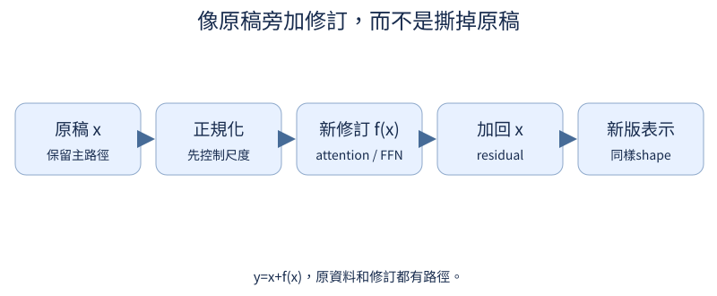
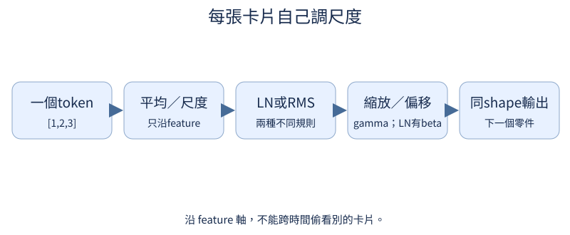

# 第 4 章：第一個 Dense Transformer 語言模型

前置：第3章的因果 attention。完整可讀實作在 tiny_perceptron/model.py；預設只用 learned position、LayerNorm、Dense FFN，還沒有 FlashAttention 或 MoE。

## 4.1 怎麼知道字的順序？

**先想一想：**相同字在第一格與第三格，向量還一樣嗎？



沒有位置資訊時，交換前文順序可能只留下相同內容集合。把每個位置自己的向量加進輸入，讓「第幾格」成為可辨線索。

**把直覺寫成數學：**$x_t=E[token_t]+P[t]$，兩者 feature 維度必須相同。

**最小實驗：**以下程式只處理這節的問題。

```python
e, p = nn.Embedding(4, 3), nn.Embedding(5, 3)
ids = torch.tensor([1, 2, 1])
x = e(ids) + p(torch.arange(3))
print(x)
assert not torch.equal(x[0], x[2])
```

**如何讀結果：**這是 learned absolute positions；RoPE 留到14.1，不能超過position表長度。

**只改一件事：**只把位置向量全設為0，再比較相同字。

## 4.2 怎麼保留原本的資訊？

**先想一想：**f(x)=2x 時，梯度是2還是3？

讓一條路直接保留原資料，另一條路只補上修正。即使修正暫時很小，原資訊仍能向後走，梯度也有直接路徑。

**把直覺寫成數學：**$y=x+f(x)$，$dy/dx=I+df/dx$。

**最小實驗：**以下程式只處理這節的問題。

```python
x = torch.tensor([1.0, 2.0], requires_grad=True)
y = x + 2 * x
y.sum().backward()
print(y.detach(), x.grad)
assert torch.equal(x.grad, torch.tensor([3.0, 3.0]))
```

**如何讀結果：**residual 不是把兩個 loss 相加，而是同一個表示的兩條路合起來。

**只改一件事：**只把 f(x) 改成0*x。

## 4.3 各位置的數值尺度怎麼控制？

**先想一想：**把別筆資料放進batch，原本token的LN會改變嗎？



每一個 token 自己計算 feature 平均和變異數，避免數值尺度漂移。不要跨時間平均，否則會混入其他 token，甚至未來資訊。

**把直覺寫成數學：**$LN(x)=(x-\mu)/\sqrt{var(x)+\epsilon}\cdot\gamma+\beta$；μ/var 沿最後 feature 軸。

**最小實驗：**以下程式只處理這節的問題。

```python
x = torch.tensor([[[1.0, 2.0, 3.0], [10.0, 20.0, 30.0]]])
layer = nn.LayerNorm(3)
y = layer(x)
print(y, y.mean(-1), y.var(-1, unbiased=False))
assert torch.allclose(y.mean(-1), torch.zeros(1, 2), atol=1e-6)
```

**如何讀結果：**epsilon 避免零variance；小epsilon下variance接近1，不必硬等於1。

**只改一件事：**只在第二token加100，檢查第一token不變。

## 4.4 混合位置後怎麼處理特徵？

**先想一想：**兩個位置完全相同的輸入，FFN輸出應相同嗎？

attention 混合不同位置，FFN 在每個位置內混合 features。同一套FFN權重沿序列重複使用，每個token都使用完整參數。

**把直覺寫成數學：**$FFN(x)=W_2\,GELU(W_1x+b_1)+b_2$；可把feature先擴張再縮回。

**最小實驗：**以下程式只處理這節的問題。

```python
from tiny_perceptron.modern import DenseFFN

layer = DenseFFN(4)
x = torch.ones(1, 2, 4)
y = layer(x)
print(y.shape, y)
assert torch.allclose(y[:, 0], y[:, 1])
```

**如何讀結果：**這一段沒有跨位置互相看；下章MoE才改成每token選部分FFN。

**只改一件事：**只改第二位置的一個feature。

## 4.5 一層模型怎麼組成？

**先想一想：**block 會把序列長度或hidden size改變嗎？

先把規範化、attention、residual接起來，再接規範化、FFN、residual。pre-norm 是先正規化才進分支，主路徑仍保留原表示。

**把直覺寫成數學：**$u=x+Attention(LN(x))$；$y=u+FFN(LN(u))$。

**最小實驗：**以下程式只處理這節的問題。

```python
from tiny_perceptron.model import Block, ModelConfig

block = Block(ModelConfig(width=8))
x = torch.randn(2, 3, 8)
y, cache, auxiliary = block(x)
print(x.shape, y.shape, auxiliary.item())
assert y.shape == x.shape
```

**如何讀結果：**blocks可堆疊，因為輸入輸出契約相同；auxiliary在Dense基準是0。

**只改一件事：**只把batch數改成1。

## 4.6 隱藏向量怎麼變成下一字的分數？

**先想一想：**hidden size=8，詞表=20，最後一軸是幾？

每個隱藏向量還不是字。輸出Linear為詞表中每個候選給一個分數，再用cross-entropy比較正確答案。

**把直覺寫成數學：**$[B,T,D]\times[D,V]\to[B,T,V]$；V與tokenizer詞表一致。

**最小實驗：**以下程式只處理這節的問題。

```python
from tiny_perceptron.model import TinyLM, ModelConfig

model = TinyLM(ModelConfig(vocab_size=20, width=8))
logits = model(torch.tensor([[1, 2, 3]]))["logits"]
print(logits.shape)
assert logits.shape == (1, 3, 20)
```

**如何讀結果：**logits可以是任意實數，還不是機率；ID最大值不得超過詞表。

**只改一件事：**只改vocab_size，查看參數量與最後一軸。

## 4.7 一次訓練多個位置怎麼對齊答案？

**先想一想：**模型內shift加資料外shift，會猜到幾格後的字？

整段一次forward時，每個位置各猜自己的下一字。相同因果mask允許平行算所有訓練位置；生成時才必須逐步加入新字。

**把直覺寫成數學：**原序列 [a,b,c,d] → X=[a,b,c]，Y=[b,c,d]，logits 的每格對應同位置的Y。

**最小實驗：**以下程式只處理這節的問題。

```python
from tiny_perceptron.data import shifted
from tiny_perceptron.model import TinyLM, ModelConfig, masked_loss

x, y = shifted([1, 2, 3, 4])
model = TinyLM(ModelConfig(vocab_size=5, width=8))
logits = model(x[None])["logits"]
loss = masked_loss(logits, y[None])
print(list(zip(x.tolist(), y.tolist())), loss.item())
loss.backward()
```

**如何讀結果：**loss會把每個有效位置平均；shift只做一次，TinyLM本身不改labels。

**只改一件事：**只故意把Y再shift一次，說出shape或語意哪裡錯。

## 4.8 增加深度改變了什麼？

**先想一想：**兩層模型的總參數剛好是單層兩倍嗎？

增加block讓表示能多次混合與修正，也增加參數和計算。未訓練模型的隨機loss不能證明更深一定更好。

**把直覺寫成數學：**深度增加主要block參數；embedding與輸出層不會跟著每層複製。

**最小實驗：**以下程式只處理這節的問題。

```python
from tiny_perceptron.model import TinyLM, ModelConfig

for depth in (1, 2, 3):
    model = TinyLM(ModelConfig(vocab_size=20, width=8, layers=depth))
    print(depth, model.description()["parameters"])
    assert model(torch.tensor([[1, 2]]))["logits"].shape == (1, 2, 20)
```

**如何讀結果：**比較品質要另外用相同資料與明示預算訓練，這裡只檢查結構。

**只改一件事：**只改width，觀察參數不是線性增長。
