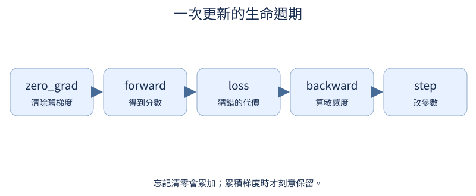
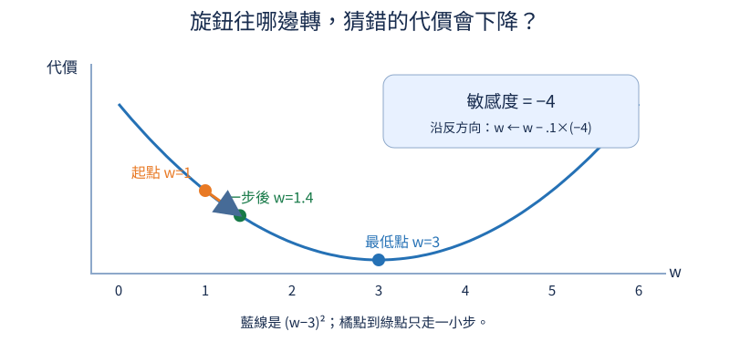
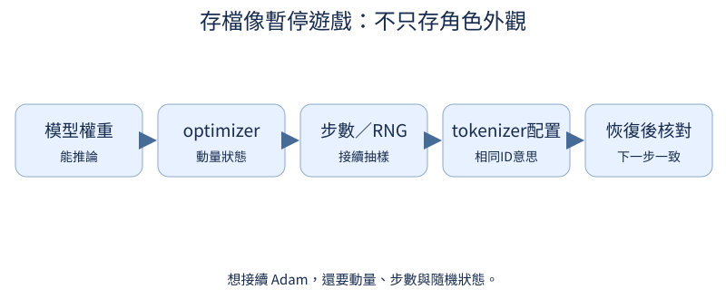
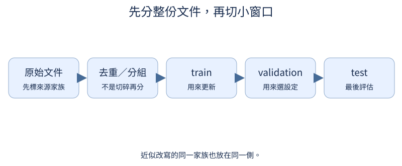

# 第 5 章：訓練與評估形成一個流程

前置：第4章的 logits／shift／loss。程式預設只做結構、梯度與記錄檢查。凡是涉及學到能力的對照，先給可執行配方，之後由讀者在 GPU 上跑；不會把隨機模型的輸出寫成訓練成果。

## 5.1 訓練迴圈真的正常嗎？

**先想一想：**訓練集做不好時，增加新資料一定有用嗎？



先讓模型反覆看極少量正確資料。如果連固定例子都記不住，先查shift、有效labels與梯度，再談泛化。這個測試故意允許背答案。

**把直覺寫成數學：**同一資料的CE可以往0靠近；這是程式診斷，不是最終品質指標。

**最小實驗：**以下程式只處理這節的問題。

```python
from tiny_perceptron.model import TinyLM, ModelConfig, masked_loss

model = TinyLM(ModelConfig(vocab_size=5, width=8))
x, y = torch.tensor([[1, 2, 3]]), torch.tensor([[2, 3, 4]])
loss = masked_loss(model(x)["logits"], y)
loss.backward()
print("初始loss", loss.item(), "embedding梯度", model.embedding.weight.grad.norm().item())
print("讀者訓練入口：python scripts/train.py --task sft --train --steps 200 --batch-size 1")
```

**如何讀結果：**這格沒有更新權重。真的執行訓練後，畫同一例子loss，若不降就先回查資料。CLI預設合成加法小世界；要精確overfit一例，傳只有一列messages的JSONL。

**只改一件事：**只把labels改成全-100，確認程式直接報錯，而非顯示成功。

## 5.2 一次看多少例子？

**先想一想：**一筆有10個答案token，另一筆只有1個，可以各佔一半嗎？

mini-batch同時計算數筆例子，再把有效token的loss平均。較大的batch常讓梯度波動變小，但同一步用更多資料與記憶體。

**把直覺寫成數學：**平均loss的梯度等於各loss梯度的平均；不同長度例子應依有效token數加權。

**最小實驗：**以下程式只處理這節的問題。

```python
from tiny_perceptron.model import loss_sum

logits = torch.randn(2, 4, 5, requires_grad=True)
labels = torch.tensor([[1, 2, 3, 4], [1, -100, -100, -100]])
total, count = loss_sum(logits, labels)
print("有效token", count.item(), "平均loss", (total / count).item())
```

**如何讀結果：**總共有5個有效token，不是batch大小2。第16.6章用同樣分母累積梯度。

**只改一件事：**只加一個ignored padding位置。

## 5.3 更新方向怎麼累積？

**先想一想：**梯度突然反向，momentum會立刻完全反向嗎？



momentum把前幾步方向保留一部分，讓反覆一致的方向累積。它可以減少鋸齒，也可能因慣性越過谷底。

**把直覺寫成數學：**v_new=μv+g；w_new=w−ηv_new。這裡用未做偏差修正的基本形式。

**最小實驗：**以下程式只處理這節的問題。

```python
velocity = 0.0
position = 0.0
for gradient in (1.0, 1.0, -1.0):
    velocity = 0.9 * velocity + gradient
    position -= 0.1 * velocity
    print(gradient, velocity, position)
```

**如何讀結果：**這是給定梯度的數值演算，沒有跑模型訓練。

**只改一件事：**只把μ改成0，比較是否回到gradient descent。

## 5.4 各參數能用不同步幅嗎？

**先想一想：**兩個梯度分別1和100，Adam第一步的更新也相差100倍嗎？

Adam同時追蹤方向平均和梯度大小。用平方平均作分母，讓不同旋鈕有不同有效步幅，但不能保證所有問題都更好。

**把直覺寫成數學：**m=β₁m+(1−β₁)g；v=β₂v+(1−β₂)g²；偏差修正後以 m̂/(√v̂+ε) 更新。

**最小實驗：**以下程式只處理這節的問題。

```python
g = torch.tensor([1.0, 100.0])
m = torch.zeros(2)
v = torch.zeros(2)
m = 0.9 * m + 0.1 * g
v = 0.999 * v + 0.001 * g.square()
m_hat, v_hat = m / (1 - 0.9), v / (1 - 0.999)
update = 0.001 * m_hat / (v_hat.sqrt() + 1e-8)
print("原梯度", g, "第一步更新", update)
```

**如何讀結果：**相似更新來自正規化；後面多步累積不必一直相同。

**只改一件事：**只把第二個梯度改成負數。

## 5.5 怎麼獨立控制權重衰減？

**先想一想：**沒有任務梯度時，參數會保持原值嗎？

AdamW把權重衰減獨立於Adam的梯度縮放。即使loss梯度為0，只要有梯度tensor，weight decay仍可讓權重縮小。

**把直覺寫成數學：**w←(1−ηλ)w−η·Adam方向；λ是衰減強度。

**最小實驗：**以下程式只處理這節的問題。

```python
w = nn.Parameter(torch.tensor([2.0]))
opt = torch.optim.AdamW([w], lr=0.1, weight_decay=0.2)
w.grad = torch.zeros_like(w)
opt.step()
print(w.detach())
assert torch.allclose(w.detach(), torch.tensor([1.96]))
```

**如何讀結果：**這是一個參數的一步驗算；grad=None與grad=0不是同一種optimizer狀態。

**只改一件事：**只把weight_decay改成0。

## 5.6 學習率怎麼隨訓練變化？

**先想一想：**最早一步和最後一步，哪個應接近peak？

先用小learning rate暖身，再逐漸降低步幅，是一種配方選擇。不要一開始就把schedule和多種optimizer一起換。

**把直覺寫成數學：**warmup先線性增加；cosine decay依訓練進度平滑降低。

**最小實驗：**以下程式只處理這節的問題。

```python
from tiny_perceptron.training import learning_rate

rates = [learning_rate(i, 40, peak=0.001, warmup=5) for i in range(40)]
print("前6步", rates[:6], "後3步", rates[-3:])
assert max(rates) <= 0.001 + 1e-9
```

**如何讀結果：**排程需要固定總步數；延長總訓練時應重新說明排程，不假裝完全一樣。

**只改一件事：**只把warmup從5改成10。

## 5.7 訓練中斷怎麼接續？

**先想一想：**Adam的動量不存，下一步還會一樣嗎？



只存模型權重能推論，但要精確接續還需要optimizer的動量、步數、tokenizer配置和隨機狀態。先確認重載forward相同，再測下一次更新。

**把直覺寫成數學：**checkpoint是狀態快照，不是文字檔改副檔名；模型架構與tokenizer必須匹配。

**最小實驗：**以下程式只處理這節的問題。

```python
import tempfile
from pathlib import Path
from tiny_perceptron.model import TinyLM, ModelConfig
from tiny_perceptron.training import save_checkpoint, load_checkpoint

model = TinyLM(ModelConfig(width=8))
with tempfile.TemporaryDirectory() as d:
    path = Path(d) / "state.pt"
    save_checkpoint(path, model, step=3)
    loaded, payload = load_checkpoint(path)
    x = torch.tensor([[1, 2, 3]])
    assert torch.equal(model(x)["logits"], loaded(x)["logits"])
    print(payload["step"], payload["tokenizer"])
```

**如何讀結果：**本節沒有正式訓練；下一步更新的一致性由tests/test_models.py檢查。只載可信來源checkpoint。

**只改一件事：**只用不同width的模型載入，觀察相容性錯誤。

## 5.8 Loss 下降代表任務做得更好嗎？

**先想一想：**四個token答對三個，整串答案算對嗎？

teacher forcing每一步都給正確前文；自由生成會把自己的上一步答案放回去。第一步小錯可能造成後面完全不同，因此低loss不保證整串答對。

**把直覺寫成數學：**sequence exact match要求整串相同；token accuracy只看各位置。

**最小實驗：**以下程式只處理這節的問題。

```python
truth = [1, 2, 3, 4]
teacher_forced = [1, 2, 0, 4]
generated = [1, 2, 0, 0]
for name, prediction in (("teacher forcing", teacher_forced), ("自由生成", generated)):
    print(
        name,
        "token accuracy",
        sum(a == b for a, b in zip(truth, prediction)) / len(truth),
        "exact match",
        prediction == truth,
    )
```

**如何讀結果：**這是明示的資料例，不是模型訓練測量。真模型用scripts/evaluate.py同時記錄loss與生成。

**只改一件事：**只把第三個預測修正，核對整串指標。

## 5.9 每次實驗用了多少資源？

**先想一想：**相同參數量會有相同執行時間嗎？

先量清楚參數與本機forward耗時，再比較模型。GPU操作是非同步的，GPU計時前後需同步；CPU不用。不能把一次微小耗時當穩定benchmark。

**把直覺寫成數學：**FP32參數payload約參數數量×4 bytes；不包含optimizer與activation。

**最小實驗：**以下程式只處理這節的問題。

```python
import time
from tiny_perceptron.model import TinyLM, ModelConfig

model = TinyLM(ModelConfig(width=8))
x = torch.tensor([[1, 2, 3]])
model(x)
start = time.perf_counter()
for _ in range(10):
    model(x)
print(model.description(), "CPU每次forward秒", (time.perf_counter() - start) / 10)
```

**如何讀結果：**固定硬體、dtype、序列長度與warmup；這裡只記實測，不寫跨硬體速度結論。

**只改一件事：**只把T從3改成6。

## 5.10 用來選模型的分數能當最後成績嗎？

**先想一想：**試了100組設定後的validation最佳值可以當最終泛化分數嗎？



反覆看validation來選learning rate，就會逐漸適應validation。test必須先保留，最後才用；看到test分數後再改設定，test就不再獨立。

**把直覺寫成數學：**模型選擇用 argmax validation；最終報告用未參與選擇的test。

**最小實驗：**以下程式只處理這節的問題。

```python
candidates = [{"lr": 0.001, "validation": 0.7}, {"lr": 0.01, "validation": 0.8}]
selected = max(candidates, key=lambda r: r["validation"])
print("選擇", selected, "test仍封存；這裏只示範選擇規則")
```

**如何讀結果：**例中的分數是說明資料，不是實驗結果；真正結果需由讀者訓練後填入。

**只改一件事：**只增加一組較差validation的候選。

## 5.11 同一段文字出現很多次會怎樣？

**先想一想：**「貓  看狗」和「貓 看狗」會得到同指紋嗎？

同一句話的空白差異可能掩蓋重複。先明示正規化規則，再hash比較；不要無條件刪掉內容有意義的空白。

**把直覺寫成數學：**hash是內容指紋；完全相同正規化字串才視為完全重複。

**最小實驗：**以下程式只處理這節的問題。

```python
from tiny_perceptron.data import fingerprint

docs = ["貓  看狗", "貓 看狗", "狗 看貓"]
hashes = [fingerprint(s) for s in docs]
print("原始", len(docs), "正規化不同內容", len(set(hashes)))
assert hashes[0] == hashes[1]
```

**如何讀結果：**程式用split/join合併空白；程式碼、詩排版或JSON可能需要別的規則。

**只改一件事：**只改一個字，觀察hash完全不同。

## 5.12 改幾個字就算新資料嗎？

**先想一想：**只改句子末尾一個字，相似度應完全變0嗎？

近似重複不是hash相同。把字元片段當集合，量兩段文字共有多少片段，再以家族為單位切分，避免改寫版本跨split。

**把直覺寫成數學：**Jaccard(A,B)=|A∩B|/|A∪B|；這是相似度啟發式，不是語意等價證明。

**最小實驗：**以下程式只處理這節的問題。

```python
def grams(s, n=2):
    return {s[i : i + n] for i in range(len(s) - n + 1)}


a, b = grams("紅色圓形在左邊"), grams("紅色圓形在右邊")
score = len(a & b) / len(a | b)
print(score, a & b)
```

**如何讀結果：**閾值取決於資料；短句少量片段容易誤判，應人工抽查。

**只改一件事：**只把片段長度由2改爲3。

## 5.13 資料或模型變大，哪個值得花預算？

**先想一想：**大模型看更多資料也訓練更久，能知道進步來自哪裡嗎？

先畫出兩種模型容量×兩種資料量的四格設計。再決定要固定步數、tokens、FLOPs或時間；這些不是同一種公平。

**把直覺寫成數學：**密集Linear成本大致隨矩陣乘法維度乘積增加；不能用四個tiny點外推大型scaling law。

**最小實驗：**以下程式只處理這節的問題。

```python
from tiny_perceptron.model import TinyLM, ModelConfig

for width in (8, 16):
    parameters = TinyLM(ModelConfig(width=width)).description()["parameters"]
    for records in (16, 64):
        print(
            {
                "width": width,
                "records": records,
                "parameters": parameters,
                "steps": 100,
                "quality": "待讀者執行訓練後填入",
            }
        )
```

**如何讀結果：**這是實驗計畫，不是測量的品質表；保存原始JSONL與實際有效tokens。

**只改一件事：**只把四格改成相同token預算，再算所需步數。

## 5.14 模型不動或震盪要怎麼找步幅？

**先想一想：**learning rate越大，一步loss一定越小嗎？

當模型不動或loss發散，先在固定小資料試幾個步幅。小曲線找量級，再做正式比較；不要同時換架構、資料與optimizer。

**把直覺寫成數學：**一步更新可觀察L(w−ηg)；太大η可能跨過最小點。

**最小實驗：**以下程式只處理這節的問題。

```python
w = torch.tensor(1.0)
gradient = 2 * (w - 3)
for lr in (0.01, 0.1, 2.0):
    new = w - lr * gradient
    print(lr, "一步後toy loss", (new - 3).square().item())
print("模型配方：python scripts/train.py --train --lr 0.001 --steps 100")
```

**如何讀結果：**先用二次函數看過大步幅；模型曲線需實際跑並記錄固定seed。

**只改一件事：**只把起點w改成4。

## 5.15 一次比較略好就有進步嗎？

**先想一想：**每種方法只挑最好seed，會發生什麼？

初始化與抽樣造成波動。比較方法時使用同一組seeds，報告每次值與範圍；三次只提供很粗的局部證據。

**把直覺寫成數學：**比較配對差值比只看兩組最高分更可靠；小樣本不能支撐精確置信結論。

**最小實驗：**以下程式只處理這節的問題。

```python
from tiny_perceptron.model import TinyLM, ModelConfig

for seed in (1, 2, 3):
    torch.manual_seed(seed)
    model = TinyLM(ModelConfig(width=8))
    print(seed, model.embedding.weight.std().item(), "品質待訓練後量測")
```

**如何讀結果：**這裏只顯示初始化變化；不同隨機權重的loss差不代表方法改善。

**只改一件事：**只固定相同seed重建兩次，確認初值一致。

## 5.16 配比怎麼落到實際 batch？

**先想一想：**90筆每筆1token，加10筆每筆20token，主要在學誰？

設定90:10只是意圖；實際batch的來源數與有效答案tokens纔是執行結果。長答案來源即使筆數少，也可能佔大部分監督。

**把直覺寫成數學：**token配比=各來源有效token數/總有效token數，通常不等於樣本配比。

**最小實驗：**以下程式只處理這節的問題。

```python
counts = {"短答": 90, "長答": 10}
length = {"短答": 1, "長答": 20}
tokens = {k: counts[k] * length[k] for k in counts}
print(tokens, {k: v / sum(tokens.values()) for k, v in tokens.items()})
```

**如何讀結果：**混合資料時保留source標記，分項評估，固定共同token預算。

**只改一件事：**只把長答長度改爲1。

## 5.17 eval 就會停止計算梯度嗎？

**先想一想：**model.eval()後loss還能backward嗎？

eval改變dropout等模組行爲，不停用autograd。no_grad停用這次運算的圖。requires_grad=False只凍結特定參數。三者各解決不同問題。

**把直覺寫成數學：**能否backward由計算圖與requires_grad決定，不由model.training一個旗標決定。

**最小實驗：**以下程式只處理這節的問題。

```python
layer = nn.Linear(2, 1)
x = torch.ones(1, 2)
layer.eval()
output = layer(x)
print("eval的grad_fn", output.grad_fn)
output.sum().backward()
with torch.no_grad():
    other = layer(x)
print("no_grad的grad_fn", other.grad_fn)
assert output.requires_grad and not other.requires_grad
```

**如何讀結果：**教師/reference通常要同時eval、requires_grad_(False)、no_grad；理由分開看。

**只改一件事：**只freeze權重但讓輸入requires_grad=True，觀察仍能回傳到輸入。
