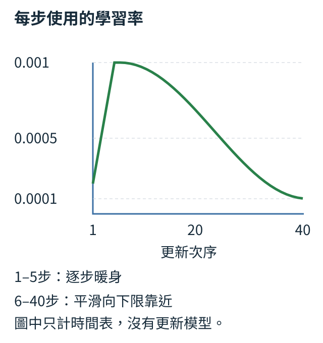

# 第 5 章：訓練與評估形成一個流程

先讓「狗看貓，」這一道固定題改善，再把幾題合成一次更新。本章沿這條關係認識動量、Adam、衰減、步幅與存檔，接著問新題是否更好。有效答案、不同資料、參數格數與秒數各有自己的單位；分清它們，才能選模型、比較配方和解讀結果。

## 5.1 訓練迴圈真的正常嗎？

「狗看貓，」是一條固定短句。我們把句號、狗、看、貓、逗號依序編成0、1、2、3、4；給模型「狗看貓」，要求三個位置分別接「看、貓、逗號」。先只練這一道題：如果連它的代價都降不下來，就值得檢查更新流程，再擴大資料。

下面用已組好的TinyLM，字表5項、每位置8個特徵、最多8位置。X是[1,2,3]，下一項答案Y是[2,3,4]。AdamW是依梯度調參數的工具，此處衰減設0，先觀察清梯度、算代價、求梯度、更新四步。

```python
import torch
from tiny_perceptron.model import TinyLM, ModelConfig, masked_loss

torch.manual_seed(42)
model = TinyLM(ModelConfig(vocab_size=5, width=8, max_length=8))
x = torch.tensor([[1, 2, 3]])
y = torch.tensor([[2, 3, 4]])
optimizer = torch.optim.AdamW(model.parameters(), lr=0.03, weight_decay=0.0)
before = masked_loss(model(x)["logits"], y).item()
for step in range(40):
    optimizer.zero_grad()
    loss = masked_loss(model(x)["logits"], y)
    loss.backward()
    if step == 0:
        print("第一步embedding梯度大小", model.embedding.weight.grad.norm().item())
    optimizer.step()
after = masked_loss(model(x)["logits"], y).item()
print("固定例子代價", before, "→", after)
assert after < before
```

`model.parameters()` 交給優化器模型全部可調數字。每次先清舊梯度，再前向算新預測與loss、`backward` 求導、`step` 更新，四步順序與 [1.12](01.md#1.12)、[1.13](01.md#1.13) 對上。最後重新算更新後代價，應明顯低於開始；精確小數依PyTorch環境而異。

`model.embedding`是輸入編號查向量的工具，`embedding.weight`是它保存的可調數字表：本例有5列，每列8個數，詳見[2.1的查表](02.md#2.1)。`.grad`保存這張表各格收到的更新訊號；`.norm()`把訊號各格平方加總再開根，得到一個大小。第一步這個大小應為正，說明答案代價已對字向量表產生影響。

梯度大小大於0，只說這張表收到訊號；代價下降才說明更新改善了固定題。若代價不動，依序看優化器是否拿到對的參數、step是否執行、梯度是否在更新前被清掉。固定題刻意允許記憶；新題改善需要另留資料。

練習把答案y的三格都改成-100。這個工具約定-100表示忽略答案，所以三格都忽略等於沒有學習目標。先預測 `masked_loss` 會直接報錯「所有labels都被忽略」，再執行核對；這次不應顯示成功下降的報告。流程拒絕空目標，才能避免把沒有訓練假裝成訓練完成。

<details>
<summary>補充：實作約定與原始紀錄</summary>

通過固定題之後，才把練習擴到幾篇短文。我們已用9篇小世界短文，讓一個兩層模型在L4 GPU上更新600次：用同一批訓練位置重新計算的平均代價，由5.79243降至0.06352。這一次確實有更新，而不只是呼叫`backward()`；但同一份模型在沒教過的那篇驗證短文，代價仍有0.96282。教過的題目與新題要分開看，正是[5.8](#5.8)接下來要處理的事。完整設定和重做入口在[T.4](../training.md#T.4)，不用把這份600步結果套到眼前width8、40步的診斷程式。

短程式沿用本課工具與原計算語義。安裝、長訓練與重做操作見[訓練配方](../training.md)，不需要先完成長配方才能閱讀這個例子。

</details>

## 5.2 一次看多少例子？

兩篇短文一起練，第一篇有四個下一項答案，第二篇只有一個。這次更新要聽「兩篇各一票」，還是「五個答案各一票」？本課選後者：五項代價相加再除以五，排齊矩陣的空位不投票。

一次共同計算的幾筆叫batch。以下只給候選分數和答案來看平均規則：兩筆各排四位置，五個候選沿用句號、狗、看、貓、逗號；第二筆後三個label=-100，表示沒有要計分的答案。

```python
import torch
from tiny_perceptron.model import loss_sum

logits = torch.zeros(2, 4, 5, requires_grad=True)
labels = torch.tensor([[1, 2, 3, 4], [1, -100, -100, -100]])
total, count = loss_sum(logits, labels)
mean_loss = total / count
print("有效答案", count.item())
print("總代價", total.item(), "平均代價", mean_loss.item())
mean_loss.backward()
```

輸入logits形狀 `[2,4,5]`：兩筆、每筆四位置、五候選。這些是尚未轉成機率的分數；五個相同的0分經過同一轉換，會得到相同機率，而五個機率總和是1，所以各為1÷5＝0.2。按1.8的負對數代價，任何有效答案的代價都是 `-log(0.2)≈1.609`。labels中五格是真答案，三格-100被排除。`loss_sum` 分別回傳代價總和與有效數量，所以輸出count=5、總數約8.047、平均約1.609。

`requires_grad=True`讓PyTorch記錄以這份分數進行的計算，供稍後`backward()`求出它們對代價的梯度。count、total和mean_loss都各自是只含一個數的tensor；`.item()`取出普通Python數字，方便列印。最後`backward()`對平均代價求導，被忽略的位置沒有答案代價貢獻。

先各篇平均再平均兩篇，短篇唯一答案會佔一半、長篇每項只佔八分之一，和每答案五分之一不同。梯度也能按代價相加與平均；平均後由優化器更新一次，和每題各更新一步不是同一流程。

練習把第二筆第二格答案從-100改成2，先預測有效數變6、總代價變約9.657、平均仍1.609，再執行核對。接著改回-100，應回到五；你改的是哪些答案進入統計，不是模型的候選字表。

<details>
<summary>補充：實作約定與原始紀錄</summary>

短程式沿用本課工具與原計算語義。安裝、長訓練與重做操作見[訓練配方](../training.md)，不需要先完成長配方才能閱讀這個例子。

</details>

## 5.3 更新方向怎麼累積？

同一格參數連續收到梯度1、1，第三次變-1。只聽當輪梯度會立即反向；保留先前方向的一部分，則可能再向原方向走一步。這種跨輪累積叫動量。

用v保存方向、w保存位置；g是當輪梯度，μ是保留比例，η是學習率。規則是新v＝μ×舊v＋g，再令新w＝舊w−η×新v。以下μ=0.9、η=0.1，兩個狀態都從0開始；三個梯度是我們指定的材料。

```python
velocity = 0.0
position = 0.0
for gradient in [1.0, 1.0, -1.0]:
    velocity = 0.9 * velocity + gradient
    position -= 0.1 * velocity
    print("新梯度", gradient, "保留方向", round(velocity, 3), "位置", round(position, 3))
```

輸入是我們指定的三個梯度1、1、-1，不是從模型測出的資料。v與w最初都0。第一步v=1，位置-0.1；第二步v=0.9+1=1.9，位置-0.29；第三步雖新梯度為-1，v仍為 `0.9×1.9-1=0.71`，位置繼續下降到-0.361。打印的三列把當前意見、歷史合成與真正參數移動分開，`round` 只是方便顯示。

第三步最值得觀察：當前代價的梯度已轉向，動量卻暫時延續先前方向。這可能幫助穿過小抖動，也可能讓參數越過谷底後還前進過頭。因而動量並不保證每一步的當下代價都下降，要與學習率一起看訓練曲線。μ靠近1時記憶較長，同時反轉也較慢。

這裡沒有定義代價函數，不能從位置越來越負判斷品質。每格參數各有自己的 v，續訓需保存它。動量也要與[1.13](01.md#1.13)的梯度累加分清：`backward()` 沿運算關係算當次梯度，再加進參數的 `.grad`。若在一次更新前多次呼叫而沒有清空 `.grad`，會把本輪多份梯度相加；本節的 v 則在更新後仍保留，讓過去方向繼續影響下一輪。

練習只把保留係數0.9改成0，先手算三位置為-0.1、-0.2、-0.1，再執行核對。第三步立即反向，因為沒有過去推力。最後試0.5，應得到v為1、1.5、-0.25：同樣的梯度序列，保留強度決定什麼時候轉彎。

<details>
<summary>補充：實作約定與原始紀錄</summary>

短程式沿用本課工具與原計算語義。安裝、長訓練與重做操作見[訓練配方](../training.md)，不需要先完成長配方才能閱讀這個例子。

</details>

## 5.4 各參數能用不同步幅嗎？

兩格參數的梯度是1與100，都用學習率0.001，基本梯度下降會分別移0.001與0.1。Adam再參考每格「過去通常多大」的梯度，用大小歷史調整方向的尺度。

m保存梯度加權平均，v保存平方梯度加權平均，β1、β2各控制一份歷史的保留比例：新m＝β1×舊m＋(1−β1)×g，新v＝β2×舊v＋(1−β2)×g²。兩格各保存自己的歷史；下面取β1=0.9、β2=0.999，只追第一步。

```python
import torch

g = torch.tensor([1.0, 100.0])
m = torch.zeros(2)
v = torch.zeros(2)
m = 0.9 * m + 0.1 * g
v = 0.999 * v + 0.001 * g.square()
m_hat = m / (1 - 0.9)
v_hat = v / (1 - 0.999)
update = 0.001 * m_hat / (v_hat.sqrt() + 1e-8)
print("方向平均", m, "平方平均", v)
print("原梯度", g, "應減去的更新量", update)
```

輸入g為 `[1,100]`，歷史全0。第一步m得到 `[0.1,10]`，v得到 `[0.001,10]`。如果不修正，零歷史會讓早期平均偏小，所以第一步把m除以0.1、v除以0.001，得到 `m_hat=[1,100]`、`v_hat=[1,10000]`。這叫偏差修正；到第t步的分母分別是 `1-β1**t` 與 `1-β2**t`，t表示已經更新幾次。

最後用m_hat除以v_hat的平方根，再乘學習率0.001。兩格都約為0.001，而不是一格0.001、一格0.1；`1e-8` 是一億分之一的小正數，避免分母為0。輸出說「應減去」，因為這段只算移動量，沒有建立真正參數去執行更新。

第一步分子與分母同時來自同一梯度，兩格更新量近似；後續m、v記憶長度不同，不必再相同。到第t步，偏差修正分母是1−β1的t次方與1−β2的t次方。因此共同學習率不是每格實際位移，續訓也需保留m、v與步數。

練習只把第二個梯度100改成-100，先預測平方平均不變，方向平均第二格變負，應減去的更新量約-0.001，再執行核對。在這個從零歷史開始的第一步，應減去的更新量與當前梯度同號；減去負值會讓那格參數增加，方向含義與 [1.12](01.md#1.12) 一致。後續更新量的正負由歷史平均 `m_hat` 決定，可能與當前梯度不同號。

<details>
<summary>補充：實作約定與原始紀錄</summary>

短程式沿用本課工具與原計算語義。安裝、長訓練與重做操作見[訓練配方](../training.md)，不需要先完成長配方才能閱讀這個例子。

</details>

## 5.5 怎麼獨立控制權重衰減？

一格權重w=2，這輪任務梯度恰好0，我們還想把它稍微縮小。這份額外回拉叫權重衰減，和朝答案梯度移動是兩件事。

AdamW直接把w乘上1−ηλ，再減去Adam方向的步子。η是學習率、λ是衰減強度；取η=0.1、λ=0.2，零任務梯度下應剩2×0.98=1.96。先把回拉單獨看清楚。

```python
import torch
from torch import nn

w = nn.Parameter(torch.tensor([2.0]))
optimizer = torch.optim.AdamW([w], lr=0.1, weight_decay=0.2)
w.grad = torch.zeros_like(w)
optimizer.step()
print(w.detach())
assert torch.allclose(w.detach(), torch.tensor([1.96]))
```

輸入參數w=2，學習率0.1，衰減0.2。我們故意給任務梯度0，讓這次只觀察衰減。`torch.zeros_like(w)` 建立同形狀的零梯度tensor；`step()` 後w變 `2×(1-0.1×0.2)=1.96`。它沒有因為任務梯度為0就維持2，最後檢查可核對縮小量0.04。

這裡的0梯度和沒有梯度還不同。在本段PyTorch的AdamW實現裡，若 `.grad=None`，該參數本次會被跳過；若有一份零梯度，優化器知道它參與了這一輪，仍可應用衰減。不要把 [1.13](01.md#1.13) 清梯度的None與實際算出0梯度當同一狀態，它們會影響是否更新。

若把權重平方懲罰加進任務代價，對應梯度也會進入Adam的m、v再被縮放；AdamW讓回拉與這份歷史分開。縮小有用的大權重可能暫時提高任務代價，需用驗證資料選強度。bias或正規化倍率有時另分組、不衰減，分組規則也要明說。

練習只把weight_decay改為0，先預測零任務梯度下w維持2，再跑核對，並將預期值改為2。接着保留衰減0.2、把 `w.grad` 改為None，觀察這份實現同樣不改w。兩次實驗各回答一個問題：衰減開沒開，以及參數有沒有進入本輪更新。

<details>
<summary>補充：實作約定與原始紀錄</summary>

短程式沿用本課工具與原計算語義。安裝、長訓練與重做操作見[訓練配方](../training.md)，不需要先完成長配方才能閱讀這個例子。

</details>

## 5.6 學習率怎麼隨訓練變化？

一趟40步訓練，可以先小步起步，再放大，最後細調。高峰0.001、前五步暖身時，前五次依序是0.0002、0.0004、0.0006、0.0008、0.001。這份隨步數給步幅的時間表叫排程。

暖身之後用餘弦曲線平滑降低是一種常見選擇。下面只計時間表；索引i從0開始，i=0就是第一次更新，沒有先跳過一輪。

```python
from tiny_perceptron.training import learning_rate

rates = [learning_rate(i, 40, peak=0.001, warmup=5) for i in range(40)]
print("前六步", rates[:6])
print("最後三步", rates[-3:])
assert max(rates) <= 0.001 + 1e-9
```

輸入每次傳入步序i、總步數40、高峯與暖身長度。i從0開始，`learning_rate(0,...)` 就是第一次更新的步幅，不是先跳過一輪；這工具在暖身區使用 `(i+1)/warmup` 乘高峯。i=5（第六次更新）時進入下降區開頭，仍在高峯，因此前六項最後兩個都0.001。後面逐漸降低，最後三項接近0.0001，而非硬變零。最後的 `assert` 找出40個值的最大值，核對它沒有超過高峰附近；`1e-9` 是 0.000000001，作為比較時的微小容差，允許浮點計算的捨入差。排程的高峰設定仍是0.001。

圖中橫軸是更新次序，縱軸是當次學習率。排程按預定進度工作，不會自動知道最佳步幅；同樣第20步，總計畫40步或100步就不同。續訓需保存總計畫，延長訓練則是在改計畫。



練習把warmup從5改成10，先預測首步0.0001、索引4只有0.0005、索引9纔到0.001，再執行核對。最後一段仍向約0.0001降低，但具體路線變了。把前十項印出來，你就能用一排可核對數字確認這份時間表，而不是隻憑排程名稱判斷。

<details>
<summary>補充：實作約定與原始紀錄</summary>

工具保留高峯一成作尾端下限。當總步數至少有4步時，它把暖身長度限制在總步數的四分之一以內；若整趟只有1–3步，暖身長度的上限則是1步。這裡40步最多暖身10步，所以練習從5改10確實生效；若填30並不表示三十步都暖身，實際會被限制成10。讀一個排程要看實現的邊界與索引約定，不能只看到warmup、cosine名字就假定完全相同。

短程式沿用本課工具與原計算語義。安裝、長訓練與重做操作見[訓練配方](../training.md)，不需要先完成長配方才能閱讀這個例子。

</details>

## 5.7 訓練中斷怎麼接續？

沿用「狗看貓，」：先更新一步、存檔、重載。只恢復權重，當下預測可以相同；若希望兩邊下一步也相同，就還要恢復Adam的方向、平方大小與步數歷史。

X=[1,2,3]是狗、看、貓，Y=[2,3,4]是看、貓、逗號。以下比較剛重載時的分數，再讓兩邊各更新一步比較；字表另存每個ID的含義。

```python
import tempfile
from pathlib import Path
import torch
from tiny_perceptron.model import TinyLM, ModelConfig, masked_loss
from tiny_perceptron.training import save_checkpoint, load_checkpoint

torch.manual_seed(42)
model = TinyLM(ModelConfig(vocab_size=5, width=8, max_length=8))
optimizer = torch.optim.AdamW(model.parameters(), lr=0.01)
x, y = torch.tensor([[1, 2, 3]]), torch.tensor([[2, 3, 4]])
masked_loss(model(x)["logits"], y).backward()
optimizer.step()
with tempfile.TemporaryDirectory() as directory:
    path = Path(directory) / "state.pt"
    save_checkpoint(path, model, optimizer, step=1, metadata={"chars": ["。", "狗", "看", "貓", "，"]})
    loaded, payload = load_checkpoint(path, restore_rng=True)
    restored_optimizer = torch.optim.AdamW(loaded.parameters(), lr=0.01)
    restored_optimizer.load_state_dict(payload["optimizer"])
    assert torch.equal(model(x)["logits"], loaded(x)["logits"])
    for candidate, opt in [(model, optimizer), (loaded, restored_optimizer)]:
        opt.zero_grad()
        masked_loss(candidate(x)["logits"], y).backward()
        opt.step()
    assert torch.equal(model(x)["logits"], loaded(x)["logits"])
    print("保存步數", payload["step"], "字表", payload["metadata"]["chars"])
```

`TemporaryDirectory` 建立測試資料夾，離開縮排區自動清除。`Path(directory)` 表示那個資料夾的位置；後面的 `/ "state.pt"` 接上檔名，得到資料夾內 state.pt 的存檔路徑。路徑物件的其他基本操作見 [W.7](../first-steps.md#W.7)。`save_checkpoint` 保存模型設定與權重、optimizer狀態、步數和隨機資訊，metadata是額外自訂資料。重載後先確認同輸入得到完全相同分數，再各自更新一步比較，兩次檢查都應通過；輸出步數1與五字對照表。

`load_checkpoint` 用檔內設定重建模型，並把參數加載進去；`restore_rng=True` 還恢復隨機數狀態。優化器則需另建並調用 `load_state_dict`，不能只建一個新AdamW就認為歷史也回來。字表metadata也不是自動產生文字工具，要按存下的約定重建編碼與解碼。正式訓練還要保存資料抽樣位置與排程設定，保證下一批題也相同。

正式續訓還需保存資料抽樣位置與學習率計畫，讓下一批題和步幅也一致。若有dropout這類隨機省略中間數值的操作，需恢復相應亂數；若運算本身不能逐位重現，則另定可接受誤差。只載入可信來源存檔。

練習只註釋掉 `restored_optimizer.load_state_dict(...)`，先預測第一次重載預測檢查仍通過、第二次更新後可能不相同，再執行核對。權重成功恢復與訓練狀態完整恢復是兩個層次，第二個檢查才會發現漏掉的歷史。

<details>
<summary>補充：實作約定與原始紀錄</summary>

我們也在GPU上另做了有隨機抽題的接續實驗：先定好總共80步的學習率計畫，一路跑完；另一條路在第40步保存權重、更新工具和隨機狀態，重載後再跑第41到80步。最後逐項比較兩份權重，最大差為0。這項結果支持的是這份小模型和這次排程的接續，不是所有GPU計算都必然逐位相同。尤其不能在重載後偷偷換成新的總步數計畫，卻仍要求它走出原來的路線；排程也是存檔的一部分。這個80步接續檢查和[T.4的600步文字訓練](../training.md#T.4)是分開的實驗。

短程式沿用本課工具與原計算語義。安裝、長訓練與重做操作見[訓練配方](../training.md)，不需要先完成長配方才能閱讀這個例子。

</details>

## 5.8 Loss 下降代表任務做得更好嗎？

希望模型寫出[1,2,3,4]。在正確前文下各格預測[1,2,0,4]，有三格對；自由生成卻接成[1,2,0,0]，只剩兩格對。兩份都沒有交出完整答案，因此逐格表現與整題完成要分開記。

訓練給每位置資料中的正確前文，叫teacher forcing；自由生成則把自己剛選的字接回去，第三格錯成0，就改變第四格的條件。先用這兩份手寫預測算分。

```python
truth = [1, 2, 3, 4]
teacher_forced = [1, 2, 0, 4]
generated = [1, 2, 0, 0]
for name, prediction in [("正確前文下", teacher_forced), ("自由生成", generated)]:
    correct = sum(a == b for a, b in zip(truth, prediction, strict=True))
    token_accuracy = correct / len(truth)
    exact_match = prediction == truth
    print(name, "逐字正確率", token_accuracy, "整串相同", exact_match)
```

輸入truth是真答案，兩份prediction分別模擬正確前文與自己前文的結果。`zip` 將同位置配對；`strict=True`要求兩份清單長度相同，否則提出ValueError並停止，不會默默略過較長清單的尾端。`a==b` 成立算1、不成立算0，`sum` 數正確位置；除以答案長4就得到token accuracy（逐片段正確率），這裡片段恰好一字。第一份三字正確，輸出0.75；第二份兩字正確，輸出0.5。

`prediction==truth` 比較完整清單，順序、長度與每格都相同才為True，這叫sequence exact match（整串完全匹配）。兩份都False。對於像算術答案、固定標籤這樣的任務，整串匹配常比逐字比例直接；對於開放式表達，合理答案可有多種寫法，完全匹配則不一定能反映好壞，評分方法需要按任務選擇。

loss量正確答案的機率，不只量最高候選是否選對；正確字機率0.6與0.9都可排名第一，代價仍不同。一筆已有故事模型接出「as a big was a she was a ber the」，雖開始用常見片段，尚未組成清楚句子。代價與實際回答應一起看。

還要確認題目提供了答案所需線索。只給顏色和形狀，沒給左右位置時，沒重現原文不能直接當成答錯已知事實。

練習只把 `teacher_forced` 的第三格0改成3。先預測第一份逐字正確率變1、整串相同True，第二份仍0.5和False，再執行核對。程式這次只改示意資料，沒有真的改變生成模型；要提升第二份表現，還得在實際生成過程中驗證訓練是否有效。

<details>
<summary>補充：實作約定與原始紀錄</summary>

再看一個真正訓練後的例子。[T.4的短文模型](../training.md#T.4)在驗證資料的平均代價，從5.73454降到0.96282；可是給它開頭`color=blue;shape=circle;`，每次選最高分候選時，它接出`side=right.`。那篇驗證原文剩下的卻是`side=left.`。代價改善了，並沒有讓自由生成完整重現這篇原文。

這裡還有一個重要的判斷：提示只給顏色與形狀，沒有告訴模型物體在哪一邊；左或右都可能是合格式的續寫。所以這個差異能說明「沒有重現驗證原文」，不能單憑它宣判右邊是錯誤的事實。若任務真的要求判斷左右，就要在輸入提供相應線索，另定答案與成功條件。文字接續的loss、寫出合法格式、回答有真值的問題，各自需要相應的評估，這也是後面另做[屬性問答](07.md#7.12)的理由。

換成真正的故事，這個差別更容易看到。[T.4的TinyStories實驗](../training.md#T.4)用409篇故事訓練，在另外51篇驗證故事的全部42,453個計分位置，平均代價從5.76091降至1.80083。但是讓它每次選最高分候選、最多新增32個token（這份模型把文字拆成byte，也就是位元組；本例的英文字母與空格各占一byte，結束符號另占一個token，拆分方法會在[6.1](06.md#6.1)展開），一筆實際結果是：

```text
給模型的開頭：Once upon a time there w
新生成的部分：as a big was a she was a ber the
```

它開始接出常見的英文片段，卻還沒有把片段組成清楚的句子，更沒有講出一個故事。這段輸出只是一筆觀察；平均代價用的是全部驗證文字，兩者不能互相取代。[完整實測報告](https://github.com/birdhackor/tiny-perceptron-vlm/blob/main/docs/course-experiments/results/real_text.json)同時保留全部位置的分數與各留出側前八篇的生成示例，沒有因為續寫不好就省略。這也給我們一個實用的檢查順序：先確認模型確實學到一些文字規律，再問它能否在自己的前文下完成想要的任務。

短程式沿用本課工具與原計算語義。安裝、長訓練與重做操作見[訓練配方](../training.md)，不需要先完成長配方才能閱讀這個例子。

</details>

## 5.9 每次實驗用了多少資源？

同一小模型用三位置做預測，保存權重需多少空間、前向一次需多久？參數格數描述存多少數字，秒數描述這臺機器完成這份工作花的時間，兩者不能互相代替。

儲存空間以byte（位元組）計量，一個byte有8個bit（位元）。FP32是用32個bit表示一個浮點數的格式，所以每個參數占4 bytes；這種數值儲存格式在程式中叫dtype。先用參數格數乘四，估算純權重大小；訓練還要保存梯度、Adam歷史和中間特徵。以下先關閉此次求導記錄，暖身一次，再在CPU上計時十次相同輸入。

```python
import time
import torch
from tiny_perceptron.model import TinyLM, ModelConfig

model = TinyLM(ModelConfig(width=8))
x = torch.tensor([[1, 2, 3]])
model.eval()
with torch.no_grad():
    model(x)
    start = time.perf_counter()
    for _ in range(10):
        model(x)
    average_seconds = (time.perf_counter() - start) / 10
parameters = model.description()["parameters"]
print("參數格數", parameters, "FP32參數bytes", parameters * 4)
print("CPU每次前向秒數", average_seconds)
```

輸入一筆三位置，模型用預設字表與位置表，width8。`model.eval()` 設為評估模式，`no_grad` 讓測量不保存求導關係，差別會在 [5.17](#5.17) 展開。第一次 `model(x)` 當暖身，讓初始化成本不要全算進正式計時。`perf_counter` 是適合量間隔的時鐘，循環十次後以總秒數除十。

參數數量應為6104、純FP32數據24416 bytes；耗時則隨機器、線程與當前負載改變，應觀察自己測到的數而不期待統一答案。十次小運算可能受排程與計時雜訊影響，所以這是流程示例；正式速度比較需要更多重複、報告波動與相同設置。

三位置變六位置，參數量不變，注意力表從3×3變6×6；這部分工作變多，整體耗時卻還含其他成本。GPU排工作後可能先回傳，計時前後需同步等待。比較時固定硬體、版本、dtype、筆數、長度與計時範圍；前向秒數和整組實驗秒數不能混比。

練習只把x改成六個位置 `[[1,2,3,1,2,3]]`，先預測參數格數與bytes不變、前向耗時可能上升，再測量核對。若十次結果反而稍低，不急着宣稱長序列更快，先增加重複次數檢視波動。記錄限制也是讓實驗可評估的一部分。

<details>
<summary>補充：實作約定與原始紀錄</summary>

用[T.4的實跑](../training.md#T.4)練習讀成本，會更容易看出單位為什麼重要。那個模型有141,568個FP32參數，純參數數字約為566,272 bytes；更新600次、每次抽16篇短文，累計計分342,462個目標。這是同9篇材料反覆練習的曝光量，不是收集了342,462個不同文字，也不是342,462篇文章。

在NVIDIA L4上，600次更新的訓練區間約6.1885秒，當中也有記錄與週期存檔。整組實驗約16.0354秒，還包括另四組小模型比較、評估與本機存檔；兩個數字都不包含雲端機器啟動、映像建置或上傳備份的時間。因此16秒可以幫我們安排這組實驗，卻不能拿它當純訓練速度，或直接與上面的CPU前向秒數相比。要回答硬體快多少，還得讓兩邊做同一件事，並使用相同的計時範圍。

短程式沿用本課工具與原計算語義。安裝、長訓練與重做操作見[訓練配方](../training.md)，不需要先完成長配方才能閱讀這個例子。

</details>

## 5.10 用來選模型的分數能當最後成績嗎？

兩設定在驗證題得0.7與0.8，我們選0.8那個。這份分數已參與決策，不能再當定案方法在完全獨立考卷上的成績；反覆用模擬試卷挑讀書方法，也會逐漸迎合那份卷子。

訓練資料更新權重，驗證資料選設定，測試資料等方法定案才計分。區別是用途，不只是檔名；下面只執行選設定這件事。

```python
candidates = [
    {"lr": 0.001, "validation": 0.7},
    {"lr": 0.01, "validation": 0.8},
]
selected = candidates[0]
for candidate in candidates[1:]:
    if candidate["validation"] > selected["validation"]:
        selected = candidate
print("選擇的設定", selected)
print("test仍封存，尚未計算最終成績")
```

輸入兩份假設實驗記錄，lr是學習率、validation是驗證成功比例；這些分數為講解選擇規則而指定，並不是模型測量。先拿第一份當目前最佳，迴圈比較後續候選。`if` 只在條件成立時執行縮排行；0.8大於0.7，所以更新selected。輸出選lr0.01、validation0.8，第二行明確說test還沒評，程式沒有憑空捏造test值。

一次選擇也會受隨機波動影響，候選越多，越容易恰好挑到對這份驗證樣本特別幸運的結果。這個「挑最高」的偏差不能靠只報最優數字消除。應保留各候選記錄、選擇規則與嘗試數量，最終在同一份封存test上報告定案方法，再依 [5.15](#5.15) 看不同種子波動。

候選越多，越容易挑到特別適合驗證樣本的一次。保存試過哪些設定、用何指標選；看完test再調參，這份test也加入開發循環。分組應先於切窗口，同故事前半教過、後半評，不宜當獨立新故事；自己的留出成績也不等於官方測試成績。

練習在candidates加一份 `{"lr": 0.1, "validation": 0.6}`，先預測選擇仍為0.01，再執行核對。然後把新增記錄的validation改成0.9，選擇會改，但test行仍應保持「尚未計算」。程式挑到更高驗證數，不等於它已經提供更好的獨立成績。

<details>
<summary>補充：實作約定與原始紀錄</summary>

實際操作還要分清「上游檔名」與「這次實驗的用途」。[T.4的TinyStories資料](../training.md#T.4)選自上游的train檔，但我們先保留完整故事、自行切出訓練、驗證和最後檢查，再把各篇切成模型放得下的窗口。因此這次沒有拿自己的驗證或最後檢查故事更新權重；它們仍不等於TinyStories官方測試集，也不能代表對完整資料集的成績。中文詩集本來沒有這三份切分，同樣需要先按整首詩分開，不能把一首詩的前半拿去教、後半當成獨立新詩。

短程式沿用本課工具與原計算語義。安裝、長訓練與重做操作見[訓練配方](../training.md)，不需要先完成長配方才能閱讀這個例子。

</details>

## 5.11 同一段文字出現很多次會怎樣？

三筆原文是「貓  看狗」「貓 看狗」「狗 看貓」。前兩筆只差空白數量，卻可能被當新內容、切到訓練與驗證兩側。我們先明說可忽略的差異，再數不同內容。

本例只把連續空白合成一個空格，這叫文字正規化；不改字序和字義，也與整理向量尺度的數值正規化不同。

```python
from tiny_perceptron.data import fingerprint

docs = ["貓  看狗", "貓 看狗", "狗 看貓"]
normalized = [" ".join(text.split()) for text in docs]
hashes = [fingerprint(text) for text in docs]
print(normalized)
print("原始筆數", len(docs), "正規化後不同內容", len(set(hashes)))
print("指紋字元數", len(hashes[0]))
assert hashes[0] == hashes[1]
```

輸入三段文字，前兩段只有空白數量不同。`split()` 不給參數時按空白分段，`" ".join(...)` 用單一空格接回，第一行應顯示兩份 `貓 看狗` 與一份 `狗 看貓`。`fingerprint` 使用同樣規則再算SHA-256，輸出固定長的內容指紋，也叫hash。內容相同得到同一指紋，所以三個原始記錄只剩兩種不同內容；完整指紋有64個十六進位字元，也就是每格使用0–9或a–f這16種符號之一。

我們常用指紋比較長文件，不必每次逐字掃描。它不是可還原的文字壓縮，也不證明兩段文字在意思上相同；換一個字往往會讓指紋整體改變。碰撞指兩份不同的正規化內容偶然得到同一個完整指紋；SHA-256發生這種情況的機會極小，但判定重要重複時仍可保留原文核對。只取極短前綴則丟掉了許多區分資訊，更容易讓不同內容對上相同短字串，不能當成絕對唯一。

完整指紋便於找相同內容，不是文字壓縮或語意同義證明。程式縮排、詩的換行、字串值的空白可能有意義，不能一律清掉。用統一空白作比較，也不表示訓練原文必須失去空白。副本即使只在訓練側，也會增加抽到該內容的機會，改變資料分配。

練習只把第二段改成 `"鳥 看狗"`。先預測正規化不同內容變3、前兩指紋不相同，最後舊assert會失敗，再執行核對。將檢查改成 `hashes[0] != hashes[1]`，確認一個字變化被保留；如果你改的是多一個空格，則本規則仍視為同一內容。

<details>
<summary>補充：實作約定與原始紀錄</summary>

這個想法已用在[T.4的真實文字實驗](../training.md#T.4)：先以合併空白後的完整文字判定重複，對相同內容只留一份。留下的記錄加上完整內容指紋作分組標籤，再切分。TinyStories的512篇仍是512篇，資料包中的365首詩也仍是365首，這一步沒有再刪掉記錄。原文仍保留自己的空白與換行來訓練；合併空白只是比較內容的規則。注意「沒有找到這種重複」只回答了完整內容是否相同，改寫、同一故事的相似版本還要另查，下一節就看這個缺口。

短程式沿用本課工具與原計算語義。安裝、長訓練與重做操作見[訓練配方](../training.md)，不需要先完成長配方才能閱讀這個例子。

</details>

## 5.12 改幾個字就算新資料嗎？

「紅色圓形在左邊」與「紅色圓形在右邊」只差一字，完整指紋不同，仍是相近資料。為避免幾乎同題的版本跨訓練與測試，再看文字重疊。

各取連續兩字片段，共有紅色、色圓、圓形、形在四種，聯集八種，比例4/8=0.5。共有集合大小除以聯集大小叫Jaccard相似度。

```python
def grams(text, n=2):
    return {text[i : i + n] for i in range(len(text) - n + 1)}


a = grams("紅色圓形在左邊")
b = grams("紅色圓形在右邊")
common = a & b
all_parts = a | b
score = len(common) / len(all_parts)
print("共有片段", sorted(common))
print("共有數", len(common), "聯集數", len(all_parts), "相似度", score)
```

輸入兩段七字的句子，`grams` 預設n=2，收集每個起點的連續兩字。i從0到5，共六段；右端 `i+n` 不包含，所以每次正好取兩字。大括號內的迴圈建立集合，重複片段只保留一份。`&` 取兩集合交集，`|` 取聯集，清單/集合背景可回看 [W.2](../first-steps.md#W.2) 與 [1.2](01.md#1.2)。

輸出共有四段，聯集八段，相似度0.5；`sorted` 只讓顯示順序固定，不參與計分。這裡兩字片段常叫character n-gram，n就是片段長度，它與訓練窗口不同：片段用來比較文字重疊，訓練窗口是模型實際接收的前文。這個小函數假定非空且長度至少n，若兩集合都空，分母0必須另定義處理規則。

相近不等於同義：左與右正是關鍵答案，不能把它們合成同一標籤。可以將相近版本放同家族切分，仍保留各自正解。片段法會漏不同措辭的同義句，也可能誤合短句；家族判定還需來源與改寫記錄。門檻要連同片段長度保存，沒有通用0.5標準。

練習將兩次grams呼叫都加 `n=3`，先手數每句五個三字片段，共有「紅色圓、色圓形、圓形在」三段，聯集七段，分數3/7約0.429，再執行核對。只改變片段長就改變分數，說明門檻要和比較方式一起定義。

<details>
<summary>補充：實作約定與原始紀錄</summary>

目前[T.4的故事與詩文實跑](../training.md#T.4)只做上一節的完整內容去重，還沒有把近重複版本聚成家族。因此「沒有完整重複跨組」可以核對，「所有相似版本都已隔開」則不能宣稱。這份留出成績適合檢查小型訓練流程，不能據此排除模型從相似材料得到提示的可能。[原始報告](https://github.com/birdhackor/tiny-perceptron-vlm/blob/main/docs/course-experiments/results/real_text.json)保留這項限制；想進一步研究泛化，下一步應先補家族判定，再固定新切分做比較。

短程式沿用本課工具與原計算語義。安裝、長訓練與重做操作見[訓練配方](../training.md)，不需要先完成長配方才能閱讀這個例子。

</details>

## 5.13 資料或模型變大，哪個值得花預算？

模型變大、資料也從16篇換64篇，成績提升後很難知道哪個改動有用。先做兩寬度×兩資料量的四格設計，讓一條比較只改模型，另一條只改資料。

計畫用寬度8或16、不同記錄16或64，每步四筆、每筆八個有效答案、100步。每格都是3200個答案曝光；16篇會重複更多次，64篇則有更多不同內容。

```python
from tiny_perceptron.model import TinyLM, ModelConfig

for width in [8, 16]:
    parameters = TinyLM(ModelConfig(width=width)).description()["parameters"]
    for records in [16, 64]:
        batch_size, answers_per_record, steps = 4, 8, 100
        print(
            {
                "width": width,
                "不同記錄": records,
                "參數格數": parameters,
                "更新步數": steps,
                "有效答案預算": batch_size * answers_per_record * steps,
                "品質": "尚待訓練與量測",
            }
        )
```

輸入是實驗計劃，不是現成的訓練資料。`records` 指不同例子數，batch_size是每步四筆，假定每筆八個有效答案，所以每格共3200答案；16筆資料會被重複更多次，64筆則包含更多不同題。程序只建立模型數參數並印四份計畫，品質欄保留未測狀態，不能從參數數字推定分數。

「公平預算」有多種定義。固定步數方便看每次更新效果；固定有效token數讓見到的監督總量相近；固定時間或FLOPs則更直接限制計算成本。FLOPs是浮點運算次數，例如一次乘法與一次加法各算一個。D是輸入特徵數，H是輸出特徵數；密集Linear用一張H橫排、D欄的權重表，把D個輸入數加權混合成H個輸出數，每個輸出都使用全部輸入。處理一個位置約需2×D×H次運算，這裡忽略每個輸出混合完再加上一個可調數字的成本（這個數字叫偏置），以及其他較小成本：8進8出約128次，16進16出約512次。模型變寬會同時放大兩邊，所以相同token預算也不等於相同計算預算。耗時測量可回看 [5.9](#5.9)。

看四格實驗的品質時，訓練代價與驗證代價指的是「平均下一文字單位猜錯代價」，也就是 loss：用相應資料的有效答案重算、取平均，計算規則回看[5.2](#5.2)。已有實驗中，更多材料的驗證代價較低、訓練代價較高；訓練平均覆蓋不同材料，不能當同一批新題成績。

固定步數、有效token、秒數或運算量各回答不同預算問題。比較前選主要限制，再用共同新題和實際成本判讀；四個小設定不足以外推大型模型規模規律。

練習保持每步四筆，假設某格每筆有效答案只有四個，想維持3200token預算應跑幾步？先算 `3200/(4×4)=200`，再改該格記錄核對。若仍寫100步，那格只有1600答案，已經不是同樣監督預算。將計劃中的假設換成實測長度統計，纔會成為真實資源記錄。

<details>
<summary>補充：實作約定與原始紀錄</summary>

把計畫落成實驗，結果不必沿用上面的示意數字。我們已另外產生80篇`object=67;color=red;shape=circle.`這類短文，先按物體編號留出8篇驗證與8篇test，再從其餘64篇中取16篇或全部64篇練習。模型寬度改用16或32，各一層，種子42；四組都更新150次、每次4篇。寬度16的模型有13,744個參數，寬度32則有33,632個。下面是實際測得的四格，代價都是更新完成後重算的平均下一文字單位代價：

| 模型寬度 | 不同練習短文 | 累計有效目標 | 訓練代價 | 驗證代價 | test代價 |
| --- | ---: | ---: | ---: | ---: | ---: |
| 16 | 16篇 | 20,765 | 0.27166 | 0.49288 | 0.39779 |
| 16 | 64篇 | 20,623 | 0.33032 | 0.31105 | 0.31061 |
| 32 | 16篇 | 20,765 | 0.14502 | 0.40927 | 0.27961 |
| 32 | 64篇 | 20,623 | 0.20107 | 0.21914 | 0.22258 |

這一次，兩種寬度下，64篇的驗證代價都比16篇低，訓練代價卻較高。要記得，兩組訓練平均數涵蓋的是不同的材料，不能把它們當成在同一批新題的成績。固定150步也不等於所有材料都練同樣多次，16篇會被反覆抽到更多。有效目標20,765與20,623並不相同，因為實際抽到的短文長度不同；我們匹配的是更新次數與每批筆數，沒有把監督總量或計算成本控制成完全相等。

較大模型與更多資料如何共同影響品質，常被研究成scaling law（規模與表現的經驗規律）。眼前只有一個種子、有限的規則短文、四個小設定，能回答的是這批資料在這個更新預算下如何變化，不能由此說64篇必然較好，更不能外推大型模型的規律。[實測原始報告](https://github.com/birdhackor/tiny-perceptron-vlm/blob/main/docs/course-experiments/results/text_foundation.json)保留四組資料與成本；重做入口在[T.4](../training.md#T.4)。

短程式沿用本課工具與原計算語義。安裝、長訓練與重做操作見[訓練配方](../training.md)，不需要先完成長配方才能閱讀這個例子。

</details>

## 5.14 模型不動或震盪要怎麼找步幅？

參數w=1、目標位置3，代價(w−3)²。三種學習率0.01、0.1、2都沿初始下降方向走，是否都能降代價？讓每個候選回相同起點，再比較一步結果。

梯度2(w−3)=-4，新位置是w減學習率乘梯度。大步可能越過3，走到另一邊。

```python
import torch

w = torch.tensor(1.0)
gradient = 2 * (w - 3)
print("起點代價", (w - 3).square().item())
for lr in [0.01, 0.1, 2.0]:
    new = w - lr * gradient
    print("步幅", lr, "新位置", new.item(), "新代價", (new - 3).square().item())
```

輸入起點與三種學習率，代碼每輪只計算new，沒有覆蓋w，因此比較條件一致。0.01到1.04，代價約3.8416，改善很少；0.1到1.4，代價2.56；2.0到9，代價36，遠比原來4差。大步雖沿正確初始方向，卻跨過目標3走上另一邊。這個具體反例比「大學習率不穩」一句話更能解釋發生什麼。

對真正模型可用小份固定資料做學習率範圍試驗，觀察前幾步loss是否下降、是否突然跳大、梯度有沒有異常。第一次先試量級，例如0.0001、0.001、0.01，再在有效範圍細分；不要只根據一次幸運下降就定案。各次試驗從同一組初始參數與optimizer歷史開始，使用同一資料順序及同樣更新步數，在同一步數觀察loss；最後參數與loss是要比較和記錄的結果，無需相同。種子是讓隨機選擇可重現的起始設定，應使用相同設定，見[5.15](#5.15)。

若觀察幾次更新後參數似乎完全沒變，先對照同一格更新前後的數值、保留足夠小數位，分清變化很小與完全沒有更新。接著確認是否真的呼叫 `optimizer.step()` 執行參數更新，回看[5.1](#5.1)；再檢查本批是否至少有一個答案位置參與代價計算，有效答案的計數與平均規則見[5.2](#5.2)。若出現無窮或 NaN（不是有效數值），要找出哪個輸入或運算先產生異常，並檢查所用分母是否為零。這個平方函數用0.5能一步到3，不能把算例中的0.1直接當語言模型最佳步幅。

練習只把起點w改成4，先手算梯度2、三種新位置為3.98、3.8、0，代價約0.9604、0.64、9，再執行核對。改起點會改梯度與絕對代價，但三個候選的新代價除以起點代價，仍分別約為0.9604、0.64、9；這個平方函數在兩個起點用0.5都能一步到3。因此這次練習沒有證明最佳步幅隨起點改變，只再次說明沿正確梯度方向走，仍不能保證任意大步幅有效。

<details>
<summary>補充：實作約定與原始紀錄</summary>

短程式沿用本課工具與原計算語義。安裝、長訓練與重做操作見[訓練配方](../training.md)，不需要先完成長配方才能閱讀這個例子。

</details>

## 5.15 一次比較略好就有進步嗎？

方法A三次得0.70、0.72、0.69，B得0.71、0.71、0.73，同次差值+0.01、-0.01、+0.04。只比各自最高值，會遮住第二次B反而較差；先保留全部結果，再問改善是否穩定。

初始化、抽batch、生成可能用亂數。種子是重現起點的編號，不是品質排名；下面只換初始化種子，觀察輸入特徵表。程式中的 `model.embedding.weight` 就是這張數字表，每個文字 ID 對應一排可調特徵；這次用標準差概括整張表初值的起伏。

```python
import torch
from tiny_perceptron.model import TinyLM, ModelConfig

for seed in [1, 2, 3]:
    torch.manual_seed(seed)
    model = TinyLM(ModelConfig(width=8))
    print("種子", seed, "輸入特徵表初值標準差", model.embedding.weight.std().item())
torch.manual_seed(1)
a = TinyLM(ModelConfig(width=8))
torch.manual_seed(1)
b = TinyLM(ModelConfig(width=8))
print("同種子重建輸入特徵表相同", torch.equal(a.embedding.weight, b.embedding.weight))
```

輸入種子1、2、3，架構不動。`torch.manual_seed` 重設PyTorch的隨機起始狀態，隨後所有亂數初始化受它控制；三個標準差一般都接近1，卻不完全相同。標準差含義見 [3.5](03.md#3.5)。最後兩次建模都在之前重設seed1，所以輸入特徵表應逐格相同，列印True。這段觀察初始化，不是品質測量。

假設實際測得方法A三個成績0.70、0.72、0.69，B為0.71、0.71、0.73；同種子差是+0.01、-0.01、+0.04。直接報B最高0.73比A最高0.72高，看不見第二次B反而較差。保存全部值與範圍，讓人看出波動與平均趨勢，才知道「略好」有多穩定。

真比較可讓兩方法用同組種子，保存每次品質與配對差值。相同種子也不必有相同batch：架構消耗亂數次數不同，後面抽樣可能錯開，必要時分開模型和資料亂數。少數重複只給局部波動線索，題數、家族與嘗試數也影響結論。

練習只刪除建立b之前第二次 `torch.manual_seed(1)`，先預測a建立時已經消耗亂數，b會接着往下抽，最後比較通常False，再執行核對。再次設seed纔會從同起點重建；保留同一個整數變量名稱，並不會自動讓隨機狀態回頭。

<details>
<summary>補充：實作約定與原始紀錄</summary>

短程式沿用本課工具與原計算語義。安裝、長訓練與重做操作見[訓練配方](../training.md)，不需要先完成長配方才能閱讀這個例子。

</details>

## 5.16 配比怎麼落到實際 batch？

有90筆短答，每筆含1個有效答案 token；另有10筆長答，每筆含20個。這裡每個有效答案位置算一個 token。按答案筆數，短答是90/100，佔九成；按有效答案 token 數，短答是90、長答是200，總共290。若把全部290個位置的預測代價加總，再除以290來算平均 loss，長答的計分位置權重就是200/290，約七成。這是位置的占比，各來源的實際代價貢獻還取決於那些位置猜錯多少。配比先說清楚是筆數還是 token 數。

source標記資料來源或任務。以下用固定長度手算，真batch則逐筆數label不為-100的位置。PAD是把不同長度的資料補齊時使用的佔位符號；問題與這些補格都不計監督分母。

```python
counts = {"短答": 90, "長答": 10}
lengths = {"短答": 1, "長答": 20}
tokens = {}
for source in counts:
    tokens[source] = counts[source] * lengths[source]
total = sum(tokens.values())
ratios = {source: amount / total for source, amount in tokens.items()}
print("有效答案token數", tokens)
print("有效答案token比例", ratios)
```

輸入counts是筆數、lengths是假設每筆有效答案token數。迴圈逐來源相乘，得到短答90、長答200，總共290。輸出比例約0.310與0.690，所以少數長答貢獻約七成監督。這裡只計答案位置，不把用戶問題、填充或被忽略的文字混進去；真正batch長度不齊時，要逐筆數有效label，而不是用補齊後的總格數。

如果目標真的是token比例90:10，需要調整抽樣筆數，或每筆取多少有效內容。假設兩類固定長度1與20，要令長答token只佔一成，短答筆數約應為長答筆數的180倍。你能從 `短數×1 : 長數×20 = 9:1` 算出這個比例，但數據與batch實際可行性還需檢查。

若有效答案token比例要90:10，這兩種長度需短答筆數：長答筆數約180:1。也可以改來源loss權重，但那是計分貢獻，實際答案量仍不同。截斷改token數、重採樣改筆數；最好累計一段訓練並分來源評估，避免總平均遮住少數任務退步。

練習只把長答長度20改成1，先預測兩類token為90與10、比例回到0.9與0.1，再跑核對。筆數完全沒變，變化來自答案長度。再恢復20並把長答筆數改成5，手算長答100、總190、比例約0.526，驗證少一半長答仍可能主導監督。

<details>
<summary>補充：實作約定與原始紀錄</summary>

這個差別已在[7.16的回放實驗](07.md#7.16)實際出現：兩支都更新500次、每批16題，只練加法的累計有效答案是18,453個，混回較長屬性答案的支線卻有36,384個。配方的筆數與步數相同，監督總量仍差近一倍。因此比較資料混合成績時，要把實際計分位置帶回來，不能只寫「都跑500步」。

短程式沿用本課工具與原計算語義。安裝、長訓練與重做操作見[訓練配方](../training.md)，不需要先完成長配方才能閱讀這個例子。

</details>

## 5.17 eval 就會停止計算梯度嗎？

Linear將[1,1]變成y=w1×1+w2×1+b，w1、w2是權重，b是偏置。切到eval後，還能對w1、w2、b求梯度嗎？能。評估模式控制前向行為，不負責關閉求導。

eval讓dropout這類訓練時隨機省略數值的操作改用評估行為；no_grad則讓此次計算不留下求導關係。先用沒有dropout的Linear看兩個開關。

```python
import torch
from torch import nn

layer = nn.Linear(2, 1)
x = torch.ones(1, 2)
layer.eval()
output = layer(x)
print("eval輸出可求導", output.requires_grad, output.grad_fn)
output.sum().backward()
with torch.no_grad():
    other = layer(x)
print("no_grad輸出可求導", other.requires_grad, other.grad_fn)
assert output.requires_grad and not other.requires_grad
```

輸入一筆兩個1，Linear參數預設可求導。`eval`後output仍連着權重計算，所以打印True與一個 `grad_fn`；`grad_fn` 是記錄這個結果由哪種運算來的內部標記，不需背它的具體名稱。`backward()` 能把影響傳回權重。`no_grad`內的other則打印False與None，表示沒有這一條求導路線。

Linear本身沒有dropout，因此eval不會讓它數值變動；我們選它正是為了專注證明「評估行為」與「能否求導」獨立。換成含dropout的網絡時eval會影響輸出方式，仍不表示它禁用梯度。相反，訓練模式下使用no_grad也會不記錄那次運算。

第三個設定requires_grad=False只凍結相應參數。固定權重仍是可微配方，輸入若需要梯度，輸出仍能對它求導。固定參考常同時eval、凍結和no_grad，各有目的；若還需穿過它訓練前面的輸入產生器，就不能把該段包成no_grad。

練習改為凍結參數、對輸入求導。另開一段獨立程式，以下完整取代原示範；原來的 `other`、`with torch.no_grad()` 比較區塊與末尾斷言都不保留。先預測：輸出仍可求導，`backward()` 後 x.grad 的兩格會分別等於固定的 w1、w2，因為每個輸入微增時，y 就按對應係數改變。

```python
import torch
from torch import nn

layer = nn.Linear(2, 1)
for parameter in layer.parameters():
    parameter.requires_grad_(False)
layer.eval()
x = torch.ones(1, 2, requires_grad=True)
output = layer(x)
print("輸出可求導", output.requires_grad)
output.sum().backward()
print("固定權重w1與w2", layer.weight)
print("輸入梯度", x.grad)
assert torch.allclose(x.grad, layer.weight)
```

輸入仍是一筆兩個1，但這次兩格需要梯度。迴圈逐項凍結 Linear 的權重與偏置，保留 eval，並讓前向計算留下求導關係。`layer.weight` 第一排的兩個數就是 w1、w2；它們在本次計算中固定。第一行應印 True，後兩行的兩個數應逐格相同，最後的斷言核對這件事。實際初始化值可不同，核對的是輸入敏感度是否等於同一次程式的固定係數。你凍結的是哪一組旋鈕，不等於整段計算停止可微。

<details>
<summary>補充：實作約定與原始紀錄</summary>

短程式沿用本課工具與原計算語義。安裝、長訓練與重做操作見[訓練配方](../training.md)，不需要先完成長配方才能閱讀這個例子。

</details>
