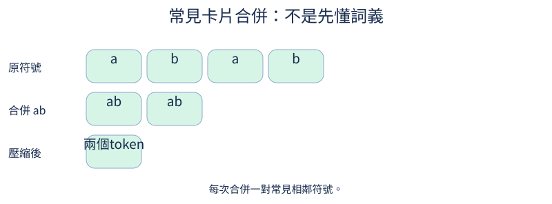

# 第 6 章：自己的中英文 tokenizer

前置：字元ID與下一字loss。Tokenizer訓練是統計切詞規則，不是訓練LLM。早期與CLI使用可還原ByteTokenizer；BPE在本章獨立學習，換模型時要同步詞表與checkpoint。

## 6.1 字元切詞有什麼成本？

**先想一想：**同樣三個中文字與三個英文字母，UTF-8 bytes一樣多嗎？



一字一token很直覺，但英文常見詞可能拆成很多格；byte版本讓未知文字可還原，中文一字通常又需要多個byte。

**把直覺寫成數學：**序列長度影響attention的T×T矩陣；詞表大小影響embedding的V×D。

**最小實驗：**以下程式只處理這節的問題。

```python
texts = ["小小貓", "cat", "🙂"]
for s in texts:
    print(s, "字元", len(s), "UTF8 bytes", len(s.encode("utf-8")))
```

**如何讀結果：**字元、bytes、BPE token三個單位不能互換。

**只改一件事：**只加入一個emoji，看兩種長度差。

## 6.2 常見片段怎麼合併？

**先想一想：**合併a+b後，原序列長度會怎樣？

BPE每次合併最常見的一對相鄰符號。它學習的是文字壓縮規則，不知道詞義；訓練文案變了，合併次序也可能變。

**把直覺寫成數學：**同一對相鄰符號合併成新符號；不跨文件邊界統計pair。

**最小實驗：**以下程式只處理這節的問題。

```python
from collections import Counter

corpus = [list("abab"), list("abac")]
pairs = Counter((a, b) for row in corpus for a, b in zip(row, row[1:]))
pair = pairs.most_common(1)[0][0]


def merge(row, pair):
    out = []
    i = 0
    while i < len(row):
        if i + 1 < len(row) and tuple(row[i : i + 2]) == pair:
            out.append("".join(pair))
            i += 2
        else:
            out.append(row[i])
            i += 1
    return out


print(pair, [merge(row, pair) for row in corpus])
```

**如何讀結果：**這是一個merge，不是完整生產tokenizer；只依training文字計數。

**只改一件事：**只增加一份含ac的文件，觀察最常見pair。

## 6.3 怎麼訓練實用的 tokenizer？

**先想一想：**訓練沒見過的emoji會變成UNK嗎？

Byte-level BPE先提供所有256種byte，再學常見組合；因此未見中文與emoji也能以較細的token表示。不要加會改原文的normalizer。

**把直覺寫成數學：**encode/decode契約是原文UTF-8 bytes還原，不保證每token各自是完整字。

**最小實驗：**以下程式只處理這節的問題。

```python
from tokenizers import Tokenizer, models, pre_tokenizers, trainers, decoders

tok = Tokenizer(models.BPE())
tok.pre_tokenizer = pre_tokenizers.ByteLevel(add_prefix_space=False)
tok.decoder = decoders.ByteLevel()
trainer = trainers.BpeTrainer(vocab_size=280, initial_alphabet=pre_tokenizers.ByteLevel.alphabet())
tok.train_from_iterator(["貓看狗。", "a cat sees a dog."], trainer)
text = "小鳥🙂new"
print(tok.encode(text).tokens)
assert tok.decode(tok.encode(text).ids) == text
```

**如何讀結果：**詞表不足256時不能達成此設定；這是極小示範，不是推薦自然語料配方。

**只改一件事：**只換成一個完全未見文字，驗證還原。

## 6.4 詞表要多大？

**先想一想：**詞表從300增到3000，全部模型參數都十倍嗎？

更大詞表通常能合併更多片段、縮短序列，但embedding和output層更大。品質也取決於訓練文字與模型預算。

**把直覺寫成數學：**embedding參數=V×D；untied output另有V×D。

**最小實驗：**以下程式只處理這節的問題。

```python
width = 32
for vocab in (300, 1000, 3000):
    print(vocab, "embedding參數", vocab * width, "FP32 bytes", vocab * width * 4)
```

**如何讀結果：**計算只包含這張表；需要同時量實際驗證文字token數。

**只改一件事：**只把width加倍。

## 6.5 換 tokenizer 後如何比較模型？

**先想一想：**每token loss較低，但token數多十倍，一定比較好嗎？

換切詞後「每token平均loss」的單位變了。把同一份驗證原文全部負log機率加總，除以原文bytes，才能以同單位對照。

**把直覺寫成數學：**BPB=total negative log likelihood/(UTF8 bytes×ln2)。邊界/BOS/EOS是否計入要保持相同契約。

**最小實驗：**以下程式只處理這節的問題。

```python
import math

raw = "貓🙂"
bytes_count = len(raw.encode())
for name, total_nll in (("示例A", 5.0), ("示例B", 4.0)):
    print(name, total_nll / (bytes_count * math.log(2)), "bits per byte")
```

**如何讀結果：**示例NLL不是實測模型結果；真正比較使用同一原文、相同文件邊界、各自匹配模型。

**只改一件事：**只把總NLL乘2，驗證BPB倍增。

## 6.6 邊界標記怎麼保持完整？

**先想一想：**用戶打字「<assistant>」會自動變成assistant角色嗎？

角色與模態邊界要有獨立ID。內容文字裡出現相同拼寫，不能偷偷升級成控制token；結構化role字段由資料工具決定。

**把直覺寫成數學：**本文ByteTokenizer用0–7作專用邊界，原文bytes加8；兩者ID集合不重疊。

**最小實驗：**以下程式只處理這節的問題。

```python
from tiny_perceptron.data import ByteTokenizer, SPECIALS

tok = ByteTokenizer()
print(list(enumerate(SPECIALS)))
literal = tok.encode("<assistant>")
print(literal)
assert tok.assistant_id not in literal
```

**如何讀結果：**完整BPE版本使用registered added tokens，但render仍須避免把不可信文字當角色。

**只改一件事：**只在user文字放入圖片標記拼寫，檢查仍是文字。

## 6.7 一個 token 一定是一個完整字嗎？

**先想一想：**只decode中文字的第一個byte，會得到完整字嗎？

一個Unicode字可由多個UTF-8 byte組成。切到中間byte單獨decode會不完整，串接完整序列再decode纔是正確契約。

**把直覺寫成數學：**「貓」通常3 bytes，emoji通常4；token不是必然等於Unicode字元。

**最小實驗：**以下程式只處理這節的問題。

```python
raw = "貓🙂".encode()  # 預設就是 UTF-8
print(list(raw), raw[:1].decode("utf-8", errors="replace"))
print(raw.decode("utf-8"))
assert raw.decode() == "貓🙂"
```

**如何讀結果：**replacement字符不等於資料真的被損毀；可能只是觀察單位太小。

**只改一件事：**只把decode邊界切在完整中文字之後。

## 6.8 訓練窗口是在切詞嗎？

**先想一想：**只取C個tokens，能產生C格下一字答案嗎？

tokenizer已把文字變成ID。訓練window只是從ID序列取一段，不重新決定文字如何切詞；相鄰目標仍需多取一個token。

**把直覺寫成數學：**長度C的X需要C+1原始tokens，Y纔有C格。

**最小實驗：**以下程式只處理這節的問題。

```python
from tiny_perceptron.data import shifted

ids = list(range(10))
context = 3
for start in (0, 3, 6):
    x, y = shifted(ids[start : start + context + 1])
    print(x.tolist(), y.tolist())
```

**如何讀結果：**本例窗口可共享邊界token，但不能跨已分開的train/validation文件。

**只改一件事：**只把context改爲4。

## 6.9 讀檔分段會改變切詞嗎？

**先想一想：**切在常見詞中間，token序列可能變嗎？

同一文件被I/O切成chunks不代表語意上有邊界。若每chunk獨立BPE，跨chunk的merge消失；若raw bytes切半個字，提前decode還會出錯。

**把直覺寫成數學：**一般encode(a+b)不一定等於encode(a)+encode(b)。不同文件則應先明確EOS與邊界契約。

**最小實驗：**以下程式只處理這節的問題。

```python
from tokenizers import Tokenizer, models, pre_tokenizers, trainers

tok = Tokenizer(models.BPE(unk_token="[UNK]"))
tok.pre_tokenizer = pre_tokenizers.Whitespace()
tok.train_from_iterator(["hello hello hello"], trainers.BpeTrainer(vocab_size=20, special_tokens=["[UNK]"]))
whole = tok.encode("hello").ids
chunks = tok.encode("hel").ids + tok.encode("lo").ids
print(whole, chunks)
assert whole != chunks
```

**如何讀結果：**這個反例是文字切分，不是圖像patchify；生產讀檔需留跨chunk尾段或按文件encode。

**只改一件事：**只把chunk邊界改到詞與詞之間。
