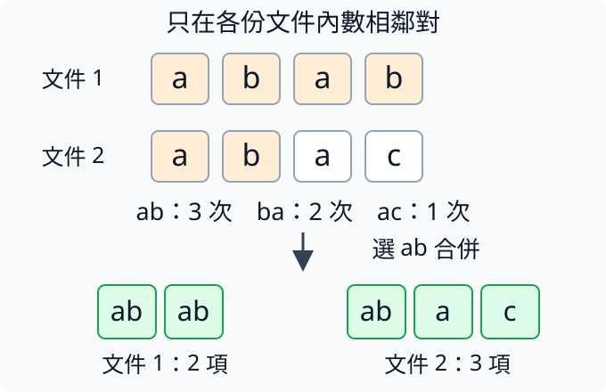

# 第 6 章：自己的中英文 tokenizer

同一段中文或英文，拆成一字、一個byte或一段常見片語，模型付出的序列與字表成本會不同。本章先量清這些單位，再親手做一次相鄰合併，最後建立能還原未見文字的小型BPE工具。我們也會追問換工具後怎樣比較代價、對話標記怎樣與普通文字分開，以及讀檔或取窗口是否會偷偷改變拆法。這些問題決定模型收到的ID究竟是什麼意思，不能只靠詞表大小判斷。

## 6.1 字元切詞有什麼成本？

[1.1](01.md#1.1) 每個字給一個ID，很容易理解「貓看狗」需要三格。但英文的 `perceptron` 若一字母一格，會有十格；中文若改成逐byte，又常一字需要三格。同一份原文用不同單位表示，模型所見的序列長度就不同，成本也跟着變。選擇怎樣拆文字，不只是換一張字表。

token是模型一次處理的文字片段，tokenizer是把原文拆成這些片段、轉成ID並能解迴文字的工具。「切詞」是常用翻譯，卻不保證片段正好是人類的詞；一個token可以是一字、多個字，或一個字元所需bytes中的部分，例如🙂的四個bytes分別當四個token。此處不是再把一個byte拆成位元；一byte一token時，每個byte仍完整包含八個位元。先分清原文、拆分單位與ID，後面改拆法纔不會把各種長短當同一個數字。

Unicode給文字元素統一編號，Python的 `len(字串)` 數這些碼點；一個碼點可以理解為Unicode中的一個文字編號，不一定等於肉眼的一個完整字符，因為重音或組合emoji可能用多個碼點。UTF-8則把文字存成0到255的bytes，每byte八位元，中文與emoji通常要多個byte。下面只用簡單單碼點例子。

```python
texts = ["小小貓", "cat", "🙂"]
for text in texts:
    raw = text.encode("utf-8")
    print(text, "Unicode碼點", len(text), "UTF-8 bytes", len(raw))
```

輸入三段文字，`.encode("utf-8")` 把字串轉為這種儲存編碼的byte序列。三行應分別看到3與9、3與3、1與4。兩種三字文本，實際存儲bytes不同；🙂顯示一個圖案卻需四byte。一字元一token時前兩段都是三格，一byte一token時則九格與三格，這些單位不能互換。

為何模型成本受影響？[3.6](03.md#3.6) 的注意力權重有T×T格，T是token序列長度；從三格變九格，這張表便從9格變81格。字表則影響 [2.1](02.md#2.1) 的V×D參數，V是可用token種類數。較細拆法常讓V較小、T較長，較粗拆法相反，不能只看字表小就說全模型省。

逐字元表還要處理未見字；固定256種byte則涵蓋任何UTF-8原文，能把沒見過的字拆得更細表示。這帶來可靠還原，也可能讓中文序列較長。下一節用常見相鄰片段合併，讓頻繁組合用更少格。

練習只加入 `"cat🙂"`，先預測Unicode碼點4、UTF-8 bytes7，再執行核對。再把英文cat換成貓，應是2與7：碼點減少，byte數卻一樣。你可以看到「幾字」不能直接當成「模型處理幾token」，還得說明採用哪種拆法。

## 6.2 常見片段怎麼合併？

常見文字片段反覆出現，每次逐字母排成很多格有些浪費。可以先從細單位開始，把最常見的相鄰兩項黏成一個新項，再重複這個過程。這叫BPE，英文全名byte pair encoding；名稱源於byte對，但玩具示範也能從字元開始。它學習合併規則，不學習句意，也不是讓語言模型參數求導。

用兩份文件 `abab` 與 `abac`。各自數相鄰符號：a-b共三次，b-a兩次，a-c一次，最常見的是a-b。因此把每份文件裡的非重疊a-b換成新符號ab，得到 `['ab','ab']` 與 `['ab','a','c']`。不能把第一份最後b與第二份開頭a當一對，因為那是兩個文件的邊界。

下圖上方兩列是兩份文件，四個框表示原本四項；a-b在第一列出現兩次、第二列一次，合計三次。中間列出三種相鄰對的次數，向下箭頭表示選出最多的ab，並把各列相鄰a、b合成一項。底下綠框的ab雖然寫兩個字母，現在只佔一個token，因此兩份文件分別剩兩項和三項。橘框標出要合併的a、b，第一列兩組、第二列一組；各組各自合併，不把整列黏成一項。



```python
from collections import Counter

corpus = [list("abab"), list("abac")]
pairs = Counter()
for row in corpus:
    for left, right in zip(row, row[1:]):
        pairs[(left, right)] += 1
pair = pairs.most_common(1)[0][0]


def merge(row, pair):
    out = []
    i = 0
    while i < len(row):
        if i + 1 < len(row) and tuple(row[i : i + 2]) == pair:
            out.append("".join(pair))
            i += 2
        else:
            out.append(row[i])
            i += 1
    return out


print(pairs)
print("選擇", pair, "結果", [merge(row, pair) for row in corpus])
```

輸入兩張字元清單。`row[1:]` 比原列晚一格，zip配出相鄰對，Counter數它們；`most_common(1)` 找最高頻那一項，再取其中的符號對。這裡a-b唯一最多，平手時則需規定穩定的選擇順序。計數與切片背景見 [1.4](01.md#1.4)、[1.3](01.md#1.3)。

`merge` 從左到右掃描。`while` 在條件成立時重複縮排代碼，i是現在位置；若還有下一項且兩項正是pair，就接成ab並跳兩格，否則複製當前項並只前進一格。`and` 要兩條件同時成立，先檢查不越界；`tuple` 把切片改成固定次序的小組，便於與pair比較。輸出四字的第一份縮成兩token，第二份縮成三token。

tokenizer是把原文切成片段、轉成ID並能還原文字的工具；訓練BPE tokenizer是在擬定這套合併規則，編碼則是拿已保存的規則處理文字，不是重新訓練語言模型。完整BPE會把新符號加入字表、重數新相鄰對，直到預算或停止條件滿足，並保存合併順序，編碼新文字時按已學規則操作。某片段在訓練資料常見，通常更有機會合併；因此只能用訓練文字擬定規則，不能為了測得更短而偷偷用測試原文訓練tokenizer。

合成的ab只表示這段文字現在一個token，不保證它是一個有語言意義的詞。若資料改變，最高頻對與後續拆法也可能變化；下一節用byte起點建立能覆蓋未見文字的版本。

練習再加一份 `list("acacacac")`，先預測a-c新增四次，總共五次，會勝過a-b的三次，再執行核對。觀察兩份原文怎麼按新pair合併，而不是隻看新增文件：tokenizer規則一變，同一舊文的編碼也會跟着變。

## 6.3 怎麼訓練實用的 tokenizer？

如果只把訓練見過的中文放進字表，新人名或emoji可能沒法編碼。[6.1](#6.1) 已告訴我們任何UTF-8文字都能先化成0到255的byte；[6.2](#6.2) 則讓常見相鄰項合併。把兩者接起來，先保證所有byte可用，再讓頻繁片段佔一個token，就得到byte-level BPE。

本節使用已經隨專案安裝的tokenizers套件，實現統計與保存細節；訓練材料仍由我們直接寫兩句，不下載網絡資料。它的「訓練」只計出token拆分表，不會產生會回答問題的模型。後面使用這張表訓練語言模型時，輸入輸出詞表大小與ID含義必須匹配。

```python
from tokenizers import Tokenizer, models, pre_tokenizers, trainers, decoders

tok = Tokenizer(models.BPE())
tok.pre_tokenizer = pre_tokenizers.ByteLevel(add_prefix_space=False)
tok.decoder = decoders.ByteLevel()
trainer = trainers.BpeTrainer(
    vocab_size=280,
    initial_alphabet=pre_tokenizers.ByteLevel.alphabet(),
    show_progress=False,
)
tok.train_from_iterator(["貓看狗。", "a cat sees a dog."], trainer)
text = "小鳥🙂new"
encoded = tok.encode(text)
print("片段", encoded.tokens)
print("ID", encoded.ids)
print("還原", tok.decode(encoded.ids))
assert tok.decode(encoded.ids) == text
```

`models.BPE` 選合併規則類型；`ByteLevel` 前處理把byte映射為工具內部可見符號，再給BPE統計。`initial_alphabet` 納入完整256種起始byte符號，而非只加入兩句出現的字符。目標詞表280留下少量合併空間；數據很少時未必能恰好長到目標上限。`add_prefix_space=False` 避免主動在開頭加空格，也沒有額外normalizer改原文。

decoder是反方向的解碼工具，按ByteLevel約定拼回bytes再轉UTF-8。輸入新句含訓練未見的小、鳥與🙂，它們仍能以細片段表示。印出的tokens可能像奇怪拉丁符號，因為展示的是byte的可見代號，不是損壞的原句；應核對最後「還原」行完整為 `小鳥🙂new` 與assert通過，而不要求每token肉眼可讀成完整字。

訓練字表至少要容納256種byte，再加需要的特殊項與合併項。把目標設得很小，並不會憑空獲得完整覆蓋又大量壓縮；工具的實際字表大小也要檢查。這裡兩句資料與280只是短演示，不是自然中文語料的推薦配置。

最後要把tokenizer保存、隨模型一起記錄版本，例如 `tok.save("tokenizer.json")` 可以存規則，但本程式不寫出永久檔。重新訓練同樣大小的詞表，ID也可能對到不同片段，不能直接裝到舊模型上當同一語言接口。

練習只把text改成 `"未見字🦊"`，先預測可能切得較細，但decode仍等於原文，再執行核對。若你同時改了前處理規則，應重新驗證空格、換行與特殊字符；還原契約來自完整規則組合，不只BPE這個名字。

## 6.4 詞表要多大？

超市品項更多，可能讓常見需求一次買齊，也需要更多貨架。tokenizer的字表更大，也可能把長片段直接收成一個token，縮短模型序列；同時每個token要有輸入特徵與候選分數，模型表格就更大。不能只說「詞表越大越好」或「越小越省」，要把序列長度與參數成本一起量。

[6.3](#6.3) 用完整byte起點加少量合併，大字表預算則允許更多常見組合。假設每token有D=32特徵，V個token的embedding需要V×32個數，原理見 [2.1](02.md#2.1)。若 [4.6](04.md#4.6) 的輸出表與輸入不共享，還要另一張同樣V×32的權重；注意力與FFN則不會只因V變十倍也自動變十倍。

```python
width = 32
for vocab in [300, 1000, 3000]:
    embedding = vocab * width
    input_and_output = 2 * embedding
    print("詞表", vocab, "輸入參數", embedding, "輸入FP32 bytes", embedding * 4, "不共享輸入輸出參數", input_and_output)
```

輸入三個詞表預算，程序只計表格格數。V300時embedding9600、FP32數據38400bytes；V1000是32000與128000；V3000是96000與384000。不共享輸入輸出則分別19200、64000、192000格。FP32四bytes的約定見 [5.9](05.md#5.9)，這些數字不含訓練歷史、梯度或其他層，所以不是整機記憶體預算。

成本另一邊是實際T。更多合併如果剛好覆蓋當前文本，token數可能減少，注意力T×T便更省。但字表大不保證這份驗證中文一定切得短：如果訓練tokenizer的資料主要是英文，新增片段可能幫不上中文。應拿同一份未參與字表訓練的原文，記錄實際token數、還原是否正確與模型品質，再看預算。

太罕見的大token也可能只有極少訓練例子，雖然縮短某條句子，卻讓模型難以學好那份輸入輸出參數。反之，小片段需要更多步才能組成意思，卻可以在不同詞中共享資料。這個取捨和語料分佈、模型寬度、訓練token預算有關，沒有脫離任務的唯一最佳V。

比較字表大小時還需讓模型與各自tokenizer一致。相同的ID27可能代表不同片段，不能只改config的vocab_size就沿用舊錶的字義。換字表後要重新建立或訓練匹配模型，保存規則版本，纔是真正的對照。

練習只把width從32改成64，先預測每項格數與bytes都翻倍，再執行核對；詞表V不變，所以你增加的是每token描述寬度。接着把V300改600，第一項也翻倍，但這次改變的是可用token種類，兩種成本變化相似，資料含義卻不同。

## 6.5 換 tokenizer 後如何比較模型？

同一段原文，甲拆成十token、平均代價0.6，乙拆成五token、平均代價1.0。只看平均會說甲較好，可是甲總代價6、乙只有5。單位改變後，「每token」不是同樣的一份文字，因此比較應回到固定原文，量整段總負對數機率，再用同一個原文長度單位除。

[1.8](01.md#1.8) 的每位置代價是正確token機率的負自然對數，把整段加總叫negative log likelihood（負對數似然，NLL）。根據 [W.4](../first-steps.md#W.4) 的對數加法，它對應這段文字在給定前文下的聯合概率。再除以原文UTF-8的byte數量、除以 `log(2)` 換成bit，得到bits per byte，簡稱BPB，表示每原始byte的代價。

```python
import math

raw = "貓🙂"
bytes_count = len(raw.encode("utf-8"))
for name, total_nll in [("示例A", 5.0), ("示例B", 4.0)]:
    bpb = total_nll / (bytes_count * math.log(2))
    print(name, "原文bytes", bytes_count, "BPB", bpb)
```

輸入同一原文貓與🙂，共三加四等於七bytes，長度差的來源見 [6.1](#6.1)。總NLL5與4是手工例子，尚非模型量測。輸出A約1.0305、B約0.8244，因為除數同為 `7×0.6931`，B較低表示這份原文總負對數代價較小。即使兩者token數不同，也回到了相同分母。

真正測量時，先用各自tokenizer編碼同一份驗證文件，再交給與它匹配的模型預測。有效目標位置是「有真實的下一文字單位，而且這次要替它計代價」的位置；只用來提供前文的內容，或為湊等長而額外填入的記號，不算本次的原文目標。把這些目標的負log機率加總，才是本次的總NLL。不能拿甲的ID丟進乙的模型，也不能只拿平均loss、沒有目標數量就推BPB。

長文件放不進模型時，會截成有限長度的片段，叫窗口，詳見[6.8](#6.8)。例如原文有四個token，依次稱為A、B、C、D；若A先當已知前文，本次要評的是接著猜B、C、D。切成`[A,B,C]`與`[B,C,D]`兩個重疊窗口時，可在第一個計B、C的代價；第二個的B、C只提供前文，計D即可。若第二個又計C，同一原文目標就被算了兩次。兩個模型都要採用一致的計分約定，並記錄各目標能讀到多少前文。文件開始的已知條件、結束標記是否計入NLL，也要先說清楚，才能比較同一份原文的相同事件。

BOS是開始標記、EOS是結束標記，後面 [6.6](#6.6) 會給專用ID；這裡先理解它們屬於結構，不是原文bytes。若把EOS代價計入分子，卻用原文bytes分母，這可以作為一種明確的評估契約，但兩方法都要一致，不可只為一方略過難預測的結尾。

BPB讓拆分單位較可比，卻也不是回答品質的唯一指標。模型善於預測原文，並不自動善於自由回答問題，[5.8](05.md#5.8) 已區分這兩者。對照應同時保留任務表現、上下文預算與總資源；byte長度統一不表示兩者訓練成本也相同。

練習只把A與B的total_nll都乘2，先預測BPB都翻倍、排序不變，再執行核對。然後只把raw換成兩倍原文 `"貓🙂貓🙂"`，保留同一總NLL，數值會減半；這一步是在演示分母作用，真實模型換文本必須重測NLL，不能用舊數字當新結果。

## 6.6 邊界標記怎麼保持完整？

一份對話要區分「是誰說話」，不能只靠普通句子裡的文字。用戶也許真的想討論 `<assistant>` 這串字，如果程式看到拼寫就當成換角色，會把內容誤作結構。我們要讓角色、開始、結束與模態邊界有獨立ID，普通內容即使拼寫一樣仍按文字編碼。這裡角色指資料中的user、assistant等欄位，不是模型猜出講話人。

本專案簡單ByteTokenizer保留ID0到7做結構：PAD填充、BOS開始、EOS結束，接著user、assistant、image、audio、system。PAD是為了把不同長度排成同一張表的空位；image、audio表示後面有影像或音訊輸入。原文byte則統一加8，所以0至255的byte用8至263的ID，與結構區完全不重疊。

```python
from tiny_perceptron.data import ByteTokenizer, SPECIALS

tok = ByteTokenizer()
print(list(enumerate(SPECIALS)))
literal = tok.encode("<assistant>")
print("普通文字的ID", literal)
print("還原", tok.decode(literal))
assert tok.assistant_id not in literal
```

輸入字串 `<assistant>` 是要討論的普通文字。第一行把八種結構拼寫與位置印出，assistant的專用ID為4。`encode` 僅把原文每個UTF-8 byte加8；所以ASCII的 `<` 原來60變68，末尾 `>` 原來62變70，所有內容ID都至少8，絕不含4。decode減回偏移並拼成bytes，再恢復原拼寫，最後檢查這串文字沒有被升格成assistant角色。

真正需要插入角色時，資料工具按結構化記錄的role欄位明確加入4，再附內容ID。例如record中的 `role="assistant"` 是元資料決定，不是掃描內容發現那個單詞就轉換。第 [7.1](07.md#7.1)、[7.2](07.md#7.2) 將把完整對話走一次。原文與結構分開，能保持邊界完整，也讓內容可無損還原。

另一類切詞方法叫BPE：把經常相鄰的片段合成一個新單位，例如把`a`與`b`合成`ab`，詳見[6.2](#6.2)。這類工具通常允許先登記特殊標記，約定整串`<assistant>`使用一個專用ID，不被拆開，也不與旁邊的普通文字再合併。登記後仍要決定用戶內容中的相同拼寫怎樣處理，不能以為登記本身就自動解決「內容還是結構」的判斷。當前byte版本的偏移區分很直白，適合作為對話格式的起點。

這些標記不代替模型訓練。插入assistant ID只是把位置標出來，模型還要看很多正確示例才知道之後怎樣回答；image標記也不會自己創造影像特徵。它們是接口約定，讓資料與模型共享一種表示。

練習只把literal的輸入改成 `<image>`，並把檢查改為 `tok.image_id not in literal`。先預測還原仍是這七個字符、內容ID都至少8，不出現專用image ID5，再執行核對。只有工具顯式插入5才表示影像邊界，字面討論標記仍是一段文字。

## 6.7 一個 token 一定是一個完整字嗎？

[6.3](#6.3) 印出的byte-level BPE片段有時看不懂。我們試着把每個token單獨decode，竟看到「�」；這未必表示原文壞了，可能只是切在一個UTF-8字的中間。像把一張照片切成小條，單條不等於完整圖案；必須先把足夠材料拼回，再按原編碼讀。

[6.1](#6.1) 已分清Unicode字元與byte。「貓」的UTF-8有三byte，🙂有四byte，一個byte只有0到255的數，不自帶完整字義。BPE合併的邊界又按頻率決定，所以一個token可能覆蓋完整字、多個字，也可能只覆蓋某字的一部分byte，不能把token數直接翻譯成人看到的字數。

```python
raw = "貓🙂".encode()
print("全部bytes", list(raw))
print("只看第一byte", raw[:1].decode("utf-8", errors="replace"))
print("先拼完整再解碼", raw.decode("utf-8"))
assert raw.decode("utf-8") == "貓🙂"
```

輸入完整原句並轉成bytes；Python字串的`.encode()`預設使用UTF-8，所以這裡不必另填編碼名稱。第一行應 `[232,178,147,240,159,153,130]`。前三個一起表示貓，後四個一起表示🙂。`raw[:1]` 只留232，UTF-8解碼器知道它是多byte字的開頭，卻沒有後續材料；`errors="replace"` 遇不完整資料就用替代字符�顯示，因此第二行是�。沒有replace時，這段不完整材料會報Unicode解碼錯誤。

第三行解完整七byte，還原貓🙂，assert通過。這說明第一次看到�是觀察方式造成的，不足以證明原始bytes已經被改壞。相反，若把這個�當成真正內容再存回，就已經用替代字符丟失了原來那部分資訊，之後拼接也不會恢復。應保留原bytes或完整token序列，不把臨時顯示的替代符號當原始資料。

模型按token逐步生成時，也可能先生成字的一部分byte，下一步才補齊。用戶介面要考慮延後解碼或使用能保留未完成尾段的解碼器，不能每個片段獨立decode再把結果接起來。這些工程選擇來自同一個還原契約：完整的bytes序列才能按UTF-8解釋。

本節直接切bytes讓邊界透明，不意味着所有BPE token只含一個byte。某個常見片段可能已經被合成一token，其內部含很多byte；我們關心的是不能保證每一個token都恰好落在完整Unicode字邊界。

練習只把第二行的切片改成 `raw[:3]`，先預測剛好涵蓋完整貓，顯示貓；再試 `raw[:4]`，預測貓後接�，因為emoji只取到開頭一byte。最後完整decode仍應貓🙂，三次觀察用同一份原資料，便能定位問題在邊界而非內容。

## 6.8 訓練窗口是在切詞嗎？

原文已由tokenizer變成ID0、1、2……，模型一次只看三個位置，怎麼辦？我們從這份ID序列取短段作為訓練題，這叫窗口。它決定每題看到多遠，沒有重新定義哪個字應合成哪個token。把token拆分與窗口長度混在一起，會讓你誤以為改context就改變了詞表。

[6.2](#6.2) 的合併發生在文字表示規則，[2.5](02.md#2.5) 的context則是可見前文範圍。為建立C格下一token問題，還要有它們右邊的C格答案，所以從原始ID需取C+1格，再按 [1.3](01.md#1.3) shift一次。C=3時取 `[0,1,2,3]`，輸入 `[0,1,2]`，答案 `[1,2,3]`。

```python
from tiny_perceptron.data import shifted

ids = list(range(10))
context = 3
for start in [0, 3, 6]:
    segment = ids[start : start + context + 1]
    x, y = shifted(segment)
    print("起點", start, "輸入", x.tolist(), "答案", y.tolist())
    assert len(x) == len(y) == context
```

輸入十個已有ID與窗口長度3，`range(10)` 建0到9的一排整數；本例它們只當容易追蹤的代號。三起點分別取0–3、3–6、6–9，共各四格；shift後輸出 `(0,1,2)→(1,2,3)`、`(3,4,5)→(4,5,6)`、`(6,7,8)→(7,8,9)`。`.tolist()` 將tensor轉回普通清單方便顯示，檢查每題確實三輸入、三答案。

相鄰窗口共用邊界token3與6，但它們提供的位置角色不同；本例所有題屬於同一份已分組訓練資料，允許這種共用。不能先從同一文件取這些高度重疊窗口，再隨機分訓練與驗證，[1.2](01.md#1.2) 已說明原因。也不能跨文件邊界直接連成一個「上一文件末尾預測下一文件開頭」目標，除非明確設計並標記這種邊界。

資料末尾還要處理長度不足。若剩下的段只有C格，shift只能給C-1道題；我們的檢查會發現與目標C不合。可以丟掉尾段，或另明示補齊與忽略答案規則，但不應悄悄當作足長題。第7章會處理不同長短batch，當前用剛好可取的起點。

練習只把context改成4，保留三個起點，先預測起點6只有 `[6,7,8,9]` 四個原ID，shift後只有三道題，最後檢查失敗。執行核對，再把起點列表改成 `[0,4]`，兩次都可取五格、建立四題。這次沒有改tokenizer，只改每題資料取段的契約。

## 6.9 讀檔分段會改變切詞嗎？

讀大文件時常分幾次載入，這種I/O分段是為了讀寫方便，未必是詞或文件的邊界。如果把 `hello` 拆成 `hel` 與 `lo` 再各自編碼，BPE就沒有機會跨段把完整hello合併。把兩段ID直接接起來，也不一定等於一次編碼原文。所以讀檔分段這個看似無關的實現細節，可能改變模型實際收到的序列。

[6.2](#6.2) 的合併依賴相鄰項，[6.7](#6.7) 又說明UTF-8不能隨便在半字就解碼。它們發生在不同層：byte讀寫可能切斷字，文字切分可能切斷合併機會。下面先用純英文避開半字問題，專注觀察合併。

```python
from tokenizers import Tokenizer, models, pre_tokenizers, trainers

tok = Tokenizer(models.BPE(unk_token="[UNK]"))
tok.pre_tokenizer = pre_tokenizers.Whitespace()
tok.train_from_iterator(
    ["hello hello hello"],
    trainers.BpeTrainer(vocab_size=20, special_tokens=["[UNK]"], show_progress=False),
)
whole = tok.encode("hello").ids
chunks = tok.encode("hel").ids + tok.encode("lo").ids
print("整段", whole, "分段後相接", chunks)
assert whole != chunks
```

輸入訓練文字只反覆hello。`Whitespace` 先按空白分開詞，`BPE`再學常見組合；`[UNK]`是未知符號預留項，這個簡化英文表與 [6.3](#6.3) 的完整byte表不同。因為資料夠反覆，hello通常合成一token。whole應一個ID，chunks由至少兩段各自編碼再相接，因而長度更長、ID序列不同。精確編號只是約定，檢查的是整段與拆段的差別。

分段編碼不一定錯誤，關鍵是契約。如果每段本來就是不同文件，不能為縮短而跨文件合併；應明確保留開始、結束與文件邊界。若兩段屬於同一文件的連續材料，則應按整份文件編碼，或使用能保留尾段上下文、確認安全邊界才提交的流式方式。I/O chunk只是一塊讀入材料，不自動錶示語義邊界。

即使切在詞與詞之間，也要留意空格與前處理。當前Whitespace例子會把空白當分隔，不輸出它，所以在hello後面切通常可以；byte-level規則可能把空格與後一個片段一起合併，仍需實測。不能拿一種工具的成功邊界當所有tokenizer都成立的定理。

如果原始資料按byte分塊，文字解碼還要保留不完整的末尾byte，等下一塊來補齊，避免先用�代替。否則後面BPE收到的已經是被改過的字，問題不只是序列變長。完整還原與穩定切分需要同時考慮儲存與token兩個層次。

練習用 `"hello hello"`，比較一次編碼與 `tok.encode("hello ").ids + tok.encode("hello").ids`。先預測這個Whitespace規則下兩者相同，再執行核對；然後恢復切在hel/lo中間，差異又出現。明示邊界與工具規則，才能解釋為何這次可以分段、上次不行。
