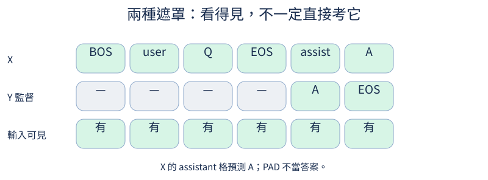
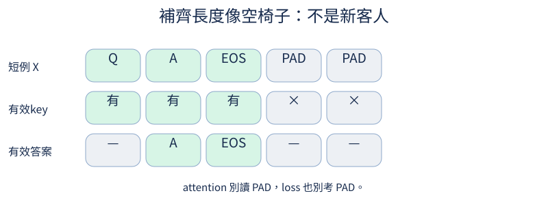

# 第 7 章：從續寫文字到回答問題

前置：第4章的因果模型與第1章的資料對齊。先用一筆不截斷對話，再回讀padding。完整render在tiny_perceptron/data.py；下列程式每節都新建資料，不依賴上一Notebook變量。

## 7.1 對話怎麼表示？

**先想一想：**SFT是不是換成另一種分類架構？



SFT仍在猜下一token，只是訓練資料現在有「誰說話」與「期望回答」。資料格式先分開保存，render才決定邊界。

**把直覺寫成數學：**消息列表→一條序列；問題和答案都進入forward，但不一定都作爲loss目標。

**最小實驗：**以下程式只處理這節的問題。

```python
from tiny_perceptron.data import ByteTokenizer, render_chat

messages = [{"role": "user", "content": "1+1=?"}, {"role": "assistant", "content": "2"}]
x, y = render_chat(messages)
print("X", x.tolist(), "Y", y.tolist())
print("有效目標", y[y != -100].tolist())
```

**如何讀結果：**同一個TinyLM接口可用；新變化主要是資料與監督位置。

**只改一件事：**只把問題換成2+1，保持格式不變。

## 7.2 模型怎麼知道輪到誰？

**先想一想：**沒有assistant邊界，模型知道該回答還是繼續寫問題嗎？

角色token告訴模型接下來是問題還是回答。在推論prompt尾放assistant標記，模型的下一格纔是回答首字。

**把直覺寫成數學：**角色邊界有獨立ID；不是要求模型看漢字「使用者」猜角色。

**最小實驗：**以下程式只處理這節的問題。

```python
from tiny_perceptron.data import ByteTokenizer

tok = ByteTokenizer()
question = "1+1=?"
prompt = [tok.bos_id, tok.user_id] + tok.encode(question) + [tok.eos_id, tok.assistant_id]
print(prompt, "最後邊界", prompt[-1])
assert prompt[-1] == tok.assistant_id
```

**如何讀結果：**訓練與推論render契約須一致，否則邊界變成未見輸入。

**只改一件事：**只移除最後assistant標記，說明目標改變。

## 7.3 哪些位置應該學？

**先想一想：**user不算loss，會從輸入中消失嗎？

我們常只要求模型學assistant答案，不要求它模仿user提問。忽略的位置設爲-100；這個數不是詞表ID。

**把直覺寫成數學：**有效監督mask=labels≠−100；attention mask另外決定能看到誰。

**最小實驗：**以下程式只處理這節的問題。

```python
from tiny_perceptron.data import render_chat

x, y = render_chat([{"role": "user", "content": "問"}, {"role": "assistant", "content": "答"}])
for i, (token, label) in enumerate(zip(x.tolist(), y.tolist())):
    print(i, token, label, "學" if label != -100 else "忽略直接loss")
assert (y != -100).sum() > 0
```

**如何讀結果：**位元組路線一箇中文答案有多個token；有效數不是字數。

**只改一件事：**只把答案改成兩個中文字。

## 7.4 回答第一個 token 在哪個位置被預測？

**先想一想：**回答字本身輸入到模型的同格，是在猜它自己嗎？

第一個回答token由assistant邊界所在格預測，而不是由回答自己所在格預測。先建立原始token的監督標記，再同時切X[:-1]、Y[1:]。

**把直覺寫成數學：**位置t的logits預測原序列t+1；監督標記也要shift同一次。

**最小實驗：**以下程式只處理這節的問題。

```python
from tiny_perceptron.data import ByteTokenizer, render_chat

tok = ByteTokenizer()
x, y = render_chat([{"role": "user", "content": "Q"}, {"role": "assistant", "content": "A"}])
first = (y != -100).nonzero()[0].item()
print("首答案預測位置", first, "X", x[first].item(), "Y", y[first].item())
assert x[first] == tok.assistant_id and y[first] == tok.encode("A")[0]
```

**如何讀結果：**這是一個最有價值的對齊斷言，圖像展開後也要維持它。

**只改一件事：**只故意把監督mask不shift，找出首字漏訓。

## 7.5 不算 loss 的內容就看不見嗎？

**先想一想：**user embedding會因爲ignored label而永遠無梯度嗎？

沒有直接loss的user位置仍是後續attention的輸入。答案loss可以經由後面位置傳回user embedding；忽略監督不是切斷內容。

**把直覺寫成數學：**直接對該位置logits的梯度可爲0，但對它的輸入feature梯度仍可能非零。

**最小實驗：**以下程式只處理這節的問題。

```python
from tiny_perceptron.data import render_chat
from tiny_perceptron.model import TinyLM, ModelConfig, masked_loss

x, y = render_chat([{"role": "user", "content": "Q"}, {"role": "assistant", "content": "A"}])
model = TinyLM(ModelConfig(width=8))
result = model(x[None])
logits = result["logits"]
logits.retain_grad()
masked_loss(logits, y[None]).backward()
print(
    "第一格logits梯度",
    logits.grad[0, 0].norm().item(),
    "Q embedding梯度",
    model.embedding.weight.grad[x[2]].norm().item(),
)
```

**如何讀結果：**兩個梯度回答不同問題；不要只檢查一整層grad是否None。

**只改一件事：**只把user的Q替換成Z，保持答案一樣，觀察輸出變化。

## 7.6 補齊 batch 的位置該算 loss 嗎？

**先想一想：**多補十個PAD會讓loss看起來更低嗎？



batch要補成相同長度，但PAD不是答案。把PAD標籤設爲ignored，再用有效token分母，添加填充不改變原本loss。

**把直覺寫成數學：**loss_sum/有效token數，而非除以所有B×T位置。

**最小實驗：**以下程式只處理這節的問題。

```python
from tiny_perceptron.model import masked_loss

a = torch.randn(1, 2, 4)
labels = torch.tensor([[1, 2]])
b = torch.cat([a, torch.randn(1, 3, 4)], 1)
extended = torch.tensor([[1, 2, -100, -100, -100]])
print(masked_loss(a, labels), masked_loss(b, extended))
assert torch.allclose(masked_loss(a, labels), masked_loss(b, extended))
```

**如何讀結果：**這節只檢查loss；7.7再保證PAD不會被當context。

**只改一件事：**只把一個PAD標籤改成詞表ID，檢查loss改變。

## 7.7 填充的位置會被當線索嗎？

**先想一想：**只遮loss，不遮attention，左PAD會影響答案嗎？

左PAD出現在真實token之前，單純causal mask會允許看到它。需要有效key mask，並讓真實token的位置ID保持原來的0,1,2。

**把直覺寫成數學：**allowed=causal AND key_valid；position ID與物理padding位置不是同一件事。

**最小實驗：**以下程式只處理這節的問題。

```python
from tiny_perceptron.model import TinyLM, ModelConfig

model = TinyLM(ModelConfig(vocab_size=10, width=8))
base = model(torch.tensor([[1, 2, 3]]))["logits"]
ids = torch.tensor([[0, 0, 1, 2, 3]])
valid = ids != 0
pos = torch.tensor([[0, 0, 0, 1, 2]])
actual = model(ids, valid=valid, positions=pos)["logits"][:, 2:]
print((base - actual).abs().max().item())
assert torch.allclose(base, actual, atol=1e-6)
```

**如何讀結果：**無有效key的PAD query需處理全-∞行避免NaN。基準已有此處理。

**只改一件事：**只取消valid mask，觀察等價斷言是否失敗。

## 7.8 補了 PAD 該取哪個輸出？

**先想一想：**長度2和4同batch補成4，短例子該取第幾格？

右PAD時，序列最後一格通常不是最後有效token。每筆各自找最後True位置，才能取下一字分數；不能一律logits[:,-1]。

**把直覺寫成數學：**最後有效索引=max{i:valid_i=True}；左PAD不能用sum(valid)-1。

**最小實驗：**以下程式只處理這節的問題。

```python
valid = torch.tensor([[True, True, False, False], [False, True, True, True]])
positions = torch.arange(4)[None].expand_as(valid)
last = positions.masked_fill(~valid, -1).amax(-1)
logits = torch.randn(2, 4, 5)
selected = logits[torch.arange(2), last]
print(last, selected.shape)
assert last.tolist() == [1, 3]
```

**如何讀結果：**這裏只示範取值；提供的簡單generate入口無padding，避免隱藏複雜度。

**只改一件事：**只把第一筆改成左PAD排列。

## 7.9 模型怎麼知道回答結束？

**先想一想：**把EOS從loss去掉，還能要求模型可靠結束嗎？

把EOS當成答案的最後一個訓練token，模型纔有機會學會停止。生成器檢測EOS；另設token上限以防模型永遠不選EOS。

**把直覺寫成數學：**停止條件是EOS或max_new_tokens，不是猜標點就是結尾。

**最小實驗：**以下程式只處理這節的問題。

```python
from tiny_perceptron.data import ByteTokenizer, render_chat

tok = ByteTokenizer()
x, y = render_chat([{"role": "user", "content": "Q"}, {"role": "assistant", "content": "A"}])
print("最後目標", y[-1].item(), "EOS", tok.eos_id)
assert y[-1] == tok.eos_id
generated = [tok.encode("A")[0], tok.eos_id, 99]
print("停止前輸出", generated[: generated.index(tok.eos_id)])
```

**如何讀結果：**這是停止規則例子，不是訓練後的生成質量。

**只改一件事：**只移除EOS，觀察需要靠最大長度停止。

## 7.10 答案被截光了還在訓練嗎？

**先想一想：**看起來token很多的batch可能沒有任何監督嗎？

長問題可能把答案截光。若全labels都ignored，平均loss沒有合法分母；應該定位原樣本，不把NaN當學習率問題。

**把直覺寫成數學：**有效target_count=0 時資料不可用於這一batch；答案EOS被截掉也需記錄。

**最小實驗：**以下程式只處理這節的問題。

```python
from tiny_perceptron.data import render_chat, pad_batch

example = render_chat([{"role": "user", "content": "很長的問題"}, {"role": "assistant", "content": "是"}])
try:
    pad_batch([example], max_length=2)
except ValueError as error:
    print("預期資料錯誤", error)
else:
    raise AssertionError("應該偵測空監督")
```

**如何讀結果：**過濾空監督是資料健康檢查，不是提升模型能力的訓練技巧。

**只改一件事：**只增加max_length，找第一個能保留答案的長度。

## 7.11 預訓練模型怎麼學會對話？

**先想一想：**只改prompt而不更新權重，叫SFT嗎？

預訓練學習文本分佈，SFT繼續用正確問答讓角色邊界後出現合適答案。架構不必換，但必須保存匹配的基模和tokenizer。

**把直覺寫成數學：**同一CE目標、不同輸入分佈和監督mask；SFT不是查資料表直接輸出答案。

**最小實驗：**以下程式只處理這節的問題。

```python
from tiny_perceptron.data import toy_conversations, render_chat, pad_batch
from tiny_perceptron.model import TinyLM, ModelConfig, masked_loss

x, y, valid = pad_batch([render_chat(m) for m in toy_conversations()[:2]])
model = TinyLM(ModelConfig(width=8))
loss = masked_loss(model(x, valid=valid)["logits"], y)
loss.backward()
print("SFT接口loss", loss.item())
print("GPU入口：python scripts/train.py --task sft --checkpoint checkpoints/text.pt --train --steps 300")
```

**如何讀結果：**這格確認資料到梯度，沒有聲稱隨機模型會算加法。前後回答要由真實checkpoint生成。

**只改一件事：**只把其中一例答案錯標，追蹤它的監督ID。

## 7.12 模型會回答新組合嗎？

**先想一想：**訓練紅圓、藍方，測試紅方，是同一個問題嗎？


把新組合留在訓練之外，比只用沒見過的措辭更能檢查組合規則。先確認每種基礎屬性訓練中都有覆蓋，避免把新詞誤當新組合。

**把直覺寫成數學：**split按完整輸入/屬性組合；不能把同一問答的窗口拆到不同split。

**最小實驗：**以下程式只處理這節的問題。

```python
all_pairs = [(c, s) for c in ("紅", "藍") for s in ("圓", "方")]
held_out = {("紅", "方")}
train = [p for p in all_pairs if p not in held_out]
print("train", train, "held_out", held_out)
assert not set(train) & held_out
```

**如何讀結果：**例子只是分割；所有可用屬性訓練覆蓋，並不保證模型學到組合。

**只改一件事：**只把整個顏色藍留出，指出現在是在測哪種泛化。

## 7.13 後續改動要和什麼比？

**先想一想：**JSON能解析就代表答案內容對嗎？

先保存固定任務與判讀規則，後續風格、安全、量化纔有共同基準。把格式符合、內容正確、適當不確定分別記錄。

**把直覺寫成數學：**一個向量指標比單一總分保留更多行爲差異。

**最小實驗：**以下程式只處理這節的問題。

```python
import json

reply = '{"answer": 3}'
parsed = json.loads(reply)
scores = {"JSON有效": isinstance(parsed, dict), "1+1內容正確": parsed.get("answer") == 2}
print(scores)
assert scores["JSON有效"] and not scores["1+1內容正確"]
```

**如何讀結果：**固定測試內容以後不應反覆用來微調；另保留final test。

**只改一件事：**只把answer改成2，觀察兩個面向分別變化。

## 7.14 少量錯誤答案會被學走嗎？

**先想一想：**故意給1+1=3，loss有辦法知道這是錯的嗎？

錯誤標籤也會產生方向一致的梯度；模型不會自動知道人寫的答案錯了。低train loss可能表示把錯誤也背會了。

**把直覺寫成數學：**CE只比較提供的target，不包含外部真實世界驗證。

**最小實驗：**以下程式只處理這節的問題。

```python
logits = torch.tensor([[0.0, 0.0, 3.0, 1.0]])
for label in (2, 3):
    print("提供的label", label, "CE", F.cross_entropy(logits, torch.tensor([label])).item())
```

**如何讀結果：**要用獨立正確的held-out資料檢查；對照需固定樣本數只換標籤。

**只改一件事：**只提高錯誤類別分數，看錯標籤loss降低。

## 7.15 學會新任務會忘記舊任務嗎？

**先想一想：**只評新任務B，會遺漏哪種退步？

共享權重學新任務時，舊任務使用的參數也會改變。先建立A能力，再微調B，前後各測A和B；否則看不到遺忘。

**把直覺寫成數學：**記錄(A_before,B_before,A_after,B_after)，不能只報B_after。

**最小實驗：**以下程式只處理這節的問題。

```python
measurements = {"before": {"A": None, "B": None}, "after_B_only": {"A": None, "B": None}}
print(measurements)
print("執行配方：先train --task text保存A；再--task sft --checkpoint A.pt保存B；兩個checkpoint都評A/B")
```

**如何讀結果：**None誠實表示尚未訓練；學習遺忘機制不需要僞造實驗曲線。

**只改一件事：**只新增A的held-out問題列表，不更改訓練B。

## 7.16 舊例子混回去有用嗎？

**先想一想：**A+B訓練兩倍步數比B-only好，能歸因於replay嗎？

replay把一部分舊資料混進來提醒模型。比較時總更新或有效tokens保持相同，否則額外預算可能是原因。

**把直覺寫成數學：**混合loss的分母依所有有效tokens；樣本比例不直接等於梯度權重。

**最小實驗：**以下程式只處理這節的問題。

```python
a = [{"source": "A", "text": "舊任務例"}] * 2
b = [{"source": "B", "text": "新任務例"}] * 2
recipe = a + b
print("固定batch大小4的replay來源", [r["source"] for r in recipe])
print("待量測：B-only和replay各自的A/B分數、相同有效token預算")
```

**如何讀結果：**真實實驗用不同原始例子，不能靠重複同一行聲稱資料覆蓋增加。

**只改一件事：**只把來源比例從50:50改爲25:75。
