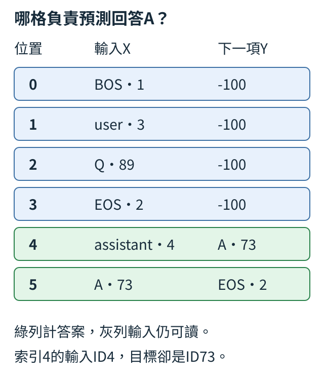
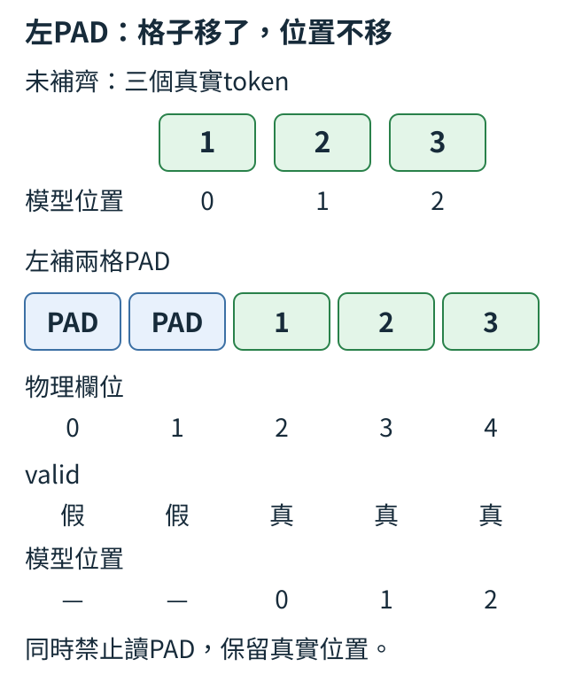
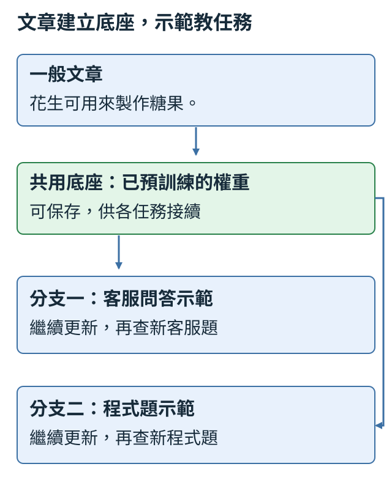
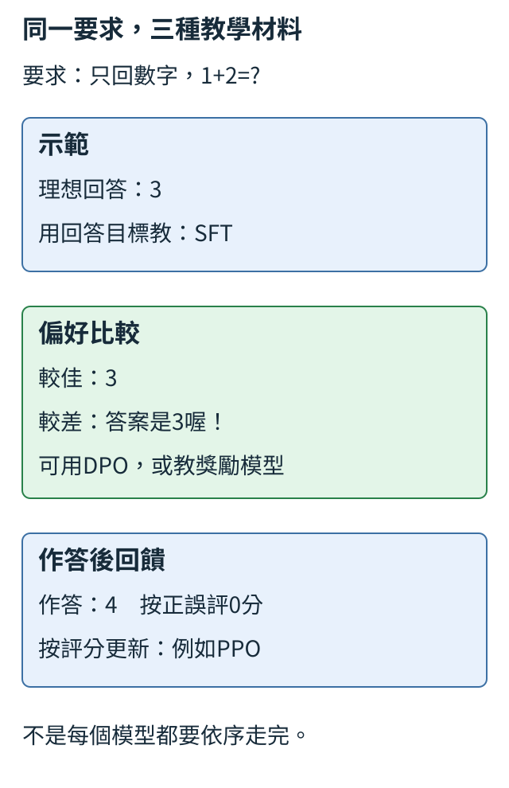
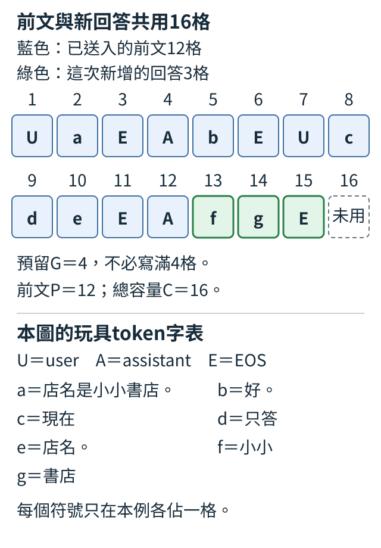

# 第 7 章：從續寫文字到回答問題

從一筆「1+1=?→2」追蹤誰說話、首答案在哪格預測，以及哪些內容供讀取、哪些答案計代價。接著處理填充、結束與截斷，再把這些約定接到SFT和留出檢查。章末從材料成本、共用底座與不同教學訊號看常見配方，最後數完整歷史和新回答共用的序列預算。

## 7.1 對話怎麼表示？

一位使用者問「1+1=?」，助手回答「2」。同樣兩段文字，若丟掉誰問誰答，模型只看到接續字句；先把每段的角色與內容分欄，再串成有邊界的序列，才能明確要求它在問題之後回答。

一筆對話是消息清單，每條用role記user或assistant，用content記原文字。沿用前章ByteTokenizer，普通內容每byte一token，BOS、EOS、角色各一專用token。下面把這份問答轉成輸入X與下一項答案Y。

```python
from tiny_perceptron.data import ByteTokenizer, render_chat

messages = [
    {"role": "user", "content": "1+1=?"},
    {"role": "assistant", "content": "2"},
]
tok = ByteTokenizer()
x, y = render_chat(messages, tok)
print("模型輸入X", x.tolist())
print("答案標籤Y", y.tolist())
print("有效目標", y[y != -100].tolist())
```

`render_chat` 將消息轉成一條序列並建立下一token答案。原始順序為BOS、user、問題bytes、EOS、assistant、答案bytes、EOS。BOS表示開始，EOS表示一段結束；轉換後x取除末項，y則取右移後的監督標記，長度都是10。輸出X為 `[1,3,57,51,57,69,71,2,4,58]`，其中4是assistant，58是字元2的byte50加8。

Y前八項都是-100，最後為58與2；-100是忽略這個位置的直接答案代價，不是輸入字表ID。`y[y!=-100]` 用真/假條件選出有效項，應輸出 `[58,2]`，要求模型學會回答2以及回答結束。user問題仍在X裡供後面的注意力讀，不需要它們每格都作為loss答案。下一節會看推論開頭，之後再拆監督位置的對齊。

用正確助理示範繼續調整已有模型，叫SFT，監督式微調。文章教「原文接什麼」，問答教「這個問題應答什麼」；模型仍預測下一token，教學材料和監督位置改了。先做資料表示，之後把它接上更新。多輪則按消息順序保留角色，不能靠內容中的標記拼寫猜誰說話。

練習只把問題改成 `"2+1=?"`，先預測角色邊界、長度與有效答案仍58、2，只有問題中的某個byteID改變，再執行核對。答案還固定2，是為了隔離格式變化；若作為正確算術訓練例，應另外將回答改成3，不能讓資料默默帶着舊錯答案。

<details>
<summary>補充：實作約定與原始紀錄</summary>

短程式沿用本課工具與原計算語義。安裝、長訓練與重做操作見[訓練配方](../training.md)，不需要先完成長配方才能閱讀這個例子。

</details>

## 7.2 模型怎麼知道輪到誰？

要讓助手接著回答「1+1=?」，輸入應停在哪裡？不能把未知的「2」先放進去，也不能讓末尾只停在問題。先結束user段，再放assistant邊界，讓下一步正好預測回答首項。

本字表BOS=1、user=3、EOS=2、assistant=4，普通問題bytes加8。這份生成前文叫prompt，下面逐項查看它的九個ID。

```python
from tiny_perceptron.data import ByteTokenizer

tok = ByteTokenizer()
question = "1+1=?"
prompt = [tok.bos_id, tok.user_id] + tok.encode(question) + [tok.eos_id, tok.assistant_id]
print(prompt)
print("最後邊界", prompt[-1])
assert prompt[-1] == tok.assistant_id
```

輸入問題字串。清單的 `+` 表示按順序相接，不是逐項數字相加，輸出應為 `[1,3,57,51,57,69,71,2,4]`，共有九個token。最後的 `prompt[-1]` 取末項4，檢查它確實是assistant標記。這裡沒有輸入正確答案2，因為生成時它尚未知；模型應由尾端位置的logits預測回答第一token。

為什麼問題結尾EOS與回答開始assistant都要保留？EOS告訴前一段結束，assistant指定下一段角色。兩個標記的功能不同，但都是訓練裡學過的前文。若訓練時使用一種邊界順序，推論突然換另一種，模型會遇到未按同樣方式練過的結構，不能只因為字義看得懂就保證它會接對。

問題EOS結束上一段，assistant指定下一段角色，兩個標記功能不同。歷史可以有完整舊回答，當前尾端卻只放回答起點；推論和訓練使用同樣格式。這份結構說明輪到誰，不提供算術正解，內容能力仍需新題檢查。

練習只移除清單尾端的assistant ID，先預測末項變EOS2、模型當前位置對應問題結尾，而非我們指定的回答角色，再執行核對。原assert應失敗；這不是需要修掉的程序錯誤，而是檢查明確發現prompt不符合約定。恢復4後檢查再通過。

<details>
<summary>補充：實作約定與原始紀錄</summary>

短程式沿用本課工具與原計算語義。安裝、長訓練與重做操作見[訓練配方](../training.md)，不需要先完成長配方才能閱讀這個例子。

</details>

## 7.3 哪些位置應該學？

「問→答」這筆對話，需要模型讀到「問」，但我們希望它練習寫的是「答」和回答結束。把問題留在輸入X，再分開標出哪些下一項答案要計代價，就能同時做到這兩件事。

Y中的-100表示忽略直接答案代價，不是輸入token。因X每格預測下一項，監督也要同樣右移；以下先印每格的輸入ID、目標與是否計分，下一節再定位首答案。

```python
from tiny_perceptron.data import render_chat

messages = [
    {"role": "user", "content": "問"},
    {"role": "assistant", "content": "答"},
]
x, y = render_chat(messages)
for position, (token, label) in enumerate(zip(x.tolist(), y.tolist(), strict=True)):
    status = "學下一項" if label != -100 else "忽略直接loss"
    print(position, "輸入ID", token, "目標", label, status)
print("有效目標數", (y != -100).sum().item())
assert (y != -100).sum().item() > 0
```

輸入一字中文問題與一字中文答案。ByteTokenizer以byte表示，問與答各三token，因此不能按一字就數一個有效目標，見 [6.7](06.md#6.7)。程序逐位置列出當前輸入ID、右移後label與是否計代價，最後有效數應4：答的三個byte與回答EOS。user內容、user段EOS與角色標記本身不作為要模仿的答案。

迴圈中的 `status = ... if ... else ...` 是條件表達式：label不是-100時選左側文字，否則選右側。`(y!=-100)` 得真/假tensor，sum把True當1數有效目標，item取成普通整數。

模型讀X的合法ID並查輸入特徵表，交叉熵讀Y的答案或-100；兩份表的用途不同。忽略user的直接代價不會刪問題，也不會禁止後面注意力讀它。只學assistant可以集中回答監督，仍需另外核對示範是否正確。

練習只把assistant內容改成 `"答案"`，先預測兩中文共六byte，加EOS共七有效目標，再執行核對。輸入也會變長，而忽略的user問題仍存在。再試英文 `"OK"`，應兩byte加EOS，共三；計數單位隨編碼規則，不隨肉眼字數。

<details>
<summary>補充：實作約定與原始紀錄</summary>

短程式沿用本課工具與原計算語義。安裝、長訓練與重做操作見[訓練配方](../training.md)，不需要先完成長配方才能閱讀這個例子。

</details>

## 7.4 回答第一個 token 在哪個位置被預測？

問題Q，回答A。完整序列是BOS、user、Q、EOS、assistant、A、EOS；要教模型寫第一個A，代價應落在assistant格，因為那格正在猜下一項。

兩字都是ASCII各一byte，Q的ID89、A的ID73。X去掉原序列末項，Y把原有效答案標記右移一次。圖把位置索引、輸入ID和目標ID分欄，先看第4列assistant→A，再看第5列A→EOS。



```python
from tiny_perceptron.data import ByteTokenizer, render_chat

tok = ByteTokenizer()
x, y = render_chat(
    [
        {"role": "user", "content": "Q"},
        {"role": "assistant", "content": "A"},
    ]
)
first = (y != -100).nonzero()[0].item()
print("X", x.tolist(), "Y", y.tolist())
print("首答案預測位置", first, "輸入", x[first].item(), "答案", y[first].item())
assert x[first].item() == tok.assistant_id
assert y[first].item() == tok.encode("A")[0]
```

輸入兩消息，Q的ASCII81加8為89，A的65加8為73。輸出X是 `[1,3,89,2,4,73]`，Y是四個-100後接73、2。`nonzero()` 找出條件為True的位置，取第一個得到first=4；該位置X=4，即assistant，而Y=73，即A。下一格X=73則負責預測EOS2。原句索引、當前輸入ID與目標ID，三種數字的用途要分開。

有效目標數對，不保證位置對。mask若未跟著右移，可能讓首代價落在已讀到A的格；應同時查「X首有效格是assistant、Y是首回答byte」。render已完成shift，TinyLM和loss按同位置比較，不能再移一次。

練習把問題Q改成 `"QQ"`，先預測首答案位置從4變5，但X[first]仍4、Y[first]仍73，再執行核對。接着只把答案A改成B，first仍5、答案ID變74。兩次分別改變前文長度與回答內容，可看清「首目標在哪」取決於哪些材料。

<details>
<summary>補充：實作約定與原始紀錄</summary>

短程式沿用本課工具與原計算語義。安裝、長訓練與重做操作見[訓練配方](../training.md)，不需要先完成長配方才能閱讀這個例子。

</details>

## 7.5 不算 loss 的內容就看不見嗎？

問題Q不算直接答案代價，模型仍需要讀它回答A。因此問題格的候選分數可以梯度0，Q的輸入特徵卻從後面答案收到梯度。兩種梯度针對不同變量，不能混看。

在最短Q／A對話，Q位於X索引2、ID89。embedding.weight第89列是Q的字向量；答案代價通過中間運算追溯到它。下面分別查看第一格logits和Q特徵列。

```python
import torch
from tiny_perceptron.data import render_chat
from tiny_perceptron.model import TinyLM, ModelConfig, masked_loss

torch.manual_seed(42)
x, y = render_chat([{"role": "user", "content": "Q"}, {"role": "assistant", "content": "A"}])
model = TinyLM(ModelConfig(width=8))
logits = model(x[None])["logits"]
logits.retain_grad()
masked_loss(logits, y[None]).backward()
print("第一位置logits梯度", logits.grad[0, 0].norm().item())
print("Q字向量梯度", model.embedding.weight.grad[x[2]].norm().item())
```

`logits` 是中間結果，PyTorch一般不保留中間節點的 `.grad`，所以 `retain_grad()` 明確要求留下它，相關葉參數區別見 [1.11](01.md#1.11)。第一格標籤-100，輸出的logits梯度大小應0；Q字表列的梯度通常大於0，因為後面的答案預測用到它。`norm` 把各格平方加總再開根，這裡只看是否有影響，不把兩者的大小當同一單位比較。

第一項回答「這個位置的候選分數有沒有直接答案代價」，第二項回答「這份輸入表示有沒有影響後面的答案」。都叫梯度，卻對不同變量問不同問題。只檢查整個embedding層是不是None，無法知道Q那列是否參與；只看到第一格0，也不能推斷所有user內容都被凍結。

共享輸入表也會因user內容被後續讀取而調整；忽略user loss沒有凍結它。detach輸入或禁止回答讀Q，會切掉另一條影響路線，是新的操作。這段只求梯度，沒有step；它核對資料依賴，尚未調整出回答能力。

練習只把user的Q替換成Z，保持答案A與seed不動。先預測第一格logits梯度仍0、被讀取的Z字表列通常有梯度，再重新執行核對。因為X索引2仍是問題字，程式會自動查新的那一列，這次測試的是角色與位置關係，而不是Q這個字特別有魔法。

<details>
<summary>補充：實作約定與原始紀錄</summary>

短程式沿用本課工具與原計算語義。安裝、長訓練與重做操作見[訓練配方](../training.md)，不需要先完成長配方才能閱讀這個例子。

</details>

## 7.6 補齊 batch 的位置該算 loss 嗎？

兩筆對話長短不同，為排成同一張表，短筆會補PAD。補的格子沒有真正答案，不能因為多補幾格就讓平均代價變好，或要求模型學著寫PAD。

先固定兩個位置的候選分數與答案，只添三格label=-100。這樣可以單獨看分子與分母是否只計真正兩個答案；PAD是輸入專用ID，-100則是答案忽略值。

```python
import torch
from tiny_perceptron.model import masked_loss

a = torch.tensor([[[0.0, 2.0, 0.0, 0.0], [0.0, 0.0, 0.0, 0.0]]])
labels = torch.tensor([[1, 2]])
b = torch.cat([a, torch.zeros(1, 3, 4)], dim=1)
extended = torch.tensor([[1, 2, -100, -100, -100]])
before = masked_loss(a, labels)
after = masked_loss(b, extended)
print(before.item(), after.item())
assert torch.allclose(before, after)
```

輸入a是一筆、兩位置、四候選，正確答案分別ID1與2。第一格高分2給ID1約0.711機率、代價約0.341，第二格全0給每個候選0.25、代價約1.386，所以平均約0.864。`torch.cat(...,dim=1)` 沿位置軸接三格，形成 `[1,5,4]`；三格label全-100，分子不納入它們，分母仍2。輸出兩個平均應一致。

這裡新增位置的logits也是全0，但即使換成任意分數，只要label忽略，它們也不參加直接答案代價。反之，若label誤設PAD ID0，交叉熵會認真把它當成「下一項應為0」的任務，產生新的更新方向。不能只把輸入值填0，就期待loss自動知道是補齊。

統計不變還不代表模型讀入PAD後預測不變。本段沒有重跑補齊序列的前向，只驗證loss；下一節另檢查讀取許可和位置。新增填充不能增加有效答案，整批有效目標0時也不能算平均。

練習只把extended第一個-100改成0，先預測它加入第三道題、平均代價約1.038，舊一致檢查失敗，再執行核對。恢復-100後兩值再次相同。你沒有改原兩個有效位置的預測，變化完全來自哪些位置被納入統計。

<details>
<summary>補充：實作約定與原始紀錄</summary>

短程式沿用本課工具與原計算語義。安裝、長訓練與重做操作見[訓練配方](../training.md)，不需要先完成長配方才能閱讀這個例子。

</details>

## 7.7 填充的位置會被當線索嗎？

原序列是[1,2,3]，左邊補兩PAD後變[0,0,1,2,3]。若希望真實三格得到相同預測，就要讓它們不讀PAD，而且仍使用位置0、1、2。

因果遮罩只禁止未來，valid另禁止填充key；兩條要同時成立。圖裡物理欄位0到4用來找格子，模型位置ID最後三格仍0到2，兩種编號別混用。



```python
import torch
from tiny_perceptron.model import TinyLM, ModelConfig

torch.manual_seed(42)
model = TinyLM(ModelConfig(vocab_size=10, width=8))
base = model(torch.tensor([[1, 2, 3]]))["logits"]
ids = torch.tensor([[0, 0, 1, 2, 3]])
valid = ids != 0
positions = torch.tensor([[0, 0, 0, 1, 2]])
actual = model(ids, valid=valid, positions=positions)["logits"][:, 2:]
print("有效位置最大差", (base - actual).abs().max().item())
assert torch.allclose(base, actual, atol=1e-6)
```

輸入base是一筆三真token。補齊版ids用0當PAD，valid是 `[False,False,True,True,True]`，positions最後三格仍0、1、2；PAD位置的數字不用於真實對應。模型把valid與causal合成讀取許可，輸出取 `[:,2:]` 只比較真位置。最大差應為0或極小浮點誤差，檢查容許百萬分之一的絕對差。

本例假定ID0專供PAD，真實內容不使用0，所以 `ids!=0` 能判斷有效。換成別的字表要改相同約定，不能無條件把所有0當空格。一般batch工具會直接提供valid，不必從token值猜，後面都應保留它。

最前PAD查詢可能沒有可讀key。對全負無窮直接softmax會出NaN，本工具把空讀取輸出設0，再用valid與答案忽略避開它。取消valid可能讀到PAD，取消自訂位置則讀到不同位置向量；兩種改動各自會破壞等價。

練習先只刪調用裡的 `valid=valid`，保留positions，預測差值通常不再接近0、assert失敗，再執行核對。恢復valid後，再只刪positions重複一次；定位每種差異的來源。比較時固定seed與模型，避免重新隨機初始化把PAD影響混進其他變化。

<details>
<summary>補充：實作約定與原始紀錄</summary>

短程式沿用本課工具與原計算語義。安裝、長訓練與重做操作見[訓練配方](../training.md)，不需要先完成長配方才能閱讀這個例子。

</details>

## 7.8 補了 PAD 該取哪個輸出？

短題右補PAD時，下一項要從最後真實格預測，不能一律取矩陣最末格。第一筆[真,真,假,假]末格索引1；另一筆左補[假,真,真,真]末格索引3。

光用有效數減一，左補那筆會得到2而非3。應找True所在的最大物理索引，再為每筆取對應logits。以下用人工編號分數，讓取了哪格看得清楚。

```python
import torch

valid = torch.tensor([[True, True, False, False], [False, True, True, True]])
positions = torch.arange(4)[None].expand_as(valid)
last = positions.masked_fill(~valid, -1).amax(dim=-1)
logits = torch.arange(40, dtype=torch.float32).reshape(2, 4, 5)
selected = logits[torch.arange(2), last]
print("最後有效索引", last)
print("取出的候選分數", selected)
assert last.tolist() == [1, 3]
```

輸入兩筆有效表和人為編號的候選分數，每位置五候選。`arange(4)` 產生0到3，`[None]` 加筆軸，`expand_as` 讓每筆共用這排物理位置編號。`~valid` 將真/假反過來，`masked_fill` 把無效格位置設-1，再沿各筆取最大 `amax`，得到 `[1,3]`。

logits用0到39排成 `[2,4,5]`，數字只為取值清楚。`logits[torch.arange(2),last]` 同時指定兩筆各自的末格：第0筆格1是 `[5,6,7,8,9]`，第1筆格3是 `[35,36,37,38,39]`。輸出形狀 `[2,5]`，每筆一組下一項候選，而不是再多取一個位置軸。

選取只找正確起點，不會修改分數或替你抽下一token。某筆全False會得到-1，Python又把它當末格，正式入口须先拒絕空題。前面的valid或模型位置若錯，即使取對末格也不能修好預測。

練習只把第一筆改成 `[False,False,True,True]`，先預測last從1變3，取值變 `[15,16,17,18,19]`，第二筆保持不動，再執行並改檢查核對。這次有效數仍兩格，卻末索引不同，直接證明數量與最後位置是不同資訊。

<details>
<summary>補充：實作約定與原始紀錄</summary>

短程式沿用本課工具與原計算語義。安裝、長訓練與重做操作見[訓練配方](../training.md)，不需要先完成長配方才能閱讀這個例子。

</details>

## 7.9 模型怎麼知道回答結束？

回答A之後應結束，普通句號卻可能還要接下一句。把專用EOS放進回答尾端，並作為有效下一項目標，模型才有機會學「在這裡結束」。

生成上限另限制最多寫多少新token。EOS是模型選的結束，上限是外部預算；以下先查回答尾目標，再給手寫候選[A,EOS,B]，只驗證停止判斷。

```python
from tiny_perceptron.data import ByteTokenizer, render_chat

tok = ByteTokenizer()
x, y = render_chat([{"role": "user", "content": "Q"}, {"role": "assistant", "content": "A"}])
print("最後有效目標", y[-1].item(), "EOS", tok.eos_id)
assert y[-1].item() == tok.eos_id
generated = [tok.encode("A")[0], tok.eos_id, tok.encode("B")[0]]
max_new_tokens = 2
visible = []
for token in generated[:max_new_tokens]:
    if token == tok.eos_id:
        break
    visible.append(token)
print("顯示的內容", tok.decode(visible))
```

輸入短對話，render的最後標籤應2，是專用EOS。後半段用預先給定的模擬預測 `[73,2,74]`，不是模型訓練後實測；73表示A，74表示B。迴圈最多檢查兩項，每次若見EOS就 `break` 退出循環，不把它當正文加入visible。所以輸出內容只有A，後面的B不會顯示。

實際模型每次會替各候選下一ID給出分數，這組分數叫logits；接著選下一ID，再檢查是否停止，如同 [1.14](01.md#1.14) 的逐項生成。示例先給定結果，是為了單獨驗證停止規則。EOS通常留在保存的結構序列中，文字解碼時跳過這些專用標記；用戶看到的回答正文不需要顯示字面 `<eos>`。

歷史user段也可以有EOS，表示前段已結束；它不會讓當前assistant尚未生成就停止。逐byte生成上限還可能切半字，需要完整解碼規則。內容正確、模型選EOS、到上限截停應分開記，末尾有句號無法替它們判定。

練習把generated改為 `tok.encode("ABCD")`，保持max_new_tokens=2。先預測沒有EOS、只能顯示AB，再執行核對；這次停止來自上限，不代表模型學會適時結束。恢復原生成清單則顯示A，兩種停止來源都能直接驗證。

<details>
<summary>補充：實作約定與原始紀錄</summary>

實際學會結束，也不等於內容答對。[T.4的屬性問答模型](../training.md#T.4)訓練900次後，對一筆應回答`circle`的驗證題生成`cire`，原始ID是`[107,113,122,109,2]`。最後的2確實是EOS，前四項卻只拼出錯誤的答案。這份模型在全部五題驗證與十題最後檢查都主動結束，仍有許多內容錯誤；[7.12](#7.12)會列出成績。因此評估要保留原始生成ID與EOS欄位，再分開計答案，不能只看最後有沒有停。

短程式沿用本課工具與原計算語義。安裝、長訓練與重做操作見[訓練配方](../training.md)，不需要先完成長配方才能閱讀這個例子。

</details>

## 7.10 答案被截光了還在訓練嗎？

問題「很長的問題」，回答「是」。如果只留序列前兩格，剩下BOS和user，沒有任何回答目標。輸入仍有數字，卻不表示這份資料還提供可平均的答案代價。

label不是-100的數量就是有效分母。切段後要重數，既要至少保留一個目標，也要查看完整答案和EOS有沒有留下。縮小學習率不會把已截掉的答案補回。

```python
from tiny_perceptron.data import render_chat, pad_batch

example = render_chat(
    [
        {"role": "user", "content": "很長的問題"},
        {"role": "assistant", "content": "是"},
    ]
)
try:
    pad_batch([example], max_length=2)
except ValueError as error:
    print("預期資料錯誤", error)
else:
    raise AssertionError("應該偵測空監督")
x, y = example
first = (y != -100).nonzero()[0].item()
print("首有效索引", first, "最低保留長度", first + 1, "完整長度", len(x))
```

輸入一筆中文問答，問題五字十五byte，答案一字三byte。`pad_batch` 把資料組batch，max_length=2只留前兩格，目標都-100，所以它明確報告第0筆截斷後沒有有效答案。`try` 表示試著執行，若出現指定ValueError就跑except；沒有預期錯誤則走else，並用AssertionError提醒檢查未生效。這段捕獲有意安排的錯誤，程序可繼續看後面的定位。

最後找首有效索引18，最低長度19才保留一個答案目標，完整長度22才含答的三byte與EOS。長度按X/Y格數計，不按中文字數；按 [7.4](#7.4) 首答案由assistant位置預測，所以最低合法長度不需要把全部答案都當輸入。合法有一格，只表示有分母，不保證完成了完整回答訓練。

有一格目標只表示平均合法，不表示完整回答有訓練。處理長題可擴窗口、保完整答案、重設切段或明確過濾，記下來源與原因。逐筆檢查，才能避免一批中空題被其他題掩蓋；語意被截斷也不能靠添EOS變成完整答題。

練習把max_length改為19，先預測不再報空監督、但只保留一個答案byte目標；把首次try塊改成直接接 `bx,by,valid=pad_batch(...)` 再印 `(by!=-100).sum()` 核對1。改成22應得到4。這樣用有效數與結束位置定位損失的內容，而不是只看長題有多少輸入token。

<details>
<summary>補充：實作約定與原始紀錄</summary>

自然對話尤其不能只問「放得進去嗎」。[T.4的UltraChat小型實跑](../training.md#T.4)另取100筆資料的首輪問題與回答，各保留最多120個byte、末尾保持完整字，再按原題家族切成80／10／10。這讓一筆能放進256格的小模型，也讓答案仍有可計分的位置；但有些問題與回答在句中就結束，意思可能已不完整。我們為片段加上的EOS，表示這次片段結束，不是原對話已回答完畢。

這個獨立模型只更新80次，十題驗證與十題最後檢查的答案ID匹配都是0，實際生成也有大量零碎字詞。開放式問答本來就不能只靠與示範一字不差判好壞；這份結果更沒有支持「已能完成原問題」。它適合確認下載、轉換、遮罩與更新走得通；若要研究完整對話能力，應先保留題目語意與完整答案，再安排相應模型和預算。

短程式沿用本課工具與原計算語義。安裝、長訓練與重做操作見[訓練配方](../training.md)，不需要先完成長配方才能閱讀這個例子。

</details>

## 7.11 預訓練模型怎麼學會對話？

讀文章時，模型練「原句接什麼」；當助理時，還要練「這位使用者要什麼回答」。SFT把正確問答與角色邊界放進前文，只用回答目標继續調參數。仍是下一token和交叉熵，不需另換一種模型才能回答。

先用0+0→0、0+1→1兩筆對話，把輸入、答案與有效位置接到模型。下面新建隨機小模型只求梯度，讓接口可見；真正微調則載入已有基模與匹配字表，再加入優化器更新。

```python
import torch
from tiny_perceptron.data import toy_conversations, render_chat, pad_batch
from tiny_perceptron.model import TinyLM, ModelConfig, masked_loss

torch.manual_seed(42)
examples = [render_chat(messages) for messages in toy_conversations()[:2]]
x, y, valid = pad_batch(examples)
model = TinyLM(ModelConfig(width=8))
loss = masked_loss(model(x, valid=valid)["logits"], y)
loss.backward()
print("batch形狀", x.shape, "有效答案", (y != -100).sum().item())
print("問答接口代價", loss.item())
```

`toy_conversations` 是專案的合成加法小世界，前兩筆問題0+0與0+1、回答0與1，ASCII答案各一byte加EOS，所以有效目標共4。`pad_batch` 回傳X、Y與有效輸入表，模型處理兩筆每筆10位置，輸出每位置264個byte/結構候選。最後loss為正，backward有梯度，說明串接成功；這段沒有optimizer.step，尚未進行新訓練。

固定題目與生成規則，比较微調前後的內容、格式及舊能力。已有的小世界比較，先文字再問答的支線多了文字更新預算，不能把差異全歸因於階段形式。常見兩階段的資料成本和重用理由在本章後段展開，眼前只需记住材料從文章換成回答示範。

練習複製其中一筆消息，把assistant答案0改成3，再render並印有效目標ID。先預測原0的byte48加8=56變成3的51加8=59，EOS仍2；其他角色與問題不變。核對後恢復正確答案，避免把演示錯誤當正式訓練資料。

<details>
<summary>補充：實作約定與原始紀錄</summary>

我們已實跑兩條獨立路線。第一條從隨機模型開始，只用45筆屬性問答更新900次；第二條先把這45筆的問題與答案接成文字、練250次續寫，保存後再以對話角色與回答遮罩微調900次。第二條並沒有沿用前章的故事模型，也沒有先得到廣泛知識；它只在同一批小世界材料上多做了一個文字階段。兩條對話階段都用同樣寬度64、兩層、種子42、每批16筆與學習率0.003，最後用同一組留出題比較，見[7.12](#7.12)。因為第二條多了250次文字更新，成績差異不能全當成「預訓練形式本身」的因果效果；要隔離它，還需另外匹配總訓練預算。

短程式沿用本課工具與原計算語義。安裝、長訓練與重做操作見[訓練配方](../training.md)，不需要先完成長配方才能閱讀這個例子。

</details>

## 7.12 模型會回答新組合嗎？

訓練見紅圓、藍圓、藍方，留下紅方。紅與方都出現過，新的只是它们同時出現的組合。這種切法能問模型會不會組合已有屬性，和考從未見過的顏色不同。

兩顏色×兩形狀共四格，留紅方、教其餘三格。該組合所有措辭版本要同侧；下面先檢查訓練與留出沒有交集。

```python
all_pairs = [(color, shape) for color in ["紅", "藍"] for shape in ["圓", "方"]]
held_out = {("紅", "方")}
train = [pair for pair in all_pairs if pair not in held_out]
print("訓練組合", train)
print("留出組合", held_out)
assert not (set(train) & held_out)
```

輸入屬性列表，第一行是兩層清單迴圈的簡寫：每種顏色都配每種形狀，因此先紅圓、紅方，再藍圓、藍方。`held_out` 用集合保存留出項，`if pair not in held_out` 只保留其餘。輸出訓練三組，檢查兩組集合沒有交集；它只驗證split規則，沒有訓練或生成結果。

真正實驗還要給每個組合一組明確問題與答案，並把所有措辭版本一起分組。例如紅方的「紅色方塊」「一個紅方形」都屬於同一組合，不能讓一份進訓練、另一份進留出後稱新組合。資料工具應記錄顏色與形狀欄位，不只憑文本表面分組。

一個實際屬性問答比較把顏色、形狀、音高組合按家族留出。直接對話、只做文字、文字後再對話三路，在相同十題上完整答對5、1、7題；都能EOS結束，內容仍不全對。先文字再對話這路多了更新預算，只有少量家族和一個種子，不能當通則。

題目給color=blue、shape=circle、pitch=low並問形狀，正確答案是circle；答square就是內容錯誤，而不是另一種合理續寫。新組合任務须讓目標真的依賴提供的屬性。

練習把held_out改成 `{("藍","圓"),("藍","方")}`，先預測訓練只兩種紅組合、訓練中缺藍，再執行核對。寫一句「這次測未見顏色」說明目標變化。恢復紅方留出後，確認紅、藍、圓、方仍各出現至少一次，才回到新組合的原問題。

<details>
<summary>補充：實作約定與原始紀錄</summary>

上面只安排切分；真正的屬性實驗另有顏色、形狀、音高三項，共12個組合，每組問五種問題。九組共45題拿來教，一組五題驗證，另外兩組十題最後檢查；同一組合的不同問法都在同一側。種子42的這次完整生成結果如下。先把表格的計數單位說清楚：模型把文字編成一串ID，也就是每個token的數字編號，見[6.7](06.md#6.7)。EOS是表示回答結束的專用token，見[6.6](06.md#6.6)。完全匹配比較回答內容的整串ID；是否正常產生EOS另行檢查，因此能結束與答對內容是兩件事。

「有效目標」是在計算代價時真正要求模型猜對的位置，包含回答內容與最後的EOS，不包含提問位置，見[7.3](#7.3)。例如本專案逐byte切詞，ASCII答案`red`有三個文字token，加EOS共四個有效目標，不是一題就只有一個目標。「平均代價」把每個真值目標的負自然log機率加總，再除以有效目標總數，見[1.8](01.md#1.8)；越低表示這項代價越小，仍要另外檢查自由生成是否答對。

表中的250與900都算參數更新步數：每次取一小批資料、算代價，再調整一次權重，流程見[7.11](#7.11)。同一批45題會反覆取用，900次更新不代表有900道不同問題，也不代表完整讀過資料900輪。

| 已完成的訓練路線 | 驗證答案完全相同 | 最後檢查答案完全相同 | 驗證平均代價 | 最後檢查平均代價 |
| --- | ---: | ---: | ---: | ---: |
| 從零做900次對話更新 | 1／5 | 5／10 | 1.02175 | 0.50580 |
| 先做250次文字更新，尚未對話微調 | 1／5 | 1／10 | 2.30189 | 2.03647 |
| 同一文字模型再做900次對話更新 | 3／5 | 7／10 | 0.09992 | 0.10462 |

留出代價的分母固定為驗證36個、最後檢查69個有效目標，含回答結束。三列在這批留出題都會生成EOS，但內容仍沒有全對。例如從零對話模型看到`color=blue;shape=circle;pitch=low;describe`，標準答案是`circle`，卻生成`square`。這不是一個同樣合理的自由續寫：問題已提供形狀，答案能按規則核對。這份模型的訓練代價雖已由5.77779降到0.00033，仍不能熟練抽取沒教過組合的屬性。先文字再對話的支線本次較好，卻只有一個種子和少量家族，也多了訓練預算，不能升格成所有模型的通則。[完整實測報告](https://github.com/birdhackor/tiny-perceptron-vlm/blob/main/docs/course-experiments/results/sft.json)保留每題，讓你檢查錯誤究竟在哪種問法。

短程式沿用本課工具與原計算語義。安裝、長訓練與重做操作見[訓練配方](../training.md)，不需要先完成長配方才能閱讀這個例子。

</details>

## 7.13 後續改動要和什麼比？

1+1的回答是{"answer":3}，格式整齊、數字卻錯。後續改风格、拒答或壓縮時，需先保存固定題和分項規則，才能知道改善的是交付方式，還是回答內容。

JSON把欄位名稱與值保存為文字。下面要求只有answer且值真的是整數，內容則另問是否等於2；這是兩個可以同時一過一錯的檢查。

```python
import json

reply = '{"answer": 3}'
parsed = json.loads(reply)
scores = {
    "格式符合": isinstance(parsed, dict) and set(parsed) == {"answer"} and type(parsed["answer"]) is int,
    "1+1內容正確": parsed.get("answer") == 2,
}
print(scores)
assert scores["格式符合"] and not scores["1+1內容正確"]
```

輸入reply是示意回答字串，不是現場模型生成。解析後得到字典，`isinstance(parsed, dict)` 檢查它是不是字典；這裡只接受恰好一個answer字段且值為整數。`type(value)` 取得值的類型，`type(value) is int` 要求它的類型確實是Python整數。JSON的 `true`、`false` 會解碼為表示真假的 `True`、`False`，這裡不把它們當作整數答案；若改用 `isinstance(value, int)`，它們卻也會通過，因此這裡需要更嚴格的檢查。`set(parsed)` 取得鍵集合，`get` 取answer欄位，若沒有則返回None；字典背景見 [W.2](../first-steps.md#W.2)。輸出格式True、內容False，最後檢查確認這兩種結果可以同時發生。

評估規則應在比較前寫明，例如算術用精確數值、分類用合法標籤；對開放式回答，可能需要多種合理答案或分項審讀，不一定只用字串完全相同。若只把所有表現加成一個總分，格式提升可能抵消事實退步；保存指標向量，也就是幾個分項數字，能保留這種行為差異。

基準保存完整題目、模型權重、匹配tokenizer和生成設定，後續改動用同一份題重測。正常結束也單獨記。反覆用基準選設定後它就是開發資料，最終仍需未參與選擇的新題。缺資訊、開放建議或安全邊界則各有相應標准，不能借JSON解析代判。

練習只把reply的3改成2，先預測格式仍True、內容變True，舊斷言應失敗，再執行核對並改成兩個都True的檢查。再把字段answer改名result，內容數字雖2，格式契約與字段讀取都不符；分別解釋這兩項失敗，讓評估規則可被追蹤。

<details>
<summary>補充：實作約定與原始紀錄</summary>

本課後續實驗保留的屬性基準是[T.4實跑](../training.md#T.4)的`sft/model.pt`，也就是[7.12](#7.12)那條從零練900次的模型，不是較好的`pretrain-sft.pt`。它在最後檢查只答對5／10，因此後續改動要對照這個實際起點，不能先假定舊能力已經滿分。原始報告每題保存問題、標準答案、生成ID、答案完全匹配與EOS；之後做新任務或壓縮時，沿用完整固定題目再量一次，才能看見哪些面向改善、哪些退步。

短程式沿用本課工具與原計算語義。安裝、長訓練與重做操作見[訓練配方](../training.md)，不需要先完成長配方才能閱讀這個例子。

</details>

## 7.14 少量錯誤答案會被學走嗎？

1+1真實答案2，資料卻標3，交叉熵會自行發現標錯嗎？它只取我们提供的目標機率；模型越相信錯標，這份資料的代价越低。

用四候選「0、1、2、3」，ID恰好0到3，這是獨立分類算例，與byte字表的數字字符ID不同。先給真候選2分數3，錯候選3分數1，再只提高錯候選到5。

```python
import torch
from torch.nn import functional as F

logits = torch.tensor([[0.0, 0.0, 3.0, 1.0]])
for label in [2, 3]:
    loss = F.cross_entropy(logits, torch.tensor([label]))
    print("提供的答案ID", label, "代價", loss.item())
wrong_favored = torch.tensor([[0.0, 0.0, 3.0, 5.0]])
print("提高錯字分數後，錯標代價", F.cross_entropy(wrong_favored, torch.tensor([3])).item())
```

輸入四分數，真實候選2得3、錯候選3得1。softmax後2約0.810，3約0.110，所以提供label2時代價約0.211、label3時約2.211。最後把錯候選分數提高到5，錯誤標籤的代價降到約0.139，儘管真實答案2的相對支持變少。交叉熵完整遵從輸入label，沒有自動檢查1+1的數學事實。

真實訓練中，錯誤答案也會產生清楚梯度，推動這類前文更常接錯字。如果錯例反覆出現或答案很長，其有效token影響可能超出筆數比例，見 [5.16](05.md#5.16)。少量錯誤有沒有可觀影響還要實測，不能只靠這一格代價給出所有模型都會如何的量化結論。

真訓練也會依錯誤目標求梯度，因此先獨立核對標籤，再用干淨留出題查內容。已有一個局部對照，在相同十題上正標續訓答對7、四筆形状錯標答對6，錯標支線平均代價卻略低。少量題與單種子不能量化一般損失，但再次說明低loss不能代替正解。

練習只把最後錯候選分數5改成8，先預測錯標loss繼續下降、但真答案的loss變大，再執行並另算label2核對。這次只改模型偏好，沒有更改算術事實，能直接看到「優化提供目標」與「外部任務正確」的差別。

<details>
<summary>補充：實作約定與原始紀錄</summary>

我們已從[7.12的直接對話基模](#7.12)各複製一份，做這個比較。兩支都用同樣45筆訓練題再更新300次、每批16筆；一支保留正確答案，另一支把其中四筆的`circle`與`square`對調，約佔8.9%。四筆集中在兩個已教過的屬性家族，並不是隨機把所有任務均勻汙染。問題、更新步數與抽題起點不變，兩支實際都計分33,733個訓練目標；留出題仍按獨立正解檢查。

| 繼續練習的答案 | 驗證完整答對 | 最後檢查完整答對 | 最後檢查平均代價 |
| --- | ---: | ---: | ---: |
| 全部保留正解 | 2／5 | 7／10 | 0.37101 |
| 四筆形狀答案寫錯 | 1／5 | 6／10 | 0.34698 |

這次錯標支線少答對一題，最後檢查的平均代價卻略低。這並不矛盾：代價看正確前文下各位置的機率，完整答對看模型沿自己的輸出最後是否生成整份答案，[5.8](05.md#5.8)已拆過兩者。兩支在全部留出題都會EOS結束，也不能替內容過關。只有一個種子、兩個被改動的家族和很少的新題，這些數字不能推成固定比例的錯標必然造成多少損失；它們提醒我們保存兩種結果，而不是挑較低loss就說資料無害。[實測報告](https://github.com/birdhackor/tiny-perceptron-vlm/blob/main/docs/course-experiments/results/sft_ablation.json)列出四筆改動，重做入口在[T.4](../training.md#T.4)。

短程式沿用本課工具與原計算語義。安裝、長訓練與重做操作見[訓練配方](../training.md)，不需要先完成長配方才能閱讀這個例子。

</details>

## 7.15 學會新任務會忘記舊任務嗎？

一模型先回答颜色和形状，再只練加法。兩任務共用參數，新更新可能改到舊任務依賴的數，造成遗忘。要發現它，先在兩任務各測一次，再從同一模型继續、重測同一兩份卷子。

下面A題提供「紅是圓、藍是方」的規則，B題是1+1與2+1。四格None是待測记錄，尚沒有成绩；保存問題之外，真评估還需正解與固定生成規則。

```python
measurements = {
    "微調前": {"A舊任務": None, "B新任務": None},
    "只訓練B後": {"A舊任務": None, "B新任務": None},
}
a_questions = ["紅色物體是圓。請接續：紅色物體是", "藍色物體是方。請接續：藍色物體是"]
b_questions = ["1+1=?", "2+1=?"]
print("固定A題", a_questions)
print("固定B題", b_questions)
print("待填實測", measurements)
```

輸入兩份固定評估題清單與四格表。None表示尚未測量，不是0分，也不是模型拒答；這段只是建立可記錄的比較接口，沒有在背後訓練模型，所以不填假成績。A問題明確提供前文規則、B是算術，實際任務還應保存正確答案與評分約定，而不只留問句。

真正流程是先訓練得到基模、在A/B各測一次，保存checkpoint；再從它接續只用B資料更新，保存新checkpoint，再測同一A/B題。訓練操作與狀態保存見 [5.7](05.md#5.7)、[7.11](#7.11)，不能新建隨機模型冒充「同一模型繼續」。評估題應從訓練例之外留出，別把這幾道固定題也不斷用來更新。

若B提升、A下降，可以說新學習伴隨舊退步；若A原先就不會，不能只看A_after下結论。已有屬性基模改練加法後，舊題從5/10降0/10，新加法仍0/7。這只顯示舊內容退步，沒有支持新能力已經學好。EOS與风格也需和內容分開。

練習給A評估清單新增一題，但不加入B訓練資料。先預測此代碼仍只擴大待測清單、四格仍None，再執行核對。你改變的是觀察範圍，不是模型訓練；真實重測時兩個checkpoint都要用更新後同一清單，不能一方多一道難題。

<details>
<summary>補充：實作約定與原始紀錄</summary>

本課實跑使用的A是[7.12的屬性問答](#7.12)，B則是0到7的短加法題。從同一份A基模接續，只用49筆B題更新500次後，A的十題最後檢查由5題答對降至0題。原本應回答`circle`的屬性題，這時甚至會生成`9`並正常結束；舊任務的內容表現確實變差，不只是多加一句禮貌話。

但不能把這份結果寫成「新能力學好了，代價是忘掉舊能力」。B在七題最後檢查仍是0題答對，雖然它的平均代價已從7.05820降至4.57756，訓練側代價也降了。這次看到的是舊任務退步，而新任務還沒有在未教過的加法組合上成功。加法兩個加數對調仍放在同一家族，所以`2+3`教過、`3+2`答對不會被算成獨立新組合。下一節把舊題混回來，再看兩邊完整的成績。

短程式沿用本課工具與原計算語義。安裝、長訓練與重做操作見[訓練配方](../training.md)，不需要先完成長配方才能閱讀這個例子。

</details>

## 7.16 舊例子混回去有用嗎？

只練加法會改變屬性回答的共享參數，可以在新batch再放少量舊屬性題，讓兩種目標都給出更新訊號。這叫回放：用當前參數重新算舊資料，不是播放舊梯度。

例如舊題「物體紅色、圓形；請回形狀」應答「圓形」，新題「1+1=?」應答「2」。以下A與B各兩筆、每筆假設兩個有效答案，合成四筆八答案。source记錄来源；文字只用「舊題一」等代號表示這份配方，真訓練要換完整問答。

```python
a = [
    {"source": "A", "text": "舊題一", "answer_tokens": 2},
    {"source": "A", "text": "舊題二", "answer_tokens": 2},
]
b = [
    {"source": "B", "text": "新題一", "answer_tokens": 2},
    {"source": "B", "text": "新題二", "answer_tokens": 2},
]
recipe = a + b
print("每批來源", [record["source"] for record in recipe])
print("有效答案預算", sum(record["answer_tokens"] for record in recipe))
print("待測B-only與replay各自的A/B成績")
```

輸入兩筆A與兩筆B，每筆假設兩個有效答案token，合成四筆batch，所以來源A、A、B、B，token總數8，兩邊各半。text是來源示意名，不是完整訓練對話；真正數據應使用實際問答與測得答案長度。這段只計配方與預算，未訓練，不輸出虛構保留能力曲線。

固定batch四筆時，B-only可用四筆B共八token，replay用兩筆A兩筆B同樣八token；總預算一致，但replay新任務資料份額少一些。這是方法真實的取捨，不能一邊讓B兩筆再加A兩筆額外跑一輪、另一邊只給B原兩筆，然後說都是同樣成本。

同batch四筆時，B-only四筆B和兩A兩B都八答案；回放卻分走一些新任務份額，這是實際取捨。已有回放支线保留舊題6/10，B-only為0/10，新題兩邊仍0/7；舊答案较長也使回放有效目標接近翻倍，不能說已隔離同token成本下的純效果。

練習把recipe改成 `[a[0],b[0],b[1],b[0]]`，先預測來源25:75、有效token仍8，再執行核對。這份小練習為保持四筆而重複一B例，實際實驗應換不同B資料；它不增加資料覆蓋。若把B答案長度改4，重算token比例後就不再是25:75，這能把回放配方接回本章的有效監督統計。

<details>
<summary>補充：實作約定與原始紀錄</summary>

把[7.15的實跑](#7.15)加上回放支線，兩支都從同一份屬性基模開始、更新500次，每批16題、學習率0.003。B-only只抽49筆加法訓練題；replay則從45筆舊屬性題加49筆加法題一起抽。下面比較完整答案ID，兩個任務與生成上限始終相同：

| 模型狀態 | 舊A驗證／最後檢查答對 | 新B驗證／最後檢查答對 | 這段訓練的有效目標 |
| --- | --- | --- | ---: |
| 尚未繼續訓練 | 1／5、5／10 | 0／8、0／7 | — |
| 只練B，500次 | 0／5、0／10 | 0／8、0／7 | 18,453 |
| 混回A，500次 | 4／5、6／10 | 0／8、0／7 | 36,384 |

回放支線保住了這批舊題的表現，最後檢查還多答對一題；但是B兩支都沒有通過留出加法，所以不能說回放已讓兩種能力一起學好。兩支與起點在全部這些題都會生成EOS，內容成績的差異並非漏掉結束標記。A的驗證／最後檢查分母是36／69個有效答案目標，B是16／14個，各支完整計分，沒有挑掉錯題。

還要讀右欄：相同步數與筆數，不代表相同的監督總量。舊屬性答案比加法數字長，混回A後這次有效目標接近翻倍；輸入也較長，運算成本不能視為已完全匹配。這個實驗支持「此配方下舊任務保留較好」，沒有隔離成同token預算下的純回放效應。[完整報告](https://github.com/birdhackor/tiny-perceptron-vlm/blob/main/docs/course-experiments/results/sft_ablation.json)保留各支訓練與留出生成，重跑方式見[T.4](../training.md#T.4)。

短程式沿用本課工具與原計算語義。安裝、長訓練與重做操作見[訓練配方](../training.md)，不需要先完成長配方才能閱讀這個例子。

</details>

## 7.17 為什麼先大量讀文章，再練習當助理？

讀過許多食谱，接到「列三種不含花生的點心」仍可能開始介绍食材。文章的合理下一句和使用者需要的交付物不同。前面已實際接過SFT，現在從材料取得與重用看兩階段的理由。

一般文章如「花生可制作糖果」，原文本身提供下一字答案，大量這種學習叫預訓練；問答則需寫理想三項并核對沒花生，接在底座後的學習叫後訓練，SFT是其中一種。先用假設整理成本看差異：文章每筆1單位、核對問答每筆20單位。

```python
article_count, checked_chat_count = 1000, 50
article_cost, checked_chat_cost = 1, 20
print("文章整理成本", article_count * article_cost)
print("問答整理成本", checked_chat_count * checked_chat_cost)
print("若1000筆都逐筆核對問答", article_count * checked_chat_cost)
```

輸入是筆數與假設的每筆成本。三行分別是1000、1000、20000：少量需要仔細核對的問答，已經能花掉與大量文章相同的整理預算。這段沒有訓練模型，也沒計算訓練運算費用；它說明為何資料取得方式會影響配方，不能證明「先預訓練一定比較省」或「50筆問答一定夠」。兩階段的實際成效，仍要用固定預算與留出題檢查。

底座是保存的預訓練模型。圖從文章到同一底座，再分給不同任務继續更新；底座可保存重用，分支仍需各自材料和评測。自動取得下一字不表示文章可靠，後訓練也可教任務推理，不只是礼貌。



[InstructGPT引言與3.1節](https://arxiv.org/pdf/2203.02155v1)展示這種目標差別與接續流程。眼前成本是假設，不證明兩階段必然更省；已有小世界成绩也未匹配總預算。

練習只把`checked_chat_cost`改成5，先預測問答整理成本變250、全部逐筆核對變5000，再執行核對。接著寫一句這個算例還缺什麼才能選配方：至少缺實際資料品質、訓練成本與留出表現。這些不是用成本比例就能代填的數字。

<details>
<summary>補充：實作約定與原始紀錄</summary>

本教材的[7.12實測](#7.12)讓這條路變得可操作：同一個小世界文字模型，最後十題從對話微調前1題答對，變成微調後7題答對。但它的文字階段只讀同一批45題的材料，沒有學到廣泛知識；與直接SFT的5／10相比，它還多了250次文字更新。因此這份實驗驗證了接續流程與這次成績，沒有隔離產業採用兩階段的因果理由。[19.4](19.md#19.4)會把保存與接續用到整合模型，而不是要求你先相信兩階段必勝。

短程式沿用本課工具與原計算語義。安裝、長訓練與重做操作見[訓練配方](../training.md)，不需要先完成長配方才能閱讀這個例子。

</details>

## 7.18 後訓練有哪些不同教法？

問題是「只回數字：1+2=?」。可以示範3，也可讓人比较3與「答案是3喔！」，或者先作答4再按正誤給0分。先看三種給模型的材料，再记方法名字。

示範提供期望回答；偏好提供同題哪篇较好；回饋提供作答後的評分。這個數字叫reward，不是模型情绪，也不自動等于真實品質；此處只用指定資料卡比较。

```python
demonstration = {"question": "只回數字：1+2=?", "answer": "3"}
preference = {"question": demonstration["question"], "chosen": "3", "rejected": "答案是3喔！"}
feedback = {"question": demonstration["question"], "sampled_answer": "4", "reward": 0}
print("示範給什麼", demonstration["answer"])
print("偏好比較什麼", preference["chosen"], "勝過", preference["rejected"])
print("作答後得到什麼", feedback["sampled_answer"], feedback["reward"])
```

輸入是我們人工寫的字典；`chosen`表示被選為較佳、`rejected`表示較差，`sampled_answer`記錄作答，這裡只是用`4`示意，沒有真的抽樣模型。輸出依序是示範`3`、偏好`3`勝過附加句、錯答`4`得到0。偏好兩篇都算對，但後者違反只回數字；回饋則採這個例子的正確性規則。換任務時，不能沿用數字0就假裝已定義完整標準。

理想回答监督是SFT；偏好對直接調回答傾向的一種方法是DPO，需可靠比較與固定參考：此次訓練起點保留、不再更新的模型副本。也可先用人類偏好訓練獎勵模型，再對回答取樣、评分、更新，這條人類回饋流程叫RLHF，PPO是其中一種更新方法；兩名詞層次不同。



這些是可選教法，不必依序全跑。若回饋来自程序驗算，不因使用PPO就叫人類回饋。[InstructGPT](https://arxiv.org/pdf/2203.02155v1)和[DeepSeek-R1](https://arxiv.org/pdf/2501.12948v1)給出不同接續配方，方法機制在[第13章](13.md#13.1)展開；後訓練也可能改善任務能力，须另用新題查證。

練習把問題改成「用一句話解釋1+2」，先寫出新的示範，並重新判斷原偏好是否還合理。光交換`chosen`和`rejected`不一定足夠：原附加句沒有真的解釋加法。最後說明若用真人比較、程式驗算或另一個模型評分，回饋的來源各是哪一種；方法縮寫不應遮住這個差別。

<details>
<summary>補充：實作約定與原始紀錄</summary>

後訓練能改變的不只語氣。若示範包含解題步驟，或回饋能辨認答案正誤，它也可能改善模型做某些任務的能力；成功與否仍要用新題檢查。另一個實際配方是[DeepSeek-R1論文2.2與2.3節](https://arxiv.org/pdf/2501.12948v1)：一條路線從已完成預訓練的**底座模型**直接用作答回饋做**強化學習，英文縮寫RL**；另一條先用少量理想解題示範，教出清楚的起始回答方式，再接後續訓練。這批起步時加入的示範稱為**冷啟動資料**。兩條路線說明SFT不是所有RL配方不可省略的前一步，不代表我們的微型模型能重現論文能力。

短程式沿用本課工具與原計算語義。安裝、長訓練與重做操作見[訓練配方](../training.md)，不需要先完成長配方才能閱讀這個例子。

</details>

## 7.19 回答能寫多長，和前文能放多少，有何不同？

你先告訴助手「店名是小小書店」，它回「好」。下一輪問「現在只答店名」，希望它寫出「小小書店」就結束。這次回答很短，助手卻仍要讀到前面的店名、誰說了哪句話，以及現在輪到它回答。只數最後這個問題，會漏掉真正送進模型的前文。

我們把對話排成一串，用一個只有16格的紙上例子看清楚。這裡特別指定一份玩具字表：〈user〉是使用者標記，〈assistant〉是助手標記，〈eos〉是這一段結束；每個標記各算一個token。文字片段「店名是小小書店。」「好。」「現在」「只答」「店名。」「小小」「書店」也各自指定為一個token。這是為了容易數格而訂的規則，沒有說一般模型把一句話算一個token，也沒有說每個中文字都算一個token。

照這份字表，已提供的歷史和目前問題排成下面的序列。表中每個由斜線分開的項目佔一格，斜線只用來顯示分隔，不送入模型。

| 這段訊息 | 依序放入的token | 格數 |
| --- | --- | ---: |
| 先前使用者說店名 | 〈user〉／店名是小小書店。／〈eos〉 | 3 |
| 先前助手確認 | 〈assistant〉／好。／〈eos〉 | 3 |
| 現在的要求 | 〈user〉／現在／只答／店名。／〈eos〉 | 5 |
| 輪到助手回答 | 〈assistant〉 | 1 |

全部輸入佔12格。最後的助手標記已經在輸入裡，下一步才開始生成答案；歷史裡的結束標記也佔格，但不會讓新的回答立即停止。把對話依角色與文字排成這種輸入序列，叫作序列化。實際使用別的模型時，要用它配套的對話格式和切詞工具數完這份序列，不能直接沿用這裡的12。

圖中的U、A、E分別代表三種標記，a到g代表上面指定的文字片段。先看第1到12格：它們都是已送入的前文。第13到16格才是預留給新回答的空間。下方填入的f、g、E是手寫的示意回答。



這份生成器保留完整歷史，並規定「輸入加上新增結果」最多16格，把這個上限叫C。另有一個設定G，只限制這次最多新增幾個token，常見名稱是max_new_tokens。G不包含已送入的12格，也不會把C改大。本例可以預留G＝4；若把G改成5，原本16格的容量仍不夠。程序需要先處理這個不相容的設定，而不是假裝多出的空間已經存在。

預留4格不代表必須寫滿4格。若接下來是「小小／書店／〈eos〉」，只新增3個token，最後一格沒有使用。EOS也算在新增數量裡：它雖然不顯示成回答文字，仍是模型選出的一個token。沒有使用的容量不是補進輸入的PAD，只是空間還沒用完。

現在只把G改成2。同樣的候選序列最多留下「小小／書店」，讀者已能看見完整店名，卻還沒有生成〈eos〉；這次是預算用完而截停。反過來，若第一步就選〈eos〉，雖然提早停止，店名仍沒回答。回答長度、停止原因和內容完成與否，各自告訴我們不同的事。

練習保持全部前文不變，改成手寫序列「小小／〈eos〉」。它用了幾個新token？是否超過G＝4？有沒有完成「只答店名」？應分別得到2、沒有超過、沒有完成：空間足夠、主動結束，都不能替少掉的「書店」補上證據。

<details>
<summary>補充：長度設定的來源與這個算例的範圍</summary>

Hugging Face Transformers v4.57.1的[GenerationConfig文件](https://github.com/huggingface/transformers/blob/v4.57.1/src/transformers/generation/configuration_utils.py)將max_new_tokens定義為不含prompt的新生成上限；vLLM v0.8.5的[ModelConfig文件](https://github.com/vllm-project/vllm/blob/v0.8.5/vllm/config.py)將max_model_len定義為prompt和output的總長度。本節採保留完整歷史、共用一個總上限的有限例子；滑動窗口或其他模型介面要另看其長度契約。

實際核對正常結束時，還要保存原始token與停止原因，分清模型選EOS、程式強制EOS和其他外部停止條件；不能只看畫面末尾。回答目標與EOS的監督位置沿用[7.3](#7.3)、[7.4](#7.4)、[7.9](#7.9)的安排。來源定位另見[context來源筆記](../../docs/course-revision-20261005/sources/context.md)。

</details>
