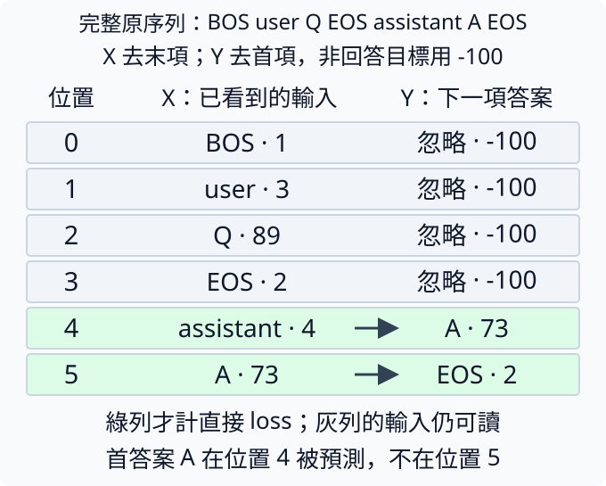
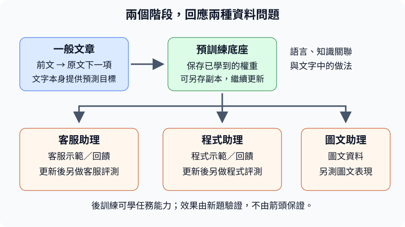
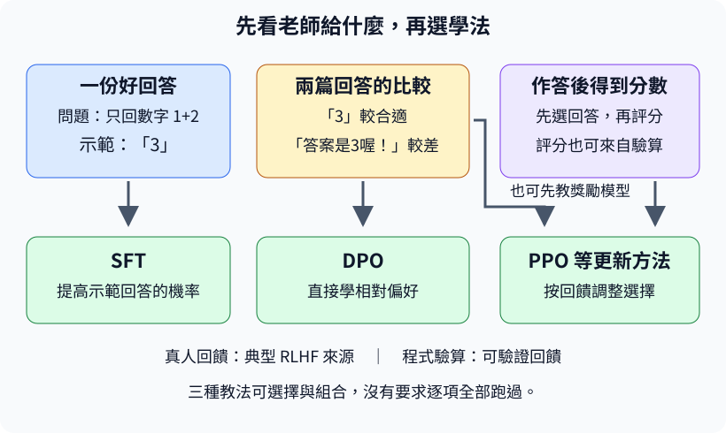

# 第 7 章：從續寫文字到回答問題

接著寫一段文字與回應一個人的問題，使用的是同一個下一token模型，卻需要不同的資料約定。本章從一筆短問答開始，追蹤誰說話、首答案在哪格被預測，以及哪些內容用來讀取、哪些答案用來計代價。接著處理長短不一的對話與結束，再用新組合、錯誤標籤和舊任務檢查微調結果。讀過[7.11的實際接續](#7.11)後，可以先到[7.17](#7.17)看為何常把大量閱讀與助理訓練分開，再到[7.18](#7.18)認識後訓練的幾種教法，然後回來看7.12的留出題。每個例子都能獨立讀取自己的小資料，讓你不必先跑長訓練，就能看清對話學習的每個接點。

## 7.1 對話怎麼表示？

模型會續寫短句，還不代表它懂用戶正在提問。要讓它學習問答，資料先把「誰說話」與「說了什麼」分開保存，再串成有邊界的一條序列。模型一次處理的片段或結構標記叫token，實際切多大由切詞方法決定，不必是一個完整中文字。這裡模型仍按[4.7](04.md#4.7)猜下一token，只是前文現在含問題，期望後續是回答。

一筆對話用消息清單表示，每條消息是一個字典，`role`記角色、`content`記內容。user是使用者，assistant是回答方；這些英文值是資料工具的約定，不是要模型靠普通文字猜身份。清單與字典見[W.2](../first-steps.md#W.2)，結構專用ID見[6.6](06.md#6.6)。

本節用位元組切詞：byte（位元組）能保存0到255的數，用八個只有0或1的位元記錄。UTF-8把文字轉成一串這樣的數；英文字元常用一個byte，中文字可能用三個，詳見[6.1](06.md#6.1)。本例的普通內容每個byte占一個token，開始、結束與角色標記則各占一個專用token。後面的ByteTokenizer就是做這種編碼的工具。

```python
from tiny_perceptron.data import ByteTokenizer, render_chat

messages = [
    {"role": "user", "content": "1+1=?"},
    {"role": "assistant", "content": "2"},
]
tok = ByteTokenizer()
x, y = render_chat(messages, tok)
print("模型輸入X", x.tolist())
print("答案標籤Y", y.tolist())
print("有效目標", y[y != -100].tolist())
```

`render_chat` 將消息轉成一條序列並建立下一token答案。原始順序為BOS、user、問題bytes、EOS、assistant、答案bytes、EOS。BOS表示開始，EOS表示一段結束；轉換後x取除末項，y則取右移後的監督標記，長度都是10。輸出X為 `[1,3,57,51,57,69,71,2,4,58]`，其中4是assistant，58是字元2的byte50加8。

Y前八項都是-100，最後為58與2；-100是忽略這個位置的直接答案代價，不是輸入字表ID。`y[y!=-100]` 用真/假條件選出有效項，應輸出 `[58,2]`，要求模型學會回答2以及回答結束。user問題仍在X裡供後面的注意力讀，不需要它們每格都作為loss答案。下一節會看推論開頭，之後再拆監督位置的對齊。

這種用正確示範回答繼續訓練的方法叫SFT（supervised fine-tuning，監督式微調）。fine-tuning表示在已有模型上繼續調參數；本文先建立資料接口，實際接續與評估會在 [7.11](#7.11) 展開。資料格式不等於能力，只有按正確目標更新、再用留出題檢查，才知道是否學會回應。

每條消息的role與content都應來自明確欄位，別靠掃描內容裡的 `<assistant>` 判斷換角色；用戶可能只是討論這串符號。多輪對話則按清單順序串接，保留每次邊界；不應把每句各編碼後丟掉是誰說話。

練習只把問題改成 `"2+1=?"`，先預測角色邊界、長度與有效答案仍58、2，只有問題中的某個byteID改變，再執行核對。答案還固定2，是為了隔離格式變化；若作為正確算術訓練例，應另外將回答改成3，不能讓資料默默帶着舊錯答案。

## 7.2 模型怎麼知道輪到誰？

你把「1+1=?」發給模型後，它可能繼續寫問題，也可能開始回答；我們要在輸入末尾明確表示下一段由assistant說。[7.1](#7.1) 的訓練序列在回答前有assistant邊界，推論也要準備相同的結構，才能讓下一token問題對應到「回答首項」。這份生成用的前文常叫prompt。

角色標記是 [6.6](06.md#6.6) 的專用ID，不是把漢字「使用者」加進去就自動具有相同效果。當前ByteTokenizer約定BOS1、user3、EOS2、assistant4。問題內容仍按每byte加8編碼，結束問題後插EOS，再插assistant，讓模型站到回答起點。

```python
from tiny_perceptron.data import ByteTokenizer

tok = ByteTokenizer()
question = "1+1=?"
prompt = [tok.bos_id, tok.user_id] + tok.encode(question) + [tok.eos_id, tok.assistant_id]
print(prompt)
print("最後邊界", prompt[-1])
assert prompt[-1] == tok.assistant_id
```

輸入問題字串。清單的 `+` 表示按順序相接，不是逐項數字相加，輸出應為 `[1,3,57,51,57,69,71,2,4]`，共有九個token。最後的 `prompt[-1]` 取末項4，檢查它確實是assistant標記。這裡沒有輸入正確答案2，因為生成時它尚未知；模型應由尾端位置的logits預測回答第一token。

為什麼問題結尾EOS與回答開始assistant都要保留？EOS告訴前一段結束，assistant指定下一段角色。兩個標記的功能不同，但都是訓練裡學過的前文。若訓練時使用一種邊界順序，推論突然換另一種，模型會遇到未按同樣方式練過的結構，不能只因為字義看得懂就保證它會接對。

邊界也不保證答案內容正確。它表示「輪到回答」，不是告訴模型 `1+1` 的結果；真正數學行為來自訓練與可用能力。若模型只學過某種固定問題，很可能即使格式正確也不會解新題，要按 [7.12](#7.12) 檢查新組合。

對多輪對話，prompt可以包含過去user與assistant內容，但當前末尾仍只放即將開始的assistant邊界，不把未知答句僞裝成已經出現的歷史。結束生成後再記錄完整assistant消息，下一輪繼續用同一render契約。我們現在只取單輪，讓九個ID的來源能逐個查回。

練習只移除清單尾端的assistant ID，先預測末項變EOS2、模型當前位置對應問題結尾，而非我們指定的回答角色，再執行核對。原assert應失敗；這不是需要修掉的程序錯誤，而是檢查明確發現prompt不符合約定。恢復4後檢查再通過。

## 7.3 哪些位置應該學？

整理好的對話同時含問題與答案。若我們想訓練一個回答者，就常只要求它學assistant的內容，而不要求它自己寫出user會提什麼。[7.1](#7.1) 已把問題留在輸入X，現在要明確哪些Y位置可以參與代價。這份監督選擇與能讀哪些前文是不同的表。

本課label用-100表示忽略直接loss。有效監督條件是 `label!=-100`，不是查看輸入token是否屬於user。因為 [1.3](01.md#1.3) 的shift，第t位置輸入預測原序列t+1，標籤也要對到下一項；不能用當前字所屬角色直接當作該格答案角色。下一節會專門追首答案位置。

```python
from tiny_perceptron.data import render_chat

messages = [
    {"role": "user", "content": "問"},
    {"role": "assistant", "content": "答"},
]
x, y = render_chat(messages)
for position, (token, label) in enumerate(zip(x.tolist(), y.tolist(), strict=True)):
    status = "學下一項" if label != -100 else "忽略直接loss"
    print(position, "輸入ID", token, "目標", label, status)
print("有效目標數", (y != -100).sum().item())
assert (y != -100).sum().item() > 0
```

輸入一字中文問題與一字中文答案。ByteTokenizer以byte表示，問與答各三token，因此不能按一字就數一個有效目標，見 [6.7](06.md#6.7)。程序逐位置列出當前輸入ID、右移後label與是否計代價，最後有效數應4：答的三個byte與回答EOS。user內容、user段EOS與角色標記本身不作為要模仿的答案。

迴圈中的 `status = ... if ... else ...` 是條件表達式：label不是-100時選左側文字，否則選右側。`(y!=-100)` 得真/假tensor，sum把True當1數有效目標，item取成普通整數。

模型讀的是輸入X：它拿X中的合法ID，到一張數值表查出起始特徵。這個動作叫嵌入查表，英文embedding，見[4.1](04.md#4.1)。目標Y則交給交叉熵計算代價，其中的-100只表示「這個位置不計分」。-100不會拿去查輸入表，也不是合法文字ID；X中對應的問題文字仍會正常送進模型。

不算某位置loss，表示不直接讓該位置的logits承擔答案代價；這段輸入仍可供後面回答讀取。我們還要用 [3.6](03.md#3.6) 因果遮罩限制未來，不因為user不計loss就刪除問題。若刪除問題，模型反而沒有問答關聯的條件，只能學常見回答。

不同訓練目標可以監督全部對話或只部分角色，但必須說清楚目標與分母。這裡只學assistant，通常使訓練資源集中在回答內容與結束方式；它不能自動篩掉錯標答案，品質控制仍是資料工作。

練習只把assistant內容改成 `"答案"`，先預測兩中文共六byte，加EOS共七有效目標，再執行核對。輸入也會變長，而忽略的user問題仍存在。再試英文 `"OK"`，應兩byte加EOS，共三；計數單位隨編碼規則，不隨肉眼字數。

## 7.4 回答第一個 token 在哪個位置被預測？

你可能直覺把回答A所在位置標成「學習A」，但模型該格其實在猜A後面的東西。首答案必須由前一個位置預測，在目前格式就是assistant邊界所在格。這是對話訓練最容易差一格的地方：mask若按原角色貼完就直接用，可能漏掉首字或讓模型學複製答案。

接續 [7.2](#7.2) 的回答起點和 [7.3](#7.3) 的監督選擇，我們用ASCII單字Q、A讓每字只一byte。原完整序列是 `[BOS,user,Q,EOS,assistant,A,EOS]`。在原序列上給A與最後EOS有效標籤，再取X為原序列除末項、Y為標籤除首項，就與 [1.3](01.md#1.3) 保持同一個右移。

```python
from tiny_perceptron.data import ByteTokenizer, render_chat

tok = ByteTokenizer()
x, y = render_chat(
    [
        {"role": "user", "content": "Q"},
        {"role": "assistant", "content": "A"},
    ]
)
first = (y != -100).nonzero()[0].item()
print("X", x.tolist(), "Y", y.tolist())
print("首答案預測位置", first, "輸入", x[first].item(), "答案", y[first].item())
assert x[first].item() == tok.assistant_id
assert y[first].item() == tok.encode("A")[0]
```

輸入兩消息，Q的ASCII81加8為89，A的65加8為73。輸出X是 `[1,3,89,2,4,73]`，Y是四個-100後接73、2。`nonzero()` 找出條件為True的位置，取第一個得到first=4；該位置X=4，即assistant，而Y=73，即A。下一格X=73則負責預測EOS2。原句索引、當前輸入ID與目標ID，三種數字的用途要分開。

下圖把這六個位置逐列排開。中欄是模型已看到的輸入X，右欄是同位置要預測的下一項Y，點號後的數字是token ID；左欄0到5才是位置索引。綠列有有效答案，箭頭從assistant指向A、從A指向EOS，表示這兩個預測事件。灰列的-100只表示不計該列的直接loss，中欄的問題與角色邊界仍保留在輸入，後面仍可以讀它們。



如果監督mask沒有同步右移，就可能把有效首目標放到X已經是A的格子，而真正assistant格沒有代價。這會改變學習事件，即使有效目標數量看起來還正確。檢查不應只數有幾格學，還要驗證「首格輸入是assistant，答案是首回答byte」這個具體關係。

也不要為了修正對齊再讓模型內部shift一次。render已經完成一次，TinyLM與masked_loss按同位置對應即可，接口見 [4.7](04.md#4.7)。後續插入影像或其他前文時，雖然first索引可能變，assistant格預測回答首項的關係仍應保持。

練習把問題Q改成 `"QQ"`，先預測首答案位置從4變5，但X[first]仍4、Y[first]仍73，再執行核對。接着只把答案A改成B，first仍5、答案ID變74。兩次分別改變前文長度與回答內容，可看清「首目標在哪」取決於哪些材料。

## 7.5 不算 loss 的內容就看不見嗎？

問題Q不被要求作為答案，模型卻還要讀取Q來回答A。[7.3](#7.3) 的忽略標籤只是關閉某位置的直接代價，不會把輸入內容從注意力裡刪除。這表示問題位置的預測分數可以沒有直接梯度，問題的字向量仍可能從後續答案收到梯度。字向量就是模型依文字ID查表取得的一列可調特徵數，這種查表叫embedding，見[4.1](04.md#4.1)。這兩條影響路線，要各自檢查才看得見。

回想 [1.10](01.md#1.10) 的鏈式求導：答案loss沿著輸出計分與中間運算追溯影響，注意力讀過的Q向量就可能參與。我們拿最短Q/A對話，讓首位置BOS的logits與Q的embedding分開看。Q在X索引2，ID為89；監督有效位置則是 [7.4](#7.4) 的assistant與A兩格。

`model.embedding.weight` 是剛才的特徵數表，第89列就是Q的字向量。反向計算後，它的 `.grad` 也按同樣的列保存梯度。因此 `model.embedding.weight.grad[x[2]]` 先由 `x[2]` 取出ID 89，再查梯度表第89列；89是字的編號，不是句子的第89個位置。問題與回答都使用這張輸入表，同一ID出現在不同角色時也會查到同一列。

```python
import torch
from tiny_perceptron.data import render_chat
from tiny_perceptron.model import TinyLM, ModelConfig, masked_loss

torch.manual_seed(42)
x, y = render_chat([{"role": "user", "content": "Q"}, {"role": "assistant", "content": "A"}])
model = TinyLM(ModelConfig(width=8))
logits = model(x[None])["logits"]
logits.retain_grad()
masked_loss(logits, y[None]).backward()
print("第一位置logits梯度", logits.grad[0, 0].norm().item())
print("Q字向量梯度", model.embedding.weight.grad[x[2]].norm().item())
```

`logits` 是中間結果，PyTorch一般不保留中間節點的 `.grad`，所以 `retain_grad()` 明確要求留下它，相關葉參數區別見 [1.11](01.md#1.11)。第一格標籤-100，輸出的logits梯度大小應0；Q字表列的梯度通常大於0，因為後面的答案預測用到它。`norm` 把各格平方加總再開根，這裡只看是否有影響，不把兩者的大小當同一單位比較。

第一項回答「這個位置的候選分數有沒有直接答案代價」，第二項回答「這份輸入表示有沒有影響後面的答案」。都叫梯度，卻對不同變量問不同問題。只檢查整個embedding層是不是None，無法知道Q那列是否參與；只看到第一格0，也不能推斷所有user內容都被凍結。

這也說明只忽略user loss仍會調整共享輸入表中的user字向量。若同一個字也出現在assistant的輸入X位置，模型會用它預測下一個答案單位或回答結束；該位置的代價就可能經中間運算回傳到這一列輸入特徵。這不是拿目標Y的ID直接對embedding列打分。本例Q只在問題中出現，A是另一個字，幫助隔離「被後續讀取」這件事。隨機初始化沒有語言含義，但運算關係已經可驗證。

若額外在輸入向量上detach、或用attention mask禁止回答位置讀Q，會切掉另一路影響，結果可能不同。這是新的操作，不能認為-100已經代替了它們；而且禁止讀問題會削弱問答條件。監督mask與讀取mask必須按各自目的設計。

練習只把user的Q替換成Z，保持答案A與seed不動。先預測第一格logits梯度仍0、被讀取的Z字表列通常有梯度，再重新執行核對。因為X索引2仍是問題字，程式會自動查新的那一列，這次測試的是角色與位置關係，而不是Q這個字特別有魔法。

## 7.6 補齊 batch 的位置該算 loss 嗎？

兩筆對話長度不同，要排成同一張tensor通常先補到相同長度，補上的空格token叫PAD。這些位置只是排表需要，並沒有實際答案。如果把它們也算入平均，越短的資料可能因為多補空格得到看似更低的loss，模型還會被要求預測PAD。統計必須回到真正有效目標。

[5.2](05.md#5.2) 用有效答案數當分母，[7.3](#7.3) 用-100忽略直接代價；現在讓補齊位置也用這份忽略約定。注意PAD是輸入的專用ID，而-100是答案label的忽略值，兩者用途不同。我們先固定已有兩格預測，只在末尾追加三格，隔離損失計算，不改變原預測。

```python
import torch
from tiny_perceptron.model import masked_loss

a = torch.tensor([[[0.0, 2.0, 0.0, 0.0], [0.0, 0.0, 0.0, 0.0]]])
labels = torch.tensor([[1, 2]])
b = torch.cat([a, torch.zeros(1, 3, 4)], dim=1)
extended = torch.tensor([[1, 2, -100, -100, -100]])
before = masked_loss(a, labels)
after = masked_loss(b, extended)
print(before.item(), after.item())
assert torch.allclose(before, after)
```

輸入a是一筆、兩位置、四候選，正確答案分別ID1與2。第一格高分2給ID1約0.711機率、代價約0.341，第二格全0給每個候選0.25、代價約1.386，所以平均約0.864。`torch.cat(...,dim=1)` 沿位置軸接三格，形成 `[1,5,4]`；三格label全-100，分子不納入它們，分母仍2。輸出兩個平均應一致。

這裡新增位置的logits也是全0，但即使換成任意分數，只要label忽略，它們也不參加直接答案代價。反之，若label誤設PAD ID0，交叉熵會認真把它當成「下一項應為0」的任務，產生新的更新方向。不能只把輸入值填0，就期待loss自動知道是補齊。

這段沒有把整條補齊序列送回模型，因此只驗證統計規則；實際輸入補齊後，還需保證PAD不會改變有效位置的預測。尤其左邊PAD能被因果注意力讀到，下一節會另檢查輸入許可與位置編號。這兩個檢查都要做，才能說添加填充不改變任務。

整批有效目標為零時，沒有合法平均分母，工具會報錯，見 [7.10](#7.10)。可用更多PAD不會創造新的學習資料，也不應把它們計成訓練token預算。[5.16](05.md#5.16) 的來源配比同樣應數有效答案。

練習只把extended第一個-100改成0，先預測它加入第三道題、平均代價約1.038，舊一致檢查失敗，再執行核對。恢復-100後兩值再次相同。你沒有改原兩個有效位置的預測，變化完全來自哪些位置被納入統計。

## 7.7 填充的位置會被當線索嗎？

在真實輸入前面補兩個PAD，再接ID1、2、3，最後位置從五個格裡看到的過去與原三字串不同。如果只用因果遮罩，它會允許讀那兩個PAD，哪怕PAD的答案loss已忽略。因此 [7.6](#7.6) 的損失規則還不足以保證結果相同，我們還需要遮掉無效key，並保持真實位置的編號。

[3.6](03.md#3.6) 的因果條件是「不能讀未來」，而key_valid條件是「不能讀填充」。兩者要同時成立，叫邏輯AND。再看 [4.1](04.md#4.1)，原始ID1在位置0，左補齊後物理格2仍應使用語義位置0，不應突然換成位置向量2。物理索引是tensor欄位，位置ID則是模型使用的順序約定。

```python
import torch
from tiny_perceptron.model import TinyLM, ModelConfig

torch.manual_seed(42)
model = TinyLM(ModelConfig(vocab_size=10, width=8))
base = model(torch.tensor([[1, 2, 3]]))["logits"]
ids = torch.tensor([[0, 0, 1, 2, 3]])
valid = ids != 0
positions = torch.tensor([[0, 0, 0, 1, 2]])
actual = model(ids, valid=valid, positions=positions)["logits"][:, 2:]
print("有效位置最大差", (base - actual).abs().max().item())
assert torch.allclose(base, actual, atol=1e-6)
```

輸入base是一筆三真token。補齊版ids用0當PAD，valid是 `[False,False,True,True,True]`，positions最後三格仍0、1、2；PAD位置的數字不用於真實對應。模型把valid與causal合成讀取許可，輸出取 `[:,2:]` 只比較真位置。最大差應為0或極小浮點誤差，檢查容許百萬分之一的絕對差。

本例假定ID0專供PAD，真實內容不使用0，所以 `ids!=0` 能判斷有效。換成別的字表要改相同約定，不能無條件把所有0當空格。一般batch工具會直接提供valid，不必從token值猜，後面都應保留它。

最前面PAD查詢可能沒有任何有效key；若對全負無窮分數直接softmax會出NaN，因為無法形成合法比例。專案的注意力工具會把這種空讀取輸出設0，再由valid與答案mask保證它不干擾真實目標。處理空行是為了數值完整，不表示PAD開始有了需學的意思。

若取消valid，真實位置就可能混入PAD向量；若只取消自訂positions，它們則改讀位置2、3、4的向量，另一種變化也會使等價檢查失敗。兩個條件分別解決內容和順序，不能用一個漂亮的三角矩陣代替所有填充規則。

練習先只刪調用裡的 `valid=valid`，保留positions，預測差值通常不再接近0、assert失敗，再執行核對。恢復valid後，再只刪positions重複一次；定位每種差異的來源。比較時固定seed與模型，避免重新隨機初始化把PAD影響混進其他變化。

## 7.8 補了 PAD 該取哪個輸出？

短問題兩格、長問題四格一起放batch，短題右邊補兩PAD。要生成下一項時，短題應該取第1格的logits，而不是整張表最後第3格；後者是填充位置。若一律 `logits[:,-1]`，長題可對、短題卻錯。需要每筆分別找最後有效位置，再拿它的下一token分數。

valid來自 [7.7](#7.7) 的有效位置表。第一筆 `[True,True,False,False]` 最後有效索引1；第二筆示範左PAD `[False,True,True,True]`，最後有效索引3。左填充時 `sum(valid)-1` 得2，卻不是物理格3，所以不能只數有幾個token推末尾格，應直接找True所在位置最大值。

```python
import torch

valid = torch.tensor([[True, True, False, False], [False, True, True, True]])
positions = torch.arange(4)[None].expand_as(valid)
last = positions.masked_fill(~valid, -1).amax(dim=-1)
logits = torch.arange(40, dtype=torch.float32).reshape(2, 4, 5)
selected = logits[torch.arange(2), last]
print("最後有效索引", last)
print("取出的候選分數", selected)
assert last.tolist() == [1, 3]
```

輸入兩筆有效表和人為編號的候選分數，每位置五候選。`arange(4)` 產生0到3，`[None]` 加筆軸，`expand_as` 讓每筆共用這排物理位置編號。`~valid` 將真/假反過來，`masked_fill` 把無效格位置設-1，再沿各筆取最大 `amax`，得到 `[1,3]`。

logits用0到39排成 `[2,4,5]`，數字只為取值清楚。`logits[torch.arange(2),last]` 同時指定兩筆各自的末格：第0筆格1是 `[5,6,7,8,9]`，第1筆格3是 `[35,36,37,38,39]`。輸出形狀 `[2,5]`，每筆一組下一項候選，而不是再多取一個位置軸。

這種索引選取不會改變模型，也不會自動做softmax；下一步才按 [1.15](01.md#1.15) 選擇候選。它解決的是「從哪些當前位置結果開始生成」，若前面的有效mask或位置ID錯了，即使取對末格仍可能使用錯誤預測。

若某筆全False，last=-1會在Python索引裡表示最後一格，而不是自動報告沒有有效輸入；正式生成前應明確拒絕這種空題。本例兩筆都有True，所以先集中看左右PAD差別。專案的簡單generate入口僅接受未補齊的路線，batch生成需要把這一步與其他規則完整接上。

練習只把第一筆改成 `[False,False,True,True]`，先預測last從1變3，取值變 `[15,16,17,18,19]`，第二筆保持不動，再執行並改檢查核對。這次有效數仍兩格，卻末索引不同，直接證明數量與最後位置是不同資訊。

## 7.9 模型怎麼知道回答結束？

回答寫到哪裡算完？句號可能只是下一句的起點，換行也可能還要列下一項。我們在資料中把EOS結束ID放進assistant答案尾端，讓模型在答案內容後學會預測它。生成工具識別EOS才停，不靠猜哪種普通標點「看起來像結束」。邊界規則見 [6.6](06.md#6.6)，預測最後一項的對齊見 [7.4](#7.4)。

若EOS被label忽略，模型就沒有直接練習在正確位置結束。相反，EOS作為有效目標也不保證已學好，生成還需最大新token數做上限。EOS是模型可選擇的停止信號，上限是程序控制的有限預算，兩者分工不同。

```python
from tiny_perceptron.data import ByteTokenizer, render_chat

tok = ByteTokenizer()
x, y = render_chat([{"role": "user", "content": "Q"}, {"role": "assistant", "content": "A"}])
print("最後有效目標", y[-1].item(), "EOS", tok.eos_id)
assert y[-1].item() == tok.eos_id
generated = [tok.encode("A")[0], tok.eos_id, tok.encode("B")[0]]
max_new_tokens = 2
visible = []
for token in generated[:max_new_tokens]:
    if token == tok.eos_id:
        break
    visible.append(token)
print("顯示的內容", tok.decode(visible))
```

輸入短對話，render的最後標籤應2，是專用EOS。後半段用預先給定的模擬預測 `[73,2,74]`，不是模型訓練後實測；73表示A，74表示B。迴圈最多檢查兩項，每次若見EOS就 `break` 退出循環，不把它當正文加入visible。所以輸出內容只有A，後面的B不會顯示。

實際模型每次會替各候選下一ID給出分數，這組分數叫logits；接著選下一ID，再檢查是否停止，如同 [1.14](01.md#1.14) 的逐項生成。示例先給定結果，是為了單獨驗證停止規則。EOS通常留在保存的結構序列中，文字解碼時跳過這些專用標記；用戶看到的回答正文不需要顯示字面 `<eos>`。

多輪對話裡的user也可有EOS，但這時EOS只是結束user段，後面顯式開始assistant。生成某一assistant段時，則遇到它選擇的EOS就完成該段。判斷要依當前任務與角色邊界，不能看到歷史prompt中的EOS就拒絕開始生成。

上限計的是新token，不是肉眼字符；byte模型一個中文字可能要三token，故上限也可能在半字時用完，顯示需按 [6.7](06.md#6.7) 的完整解碼規則處理。達到上限是截停，應與模型主動EOS結束分別記錄。

實際學會結束，也不等於內容答對。[T.4的屬性問答模型](../training.md#T.4)訓練900次後，對一筆應回答`circle`的驗證題生成`cire`，原始ID是`[107,113,122,109,2]`。最後的2確實是EOS，前四項卻只拼出錯誤的答案。這份模型在全部五題驗證與十題最後檢查都主動結束，仍有許多內容錯誤；[7.12](#7.12)會列出成績。因此評估要保留原始生成ID與EOS欄位，再分開計答案，不能只看最後有沒有停。

練習把generated改為 `tok.encode("ABCD")`，保持max_new_tokens=2。先預測沒有EOS、只能顯示AB，再執行核對；這次停止來自上限，不代表模型學會適時結束。恢復原生成清單則顯示A，兩種停止來源都能直接驗證。

## 7.10 答案被截光了還在訓練嗎？

一筆資料有很多token，可能全部都是問題。若模型窗口只留開頭兩格，就把後面的assistant與答案全截掉；輸入有數值，程式也能用目前模型的數字計算猜測，這一步叫前向，卻完全沒有要計分的答案目標。平均loss要把代價總和除以有效目標數；分母為零，就沒有可比較的平均值，不能記成0當成功。若工具顯示NaN，也就是「不是可用數字」，要先查這類資料問題。學習率控制每次調整模型數字的步幅；把步幅縮小不會增加被截掉的答案，無法修好這種缺少目標的情況。

[7.3](#7.3) 只讓assistant目標進入loss，[6.8](06.md#6.8) 又規定窗口範圍。因此切短後必須重數有效label，逐筆確認仍至少有一個目標。即使保留部分答案，若EOS被截掉，也會改變結束訓練，見 [7.9](#7.9)。這兩種情況要分別記錄。

```python
from tiny_perceptron.data import render_chat, pad_batch

example = render_chat(
    [
        {"role": "user", "content": "很長的問題"},
        {"role": "assistant", "content": "是"},
    ]
)
try:
    pad_batch([example], max_length=2)
except ValueError as error:
    print("預期資料錯誤", error)
else:
    raise AssertionError("應該偵測空監督")
x, y = example
first = (y != -100).nonzero()[0].item()
print("首有效索引", first, "最低保留長度", first + 1, "完整長度", len(x))
```

輸入一筆中文問答，問題五字十五byte，答案一字三byte。`pad_batch` 把資料組batch，max_length=2只留前兩格，目標都-100，所以它明確報告第0筆截斷後沒有有效答案。`try` 表示試著執行，若出現指定ValueError就跑except；沒有預期錯誤則走else，並用AssertionError提醒檢查未生效。這段捕獲有意安排的錯誤，程序可繼續看後面的定位。

最後找首有效索引18，最低長度19才保留一個答案目標，完整長度22才含答的三byte與EOS。長度按X/Y格數計，不按中文字數；按 [7.4](#7.4) 首答案由assistant位置預測，所以最低合法長度不需要把全部答案都當輸入。合法有一格，只表示有分母，不保證完成了完整回答訓練。

處理長樣本可擴大窗口、重新設計切段、保留完整答案，或明確過濾無法使用的樣本。應保存原樣本編號與過濾原因，才能檢查是不是某類長題被系統性丟掉。只過濾錯誤不會自動提高能力，它只是讓訓練輸入符合目標契約。

這份工具還會逐筆拒絕無有效答案，避免一批裡有些筆全空卻被其他筆掩蓋。總體count大於0不是每筆都健康；應分項看來源、截斷比例與答案EOS保留率，來源統計可回看 [5.16](05.md#5.16)。

自然對話尤其不能只問「放得進去嗎」。[T.4的UltraChat小型實跑](../training.md#T.4)另取100筆資料的首輪問題與回答，各保留最多120個byte、末尾保持完整字，再按原題家族切成80／10／10。這讓一筆能放進256格的小模型，也讓答案仍有可計分的位置；但有些問題與回答在句中就結束，意思可能已不完整。我們為片段加上的EOS，表示這次片段結束，不是原對話已回答完畢。

這個獨立模型只更新80次，十題驗證與十題最後檢查的答案ID匹配都是0，實際生成也有大量零碎字詞。開放式問答本來就不能只靠與示範一字不差判好壞；這份結果更沒有支持「已能完成原問題」。它適合確認下載、轉換、遮罩與更新走得通；若要研究完整對話能力，應先保留題目語意與完整答案，再安排相應模型和預算。

練習把max_length改為19，先預測不再報空監督、但只保留一個答案byte目標；把首次try塊改成直接接 `bx,by,valid=pad_batch(...)` 再印 `(by!=-100).sum()` 核對1。改成22應得到4。這樣用有效數與結束位置定位損失的內容，而不是只看長題有多少輸入token。

## 7.11 預訓練模型怎麼學會對話？

預訓練讓模型從一般文字學續寫，SFT則繼續用正確對話示範，讓assistant邊界後出現合適回答。架構仍是 [4.6](04.md#4.6) 的TinyLM，目標仍是交叉熵；改變的是資料分佈、角色前文與哪些答案計入代價。只把prompt加一句「請回答」，沒有更新參數，不屬於這個訓練過程。

[7.1](#7.1) 已建立對話表示，[7.3](#7.3) 已選有效回答目標，現在將兩筆問答組batch，按 [7.7](#7.7) 的valid提供讀取許可，再把代價傳回參數。本節先確認數據到梯度的接口；研究微調時，要明確載入已保存的基模。也可以刻意從隨機起點只用對話示範訓練，作為另一條基準，兩種起點應分開記錄。

```python
import torch
from tiny_perceptron.data import toy_conversations, render_chat, pad_batch
from tiny_perceptron.model import TinyLM, ModelConfig, masked_loss

torch.manual_seed(42)
examples = [render_chat(messages) for messages in toy_conversations()[:2]]
x, y, valid = pad_batch(examples)
model = TinyLM(ModelConfig(width=8))
loss = masked_loss(model(x, valid=valid)["logits"], y)
loss.backward()
print("batch形狀", x.shape, "有效答案", (y != -100).sum().item())
print("問答接口代價", loss.item())
```

`toy_conversations` 是專案的合成加法小世界，前兩筆問題0+0與0+1、回答0與1，ASCII答案各一byte加EOS，所以有效目標共4。`pad_batch` 回傳X、Y與有效輸入表，模型處理兩筆每筆10位置，輸出每位置264個byte/結構候選。最後loss為正，backward有梯度，說明串接成功；這段沒有optimizer.step，尚未進行新訓練。

真正微調要加載基模checkpoint與匹配tokenizer，恢復需要的訓練狀態，再用問答資料更新。checkpoint契約見 [5.7](05.md#5.7)，腳本操作見[訓練配方](../training.md)。例如以 `--task sft --checkpoint checkpoints/text.pt --train` 選擇問答任務並啓用更新，步數與資料來源需按預算記錄。不是隻更換任務名字就自動擁有問答能力。

微調前後要用固定題與生成設置，分別記錄回答內容、格式與舊能力，不能拿初始隨機模型的一次loss和新模型不同問題的回答直接比較。SFT可能讓已有知識更容易被調動，也會把錯誤示範學進去；[7.14](#7.14) 將檢查錯答案如何影響代價。

本例不要求GPU或下載預訓練權重，先把小CPU的資料接口練好。進一步長訓練是同一路線上的更多更新，不需要重新定義shift、mask或字表。若舊模型tokenizer與當前數據ID不同，應先解決映射，不能靠訓練希望它自己理解新編號。

我們已實跑兩條獨立路線。第一條從隨機模型開始，只用45筆屬性問答更新900次；第二條先把這45筆的問題與答案接成文字、練250次續寫，保存後再以對話角色與回答遮罩微調900次。第二條並沒有沿用前章的故事模型，也沒有先得到廣泛知識；它只在同一批小世界材料上多做了一個文字階段。兩條對話階段都用同樣寬度64、兩層、種子42、每批16筆與學習率0.003，最後用同一組留出題比較，見[7.12](#7.12)。因為第二條多了250次文字更新，成績差異不能全當成「預訓練形式本身」的因果效果；要隔離它，還需另外匹配總訓練預算。

練習複製其中一筆消息，把assistant答案0改成3，再render並印有效目標ID。先預測原0的byte48加8=56變成3的51加8=59，EOS仍2；其他角色與問題不變。核對後恢復正確答案，避免把演示錯誤當正式訓練資料。

## 7.12 模型會回答新組合嗎？

訓練見過「紅圓、藍圓、藍方」，測試「紅方」：紅和方都學過，卻沒以這個組合同時出現。這樣的題能問模型是否組合已有屬性，而不只是背過整句。它與換幾個詞說同一道題不同，也與從沒見過藍色不同。想討論泛化，先說明新的是組合、措辭、屬性還是整種任務。

[1.2](01.md#1.2) 的留出資料需要獨立，[5.12](05.md#5.12) 提醒近似改寫仍可能同家族；這裡再按完整屬性組合留出。兩顏色紅、藍，兩形狀圓、方，總共四格，特意留紅方做held-out（留出組）。其餘三格合起來仍涵蓋所有基本屬性：紅在紅圓裡、方在藍方裡，藍與圓也都出現過。這樣能較乾淨地檢查新組合，而不是考從沒見過的顏色或形狀。

```python
all_pairs = [(color, shape) for color in ["紅", "藍"] for shape in ["圓", "方"]]
held_out = {("紅", "方")}
train = [pair for pair in all_pairs if pair not in held_out]
print("訓練組合", train)
print("留出組合", held_out)
assert not (set(train) & held_out)
```

輸入屬性列表，第一行是兩層清單迴圈的簡寫：每種顏色都配每種形狀，因此先紅圓、紅方，再藍圓、藍方。`held_out` 用集合保存留出項，`if pair not in held_out` 只保留其餘。輸出訓練三組，檢查兩組集合沒有交集；它只驗證split規則，沒有訓練或生成結果。

真正實驗還要給每個組合一組明確問題與答案，並把所有措辭版本一起分組。例如紅方的「紅色方塊」「一個紅方形」都屬於同一組合，不能讓一份進訓練、另一份進留出後稱新組合。資料工具應記錄顏色與形狀欄位，不只憑文本表面分組。

覆蓋所有屬性只是必要條件，不保證模型理解如何組合。它可能偏向訓練中紅總是圓，遇到紅方繼續答圓；也可能資料答案不需要兩種屬性就能碰巧答對。任務應讓目標真的依賴該組合，評估時同時看已見組合是否仍會與新組合成功率。

如果留出全部藍色，訓練只紅圓紅方，藍對模型就是新屬性，問題變成更難的屬性遷移；不能把失敗歸因為沒學會組合。改變切分目標要重寫實驗解釋，避免同一個泛化詞掩蓋不同挑戰。

上面只安排切分；真正的屬性實驗另有顏色、形狀、音高三項，共12個組合，每組問五種問題。九組共45題拿來教，一組五題驗證，另外兩組十題最後檢查；同一組合的不同問法都在同一側。種子42的這次完整生成結果如下。先把表格的計數單位說清楚：模型把文字編成一串ID，也就是每個token的數字編號，見[6.7](06.md#6.7)。EOS是表示回答結束的專用token，見[6.6](06.md#6.6)。完全匹配比較回答內容的整串ID；是否正常產生EOS另行檢查，因此能結束與答對內容是兩件事。

「有效目標」是在計算代價時真正要求模型猜對的位置，包含回答內容與最後的EOS，不包含提問位置，見[7.3](#7.3)。例如本專案逐byte切詞，ASCII答案`red`有三個文字token，加EOS共四個有效目標，不是一題就只有一個目標。「平均代價」把每個真值目標的負自然log機率加總，再除以有效目標總數，見[1.8](01.md#1.8)；越低表示這項代價越小，仍要另外檢查自由生成是否答對。

表中的250與900都算參數更新步數：每次取一小批資料、算代價，再調整一次權重，流程見[7.11](#7.11)。同一批45題會反覆取用，900次更新不代表有900道不同問題，也不代表完整讀過資料900輪。

| 已完成的訓練路線 | 驗證答案完全相同 | 最後檢查答案完全相同 | 驗證平均代價 | 最後檢查平均代價 |
| --- | ---: | ---: | ---: | ---: |
| 從零做900次對話更新 | 1／5 | 5／10 | 1.02175 | 0.50580 |
| 先做250次文字更新，尚未對話微調 | 1／5 | 1／10 | 2.30189 | 2.03647 |
| 同一文字模型再做900次對話更新 | 3／5 | 7／10 | 0.09992 | 0.10462 |

留出代價的分母固定為驗證36個、最後檢查69個有效目標，含回答結束。三列在這批留出題都會生成EOS，但內容仍沒有全對。例如從零對話模型看到`color=blue;shape=circle;pitch=low;describe`，標準答案是`circle`，卻生成`square`。這不是一個同樣合理的自由續寫：問題已提供形狀，答案能按規則核對。這份模型的訓練代價雖已由5.77779降到0.00033，仍不能熟練抽取沒教過組合的屬性。先文字再對話的支線本次較好，卻只有一個種子和少量家族，也多了訓練預算，不能升格成所有模型的通則。[完整實測報告](https://github.com/birdhackor/tiny-perceptron-vlm/blob/main/docs/course-experiments/results/sft.json)保留每題，讓你檢查錯誤究竟在哪種問法。

練習把held_out改成 `{("藍","圓"),("藍","方")}`，先預測訓練只兩種紅組合、訓練中缺藍，再執行核對。寫一句「這次測未見顏色」說明目標變化。恢復紅方留出後，確認紅、藍、圓、方仍各出現至少一次，才回到新組合的原問題。

## 7.13 後續改動要和什麼比？

模型回傳 `{"answer":3}`，格式整齊且能讀成JSON，但1+1答案仍錯。後續改風格、加入拒答行為或壓縮模型時，若只看輸出像不像格式，可能忽略內容退步。我們需要先保存固定題目、生成設置與判讀規則，把不同面向分開記成基準，再觀察每個改動影響哪裡。

這裡JSON是一種結構化資料文字，`json.loads` 把它解析成Python值。格式分數問「符合約定的對象形狀嗎」，內容分數問「答案與獨立正確規則一致嗎」。適當表達不確定則是另一面向：若題目所需資訊沒給，是否明確指出缺什麼，而不是憑空補一個確定答案。當前1+1資訊完整，先只計前兩項。

```python
import json

reply = '{"answer": 3}'
parsed = json.loads(reply)
scores = {
    "格式符合": isinstance(parsed, dict) and set(parsed) == {"answer"} and type(parsed["answer"]) is int,
    "1+1內容正確": parsed.get("answer") == 2,
}
print(scores)
assert scores["格式符合"] and not scores["1+1內容正確"]
```

輸入reply是示意回答字串，不是現場模型生成。解析後得到字典，`isinstance(parsed, dict)` 檢查它是不是字典；這裡只接受恰好一個answer字段且值為整數。`type(value)` 取得值的類型，`type(value) is int` 要求它的類型確實是Python整數。JSON的 `true`、`false` 會解碼為表示真假的 `True`、`False`，這裡不把它們當作整數答案；若改用 `isinstance(value, int)`，它們卻也會通過，因此這裡需要更嚴格的檢查。`set(parsed)` 取得鍵集合，`get` 取answer欄位，若沒有則返回None；字典背景見 [W.2](../first-steps.md#W.2)。輸出格式True、內容False，最後檢查確認這兩種結果可以同時發生。

評估規則應在比較前寫明，例如算術用精確數值、分類用合法標籤；對開放式回答，可能需要多種合理答案或分項審讀，不一定只用字串完全相同。若只把所有表現加成一個總分，格式提升可能抵消事實退步；保存指標向量，也就是幾個分項數字，能保留這種行為差異。

基準還要保存產生回答時的條件。tokenizer是把文字切成處理單位、轉成識別編號（ID）的工具，要記工具種類並保存它使用的字表，也就是處理單位與編號的對照，以及編碼規則。checkpoint是保存模型可調數字、供之後重新載入的檔案，要記路徑並保留當次檔案，不能只寫「最好模型」。生成溫度是控制抽選候選時有多集中於高分項的設定，要記實際數值；本專案推論工具把0定義為每次選最高分候選。再保存完整輸入題目與程式版本，才有辦法重做同一比較。

不同修改共享同樣任務與資源約定，才能解釋是模型行為改了，還是題目換了。[5.10](05.md#5.10) 提醒，反覆拿來選改動的這份基準會成為開發資料；最終成績仍需另外保留未參與選擇的test，不能無限用同一題微調再宣稱獨立進步。

不要把結構有效自動等同安全或正確。JSON裡的answer可以錯誤，禮貌句子也可以提供不準確資訊；要按具體任務定義每個評判項。反過來，內容正確但格式不合要求也可能無法被應用讀入，兩個面向都有實際用途。

本課後續實驗保留的屬性基準是[T.4實跑](../training.md#T.4)的`sft/model.pt`，也就是[7.12](#7.12)那條從零練900次的模型，不是較好的`pretrain-sft.pt`。它在最後檢查只答對5／10，因此後續改動要對照這個實際起點，不能先假定舊能力已經滿分。原始報告每題保存問題、標準答案、生成ID、答案完全匹配與EOS；之後做新任務或壓縮時，沿用完整固定題目再量一次，才能看見哪些面向改善、哪些退步。

練習只把reply的3改成2，先預測格式仍True、內容變True，舊斷言應失敗，再執行核對並改成兩個都True的檢查。再把字段answer改名result，內容數字雖2，格式契約與字段讀取都不符；分別解釋這兩項失敗，讓評估規則可被追蹤。

## 7.14 少量錯誤答案會被學走嗎？

你故意把1+1答案寫成3，交叉熵會知道人類標錯了嗎？不會。它只衡量模型是否相信我們交給它的目標，沒有內建算術裁判。若把錯答案給高機率，錯標資料的loss就會下降。因此訓練分數很好，可能表示正確示範學好了，也可能把錯誤一起記住。

[1.8](01.md#1.8) 的loss只取提供label那一格的機率。本節縮成四個候選「0、1、2、3」，ID也恰好0到3，方便對比真實答案2與錯標籤3。這是獨立的小分類表，不是ByteTokenizer的數字字符ID，避免和 [7.11](#7.11) 的byte答案映射混淆。

```python
import torch
from torch.nn import functional as F

logits = torch.tensor([[0.0, 0.0, 3.0, 1.0]])
for label in [2, 3]:
    loss = F.cross_entropy(logits, torch.tensor([label]))
    print("提供的答案ID", label, "代價", loss.item())
wrong_favored = torch.tensor([[0.0, 0.0, 3.0, 5.0]])
print("提高錯字分數後，錯標代價", F.cross_entropy(wrong_favored, torch.tensor([3])).item())
```

輸入四分數，真實候選2得3、錯候選3得1。softmax後2約0.810，3約0.110，所以提供label2時代價約0.211、label3時約2.211。最後把錯候選分數提高到5，錯誤標籤的代價降到約0.139，儘管真實答案2的相對支持變少。交叉熵完整遵從輸入label，沒有自動檢查1+1的數學事實。

真實訓練中，錯誤答案也會產生清楚梯度，推動這類前文更常接錯字。如果錯例反覆出現或答案很長，其有效token影響可能超出筆數比例，見 [5.16](05.md#5.16)。少量錯誤有沒有可觀影響還要實測，不能只靠這一格代價給出所有模型都會如何的量化結論。

比較錯標影響時，應保持樣本數、問題、更新步數與種子相同，只換某部分答案。種子是隨機數產生器的起始設定，用來控制開始權重與抽樣等隨機選擇；兩次保持相同，有助於比較標籤改動，而不是不同隨機起點。這能區分資料變多與標籤改變。

評估要使用答案已獨立核對的留出題，也就是在訓練前保留、沒有參與更新模型的新題，分組原則見[1.2](01.md#1.2)。例如訓練用過的1+1另按正解2檢查，是在檢查舊題；預先保留且沒拿來訓練的2+1，再按正解3檢查，才是在看新題。兩種結果分開保存，才能知道影響只限於原問題，還是延伸到新問題。不要把同一錯標訓練集的低loss當成正確率證據。

資料品質檢查因此不是可有可無的裝飾：明確可驗證任務先核對答案，開放式示例則需檢查是否支持事實、是否足夠資訊與是否一致。模型也可能有已有知識抵抗少量錯誤，但這不能代替資料負責人確認label。

我們已從[7.12的直接對話基模](#7.12)各複製一份，做這個比較。兩支都用同樣45筆訓練題再更新300次、每批16筆；一支保留正確答案，另一支把其中四筆的`circle`與`square`對調，約佔8.9%。四筆集中在兩個已教過的屬性家族，並不是隨機把所有任務均勻汙染。問題、更新步數與抽題起點不變，兩支實際都計分33,733個訓練目標；留出題仍按獨立正解檢查。

| 繼續練習的答案 | 驗證完整答對 | 最後檢查完整答對 | 最後檢查平均代價 |
| --- | ---: | ---: | ---: |
| 全部保留正解 | 2／5 | 7／10 | 0.37101 |
| 四筆形狀答案寫錯 | 1／5 | 6／10 | 0.34698 |

這次錯標支線少答對一題，最後檢查的平均代價卻略低。這並不矛盾：代價看正確前文下各位置的機率，完整答對看模型沿自己的輸出最後是否生成整份答案，[5.8](05.md#5.8)已拆過兩者。兩支在全部留出題都會EOS結束，也不能替內容過關。只有一個種子、兩個被改動的家族和很少的新題，這些數字不能推成固定比例的錯標必然造成多少損失；它們提醒我們保存兩種結果，而不是挑較低loss就說資料無害。[實測報告](https://github.com/birdhackor/tiny-perceptron-vlm/blob/main/docs/course-experiments/results/sft_ablation.json)列出四筆改動，重做入口在[T.4](../training.md#T.4)。

練習只把最後錯候選分數5改成8，先預測錯標loss繼續下降、但真答案的loss變大，再執行並另算label2核對。這次只改模型偏好，沒有更改算術事實，能直接看到「優化提供目標」與「外部任務正確」的差別。

## 7.15 學會新任務會忘記舊任務嗎？

一個模型先學會補完顏色句，再只練算術問答；算術改善後，顏色任務可能退步。兩任務使用同一套可調參數，學習新任務會改到舊任務依賴的數，並不會自動為舊規則留一個永遠不動的隔間。這種舊能力下降叫遺忘（forgetting），明顯時常稱災難性遺忘。能不能發生與程度多大，要用前後測量確認。

實驗至少記錄A、B兩個任務的微調前後表現。只看B_after無法知道A有沒有變差；只看A_after也不知道退步是新訓練造成，還是原先A根本沒學會。先按 [7.13](#7.13) 固定兩組任務與規則，再用同樣生成設置測兩個checkpoint，保存完整四格記錄。

```python
measurements = {
    "微調前": {"A舊任務": None, "B新任務": None},
    "只訓練B後": {"A舊任務": None, "B新任務": None},
}
a_questions = ["紅色物體是圓。請接續：紅色物體是", "藍色物體是方。請接續：藍色物體是"]
b_questions = ["1+1=?", "2+1=?"]
print("固定A題", a_questions)
print("固定B題", b_questions)
print("待填實測", measurements)
```

輸入兩份固定評估題清單與四格表。None表示尚未測量，不是0分，也不是模型拒答；這段只是建立可記錄的比較接口，沒有在背後訓練模型，所以不填假成績。A問題明確提供前文規則、B是算術，實際任務還應保存正確答案與評分約定，而不只留問句。

真正流程是先訓練得到基模、在A/B各測一次，保存checkpoint；再從它接續只用B資料更新，保存新checkpoint，再測同一A/B題。訓練操作與狀態保存見 [5.7](05.md#5.7)、[7.11](#7.11)，不能新建隨機模型冒充「同一模型繼續」。評估題應從訓練例之外留出，別把這幾道固定題也不斷用來更新。

若B從0.4升0.8、A從0.9跌0.6，纔出現我們想觀察的「新提升伴隨舊下降」；這些數字只是讀表例子，實際應由兩模型量測。若A仍0.9，就不能先入為主聲稱必有遺忘；若兩者都下降，可能新訓練流程有問題。四格讓多種變化都可辨識。

還要區分可見的輸出風格變化與內容能力下降。模型可能從續寫變成解釋回答，使舊任務的格式指標變差；應同時檢查 [7.13](#7.13) 的內容與格式，才能決定是否真的丟失規則。只有一個總分，容易把這些現象混成同一種忘記。

本課實跑使用的A是[7.12的屬性問答](#7.12)，B則是0到7的短加法題。從同一份A基模接續，只用49筆B題更新500次後，A的十題最後檢查由5題答對降至0題。原本應回答`circle`的屬性題，這時甚至會生成`9`並正常結束；舊任務的內容表現確實變差，不只是多加一句禮貌話。

但不能把這份結果寫成「新能力學好了，代價是忘掉舊能力」。B在七題最後檢查仍是0題答對，雖然它的平均代價已從7.05820降至4.57756，訓練側代價也降了。這次看到的是舊任務退步，而新任務還沒有在未教過的加法組合上成功。加法兩個加數對調仍放在同一家族，所以`2+3`教過、`3+2`答對不會被算成獨立新組合。下一節把舊題混回來，再看兩邊完整的成績。

練習給A評估清單新增一題，但不加入B訓練資料。先預測此代碼仍只擴大待測清單、四格仍None，再執行核對。你改變的是觀察範圍，不是模型訓練；真實重測時兩個checkpoint都要用更新後同一清單，不能一方多一道難題。

## 7.16 舊例子混回去有用嗎？

只練新任務B時，舊任務A參數可能被改得不再合用。一個直接辦法是在新訓練中保留一些舊題，讓模型仍收到A的更新意見；這叫replay（回放）。它不是播放舊的梯度檔，而是再把舊資料放進當前訓練，重新用新參數計算預測、代價與梯度。

[7.15](#7.15) 已定義A/B前後評估，[5.16](05.md#5.16) 又說明筆數比例與有效token比例不同。比較B-only與replay時，應該固定總更新或總有效答案預算，否則A+B組如果多訓練一倍，改善可能來自額外計算。還要報告兩任務各自表現，避免保住A但B幾乎不學也被稱總成功。

```python
a = [
    {"source": "A", "text": "舊題一", "answer_tokens": 2},
    {"source": "A", "text": "舊題二", "answer_tokens": 2},
]
b = [
    {"source": "B", "text": "新題一", "answer_tokens": 2},
    {"source": "B", "text": "新題二", "answer_tokens": 2},
]
recipe = a + b
print("每批來源", [record["source"] for record in recipe])
print("有效答案預算", sum(record["answer_tokens"] for record in recipe))
print("待測B-only與replay各自的A/B成績")
```

輸入兩筆A與兩筆B，每筆假設兩個有效答案token，合成四筆batch，所以來源A、A、B、B，token總數8，兩邊各半。text是來源示意名，不是完整訓練對話；真正數據應使用實際問答與測得答案長度。這段只計配方與預算，未訓練，不輸出虛構保留能力曲線。

固定batch四筆時，B-only可用四筆B共八token，replay用兩筆A兩筆B同樣八token；總預算一致，但replay新任務資料份額少一些。這是方法真實的取捨，不能一邊讓B兩筆再加A兩筆額外跑一輪、另一邊只給B原兩筆，然後說都是同樣成本。

舊資料也要有足夠覆蓋，不應把同一例複製很多次就當廣泛提醒。高品質、代表舊任務關鍵規則的樣本，可能比重複空泛句有用；選擇需用留出A題驗證，而非只看回放訓練題loss。B同樣要測新組合，防止為了保A只記住少量新題。

回放不是保證任何遺忘都被解決。A、B目標可能衝突，參數容量有限，比例或步幅也可能不合適；應保留不同配方、種子與預算的實際結果。它提供一份重新平衡共享參數的訓練信號，效果取決於資料與整個流程。

把[7.15的實跑](#7.15)加上回放支線，兩支都從同一份屬性基模開始、更新500次，每批16題、學習率0.003。B-only只抽49筆加法訓練題；replay則從45筆舊屬性題加49筆加法題一起抽。下面比較完整答案ID，兩個任務與生成上限始終相同：

| 模型狀態 | 舊A驗證／最後檢查答對 | 新B驗證／最後檢查答對 | 這段訓練的有效目標 |
| --- | --- | --- | ---: |
| 尚未繼續訓練 | 1／5、5／10 | 0／8、0／7 | — |
| 只練B，500次 | 0／5、0／10 | 0／8、0／7 | 18,453 |
| 混回A，500次 | 4／5、6／10 | 0／8、0／7 | 36,384 |

回放支線保住了這批舊題的表現，最後檢查還多答對一題；但是B兩支都沒有通過留出加法，所以不能說回放已讓兩種能力一起學好。兩支與起點在全部這些題都會生成EOS，內容成績的差異並非漏掉結束標記。A的驗證／最後檢查分母是36／69個有效答案目標，B是16／14個，各支完整計分，沒有挑掉錯題。

還要讀右欄：相同步數與筆數，不代表相同的監督總量。舊屬性答案比加法數字長，混回A後這次有效目標接近翻倍；輸入也較長，運算成本不能視為已完全匹配。這個實驗支持「此配方下舊任務保留較好」，沒有隔離成同token預算下的純回放效應。[完整報告](https://github.com/birdhackor/tiny-perceptron-vlm/blob/main/docs/course-experiments/results/sft_ablation.json)保留各支訓練與留出生成，重跑方式見[T.4](../training.md#T.4)。

練習把recipe改成 `[a[0],b[0],b[1],b[0]]`，先預測來源25:75、有效token仍8，再執行核對。這份小練習為保持四筆而重複一B例，實際實驗應換不同B資料；它不增加資料覆蓋。若把B答案長度改4，重算token比例後就不再是25:75，這能把回放配方接回本章的有效監督統計。
## 7.17 為什麼先大量讀文章，再練習當助理？

一個人讀過許多食譜，不代表接到「請列出三種不含花生的點心」時，就會直接列三項。他可能接著介紹食材，也可能沿用文章的開場白。模型也有類似的差別：文章裡合理的下一句，未必是這位使用者需要的回答。[7.11](#7.11)已讓我們看見，可以沿用同一個模型，換成問答示範繼續訓練。現在要問的是：為什麼常見的大模型配方把這兩件事分開做？

先看兩份教學材料。第一份是一般文章，例如「花生可用來製作糖果」。只要取得、清理文字，文章本身就提供「前文後面實際寫了什麼」這個答案；不必另外請人替每個位置寫標籤。模型反覆練習這種預測，可以逐漸學到語言、知識關聯與各種文字中的做法。這個大量學習的階段叫**預訓練**，英文pre-training。資料是否近似重複、同一家族是否混入訓練與測試兩邊，要按[5.12](05.md#5.12)檢查；這項檢查不會替我們判斷文章內容是否真實。自動取得答案不代表資料免費或正確。

第二份是「使用者要求→理想回答」，還要確認有沒有避開花生、是否真的只有三項。這種材料更貼近助理的工作，卻需要設計題目、撰寫或篩選回答、核對要求。大量閱讀得到的同一組權重，可以接著用這些材料更新；這個後續階段叫**後訓練**，英文post-training。[7.1](#7.1)的SFT是其中一種方法。它讓訓練訊號更集中在使用者希望模型完成的任務上。

下面只做資料成本的透明算例。假設已整理好的文章每筆需要1個處理單位，經人工核對的問答每筆需要20個單位；數字是為了算清楚取捨，沒有宣稱是實際金錢或產業平均。

```python
article_count, checked_chat_count = 1000, 50
article_cost, checked_chat_cost = 1, 20
print("文章整理成本", article_count * article_cost)
print("問答整理成本", checked_chat_count * checked_chat_cost)
print("若1000筆都逐筆核對問答", article_count * checked_chat_cost)
```

輸入是筆數與假設的每筆成本。三行分別是1000、1000、20000：少量需要仔細核對的問答，已經能花掉與大量文章相同的整理預算。這段沒有訓練模型，也沒計算訓練運算費用；它說明為何資料取得方式會影響配方，不能證明「先預訓練一定比較省」或「50筆問答一定夠」。兩階段的實際成效，仍要用固定預算與留出題檢查。

另一個理由是重用。已經學到不少通用模式的底座，可以保存成一份checkpoint，也就是可重新載入的權重檔，再分別教成客服、程式助理或圖文模型。下面的圖從大量文章走到一份共用底座，之後分叉成不同用途；每條分支都會有自己的資料、更新與評測。箭頭表示繼續訓練，不是把「客服」標籤貼上去就得到能力。



這個分工可以從[InstructGPT原論文的引言與3.1節](https://arxiv.org/pdf/2203.02155v1)看見：預測一般文字與有用地遵循指令，目標並不相同；作者從已預訓練模型接上示範與回饋訓練。這是常見配方的具體案例，不代表所有模型都必須跑一樣的階段。後訓練也可能提高推理等任務能力，不能把它縮成只學禮貌與格式，下一節會繼續說明。

本教材的[7.12實測](#7.12)讓這條路變得可操作：同一個小世界文字模型，最後十題從對話微調前1題答對，變成微調後7題答對。但它的文字階段只讀同一批45題的材料，沒有學到廣泛知識；與直接SFT的5／10相比，它還多了250次文字更新。因此這份實驗驗證了接續流程與這次成績，沒有隔離產業採用兩階段的因果理由。[19.4](19.md#19.4)會把保存與接續用到整合模型，而不是要求你先相信兩階段必勝。

練習只把`checked_chat_cost`改成5，先預測問答整理成本變250、全部逐筆核對變5000，再執行核對。接著寫一句這個算例還缺什麼才能選配方：至少缺實際資料品質、訓練成本與留出表現。這些不是用成本比例就能代填的數字。

## 7.18 後訓練有哪些不同教法？

你想教模型回答「只回數字：1+2=?」，可以直接示範`3`，也可以拿`3`和`答案是3喔！`請人比較，或讓模型先作答，再檢查是否正確且符合格式。三種方式都能提供教學訊號，但給模型的材料不同。先看材料，之後再記縮寫，會比較容易理解每個方法在解決什麼問題。

前置是[7.1的對話資料](#7.1)與[5.8的實際回答檢查](05.md#5.8)：代價下降後，還要另外查看模型是否完成題目。**示範**給一份期望模型學會的回答；**偏好**給同題兩篇回答以及哪篇比較合適；**回饋**給模型實際作答之後的評分。評分叫reward，中文常譯獎勵；它是一個用來指引更新方向的數字，不是模型的情緒，也不自動代表真實品質。下面用三張資料卡把它們分開。

```python
demonstration = {"question": "只回數字：1+2=?", "answer": "3"}
preference = {"question": demonstration["question"], "chosen": "3", "rejected": "答案是3喔！"}
feedback = {"question": demonstration["question"], "sampled_answer": "4", "reward": 0}
print("示範給什麼", demonstration["answer"])
print("偏好比較什麼", preference["chosen"], "勝過", preference["rejected"])
print("作答後得到什麼", feedback["sampled_answer"], feedback["reward"])
```

輸入是我們人工寫的字典；`chosen`表示被選為較佳、`rejected`表示較差，`sampled_answer`記錄作答，這裡只是用`4`示意，沒有真的抽樣模型。輸出依序是示範`3`、偏好`3`勝過附加句、錯答`4`得到0。偏好兩篇都算對，但後者違反只回數字；回饋則採這個例子的正確性規則。換任務時，不能沿用數字0就假裝已定義完整標準。

用理想回答繼續訓練就是**SFT，監督式微調**；我們已在本章追過它的答案位置與loss。用偏好對直接調整回答傾向的一種方法叫**DPO，直接偏好最佳化**，見[13.3–13.6](13.md#13.3)。它不需要另外訓練一位評分員，仍需要可靠的比較資料與固定參考。這裡的**固定參考**是開始這段偏好訓練時保留、不再更新的模型副本，用來比較回答傾向相對起點改了多少。

也可以先用偏好對教一個**獎勵模型**，讓它估計哪篇回答更合適，再讓回答模型取樣、得到評分、更新選擇。**RLHF**的全名是reinforcement learning from human feedback，從人類回饋做強化學習；典型流程可見[InstructGPT的3.1節](https://arxiv.org/pdf/2203.02155v1)。其中更新策略的一種方法叫**PPO，近端策略最佳化**。RLHF說明回饋的來源與流程，PPO說明怎樣更新，兩者不是同一個名詞。若回饋來自程式驗算，則是[C.6的可驗證回饋](0C.md#C.6)，不能因為用了PPO就改稱人類回饋。

圖中的三張卡分別送往示範學習、直接偏好學習與評分後更新；中間的偏好卡也能先用來訓練獎勵模型。這些是可選路線，沒有要求每個模型依序把SFT、PPO、DPO都跑一次。第13章先用兩篇回答建立偏好直覺，再逐步展開這些名字。



後訓練能改變的不只語氣。若示範包含解題步驟，或回饋能辨認答案正誤，它也可能改善模型做某些任務的能力；成功與否仍要用新題檢查。另一個實際配方是[DeepSeek-R1論文2.2與2.3節](https://arxiv.org/pdf/2501.12948v1)：一條路線從已完成預訓練的**底座模型**直接用作答回饋做**強化學習，英文縮寫RL**；另一條先用少量理想解題示範，教出清楚的起始回答方式，再接後續訓練。這批起步時加入的示範稱為**冷啟動資料**。兩條路線說明SFT不是所有RL配方不可省略的前一步，不代表我們的微型模型能重現論文能力。

練習把問題改成「用一句話解釋1+2」，先寫出新的示範，並重新判斷原偏好是否還合理。光交換`chosen`和`rejected`不一定足夠：原附加句沒有真的解釋加法。最後說明若用真人比較、程式驗算或另一個模型評分，回饋的來源各是哪一種；方法縮寫不應遮住這個差別。
