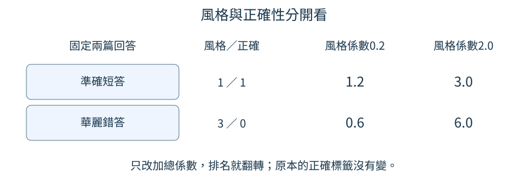
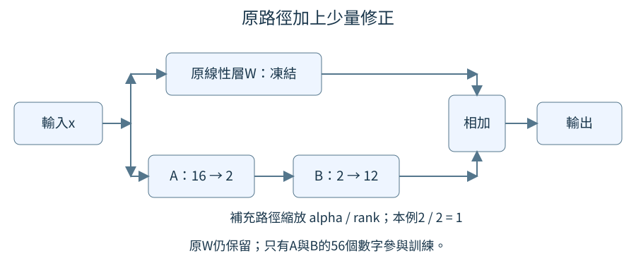

# 第 8 章：風格、個性與指令遵循

同一個答案可以直白，也可以有貼切的比喻；能讓人喜歡的寫法，還得保留正確內容與任務要求。本章先把「有個性」變成可觀察的行為，再分清提示控制、訓練資料與少量參數修正。最後檢查評分者，避免把排列位置或字數當成風格品質。若剛完成[7.11的對話微調](07.md#7.11)，可以把本章看作回答內容之外的下一個問題：我們想教它如何說，又怎麼知道它真的學到了？

## 8.1 「有靈性」如何觀察？

有人希望聊天助手「有靈性」，卻很難告訴訓練者什麼回答算成功。回答「2+2等於5，數字如星光流動」很有修辭，但不能因此教孩子錯誤算術。本節要把這種含糊期待變成兩個人能對照原文討論的觀察規則，而不是先替模型貼上一個個性名稱。

先備只需要[暖身的Python清單與字典](../first-steps.md#W.2)：清單放多筆例子，字典用名稱保存每筆資料。這裡先不訓練模型。把「回答有趣」拆成「事實答對」和「比喻幫助理解」，我們就能看見一個回答在哪裡好、在哪裡失敗。這種寫下判斷項目和標準的表，叫作評分規則，英文是 rubric。

例如「4」答對了，沒有使用比喻；「4，就像兩雙筷子共有四根」也答對，而且讀者能把兩組物件與加法接起來。第三個例子中的星光沒有說明如何得到答案，連數字也錯了。我們不把「出現漂亮詞語」當作「貼切」。另一位評分者若不同意第二例，應指出筷子與題目的哪個關係不成立，讓討論落到看得見的文字。

```python
examples = [
    {"回答": "4", "正確": True, "貼切比喻": False},
    {"回答": "4，就像兩雙筷子共有四根。", "正確": True, "貼切比喻": True},
    {"回答": "5，數字如星光流動。", "正確": False, "貼切比喻": False},
]
for row in examples:
    print(row["回答"], row["正確"], row["貼切比喻"])
```

輸入是三個人工編寫的回答與人工標籤，`True`表示這項通過，`False`表示未通過。迴圈每次取一個字典，`row["正確"]`讀出其中的判斷；程式不會自己看懂比喻。輸出依序是`4 True False`、筷子的回答加上`True True`、星光的回答加上`False False`。值得注意的是前兩例都正確，只有第二例通過我們的比喻標準；三例沒有被壓成一個模糊的總分。

有了規則，才知道該蒐集哪些回答、請標註者比較哪些差異。仍需要換一批題目確認：同一個筷子句套在天氣問題上，就不再貼切；能背下這句話不代表模型理解「生動但準確」的要求。本節建立的是可討論的目標，還沒有證明任何模型做到了它。

本章後面已把這個目標做成小型訓練比較：簡短版只寫數字，生動版固定加一句積木比喻，另有只回JSON的版本。JSON是一種用欄位名稱與值保存資料的文字格式；例如`{"answer": 4}`用`answer`這個名稱存放答案`4`，方便程式按固定格式讀取。這讓寫法能逐題核對，卻也把範圍說得很窄：生動分數只檢查那句固定比喻是否出現，不能當成機智、洞察或「有靈性」已被量到。尤其[8.4的實跑](#8.4)會看到，寫法完全符合時，算術仍可以錯。

練習把第二例改成「4，像一片深邃的海」，先判斷哪個標籤需要改，再修改字典、重跑。合理結果仍是正確`True`，貼切比喻變成`False`，因為海沒有幫助讀者理解兩組各兩個如何合成四個。若你提出另一個判斷，寫出比喻與加法的具體對應，再與同伴比較。

## 8.2 換 prompt 能改變什麼？

你平常請同一位同事解釋事情，可以說「先給結論」，也可以說「請用生活例子說明」。同事沒有換一個人，這次收到的要求卻不同。聊天模型也有這個區別：送進去的提示文字叫 prompt；模型內部已學到、儲存在數字中的規則叫權重。本節比較的是換提示，還沒有改動那些數字。

若忘了模型如何接著文字回答，先看[1.14逐步生成](01.md#1.14)。簡單回顧：模型看目前上下文，預測下一個文字片段，再把它接回上下文繼續。prompt是這份上下文的一部分，所以「用一句話」能影響之後的預測；但它不會把這次要求永久寫進權重。下次開一段新對話，若沒有再次給要求，也沒有其他設定，不能假定同一風格仍會出現。

要公平看提示的作用，可以固定問題為「2+2=?」，只把前面的風格要求改掉。不要第一回合問算術、第二回合問詩歌，然後把回答的差異全部歸功於提示。下列小程式建立一份比較計畫，不需要先下載或訓練模型。

```python
question = "2+2=?"
requests = ["用一句話回答", "用貼切比喻回答"]
for style in requests:
    prompt = style + "：" + question
    print(prompt)
print("兩次都使用同一份權重與同一個選字方式")
```

輸入`question`是一個固定字串，`requests`放兩種要求。關鍵行把`style`、冒號、題目接成新的字串。輸出前兩行分別是`用一句話回答：2+2=?`和`用貼切比喻回答：2+2=?`，第三行提醒實驗條件。這不是模型的回答，也不能從這兩行說模型已能遵循要求。它的用處是讓送入模型的文字差異清楚可見，避免比較時悄悄換了題目。

實際測試時還要固定選字方式。例如每一步都取最高分候選，稱為greedy，也就是貪婪選擇；若每次隨機抽候選，僅看一次的差異可能來自抽樣。隨機選字的概念可回看[1.15](01.md#1.15)。把同一份權重、同一個問題和同一種選字方式保持固定，才能較有把握把變化與提示聯繫起來。

提示控制也有能力邊界。模型若不懂「貼切比喻」或根本不會算這題，反覆換要求未必能補出這些能力。應將「有沒有答對」與「有沒有依要求寫」各記一欄，延續[8.1的分項判讀](08.md#8.1)。

後面的實跑也保留了真正「只換提示」的比較：先把同一模型訓練成可讀`style=concise`、`style=vivid`與`style=json`，評估時固定權重與最高分選字，只換同一道加法題前的style值。[8.4](#8.4)列出它的三種實際回答。這支持的是已教過這三種條件後的切換，不是隨便加一種新風格名字，模型就自動懂。

練習只把第二個要求改成「只回一個數字」，先預測第一行會不會變，再跑程式核對。第一行應完全相同，第二行只改前綴；這就是本節要控制的唯一變因。

## 8.3 權重能學到穩定風格嗎？

每次提問都加上「請用生活比喻」有些麻煩。我們能否把這種習慣教進模型，讓它在沒有特別提醒時也常用貼切的例子？這與[8.2的改提示](08.md#8.2)不同：提示只改這次上下文，訓練則會更新權重，改變往後的預測偏好。本節先解決最前面的事：什麼資料才能把風格教得清楚？

前置是[7.3只學回答位置](07.md#7.3)與[7.11對話微調](07.md#7.11)。回顧一下，有監督微調（SFT）把人寫好的回答當目標，讓模型在相同上下文下提高目標文字的機率。它不另裝一顆名叫「活潑」的旋鈕；活潑寫法會透過那些實際目標字詞進入訓練。問題內容若同時改變，就很難知道訓練後的差異來自文風還是新知識。

因此先準備兩套內容配對的回答。同一題「2+2=?」，簡短版寫「4」，生動版寫「4，就像兩雙筷子共有四根」。兩版的事實答案一致，但用字長短不同。這樣比較仍未完全消除所有差異，至少能避免用一套算術題與另一套故事題冒充風格對照。

```python
from tiny_perceptron.data import render_chat

question = "2+2=?"
answers = {"簡短": "4", "生動": "4，就像兩雙筷子共有四根。"}
for style, answer in answers.items():
    inputs, labels = render_chat(
        [
            {"role": "user", "content": question},
            {"role": "assistant", "content": answer},
        ]
    )
    print(style, "總位置", len(inputs), "學習位置", int((labels != -100).sum()))
```

輸入是兩筆相同提問、不同回答的對話。`render_chat`是專案工具，將角色與文字整理成數字序列；`inputs`是模型讀的全部位置，`labels`是各位置的訓練答案。值`-100`表示不計算這個位置的猜錯代價。`labels != -100`找出要學習的位置，`sum()`數它們有幾個，`int`讓印出的數量像一般整數。

在本工具預設的UTF-8位元組切詞中，短版輸出總位置`10`、學習位置`2`；生動版總位置`46`、學習位置`38`。UTF-8把中文字存成多個位元組，每個位元組在這裡是一步要預測的片段，因此38不等於可見字數；這個差別可回看[6.7](06.md#6.7)。學習位置不只數可見文字，還包含回答結束的標記，因此短版不是1。若切詞工具更新，具體數量可能跟著改；關鍵是長版要學更多位置。相同筆數或相同步數，不一定代表相同的文字訓練量，應把這個數量也記下來。

這段只在整理資料，沒有更新權重。真的訓練之後，要拿未出現在訓練裡的問題檢查是否也能答對且使用貼切比喻；背出筷子句不等於風格已能通用。

我們已另外從相同的49題加法模型各複製一份，保持問題沒有style前綴，分別用短答或固定積木句再更新450次。在未教過的`2+2=?`上，短答模型實際回`3`，生動模型回`3，像把兩組積木合在一起再數。`；問題相同、寫法確實不同，內容卻同樣錯。七題最後檢查中，兩支各有七題符合自己的固定寫法，數值都零題正確。這個基模本來也沒有答對這七題，不能把結果描述成原先會算、改文風才被破壞。

每支都更新450次、每批16題，累計有效答案卻是短答16,591個、生動318,991個。長版每筆都有大量固定文字，相同步數不是相同監督量；這次展示了寫法可進入權重，沒有隔離成等token成本的風格比較。[T.5](../training.md#T.5)提供重跑入口與各支權重。

練習將生動回答改成「4，共有四個」，先預測它的學習位置會增加還是減少，再執行核對。不要改題目或數字4，才能保持內容配對的目的。

## 8.4 能依情境切換風格嗎？

同一位老師教小朋友可以多舉例，幫同事查數字時則可以直接給結論。我們也希望一個模型根據要求切換，而不是只能永遠簡短或永遠多話。問題是：如果訓練資料恰好「算術全部短答、生活全部長答」，模型可能學到題材決定風格，而不是學到使用者的要求。

先讀[8.3風格如何進入訓練資料](08.md#8.3)。那裡讓相同問題有兩種內容一致的寫法；本節再把要求也放進輸入。這稱為條件式風格：條件就是模型當下看得見的「簡短」或「生動」字樣。它不是看不見的作者意圖，也不是資料檔外面一個模型無法讀到的欄位。

讓兩道算術題都同時出現在兩種風格下，讀者就能看出資料是否有必要的對照。這像教老師不要看到加法就自動省略解釋，而是先讀家長要求。下面採用人工規則產生四筆資料；規則只負責把例子寫齊，還不是神經模型已學會切換的證據。

```python
records = []
for question, fact in [("1+1=?", "2"), ("2+2=?", "4")]:
    for style in ["簡短", "生動"]:
        reply = fact if style == "簡短" else fact + "；把兩組物件合起來數就知道了。"
        records.append({"提問": f"風格={style}；{question}", "回答": reply})
print("筆數", len(records))
for row in records:
    print(row["提問"], "→", row["回答"])
```

輸入有兩對`question`與`fact`，分別保存題目與事實答案。外層迴圈換題目，內層迴圈換風格，因此每題會走兩次。`reply`那一行是條件判斷：簡短就直接用數字，其餘情況加一句解釋。`append`把新字典加入清單。輸出先印`筆數 4`，再印1+1的簡短與生動版、2+2的簡短與生動版；數字答案始終是2或4。

這四筆覆蓋了「兩題乘兩種風格」的組合。如果只留下第一題短答、第二題生動，題目和風格一起變，模型可能直接記住1+1要短答。要確認它讀了條件，測試時用未見過的3+3，分別要求兩種風格，核對事實都為6，而寫法隨要求改變。資料範例與成效測量是兩個不同步驟，這段程式完成前者。

還可以把同一題的兩種要求交替排列，避免資料前半全簡短、後半全生動，讓後面幾步訓練把前面的風格蓋過去。這個排列安排讓每一個要求都持續搭配相應目標。若使用者要求「簡短」卻得到長版，要先回查輸入是否真的保存了風格字樣，再判斷模型是否讀懂。

這次正式實驗另把短答、積木句與JSON都配在相同加法題上，再加上[8.6的日期題](#8.6)，讓同一份模型更新1,000次。JSON是一種保存資料的文字格式；例如回答文字`{"answer": 3}`有一個名為`answer`的欄位，值是整數`3`。下面固定`2+2=?`，只換它已受教的style條件。生成回答時，模型對下一個文字片段的各種候選給分，分數越高表示模型越偏向選它；每一步取最高分片段，接回上下文，再選下一個，逐步形成回答。右側計數用了全部七道最後檢查加法，各風格各測一次：

| 提示中的條件 | 這一題的實際新回答 | 寫法符合 | 加法數值正確 |
| --- | --- | ---: | ---: |
| `style=concise` | `3` | 7／7 | 0／7 |
| `style=vivid` | `3，像把兩組積木合在一起再數。` | 7／7 | 0／7 |
| `style=json` | `{"answer": 3}` | 7／7 | 0／7 |

短答只核對是否只含數字，生動版只核對固定積木句，JSON則先把回答文字讀成可檢查的資料，這一步叫解析；資料只能有`answer`這個欄位，而且它的值必須是整數。這些窄小規則讓結果可重查；三種寫法都符合，不代表它能自由創造貼切比喻。每種條件下的七題都生成了EOS，也就是回答結束標記，表示輸出在此停止；表格只顯示標記之前可見的回答文字。能結束回答，內容仍可以全部錯，所以這次展示的是條件式寫法，不是成功的加法器。[完整報告](https://github.com/birdhackor/tiny-perceptron-vlm/blob/main/docs/course-experiments/results/style.json)還保留另外八道驗證加法與全部日期題；沒有用這一題代替整批成績。

練習把`["簡短", "生動"]`改成只含`["簡短"]`，先預測筆數，再重跑。你會得到2筆，而且完全沒有「同一題改要求」的訓練對照。若恢復兩種風格後想加第三種，先替它寫清楚目標回答，不要只是增加一個名字，卻讓三個條件都指向同一句話。

## 8.5 有個性也能遵守限制嗎？

你要把模型的答案交給另一個程式處理，並要求「只回JSON，只有answer欄位」。模型回「當然！答案是：{\"answer\":4}」看起來友善，卻會讓接收端無法直接讀取。在這種情境，風格不能替代介面要求：讀者喜不喜歡語氣與程式能不能使用回答，需要分開驗收。

先備是[暖身Python字典與迴圈](../first-steps.md#W.2)，以及[8.1的分項規則](08.md#8.1)。JSON是一種以文字表示資料的格式，例如`{"answer":4}`表示名稱answer對應數字4。Python的`json.loads`能把符合格式的字串讀成字典；格式破損或前面多了散文時，它會報解析錯誤。我們捕捉這個錯誤，就能把失敗記成結果，而非讓整個實驗中斷。

這裡的題目始終是2+2，我們檢查兩件事：回答是否只有指定欄位，以及裡面的數字是否正確。假如能讀成字典但數字是5，格式通過仍不能交出正確答案。

```python
import json

answers = ['{"answer":4}', '答案是：{"answer":4}', '{"answer":5}']
for text in answers:
    try:
        value = json.loads(text)
        valid = isinstance(value, dict) and set(value) == {"answer"}
        correct = valid and value["answer"] == 4
    except json.JSONDecodeError:
        valid = correct = False
    print(text, "格式", valid, "內容", correct)
```

輸入是三個人工回答字串。`try:`表示先嘗試執行它下面縮排的幾行；若其中遇到`JSONDecodeError`這種解析錯誤，就跳到配對的`except`區塊，把兩個結果都記為`False`。沒有解析錯誤時則完成`try`內的檢查，不執行`except`。兩種情況最後都繼續執行`print`，再處理下一個回答。

`isinstance(value, dict)`檢查讀到的是字典。`set`會建立集合，也就是只保存不同元素、不計順序的一組資料；`set(value)`在這裡把字典所有欄位名稱收成集合。`{"answer"}`沒有冒號與值，是只含answer的集合，不是字典。兩個集合相等代表欄位沒有缺少或多出。`and`要求字典類型與欄位兩項都成立，後面的內容檢查還要求值為4。

輸出第一筆`格式 True 內容 True`，第二筆`False False`，第三筆`True False`。第二筆的數字看似答對，但不符合「只回JSON」的完整要求；第三筆恰好相反。這個差異能告訴我們要補格式示例還是補算術示例，而一個總分很可能把它們混在一起。

能被程式明確判斷的限制，應優先用這類檢查。這不是要程式猜文筆好壞，也不是證明模型永遠遵循指令；這三筆都是固定示例。真正生成後，仍要逐筆把回答送進同一檢查。若任務另外限制字數，就再定義怎麼算字數，而不是憑「看起來短」評分。

第二筆的問題不在JSON裡面的4，而在整份回答前面多出「答案是」。接收程式期待從第一個字元就開始讀資料，不能先替模型猜哪些字要丟掉，否則文字規則又變模糊。第三筆則說明讀取成功之後還有下一層責任：驗證值是否符合題目。同一個檢查能回報兩種失敗，所以修資料時可以精準定位，不必把每次失敗都叫作「不聽話」。

上一節的模型把這個反例真的生成了：七道最後檢查的JSON都可解析、欄位與整數類型也正確，但其中的加法數值都錯。程式能讀取回答，只是第一道門；有明確真值的任務還要按題目驗證值。這也解釋為什麼訓練與評估要保留分項，不能只說「JSON成功率很高」。

練習把第一筆改成`{"answer":4,"note":"完成"}`。先預測解析會成功但格式規則會失敗，再重跑核對`False False`。多出的note即使有用，也違反這個任務的指定欄位要求。若你希望接受note，應明確修改要求與檢查規則，不能在看到答案後悄悄放寬標準。

## 8.6 遇到模糊指令怎麼辦？

使用者說「幫我安排會議」，卻沒有告訴你哪一天。直接說「已安排明天」可能做錯；反過來，每次都問十個問題也會拖慢本來很簡單的事。本節要找的是會改變下一步的必要資訊，缺少它才澄清。這與[8.5的遵循明確限制](08.md#8.5)接續：限制明確就照做，關鍵條件模糊就先把問題縮小。

先備是[暖身的Python字典與迴圈](../first-steps.md#W.2)。這裡不用真行事曆，也不發出會議邀請，只設計一個小世界：任務僅為「確認日期」。在這個範圍中，日期是必要欄位，沒日期不能完成；有日期就不該重複追問。若任務變成真的訂會議，時間和參與者也可能變成必要欄位，必須另外定義。

```python
requests = [
    {"task": "確認日期", "date": None},
    {"task": "確認日期", "date": "2026-10-03"},
]
for request in requests:
    if request["date"] is None:
        target = "你希望哪一天？"
    else:
        target = "已確認日期：" + request["date"]
    print(request, "→", target)
```

輸入兩個字典的任務相同，只有日期不同。`None`是Python用來表示這裡沒有值的符號，不是日期字串。關鍵判斷`is None`檢查是否缺日期。`if`在判斷成立時執行它下面縮排的目標句；`else`在判斷不成立時才執行另一句。因此缺日期時設定一個只問日期的目標回答，否則把日期接在確認句後，兩種分支最後都會到`print`。輸出第一筆對應「你希望哪一天？」，第二筆對應「已確認日期：2026-10-03」。注意第二筆沒有再問使用者是哪一天。

這段是一個人寫好的標註規則：我們知道小世界的必要欄位，所以能產生理想回答，後續可把它做成對話訓練資料。它不是模型自主辨識模糊指令的展示。若把規則輸出當成模型能力，就省略了模型是否真的從新措辭讀出日期、是否能分清必要與可預設條件的重要測試。

不同任務的必要資訊不同。「把2+2算出來」不需要先問喜歡什麼語氣；「選適合你的交通方案」可能需要目的地。可以合理預設的細節應說明預設，例如使用普通書面語；會讓結果不可用的缺項則應問。訓練資料要同時包含缺資訊而澄清、資訊足夠而直接完成的正例，否則模型可能把「勤問問題」誤學成永遠不動手。

這種成對日期題也加入了[8.4的同一份模型](#8.4)。24個日期各有「日期已給」與「日期缺少」兩題，先把同日期的兩題視為一組，再把不同日期組分給三種用途：19個日期、38題用來更新模型；2個日期、4題用來觀察學習中的表現，叫驗證資料；另外3個日期、6題留到最後檢查，不拿來更新模型。兩題一起分配，避免模型在學習時見過某日期，最後卻又拿同日期的另一題當新題。缺日期題在資料表中仍保留所屬日期的分組標記，但輸入的`date`欄位用`?`代替實際日期，另帶題目編號`id`，不是把分組日期直接告訴模型。

最後檢查的三個日期都未用於訓練，因此是在核對模型能否處理新日期。缺日期的三題都生成`請提供日期。`；但日期已給的三題全確認錯了。例如`task=date;date=2026-10-01;confirm`得到`已確認2026-10-10。`。所以3／6的總分包含兩種很不同的結果：模型學到了固定澄清句，還不能可靠保留新日期。這不是已能安排會議，也沒有測試任意自然語句的缺資訊判斷；它讓我們知道下一步要補哪種能力。

練習讓小世界改為「確認會議日期與時間」：替兩筆字典加`time`，第一筆用`None`、第二筆用`"10:00"`。先在紙上寫出四種日期/時間有無的情況要問什麼，再修改條件判斷。核對時，兩項都齊就確認，缺哪項才問哪項；不要把缺時間的任務仍當成完成安排。

## 8.7 文筆更活潑等於洞察更深嗎？

兩個助手回答2+2：一個只寫4，另一個寫了一大段漂亮文字卻說5。如果評分只偏愛活潑，第二個可能勝出；但對要查算術的使用者，這次更新讓功能變差了。本節的問題是：如何報告文風改善，同時讓讀者看見內容是否受損？

前置是[8.1把風格拆成可觀察項目](08.md#8.1)。回顧那裡的做法，答對與比喻貼切各有一個標籤，不必被迫合成一個數字。本節進一步示範：即使你硬算總分，風格與正確性的權重也會改變排序。權重在這裡指評分項目乘上的重要程度，不是模型裡可訓練的數字；相同詞在不同場合的角色要分清楚。

```python
answers = [
    {"名稱": "準確短答", "風格": 1, "正確": 1},
    {"名稱": "華麗錯答", "風格": 3, "正確": 0},
]
for style_weight in [0.2, 2.0]:
    print("風格權重", style_weight)
    for row in answers:
        total = style_weight * row["風格"] + row["正確"]
        print(row["名稱"], "分項", row["風格"], row["正確"], "總分", round(total, 1))
```

輸入是人工設計的兩筆分數，風格1到3在這個例子代表越大越活潑，正確1表示答對、0表示答錯。這不是宣稱真實評分者認為每篇華麗文章都得3分。外層迴圈只換總分中風格的係數，內層把同兩筆分數重新計算。`round(total, 1)`把輸出四捨五入到一位小數，方便對照。

係數0.2時，準確短答得1.2，華麗錯答得0.6，前者勝出；係數2.0時，分數變成3.0與6.0，後者勝出。回答內容完全沒有改變，改的只是我們決定如何加總。

圖中每列是一份固定回答，中間保留風格與正確分項；右邊兩欄只是改加總係數，1.2與0.6變成3.0與6.0。排名翻轉時，「華麗錯答」的正確分仍是0，這正是只看總分會漏掉的事。



這說明總分排名不是自動浮現的「真實品質」，它包含評分者對取捨的選擇。若只報最後的6.0，看結果的人甚至不知道答案是錯的。

正式比較兩個模型時，應保持同一批問題，並排顯示正確率、任務完成率與風格判讀，說明每項有幾筆測試。任務完成率是符合完整要求的比例，例如[8.5](08.md#8.5)中算對還要格式正確。一小批題的風格平均提高，可以是值得研究的訊號，但不能單憑它說模型洞察更深；洞察是否有用，要回到它是否提供可查證、能解決問題的新角度。

實跑也提醒我們，連loss都會被答案組成影響。這裡報告的loss是各個有效學習位置的猜錯代價加總後，再除以位置數的平均值；「有效目標」就是[8.3](#8.3)中`labels`不等於`-100`、要計入學習的文字片段位置，也包括回答結束標記。8.3的預設短答模型在七題最後檢查的平均代價為8.41357，固定積木句版本則只有0.26805；但是兩者數值都沒有答對。短答七題合計14個有效位置，長版合計308個，所以兩個平均數的分母不同。長版的固定句中，許多位置已容易猜對，這些較小的代價也一起加入平均，可能把平均值壓低，即使真正的算術答案仍錯。不能拿較小的平均數就說算術更好，或把固定句的七次出現升格成洞察更深。要量「有助理解」，還得換題材、讀實際比喻並核對其關係，而不是只數關鍵字。

練習把風格係數設為0.5，先手算兩筆都為1.5，再執行核對。這個平手沒有讓錯答變正確。試著不用總分，用兩句話描述兩個回答各自的長處與失敗，就能看見並排報告為什麼更容易被理解與質疑。

## 8.8 只更新少量參數能改風格嗎？

想替模型增加一種寫法，未必有足夠記憶體重新訓練所有數字。像替一張原本可用的食譜加上少量調味註記，我們可以保留原有變換，只訓練一條補充路徑。本節介紹LoRA：Low-Rank Adaptation，意思是用低秩的矩陣修正來適應新任務。它節省的是需要訓練的參數量，能否學到目標風格仍要拿資料驗證。

前置是[W.5矩陣與加權配方](../first-steps.md#W.5)、[W.6梯度](../first-steps.md#W.6)與[8.3風格訓練目標](08.md#8.3)。線性層用一個矩陣W把16個輸入數字轉成12個輸出數字，原矩陣有16×12=192個權重。LoRA另外放A與B：A先把16個數壓到2個，B再從2個轉到12個。中間寬度2叫rank，這條路徑因此只需要2×16+12×2=56個數字。

原W被凍結，表示訓練不更新它；A、B則可以更新。補充矩陣寫成ΔW=(alpha/rank)BA，Δ表示「改變量」。alpha是縮放設定，本例alpha=rank=2，所以倍率是1。原本輸出與補充輸出相加，才得到最後結果；把所有192個原權重丟掉並不能重建這個模型。

下圖讓輸入分成兩條路：上路通過凍結的W，下路先經A壓到2維、再經B轉成12維，兩路在「相加」處合流。它不是先做W再做A、B；圖中的56說的是補充路徑參數量，原路徑仍存在。



```python
import torch
from torch import nn
from tiny_perceptron.alignment import LoRALinear

torch.manual_seed(0)
layer = LoRALinear(nn.Linear(16, 12), rank=2, alpha=2)
x = torch.randn(3, 16)
print("可訓練參數", sum(p.numel() for p in layer.parameters() if p.requires_grad))
print("初始相同", torch.equal(layer(x), layer.base(x)))
layer(x).sum().backward()
print("A梯度為零", layer.a.grad.abs().max().item() == 0)
print("B梯度非零", layer.b.grad.abs().max().item() > 0)
```

輸入`x`是3筆、每筆16個數字的測試資料，固定亂數種子讓它能重現。專案的`LoRALinear`包住普通線性層；`base`就是保留的原層。`numel()`數參數元素，`requires_grad`篩出可訓練部分，所以第一行是56。`torch.equal`逐項比較初始輸出，會印`True`：B初始化全0，補充路徑此時完全沒有影響。

`sum().backward()`不是風格訓練，只是用輸出加總建立一個能查梯度的短測試。反向計算後，`layer.a.grad`保存A每個數字的梯度，也就是輸出加總對它的敏感程度；B同理。`abs()`先取絕對值，使負梯度也變成正的大小；`max()`找其中最大大小，`item()`再取出這個單一數字。因此最大大小等於0才代表全部為零，大於0則代表至少一項非零。

後兩行都是`True`。第一次A梯度為零，是因為A的影響要經過仍為零的B；B本身則已有非零梯度，更新之後A才可能開始收到訊號。這個初始現象不代表訓練壞掉。

把這條補充路徑放進完整模型後，我們也真的訓練了兩套adapter，也就是各自為某種寫法訓練的一組A、B修正參數。起點是[8.3的加法基模](#8.3)，最後七道新題原本就零題答對。兩套各讀相同的49道訓練題，一套學短答、一套學固定積木句，各更新450次；模型兩層的Query、Value、注意力輸出、前饋兩個線性層，以及最後輸出層，共11處加上rank 4、alpha 4的修正。

這些插入位置都是像前面W一樣的線性變換。Query把當前內容轉成「想找什麼」的特徵，Value把各位置內容轉成「取回什麼」的特徵，分別可回看[3.3的查詢](03.md#3.3)與[3.4的取回內容](03.md#3.4)；注意力輸出再混合取回的結果。[4.4的前饋層](04.md#4.4)對每個位置先擴展、再收回特徵，而[最後輸出層](04.md#4.6)把特徵轉成下一個文字片段的候選分數。每層有五處，兩層共十處，再加最後輸出層便是十一處。原本141,568個參數全部凍結，只更新9,504個新參數，約為原模型參數量的6.7%。第一步也出現上述A梯度全零、B已有非零梯度的現象，訓練前後的原模型數字則完全相同。

少更新數字，是否仍能學到寫法？我們再從同一起點完整更新全部參數，使用與比喻adapter相同的資料、450步和318,991個有效回答目標，作為對照。以下都看沒有放進訓練的題目；「風格符合」只檢查短答是否為數字，或回答是否含本次指定的積木句。

| 更新方式 | 可訓練參數 | 八題驗證的風格符合 | 七題最後檢查的風格符合 | 七題算術答對 |
| --- | ---: | ---: | ---: | ---: |
| LoRA短答 | 9,504 | 8／8 | 7／7 | 0／7 |
| LoRA固定比喻 | 9,504 | 5／8 | 6／7 | 0／7 |
| 全部參數學固定比喻 | 141,568 | 8／8 | 7／7 | 0／7 |

全部回答都有EOS，也就是回答結束標記，表示模型有生成停止訊號。能停下來，不保證答案正確或中間文字都能正常顯示；比喻adapter仍有一題生成`1�，像�兩組積木合在一起再數。`，其中`�`代替無法正常顯示的文字，這一題未通過固定句檢查。這次LoRA用較少更新參數學到了部分寫法，效果沒有完全追上完整微調；兩種方式也都沒有補上新加法的正確性。基模、前向計算與中間資料仍要留在記憶體，6.7%不等於整個訓練只花6.7%的記憶體，更不是模型總大小變成6.7%。[完整生成與比較報告](https://github.com/birdhackor/tiny-perceptron-vlm/blob/main/docs/course-experiments/results/lora.json)保留這些失敗，不把較少參數直接換算成同等能力。

所謂低秩，是修正先經過只有2個數字的窄通道，能自由表達的方向受到限制。它像只準用兩種基本調味組合修食譜，未必能模仿任意複雜改動，卻可能足以完成某些風格變化。把rank加大會放寬這個限制，也增加訓練數量；是否值得應看保留題成績，而不是認為數字越少或越多就必然較好。此處原線性層還有12個偏置數字，也一起凍結；192指的是權重矩陣，沒有把偏置算進去。

練習只把rank改成4、alpha也改成4以維持倍率1，先算4×(16+12)=112，再跑程式核對。比較參數數量時，不要把原模型的總大小也誤說成減半。

## 8.9 同一個基模能切換不同風格版本嗎？

你有同一份文章底稿和兩套編輯註記：一套改得簡短，一套增加例子。要回到簡短版，就應套用整套簡短註記，而不是保留上次一半修改再補另一半。LoRA也有相同問題：同一個基礎模型可以搭配不同修正，但切換時必須知道換的是完整哪一組。

先看[8.8的A、B修正路徑](08.md#8.8)。回顧一下，基模保留原矩陣W，adapter（適配器）保存補充路徑的A與B及其設定。有效矩陣是W加上指定adapter的ΔW。本節不用已訓練風格，而是手設兩組不同數字，先驗證切換有沒有正確；數字能換回，不代表它們已經具有文風。

```python
import torch
from torch import nn
from tiny_perceptron.alignment import LoRALinear

torch.manual_seed(0)
layer = LoRALinear(nn.Linear(4, 3), rank=2, alpha=2)
with torch.no_grad():
    layer.b.fill_(0.1)
    adapter_a = {"a": layer.a.clone(), "b": layer.b.clone()}
    layer.a.fill_(0.2)
    layer.b.fill_(-0.1)
    adapter_b = {"a": layer.a.clone(), "b": layer.b.clone()}
    layer.a.copy_(adapter_a["a"])
    layer.b.copy_(adapter_a["b"])
print("切回A的B平均", round(layer.b.mean().item(), 2))
print("A兩個矩陣都恢復", torch.equal(layer.a, adapter_a["a"]) and torch.equal(layer.b, adapter_a["b"]))
```

輸入是一個4進3出的線性層，rank為2。`no_grad`讓這段手動設定不被記成訓練計算；`fill_`將矩陣每個元素設成指定數字。`clone()`複製當下內容，否則只是拿同一份可變數字作參照，後面再修改時容易連「備份」一起改了。第一組B全為0.1；第二組A改為0.2，B全為-0.1，確保兩組真的不同。

兩個`copy_`是完整切回的關鍵：分別恢復A與B。輸出第一行平均0.1，第二行`True`，表示逐元素比對都相同。這不是把A的ΔW和B的ΔW相加，也不是訓練了第三種混合風格。手動資料存在記憶體中，程式沒有寫出權重檔；實際保存時也需把兩個矩陣一起存下。

除了數字，還要記錄基模版本、要套用的層名、rank、alpha及縮放公式。同樣的形狀只能說矩陣算得過去，不能保證同一個修正對另一版本的基模有原本意義。例如原基模已改變某個特徵的解讀方式，舊adapter修正的位置也可能不再恰當。

切換還需要恢復縮放設定。例如A、B完全相同，但上次alpha為4，這次訓練時為2，若只載矩陣不恢復alpha，就會把修正放大兩倍。這像拿了正確食譜卻用錯量匙。程式的兩組設定刻意相同，所以只示範矩陣備份與替換；正式檔案需把設定一併保存。也應先核對每個層名都有對應矩陣，漏一層不能只因其他層成功載入就說完整切換。遇到不相容版本，應明確報出差異，讓使用者知道現在套的是哪份基模與註記。

上一節兩套真訓練的adapter也做了「短答→比喻→短答」檢查。在同一個`1+1=?`對話前文上，比較所有位置的候選分數，切回短答前後的最大差為0；短答與比喻版的分數本身則確實不同。這確認了這一次整套切換能恢復，並沒有測到模型對所有新題都有好文風。

若不需要繼續切換，也能把指定修正合進原矩陣，另存一份完整模型：W變成W＋ΔW，推論時就不用再載那套adapter。在同一前文上，比喻adapter與合併模型的候選分數最大差約0.00000668，落在這次設定的0.0001容許值內；浮點計算改了加總順序，通常不保證逐位完全相等。合併檔已含修正，不能再把同一adapter加上一次。實際載入與合併檔的用法見[T.5](../training.md#T.5)。

練習刪掉恢復A的那一行，先預測B平均仍是0.1，但「兩個矩陣都恢復」會變`False`，再執行核對。只看B平均，會漏掉一半切換錯誤。

## 8.10 評分者真的分得出目標風格嗎？

如果一位評分者把所有文章都稱讚得很好，他的平均分很高，卻無法幫我們選出真正符合要求的文章。自動評分也可能有這個問題。把大量回答交給裁判之前，應先給它一小組我們能說清楚好壞的例子，看看它是否在同一項標準上作出相同判斷。

前置是[8.1的評分規則](08.md#8.1)與[W.3的tensor與平均](../first-steps.md#W.3)，逐項比較會在本節介紹。我們沿用8.1的兩項判斷，再明定本次的單一規則：回答必須算對，而且生活比喻能說清兩組各兩個合起來是四個，才記通過1；任一項不符合就記0。長度本身不決定標籤。

四筆都問「用生活比喻解釋2+2」。下表保留原回答與索引，索引從0開始；讀到分歧位置後，就能回到同一筆內容，而非只看評分數字。

| 索引 | 原回答 | 人工標籤與理由 |
| --- | --- | --- |
| 0 | 4，就像兩雙筷子共有四根。 | 1：數字正確，兩雙各兩根對上兩組各兩個 |
| 1 | 5，數字如星光流動。 | 0：數字錯誤，星光也沒有解釋如何合併兩組 |
| 2 | 4，兩盤各有兩顆蘋果，放在一起就有四顆。 | 1：數字正確，兩盤與每盤兩顆提供可核對的對應 |
| 3 | 4。4。4。4。 | 0：數字正確，但重複答案沒有提供所要求的生活比喻 |

人工因此標成1、0、1、0。本節自動裁判只是預錄結果，卻把索引1也判成1；我們需要把這個分歧找出來回讀，程式不會自行理解表中回答。

```python
import torch

human = torch.tensor([1, 0, 1, 0])
recorded_judge = torch.tensor([1, 1, 1, 0])
agree = human == recorded_judge
print("一致比例", agree.float().mean().item())
print("分歧索引", (~agree).nonzero().flatten().tolist())
```

兩個輸入tensor的每個位置都代表同一個例子，不能把不同順序的評分直接比較。`==`逐項得到`[True, False, True, True]`。`float()`把一致的`True`與分歧的`False`變成1.0與0.0，取平均就得到3/4；`item()`取出單一數字。索引3的回答兩方都判0，雖然都認為不通過，仍是一次一致，因此也貢獻1.0。輸出`一致比例 0.75`，也就是四筆中三筆一致，並不是四筆中三筆好回答。

`~agree`把布林值反轉，這裡只剩第二個位置為`True`。`nonzero()`找它的位置，`flatten()`攤成一排，`tolist()`轉成一般Python清單，所以輸出`分歧索引 [1]`。索引從0開始，因此1指第二例，不是第一例。這個位置資訊比只看0.75更有用：你可以回到那篇華麗錯答，判斷裁判是否把流暢當作正確。

一致比例英文常稱agreement。它不是裁判絕對正確的機率，因為人工標籤也可能有錯，而且這四筆刻意簡化，不能代表所有題材。分歧時要保留原問題、原回答與各評分理由，討論哪個標準不夠清楚；若規則模糊，先改規則與校準例，再重新評，而不是預設機器一定錯或人工一定對。

一致比例高也可能來自資料太容易。若四筆全部是明顯正例，總給1的裁判就會全對，仍無法辨別缺點。校準組應包含貼切與不貼切的比喻、準確與錯誤的內容，還要保留兩者容易混淆的邊界例。第二筆分歧正好是一個提醒：華麗程度與算對不同。讀到索引1後要打開原回答討論，而不是只把自動分數改0、讓報表看起來完美。

練習只把預錄裁判的第二個數字從1改成0。先預測一致比例變1.0、分歧清單變空，再跑程式核對。這表示在這四筆上與人工一致，仍不表示往後每題都能可靠判斷。接著仍用「用生活比喻解釋2+2」這題，另寫一個較長回答，例如「4。左盤放兩顆蘋果，右盤也放兩顆，倒到同一盤後數出四顆」。請另一位讀者各自核對數字是否正確、兩組各兩個與合併是否對應，再按同一規則記1或0。這個例子應記1，理由是提供可追蹤的分組與合併；若只是把4重複更多次，仍應記0，新增字數不等於新增解釋。

## 8.11 裁判會因答案排列而改判嗎？

把兩份作業放桌上，評分者不論內容都選左邊，那麼只要交換位置，勝者就變了。比較模型回答時，畫面上的A、B也可能產生這種偏差。要測它，不能只看兩次都選A就說「判斷穩定」，因為第二次的A可能已是另一個回答。

前置是[8.10以已知例子核對裁判](08.md#8.10)與[W.2清單索引](../first-steps.md#W.2)。本節要區分回答的身分與顯示位置。回答0是「2+2=4」，回答1是「2+2=5」。位置A只是這次先呈現的選項，交換之後不再代表同一份內容。判斷是否一致，應把選擇轉回原回答的身分。

```python
answers = {"correct": "2+2=4", "wrong": "2+2=5"}
original_order = ["correct", "wrong"]
swapped_order = original_order[::-1]


def choose_first(order):
    return order[0]


first = choose_first(original_order)
second = choose_first(swapped_order)
print("原順序選", first, answers[first])
print("交換後選", second, answers[second])
print("內容身分一致", first == second)
```

輸入字典給兩份回答不會隨排序改變的名稱；兩個清單則表示畫面順序。`[::-1]`把清單反轉，所以原順序是correct、wrong，交換順序是wrong、correct。函式`choose_first`故意寫成永遠選第一個，模擬一個有位置偏差的裁判，並沒有讀內容判斷算術。

第一行輸出`原順序選 correct 2+2=4`，第二行是`交換後選 wrong 2+2=5`，第三行`False`。兩次都選畫面A，但得到不同內容。若只記字母A而沒有記那次A對應哪個回答，你會把這個失敗誤看成一致。實測應保存每次提示與排列，再把結果映射到同一份回答。

這個小實驗沒有呼叫外部評分服務，也沒有證明任何實際裁判一定有偏差；它讓我們知道該如何找到偏差。更完整的測試會對很多對答案交換順序，統計映射後一致的比例。若裁判允許平手，也要事先決定如何記錄，不能事後把平手只算到有利的一邊。

假如第一次畫面A是正確短答、第二次畫面B才是同一正確短答，兩次合理選擇的字母就應不同。這和「回答身分一致」完全不矛盾。收集結果時可以記兩欄：顯示位置以及原回答ID；ID只是辨識這一份內容的名稱，像程式裡的correct與wrong。交換實驗還要保持評分規則和問題原文不變，否則你一次改了多個條件，位置就不再是唯一可追查的原因。

練習把函式內容改成`return "correct"`，先預測原順序與交換後都會選正確回答，第三行為`True`，再執行核對。這個函式同樣是手寫理想規則，並非能理解新答案的裁判。它的作用是對照：好的內容判斷應保持回答身分一致，即使畫面位置改變。往後你用模型評分時，也可以沿用這個交換順序的檢查。

## 8.12 裁判只是喜歡長答案嗎？

一個回答清楚地說「答案是4」，另一個把同一句重複十遍。如果後者總是勝出，裁判可能把長度當成品質。較長的答案有時確實提供更多資訊，但「增加新資訊」與「增加字數」不是同一件事。本節用內容相同的短長對照，先把這個差別單獨拿出來看。

先看[8.10裁判校準](08.md#8.10)和[8.7分項評分](08.md#8.7)。我們要測的項目是「長度偏差」，也就是評分不合理地受文字量影響。相同事實寫短或重複寫長，可以排除一部分內容差異；如果一邊同時多了重要解釋，就不能把勝出直接歸因於長度。

```python
short = "答案是4。"
long = short * 10
candidates = [short, long]
lengths = [len(text) for text in candidates]
chosen = max(candidates, key=len)
print("字元數", lengths)
print("長度裁判選長版", chosen == long)
print("不同句子數", len(set(long.split("。")[:-1])))
```

輸入只有一個短句，`* 10`在Python字串上表示重複十次，因此長版沒有新事實。`len`數字元，短版是5、長版50。這裡不把字元數說成模型的token數：切詞方式不同，一個中文字可能分成多個片段，詳見[6.7](06.md#6.7)。

`max(..., key=len)`用長度選最大者，是我們刻意設定的故障裁判。第二行印`True`，它一定選長版。最後一行先用句號切開長版，去掉句尾產生的空字串，再用`set`去除重複，結果`不同句子數 1`。這個粗略計數讓我們看見：50個字元只有一種句子，增加的45個字元沒有增加資訊。

正式風格評分不能直接用這個函式。可先讓裁判比較這組內容控制例，再比較真正加了有用說明的長版，例如「答案是4；兩組各兩個物件合起來共有四個。」。前者測是否盲目偏愛長度，後者測是否能認出長度帶來的資訊價值。兩者都需要回讀內容，字數本身無法保證解釋有用或算術正確。

這裡的「不同句子數」也只適用於我們刻意重複同句的例子。換一個逗號就會讓兩段字串不同，卻未必真的多了新資訊；兩種不同說法也可能解釋同一事實。因此它是幫助讀者看重複的簡單觀察，不能升級成普遍的洞察分數。若正式裁判偏愛長版，應回查它是不是認出新增內容、或只是依篇幅作判斷，再用別的題材重複對照。

練習把重複次數10改成2，先預測字元數變成`[5, 10]`，長度裁判仍選長版，不同句子數仍是1，再執行核對。然後把長版那行直接改成`long = "答案是4；兩組各兩個物件合起來共有四個。"`，預測不同句子數仍為1，再重跑。末尾句號要保留，因為本例的`[:-1]`假設最後一項是句末分割出的空字串；缺句號就會錯刪唯一文字段。試著按[8.1](08.md#8.1)的標準判斷新句子是否幫助理解。這次即使你偏好長版，也應說出新增了分組與合併的解釋，而不只是「文字更多」。

## 8.13 同名 LoRA 參數代表同樣更新幅度嗎？

你把另一份教學中的rank與alpha照抄過來，結果修正幅度卻不同。原因可能不是模型壞了，而是工具對同名設定用了不同公式。像「一杯糖」若兩份食譜的杯子大小不同，名稱相同也不能直接換用。本節把本專案的縮放寫明，再用數字核對。

前置是[8.8的LoRA矩陣修正](08.md#8.8)。這裡的ΔW=(alpha/rank)BA：A、B是訓練的兩個矩陣，rank是中間寬度，alpha是使用者設定的縮放常數。固定A、B與rank時，alpha從2變4，前面的倍率從1變2，整個修正就加倍。注意只有修正加倍，原始矩陣W沒有加倍。

```python
import torch
from torch import nn
from tiny_perceptron.alignment import LoRALinear

torch.manual_seed(0)
layer = LoRALinear(nn.Linear(4, 3), rank=2, alpha=2)
with torch.no_grad():
    layer.b.fill_(1.0)
delta1 = layer.merged_weight() - layer.base.weight
layer.alpha = 4
delta2 = layer.merged_weight() - layer.base.weight
print("加倍誤差", (delta2 - 2 * delta1).abs().max().item())
print("符合兩倍", torch.allclose(delta2, 2 * delta1, atol=1e-6, rtol=0))
```

輸入是一個4進3出的LoRA層。B初始是0，所以先把它設成1，才能看到非零修正。`merged_weight()`按公式把原W與修正相加；再減`base.weight`留下ΔW。第二次只有alpha改變，A、B與原W都保持固定，確保測到的是同一組數字的縮放效果。

`delta2 - 2 * delta1`比較實際第二次修正與第一次數值的兩倍，`abs().max()`找最大的絕對差。由於電腦的小數有有限精度，輸出通常是0附近的小數，不要求逐位恰好0。`allclose`檢查每項是否足夠接近；這裡`atol=1e-6`允許最多百萬分之一的絕對誤差，`rtol=0`則關閉隨數值大小增加的額外容許量。第二行應為`True`。這個結果驗證了本專案的alpha/rank公式，而不是所有LoRA工具都採用它的證明。

若只把rank從2改4、alpha仍為2，倍率會由1變0.5；但rank變了也會改變A、B形狀，所以不能據此斷言最終ΔW一定減半。只有先固定同一個BA，才能將變化單獨歸給倍率。另一種常見設定用alpha除以rank的平方根；同樣2、4等數字放進去會得到不同倍率。保存adapter時必須連公式與層名稱、基模版本一起記錄，延續[8.9](08.md#8.9)的完整切換原則。

[8.8的實際訓練](#8.8)固定採用alpha/rank，rank與alpha都是4，因此倍率為1。檔案也明列這個公式，載入工具會先核對它與原模型的數字指紋。這一組沒有訓練不同rank或另一種縮放公式，不能用其成績選出最佳rank，更不能把同名參數直接移到另一套公式後稱為相同實驗。

例如某個BA的元素為0.3，rank2、alpha2時，這個元素的修正為1×0.3=0.3；alpha4時是0.6。原W若在該格為0.7，有效值就從1.0變1.3，而不是把整個1.0乘2變2.0。這個單格計算能幫你讀懂為什麼程式先扣原W再比較：我們要核對的是補充改變量。若不扣原W，兩份完整矩陣不會呈現兩倍關係，可能讓人誤以為縮放失效。

練習只把第二次alpha改成6，先預測ΔW應是第一次數值的3倍，再把兩處`2 * delta1`改成`3 * delta1`執行核對。你改變的是已定義的縮放，不是新訓練出的風格；相同rank、alpha而A、B不同的兩個adapter，仍可能產生完全不同的回答。
