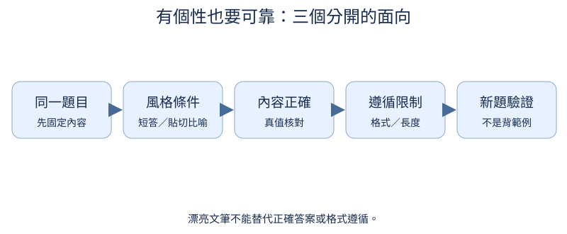
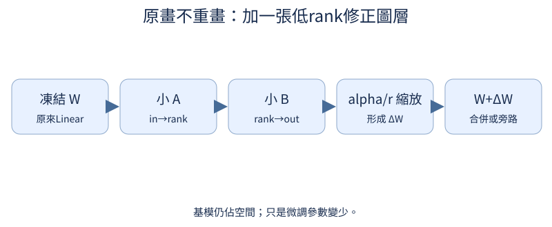

# 第 8 章：風格、個性與指令遵循

前置：第7章SFT。把風格與內容分開想：想像同一位老師可以說得生動，也可以精準遵循格式。本章先用人工編寫、內容固定的短回答校準目標；LoRA是後半支線。

## 8.1 「有靈性」如何觀察？

**先想一想：**一篇很漂亮但把2+2說成5的回答應該拿高總分嗎？



「有靈性」不是單一物理量。先拆成能被兩個人討論的準則：比喻是否貼切、是否提供有用角度、是否仍然答對。每項給正例與反例，避免只比文長。

**把直覺寫成數學：**rubric是評分規則，不是新的loss公式；先把抽象偏好變成標註資料。

**最小實驗：**以下程式只處理這節的問題。

```python
examples = [
    {"answer": "4", "正確": True, "貼切比喻": False},
    {"answer": "4，就像兩雙筷子共有四根。", "正確": True, "貼切比喻": True},
    {"answer": "答案是5，數字如星光流動。", "正確": False, "貼切比喻": False},
]
for row in examples:
    print(row)
```

**如何讀結果：**例子是人工設計，不是模型生成。先確認比喻不引入事實錯誤，再用新題檢查風格泛化。

**只改一件事：**只把第二例改成不相關的比喻，重評同一rubric。

## 8.2 換 prompt 能改變什麼？

**先想一想：**同樣權重兩個prompt，叫兩個trained model嗎？

prompt是這次的條件，不會永久改權重。若基模理解風格指令，改prompt就可能有用；若基模尚未學會，換措辭不會憑空給它能力。

**把直覺寫成數學：**p(answer|question,style,weights)；改style和改weights是兩個不同變因。

**最小實驗：**以下程式只處理這節的問題。

```python
prompts = ["用簡短語氣回答：2+2=?", "用貼切比喻回答：2+2=?"]
print(*prompts, sep="\n")
print("固定checkpoint、greedy、相同問題，再比較風格與正確性")
```

**如何讀結果：**讀者以scripts/infer.py --chat --prompt執行兩次；尚未訓練時不聲稱能遵循。

**只改一件事：**只改風格指令，保持問題與抽樣設定。

## 8.3 權重能學到穩定風格嗎？

**先想一想：**兩套資料題目完全不同，還能公平比較風格嗎？

要學穩定風格，資料中必須有穩定可辨的目標。用同一組題目、相同事實答案的兩套寫法，纔不會把知識差異誤當個性。

**把直覺寫成數學：**SFT目標仍是assistant-only CE；風格來自target內容，而不是單獨的「靈性參數」。

**最小實驗：**以下程式只處理這節的問題。

```python
from tiny_perceptron.data import render_chat

question = "2+2=?"
answers = {"簡短": "4", "生動": "4，就像兩雙筷子共有四根。"}
for style, answer in answers.items():
    x, y = render_chat([{"role": "user", "content": question}, {"role": "assistant", "content": answer}])
    print(style, "輸入長度", len(x), "有效答案tokens", int((y != -100).sum()))
```

**如何讀結果：**兩種長度使token預算不同；正式比較另記有效tokens，不把多寫字直接當進步。

**只改一件事：**只替換比喻，保持答案4與題目相同。

## 8.4 能依情境切換風格嗎？

**先想一想：**訓練中數學都簡短、生活都生動，模型會學到真正風格控制嗎？

條件式風格資料讓同一模型學「什麼時候用哪種寫法」。同一題應出現在不同條件下，否則它可能只背題目與風格的相關性。

**把直覺寫成數學：**資料覆蓋question×style組合；測試留新問題而非只換相同句子的標點。

**最小實驗：**以下程式只處理這節的問題。

```python
records = []
for q, a in (("1+1=?", "2"), ("2+2=?", "4")):
    for style in ("簡短", "生動"):
        reply = a if style == "簡短" else a + "；把物件分組再數一次也會得到這個數。"
        records.append(
            {"messages": [{"role": "user", "content": f"風格={style}；{q}"}, {"role": "assistant", "content": reply}]}
        )
print("條件式SFT紀錄", len(records), records[0])
```

**如何讀結果：**這些是自建訓練例，不是成效；用不同問題驗證同一模型的可控性。

**只改一件事：**只保留一種風格，指出缺少哪種對照。

## 8.5 有個性也能遵守限制嗎？

**先想一想：**內容正確但多了一段JSON外文字，是否遵循「只回JSON」？

文風活潑與格式可靠可以同時作目標。把內容正確、JSON可解析、指定欄位、字數限制分開驗收；錯一項就知道要補哪種資料。

**把直覺寫成數學：**可程式檢查的規則先用確定性validator，不用LLM裁判猜JSON是否有效。

**最小實驗：**以下程式只處理這節的問題。

```python
import json

answers = ['{"answer":4}', '答案是：{"answer":4}', '{"answer":5}']
for text in answers:
    try:
        value = json.loads(text)
        valid = isinstance(value, dict) and set(value) == {"answer"}
        correct = valid and value["answer"] == 4
    except json.JSONDecodeError:
        valid = correct = False
    print(text, "格式", valid, "內容", correct)
```

**如何讀結果：**解析成功和正確是獨立面向；沒有聲稱這些固定例來自訓練模型。

**只改一件事：**只增加一個不允許的JSON欄位。

## 8.6 遇到模糊指令怎麼辦？

**先想一想：**「安排會議」沒有日期，比「算2+2」多缺什麼？

缺關鍵條件時，先問最少的澄清問題。不要什麼都問，也不要自己補上會影響答案的假設；標註規則應包含「資訊足夠就直接做」。

**把直覺寫成數學：**把資料欄位分成必要/可合理預設；必要欄位缺失才觸發澄清。

**最小實驗：**以下程式只處理這節的問題。

```python
requests = [{"task": "meeting", "date": None}, {"task": "meeting", "date": "2026-10-03"}]
for request in requests:
    target = "你希望哪一天？" if request["date"] is None else "日期已足夠，接著處理安排。"
    print(request, target)
```

**如何讀結果：**這是可控規則小世界的標註器，未訓練神經模型。不要把規則直接輸出當LLM能力。

**只改一件事：**只新增會影響答案的時間欄位，調整標註規則。

## 8.7 文筆更活潑等於洞察更深嗎？

**先想一想：**把風格分權重加十倍，會不會獎勵錯誤答案？

文筆可以更好，答案卻更錯。不要讓一個綜合分數掩蓋取捨；至少並排風格、事實與任務完成率，樣本量也要一起看。

**把直覺寫成數學：**多目標不是同一條軸；可保留每項分數，避免權重任意改變排名。

**最小實驗：**以下程式只處理這節的問題。

```python
rubric_examples = [{"name": "準確短答", "style": 1, "correct": 1}, {"name": "華麗錯答", "style": 3, "correct": 0}]
for row in rubric_examples:
    print(row)
print("先報分項，不用單一style+correct分數替代內容判讀")
```

**如何讀結果：**數字是人工rubric示例；實測需固定問題、盲評並抽查分歧。

**只改一件事：**只改style權重，觀察總分排序為何不穩。

## 8.8 只更新少量參數能改風格嗎？

**先想一想：**r=2、in=16、out=12，adapter有幾個參數？



LoRA在凍結的Linear旁加一條低rank修正。當任務更新方向可用小矩陣表示，訓練參數可以少很多；不表示基模權重變小。

**把直覺寫成數學：**ΔW=(alpha/rank)BA；A=[r,in]，B=[out,r]，總adapter參數r(in+out)。

**最小實驗：**以下程式只處理這節的問題。

```python
from tiny_perceptron.alignment import LoRALinear

layer = LoRALinear(nn.Linear(16, 12), rank=2, alpha=2)
print("可訓練", sum(p.numel() for p in layer.parameters() if p.requires_grad))
x = torch.randn(3, 16)
assert torch.equal(layer(x), layer.base(x))
layer(x).sum().backward()
print("A/B梯度", layer.a.grad.norm().item(), layer.b.grad.norm().item())
```

**如何讀結果：**B初始化0，所以初始功能完全保留，A首步梯度為0是預期，不是程式壞了。

**只改一件事：**只把rank從2改為4，計算參數。

## 8.9 同一個基模能切換不同風格版本嗎？

**先想一想：**依序載A再載B，會得到B還是A+B？

不同adapter是同一基模的不同修正，切換時應替換，不是意外疊加。adapter還要記錄適用層名、rank、alpha與基模版本。

**把直覺寫成數學：**W_effective=W_base+ΔW_adapter；基模版本不同不能只因shape相同就說相容。

**最小實驗：**以下程式只處理這節的問題。

```python
from tiny_perceptron.alignment import LoRALinear

layer = LoRALinear(nn.Linear(4, 3), rank=2)
with torch.no_grad():
    layer.b.fill_(0.1)
    adapter_a = {"a": layer.a.clone(), "b": layer.b.clone()}
    layer.b.fill_(-0.1)
    adapter_b = {"a": layer.a.clone(), "b": layer.b.clone()}
    layer.a.copy_(adapter_a["a"])
    layer.b.copy_(adapter_a["b"])
print("切回A的B平均", layer.b.mean().item())
```

**如何讀結果：**這裡用手設delta檢查切換，尚無已學風格權重。

**只改一件事：**只換B保留A，解釋為何不是完整adapter切換。

## 8.10 評分者真的分得出目標風格嗎？

**先想一想：**裁判每題都給高分，平均分高代表可靠嗎？

自動評分先用人工已知正負例校準。若它把冗長錯誤答案當佳作，先修評分規則，再讓它給大批結果打分。

**把直覺寫成數學：**agreement=與人工一致的筆數/總筆數；小樣本只能發現明顯偏差。

**最小實驗：**以下程式只處理這節的問題。

```python
human = torch.tensor([1, 0, 1, 0])
recorded_judge = torch.tensor([1, 1, 1, 0])
print("人工/預錄裁判一致", (human == recorded_judge).float().mean().item())
print("需要回讀的分歧例", (human != recorded_judge).nonzero().flatten().tolist())
```

**如何讀結果：**預錄分數只為說明流程，不聲稱實際API評測。保留原回答供人核對。

**只改一件事：**只把一個人評正例改成負例，重新討論規則。

## 8.11 裁判會因答案排列而改判嗎？

**先想一想：**交換A/B後仍選A，兩次其實選了同一內容嗎？

把同一對回答交換順序，內容沒變，偏好也應映射回同一答案。若裁判總選A，就是位置偏差。

**把直覺寫成數學：**以答案身份比較，而不是比較顯示位置A/B。

**最小實驗：**以下程式只處理這節的問題。

```python
answers = ["正確短答", "冗長錯答"]
original_choice = answers[0]
swapped = answers[::-1]
biased_choice = swapped[0]
print(original_choice, biased_choice, "一致", original_choice == biased_choice)
```

**如何讀結果：**這是刻意設計的總選第一個反例；真裁判要跑兩次並記錄兩份prompt。

**只改一件事：**只把裁判改成依內容正確選擇。

## 8.12 裁判只是喜歡長答案嗎？

**先想一想：**同一正確答案重複十遍，應該比較有洞察嗎？

固定事實，把同一答案寫短或長，觀察裁判是否只是喜歡長度。文字多可能提供資訊，也可能只是重複；需要內容控制組。

**把直覺寫成數學：**長度與品質的相關不等於因果；同內容對照能隔離部分因素。

**最小實驗：**以下程式只處理這節的問題。

```python
short = "答案是4。"
long = "答案是4。" * 10
print("長度", len(short), len(long))
print("刻意偏誤的長度裁判", max([short, long], key=len))
```

**如何讀結果：**這個長度裁判是故障示範；不要拿它當正式風格評分器。

**只改一件事：**只用一個真的新增有用資訊的長答案替代重複。

## 8.13 同名 LoRA 參數代表同樣更新幅度嗎？

**先想一想：**rank加倍但alpha固定，縮放因子會變大嗎？

rank和alpha共同決定更新縮放。有些工具使用其他convention，同名參數不保證相同delta；存adapter時要寫公式。

**把直覺寫成數學：**本教材縮放alpha/r；r固定時alpha加倍，ΔW加倍。

**最小實驗：**以下程式只處理這節的問題。

```python
from tiny_perceptron.alignment import LoRALinear

layer = LoRALinear(nn.Linear(4, 3), rank=2, alpha=2)
with torch.no_grad():
    layer.b.fill_(1.0)
delta1 = layer.merged_weight() - layer.base.weight
layer.alpha = 4
delta2 = layer.merged_weight() - layer.base.weight
print((delta2 - 2 * delta1).abs().max().item())
assert torch.allclose(delta2, 2 * delta1, atol=1e-6)
```

**如何讀結果：**相同rank/alpha但A/B不同也會有不同更新；記錄完整adapter狀態。

**只改一件事：**只改rank計算理論縮放，不混用其他作者公式。
