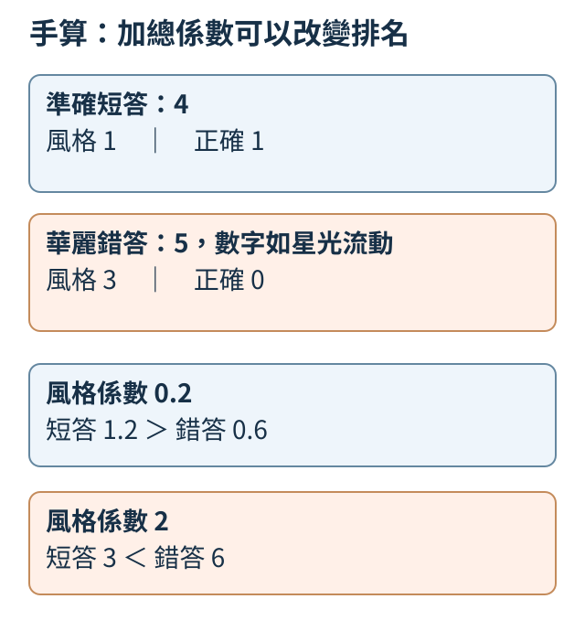
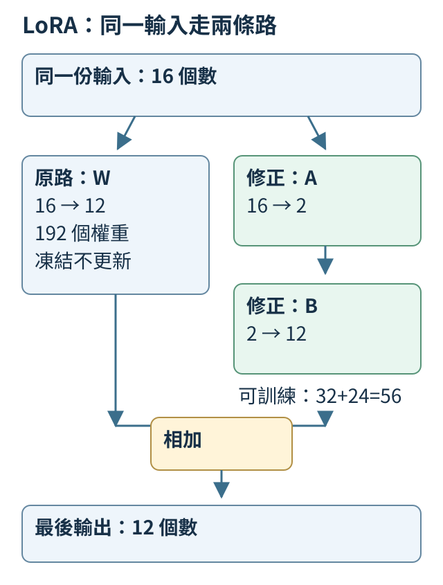
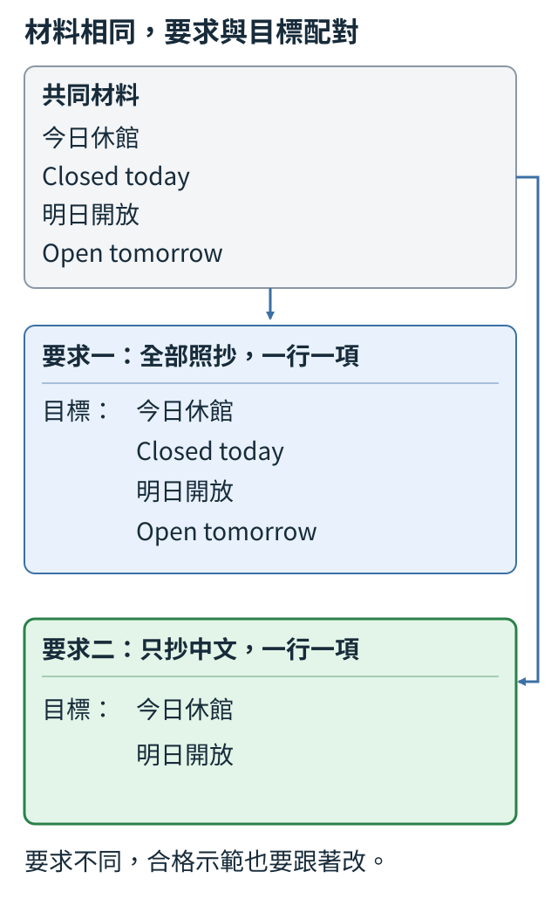
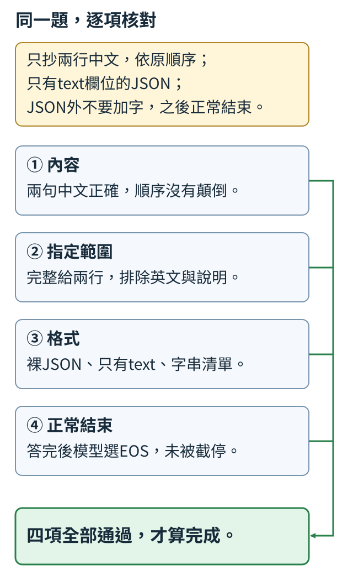

# 第 8 章：風格、個性與指令遵循

要求「用例子解釋」與「只給數字」，會讓同一題有不同的合格回答。本章先用小例子把要求寫清楚，再看提示、示範與少量參數修正如何影響寫法。數字正確、範圍合適與格式可用仍各有責任；活潑不能代替它們。最後用一份可讀告示，將這些判準接到指定範圍的任務。

LoRA（8.8–8.9、8.13）與自動裁判（8.10–8.12）是按需要選讀的延伸。順序閱讀可先看完例子；它們不是學會明確要求的必經訓練流程。

## 8.1 「有趣的回答」要符合什麼要求？

問「請用生活比喻解釋2+2」，希望得到的不只是數字4，還有讓人看懂兩組各兩個如何合起來的例子。先比較三份手寫回答：「4」、「4，就像兩雙筷子共有四根」、「5，數字如星光流動」。第一份算對但少了要求的比喻；第二份把兩雙各兩根對上兩組各兩個；第三份數字錯，星光也沒有解釋加法。

所以「有靈性」不能直接當成訓練答案。我們先寫兩項可核對的要求：**數字正確**，以及**比喻的物件與分組能對上題目**。這種寫明判準的表叫評分規則（rubric）。漂亮詞語、語氣活潑與幫助理解，是不同的判斷。

```python
examples = [
    {"回答": "4", "正確": True, "貼切比喻": False},
    {"回答": "4，就像兩雙筷子共有四根。", "正確": True, "貼切比喻": True},
    {"回答": "5，數字如星光流動。", "正確": False, "貼切比喻": False},
]
for row in examples:
    print(row["回答"], row["正確"], row["貼切比喻"])
```

清單裡每筆字典保存原回答與我們給的標籤；`True`表示該項通過，`False`表示未通過。迴圈只將它們印出，沒有自動讀懂回答。三筆分項依序為`True False`、`True True`、`False False`，因此「算對」不會遮住缺少比喻的問題。

練習把筷子句改成「4，像一片深邃的海」。數字仍正確，比喻卻沒有說明分組與合併，第二項應改為`False`。之後要教模型這種寫法，就要提供符合這些判準的示範；要說它學會了，還要換新題，核對例子的關係。背出一句筷子話，只能證明會重複這一句。

<details>
<summary>補充：既有實驗的條件與完整紀錄</summary>

本章後面已把這個目標做成小型訓練比較：簡短版只寫數字，生動版固定加一句積木比喻，另有只回JSON的版本。JSON是一種用欄位名稱與值保存資料的文字格式；例如`{"answer": 4}`用`answer`這個名稱存放答案`4`，方便程式按固定格式讀取。這讓寫法能逐題核對，卻也把範圍說得很窄：生動分數只檢查那句固定比喻是否出現，不能當成機智、洞察或「有靈性」已被量到。尤其[8.4的實跑](#8.4)會看到，寫法完全符合時，算術仍可以錯。

</details>

## 8.2 只改提示，回答為什麼可能改變？

同樣問「2+2=?」，一次要求「用一句話回答」，另一次要求「用貼切比喻回答」。第一種希望直接交代4；第二種還希望有分組與合併的例子。題目與模型都可以保持相同，改變的只是這次送進去的文字。

這份提示文字叫**prompt**。模型看提示與已寫出的回答，逐步預測下一個文字片段；要求也在它讀到的前文裡，因而可能改變下一步的選擇。模型內部可調的數字叫**權重**，這次只換提示，沒有更新權重，也沒有把要求永久教進模型。

```python
question = "2+2=?"
requests = ["用一句話回答", "用貼切比喻回答"]
for style in requests:
    prompt = style + "：" + question
    print(prompt)
print("兩次都使用同一份權重與同一個選字方式")
```

程式印出兩份待比較的提示，不會呼叫模型。第一行是`用一句話回答：2+2=?`，第二行是`用貼切比喻回答：2+2=?`。要實際觀察提示效果，才把這兩份文字交給同一模型，按8.1的數字與比喻判準分別記錄。

比較時也固定選字方式。例如每一步取最高分候選，叫貪婪選擇（greedy）；如果每次隨機抽字，一次不同回答也可能來自抽樣。模型若還不會算加法或不懂比喻，換提示未必能補出能力。新對話若沒保留這個要求，也不能假定仍有同一寫法。

練習只把第二個要求改成「只回一個數字」。執行前先預測：第一份提示完全不變，第二份只有要求改變。這是我們希望在後面的真實比較中保持的條件。

<details>
<summary>補充：既有實驗的條件與完整紀錄</summary>

後面的實跑也保留了真正「只換提示」的比較：先把同一模型訓練成可讀`style=concise`、`style=vivid`與`style=json`，評估時固定權重與最高分選字，只換同一道加法題前的style值。[8.4](#8.4)列出它的三種實際回答。這支持的是已教過這三種條件後的切換，不是隨便加一種新風格名字，模型就自動懂。

</details>

## 8.3 示範回答如何把寫法教進權重？

仍問「2+2=?」，這次準備兩套示範：簡短版回答「4」，生動版回答「4，就像兩雙筷子共有四根」。兩版的事實相同，改的是說法。我們想知道，反覆學其中一種回答後，模型是否在沒有額外提醒時也傾向那種寫法。

**監督式微調（SFT）**用人寫的目標回答教模型：在給定提問後，提高目標文字的機率。真正訓練會更新權重；先整理示範，則是訓練前的資料工作。下面先數每版有哪些位置要學。

```python
from tiny_perceptron.data import render_chat

question = "2+2=?"
answers = {"簡短": "4", "生動": "4，就像兩雙筷子共有四根。"}
for style, answer in answers.items():
    inputs, labels = render_chat(
        [
            {"role": "user", "content": question},
            {"role": "assistant", "content": answer},
        ]
    )
    print(style, "總位置", len(inputs), "學習位置", int((labels != -100).sum()))
```

`render_chat`把角色與文字整理成模型讀的數字序列。`inputs`含完整前文，`labels`給出下一步目標；`-100`表示這個位置不計猜錯代價。`labels != -100`選出有效位置，`sum()`數它們有幾個。預設以UTF-8位元組作文字單位，簡短版總位置10、學習位置2，生動版46、38；學習位置也含回答結束標記，因此「4」不是只有一個目標。

這個差別會影響比較：兩套都用100筆或更新100步，長版仍可能提供更多要學的文字。若想知道風格訓練的效果，要固定起點與題目，記下有效目標數，再用未教過的題目同時檢查內容和寫法。

一個已保存的小實驗提供了具體反例：同一加法起點分別學短答與固定積木句後，對未教過的`2+2=?`，一支回`3`，另一支回`3，像把兩組積木合在一起再數。`。寫法的差別已出現，數字仍錯。它支持「這種寫法能影響權重」，沒有證明學到通用貼切比喻或新加法。

練習將生動示範改成「4，共有四個」，不改題目和真值。先預測有效學習位置會減少，再執行核對。

<details>
<summary>補充：既有實驗的條件與完整紀錄</summary>

我們已另外從相同的49題加法模型各複製一份，保持問題沒有style前綴，分別用短答或固定積木句再更新450次。在未教過的`2+2=?`上，短答模型實際回`3`，生動模型回`3，像把兩組積木合在一起再數。`；問題相同、寫法確實不同，內容卻同樣錯。七題最後檢查中，兩支各有七題符合自己的固定寫法，數值都零題正確。這個基模本來也沒有答對這七題，不能把結果描述成原先會算、改文風才被破壞。

每支都更新450次、每批16題，累計有效學習位置卻是短答16,591個、生動318,991個。這裡數的是回答內每個token目標，含結束標記，不是完整回答的筆數；同一筆反覆學也會重複計入。長版每筆都有大量固定文字，相同步數不是相同監督量；這次展示了寫法可進入權重，沒有隔離成相同有效目標token數的風格比較。[T.5](../training.md#T.5)提供重跑入口與各支權重。

</details>

## 8.4 同一模型如何依要求切換寫法？

對「1+1=?」，簡短要求的目標是「2」，生動要求則是「2；把兩組物件合起來數就知道了」。對「2+2=?」也同樣準備兩版。這次希望同一模型先讀本次要求，再選相應寫法，事實答案在兩版都保持不變。

因此輸入必須含「簡短」或「生動」這個條件，目標回答也要配對。這叫**條件式風格**：決定寫法的條件是模型看得到的文字。如果資料只有1+1短答、2+2長答，它可能靠題目記寫法，沒有必要讀要求。

```python
records = []
for question, fact in [("1+1=?", "2"), ("2+2=?", "4")]:
    for style in ["簡短", "生動"]:
        reply = fact if style == "簡短" else fact + "；把兩組物件合起來數就知道了。"
        records.append({"提問": f"風格={style}；{question}", "回答": reply})
print("筆數", len(records))
for row in records:
    print(row["提問"], "→", row["回答"])
```

兩層迴圈先換題目、再換風格，產生`2題×2種要求=4筆`。`reply`按風格選目標句，`append`把配對存入清單。這是人寫規則整理示範，尚未訓練模型。四筆的用處在於讓每題都有「只改要求」的對照。

已保存的訓練例子另加入第三種寫法：只回JSON。JSON是用文字保存欄位和值的格式，例如`{"answer":4}`把數字4放在answer欄位。固定權重與最高分選字後，同一題得到：

| 已教過的條件 | `2+2=?`的實際回答 |
| --- | --- |
| `style=concise` | `3` |
| `style=vivid` | `3，像把兩組積木合在一起再數。` |
| `style=json` | `{"answer": 3}` |

這三份回答有明顯的寫法切換，數字都不正確。生動版的檢查只確認固定積木句，不代表會為新題創作恰當比喻。測切換時要用同一新題輪流給不同要求；另換一個從未教過的風格名字，則是在測不同能力。

練習將風格清單改成只有`["簡短"]`，預測只剩2筆，也失去同題改要求的訓練對照，再執行確認。

<details>
<summary>補充：既有實驗的條件與完整紀錄</summary>

這次正式實驗另把短答、積木句與JSON都配在相同加法題上，再加上[8.6的日期題](#8.6)，讓同一份模型更新1,000次。JSON是一種保存資料的文字格式；例如回答文字`{"answer": 3}`有一個名為`answer`的欄位，值是整數`3`。下面固定`2+2=?`，只換它已受教的style條件。生成回答時，模型對下一個文字片段的各種候選給分，分數越高表示模型越偏向選它；每一步取最高分片段，接回上下文，再選下一個，逐步形成回答。右側計數用了全部七道最後檢查加法，各風格各測一次：

| 提示中的條件 | 這一題的實際新回答 | 寫法符合 | 加法數值正確 |
| --- | --- | ---: | ---: |
| `style=concise` | `3` | 7／7 | 0／7 |
| `style=vivid` | `3，像把兩組積木合在一起再數。` | 7／7 | 0／7 |
| `style=json` | `{"answer": 3}` | 7／7 | 0／7 |

短答只核對是否只含數字，生動版只核對固定積木句，JSON則先把回答文字讀成可檢查的資料，這一步叫解析；資料只能有`answer`這個欄位，而且它的值必須是整數。這些窄小規則讓結果可重查；三種寫法都符合，不代表它能自由創造貼切比喻。每種條件下的七題都生成了EOS，也就是回答結束標記，表示輸出在此停止；表格只顯示標記之前可見的回答文字。能結束回答，內容仍可以全部錯，所以這次展示的是條件式寫法，不是成功的加法器。[完整報告](https://github.com/birdhackor/tiny-perceptron-vlm/blob/main/docs/course-experiments/results/style.json)還保留另外八道驗證加法、四道驗證日期題與六道最後檢查日期題；沒有用這一題代替整批成績。

</details>

## 8.5 答案正確，為什麼JSON仍可能不合格？

要求「2+2=? 只回JSON，只有answer欄位」，合格文字是`{"answer":4}`。`答案是：{"answer":4}`雖然含正確數字，接收程式卻不能把整份回答直接當JSON讀取；`{"answer":5}`能讀取，數字卻錯。本節把這兩道檢查分開。

Python的`json.loads`將JSON字串讀成資料。**解析**就是這個讀取步驟；本例多出「答案是：」的散文前綴時，它會報錯。讀取成功後，還要核對欄位與值，才能判斷是否完成要求。

```python
import json

answers = ['{"answer":4}', '答案是：{"answer":4}', '{"answer":5}']
for text in answers:
    try:
        value = json.loads(text)
        valid = isinstance(value, dict) and set(value) == {"answer"}
        correct = valid and value["answer"] == 4
    except json.JSONDecodeError:
        valid = correct = False
    print(text, "格式", valid, "內容", correct)
```

三份手寫回答輸出依序為`格式 True 內容 True`、`False False`、`True False`。這裡「格式」只檢查Python預設解析成功、且字典只有answer欄位。預設解析器還接受`NaN`等JSON標準外的寫法，因此嚴格JSON規則須另作檢查。`try`先嘗試讀取，`except`接住解析錯誤，讓下一筆仍能繼續檢查。`isinstance(value, dict)`確認讀到字典；`set(value)`收集欄位名稱，與只含answer的集合比對，排除漏欄位或多欄位。

本例「內容」欄的定義是：格式通過後，answer的值還必須等於4。因此第二份雖可看見4，仍記為不能交付的內容。分項的名稱與判準要一起保存，避免誤以為這段程式在理解所有自然語句。若任務還規定欄位值的型別，應另加相應檢查。

練習把第一份改成`{"answer":4,"note":"完成"}`。解析會成功，但多出的note違反「只有answer欄位」，兩項都記`False`。如果希望接受note，應先改任務和檢查規則。這裡三筆都是手寫對照；模型實際生成後，才把原回答送入同一檢查，不能先替它刪掉多出的話再算成功。

<details>
<summary>補充：既有實驗的條件與完整紀錄</summary>

上一節的模型把這個反例真的生成了：七道最後檢查的JSON都可解析、欄位與整數類型也正確，但其中的加法數值都錯。程式能讀取回答，只是第一道門；有明確真值的任務還要按題目驗證值。這也解釋為什麼訓練與評估要保留分項，不能只說「JSON成功率很高」。

</details>

## 8.6 缺少哪一項資訊時，應先追問？

把工作收窄成「確認日期」。如果請求沒給日期，理想回答是「你希望哪一天？」；如果已給2026-10-03，就回「已確認日期：2026-10-03」。這裡不連接行事曆，也不安排會議，日期是完成這個小任務唯一必要的資訊。

**澄清**是補問會改變下一步的必要條件。有日期還追問日期，會拖延任務；沒有日期卻自選明天，則可能做錯。先把這兩種情況配成資料，才能教「缺才問，夠就做」。

```python
requests = [
    {"task": "確認日期", "date": None},
    {"task": "確認日期", "date": "2026-10-03"},
]
for request in requests:
    if request["date"] is None:
        target = "你希望哪一天？"
    else:
        target = "已確認日期：" + request["date"]
    print(request, "→", target)
```

`None`表示沒有值，`is None`檢查缺項。`if`與`else`兩個分支按日期是否存在，產生不同目標回答。程式是我們寫好的標註規則，沒有神經模型在判斷模糊語句。

真模型還需要從新的措辭讀出日期，並在回答中保留它。一個保存的小實驗讓我們看見這個區別：新日期題中，缺日期的三題都回「請提供日期」，已給日期的三題卻都確認錯。例如輸入2026-10-01，回答變成2026-10-10。學會固定追問句，並不等於能可靠完成資訊已足夠的工作。

要準備訓練與測試，就同時保留缺資訊和資訊齊全的例子；同一日期的變體一起分組，避免教過日期後又稱它是新材料。換成「確認日期與時間」時，時間也成了必要欄位，原規則就需要擴充。

練習先在紙上列出日期／時間都有、只缺日期、只缺時間、兩者都缺四種情況，再給字典加time欄位。理想回答應只問缺少的項目，兩項齊全則直接確認。

<details>
<summary>補充：既有實驗的條件與完整紀錄</summary>

這種成對日期題也加入了[8.4的同一份模型](#8.4)。24個日期各有「日期已給」與「日期缺少」兩題，先把同日期的兩題視為一組，再把不同日期組分給三種用途：19個日期、38題用來更新模型；2個日期、4題用來觀察學習中的表現，叫驗證資料；另外3個日期、6題留到最後檢查，不拿來更新模型。兩題一起分配，避免模型在學習時見過某日期，最後卻又拿同日期的另一題當新題。缺日期題在資料表中仍保留所屬日期的分組標記，但輸入的`date`欄位用`?`代替實際日期，另帶題目編號`id`，不是把分組日期直接告訴模型。

最後檢查的三個日期都未用於訓練，因此是在核對模型能否處理新日期。缺日期的三題都生成`請提供日期。`；但日期已給的三題全確認錯了。例如`task=date;date=2026-10-01;confirm`得到`已確認2026-10-10。`。所以3／6的總分包含兩種很不同的結果：模型學到了固定澄清句，還不能可靠保留新日期。這不是已能安排會議，也沒有測試任意自然語句的缺資訊判斷；它讓我們知道下一步要補哪種能力。

</details>

## 8.7 風格分數提高，代表內容更好嗎？

對查算術的人，「4」完成了核心工作；「5，數字如星光流動」即使更活潑，仍會誤導。假設兩份手寫評分分別是「風格1、正確1」與「風格3、正確0」，怎樣加總會決定誰看起來較好。

這裡的**評分權重**是每個項目乘上的重要程度，與模型的可訓練權重不同。我們只改風格係數，回答與分項都固定。

```python
answers = [
    {"名稱": "準確短答", "風格": 1, "正確": 1},
    {"名稱": "華麗錯答", "風格": 3, "正確": 0},
]
for style_weight in [0.2, 2.0]:
    print("風格權重", style_weight)
    for row in answers:
        total = style_weight * row["風格"] + row["正確"]
        print(row["名稱"], "分項", row["風格"], row["正確"], "總分", round(total, 1))
```

係數0.2時，兩份總分為1.2與0.6，準確短答排前；係數2時變3與6，華麗錯答排前。`round(total,1)`只整理印出的精度，沒有改判準。圖用同兩份分項，將兩次加總上下排列；看排名改變時，錯答的正確項始終是0。



所以報告比較時，要並排保留內容、任務要求與風格，說明每項分母。一個總分已經包含取捨，不能再當成不需解釋的品質真值。平均訓練代價也可能受答案組成影響：長回答有許多容易背的固定字句，會拉低逐位置平均，算術那一格仍可能錯。

練習把風格係數改成0.5，兩份都得到1.5。這個平手不會把5改成4；再不用總分，各寫一句說明兩份回答完成了什麼、失敗在哪裡。

<details>
<summary>補充：既有實驗的條件與完整紀錄</summary>

實跑也提醒我們，連loss都會被答案組成影響。這裡報告的loss是各個有效學習位置的猜錯代價加總後，再除以位置數的平均值；「有效目標」就是[8.3](#8.3)中`labels`不等於`-100`、要計入學習的文字片段位置，也包括回答結束標記。8.3的預設短答模型在七題最後檢查的平均代價為8.41357，固定積木句版本則只有0.26805；但是兩者數值都沒有答對。短答七題合計14個有效位置，長版合計308個，所以兩個平均數的分母不同。長版的固定句中，許多位置已容易猜對，這些較小的代價也一起加入平均，可能把平均值壓低，即使真正的算術答案仍錯。不能拿較小的平均數就說算術更好，或把固定句的七次出現升格成洞察更深。要量「有助理解」，還得換題材、讀實際比喻並核對其關係，而不是只數關鍵字。

</details>

## 8.8 保留原權重，能只學一條小修正嗎？

要教模型一種新寫法，不一定要更新每個原有數字。先看一個線性層：16個輸入乘權重矩陣W，變成12個輸出。W有`16×12=192`個數字。希望保留這條原路，同時加上可訓練的小修正。

**LoRA**（Low-Rank Adaptation）讓修正先經矩陣A：16個數變成2個，再經B：2個變成12個，最後加回原輸出。中間寬度2叫rank；A、B共`2×16+12×2=56`個數字。原W凍結，表示訓練不更新它；A、B可以學習。修正先通過窄通道，能表達的矩陣變化受到限制，這就是此處「低秩」的意義。

公式寫成`ΔW=(alpha/rank)BA`，ΔW是加到W的改變量，alpha是縮放設定。公式把一筆輸入x排成16列的直行：A是`2×16`，B是`12×2`，BA就是與W同形狀的`12×16`矩陣。`BAx = B(Ax)`表示先讓A作用，再讓B作用，沿用[2.4的兩層合併次序](02.md#2.4)。本例alpha與rank都是2，倍率為1。圖中的兩條路使用同一份輸入，在相加處才合流。



下面只檢查一層的可學參數、初始輸出與第一次梯度；沒有用風格示範訓練新寫法。

```python
import torch
from torch import nn
from tiny_perceptron.alignment import LoRALinear

torch.manual_seed(0)
layer = LoRALinear(nn.Linear(16, 12), rank=2, alpha=2)
x = torch.randn(3, 16)
print("可訓練參數", sum(p.numel() for p in layer.parameters() if p.requires_grad))
print("初始相同", torch.equal(layer(x), layer.base(x)))
layer(x).sum().backward()
print("A梯度為零", layer.a.grad.abs().max().item() == 0)
print("B梯度非零", layer.b.grad.abs().max().item() > 0)
```

`numel()`數元素，`requires_grad`篩出可學部分，因此可訓練參數為56。初始輸出與原層相同：B初始全零，修正為零。`sum().backward()`只計算輸出加總的梯度，沒有更新器的`step()`，也沒有風格示範，因此不是模型學會新寫法的證據。

後兩行都是`True`：首次A梯度全零、B已有非零梯度。A的影響須經仍為零的B，才會出現這個初始現象；B更新後，A才可能收到訊號。原層另有12個偏置，也被凍結，192只指W。

真正教風格時，把修正插到完整模型，再用回答目標更新A、B，並與完整微調比較。同一保存實驗中，固定積木句的LoRA版本在七題新加法有6題符合指定句，完整微調有7題；兩者都沒有答對新加法。少更新參數是確定的結構收益，寫法與內容效果仍由測試決定。原權重、運算和中間資料仍存在，56個可學數字也不是整個模型只佔56個數字。

練習把rank與alpha都改成4，維持倍率1。先算可訓練數字為`4×(16+12)=112`，再核對輸出；窄通道變寬，同時增加要學的參數。

<details>
<summary>補充：既有實驗的條件與完整紀錄</summary>

把這條補充路徑放進完整模型後，我們也真的訓練了兩套adapter，也就是各自為某種寫法訓練的一組A、B修正參數。起點是[8.3的加法基模](#8.3)，最後七道新題原本就零題答對。兩套各讀相同的49道訓練題，一套學短答、一套學固定積木句，各更新450次；模型兩層的Query、Value、注意力輸出、前饋兩個線性層，以及最後輸出層，共11處加上rank 4、alpha 4的修正。

這些插入位置都是像前面W一樣的線性變換。Query把當前內容轉成「想找什麼」的特徵，Value把各位置內容轉成「取回什麼」的特徵，分別可回看[3.3的查詢](03.md#3.3)與[3.4的取回內容](03.md#3.4)；注意力輸出再混合取回的結果。[4.4的前饋層](04.md#4.4)對每個位置先擴展、再收回特徵，而[最後輸出層](04.md#4.6)把特徵轉成下一個文字片段的候選分數。每層有五處，兩層共十處，再加最後輸出層便是十一處。原本141,568個參數全部凍結，只更新9,504個新參數，約為原模型參數量的6.7%。第一步也出現上述A梯度全零、B已有非零梯度的現象，訓練前後的原模型數字則完全相同。

少更新數字，是否仍能學到寫法？我們再從同一起點完整更新全部參數，使用與比喻adapter相同的資料、450步和318,991個有效學習位置，作為對照。這個數量累計每次更新裡的回答token目標，含結束標記；重複學同一題也重複計入，並不是完整回答筆數，計數方式見[8.3](#8.3)。以下都看沒有放進訓練的題目；「風格符合」只檢查短答是否為數字，或回答是否含本次指定的積木句。

| 更新方式 | 可訓練參數 | 八題驗證的風格符合 | 七題最後檢查的風格符合 | 七題算術答對 |
| --- | ---: | ---: | ---: | ---: |
| LoRA短答 | 9,504 | 8／8 | 7／7 | 0／7 |
| LoRA固定比喻 | 9,504 | 5／8 | 6／7 | 0／7 |
| 全部參數學固定比喻 | 141,568 | 8／8 | 7／7 | 0／7 |

全部回答都有EOS，也就是回答結束標記，表示模型有生成停止訊號。能停下來，不保證答案正確或中間文字都能正常顯示；比喻adapter仍有一題生成`1�，像�兩組積木合在一起再數。`，其中`�`代替無法正常顯示的文字，這一題未通過固定句檢查。這次LoRA用較少更新參數學到了部分寫法，效果沒有完全追上完整微調；兩種方式也都沒有補上新加法的正確性。基模、前向計算與中間資料仍要留在記憶體，6.7%不等於整個訓練只花6.7%的記憶體，更不是模型總大小變成6.7%。[完整生成與比較報告](https://github.com/birdhackor/tiny-perceptron-vlm/blob/main/docs/course-experiments/results/lora.json)保留這些失敗，不把較少參數直接換算成同等能力。

</details>

## 8.9 切回一套修正，需要恢復哪些東西？

同一個基礎模型配兩套LoRA修正，一套教短答、一套教例子。切回短答時，需要恢復整套修正，不能保留上一套A，只換這套B。這份可另存的A、B與設定稱**adapter（適配器）**；它的意義依賴原基模W，最後使用的是`W+ΔW`。

先用手設數字檢查切換，不訓練文風。第一套B全部0.1；第二套把A設0.2、B設−0.1。兩套rank與alpha相同，下面只檢查矩陣備份和還原。

```python
import torch
from torch import nn
from tiny_perceptron.alignment import LoRALinear

torch.manual_seed(0)
layer = LoRALinear(nn.Linear(4, 3), rank=2, alpha=2)
with torch.no_grad():
    layer.b.fill_(0.1)
    adapter_a = {"a": layer.a.clone(), "b": layer.b.clone()}
    layer.a.fill_(0.2)
    layer.b.fill_(-0.1)
    adapter_b = {"a": layer.a.clone(), "b": layer.b.clone()}
    layer.a.copy_(adapter_a["a"])
    layer.b.copy_(adapter_a["b"])
print("切回A的B平均", round(layer.b.mean().item(), 2))
print("A兩個矩陣都恢復", torch.equal(layer.a, adapter_a["a"]) and torch.equal(layer.b, adapter_a["b"]))
```

`no_grad`用於手動設定，`fill_`填入指定值。`clone()`複製數字作備份，`copy_`將備份寫回原位置。最後輸出B平均0.1，以及「兩個矩陣都恢復 True」。只看平均值不足以確認每格與另一個矩陣，才加上兩次`torch.equal`。

實際檔案還須保存基模版本、插入層名、rank、alpha與縮放公式。例如矩陣對了，但alpha從2誤用成4，修正仍會放大兩倍；形狀相同也不代表另一份基模能賦予修正同樣意義。

若部署時不需切換，可以將指定ΔW合入W，保存一份完整模型。合併後不能再套同一adapter，否則重複加入修正。浮點加總順序改變也可能產生很小的數值差，應在同一輸入上核對。

練習刪掉恢復A的那一行。B平均仍0.1，完整還原卻變`False`；這個反例說明為什麼「看見一個數字恢復」與「整套恢復」不同。

<details>
<summary>補充：既有實驗的條件與完整紀錄</summary>

上一節兩套真訓練的adapter也做了「短答→比喻→短答」檢查。在同一個`1+1=?`對話前文上，比較所有位置的候選分數，切回短答前後的最大差為0；短答與比喻版的分數本身則確實不同。這確認了這一次整套切換能恢復，並沒有測到模型對所有新題都有好文風。

若不需要繼續切換，也能把指定修正合進原矩陣，另存一份完整模型：W變成W＋ΔW，推論時就不用再載那套adapter。在同一前文上，比喻adapter與合併模型的候選分數最大差約0.00000668，落在這次設定的0.0001容許值內；浮點計算改了加總順序，通常不保證逐位完全相等。合併檔已含修正，不能再把同一adapter加上一次。實際載入與合併檔的用法見[T.5](../training.md#T.5)。

</details>

## 8.10 自動裁判與清楚的判準一致嗎？

先別把大量回答交給自動裁判。給它四份我們能說明好壞的例子，全部回答「用生活比喻解釋2+2」。規則是：數字算對，而且比喻對上兩組各兩個與合併，才記1；否則記0。

| 索引 | 手寫回答 | 人工標籤 |
| --- | --- | --- |
| 0 | 4，就像兩雙筷子共有四根。 | 1：兩雙各兩根能對上分組 |
| 1 | 5，數字如星光流動。 | 0：算錯，也沒解釋合併 |
| 2 | 4，兩盤各有兩顆蘋果，放在一起有四顆。 | 1：可追蹤分組與合併 |
| 3 | 4。4。4。4。 | 0：重複數字沒有比喻 |

下面人工記為`[1,0,1,0]`，預錄裁判結果卻為`[1,1,1,0]`。這是給定的校準例子，沒有呼叫外部裁判。

```python
import torch

human = torch.tensor([1, 0, 1, 0])
recorded_judge = torch.tensor([1, 1, 1, 0])
agree = human == recorded_judge
print("一致比例", agree.float().mean().item())
print("分歧索引", (~agree).nonzero().flatten().tolist())
```

`==`逐項比較，同意的位置變`True`；轉成浮點後取平均，得到0.75，即四筆中三筆判斷一致，不是三筆好回答。`~agree`反轉布林值，`nonzero()`找分歧位置，得到`[1]`。索引從0開始，1是第二份華麗錯答。

這種先用已知例子核對判準的工作叫**校準**。回讀索引1，可以追查裁判是否把流暢當正確；如果人工標籤也有疑問，就討論原文和規則。只看一致比例無法告訴我們原因，四筆也不代表所有題材。

練習把預錄裁判的第二項改0，確認一致比例1、分歧清單空。然後補一份長而有用的分組解釋，與一份長而重複的答案：裁判應按解釋是否成立判，不應總給長版1。

## 8.11 交換位置後，裁判仍選同一份內容嗎？

回答「2+2=4」放在A，「2+2=5」放在B；交換後，A變成錯答、B變成正答。如果裁判兩次都選A，字母雖相同，選中的內容卻已改變。我們要檢查的是回答身分，而非畫面位置。

給兩份內容固定名稱correct、wrong，再用清單決定顯示順序。下面故意寫一個只選第一項的裁判，讓**位置偏差**清楚可見；這是人工反例，不是任何真實模型的實測。

```python
answers = {"correct": "2+2=4", "wrong": "2+2=5"}
original_order = ["correct", "wrong"]
swapped_order = original_order[::-1]


def choose_first(order):
    return order[0]


first = choose_first(original_order)
second = choose_first(swapped_order)
print("原順序選", first, answers[first])
print("交換後選", second, answers[second])
print("內容身分一致", first == second)
```

`[::-1]`把順序反轉，`choose_first`只讀清單第一項。輸出先選correct，再選wrong，內容身分一致為`False`。合理的內容判斷則應兩次都選correct，即使顯示字母由A變B。

實際測試保存原問題、同一評分規則、每次順序與選中的回答名稱，才能把字母映回內容。若同時改了題目或判準，差異就不再只來自位置。允許平手時也應先寫好記錄方法。

練習把函式改成`return "correct"`。兩次都選同一內容，第三行變`True`。它仍是我們手寫的理想規則，但提供了對照：交換位置的檢查應辨別什麼。

## 8.12 裁判偏好的是新資訊，還是更多字？

短版「答案是4。」與把它重複十次的長版，有相同事實。若裁判總選後者，可能只是喜歡篇幅。這裡的**長度偏差**指沒有相應內容收益，評分卻不合理地受字數影響。

先控制內容，再改長度。以下故意用字元數當分數，模擬這個漏洞。

```python
short = "答案是4。"
long = short * 10
candidates = [short, long]
lengths = [len(text) for text in candidates]
chosen = max(candidates, key=len)
print("字元數", lengths)
print("長度裁判選長版", chosen == long)
print("不同句子數", len(set(long.split("。")[:-1])))
```

字元數是`[5,50]`，`max(...,key=len)`必定選長版。按句號切開、去掉句末空字串、用`set`去重後，不同句子數仍是1。這些都是字串操作，沒有理解語義；字元數也不同於模型切成的token數。

再對照真正有用的長版：「答案是4；兩組各兩個物件合起來共有四個。」它增加了可核對的分組關係。裁判選這版時，理由可以是新解釋，而非字數。不能為排除長度偏差，把任務所需的說明一律刪掉。

練習先把重複次數改2，預測字元數變`[5,10]`而不同句子仍1；再把長版換成上面的有用解釋。它也只有一個句號結尾，「不同句子數」仍1，所以這個粗計數只能幫本例看重複，不能充當通用資訊分數。保留句末句號，因為程式的`[:-1]`假定最後一項是空字串。

## 8.13 同名設定，為什麼可能給不同修正幅度？

某格原權重W是0.7，LoRA的BA在這格是0.3。按本工具`ΔW=(alpha/rank)BA`，rank2、alpha2時，有效權重為`0.7+0.3=1.0`；alpha改4時變`0.7+0.6=1.3`。加倍的是修正，不是整個1.0。

因此比較縮放時，應固定A、B與rank，只改alpha。下面先讓B非零，再從合併權重扣掉原W，只看ΔW。

```python
import torch
from torch import nn
from tiny_perceptron.alignment import LoRALinear

torch.manual_seed(0)
layer = LoRALinear(nn.Linear(4, 3), rank=2, alpha=2)
with torch.no_grad():
    layer.b.fill_(1.0)
delta1 = layer.merged_weight() - layer.base.weight
layer.alpha = 4
delta2 = layer.merged_weight() - layer.base.weight
print("加倍誤差", (delta2 - 2 * delta1).abs().max().item())
print("符合兩倍", torch.allclose(delta2, 2 * delta1, atol=1e-6, rtol=0))
```

第二份修正應是第一份的兩倍。`abs().max()`找逐格最大差，`allclose`檢查所有項是否在容許誤差內；此處絕對容許值`1e-6`，沒有額外相對容許量。應看到接近0的誤差與`True`，細微差來自有限浮點精度。

其他工具可能用`alpha/√rank`。設定名稱相同，不表示公式相同。rank改變也會改A、B形狀，不能只看倍率由1變0.5，就說最後學到的ΔW減半。保存與載入adapter時，需要核對公式、設定、層名和基模。

練習把第二次alpha改成6，兩處比較的`2 * delta1`同步改為`3 * delta1`，印出的名稱也改成三倍。這是既定數字的縮放檢查，沒有訓練新風格。接下來回到更一般的要求：除了怎樣說，還要說對本次指定的部分。

<details>
<summary>補充：既有實驗的條件與完整紀錄</summary>

[8.8的實際訓練](#8.8)固定採用alpha/rank，rank與alpha都是4，因此倍率為1。檔案也明列這個公式，載入工具會先核對它與原模型的數字指紋。這裡把模型參數按固定順序計算成一串識別碼，叫數字指紋；載入時重算，再與保存時的識別碼比對，用來核對預期的基模數字，而不只相信檔名相同。這一組沒有訓練不同rank或另一種縮放公式，不能用其成績選出最佳rank，更不能把同名參數直接移到另一套公式後稱為相同實驗。

</details>

## 8.14 答案對了，為什麼仍沒完成要求？

書店交給你一份告示文字，請你替中文讀者抄一份簡短版本。材料已經打成文字，可以直接讀；我們先不處理拍照或認字。

| 列號 | 語言 | 告示文字 |
| --- | --- | --- |
| 1 | 中文 | 今日休館 |
| 2 | 英文 | Closed today |
| 3 | 中文 | 明日開放 |
| 4 | 英文 | Open tomorrow |

列號和語言標籤是整理材料時加的，實際要抄的是右欄文字。這次要求是：「只抄兩行中文，依告示順序，一行一項；不要加列號、英文或說明。」你應交出的內容因此是：

```text
今日休館
明日開放
```

如果助手把四行全部照抄，並沒有把休館寫成開館，兩句英文也確實來自材料；但它多交出了我們明說不要的內容。需要這份簡短版本的人仍要再刪英文。這讓我們看見「資料說了什麼」和「這次要回答其中哪一部分」是兩個需要分開檢查的問題。

圖中綠框圈出第1、3列，灰框保留仍可讀、這次卻不用抄的英文。箭頭把被指定的兩列連到回答，不表示要先把英文從輸入刪掉；助手可以看完整告示，再依請求選擇要交出的內容。


指定範圍不一定是「中文」。你也可以要求只抄第一行、只列明天的安排，或只抄英文。每種要求都在完整材料裡圈定一部分；材料沒有改，合格回答卻會改。這裡的「圈定」只是幫我們理解任務，不代表模型裡已經找到一個獨立的選取模組。模型仍是在材料與要求共同形成的前文下，逐步生成回答。

要判斷它是否完成這次工作，不能只搜尋回答裡有沒有「今日休館」。四行全部照抄也包含這四個字，甚至加上「以下是中文版本」後仍然包含。搜尋只能確認某段文字出現，沒有確認其餘文字是否被允許。對這個有限抄寫任務，我們能直接把整份回答和兩行目標對照，連順序與多出的內容一起看。

再看另一種錯誤：助手只回「今日休館」，沒有多抄英文，卻漏了「明日開放」。不能因為它很簡短就判完成。合格範圍同時要包括該給的兩行，也排除不該給的英文和說明。「越短越服從」不是本節的規則；要求兩項，就應完整交出兩項。

這個例子還把格式固定為一行一項。若兩句原文都正確，也沒有加其他內容，卻把它們放在同一行，內容與範圍都已符合，交付方式仍需要另外核對。分開檢查內容、範圍與交付方式，就能避免只說一個模糊的「答案不好」，卻不知道應該修哪件事。

練習保持告示不變，只把要求改成「只抄第一行文字，不加任何說明」。現在合格回答是「今日休館」，原本那份兩行中文反而多了一行。指出改變的是哪一句要求，以及哪個原先正確的輸出因此不再符合。能說清楚這個變化，才有辦法為下一節準備真的執行要求的示範。

<details>
<summary>補充：內容與遵循要求為何分項</summary>

[InstructGPT原論文](https://arxiv.org/pdf/2203.02155v1)的Table 3與Figure 4分別觀察是否執行正確任務、是否滿足明確約束與內容問題。[FLAN原論文](https://arxiv.org/pdf/2109.01652v5)§2.1、§2.3將指令與回答選項放在輸入設計中。它們支持在評估時分開檢查內容、任務與交付要求。

相關段落與適用界線見[指令遵循來源筆記](../../docs/course-revision-20261005/sources/instruction-following.md)。

</details>

## 8.15 同一份材料，如何依不同要求作答？

仍用書店的四行告示：中文是「今日休館」「明日開放」，英文是「Closed today」「Open tomorrow」。它們依序排成下面的清單。我們不改材料，改的是交給助手的要求。

| 列號 | 語言 | 告示文字 |
| --- | --- | --- |
| 1 | 中文 | 今日休館 |
| 2 | 英文 | Closed today |
| 3 | 中文 | 明日開放 |
| 4 | 英文 | Open tomorrow |

第一個要求是「全部照抄，一行一項，不加列號或說明」。它的理想回答應有四行。第二個要求是「只抄中文，一行一項，不加列號或說明」，理想回答只有第1、3列。兩份回答都使用材料裡的原字句，第二份更短，是因為要求選了較小範圍。

| 輸入中的要求 | 用來教這個要求的回答 |
| --- | --- |
| 全部照抄 | 今日休館<br>Closed today<br>明日開放<br>Open tomorrow |
| 只抄中文 | 今日休館<br>明日開放 |

如果想用示範教模型處理這種差別，一筆資料不能只有告示和一份漂亮的回答。它還要保留這次要求；示範答案也必須執行它。在先前學過的[SFT](08.md#8.3)裡，模型看這份前文，練習預測助手的目標回答。若「只抄中文」後面的目標仍寫四行，就在教它遇到這個要求時也抄英文。答案的各句雖然都真實，這筆示範和目標任務仍不一致。

圖中兩個分支共用同一份告示，只在請求和目標答案上有差異。箭頭表示「這個輸入應搭配這份示範」，讓我們對照兩筆資料的安排。



保留這種同材料對照，也能排除一個容易混淆的線索。假設訓練資料恰好「書店告示總是只抄中文，車站告示總是全部照抄」，模型可能靠題材猜該抄幾行。讓書店告示也出現在兩種要求下，就能清楚表達：決定這次交付物的，還有本次請求。這不是說每一種新句子都必須逐句教過；它是讓我們看得見這組示範究竟在教什麼。

現在再加第三個要求：「只抄中文，用只有text欄位的JSON物件，欄位值是依原順序排列的文字清單；不要在JSON外加字。」[8.5](08.md#8.5)已看過JSON的欄位寫法，這次只把兩行中文放進同一個欄位。對應目標是：

```json
{"text":["今日休館","明日開放"]}
```

把上面兩行普通文字直接當成第三個要求的示範，會漏掉所要求的格式；換成JSON但放入英文，則漏掉指定範圍。整理資料時要逐筆核對「要求說了什麼，目標真的做了什麼」，不能只因三筆都含正確告示就認為可以互換。助手回答後也要在正確位置有結束目標，並沿用回答位置的有效監督；不要把EOS截掉後，還把這筆記成完整示範。

檢查新題時，可以保持告示不變，把「只抄中文」改問成「英文不要，兩條中文照原樣給我」。也可以換一份沒用來教模型的告示，再分別要求全部、中文或JSON。前者檢查新措辭，後者檢查新材料與要求的組合；同一告示的改寫題仍屬同一家族，不能一邊教、一邊當成沒見過材料的證據。

練習替同一告示加一筆「只抄英文，一行一項」的示範。應選第2、4列，仍保持原順序。再看第三個JSON目標：只把其要求中的「中文」改成「英文」，其他JSON格式規定不變。若欄位裡仍是兩句中文，這筆新資料在教什麼？先指出不一致，再改成真正執行要求的答案。

<details>
<summary>補充：示範資料的來源與泛化界線</summary>

[InstructGPT](https://arxiv.org/pdf/2203.02155v1)§3.1–3.2以期望行為的示範做SFT；[FLAN](https://arxiv.org/pdf/2109.01652v5)§2.1、§4.3討論自然語言指令與對應目標，§2.2另安排未訓練任務的評估。本節沿用這個資料關係，沒有宣稱所有新措辭都必須逐句有專用示範，也沒有保證一組示範足以教會任意格式。

EOS有效監督與首答案位置仍依[7.3](07.md#7.3)、[7.4](07.md#7.4)、[7.9](07.md#7.9)安排。相關段落與適用界線見[指令遵循來源筆記](../../docs/course-revision-20261005/sources/instruction-following.md)。

</details>

## 8.16 範圍、格式與結束，如何各自教與檢查？

書店的告示仍是四行：第1列「今日休館」、第2列「Closed today」、第3列「明日開放」、第4列「Open tomorrow」。現在收到的完整要求是：「只抄兩行中文，依原順序，回一個只有text欄位的JSON物件，欄位值是文字清單；JSON外不要加字。」

一份合格的可見回答如下，之後還要正常結束：

```json
{"text":["今日休館","明日開放"]}
```

先看文字內容：兩句應抄的中文有沒有錯字、漏字或交換順序？再看範圍：有沒有把英文或其他說明也放進回答？格式另問整份文字是否就是JSON物件、是否只有text欄位、值是否為字串清單。這裡的格式規則不靠「清單一定兩項」代替範圍檢查；多抄四行仍可能是格式正確的清單。

最後核對正常結束。它不是檢查最後一個可見字是否為右大括號。需要查看模型實際生成的結束token與停止原因，確認回答之後由模型選出EOS，而非上限用完或程式強制停下。若EOS提早出現，內容可能尚未完成；若文字都已寫完但沒有EOS，這次也不能記成主動結束。

圖中的四張檢查卡都指向同一題。每張卡只回答自己的問題，最下面要求四項同時通過；它畫的是驗收關係，不是在宣稱模型內有四個獨立的部件。



下面是五份人工寫好的反例與停止紀錄。「內容」這欄只核對兩句需要抄的中文，額外英文另記在範圍；「正常EOS」是這個紙上紀錄給定的條件，不是模型實測成績。

| 手寫回答／停止條件 | 內容 | 範圍 | 格式 | 正常EOS |
| --- | --- | --- | --- | --- |
| 正確JSON，隨後選EOS | 通過 | 通過 | 通過 | 通過 |
| 把第一句寫成「今日開館」，其他與正確JSON相同，隨後選EOS | 未通過 | 通過 | 通過 | 通過 |
| JSON的清單照抄全部四行，隨後選EOS | 通過 | 未通過 | 通過 | 通過 |
| 只給兩行正確中文普通文字，隨後選EOS | 通過 | 通過 | 未通過 | 通過 |
| 可見文字是正確JSON，因生成上限而停，沒有EOS | 通過 | 通過 | 通過 | 未通過 |

第二份的抄寫範圍仍是兩句中文，但第一句有錯字；第三份沒有漏掉應抄的兩句，卻多抄英文。把它們分項記錄，就能知道是內容錯了，還是選取範圍不符，而不必把兩者都叫作「格式錯」。真實回答也可能一次違反兩項以上；本表故意一次改一件事，讓差別容易看見。

替這份任務準備示範時，同樣要把四項都寫進完整目標：兩句原文、限定範圍、指定JSON，以及答完之後的EOS。修正錯字不能替多抄英文解圍，補上JSON也不能替被截掉的EOS補回監督。先找出哪一項不符，再回到上一節的請求與目標配對逐筆修正。

整題成功不是四欄取平均。「三項通過」仍有一項必要要求沒有完成。對這份有限任務，只有第一份四項全過，才能算完成。若一次檢查多道題，應把每項通過題數和全部通過題數各自記錄，分母都包含那一批原定題目；不能先丟掉被上限截停的回答，再替剩下的答案算成功率。

規則也有它的邊界。能被JSON讀取，不等於只有指定欄位；搜尋到「今日休館」，不等於沒多抄英文；結尾出現某句文字，也不能證明模型正常選EOS。因此要先寫清楚接收端需要什麼，再選相應檢查。這個抄寫任務可以精確比對；換成開放式建議，多種說法都可能合理，不能把本節的字串規則直接當成通用內容裁判。

練習把要求改成「只抄英文，其餘格式相同」。保留原先那份中文JSON時，哪些項目仍通過？格式和正常結束可以保持通過，指定範圍與所需內容已不符。最後寫出英文目標，再核對四項，確認不是只改題目、卻拿舊答案當新題的成功示範。

<details>
<summary>補充：聯合驗收與IFEval的檢查器界線</summary>

[IFEval原論文](https://arxiv.org/pdf/2311.07911v1)§3區分逐項通過與同題全部要求通過；Table 1、§2.2說明可檢查要求與strict／loose評分。其[官方實作](https://github.com/google-research/google-research/blob/e49bbfe381c9c0e564b937f1c4e163a2273c65cc/instruction_following_eval/instructions.py)的JSON規則允許移除指定的Markdown外框，其他規則也有各自的判準。它們不等於本節「裸JSON、只有text欄位、值為字串清單」的全部要求，更不檢查圖片辨識或模型自然EOS。

正常結束另依[Transformers v4.57.1的生成設定](https://github.com/huggingface/transformers/blob/v4.57.1/src/transformers/generation/configuration_utils.py)區分eos_token_id、forced_eos_token_id與長度上限。相關段落與適用界線見[指令遵循來源筆記](../../docs/course-revision-20261005/sources/instruction-following.md)。

</details>
