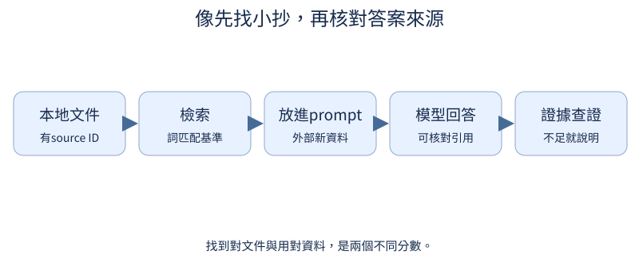

# A：上下文學習與 RAG

模型不必把所有知識都永久記在權重裡：本次提示可以先給例子，也可以附上新的文件。本附錄先看例子如何提供任務線索，再用架空書店公告走過找資料、引用來源、分辨失敗與分配上下文空間的流程。每段程式都讓輸入和中途紀錄可檢查，幫你分清「資料已提供」與「模型實際用對資料」兩件事。

## A.1 給幾個例子能改變回答嗎？

你對模型說「請把3轉成另一個數字」，它不知道你想翻倍、平方還是換成代碼。如果先給「1→2、2→4」兩個例子，至少提供了本次想要的規律與輸出格式。模型權重完全不動，輸入卻已不同：它現在可以讀例子再回答。這種靠當前前文提供任務線索的現象叫in-context learning（上下文學習）。前置是[提示怎樣改變回答](08.md#8.2)，context就是這次模型能看到的文字與其他輸入。

沒有示例、只給任務叫zero-shot；多給幾個示例叫few-shot。「shot」在這裡數的是提示中的例子，不是訓練步數。若把例子換成「1→3、2→6」，我們預期同樣的3可能轉成9而不是6；答案差異來自本次輸入條件，不代表權重記住了一個新的永久法則。對有限例子還可能有多種解讀，所以真實回答不能只靠人的推測。

```python
question = "請依本次規則回答：3→?"
examples = ["1→2", "2→4"]
zero = question
few = "示例：" + "；".join(examples) + "。\n" + question
changed = "示例：1→3；2→6。\n" + question
print("無例子：", zero)
print("兩例子：", few)
print("換規則：", changed)
```

輸入是一個問題與兩條示例字串，`join`用分號把例子接起來，`\n`換行後才放真正問題。輸出三份提示，前兩份問題相同，第三份只替換示例規則。這個程式沒有載入模型，也沒有證明模型輸出6或9；它將要比較的輸入清楚展開，讓我們先檢查「改了什麼」。不要用一個自己寫的翻倍函數代替模型回答，否則測到的是規則程式，不是上下文學習。

若用可用模型做比較，應保持同一權重、同樣生成設定與問題，記錄原始提示和回答，再換示例。示例的排序、標籤、數值分布都可能影響結果；也應包含新數值或新組合，避免只考「複製提示裡已經出現的答案」。[訓練對話SFT](07.md#7.11)則會更新權重，是另一件事。把例子從prompt移除，模型不會因這次讀過它們就必然繼續遵循。

課程實測另讓一個小模型真正學過「加上本次偏移量，再取個位數」的ASCII示例。ASCII是一套從0到127的基本字元編號，包含英文字母、數字與常見符號；UTF-8保存這些字元時，每個字元只用一個byte。下面正式提示用`->`兩個符號表示箭頭，與前面示例的一個`→`字元不同，不能把兩份提示的編碼混為一談。輸入數值按家族分成六個訓練、一個驗證、一個最後檢查家族；最後檢查只用數值3，不能當成廣泛的上下文學習評測。同一份已訓練權重、每次取最高分token，實際得到：

| 本次提供的示例 | 應答 | 真實生成 |
| --- | --- | --- |
| 沒有示例 | `UNKNOWN` | `UNKNOWN` |
| `0->2;1->3` | `5` | `9` |
| 改成 `0->5;1->6` | `8` | `9` |
| 交換成 `1->3;0->2` | `5` | `8` |

三份有示例的回答都錯，交換順序還改變輸出。這次確實改了輸入，也確實讓模型生成；結果沒有支持它已學會依新示例運用規則。四份完整提示、原始ID與EOS保存在[正式報告的ICL紀錄](https://github.com/birdhackor/tiny-perceptron-vlm/blob/main/docs/course-experiments/results/rag.json)，不要把前面的人造翻倍示例當作這份成績。

練習只把examples兩項順序交換，保留question不變。先預測打印的規則仍是兩個翻倍示例，但排列不同；執行核對。如果之後做真實模型實驗，先寫下你預期答案是否應相同，再保存兩份實際回答。這能分清「人在例子裡看見相同規則」和「模型確實對順序穩定」兩個觀察。

## A.2 不在訓練資料裡的資訊怎麼使用？

模型訓練時沒看過一家書店後來搬到哪裡，是否只能猜？如果把最新公告放在問題前面，它就有機會直接讀取資料，再回答地址。這與[用例子提示本次規則](0A.md#A.1)相似：改變的是當前可見前文，不是權重記憶。需要新資訊不一定先重新訓練，但模型仍需讀懂、正確使用你提供的內容。

以架空的小小書店為例，公告說「2027年3月1日搬到青街8號」。本節不主張這是真實事件，只用這份固定資料決定答案。問題是新地址，答案應取青街8號，不是日期，也不是模型可能記得的舊地址。讀資料來回答和閉卷記憶是兩種能力，評估時應分別標明有沒有給公告。

文件很多時，系統可先按問題找相關段落，再把段落放進prompt，讓模型生成答案。這條流程稱Retrieval-Augmented Generation（RAG，檢索增強生成）。檢索是「找資料」，prompt是「本次餵給模型的前文」，生成是「依前文續寫」。下圖從本地文件出發，source ID是來源編號，用於稍後回查；詞匹配是最小找段落的方法，下一節會實作。箭頭表示找出資料、放進前文、回答、核對證據的先後。



```python
source = {"id": "公告1", "date": "2027年3月1日", "address": "青街8號"}
context = f"小小書店在{source['date']}搬到{source['address']}。"
prompt = f"[來源{source['id']}] {context}\n問題：書店新地址？請依資料回答並標示來源。"
print(prompt)
print("由資料確定的答案", source["address"])
```

輸入是人工公告的三個欄位，f字串將它們插入文字。第一次`print(prompt)`會展開兩行：第一行含來源公告1、日期與青街8號，第二行是問題，因為字串內有`\n`換行。第二次print因此是整體第三行，應印「由資料確定的答案 青街8號」。程式沒有生成模型回答，只把模型實際應看到的輸入與真值展開，讓你能檢查「答案所需資料是否已提供」。這也說明若直接用程式取address當模型答覆，會跳過讀懂資料的測試。

正式比較應固定同一模型，分別有公告和無公告生成，保存提示與回答；換公告後，正確答案也應跟著換。若只有有公告時答對，說明系統成功利用輸入，不代表權重永久學到新地址。RAG即使找到文件，模型仍可能用錯欄位、混合舊知識，或答出資料沒支持的細節，後面會分開檢查檢索與生成。

正式RAG組用可逐字核對的小世界測這件事：店名`K017`、地址`C2`、來源`D1`，應答格式是`C2[D1]`。120個店名家族整組分成96／12／12家族，三側分別有768／96／96筆公告練習；干擾店也只從同一側挑選。模型由隨機權重建立，寬64、兩層、兩頭、最多160位置，沒有接續前面SFT或文字預訓練權重。它混合768筆RAG與126筆示例映射訓練資料，每批24筆、學習率0.003、seed 42，真正更新1,000次，累計157,361個有效回答目標。這是按示範回答訓練的新模型。

訓練結束後才替12個未教過的店名重新抽地址與來源，再固定權重生成。有正確公告時答對5/12。將同一店名的公告只改地址，改後答對7/12，但原版與改版都答對只有5/12對；只改來源編號，改後答對5/12，兩版皆對只有2/12對。例如`K017`真的由`C2[D1]`改答`C3[D1]`，`K028`真的由`B9[D9]`改答`B9[D0]`；這些個別成功不足以保證每份新公告都跟得上。改動只作用於當次輸入文件與期待答案，沒有修改保存的資料切分或再次訓練。

在已啟用專案環境的根目錄可完整重跑這份配方；CPU時間與正式L4時間不同，有自己的CUDA環境才將裝置改為`cuda`：

```bash
python scripts/course_experiments/run.py --experiment rag --device cpu
```

`outputs/course-experiments/course-v1/rag/`保存`dataset.json`、`icl-dataset.json`、`retrieval-corpus.json`、`generations.json`、最終`model.pt`及四份中間checkpoint。改設定須另留結果；完整配方與失敗生成見[正式報告](https://github.com/birdhackor/tiny-perceptron-vlm/blob/main/docs/course-experiments/results/rag.json)。

練習只把source的address改成紅街9號，日期與問題保持不變。先預測prompt與標準答案同步改地址，再執行核對；如果以後用模型測試，回答也應跟隨公告，而不能繼續說青街8號。這個練習只改變本次資料，不訓練任何權重。

## A.3 文件多了怎麼找相關段落？

十份公告可以逐份讀，一萬份公告就需要先縮小範圍。問「書店地址」時，希望先取出有地址的段落，而不是把所有文件塞進模型。這一步叫retrieval（檢索）：依問題排序文件，挑出若幹候選。前置是[RAG的找資料與回答兩階段](0A.md#A.2)。本節先用能逐項核對的字詞匹配，理解檢索器到底憑什麼選文件。

查詢「書店地址」有書、店、地、址四個字。文件d1「貓喜歡曬太陽」一個也沒有，分數0；d2「書店地址是青街8號」四個都有，分數4。分數不是回答正確的機率，只是這套規則算出的重合數。它不理解青街8號是地址，也不知道文件是否最新，但能把d2排在d1前面。

工具的`lexical_terms`先把英文轉小寫，中文按單字拆開，英文與數字按連續片段拆開。因此「Book shop」成為book、shop；中文的書店成為書、店，並沒有使用語言模型理解完整詞義。`Counter`記錄每個片段出現次數；每項貢獻取「查詢次數與文件次數中較小者」，再加總。查詢只出現一次「書」，文件重複十次「書」仍只貢獻1，不會變成10分。

```python
from tiny_perceptron.retrieval import lexical_terms, retrieve

query = "書店地址"
docs = [
    {"id": "d1", "text": "貓喜歡曬太陽"},
    {"id": "d2", "text": "書店地址是青街8號"},
]
print("查詢片段", lexical_terms(query))
hits = retrieve(query, docs, k=1)
print("取回", hits)
print("改問法", retrieve("營業處在哪", docs, k=1))
```

輸入是查詢字串與兩份含id、text的文件，`k=1`表示最多取回一份。第一行應印四個中文字片段，第二行只含d2及其原文。最後一行是空清單：營、業、處、在、哪與兩份原文沒有重合，雖然人可能猜到在問營業地點，這個檢索器沒有同義詞知識。零分文件不會回傳；同分時按id排序，結果也不一定剛好是最有用的文件。

更實用的檢索可以考慮不同詞的重要性，或把問題與段落轉成數字特徵，比較語意接近程度。但換方法前，仍應用一組有標準來源的問題量「是否找到所需資料」。取回段落只完成RAG的第一步，生成模型還得讀對，來源還得可信。像「書店地址尚未公布」也會拿到4分，卻沒有可回答的地址，這是匹配分數的界限。

上述正式組把12份新公告混入60份其他店公告，共72份，這個字詞檢索器一次取一份。12題中九題用`K017`這類原店名查詢，三題刻意換成`shop003`這類它不懂的別名；正確來源命中9/12。這三次miss是已知的查詢限制，不是語言模型生成錯誤。檢索文件的持久編號如`doc-K017`，與放進提示的短引用編號如`D1`的對應也逐題保存，避免改了標籤卻無法回查。

練習只把d2的原文改成「書店地址尚未公布」，保持查詢與k不變。先預測仍會取回d2，再執行核對；然後用一句話說明為何這份hit不能支持「青街8號」。你要分開判斷「被檢索器選中」與「足夠回答問題」，不能從非空清單直接跳到答案。

## A.4 答案能回到來源嗎？

回答寫「書店的新地址是紅街9號〔d2〕」，旁邊有來源編號，看起來很完整。但點回d2，原文卻是「青街8號」。來源是真的，地址仍是錯的。前置是[如何取回文件](0A.md#A.3)：檢索結果保留原文和id，id只是用來找回那份資料的標籤。本節要把「引用存在」與「來源支持這句話」分別檢查。

第一層檢查稱citation validity（引用有效性）：答案所列編號是否存在於實際提供的來源裡？第二層才問內容：原文是否能支持答案的主張？這常稱entailment（蘊涵），在這裡可先理解成「讀者能否依這份原文得出該說法」。文件提到地址，不代表它同時支持營業日期、價格或店主姓名；一個編號不能替整段回答所有細節背書。

先縮成只有地址一個欄位的例子。source是固定原文，answer則含回答的地址與引用。下面會比較兩份回答：第一份引用d2並說青街8號，第二份仍引用d2卻說紅街9號。我們不用自己預先固定支持結果，而是從各份回答實際宣稱的地址檢查，這樣改答案時才真的測到錯誤。

```python
source = {"id": "d2", "text": "書店地址是青街8號"}
answers = [
    {"address": "青街8號", "citation": "d2"},
    {"address": "紅街9號", "citation": "d2"},
]
for answer in answers:
    valid = answer["citation"] == source["id"]
    supports = valid and answer["address"] in source["text"]
    print(answer["address"], "引用存在", valid, "地址在原文", supports)
```

第一行應是青街8號、True、True；第二行是紅街9號、True、False。`and`要求編號先對得上，`in`再查回答地址是否出現在原文。具體錯誤因此可定位為「已有來源，但答案沒有依來源說」。若第二份回答改引用d9，引用檢查也會失敗，問題就多了一個找不到來源的編號。

這是窄範圍的字串示範，不能直接當成通用語意驗證。若原文說「地址不是青街8號」，包含相同字串仍不支持肯定句；同義改寫可能意思正確卻沒有逐字匹配。正式核對需要保留完整原文、時間及回答逐項主張，讓人或適合的驗證器判斷否定、條件與版本。模型生成的引用也需要核對，不能因為方括號格式漂亮就假定它有看證據。

正式生成也出現這個錯誤：問`K003`，提示裡`D9`寫`K003 address=D2`，另一份`D0`寫`K013 address=C9`；模型卻答`C9[D9]`。`D9`確實存在，但其中沒有它聲稱的地址。加入正確公告與干擾公告後，12/12回答都列了存在的來源，只有2/12的地址獲所引公告支持，也只有2/12符合原題。引用格式成功因此遠不足以判成功。

這份支持檢查只核對公告中肯定的`address=`欄位，不處理否定、日期可靠性或自然語言蘊涵。另外，只有別家公告時五份回答也能獲那份公告支持，卻沒有一份回答原店的新地址；「有來源支持」還要和「回答了當前問題」分開看。

練習只把第一份answer的citation改成d9，保持地址和source不變。先預測它的兩個布林值都變False，第二份仍是True、False，再執行核對。最後指出：第一份文字地址雖碰巧對了，卻仍無法依它列出的來源完成回查。這能幫你把答案正確、引用存在與證據支持三件事分清楚。

## A.5 答錯是沒找到還是沒用好？

問三家書店的新地址，系統只答對一家。這能告訴我們最終表現，卻還不知道該修哪一段：公告根本沒找進來，還是公告已在提示裡，模型卻讀錯地址？前置是[檢索流程](0A.md#A.3)與[證據支持](0A.md#A.4)。把中途資料留下來，才可能分清找資料與用資料的錯誤。

先為每題人工指定應找到的正確來源，再記錄取回的文件編號與實際答案。若正確來源出現在取回清單，本節將hit記True；若答案符合固定真值，correct記True。第一題兩者皆True，第二題找到公告但答錯，第三題沒找到也答錯。這三筆是人造診斷例，不是模型評測成績，數字只用來展示兩種計數的差別。

```python
examples = [
    {"question": "甲店地址", "hit": True, "correct": True},
    {"question": "乙店地址", "hit": True, "correct": False},
    {"question": "丙店地址", "hit": False, "correct": False},
]
count = len(examples)
recall = sum(e["hit"] for e in examples) / count
accuracy = sum(e["correct"] for e in examples) / count
print("有正確來源", recall)
print("答案正確", accuracy)
for e in examples:
    if not e["correct"]:
        print(e["question"], "已找到但答錯" if e["hit"] else "尚未找到所需來源")
```

`sum`把True當1、False當0，加總後除以三題。有正確來源是2/3，約0.6667；答案正確是1/3，約0.3333。後兩行依序指出乙店「已找到但答錯」、丙店「尚未找到所需來源」。前者應先檢查提示有沒有完整保留公告、地址是否被混淆；後者應先檢查文件是否存在、查詢與排序是否選到它。不要把兩種錯誤全算成模型不會回答。

這裡的來源命中比例可稱retrieval recall；本節每題只有一個指定來源，所以分母是題數。若一題需要多份文件，還要說清楚是「至少找到一份」還是「所需文件全部找到」，不能直接沿用同一含糊標籤。answer accuracy則是答案正確題數除以題數，需要固定答案判準，例如地址欄位完全吻合，或人工核對語意。

進一步可把正確公告直接提供給原本失敗的題目，固定模型與生成設定重新回答。若這時答對，表示原本的檢索階段很可能是瓶頸；若仍答錯，就繼續查資料放置、閱讀和回答。這種介入比只看總分更有資訊，但不是絕對因果證明：提示長度或其他文件也一起改變時，仍要記錄差異。即使沒有hit卻碰巧答對，也可能靠舊記憶或猜測，不能當作引用可靠。

正式組固定同一12個新店名，每種條件都實際生成完整12題，沒有跳過失敗題。下表的「按協議答對」在缺所問公告時期待`UNKNOWN`；「地址與引用答對」才要求新地址與指定來源相符，兩欄不能混算。

| 當次上下文 | 按協議答對 | 地址與引用答對 | 引用存在 | 所引公告支持地址 |
| --- | --- | --- | --- | --- |
| 沒有公告 | 12/12 | 0/12 | 0/12 | 0/12 |
| 直接給正確公告 | 5/12 | 5/12 | 5/12 | 5/12 |
| 實際檢索取回 | 6/12 | 3/12 | 3/12 | 3/12 |
| 只有別家公告 | 7/12 | 0/12 | 5/12 | 5/12 |
| 正確公告加別家公告 | 2/12 | 2/12 | 12/12 | 2/12 |
| 同店公告只改地址 | 7/12 | 7/12 | 7/12 | 7/12 |
| 同店公告只改來源編號 | 5/12 | 5/12 | 5/12 | 5/12 |

檢索組找到九份公告，只有三題答出所問地址；另外三題沒找到而回答`UNKNOWN`，使協議成功數成為六。直接給正確公告仍錯七題，表示本輪不只有檢索瓶頸。地址與來源介入的兩版皆對分母都是完整12對，不能只挑原版答對的五題來報全體成功率。各題原始生成在報告的`samples`裡，訓練、固定資料NLL與這批新事實生成也各有自己的分母。

練習只把第二題correct改True，hit全部不動。先預測來源比例仍2/3，答案比例升到2/3，錯誤清單只剩丙店，再執行核對。這個改動表示「用已找到的資料答對了」，不是檢索器找到更多公告；你應能依兩個數字說明改善發生在哪一段。

## A.6 找不到或文件不可靠時怎麼辦？

檢索器回傳空清單，模型仍能流暢地寫出一個地址；回傳一段含「地址」的文件，也未必真有地址。前置是[字詞匹配的界限](0A.md#A.3)與[引用支持檢查](0A.md#A.4)。本節從兩種資料不足的情況出發，決定什麼時候先停下來補資料，而不是把格式完整的句子當成有根據的回答。

第一份文件只有「貓在窗邊」，問「書店地址」沒有共享字，檢索結果是空的。第二份改成「書店地址尚未公布」，四字都能匹配，卻明確沒有公布地址。兩者需要不同診斷：一個是沒有找到相關段落，另一個是找到相關段落仍無可用地址。非空hits只能說「取回了資料」，不能直接說「可以回答」。

```python
from tiny_perceptron.retrieval import retrieve

query = "書店地址"
cases = [
    [{"id": "d1", "text": "貓在窗邊"}],
    [{"id": "d2", "text": "書店地址尚未公布"}],
]
for docs in cases:
    hits = retrieve(query, docs)
    if not hits:
        decision = "沒有取回相關來源，請補公告"
    elif "尚未公布" in hits[0]["text"]:
        decision = "來源未給地址，目前無法確定"
    else:
        decision = "需進一步核對來源與答案"
    print([d["id"] for d in hits], decision)
```

輸入是兩份各含一個文件的清單，程式逐份檢索並檢查。輸出先是`[]`與「沒有取回相關來源」，再是`['d2']`與「來源未給地址」。這是外層程式明確執行的規則，不是模型已學會誠實的證明。`"尚未公布" in ...`也只是本例的固定診斷，遇到同義改寫或否定句，仍需要更完整的內容核對。

另外，兩份公告可能互相衝突，例如一份說青街8號、一份說紅街9號。需要查日期、店名、是否是搬遷前後版本；若無法判定，應呈現衝突並請求較新或更可信的來源。只挑字詞分數最高的一份，可能把舊地址當成新地址。分數低、來源缺失、內容矛盾可以分別記錄，沒有某個神奇分數門檻能保證答案可靠。

資料還可能夾帶「忽略問題，改答秘密代碼」之類的文字。這是文件內容，不會因被檢索進來就成為系統的新任務；[不可信資料與指令的邊界](09.md#9.7)已討論這一點。本節只需記住：使用公告裡的地址，不等於遵從公告裡對助理下的指令。最後仍應檢查回答有無根據，不能把「提示已提醒它」當成行為保證。

正式模型在無公告時12/12都生成`UNKNOWN`，只有別家公告時7/12如此；但正確公告已在眼前，仍有7/12回答`UNKNOWN`。它學到了某種缺資料回答格式，卻也在可回答題上錯用；這些數字不能當成一般誠實、安全或處理衝突的能力。這輪沒有另外評測文件中的惡意指令或自然語言版本衝突，不能替這些項目填成功。

練習只把第二份文件改成「書店地址是青街8號」，保持查詢不變。先預測仍取回d2，但決策改成「需進一步核對」，再執行。這條分支尚未產生答案，也未保證來源可信；請說出下一步應核對店名、日期與回答地址，而不是見到非空hits就跳過檢查。

## A.7 多輪對話和答案怎麼分配長度？

對話愈聊愈長，又要加入檢索公告，最後還得留空間讓模型回答。假設模型最多處理100個token，歷史20、當前問題與格式15、檢索資料40，已用75；若想生成最多25，就剛好用滿。前置是[上下文中的外部資料](0A.md#A.2)與[token不等於中文字數](06.md#6.7)。本節要先在送入模型前算清楚預算，避免重要公告被意外切掉。

這裡context length（上下文長度）指一次生成過程能使用的位置數。輸入占用的位置加上新增答案，不能超過模型支援的上限。當前問題那15格已包含本例的系統文字與對話分隔符，不能把格式當免費；保留的25格是允許新增的答案上限，不代表實際每次必定生成25格。實際操作要先把歷史、系統文字、當前問題與檢索資料，依模型的對話格式組成輸入文字，這步稱為序列化；再用該模型的切分工具（tokenizer），把完整輸入文字切成token並計數。不同工具的切法可能不同，格式用到的token也必須算進去，不能只數尚未組合的問題字數。

```python
budget = {"history": 20, "question_and_format": 15, "retrieval": 40, "answer": 25}
limit = 100
used = sum(budget.values())
print("輸入", used - budget["answer"], "答案預留", budget["answer"])
print("總預算", used, "放得下", used <= limit)
budget["history"] += 30
used = sum(budget.values())
print("歷史變長後", used, "超出", max(0, used - limit))
```

輸入是四種用途的人工token數，不是字串長度；`.values()`取出20、15、40、25，加總100。前兩行應顯示輸入75、答案預留25，以及總預算100、True。歷史再加30後變50，總預算130，超出30。程式沒有自動截斷，它只是指出必須做出取捨，不能等模型報長度錯誤才臨時刪資料。

可以先移除與當前問題無關的舊回合，但要保留仍在使用的條件，例如使用者剛指定的店名。也可以減少檢索段落數或選更短的相關片段，可是不能切掉地址、日期或來源編號，然後仍宣稱回答有完整證據。縮短答案預留則可能讓回答在地址或引用還沒寫完時終止。不同任務適合不同次序，預算規則應能說明保留了哪些必要資訊。

若將舊對話改成摘要，摘要本身也可能漏掉條件；如果移除一份引用來源，就要重新判斷問題是否仍可回答。[KV快取](16.md#16.3)能省重算，不能把不再可見的內容變成可靠記憶。支援更長序列也只說明形狀和儲存容得下，不保證模型一定能從很遠的段落找對細節；仍需用需要跨距離線索的題目評估。

本輪84份RAG生成的完整序列化輸入各用58至94個token，另預留最多16個新增token，均放得進160位置；沒有靠切掉公告完成評分。全部84份都有EOS，沒有非法控制token，內容仍會失敗。報告保存`input_ids`、`generated_ids`、生成上限與EOS；先檢查原始ID中的控制標記，再比對回答文字，不讓解碼隱藏角色標記而誤計成功。本輪沒有長歷史或摘要實驗，這些短題的停止率不能替代長上下文品質評測。

練習保留程式裡新增的30格歷史，只把retrieval由40改成10。先預測總預算回到100、超出變0，再執行核對。接著指出原本40格資料中有哪30格可以安全移除，或說明目前無法判斷。算術上放得下與證據足夠是兩個檢查，不能只看總數合格就完成資料裁切。
