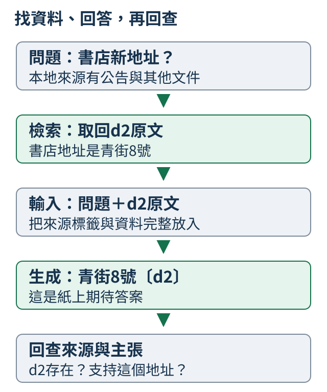
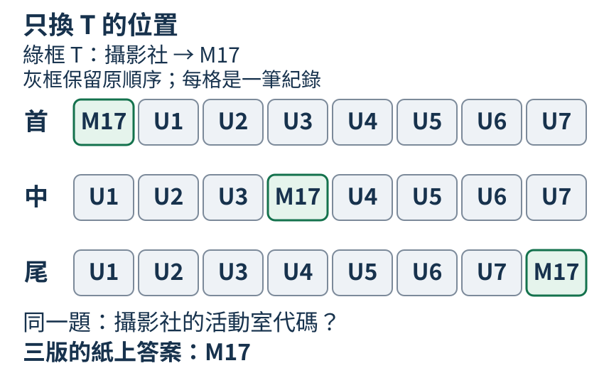
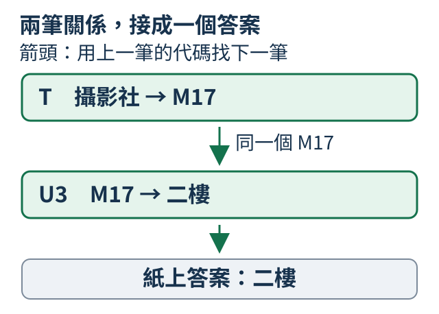
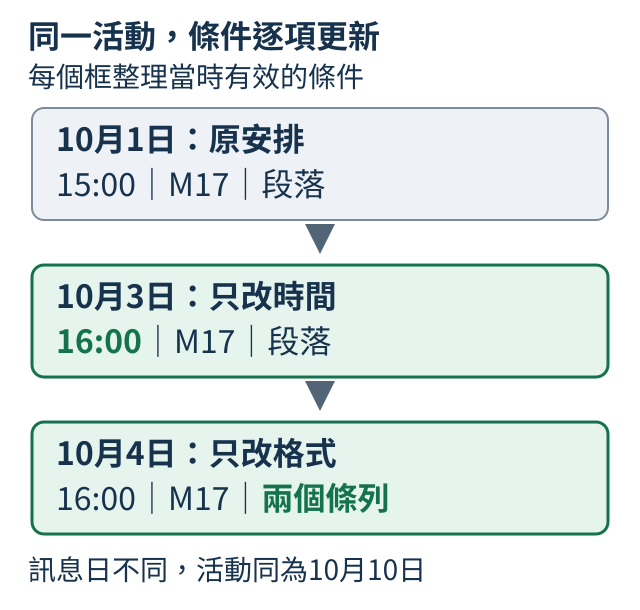

# A：把資料放進上下文，再核對是否用對

本次提示可以給例子，也可以附新公告。從架空書店出發，先找資料、讀欄位、回查來源，再分配長度與驗收遠處線索；讀到更長對話時，還要核對更新與缺資訊。各段短程式把輸入和中途資料展開，模型的實際回答另查。

## A.1 給幾個例子能改變回答嗎？

「請把3轉成另一個數字」不夠明確：翻倍、平方都說得通。先給1→2、2→4，再問3，能讓讀者猜到這次想用翻倍，紙上預期6；換成1→3、2→6，則預期9。例子和問題一起成為本次輸入，權重沒有因此更新。

這種在當前前文提供任務線索的方式叫上下文學習。沒有示例叫zero-shot，幾個示例叫few-shot；shot數提示中的例子，不數訓練步數。有限示例仍可能有多種規律，因此人的預期需要與模型的實際回答分開。

```python
question = "請依本次規則回答：3→?"
examples = ["1→2", "2→4"]
zero = question
few = "示例：" + "；".join(examples) + "。\n" + question
changed = "示例：1→3；2→6。\n" + question
print("無例子：", zero)
print("兩例子：", few)
print("換規則：", changed)
```

`join`以分號接例子，換行後放同一問題，程式展開三份提示，沒有模型。它讓我們先核對改的是示例，不是偷偷換了一道題。

若用模型比較，固定權重、問題與生成設定，只改示例，另留新數值與組合。交換例子順序可能改變輸出，也要記錄。把示例從提示移除後，沒有保證仍會沿用這次規則；SFT會更新權重，是另一種工作。

<details>
<summary>補充：舊小模型的ASCII示例映射結果</summary>

課程實測另讓一個小模型真正學過「加上本次偏移量，再取個位數」的ASCII示例。ASCII是一套從0到127的基本字元編號，包含英文字母、數字與常見符號；UTF-8保存這些字元時，每個字元只用一個byte。下面正式提示用`->`兩個符號表示箭頭，與前面示例的一個`→`字元不同，不能把兩份提示的編碼混為一談。輸入數值按家族分成六個訓練、一個驗證、一個最後檢查家族；最後檢查只用數值3，不能當成廣泛的上下文學習評測。同一份已訓練權重、每次取最高分token，實際得到：

| 本次提供的示例 | 應答 | 真實生成 |
| --- | --- | --- |
| 沒有示例 | `UNKNOWN` | `UNKNOWN` |
| `0->2;1->3` | `5` | `9` |
| 改成 `0->5;1->6` | `8` | `9` |
| 交換成 `1->3;0->2` | `5` | `8` |

三份有示例的回答都錯，交換順序還改變輸出。這次確實改了輸入，也確實讓模型生成；結果沒有支持它已學會依新示例運用規則。四份完整提示、原始ID與EOS保存在[正式報告的ICL紀錄](https://github.com/birdhackor/tiny-perceptron-vlm/blob/main/docs/course-experiments/results/rag.json)，不要把前面的人造翻倍示例當作這份成績。

</details>

## A.2 不在訓練資料裡的資訊怎麼使用？

小小書店的架空公告寫「2027年3月1日搬到青街8號」。問新地址，答案應是青街8號，引用公告1；日期只是支持版本的另一欄，不應拿來代替地址。即使模型訓練時不知道搬遷，只要當前拿到公告，就有資料可用。

文件多時，先依問題找相關段落，再放進模型前文讓它回答，叫RAG（檢索增強生成）。檢索負責找資料，生成負責讀資料回答；來源編號用來回查。這些都是本次上下文，不能把提供公告當成永久寫入權重。



```python
source = {"id": "公告1", "date": "2027年3月1日", "address": "青街8號"}
context = f"小小書店在{source['date']}搬到{source['address']}。"
prompt = f"[來源{source['id']}] {context}\n問題：書店新地址？請依資料回答並標示來源。"
print(prompt)
print("由資料確定的答案", source["address"])
```

程式插入公告欄位，印出真正要提供的資料與紙上答案，沒有生成。若直接把 `source["address"]` 當模型回答，會跳過本節要查的閱讀能力。

同模型可分有公告／無公告比較，再只換地址，要求答案跟新資料變；來源編號也可單獨換，以查引用是否跟著更新。模型可能讀錯欄、混入舊資訊或補出沒有根據的細節，下一節先把找資料那一站拆開。

<details>
<summary>補充：獨立實驗與成對改動</summary>

正式RAG組用可逐字核對的小世界測這件事：店名`K017`、地址`C2`、來源`D1`，應答格式是`C2[D1]`。公告練習按店名分組，同一店名的例子留在同一組；完整分組與訓練設定見本節末的正式報告。模型由隨機權重建立，沒有接續前面的SFT或文字預訓練權重，而是按示範回答訓練成一個新模型。

訓練結束後才替12個未教過的店名重新抽地址與來源，再固定權重生成。有正確公告時答對5/12。將同一店名的公告只改地址，改後答對7/12，但原版與改版都答對只有5/12對；只改來源編號，改後答對5/12，兩版皆對只有2/12對。例如`K017`真的由`C2[D1]`改答`C3[D1]`，`K028`真的由`B9[D9]`改答`B9[D0]`；這些個別成功不足以保證每份新公告都跟得上。改動只作用於當次輸入文件與期待答案，沒有修改保存的資料切分或再次訓練。

在已啟用專案環境的根目錄可完整重跑這份配方；CPU時間與正式L4時間不同，有自己的CUDA環境才將裝置改為`cuda`：

```bash
python scripts/course_experiments/run.py --experiment rag --device cpu
```

`outputs/course-experiments/course-v1/rag/`保存`dataset.json`、`icl-dataset.json`、`retrieval-corpus.json`、`generations.json`、最終`model.pt`及四份中間checkpoint。改設定須另留結果；完整配方與失敗生成見[正式報告](https://github.com/birdhackor/tiny-perceptron-vlm/blob/main/docs/course-experiments/results/rag.json)。

</details>

## A.3 文件多了怎麼找相關段落？

查詢「書店地址」，兩份文件是d1「貓喜歡曬太陽」和d2「書店地址是青街8號」。最簡單的找法是看共同片段：書、店、地、址在d2出現，四項都吻合；d1一項也沒有。這個分數能排序，還不是答案正確的機率。

`lexical_terms` 把英文轉小寫，中文按單字，英文與數字按連續片段。每項貢獻取查詢和文件次數較小者，再加總；查詢的書只一次，文件重複十次也只得1。

```python
from tiny_perceptron.retrieval import lexical_terms, retrieve

query = "書店地址"
docs = [
    {"id": "d1", "text": "貓喜歡曬太陽"},
    {"id": "d2", "text": "書店地址是青街8號"},
]
print("查詢片段", lexical_terms(query))
hits = retrieve(query, docs, k=1)
print("取回", hits)
print("改問法", retrieve("營業處在哪", docs, k=1))
```

`k=1`最多取一份，應取d2。改問「營業處在哪」則沒有共同片段，回空清單；同義意思沒有被這份字詞規則學到。零分文件不回傳，同分按id排序。

把d2改成「書店地址尚未公佈」，分數仍4，卻不能回答地址。這一個反例就分清了「被選中」與「資料足夠」。更好的排序可以使用詞權重或語意特徵，但仍需拿有指定來源的題目核對命中，不能從有非空結果就跳到可靠答案。

<details>
<summary>補充：舊公告庫的來源命中</summary>

上述正式組把12份新公告混入60份其他店公告，共72份，這個字詞檢索器一次取一份。12題中九題用`K017`這類原店名查詢，三題刻意換成`shop003`這類它不懂的別名；正確來源命中9/12。這三次miss是已知的查詢限制，不是語言模型生成錯誤。檢索文件的持久編號如`doc-K017`，與放進提示的短引用編號如`D1`的對應也逐題保存，避免改了標籤卻無法回查。

</details>

## A.4 答案能回到來源嗎？

答案說「紅街9號〔d2〕」，d2卻寫「青街8號」。編號真的存在，內容仍沒得到支持。引用需要兩層核對：先找得回這個編號，再看原文是否支持回答說的每件事。

引用有效性只查來源存在；支持性則查能否由原文得出主張。文件有地址，不代表同時支持店主名字或價格。下面只限制一個肯定地址欄位，方便把兩層分開看。

```python
source = {"id": "d2", "text": "書店地址是青街8號"}
answers = [
    {"address": "青街8號", "citation": "d2"},
    {"address": "紅街9號", "citation": "d2"},
]
for answer in answers:
    valid = answer["citation"] == source["id"]
    supports = valid and answer["address"] in source["text"]
    print(answer["address"], "引用存在", valid, "地址在原文", supports)
```

青街8號得True、True；紅街9號得True、False。`and`先確定編號相符，`in`再查該地址字串。把第一份引用改成d9，兩項都False，碰巧答對地址也沒有完成回查。

字串出現只是這個窄例的替代判準。原文若寫「不是青街8號」，同字串仍不支持肯定回答；同義說法也可能沒有逐字吻合。正式資料保留店名、日期、完整原文和逐項主張，依否定、條件與版本核對。

舊模型也曾對K003引用存在的D9，卻取了另一家K013的地址C9，輸出 `C9[D9]`。錯誤因此不是編號找不到，而是答案與該來源不相符。來源有格式與來源能支持答案，不能混在一起。

<details>
<summary>補充：舊公告生成的支持檢查範圍</summary>

正式生成也出現這個錯誤：問`K003`，提示裡`D9`寫`K003 address=D2`，另一份`D0`寫`K013 address=C9`；模型卻答`C9[D9]`。`D9`確實存在，但其中沒有它聲稱的地址。加入正確公告與幹擾公告後，12/12回答都列了存在的來源，只有2/12的地址獲所引公告支持，也只有2/12符合原題。引用格式成功因此遠不足以判成功。

這份支持檢查只核對公告中肯定的`address=`欄位，不處理否定、日期可靠性或自然語言蘊涵。另外，只有別家公告時五份回答也能獲那份公告支持，卻沒有一份回答原店的新地址；「有來源支持」還要和「回答了當前問題」分開看。

</details>

## A.5 答錯是沒找到還是沒用好？

三家書店只答對一家，可能是沒有找到公告，也可能找到後讀錯。先為每題列出所需來源，再保存實際取回的編號與答案，就能把兩站責任分開。

下面是三份人工診斷紀錄。hit表示所需來源出現在取回清單，correct表示答案符合固定真值。甲兩項都對，乙找到但答錯，丙既沒找到也沒答對。

```python
examples = [
    {"question": "甲店地址", "hit": True, "correct": True},
    {"question": "乙店地址", "hit": True, "correct": False},
    {"question": "丙店地址", "hit": False, "correct": False},
]
count = len(examples)
recall = sum(e["hit"] for e in examples) / count
accuracy = sum(e["correct"] for e in examples) / count
print("有正確來源", recall)
print("答案正確", accuracy)
for e in examples:
    if not e["correct"]:
        print(e["question"], "已找到但答錯" if e["hit"] else "尚未找到所需來源")
```

有正確來源2/3，答案正確1/3。這裡每題只有一份指定來源，來源命中分母也是題數；需要多份來源的題目要另說「至少找到一份」還是「全部找到」。答案判準也預先固定，不能只看回答流暢。

先處理乙：核對最終提示是否完整保留公告，再查地址與引用。丙先查文件、查詢和排序。可以另把正確公告直接提供給失敗題，固定模型重新回答；若這時答對，檢索很可能是瓶頸，但提示長度或其他資料也變時要記下，不能當絕對因果證明。

只把乙的correct改True，來源比例仍2/3，答案變2/3。這個紙上變化發生在使用資料，不是多找了一份文件。後面的長上下文與對話題也沿這個區分保存中途資料。

<details>
<summary>補充：找到來源，仍可能用錯的實例</summary>

舊小世界實驗固定同一12個新店名的問題，每題只有一份所需公告，兩種條件都生成全部12題。這不是上方三筆人工紀錄。回答協議分兩支：有所問公告時，須答地址與指定來源，例如[A.2](0A.md#A.2)的 `K017` 應答 `C2[D1]`；沒有所問公告時，才答 `UNKNOWN`。兩支都算依回答協議答對，但 `UNKNOWN` 不是給出真實地址。

| 當次上下文 | 所問公告在上下文 | 地址與引用符合真值 | 依回答協議答對 |
| --- | --- | --- | --- |
| 直接給正確公告 | 12／12 | 5／12 | 5／12 |
| 實際檢索取回 | 9／12 | 3／12 | 6／12 |

三欄分母都是完整12道問題。檢索找到九份所問公告，卻只有三題答出正確地址與來源；另外三題沒有找到公告而答 `UNKNOWN`，使協議成功數成為六。因此「6／12依協議答對」不能當成六題地址正確。

直接給正確公告，仍有七題未答對，表示這次不只有檢索瓶頸。實際取回哪些公告、模型如何回答，仍要逐題並排查看；不能只按文字流暢程度判定使用成功。完整配方及原始生成見[正式報告](https://github.com/birdhackor/tiny-perceptron-vlm/blob/main/docs/course-experiments/results/rag.json)，這些有限公告題不替一般長文件問答填能力分數。

</details>

## A.6 找不到或文件不可靠時怎麼辦？

問書店地址，取回「貓在窗邊」為空；取回「書店地址尚未公佈」則有相關資料，卻仍沒有地址。前一種先補來源，後一種說明來源未提供。不要因回答可以寫得完整，就替兩種情況各編一個地址。

```python
from tiny_perceptron.retrieval import retrieve

query = "書店地址"
cases = [
    [{"id": "d1", "text": "貓在窗邊"}],
    [{"id": "d2", "text": "書店地址尚未公布"}],
]
for docs in cases:
    hits = retrieve(query, docs)
    if not hits:
        decision = "沒有取回相關來源，請補公告"
    elif "尚未公布" in hits[0]["text"]:
        decision = "來源未給地址，目前無法確定"
    else:
        decision = "需進一步核對來源與答案"
    print([d["id"] for d in hits], decision)
```

兩次依次是空清單與d2，決策分別為未取回來源、來源未給地址。這是程式的固定規則，沒有教模型誠實。把d2改成「書店地址是青街8號」，仍要核對店名、日期和答案，不能把非空當成可信。

兩份公告若一份青街8號、一份紅街9號，查看是否搬遷前後，或資料衝突無法確定。無法判斷時呈現衝突、請求較新來源；字詞高分不能決定哪份最新。

公告還可能夾帶「忽略問題」之類文字。資料中的地址可作證據，對助理下的新指令卻不是本次任務；這個邊界見[9.7](09.md#9.7)。可回答題與資料不足題都保留，才能發現模型把UNKNOWN錯用在明明有答案的題目，而不是每題拒答就算誠實。

<details>
<summary>補充：舊RAG的缺資料回答</summary>

正式模型在無公告時12/12都生成`UNKNOWN`，只有別家公告時7/12如此；但正確公告已在眼前，仍有7/12回答`UNKNOWN`。它學到了某種缺資料回答格式，卻也在可回答題上錯用；這些數字不能當成一般誠實、安全或處理衝突的能力。這輪沒有另外評測文件中的惡意指令或自然語言版本衝突，不能替這些項目填成功。

</details>

## A.7 多輪對話和答案怎麼分配長度？

共用100個位置的完整歷史生成，已放歷史20、目前問題與格式15、公告40，輸入用75，還能預留25個新token。若歷史增加30，總需求130，就要先決定刪哪些資料或少留多少回答。

此例假定decoder-only推論保留完整歷史，輸入P與新輸出預留G共用總上限C，按 `P+G≤C` 算。對話角色和分隔格式也佔位置；token由實際tokenizer切分，不能直接用中文字數取代。先把系統、歷史、問題與公告序列化成最終輸入，再數ID。

```python
budget = {"history": 20, "question_and_format": 15, "retrieval": 40, "answer": 25}
limit = 100
used = sum(budget.values())
print("輸入", used - budget["answer"], "答案預留", budget["answer"])
print("總預算", used, "放得下", used <= limit)
budget["history"] += 30
used = sum(budget.values())
print("歷史變長後", used, "超出", max(0, used - limit))
```

前兩行是輸入75、回答預留25、總100；歷史多30後總130、超30。這些是人工token數的算術，不是程式已經裁掉歷史。回答預留也只是上限，EOS可提早結束。

歷史可移除不相關舊回合，但仍在使用的店名與條件要留下。公告可選短片段，卻不能切掉地址、日期或引用；少留回答空間則可能在答案未完時截停。摘要也會漏資訊，因此裁切後重新判斷資料是否足以答題。

把公告40改成10，總數回100，但還要能指出拿掉的30格為何不影響證據。算術上放得下與證據足夠分開核對；[7.19](07.md#7.19)補充角色和生成的序列位置。即使預算合格，遠處線索也未必被穩定使用，下一節只移動同一線索來看這件事。

<details>
<summary>補充：舊短RAG輸入與停止紀錄</summary>

本輪84份RAG生成的完整序列化輸入各用58至94個token，另預留最多16個新增token，均放得進160位置；沒有靠切掉公告完成評分。全部84份都有EOS，沒有非法控制token，內容仍會失敗。報告保存`input_ids`、`generated_ids`、生成上限與EOS；先檢查原始ID中的控制標記，再比對回答文字，不讓解碼隱藏角色標記而誤計成功。本輪沒有長歷史或摘要實驗，這些短題的停止率不能替代長上下文品質評測。

</details>

## A.8 同一條線索，放在哪裡會有差嗎？

把下面八筆活動室紀錄交給助理，問「攝影社的活動室代碼是什麼？只回答代碼」。紙上答案是 `M17`：代碼是房間的標籤，不必猜它代表哪一層樓。現在保留同一份材料，把提供答案的那筆紀錄移到資料的開頭、中間或結尾，三次都應回答 `M17`。這樣可以問一件比「輸入放得下」更進一步的事：位置改了，助理還能穩定用到那條線索嗎？

| 紀錄標籤 | 原文 |
| --- | --- |
| T | 攝影社的活動室代碼是 M17。 |
| U1 | 棋藝社的活動室代碼是 B04。 |
| U2 | 合唱社的活動室代碼是 C26。 |
| U3 | M17 在二樓。 |
| U4 | B04 在一樓。 |
| U5 | C26 在三樓。 |
| U6 | 美術社的活動室代碼是 E31。 |
| U7 | E31 在二樓。 |

T、U1 這些標籤讓我們能追蹤紀錄，並不是活動室代碼。這一題只需要 T；其他紀錄雖與活動室有關，都不能替代攝影社與 `M17` 的對應。



圖中每格是一筆紀錄，不是一個 token。先將 T 放在第一筆；再拿起同一張 T，插到第四筆；最後移到第八筆。U1 到 U7 的相對順序保持不變，沒有新增公告、改寫線索或另換問題。這裡的「首、中、尾」指**資料段**的位置，問題始終放在資料段之後。因此尾端版本的線索比較靠近問題，這正是要觀察的位置差異，不是把問題也一起搬動。

若真的拿模型比較，三版要使用相同的完整輸入長度、同一句問題、同一句線索，以及相同的新回答上限。依 [A.7](0A.md#A.7) 的方法，先完成對話格式的組合，再核對三版的 token 數一致，且八筆紀錄都完整留下；中文字數相同還不夠。模型權重、解碼方法與其他設定也保持固定。若重排後 token 數不同，先調整三版共用的紀錄分隔格式，重新核對長度，再開始比較，不能把多出的長度當成位置效應。

紙上可以先畫三欄「首、中、尾」，每欄填上期待答案 `M17`。之後若有實際生成，再各自記下原始回答、代碼是否正確，以及回答是否完整結束。例如 `M17` 是正確內容；`B04` 是取錯紀錄；只輸出 `M` 而耗盡回答上限，還有未完成輸出的問題。把這些差別留下來，比只記「成功／失敗」更容易找出要檢查的地方。

還可以另外準備只含 T 與同一問題的短版。短版若也答錯，就先檢查模型是否懂這個提問及代碼格式；短版答對而長版失敗，才有理由繼續查長度、位置或幹擾。短版是另一個診斷條件，不與三個等長版本混算。

在多題比較中，若中間位置常比首尾位置差，可以描述「這個模型在這組題目上對位置敏感」。也可能三處都答對，或出現別的排列。位置測試的用途是把差異量出來，沒有預先指定每個模型都必須畫出中間較低的 U 形曲線。即使三處都成功，也只驗收了這種單線索取回；下一節會問，需要多筆資訊時又該怎麼查。

<details>
<summary>補充：來源與例子的界線</summary>

本節的位置控制參考 Liu et al., [*Lost in the Middle: How Language Models Use Long Contexts*，arXiv:2307.03172v3](https://arxiv.org/pdf/2307.03172v3)，§2.1–2.3、§3.1。原論文在多個當時模型與設定觀察到首尾較好、中間較差，也有部分合成取回任務接近全對。本節的八筆紀錄是教學用紙上材料，沒有重現原論文評測，也沒有提供本課模型的位置成績。

</details>

## A.9 找到一條資訊，就代表讀懂長文嗎？

沿用上一節的八筆紀錄，固定它們的排列，不再移動線索。問「攝影社的活動室代碼」只要答 `M17`；若改問三個社團的代碼，答案就要有三筆；若問攝影社的活動室在幾樓，還得把社團與樓層接起來。材料相同，三種問題需要用到資訊的方式卻不同。

下表再列出這次會用到的四筆，其餘四筆仍保留原樣。

| 紀錄標籤 | 原文 |
| --- | --- |
| T | 攝影社的活動室代碼是 M17。 |
| U1 | 棋藝社的活動室代碼是 B04。 |
| U2 | 合唱社的活動室代碼是 C26。 |
| U3 | M17 在二樓。 |

先只查一筆：「攝影社的活動室代碼是什麼？」T 已直接給出 `M17`，不需要讀 U3 才能回答。常見的「在長材料中找一根針」測試，就是把這種短線索放進許多其他文字，檢查能否取回指定資訊。答對說明這次找到了所問的代碼，還沒有檢查是否能列全多筆資料，或連接分散的關係。

接著只增加要取回的筆數：「按攝影社、棋藝社、合唱社的順序，列出各自的活動室代碼。」紙上答案是 `M17、B04、C26`，分別來自 T、U1、U2。三筆之間不用推導，只要每筆取對並照要求列全。若回答 `M17、B04`，已找對兩筆，仍漏了合唱社；若多加 `E31`，則帶入題目沒有要求的美術社。完整取回要同時檢查漏項、錯配與多項，不能只看答案裡是否出現 `M17`。

第三次仍用同一份紀錄，改問：「攝影社的活動室在幾樓？」這回不能直接抄 T，也不能看見某筆寫「一樓」就選它。先依 T 得到房間 `M17`，再用這個代碼對上 U3，才得到「二樓」。



圖中的箭頭表示「把第一筆得到的代碼，用來找第二筆」，不是說模型一定照這兩步運算。我們能直接核對的是答案是否與兩筆紀錄一致。若答「一樓」，可能把 U1 的棋藝社→B04，接上 U4「B04 在一樓」的路徑，錯套到攝影社；若只答 `M17`，則停在房間代碼，還沒有回答樓層。這些錯例的用途，是指出回答缺了哪個關係，不是替模型的內部過程下定論。

三種題目的期待答案可以放在一起看：

| 需要完成的工作 | 紙上答案 | 核對的重點 |
| --- | --- | --- |
| 取回一筆 | M17 | 社團與代碼是否對應 |
| 取回指定三筆 | M17、B04、C26 | 是否列全、無多項且順序正確 |
| 組合兩筆關係 | 二樓 | 樓層是否符合 T、U3 的共同對應 |

真正評測時，這三類應分開記錄，再各自增加長度或移動必要線索。組合題要保留兩筆相關紀錄，不能刪掉 U3 後還期待模型答出樓層。也先用只有必要紀錄的短版檢查同題能否完成；若短版已接錯關係，就不能把長版失敗全歸因於資料太遠。比較位置時仍按上一節固定總長度與生成設定。

單筆取回、多筆取回與組合線索，都只是長文能力的一部分。整理活動手冊的摘要還要判斷哪些內容重要，核對多份公告可能還要處理版本衝突，這些工作沒有被上述代碼題涵蓋。教材因此按「答案需要哪些資訊」安排驗收，而不把某次找到一個代碼當成整份長文都讀懂的證據。

<details>
<summary>補充：來源與例子的界線</summary>

Hsieh et al., [*RULER: What's the Real Context Size of Your Long-Context Language Models?*，arXiv:2404.06654v3](https://arxiv.org/pdf/2404.06654v3)，§3.1–3.4、Table 2，區分單筆取回、多筆取回與多步追蹤等任務；本節借用這個區分，沒有重現完整 benchmark。

[*Lost in the Middle*](https://arxiv.org/pdf/2307.03172v3) 的多文件問答在 §2 使用多份文件，但恰好只有一份含答案，不能僅從「多文件」名稱推論它驗收了跨文件組合。Bai et al., [*LongBench*，arXiv:2308.14508v2](https://arxiv.org/pdf/2308.14508v2)，§3.2.1，則涵蓋摘要及包含多跳資料集的多文件問答，說明長文任務還有其他要求。本節展示的都是人工可核對的材料與答案，沒有訓練或模型成績。

</details>

## A.10 對話很長，最新的條件如何驗收？

你請助理提醒攝影社活動，先說下午三點集合，過幾天改成四點，又把提醒的寫法改成兩個條列。現在問「請提醒我十月十日何時在哪集合」，應得到新時間、原地點與新格式。不能只記住第一次的安排，也不能因為最後一則訊息沒提地點，就把地點丟掉。

先讀同一段對話中的三則訊息。左欄是訊息發生的日期，活動日期一直是十月十日。

| 訊息日期 | 使用者說的話 |
| --- | --- |
| 10月1日 | 10月10日攝影社活動，15:00在活動室M17集合。提醒請用一小段文字。 |
| 10月3日 | 同一場活動改成16:00集合，地點不變。 |
| 10月4日 | 提醒改成兩個條列，每項只寫一句。 |

問目前安排時，可以先在紙上圈出每個欄位仍然有效的內容：時間是十月三日改過的 `16:00`，地點仍是 `M17`，格式是十月四日要求的兩個條列。「更新」在這裡指某個條件被明確替換；只改時間，就不連帶改掉活動日期與地點。



圖中的每個框整理當時有效的條件。現在依最新安排作答，期待的是：

- 10月10日16:00集合。
- 地點是活動室M17。

這份紙上答案讓內容與偏好都可分開核對。若答成 `15:00`，沿用了被改掉的時間；若時間、地點都對，卻寫成一大段，則沒有符合目前的提醒格式。兩種錯誤應各自留下來，不能用「記得活動」這個模糊標籤合在一起。

同一段對話還可以換一個時間範圍來問：「截至10月2日，我當時安排幾點集合？」這題的答案是 `15:00`。它問的是更新以前的安排，所以不能拿現在的 `16:00` 覆蓋過去。核對時要先看問題問「目前」還是「截至某日」，再選那個時間範圍內有效的條件。記住新值與能回答舊值，是兩個不同要求。

再問：「活動結束後去哪裡喫晚餐？」三則訊息都沒有提供晚餐安排。合理的回答例如「對話中還沒有晚餐地點；你希望去哪裡喫？」這次應指出缺少的資訊並澄清，而不是把活動室當餐廳，也不是隨手補上一個店名。有明確條件的題目要能回答，沒有條件的題目要能停下來補問，兩種都需要驗收；每題都說不知道也不能完成任務。

若之後加入很長的其他對話，仍可保留這三種問題：目前安排、指定日期的舊安排，以及從未提供的安排。每題保存模型實際收到的完整歷史、問題與回答，分別檢查時間、地點、格式和是否需要澄清。較短版本也保留同樣的三則關鍵訊息，讓我們先知道它是否能處理更新規則，再看增加距離和幹擾後是否仍穩定。

這裡先假定三則訊息全部送入模型。若另用摘要或檢索來保留歷史，則要沿 [A.5](0A.md#A.5) 的區分，先查新時間及格式是否真的找回，再查回答是否用對；找回舊訊息卻漏掉更新，是資料選取的一種失敗，不能全算成模型讀了全文仍記錯。反過來，全文已收到也不代表最新條件一定被正確使用。

<details>
<summary>補充：來源與例子的界線</summary>

這組有限示例受到 Wu et al., [*LongMemEval: Benchmarking Chat Assistants on Long-Term Interactive Memory*，arXiv:2410.10813v2](https://arxiv.org/pdf/2410.10813v2)，§3.1–3.4 啟發。原評測有500個問題，涵蓋資訊擷取、跨對話時段推理、知識更新、時間推理與資訊不存在時棄答。§3.4 也分開完整歷史閱讀與記憶／檢索系統等條件。本節使用自行寫出的三則訊息與明確紙上答案，沒有使用原資料集或原評分程序，也沒有執行模型評測，不能據此宣稱助理已具備一般長期記憶能力。

</details>
