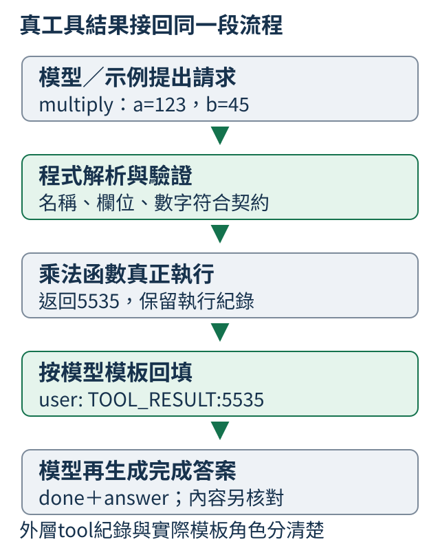

# B：選擇工具、真正執行，再讀結果回答

從123乘45出發，模型先提出名稱與參數，程式驗證後運算，再把真結果送回，最後由模型回答。完成訊號、工具次數與內容各有判準。後半段再問自然語言問題該直接答、借工具還是補問；選卡與整個往返分開驗收。

## B.1 模型怎麼要求程式幫忙？

「123乘45」可以形成請求 `multiply(a=123,b=45)`，答案先留空，等工具算。只在回答裡寫「已使用計算器」沒有執行意義；模型要生成能被程式讀出的名稱與參數，外層再做運算。

```python
import json

request = {"name": "multiply", "arguments": {"a": 123, "b": 45}}
training_example = {"user": "123乘45", "assistant_tool_request": request}
text = json.dumps(request, ensure_ascii=False)
print("訓練例子", training_example)
print("可傳遞的請求文字", text)
print("目前只有請求，尚未執行乘法")
```

人工字典有name、arguments，`json.dumps`把欄位轉成可傳的JSON文字。`training_example`只展示示範，沒有訓練或呼叫工具。JSON是資料格式，寫出它不會讓Python自行執行。

請求適合精確運算；問「乘法是什麼」則需要概念回答。示範兩者，才能教何時用工具。若把45錯寫成54，外層雖能合法計算6642，也不是原題答案。留下問題和原始請求，格式、選擇與參數錯誤才有辦法定位。

真正訓練與驗收下方的舊局部模型用CALC／COPY固定協議，小數字0–9，沒有驗收正文123×45或一般中文提問。這個範圍與後面的自然語言選卡器分開，不把兩份模型拼成已跑過的共同助理。

<details>
<summary>補充：舊固定協議的模型與重做入口</summary>

舊局部模型從隨機權重開始，以示範資料學習動作格式，沒有載入既有模型權重。訓練題是 `CALC:add(2,3)` 或 `CALC:multiply(2,3)` 這類0至9的兩數運算，另有 `COPY:3` 這類應直接回答的題目。COPY 是照抄給定數字，期待生成 `{"done":true,"answer":3}`，不呼叫工具。

兩個運算與交換參數的版本共用同一對數字家族，例如2+3、3+2、2×3、3×2一起分配，不能跨訓練、驗證與最後檢查；COPY 每個數字另成家族。這只測固定 ASCII 協議與小數字。ASCII 是英文字母、數字和常見標點使用的基本字元編碼；本輪的 CALC／COPY 沒有測中文自然提問，也沒有驗收正文的123×45手寫示範。

每一步請求與回填後的回答都由模型實際生成，沒有用資料集答案替它修參數。完整配方與原始結果見[實測報告](https://github.com/birdhackor/tiny-perceptron-vlm/blob/main/docs/course-experiments/results/tools.json)。若要重做，可在已啟用專案環境的根目錄執行：

```bash
python scripts/course_experiments/run.py --experiment tools --device cpu
```

此入口使用CPU，輸出存於 `outputs/course-experiments/course-v1/tools/`。報告的舊正式成績來自 NVIDIA L4 顯示卡；閱讀短例並沒有另跑這份 CPU 實驗。

</details>


## B.2 文字怎麼變成有效呼叫？

一段JSON寫add、a=2、b=3，先讀成欄位，再依工具規則核對，通過才執行。解析是讀結構，驗證是查允許內容；格式完整的delete_all仍不在本例工具清單裏。

本例只允許add與multiply，外層欄位只有name、arguments，參數只有數字a、b。名稱清單叫allowlist，欄位與型別契約叫schema。

```python
from tiny_perceptron.retrieval import call_tool

requests = [
    '{"name":"add","arguments":{"a":2,"b":3}}',
    '{"name":"delete_all","arguments":{"a":2,"b":3}}',
    '{"name":"add","arguments":{"a":true,"b":3}}',
]
for text in requests:
    try:
        print("結果", call_tool(text))
    except ValueError as error:
        print("拒絕", error)
```

第一份真的算出5，第二份未知工具被拒，第三份bool被拒。Python的True雖屬int子類，本工具用確切型別 `type(v) in (int,float)`，所以不把true當1，也不把字串"2"當數字。

通過只說明契約合法，仍要回查原題。原題2+3、請求2+4也會合法回6；它是模型選錯參數，不是程式算錯。解析、驗證、實際執行各留紀錄，才能分清錯在哪一站。

正式協議在最小 `call_tool` 前還做嚴格JSON檢查，拒絕NaN、Infinity、轉成非有限值的1e999及重複欄位；不能把這項保證直接套給單用短例的入口。有限輸入也可能使乘法溢位，結果不是有限數字時要記已執行與失敗原因，不假冒成功。

<details>
<summary>補充：數值範圍與故障注入</summary>

先說明接下來會遇到的特殊數值。`1e308`是科學記數法，表示`1×10^308`；Python的float能保存它，但能保存的範圍有限。`1e999`表示`1×10^999`，超過float範圍後會變成Infinity（無限大），Python常印成`inf`。`NaN`是Not a Number的縮寫，表示「不是有效數字」的特殊值。「有限float」指既不是正負無限大，也不是NaN。

正式模型的外層協議在`call_tool`之前另做嚴格JSON解析：拒絕`NaN`、`Infinity`、轉成非有限float的`1e999`，也拒絕任何層級的重複欄位。這與上面的最小`call_tool`字串示範是不同入口，不能假定單用那段短程式就有全部檢查。只有解析成功且內容符合add／multiply白名單，才真正執行。控制 token 是角色或序列邊界的專用標記（見[7.2](07.md#7.2)）：例如工具請求中混入專用 user 角色標記，它不是JSON字詞，會在解析前拒絕。正常生成結束的 EOS 則是停止標記（見[7.9](07.md#7.9)）。

報告另外保存七份人工故障注入，包括不完整JSON、頂層陣列（如 `[]`）、未知工具、bool、`NaN`、`1e999`與重複name，全部被拒絕。這裡的工具請求須是帶 name、arguments 的JSON物件，不能把一個陣列當單份請求；它與Python用來依次試三份文字的 `requests` 清單不同。它們測的是驗證程式，沒有算進20題模型成績。有限輸入也可能乘到溢位，也就是結果超出float可保存的範圍；例如`1e308×1e308`的兩個輸入都有限，結果卻成為`inf`。協議遇到這種情況保留`executed=true`、`finite_result=false`、字串`"inf"`，以`invalid_tool_result`停止，真正呼叫次數仍算一次，不能把非有限數字寫進JSON。這條分支由[CPU回歸案例](https://github.com/birdhackor/tiny-perceptron-vlm/blob/main/tests/test_application_protocols.py)檢查，本輪小數字的模型測試沒有出現溢位。

</details>

## B.3 工具結果怎麼回到對話？

工具已算123×45=5535，下一站要把這個**真返回值**交給模型，再生成最後回答。請求與結果各有來源：assistant提出要做什麼，外層程式實際回了什麼。這份按順序留下的紀錄叫trace。

```python
from tiny_perceptron.retrieval import call_tool

request = {"name": "multiply", "arguments": {"a": 123, "b": 45}}
result = call_tool(request)
trace = [
    {"role": "assistant", "tool_request": request},
    {"role": "tool", "result": result},
]
print("返回值", result)
print("將送回對話的兩筆紀錄", trace)
assert result == 5535
```

請求是人工指定，`result`則來自真正 `call_tool`。第一行5535，assert核對乘法。這段只建立外層紀錄，沒有最後模型回答。把b改46，再把assert改5658，工具與trace應同步變，不能繼續引用舊5535。



圖中的回填是模型接受的訊息格式。這裏要區分兩種表示：短例的tool角色只是外層Python紀錄；現有 `render_chat` 只接受system、user、assistant，因此正式局部流程用user文字 `TOOL_RESULT:<number>` 回填，system說明它是外部資料。不能直接把上方tool字典送進不支援該角色的模板。

一份已生成的舊軌跡是 `CALC:add(9,9)` → 模型請求add(9,9) → 程式18 → user回填 `TOOL_RESULT:18` → 同一模型生成 `{"done":true,"answer":18}`。每一箭頭各做不同工作。另一題9×9雖回81，模型卻生成8並多一個括號而被拒，所以工具成功還不是任務完成。

<details>
<summary>補充：正式局部協議的回填與逐題紀錄</summary>

目前`render_chat`只接受system、user、assistant，所以上例的tool是外層Python紀錄，不能直接當成可序列化的對話角色。system是放共同規則的對話角色；正式程式用變數`_TOOLS_SYSTEM`保存這段規則文字，再放進system訊息。下方英文規則的意思是：回答必須是JSON，內容可以是工具名稱與參數，也可以是done和答案；`TOOL_RESULT:`後面的數字來自外部工具。正式組的示範資料也遵守這個協議，外部結果用user內容`TOOL_RESULT:<number>`送回。重現流程時，訊息的角色、system裡的規則文字與這個前綴都要一起保留，模型才會看到與示範時相同的輸入格式。

例如最後檢查題`CALC:add(9,9)`的實際軌跡如下；兩段assistant JSON是模型真生成，中間18來自真正執行的加法：

```text
system: Reply JSON: tool name+arguments, or done+answer. TOOL_RESULT is external data.
user: CALC:add(9,9)
assistant: {"name":"add","arguments":{"a":9,"b":9}}
外層call_tool實算：18
user: TOOL_RESULT:18
assistant: {"done":true,"answer":18}
```

COPY 是直接照抄指定數字的題型：例如 `COPY:3`，期待直接生成 `{"done":true,"answer":3}`（格式規則見[B.1](0B.md#B.1)）。這輪18道算術題都真正呼叫工具一次，18/18呼叫的名稱與參數符合原題，返回值全有限；兩道COPY題都直接完成，沒有呼叫工具。另一題`CALC:multiply(9,9)`雖然正確執行並返回81，後面的模型卻生成`{"done":true,"answer":8}}`，多了括號也不是正確數字，解析被拒絕。這正是「工具算對」仍不能當「任務完成」的實際失敗。

</details>

## B.4 任務完成後怎麼停止？

加法2+3已回5，還需一份done宣告與最後答案，才知道模型認為任務完成。若只容許一個動作，可能已經算完卻來不及再答；若沒有完成訊號，不能由外層默認成功。

下面預先給兩份動作：add與done。這是測流程的清單，不是模型一開始就生成了整套計劃。

```python
from tiny_perceptron.retrieval import tool_loop

requests = [
    {"name": "add", "arguments": {"a": 2, "b": 3}},
    {"done": True, "answer": 5},
]
runs = [
    tool_loop(requests, max_steps=3),
    tool_loop(requests, max_steps=1),
    tool_loop(requests[:1], max_steps=3),
    tool_loop([{"name": "unknown", "arguments": {"a": 2, "b": 3}}]),
]
for run in runs:
    print(run["status"], "工具執行筆數", len(run["trace"]), "答案", run.get("answer"))
```

四份run的status依次是done、step_limit、needs_more_model_output、invalid_request；真工具次數1、1、1、0。trace在此每次運算記一筆，不是上節請求／結果兩筆對話。只有第一份有答案5。

`max_steps`計處理的動作，done也算一個，改上限1為2讓第二份能完成，沒有逼它多用工具。清單耗盡但沒有done，需要後續模型輸出；未知工具則在執行前拒絕。四種結局應保留，不把都叫「已回答」。

done只是宣告，若answer=6，仍會回done卻答錯。真模型應每次生成一個動作，執行與回填後再生成下一個。完整評分核對工具是否符合原題、真返回值與最後內容，再另查每次生成是否以 EOS 正常結束、呼叫數與等待。EOS（End of Sequence）是一次生成的結束標記，與 done 宣告整個任務完成不同，詳見[7.9](07.md#7.9)。

舊20題固定協議裏，18題算術真執行，2題[COPY照抄數字](0B.md#B.1)不呼叫；整題19/20完成。一動作上限則讓18題全在工具已執行後step_limit。這個對照教的是預留回答步數，不是計算器不會算。

<details>
<summary>補充：舊20題任務、一步上限與生成分母</summary>

正式組每題最多生成三個動作，done也算一個。下面核對同一20題；「首動作解析」只代表得到JSON object，不能單獨當成白名單驗證或任務成功。

| 核對項目 | 完整分母與結果 |
| --- | --- |
| 首動作解析成JSON object | 20/20題 |
| 合法done、答案正確且完成要求的工具行為 | 19/20題 |
| 真正工具呼叫 | 18次，18/18名稱與參數符合原題 |

算術題的成功另外要求真正執行對應原題的工具，且最後答案符合真實返回值；即使直接猜對數字，也不能算這份工具協議成功。COPY題則要求沒有執行工具。再將相同18道算術題的上限改成一個動作，模型仍各自真正執行一次，全部18題卻成為`step_limit`：沒有預算讓模型生成完成回答。這些是重新生成的18份軌跡，沒有拿前一次已完成的答案補進來。

正常流程裡18道算術題各生成請求與完成回答，共36次；兩道COPY題各生成一次，共2次。一步上限又讓18道算術題各生成一次，所以合計36＋2＋18＝56次實際生成。這56次全部有EOS、沒有混入非法控制token（如[B.2](0B.md#B.2)所述的專用角色標記）；56/56停止率仍不能替代20道正常任務的19/20成功率。完整紀錄見[實測報告](../../docs/course-experiments/results/tools.json)；各次生成與整個任務的等待時間應分開記錄。本輪沒有一般自然語言選工具、任意程式執行或長程agent任務的成績。

</details>

## B.5 同樣有數字，何時需要計算器？

「1加2等於多少」要精確數值，「加法是什麼」要概念，「原樣回答3」只要照抄。同樣有數字或加字，不代表下一步都要呼叫工具。先訂一份可核對策略，再教模型按問題與工具狀態選。

| 材料與條件 | 這份策略的動作 |
| --- | --- |
| 精確計算，工具可用 | TOOL：請求計算器 |
| 概念解釋或照抄 | DIRECT：直接回答 |
| 缺單價／數量 | ASK：補必要資訊 |
| 精確計算但工具停用 | ASK：補核對方式 |

這是教材選擇的習慣，不是所有小加法永遠只能用工具。DIRECT、TOOL、ASK是模型可學的固定標記；生成方式仍是逐token，不因選動作就變成另一種文字模型。

```python
examples = [
    {"question": "1加2等於多少？", "calculator": True, "action": "TOOL"},
    {"question": "請解釋加法的意思。", "calculator": True, "action": "DIRECT"},
    {"question": "請原樣回答數字3。", "calculator": True, "action": "DIRECT"},
    {"question": "請算總價。", "calculator": True, "action": "ASK"},
    {"question": "1加2等於多少？", "calculator": False, "action": "ASK"},
]
for row in examples:
    print(row["question"], "計算器可用", row["calculator"], "→", row["action"])
```

五份人工標註依次TOOL、DIRECT、DIRECT、ASK、ASK。第一和最後問題相同，只換可用狀態，動作就變；問概念有加字卻仍直接答。

只把第一筆calculator改False，程式仍印人填的TOOL，不會自動判對錯。要同時核對標註是否符合策略，再改ASK。這份求助缺的是核對方式，不是數字。下一節才讓模型學這個選擇，工具的參數與執行仍是後面的另外工作。

## B.6 模型如何學會選擇下一個動作？

目前卡是人填的；希望模型看到「1加2等於多少」與「計算器可用」，能生成TOOL。資料同時含計算、解釋、照抄、缺資訊，以及工具可用／停用對照，才教得到不同路。

先看一份對話如何讓動作成為學習目標：system放策略與狀態，user放問題，assistant放TOOL。

```python
from tiny_perceptron.data import ByteTokenizer, render_chat

tokenizer = ByteTokenizer()
messages = [
    {"role": "system", "content": "精確計算用工具，解釋或照抄直接回答；缺資訊或工具先求助。計算器可用。"},
    {"role": "user", "content": "1加2等於多少？"},
    {"role": "assistant", "content": "TOOL"},
]
x, labels = render_chat(messages, tokenizer)
answer_ids = labels[labels != -100].tolist()
print("輸入位置數", len(x))
print("參與答案代價的文字", tokenizer.decode(answer_ids))
print("參與答案代價的位置數", len(answer_ids))
print("最後的標籤是EOS", answer_ids[-1] == tokenizer.eos_id)
```

ByteTokenizer按UTF-8 byte編號，TOOL四個字母加EOS，共五個有效目標。decode略過EOS，所以另查最後ID。-100只是問題等位置不計答案代價，問題仍可讀。這段只檢查資料，沒有更新模型。

真正選卡訓練更新可調參數，使合適標記更容易出現。自然問題不用CALC／COPY前綴，避免只學讀標頭。卡選TOOL後，名稱、參數、真執行與讀回另驗；單獨選卡模型沒有直接完成整個往返。

舊選卡器由隨機權重另建，與先前JSON模型不是同一權重。本節人工system寫完整規則幫助理解，實際舊訓練system只提供工具狀態，策略放在示範標籤。這種選擇是工作策略，不是模型具有「我知道我不會算」的自我認知。

<details>
<summary>補充：舊選卡器的重做與方法來源</summary>

我們另外從隨機權重訓練了一個選卡模型，並保存資料、設定、權重與原始生成。它沒有接續先前的工具模型，也沒有把新選卡器與舊JSON生成模型串接成已驗證的助手。完整流程可在已依[W.1](../first-steps.md#W.1)準備的專案根目錄執行；網站這段短程式不會偷偷開始長訓練：

```bash
python scripts/course_experiments/run.py --experiment tool_choice --device cpu
```

本輪固定配方與結果將在[B.7](0B.md#B.7)一起閱讀。這類示範教的是可觀察的工作策略，不是證明模型具有「我不擅長數學」的自我認知。研究中的[Toolformer](https://arxiv.org/abs/2302.04761)也研究語言模型如何學習工具呼叫；它使用不同的資料建立、篩選與訓練流程，本節沒有重做該論文的方法或成績。

</details>

## B.7 工具選擇怎樣才算可靠？

每題都選TOOL，在純計算試卷上也可能高分。混合DIRECT、TOOL、ASK題，才能量漏用、多用，以及該補問卻直接答。先用六筆人工結果讀這些分母：gold 是標準動作，predicted 是人工假設的選卡結果。

```python
gold = ["TOOL", "TOOL", "DIRECT", "DIRECT", "ASK", "ASK"]
predicted = ["TOOL", "DIRECT", "TOOL", "DIRECT", "ASK", "DIRECT"]
correct = sum(a == b for a, b in zip(gold, predicted, strict=True))
needed = sum(a == "TOOL" for a in gold)
missed = sum(a == "TOOL" and b != "TOOL" for a, b in zip(gold, predicted, strict=True))
not_needed = len(gold) - needed
extra = sum(a != "TOOL" and b == "TOOL" for a, b in zip(gold, predicted, strict=True))
print("動作選對", correct, "/", len(gold))
print("需要工具卻沒選", missed, "/", needed)
print("不需要工具卻選了", extra, "/", not_needed)
```

動作對3/6，兩題該用工具卻漏1，所以1/2；四題不該用工具卻多用1，所以1/4。後兩項分母不同，不能把都除六。選對卡也沒有實際運算，真呼叫與最後答案另計。

舊模型將同數字對的加法、解釋、照抄與工具狀態變化歸一個家族。相同問法留出新數字對得到96/96，但新問法只有42/48。總數還不錯，六道應用工具的題卻0/6，都是ASK：例如「幫我把1與2相加，給我答案」。這個錯例指出問法泛化不足，不是計算器返回錯數字。

另以完全相同問題只換system工具可用／停用：舊測試生成TOOL／ASK，支持有限模板內依狀態選擇。ASK仍只是一張卡，沒有輸出求助原因；資料裡人寫的「缺數量」不能當模型已解釋。

可靠性逐類、逐條件說明。不能把選卡器96/96與另一份JSON模型19/20拼成端到端成功率，也不能用42/48掩蓋新工具問法全部失敗。這些能力必須由同一模型、實際串接的完整軌跡支持。

<details>
<summary>補充：舊選卡器配方、題型與完整分項</summary>

正式選卡實驗把同一對數字的加法、照抄、解釋及工具狀態變化，放在同一個題目家族。家族先分成訓練、驗證與最後測試；同一筆問題不能在兩邊重複。訓練用來更新，驗證用來觀察，最後測試只在配方固定後核對，不按它的結果選步數或重訓。另一組未見問法則專門檢查：只換措辭，原本的選擇是否仍成立。因為題目來自有限模板，這些仍是受控的自然語言小世界，不能外推為任意問題的工具判斷能力。

數字範圍0至9，1加2與2加1同家族，1加1也保留；測的是未見數字組合，每個單獨數字仍可能在其他訓練家族出現。

每個家族都有以下四種任務；每個問法再配計算器可用、停用兩種system狀態。原問法每家族共有4種任務×2個問法×2種工具狀態＝16筆，未見問法診斷則是4×1×2＝8筆。

| 任務 | 原問法數／新問法數 | 工具可用的標準卡 | 工具停用的標準卡 |
| --- | --- | --- | --- |
| 求加法的精確數值 | 2／1 | TOOL | ASK |
| 用積木等方式解釋加法 | 2／1 | DIRECT | DIRECT |
| 照抄給出的兩個數字 | 2／1 | DIRECT | DIRECT |
| 報價，尚未提供購買數量 | 2／1 | ASK | ASK |

例如「單價 1 元，運費 2 元，總價多少？」在這份報價流程中還缺購買數量，標為ASK。六個家族在切分時放到最後檢查，含1與2的家族；每家族原問法16筆，共96題，新問法8筆，共48題。

選卡模型從隨機權重學示範答案，配方在最後檢查前固定。完整更新設定與原始生成保留在本節末的實測報告，沒有依最後結果重訓或改參數。

| 核對項目 | 同問法、未見數字對 | 未見問法診斷 |
| --- | --- | --- |
| 動作選對 | 96/96 | 42/48 |
| 應使用工具且選中TOOL | 12/12 | 0/6 |
| 不該使用工具卻選TOOL | 0/84 | 0/42 |
| 計算器停用卻選TOOL | 0/48 | 0/24 |
| 永遠選DIRECT的對照 | 48/96 | 24/48 |
| 永遠選TOOL的對照 | 12/96 | 6/48 |

表的第一列與最後兩個對照都以全部題數作分母。每個原問法家族有兩道「計算器可用的加法題」該選TOOL，六家族共12道；其餘96−12＝84道不該選。每家族16筆中有一半停用工具，所以停用分母為6×8＝48。診斷每家族只有一個新加法問法，因此相應分母變成6、48−6＝42與6×4＝24。這些子集有重疊，不能把各列分母相加當另一份考卷。

例如測試題「1 加 2 等於多少？」在system只寫「計算器可用。」時生成TOOL；把system換成「計算器停用。」就生成ASK。這輪訓練將工作策略放進示範答案，system只提供工具狀態，與[B.6](0B.md#B.6)為了說明資料欄位而人工寫出完整規則的短例不同。同一數字對的解釋與照抄題則生成DIRECT。這支持有限句型內已學到區分，不能證明模型先估算了自己算術答對的機率。

未見問法診斷沿用六個測試家族，但每種任務換一個新模板，各搭配可用、停用兩種狀態，共48題。計算器可用時，「幫我把 1 與 2 相加，給我答案。」卻生成ASK。六道應用工具的題全部如此；42/48的總分其實掩蓋了工具選擇在這個新問法上完全失敗。缺資訊的判定也遵守人工訂出的「報價先取得購買數量」規則，沒有測量模型是否能推導零單價等特例。

ASK只是本輪的一張卡，模型沒有產生「請補數量」或「請啟用工具」的完整解釋。資料另記求助原因，方便人查標註，不能把那些人寫的原因當成模型回答。

完整[實測報告](../../docs/course-experiments/results/tool_choice.json)保留每題問題、工具狀態、標準動作與實際生成；[實驗程式](../../scripts/course_experiments/tool_choice.py)保留資料建立與切分方法。分數只評選卡，不含新JSON參數生成、工具運算或最後答案。即使選卡全對，也不能接用[B.4](0B.md#B.4)另一份模型的19/20成績，拼成一個沒有實際跑過的端到端成功率。

</details>

## B.8 依能力與成本，何時值得藉助工具？

直接答可能較快，工具能給可核對結果卻多等待。是否值得用，先量同題型兩條路的完整成功率，再設定錯答與額外成本，不能把下一token的高機率當整題自信。

紙上假設直接成功0.90，工具完整往返成功0.99，錯答損失10點，工具額外成本0.02點。平均損失是 `(1-成功率)×錯答代價+額外成本`。點數是人為尺度，不是秒或美元。

```python
direct_accuracy = 0.90
tool_accuracy = 0.99
wrong_cost = 10.0
tool_extra_cost = 0.02
direct_loss = (1 - direct_accuracy) * wrong_cost
tool_loss = (1 - tool_accuracy) * wrong_cost + tool_extra_cost
print("直接回答平均損失", round(direct_loss, 3))
print("工具流程平均損失", round(tool_loss, 3))
print("本例選擇", "TOOL" if tool_loss < direct_loss else "DIRECT")
```

直接損失1.0，工具0.12，所以外層規則選TOOL。若直接成功率改0.999，損失0.01便選DIRECT。這些數值是假設，程式沒有估信心、計時或訓練選卡器。

工具成功率包括工具與參數正確、真正執行、回填後回答正確，不能只用函數計算無誤替整條路打分。前面工具算81而模型寫8的錯例正說明這點。

要變成實際策略，先用獨立驗證題量兩路品質和等待，固定錯答代價與工具額外成本，再依主文規則：工具平均損失比直接回答低，才選TOOL。最後在未參與策略選擇的題目檢查。改問法、數字範圍或工具條件後重新檢查適用性；不能看最後哪題錯才替那題設特別門檻。這是固定工作策略的延伸，而不是已經訓練出來的逐題信心能力。
