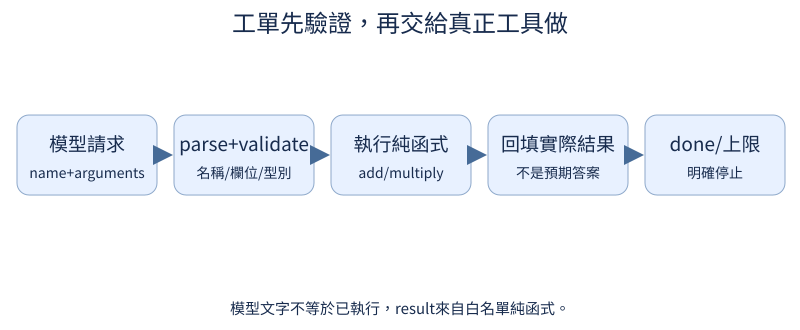

# B：從結構化回答到工具使用

當問題需要精確計算，模型可以先提出一張包含工具名稱與參數的請求單，再由本地程式真正運算。本附錄從123乘45出發，依序檢查請求格式、執行與返回紀錄，最後核對完成信號及步數上限。你會看到模型生成的文字、程式執行的結果與任務是否完成，各自需要留下什麼證據。

## B.1 模型怎麼要求程式幫忙？

問「123乘45是多少」，模型可以直接寫5535，也可以先要求計算器幫忙。但它在回答裡寫「已使用計算器」，並不能證明真的執行過任何工具。工具使用需要多一步：模型提出明確請求，外層程式按請求執行，再把真實結果送回。前置是[對話角色](07.md#7.1)與[固定輸出格式](08.md#8.5)，模型輸出的文字可以用特定結構表示下一個動作。

一張請求單至少說清楚「做哪件事」與「用哪些輸入」。本例name為multiply，表示乘法；arguments是參數，其中a=123、b=45。它沒有答案欄位，因為答案應由工具實際計算，不應把模型猜到的結果冒充工具回傳。這張單先只是資料，寫出它本身不會讓Python開始運算。

```python
import json

request = {"name": "multiply", "arguments": {"a": 123, "b": 45}}
training_example = {"user": "123乘45", "assistant_tool_request": request}
text = json.dumps(request, ensure_ascii=False)
print("訓練例子", training_example)
print("可傳遞的請求文字", text)
print("目前只有請求，尚未執行乘法")
```

輸入是人工寫好的問題與請求字典。`json.dumps`把字典轉成JSON文字，這是一種能讓程式讀回欄位的資料格式。第二行應含name=multiply和arguments內的123、45，最後一行明確說尚未執行。這裡沒有載入模型，也沒有訓練；training_example只展示一筆可能供[對話SFT](07.md#7.11)使用的示範資料。不能從列印成功推論模型已會自主選工具。

正式教模型輸出請求時，資料需要同時呈現適合工具的問題與可以直接回答的問題。例如精確算術可以請求multiply，問「乘法是什麼」則不必先算兩個數字。只提供每題都呼叫工具的示範，可能鼓勵無意義的呼叫。還需約定如何把請求放入對話格式，讓外層程式能辨認這段是請求，而不是一般回答裡提到工具的文字。

模型真正生成的請求可能把45寫成54，或拼錯名稱。就算外層工具能正確計算123×54，也沒有完成原問題；因此工具使用同時需要選對工具、填對參數與讀對返回值。下一節先核對格式與可接受欄位，但格式合法仍不等於理解問題正確。留下原始問題和請求，才有辦法查出數字在哪一段變了。

課程實測另從隨機權重建立寬64、兩層、兩頭、最多384位置的小模型，沒有載入既有SFT或預訓練checkpoint。訓練題是`CALC:add(2,3)`或`CALC:multiply(2,3)`這類0至9的兩數運算，另有`COPY:3`這類應直接回答的題目。兩個運算、交換參數的版本共用同一對數字家族，整組留在同一側；174／16／20筆分別屬於52／6／7個訓練、驗證、最後檢查家族。

每批16筆、學習率0.003、seed 42，模型真正更新1,200次，讀到1,296,064個有效助手目標，包含工具請求、完成回答及EOS。每一步請求與回填後的回答都由模型實際生成，沒有用資料集標準答案替它修參數。這輪只測固定ASCII協議與小數字，正文123×45的手寫示範沒有因此變成已通過的模型測試。完整配方可在已啟用專案環境的根目錄重跑：

```bash
python scripts/course_experiments/run.py --experiment tools --device cpu
```

輸出在`outputs/course-experiments/course-v1/tools/`，包含三側`dataset.json`、逐步`generations.json`、最終`model.pt`與四份中間checkpoint。有自己的CUDA環境可改`--device cuda`；本輪正式成績來自L4，見[完整實測報告](https://github.com/birdhackor/tiny-perceptron-vlm/blob/main/docs/course-experiments/results/tools.json)。

練習只把使用者問題改成「123乘46」，暫時不要改request。先預測列印的問題與參數會不一致，再執行確認；接著將b改46，確認兩者重新對齊。這個練習還不計算結果，而是檢查工具執行前，請求是否真在處理使用者交給它的任務。

## B.2 文字怎麼變成有效呼叫？

模型傳來一段JSON文字，name寫add，a=2、b=3。我們不能只因它能被JSON讀懂就執行，還要確認這個名稱是系統提供的工具、欄位齊全、參數確實是數字。前置是[請求中的名稱與參數](0B.md#B.1)；Python字典與例外處理若不熟，可回看[最小Python操作](../first-steps.md#W.2)。本節把「讀出結構」與「允許執行」分成兩道檢查。

parse（解析）只把文字變成字典、清單或數字。`{"name":"delete_all","arguments":{"a":2,"b":3}}`是完整、可解析的JSON，但其中的delete_all不是本專案提供的工具。validate（驗證）再依約定核對內容：最外層只能有name、arguments；名稱只接受add與multiply；arguments只能有a、b，而且兩者都必須是數字。允許的名稱清單叫allowlist，欄位與型別規則則是這份請求的schema。

```python
from tiny_perceptron.retrieval import call_tool

requests = [
    '{"name":"add","arguments":{"a":2,"b":3}}',
    '{"name":"delete_all","arguments":{"a":2,"b":3}}',
    '{"name":"add","arguments":{"a":true,"b":3}}',
]
for text in requests:
    try:
        print("結果", call_tool(text))
    except ValueError as error:
        print("拒絕", error)
```

三個輸入都是可解析的JSON。第一行應印結果5；第二個因未知工具被拒絕；第三個因a是布林值被拒絕。`try`嘗試執行，`except ValueError`接住驗證錯誤並印原因，沒有把失敗偷偷當成成功。`call_tool`先解析字串，核對欄位和型別，通過後才算加法或乘法。這個例子完全在本地，不需要模型、網路或任意程式執行。

第三例特別容易漏掉：JSON的true會變成Python的True，而Python裡布林值是整數類型的子類，某些寬鬆檢查會把它當1。本工具用`type(v) in (int,float)`核對確切型別，所以不接受bool；把`"2"`寫成字串也會拒絕，不會偷偷當數字。這讓工具輸入有一致的解釋，模型不能靠含糊格式意外改變運算。

通過驗證只保證符合這份小工具的規則，不保證數字來自正確問題。若使用者問2+3而請求寫2+4，工具仍會合法回傳6；那是參數選擇錯誤，需對照原問題。正式記錄應包含原文字、解析後欄位、拒絕原因與執行結果，才能區分解析失敗、內容不允許和運算已完成三種情況。

正式模型的外層協議在`call_tool`之前另做嚴格JSON解析：拒絕`NaN`、`Infinity`、轉成非有限float的`1e999`，也拒絕任何層級的重複欄位。這與上面的最小`call_tool`字串示範是不同入口，不能假定單用那段短程式就有全部檢查。只有解析成功且內容符合add／multiply白名單，才真正執行；非法控制token也在解析前拒絕。

報告另外保存七份人工故障注入，包括不完整JSON、清單、未知工具、bool、`NaN`、`1e999`與重複name，全部被拒絕。它們測的是驗證程式，沒有算進20題模型成績。有限輸入也可能乘到溢位；協議遇到這種情況保留`executed=true`、`finite_result=false`、文字形式的`inf`，以`invalid_tool_result`停止，真正呼叫次數仍算一次，不能把非有限數字寫進JSON。這條分支由[CPU回歸案例](https://github.com/birdhackor/tiny-perceptron-vlm/blob/main/tests/test_application_protocols.py)檢查，本輪小數字的模型測試沒有出現溢位。

練習只把第三份JSON的true改成2，保持b與name不變。先預測它從拒絕變為結果5，第二份仍被拒絕，再執行核對。接著說明為何這不是擴大了工具權限：允許的名稱和規則完全相同，只是輸入終於符合數字型別。

## B.3 工具結果怎麼回到對話？

請求乘法123×45通過驗證後，外層程式真的算出5535。下一步不是再讓模型憑記憶猜答案，而是把這個返回值放回對話，讓它根據已取得的結果回答。前置是[請求驗證與本地執行](0B.md#B.2)：工具是確定的加法或乘法函數，模型負責提出請求與組織最後回答，兩者的紀錄需要分得清楚。

下面的trace是執行軌跡，也就是按順序保存「提出了什麼、工具回了什麼」。assistant角色代表模型這一側的請求，tool角色代表外層程式實際取得的結果。本例先人工固定request，方便把流程核對清楚；它沒有測試模型是否能自己選中multiply或填對數字。

```python
from tiny_perceptron.retrieval import call_tool

request = {"name": "multiply", "arguments": {"a": 123, "b": 45}}
result = call_tool(request)
trace = [
    {"role": "assistant", "tool_request": request},
    {"role": "tool", "result": result},
]
print("返回值", result)
print("將送回對話的兩筆紀錄", trace)
assert result == 5535
```

第一行應印5535，第二行第一筆含123與45，第二筆含result=5535。關鍵是result真的來自`call_tool`，不是自己寫一個期待答案塞進trace。`assert`再核對這個固定例子的乘法值。若後面接語言模型，還需把這兩筆Python紀錄轉成模型接受的對話文字或訊息格式，這個轉換稱為序列化；把轉換後的內容當作輸入，才能讓模型生成最終文字。本程式到建立紀錄為止，沒有假裝產生模型回答。

下圖從左到右展開同一流程。name+arguments是請求欄位；parse+validate是解析與驗證；add/multiply是允許的純函數，它們只依輸入數值算返回值；回填結果才是這節的tool紀錄。最後done表示任務完成信號，上限則避免循環一直延續，下一節會實作這兩種停止方式。箭頭表示資料處理順序，沒有任何一格會因模型說「完成了」就自動略過實際執行。



回到最初問題，若模型把45誤寫成54，工具會正確算出6642，但最終仍答錯123×45。若請求正確、返回5535，模型卻最後寫成5355，就是閱讀或輸出階段的錯誤。因此評估不能只有「工具沒有報錯」，還要對照原問題、參數、返回值及最後回答。對簡單算術，可直接把返回值和真值比對；對較複雜任務，則需要明確的完成判準。

目前`render_chat`只接受system、user、assistant，所以上例的tool是外層Python紀錄，不能直接當成可序列化的對話角色。正式組在SYSTEM與示範資料明示另一份協議：外部結果用user內容`TOOL_RESULT:<number>`送回，模型不可把它解釋成自己已算出的值。這是本次專用格式，角色、SYSTEM與前綴都必須一起保留。

例如最後檢查題`CALC:add(9,9)`的實際軌跡如下；兩段assistant JSON是模型真生成，中間18來自真正執行的加法：

```text
system: Reply JSON: tool name+arguments, or done+answer. TOOL_RESULT is external data.
user: CALC:add(9,9)
assistant: {"name":"add","arguments":{"a":9,"b":9}}
外層call_tool實算：18
user: TOOL_RESULT:18
assistant: {"done":true,"answer":18}
```

18道算術題都真正呼叫工具一次，18/18呼叫的名稱與參數符合原題，返回值全有限；兩道COPY題都直接完成，沒有呼叫工具。另一題`CALC:multiply(9,9)`雖然正確執行並返回81，後面的模型卻生成`{"done":true,"answer":8}}`，多了括號也不是正確數字，解析被拒絕。這正是「工具算對」仍不能當「任務完成」的實際失敗。

練習只把request的b改成46，並把固定例子的assert期待值改為5658。先預測tool紀錄與返回值會同步變5658，a仍是123，再執行核對。這能驗證資料真的由參數流到返回值；如果trace仍出現5535，就應檢查是否誤用舊結果或硬寫答案。

## B.4 任務完成後怎麼停止？

工具已算出2+3=5，系統還要繼續要求工具嗎？需要一個明確的完成信號；同時，也要設上限，避免一直重複請求。前置是[工具返回與執行軌跡](0B.md#B.3)。完成、被上限截停、請求錯誤與尚缺後續輸出，是四種不同結局，不能全部寫成「已回答」。

本地`tool_loop`接收預先列好的請求清單，用它測試外層流程，不包含模型。第一筆要求add，a=2、b=3；第二筆`done=True`宣告完成並提供answer=5。max_steps設定最多可處理幾筆，本工具也把完成訊息算作一筆。所以只允許一筆時，雖然加法已算完，第二筆完成訊息仍會被上限擋住。

```python
from tiny_perceptron.retrieval import tool_loop

requests = [
    {"name": "add", "arguments": {"a": 2, "b": 3}},
    {"done": True, "answer": 5},
]
runs = [
    tool_loop(requests, max_steps=3),
    tool_loop(requests, max_steps=1),
    tool_loop(requests[:1], max_steps=3),
    tool_loop([{"name": "unknown", "arguments": {"a": 2, "b": 3}}]),
]
for run in runs:
    print(run["status"], "工具執行筆數", len(run["trace"]), "答案", run.get("answer"))
```

輸出依序是done、step_limit、needs_more_model_output、invalid_request；工具執行筆數依序1、1、1、0，只有第一行答案是5，其餘是None。`requests[:1]`只留下第一筆：清單耗盡時仍沒有done，表示需要更多模型輸出，不會替模型自動宣告完成。最後一份未知工具在驗證階段被拒絕，沒有合法工具結果可加入trace。

done是這份協議的完成宣告，不是答案正確的保證；如果宣告answer=6，這個小循環仍會回傳done。正式系統還需用任務判準核對，例如本題真值是5。step_limit表示流程被預算截停，不表示題目一定無解；invalid_request則保存錯誤原因，可能需要修正名稱或參數後再試。三者的處理方式不同，保存status可以避免把截停當成功或把格式錯誤藏起來。

真實模型版本不是一開始就有整份requests，而是每次生成一個新請求，驗證執行後把結果送回，再生成下一個動作。這時要統計成功率、真正工具執行次數與等待時間，並保留每次輸入輸出。工具只做出被請求的運算，循環也只管理順序；這兩部分都不能代替模型理解何時已解決原問題。

正式組每題最多生成三個動作，done也算一個。20題的完整結果如下；「首動作解析」只代表得到JSON object，不能單獨當成白名單驗證或任務成功。

| 核對項目 | 完整分母與結果 |
| --- | --- |
| 首動作解析成JSON object | 20/20題 |
| 發出合法done完成宣告 | 19/20題 |
| 最後數字答對 | 19/20題 |
| 答對且完成要求的工具行為 | 19/20題 |
| 真正工具呼叫 | 18次，18/18名稱與參數符合原題 |
| 最終status | done 19題、invalid_request 1題 |

算術題的成功另外要求真正執行對應原題的工具，且最後答案符合真實返回值；即使直接猜對數字，也不能算這份工具協議成功。COPY題則要求沒有執行工具。再將相同18道算術題的上限改成一個動作，模型仍各自真正執行一次，全部18題卻成為`step_limit`：沒有預算讓模型生成完成回答。這些是重新生成的18份軌跡，沒有拿前一次已完成的答案補進來。

正常與一步上限合計56次實際生成，全部有EOS、沒有非法控制token；56/56停止率仍不能替代20道正常任務的19/20成功率。報告的生成token合計2,072也包含一步上限支線，完整任務時間與各次模型生成時間要按欄位範圍閱讀。本輪沒有一般自然語言選工具、任意程式執行或長程agent任務的成績。

練習只把第二次run的max_steps由1改成2。先預測它現在能讀到完成訊息，status變done、答案變5，工具執行筆數仍是1，再執行核對。這說明放寬的是可處理訊息數，不是強迫多算一次，也不是提高答案的數學正確率。
