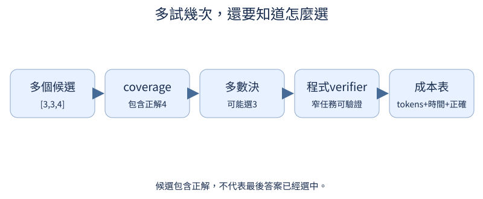

# C：推理步驟、驗證與測試時算力

前置：下一字生成、SFT與標準答案驗證。像解數學題：寫出步驟、多試幾種辦法、檢查答案，是三個不同動作。真實推理質量需要trained模型；默認例子用可驗證的數字，避免把長文字當思考保證。

## C.1 寫出中間步驟能幫忙嗎？

**先想一想：**寫了十步但第一步錯，比一步答對好嗎？



步驟範例提供一種解題展開方式，直接答案則短。要比較內容正確與長度成本，不能因寫得長就叫推理更好。

**把直覺寫成數學：**兩組SFT保持相同題目與答案真值；target長度不同需另列tokens。

**最小實驗：**以下程式只處理這節的問題。

```python
examples = [{"question": "2+3=?", "answer": "5"}, {"question": "2+3=?", "answer": "從2開始數三次：3、4、5，所以是5。"}]
print(examples)
print("同學生、同題目，分別訓練後評新數字題與生成token成本")
```

**如何讀結果：**這些人寫步驟是資料設計，不是模型內部思考過程的完整觀測。

**只改一件事：**只加入一步錯誤但最終正確的解釋。

## C.2 最後答對代表過程正確嗎？

**先想一想：**第一步2+2=5、下一步5−1=4，結尾4就說明過程正確嗎？

最後答案對，過程仍可能有錯；恰好抵銷或偷跳結果。窄算術任務可以逐步驗證每條等式，比只檢查final更清楚。

**把直覺寫成數學：**step_validity與final_correctness分開；開放推導需要更強verifier。

**最小實驗：**以下程式只處理這節的問題。

```python
steps = [(2, 2, 5), (5, -1, 4)]
valid = [a + b == claimed for a, b, claimed in steps]
print("逐步正確", valid, "最終4正確", steps[-1][2] == 4)
assert not all(valid)
```

**如何讀結果：**這段驗證的是明確結構化加法步驟，不執行任意文字或程序。

**只改一件事：**只修正第一步，重新檢查後續步驟是否還一致。

## C.3 多試幾次能找到正確答案嗎？

**先想一想：**出現一篇正確答案，就代表最後交出去那篇正確嗎？

多抽幾個候選更可能包含正確答案，但會多花生成成本。候選含正解叫coverage，不是系統已經選中了正解。

**把直覺寫成數學：**若獨立單次成功率p，至少一次正確約1−(1−p)^N；真實採樣可能高度相關。

**最小實驗：**以下程式只處理這節的問題。

```python
p = 0.3
for n in (1, 2, 4, 8):
    print(n, "獨立假設coverage", 1 - (1 - p) ** n)
candidates = [3, 4, 3, 5]
print("候選包含正確答案4", 4 in candidates)
```

**如何讀結果：**這些是公式與預錄候選示例，實際pass@k需真實採樣並保留生成設置。

**只改一件事：**只讓候選都重複同一答案，說明獨立假設不成立。

## C.4 找得到也選得中嗎？

**先想一想：**[3,3,4]對2+2，多數決會選對嗎？

多數決偏向最常出現的答案，verifier按規則查正誤。正確答案可能少數；反之錯誤verifier也會選錯，兩個階段都要測。

**把直覺寫成數學：**coverage與selection_accuracy分開；oracle verifier只適用於已知可驗證任務。

**最小實驗：**以下程式只處理這節的問題。

```python
from collections import Counter

candidates = [3, 3, 4]
majority = Counter(candidates).most_common(1)[0][0]
verified = next((x for x in candidates if x == 2 + 2), None)
print("多數", majority, "算術驗證", verified)
assert majority != 4 and verified == 4
```

**如何讀結果：**這裏有精確標準答案，開放事實不能假設同樣完美verifier。

**只改一件事：**只移除正確候選4，檢查verifier應返回None而非編造。

## C.5 花更多計算值得嗎？

**先想一想：**8個短答與1個長答，tokens相同延遲一定相同嗎？

多候選和長步驟都用預算。固定候選數或總生成tokens比較準確率，延遲也一起量；更多計算不保證回報一直增加。

**把直覺寫成數學：**budget=N×average_generated_tokens+verification_cost；實際延遲可受並行影響。

**最小實驗：**以下程式只處理這節的問題。

```python
plans = [{"samples": 1, "tokens_each": 80}, {"samples": 4, "tokens_each": 20}]
for plan in plans:
    print(plan, "生成token預算", plan["samples"] * plan["tokens_each"])
print("真實實驗再記錄accuracy、coverage、selection與wall time")
```

**如何讀結果：**沒有僞造質量曲線；不同並行和cache讓相同tokens有不同執行成本。

**只改一件事：**只固定總tokens而改變候選數。

## C.6 正確答案怎麼變成訓練回饋？

**先想一想：**只獎勵有很多步驟，能保證答案對嗎？

verifier給可驗證reward，例如答案正確1、不正確0。風格偏好則來自另一種判斷；reward定義決定模型被鼓勵做什麼。

**把直覺寫成數學：**r_correct(answer)=1[answer=truth]；嚴格parser與無答案狀態也要定義。

**最小實驗：**以下程式只處理這節的問題。

```python
answers = [3, 4, 5]
truth = 4
rewards = [float(a == truth) for a in answers]
print(list(zip(answers, rewards)))
assert rewards == [0.0, 1.0, 0.0]
```

**如何讀結果：**這只是reward生成器；還沒更新policy。資料泄漏或答案格式漏洞會讓reward失效。

**只改一件事：**只換truth，保持候選不變。

## C.7 Reward 怎麼改變輸出機率？

**先想一想：**reward正於baseline，梯度下降應增加還是減少該動作概率？

把得到獎勵的採樣動作log概率往上推，是最小policy gradient直覺。單次很吵，加入baseline可降低波動；真正RLVR需很多樣本與獨立驗證。

**把直覺寫成數學：**L=−(reward−baseline)·logp(sampled_action)，reward不反向傳播。

**最小實驗：**以下程式只處理這節的問題。

```python
logits = torch.tensor([0.0, 0.0], requires_grad=True)
action = 1
reward = 1.0
baseline = 0.5
loss = -(reward - baseline) * logits.log_softmax(0)[action]
loss.backward()
print("梯度", logits.grad)
with torch.no_grad():
    updated = logits - 0.1 * logits.grad
print("前後概率", logits.detach().softmax(0), updated.softmax(0))
assert updated.softmax(0)[1] > 0.5
```

**如何讀結果：**這是兩動作一次手算更新，不宣稱訓練完成；held-out成功率、長度與reward漏洞需另測。

**只改一件事：**只讓reward低於baseline，預先判斷方向。
