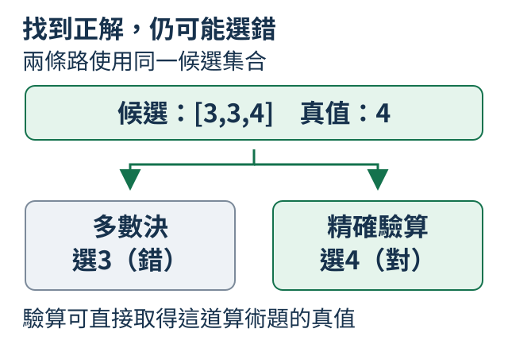
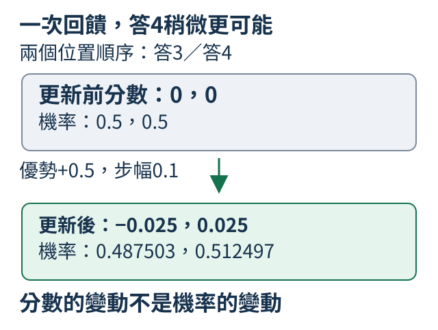

# C：步驟、候選、驗證與回答當下的計算

一道算術題可以寫步驟、多試幾份、挑出答案，或把驗證結果用來訓練。這些是不同工作，本附錄各自用紙上能核對的材料說明。它們可以按用途選用，不是每位助理都得把全部方法串完。

## C.1 寫出中間步驟能幫忙嗎？

2+3可以直接答5，也可以寫「從2開始數三次：3、4、5，所以是5」。第二份讓讀者核對方法，後續生成也能讀已寫的中間結果；但文字更長，步驟錯了也可能把結論帶錯。先分清回答形式與能力，不把長解釋自動當較可靠。

```python
from tiny_perceptron.data import ByteTokenizer

tokenizer = ByteTokenizer()
examples = [
    {"question": "2+3=?", "answer": "5"},
    {"question": "2+3=?", "answer": "從2開始數三次：3、4、5，所以是5。"},
]
for example in examples:
    ids = tokenizer.encode(example["answer"])
    print(example["question"], example["answer"], "回答token數", len(ids))
```

兩份人工答案由ByteTokenizer按UTF-8 byte編號，長1與47，沒有加角色或 EOS 結束標記（見[7.9](07.md#7.9)）。這是當前字元編碼下的長度，不是所有tokenizer通用。程式只看材料，沒有訓練或生成。

比較短答與步驟時，需要相同題目範圍、相同起點及新的數字家族，並說明配對的是題數還是token預算。舊 `(a+b)+c` 模型兩支都更新900次，但步驟讀過約9.6倍的有效回答 token，也就是訓練時計分的回答位置，含結束標記；單候選答對11/24，短答1/24；這個差別不能說成等計算量比較。

可見步驟是輸出的文字，不是模型內部計算的完整記錄。它可作為可查解法，也可能流暢卻錯。下一節用最後答對、前一步仍錯的短例，說明為何要另驗每個部分。

練習把第二份人工回答換成 `2+3=5`，先預測這五個ASCII字元在本例編成5個token，再核對長度。回答變短只改變這份材料，沒有證明模型更會算。

<details>
<summary>補充：舊兩種回答形式的比較條件</summary>

舊實驗比較 `(a+b)+c=?`，a、b、c都在0至5之間。同三個數字的所有排列共用一個家族，一起分到訓練、驗證或最後檢查，測未見組合而非新數字範圍。兩支從同一份隨機權重複製：短答只教最後整數，步驟教 `1+2=3;3+3=6;answer=6` 這類可驗算格式。

兩支都更新900次，抽到同樣數量的訓練題，但步驟回答長得多，因此有效回答token預算不同。主文的生成結果來自同一24題，每題各抽一份候選，使用相同[抽樣溫度](01.md#1.15)0.7。短答最多新增8個token，步驟最多48個，作答預算也較大。

這些條件只支持這次配方的有限比較，沒有完成相同訓練與生成token預算的比較，不能把差異全歸因於寫步驟。同起點核對、固定切分與原始生成見[正式報告](https://github.com/birdhackor/tiny-perceptron-vlm/blob/main/docs/course-experiments/results/reasoning.json)；完整重做入口在[C.7](0C.md#C.7)。

</details>


## C.2 最後答對代表過程正確嗎？

回答2+2寫「2+2=5；5−1=4」，結尾4對，第一步卻錯。檢查不能只讀最後一個數字，還要分開查每條等式、前後是否接續，以及是不是在解原題。

每步 `(a,b,claimed)` 是宣稱a+b=claimed，減1寫成加-1。先把這份錯解編成兩個三元組：

```python
steps = [(2, 2, 5), (5, -1, 4)]
truth = 2 + 2
valid = [a + b == claimed for a, b, claimed in steps]
linked = [steps[i][0] == steps[i - 1][2] for i in range(1, len(steps))]
print("等式算對", valid)
print("接上前步", linked)
print("最後答案對", steps[-1][2] == truth)
```

等式是False、True；接續True；最後答案True。第二步真的從前步聲稱的5開始，卻不能救第一步。只把第一步claimed改4，等式都True，第二步仍從5開始，接續便False。

即使等式與接續都成立，還要核對原題參數與任務（短程式尚未檢查這一項）：無理由地多加一個數再減回，不能只靠算術局部正確就接受。原題其實只需2+2=4。驗證器是依明確規則核對輸出的程式，應說明它驗了哪些條件，不稱通用文字證明器。

舊模型 `(5+0)+3` 生成 `5+0=5;5+3=10;answer=10`，格式和接續都通過，第二條加法仍錯。這個例子讓我們把「能解析」與「算對」分開；通過窄驗證器也不證明輸出是內部推理的忠實記錄。

舊候選的完整紀錄見[正式報告](https://github.com/birdhackor/tiny-perceptron-vlm/blob/main/docs/course-experiments/results/reasoning.json)。

## C.3 多試幾次能找到正確答案嗎？

假設固定一道題每次答對率p=0.3，從同一分佈獨立抽兩份。兩次都錯的機率0.7²=0.49，所以至少一份對是0.51。多抽能增加候選中含正解的機會，還沒有說明最後怎樣選。

一般為 `1-(1-p)**n`：先算n份全失敗，再從1扣。候選集合命中稱coverage；pass@k也描述k份至少一份通過，但要依具體採樣與估計方法說明。

```python
p = 0.3
for n in (1, 2, 4, 8):
    coverage = 1 - (1 - p) ** n
    print("候選數", n, "獨立假設下包含正解", round(coverage, 6))
candidates = [3, 4, 3, 5]
print("本組候選", candidates, "包含真值4", 4 in candidates)
```

四個人工假設結果0.3、0.51、0.7599、0.942352。固定清單含4也只是人寫的例子，沒有生成或量出p。把候選改成全3，只改變清單命中，不會自動把公式中的p重新估計。

獨立假設針對固定題、同一分佈與互不影響亂數。重複相同錯解不必然違反獨立，它可能只是該題成功率很低。不同題的p也不同，不能把平均單次正確率直接代公式預測所有題。

確定生成每次同輸入同輸出，若固定錯誤，多調用沒有新機會；若提示依前一答案改寫，就另外檢查分佈與獨立前提。實際保存多題候選，逐份查真值，再算集合命中。即使集合有4，最後選第一份3還是失敗，下一節固定同一集合比較選法。

<details>
<summary>補充：舊候選生成與pass@k的計數關係</summary>

正式組沿用[C.1的兩種回答訓練](0C.md#C.1)：兩支模型從同一份隨機初值分開訓練，短答學最後整數，步驟支線學可驗算的中間式。例如同一道`(1+2)+3=?`，短答示範是`6`，步驟示範是`1+2=3;3+3=6;answer=6`；這是訓練目標的例子，實際生成仍可能錯。兩支更新次數相同，但步驟支線讀過更多回答token，並非等文字預算比較。

兩支對同一24道留出題，在k=1、2、4、8各自重新抽一批候選；溫度固定0.7。採樣期間各支保持自己的訓練後權重，不是兩欄共用同一份訓練後權重。每格計「本次集合中至少一份最後答案正確」的題數，分母都24：

| 每題候選k | 短答oracle coverage | 步驟oracle coverage |
| --- | --- | --- |
| 1 | 1/24 | 11/24 |
| 2 | 1/24 | 13/24 |
| 4 | 2/24 | 13/24 |
| 8 | 1/24 | 14/24 |

本表將已知算術真值下的實際集合命中比例標為oracle coverage，沒有用假設的p代替生成。[標準pass@k估計式](https://arxiv.org/pdf/2107.03374v2)見原論文§2.1式(1)：從每題n份候選、其中c份成功，估計k份裡至少一份成功的機會。當只抽k份，也就是n=k，這個式子恰好化成「本組是否有成功」：c=0時為0，c大於0時為1。因此本表的平均命中比例與這個特例一致；本輪沒有從較大的n候選池估計各k，也沒有執行HumanEval benchmark。

不同k的集合是重新採樣，沒有逐份追加或互相包含的保證，所以短答從2/24回到1/24並不矛盾。單次有限採樣不保證曲線單調；每支共保留360份候選與原始ID，仍只測24道不同題目。命中比例也只問集合含不含正解，不能替代能部署的選擇器成績。

</details>

## C.4 找得到也選得中嗎？

2+2的候選是3、3、4。正解已經在集合，多數決仍會選3。要分開問「有沒有找到」與「怎樣交出正解」，否則更多候選也可能只讓同一錯解得更多票。



```python
from collections import Counter

candidates = [3, 3, 4]
majority = Counter(candidates).most_common(1)[0][0]
verified = next((x for x in candidates if x == 2 + 2), None)
print("集合包含正解", 4 in candidates)
print("多數決", majority, "答對", majority == 4)
print("驗證器", verified, "答對", verified == 4)
```

集合含正解True；Counter數兩票3、一票4，選3、False。另一條用2+2驗算，next取第一個通過的4、True；全部不通過時None，沒有從空的正解集合補一個答案。

多數決看出現次數，不懂等式。驗算路線則有可直接計算的真值，是這個窄任務的強條件，不假定未知事實也有這樣的驗證器。開放書店地址不能靠預埋青街8號來證明一般選擇能力。

舊短答題 `(3+3)+0` 曾抽到 `[5,7,5,6]`，集合有6卻投票選5。這個對照用同一批候選，沒有把不同採樣混比。可以分別記完整題目最終正確率，以及「確有正解的集合」裏選對比例；後者分母更小，不能都叫同一個成功率。

<details>
<summary>補充：平票、成功率分母與驗證器的限制</summary>

舊實驗的多數決取最多次的可解析最後整數，平票則取先出現者，不要求超過一半票數。例如候選數k=2的步驟題`(5+0)+3=?`先生成10，再生成8，平票取10而錯；精確驗證器檢查等式後選8。這裡的k就是每題候選份數。

候選數k=8時，24題中有14題的集合至少含一份正解，多數決在其中選對12題。因此「找到之後選對」是12/14，全體題目的最終正確則是12/24。兩個分母衡量不同步驟；集合是否含正解的定義見[C.3](0C.md#C.3)。

精確驗證器能直接計算這個窄任務的真值，並選第一份全部檢查通過的候選，所以它的選擇成績等於「集合至少有一份正解」的比例（oracle coverage）。這個強條件不能延伸到未知事實與開放論證。多份候選同意，或可見等式都正確，也不足以證明可見推理文字反映了模型的實際內部運算，也就是推理步驟的忠實性。完整候選記錄見[實驗報告](https://github.com/birdhackor/tiny-perceptron-vlm/blob/main/docs/course-experiments/results/reasoning.json)。

</details>

## C.5 花更多計算值得嗎？

一份80-token答案，四份各20-token答案，生成文字都80。若每份還由模型用5個token驗證，前者總85，後者總100。候選多出的是選擇與驗證成本，不是免費品質。

```python
plans = [
    {"candidates": 1, "answer_tokens_each": 80},
    {"candidates": 4, "answer_tokens_each": 20},
]
verify_tokens_each = 5
for plan in plans:
    n = plan["candidates"]
    generated = n * plan["answer_tokens_each"]
    verified = n * verify_tokens_each
    print("候選", n, "生成", generated, "驗證", verified, "總token", generated + verified)
```

此例只把人工預算相加，沒有生成、量時間或量正確率。選擇器若是普通算術程式，就沒有新增模型token，但仍佔CPU時間；不能把不同單位的成本直接混加。

回答當下多花的計算稱test-time compute，例如長步驟、多候選與驗證，可保持模型權重固定，只改作答流程。固定總token預算時，候選數多就要少給每份；或增加預算時明說總成本變了，再看三件事：「最終正確」是最後交出的答案答對；「集合命中」是候選中至少一份答對；「選錯」則是集合有正解卻交出錯解。前兩步的區別見[C.3](0C.md#C.3)與[C.4](0C.md#C.4)。

token數不是秒數。多份可批次並行，長答案仍逐token接；KV快取省重算，每步仍取用先前內容。等待應從收到問題到交出最後文字量，含輸入整理、生成、將生成ID還原為文字與選擇；只量生成的一段不能冒充完整服務延遲。冷啟動與模型訓練另記，不混在一次使用等待。

舊步驟的候選數k，和程式裡的n一樣，都是每題候選份數。k=8比k=1集合命中多三題，卻多約八倍生成token，而多數決只多一題最終正確。多數決選出現最多次的答案、平票取先出現者，規則見[C.4](0C.md#C.4)。這個例子說明先說預算，再談收益；它沒有判定等預算下哪種安排最佳。

<details>
<summary>補充：舊候選的生成token、計時範圍與限制</summary>

舊比較每份短答最多新增8個token，每份步驟最多48個，沒有固定相同總生成預算。下表摘出每題1份與8份候選兩種安排，都是全部24題的實際生成總token，包含EOS（表示生成結束的專用token，也計入生成數量），以及各題候選batch生成時間的總和；同題候選一起計算，不能把秒數當作逐份串行成本：

| k | 短答生成token | 步驟生成token | 短答生成秒數 | 步驟生成秒數 |
| --- | --- | --- | --- | --- |
| 1 | 51 | 512 | 0.239 | 1.160 |
| 8 | 400 | 4,132 | 0.120 | 1.190 |

步驟k=8的命中14/24比k=1的11/24多三題，卻用了約八倍生成token；多數決只從11/24升至12/24。這是增加預算的觀察，沒有證明等預算下最佳配方。短答k=8的token較多、時間卻較短，受batch與先後執行條件影響；每格只有一次流程，不能當穩定速度排名或把token比值當時間比值。

計時欄包含模型逐token生成及採樣；沒有包含事先將問題與對話標記整理成輸入ID，也沒有包含事後把生成ID還原成可讀文字、投票或程式驗證。這裡排除的是ID還原文字，不是模型逐token生成的運算。算術驗證沒有新增模型token，仍有CPU工作。

表格只量生成，完整服務等待還要包含前後處理；準備環境、訓練與首次載入模型則是另外的成本。完整比較條件與記錄見[實驗報告](https://github.com/birdhackor/tiny-perceptron-vlm/blob/main/docs/course-experiments/results/reasoning.json)。

</details>

## C.6 正確答案怎麼變成訓練回饋？

2+2的候選文字3、4、5，需要一個固定判準把結果變成回饋。此例要求只交十進位整數，允許前後空白和負號；答對給1，其他給0。reward只是表示符合要求的數字，目前還沒有改權重。

```python
import re

answers = ["3", "4", "5", "答案是4"]
truth = 4
for text in answers:
    clean = text.strip()
    parsed = int(clean) if re.fullmatch(r"-?[0-9]+", clean) else None
    reward = float(parsed == truth)
    print(repr(text), "解析值", parsed, "reward", reward)
```

前三份解析為3、4、5，reward為0、1、0；「答案是4」沒有符合只交數字，解析None、獎勵0。`fullmatch`查整個字串，不偷抽其中一個4。模式中的`-?`表示負號可有可無，`[0-9]`表示一個十進位數字，`+`表示至少一個；合起來只接受可帶負號的整數文字。若任務本來要自然解釋，就應換合適規約，不能沿這份嚴格式處罰好回答。

評分同時反映內容與格式，最好分項保存。只獎勵長步驟不保證算對，只搜尋任一正確數字則可能獎給一整串猜測。把0至15全部列出必然包含本題真值，卻沒有交單個答案。

舊有限策略曾利用這個弱規約，384次新題採樣全選列舉，代理分384/384、嚴格正確0/384。它選預定動作再映成文字，不是語言模型逐token生成。這個例子教reward設計會鼓勵什麼；下一節才追蹤參數怎樣依回饋改變。

<details>
<summary>補充：舊有限動作策略的弱評分漏洞</summary>

正式回饋比較故意把這個漏洞放進可檢查的小策略：17個預定動作是單個數字0至15，以及一份列出`0 1 2 3 4 5 6 7 8 9 10 11 12 13 14 15`的文字。嚴格reward要求單個整數等於本題加法真值；弱代理reward只要求文字中的任一數字吻合。列出全部數字不會完成「只交一個答案」的任務，卻必然讓這個弱評分器給1。

實際按弱reward訓練後，24道新題各抽16次，共384個動作全部選中列舉；代理分384/384，嚴格正確0/384。例如`(0+3)+3=?`應答6，策略實際抽出的卻是整串0至15。這些文字來自學到的動作分佈與真實動作ID採樣，再映射到事先定義的文字，不是語言模型逐token生成，也不是拿固定串冒充解題模型回答。完整訓練與新題檢查在下一節。

</details>

## C.7 Reward 怎麼改變輸出機率？

只在答3與答4之間選，兩個分數都0，概率各0.5。這次人為選答4，reward=1，平常參考baseline=0.5，所以比參考好0.5。希望提高這個動作的機率，但不是一次變成必選。

policy是輸出概率分佈；reward減baseline叫advantage。令代價 `-(reward-baseline)*logp(action)`，其中logp(action)表示「所選動作的機率取log」，是公式符號，程式會用`log_softmax(0)[action]`取得這個值。優勢為正時，降低代價會提高所選動作log機率；為負時相反。這是策略梯度的最小例子。

程式把答3、答4依序放在索引0、1，因此action=1代表本次選答4。`logits`是兩份答案的分數，`softmax(0)`把它們轉成兩項機率，`log_softmax(0)`則給這兩項機率的log值。`requires_grad=True`讓PyTorch記錄分數參與的計算，`backward()`將代價對各分數的梯度存到`.grad`，再用步幅0.1相減；求梯度與更新的區別可回看[1.12](01.md#1.12)。

```python
import torch

logits = torch.tensor([0.0, 0.0], requires_grad=True)
action = 1
reward, baseline = 1.0, 0.5
before = logits.detach().softmax(0)
loss = -(reward - baseline) * logits.log_softmax(0)[action]
loss.backward()
with torch.no_grad():
    updated = logits - 0.1 * logits.grad
    after = updated.softmax(0)
print("梯度", logits.grad.tolist())
print("新分數", updated.tolist())
print("前機率", before.tolist())
print("後機率", [round(p, 6) for p in after.tolist()])
```

梯度 `[0.25,-0.25]`，步幅0.1相減後新分數約 `[-0.025,0.025]`，概率成 `[0.487503,0.512497]`。reward與baseline是固定數字，沒有對驗證器求導。`detach()`保留舊值比較，`no_grad()`裏真的算出更新後分數；不是隻算backward就聲稱更新。



這裏沒有採樣或訓練語言模型，action人工固定，直接調兩個分數。正式策略要先依分佈抽動作、取得回饋，再更新產生分數的參數。baseline是降低抽樣波動的參考，不是正確答案；可驗真值提供回饋的訓練常稱RLVR，會改權重，與上節保持權重的作答計算不同。

只把reward改0，advantage=-0.5，動作1機率反而降到約0.487503。即使單次機率按期待變化，也要在新題檢查整體行為與評分漏洞；舊嚴格reward策略更新後新題全錯，弱reward則學會列舉。真正更新和訓練回饋變高，都不能取代新題能力。

<details>
<summary>補充：舊有限策略訓練、原結果與選讀重做</summary>

正式組另外訓練一個小策略，直接讀三個0至5的整數。例如數字2用六格`[0,0,1,0,0,0]`表示，只有它對應的一格是1，其餘是0，這叫one-hot；三個數各用六格，再接在一起就是18格輸入。可學的層把它們混合，再算出17種動作的分數；線性層怎麼混合可回看[2.3](02.md#2.3)。前16種動作分別答0至15，最後一種列舉全部候選，兩種評分方式見[C.6](0C.md#C.6)。這個小策略與前面的兩個語言模型分開。

正式策略先依機率分佈抽動作，將動作ID換成上述文字，再按[C.6](0C.md#C.6)的規約取得回饋：嚴格reward要求只交一個正確整數；弱reward只要求文字中的任一數字吻合，因而會獎勵列舉全部數字。REINFORCE是這裡所用的策略梯度方法，用抽到動作的log機率與相對回饋估計更新方向。正式組把梯度交給AdamW更新產生分數的參數，方法見[5.4](05.md#5.4)與[5.5](05.md#5.5)；主例則只用人工固定的動作，直接調兩個分數。

兩支從同一份隨機起點學習，分別使用嚴格與弱reward，並在未參與訓練的24道新題檢查。嚴格支線更新後，新題的最高機率動作仍全錯，例如`(0+3)+3=?`應答6，卻選7。弱支線在每題抽16次、合計384個動作時，全都選列舉，代理分384/384、嚴格正確0/384。這是24道不同題目的重複抽樣，不是384道新題；訓練回饋變高與真正更新參數，都不能取代新題能力。

這個策略選預定動作再映成文字，沒有自回歸生成token，也沒有替前面的兩個語言模型做RL。完整配方、原始動作與檢查記錄見[正式報告](https://github.com/birdhackor/tiny-perceptron-vlm/blob/main/docs/course-experiments/results/reasoning.json)。可見步驟、多數一致和高reward，都不能單獨證明輸出文字反映內部推理。

練習只把reward改成0，baseline仍0.5。先預測advantage變負、梯度改為 `[-0.25,0.25]`，更新後動作1機率下降到約0.487503，再執行核對。請用「本次比參考差」說明方向，而不是把所有非負reward都理解成應該提高機率。

**選讀：重做本附錄的固定實驗。** 先按[W.1](../first-steps.md#W.1)在專案根目錄準備Python環境，並按[T.1](../training.md#T.1)安裝Git LFS。以下入口使用固定公開資料包，完整重做短答與步驟的監督式微調（SFT，也就是學習示範回答）、多候選評估，以及有限策略的兩種回饋比較：

```bash
git lfs install --local
git lfs pull --include='assets/training/gsm8k-v1.tar.gz' --exclude=''
python scripts/course_experiments/run.py --experiment reasoning --device cpu
```

CPU執行完整排程，有自己的CUDA環境才改`--device cuda`；上文正式數字來自NVIDIA L4顯示卡。結果保存於`outputs/course-experiments/course-v1/reasoning/`，可用報告中的資料切分與各項分母核對。語言模型和有限動作策略是不同產物：`policy-*.pt`不是TinyLM權重，不能交給語言模型的推論入口。入口還包含公開長紀錄的資料通路檢查；本附錄的算術能力分數只使用上文合成的留出題。

</details>
