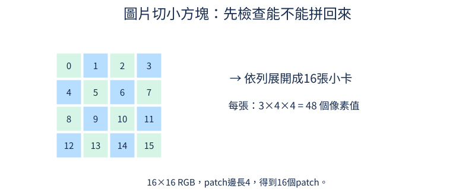
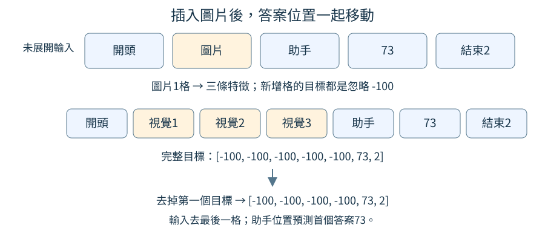

# 第 10 章：圖片如何進入文字模型

文字模型原本讀的是一串數字表示的文字。若想問「這張圖是什麼顏色」，圖片也必須變成它能接收的數字序列。本章從一張16×16的紅色方塊圖出發，逐步看像素、切塊、特徵與插入位置。所有圖都能離線生成，不必下載大型模型；先把介面接通，下一章再區分接通與真正理解。最後三節另走圖文配對路線，說明不用生成句子也能學比較圖片與描述。

## 10.1 圖片是什麼 tensor？

手機畫面放大後會看到一格格像素。每個像素的紅、綠、藍亮度組合，形成我們看到的顏色；紅色像素可以用三個數字[1,0,0]表示。當圖片要進程式，這些數字需要有明確的排列。本節只回答「圖片的各條軸代表什麼」，不要求模型已能認出物件。

前置是[W.3的tensor與軸](../first-steps.md#W.3)。回顧一下，tensor是一個有形狀的數字盒子，每個軸可以用索引選位置。RGB指紅Red、綠Green、藍Blue三個通道；單張圖常用[C,H,W]，C是通道數、H是高、W是寬。因此[3,16,16]是有三種顏色通道的一張圖，不是三張圖。

```python
from tiny_perceptron.multimodal import scene

image = scene("red", "square")
print("形狀", tuple(image.shape))
print("中央RGB", image[:, 8, 8].tolist())
print("左上RGB", image[:, 0, 0].tolist())
print("加入批次軸", tuple(image.unsqueeze(0).shape))
```

輸入`scene`是專案的合成圖片工具：red要求紅色，square要求方塊，預設大小16×16，背景黑色。`tuple(image.shape)`把軸長度轉成括號形式供列印；`.tolist()`把取出的tensor數值轉成Python清單，兩者都不會修改原圖片。`image[:,8,8]`保留全部顏色通道，取第8列第8行的同一個像素；索引從0開始。輸出形狀`(3,16,16)`、中央`[1.0,0.0,0.0]`、左上`[0.0,0.0,0.0]`。0表示該色沒有亮度，1表示這個例子設定的最大亮度，所以方塊紅而背景黑。

`unsqueeze(0)`在最前面增加長度1的軸，得到`(1,3,16,16)`。第一個1叫批次大小，表示一次送一張圖；這個操作沒有新增像素或改變顏色。若一次放兩張圖，批次軸會是2。不同讀檔工具也可能給[H,W,C]，這時需要換軸成模型要求的順序，不能把數字表直接誤讀為另一種形狀。

實際照片常以整數0到255保存亮度，轉成浮點數並除255後可落在0到1。此處`scene`已直接提供這個範圍，不要再除一次255而讓數值縮小。圖的數值尺度、通道順序與訓練設定必須一致，否則同一顏色送進模型也可能被解讀錯。

若把三條通道當成三張灰階圖，也不是完全無法顯示，但會改變你正在描述的物件：紅通道裡方塊是亮的，綠與藍通道裡全黑，三者合起來才是原紅色圖。中央索引8、8選的是同一座標，不是分別在不同位置找紅綠藍。批次軸則用來分不同圖片，例如image_batch[0]取第一張整圖，image_batch[0,:,8,8]才取它的中央RGB。清楚說出每個索引選哪一軸，比記住一個形狀字串更能避免後面切塊時排錯。

練習只把red改成blue，先預測中央RGB為[0,0,1]、形狀保持不變，再跑程式核對。你會看到改變的是第三個通道的亮度，不是第三張圖片。能這樣讀懂軸，下一節才能把圖片切成小塊而不打亂像素。

## 10.2 圖片怎麼切成序列？

文字可以依讀取順序排成一串，但圖片有上下左右兩個方向。把整張圖攤平會使序列很長，因此先切成小方塊，再讓每個小方塊成為一個位置。小方塊英文叫patch。本節先說清楚採用的切法與順序，再檢查切塊與拼回兩個工具是否能一致往返。

前置是[10.1的批次與RGB軸](10.md#10.1)。16×16的圖，用邊長4的patch切割，每列有16/4=4塊，共4×4=16塊。每塊包含3個通道、4列、4行，即3×4×4=48個數字。文字模型把文字切成輸入單位，稱為token，例如一個字或一小段文字；這裡一個序列位置則是一整塊圖片。48是這塊內的像素數值數量，不是48個文字token。

圖中0到15標示patch的讀取順序：第一列從左到右為0、1、2、3，下一列從4開始。箭頭「依列展開」表示把16塊排成一串，右邊的48說明每塊仍保存其全部RGB像素。這樣順序與空間位置才有可核對的對應。



```python
import torch
from tiny_perceptron.multimodal import scene, patchify, unpatchify

image = scene()[None]
patches = patchify(image, 4)
restored = unpatchify(patches, 3, 16, 16, 4)
print("小塊序列", tuple(patches.shape))
print("拼回相同", torch.equal(image, restored))
```

輸入`scene()`預設紅方塊，`[None]`與上一節的`unsqueeze(0)`一樣增加一張圖的批次軸。`patchify`按上述順序切塊並攤平每塊，輸出`(1,16,48)`：1張圖、16個位置、每位置48數字。`unpatchify`是反向工具，需要告知通道3、高寬16、邊長4，才能把一串位置放回正確格子。

`torch.equal`逐一比較原圖與重建圖，輸出`True`。它比只看形狀多確認了一件事：這次往返後沒有像素值遺失或改變。但它不能單獨證明中間序列遵守圖示的排序。例如切塊時把RGB倒過來，拼回時又倒回去，仍能得到`True`；兩個工具互相配合，卻用了另一種通道約定。要驗證特定順序，還需要直接核對已知位置和通道在序列中的內容。

可以用一個更小的紙上例子記住順序：2×2張卡片，左上寫a、右上b、左下c、右下d，依列展開就是[a,b,c,d]，不是[a,c,b,d]。直接看第二個位置是不是右上的b，就能核對這個排列約定；若切時依欄讀、拼時也依欄放，[a,c,b,d]仍能拼回原圖，往返成功不會揭露兩者的差別。真圖片每張卡內還有48個像素值，同樣要保持通道與格子順序。若只隨意攤平，雖然數字總數仍768，也可能把「整張圖的紅通道」當成第一張小卡內容，形狀數值看起來合理但不再描述相同區域。切塊工具封裝這種排列約定；圖與卡片例子說明它，重建檢查則核對兩個工具是否相容。

練習只把patch邊長改8，兩處工具參數都要改。先算每列2塊，共4塊；每塊3×8×8=192個數字，再跑核對形狀`(1,4,192)`與相同`True`。小塊變大後位置變少，但沒有憑空丟像素；之後把每塊壓成短特徵時，才涉及學習如何保留有用資訊。

## 10.3 Patch 怎麼變成向量？

上一節每個小塊有48個像素數字，文字模型卻希望每個位置用固定寬度的特徵表示。我們可以讓同一張「加權配方表」把每塊的48個值轉成8個值。這8個值組成一個向量，也就是一排數字。本節關注寬度如何改變，先不把隨機輸出叫作已學會的顏色或形狀。

前置是[10.2的patch形狀](10.md#10.2)與[W.5的矩陣配方](../first-steps.md#W.5)。線性層Linear就是可訓練的加權變換，每個輸出由輸入乘相應權重再相加得到。把它應用在最後一軸，會對每個patch用同一套權重，而保持圖片數量與patch數量。這種將像素變為特徵的入口稱為patch embedding。

```python
import torch
from torch import nn
from tiny_perceptron.multimodal import scene, patchify

torch.manual_seed(0)
patches = patchify(scene()[None], 4)
embedding = nn.Linear(48, 8)
features = embedding(patches)
print("輸入", tuple(patches.shape))
print("輸出", tuple(features.shape))
print("矩陣", tuple(embedding.weight.shape))
```

輸入是1張圖的16個patch，每塊48數值。`torch.manual_seed(0)`固定產生隨機數的起點，稱為隨機種子，讓這段程式重新執行時使用相同的初始隨機權重；0是選定的種子編號，不是像素值或訓練次數。`nn.Linear(48,8)`定義48進8出的變換，內部矩陣形狀是`(8,48)`，每一行負責一個輸出。`features=embedding(patches)`將相同變換應用16次。輸出依序`(1,16,48)`、`(1,16,8)`、`(8,48)`；位置16沒有變，只有每個位置的描述寬度由48變8。

這個操作沒有把整張圖平均成一個值，也沒有把16個patch壓成1個patch。圖像中的不同區域仍有不同位置，後面可以分別被讀取。8個輸出數字的含義來自訓練目標，不一定有一項能直接叫「紅色程度」。隨機初始化時只知道數學可以執行，不能看見一個8維向量就斷言模型認得圓形。

與文字embedding相比，文字常從離散編號查一排數字，而這裡從連續像素經過線性變換產生一排數字；兩者都提供後面層可以處理的特徵寬度。像素如果一邊用0到1、一邊用0到255，輸出尺度也會不同，因此轉換範圍需要和訓練保持一致。

想像只有兩個輸入亮度[1,0]，一個輸出用權重[0.5,0.5]且偏置0，結果就是1×0.5+0×0.5=0.5。換輸入[0,1]仍得0.5，這個特定配方把兩種差異合併了。48轉8同樣是一種壓縮，可能保留任務需要的差異，也可能失去它；訓練要找適合的配方，不能把寬度變短本身當成理解。共享同一配方的好處是不同位置遇到相似局部像素時可用相同方法處理，後面再加入位置資訊，區分它們所在的地方。

練習只把輸出寬度8改16，先預測features變成`(1,16,16)`，矩陣變成`(16,48)`，patch數仍16，再執行核對。兩個16碰巧一樣，意義卻分別是位置數與每位置的特徵數；請在紙上標出每個軸，不要因為數值相同就把它們混為一個概念。

## 10.4 怎麼保留圖片的空間位置？

兩塊完全一樣的紅色像素，一塊在圖左邊、一塊在右邊，單看像素內容無法知道誰在哪。問「左邊是什麼顏色」時，這個差別卻很重要。像替相同內容的卡片寫上座位號碼，我們可以把位置的數字提示加進每塊特徵，讓它們既帶內容也帶位置。

前置是[10.3每個patch的特徵](10.md#10.3)與[4.1文字序列的位置](04.md#4.1)。位置向量是一排代表位置的數字，與內容向量等寬，可以逐項相加。本節用極簡單的編號0、1、2、3示範差異；正式模型通常使用可以訓練的位置參數，不是認為把數字3加上去就天然代表右下角。

```python
import torch

patches = torch.ones(1, 4, 3)
position = torch.arange(4.0)[None, :, None]
x = patches + position
print("形狀", tuple(x.shape))
print("位置0", x[0, 0].tolist())
print("位置3", x[0, 3].tolist())
print("仍相同", torch.equal(x[:, 0], x[:, 3]))
```

輸入`patches`代表1張圖、4塊、每塊3個特徵，所有數字先設1，所以內容完全相同。`arange(4.0)`產生0、1、2、3，兩個`None`補出形狀(1,4,1)，使每個位置的編號能加到該位置三個特徵上。這種自動擴展相同數字的運算叫廣播；此處只需記住一個位置的編號重複給該位置每個特徵。

輸出形狀仍`(1,4,3)`，位置0是`[1,1,1]`，位置3是`[4,4,4]`，最終比較`False`。內容本來相同，加入位置後不再相同。這個結果證明位置差異已進入數字，並沒有證明模型知道這些編號的空間意義；需要訓練讓後續層使用它們。

還要分清重排的兩種操作。若只移動patch內容而位置提示留在原格子，相當於真的把圖塊換到另一個位置；若內容與其位置提示一起重排，則是在更換序列儲存順序，仍描述原來的內容位置。訓練是用例子調整模型參數，推理則是使用目前參數處理新輸入；兩者採用哪種位置對應必須固定，否則模型收到的左右關係會混亂。

編號0到3可以對應2×2小圖的左上、右上、左下、右下，只要切塊順序固定。正式位置向量不必直接等於這個編號；可學參數讓每一位置有自己的數字組合，訓練再決定哪些關係有用。這裡把編號加到全部三個特徵，是為了讓差異一眼可見。它也提醒位置與內容相加會混在同一條特徵中，後面的模型要學會解讀，不是另有一條人類可讀的「右下角」文字。若圖大小改變，位置數也要對應，不能拿四個位置硬套十六塊。

練習把`x = patches + position`改成`x = patches`，先預測兩個位置都會輸出`[1,1,1]`、比較變True，再執行核對。缺少位置提示時，相同內容難以區分所在位置；後面訓練視覺特徵時，需要把內容和位置一起考慮，而不是只讓形狀對得上。

## 10.5 怎麼學到可用的視覺特徵？

一個入口能把紅方塊變成16個向量，還不表示其中保留了可以讀出的顏色與形狀。我們可以先給它一件小任務：兩張圖片一張紅方塊、一張藍圓形，讓它預測各自編號。預測錯的代價會沿計算返回，告訴像素變換哪些數字應該調整。這是視覺特徵開始獲得任務意義的來源。

前置是[10.3的像素變換](10.md#10.3)、[1.8分類猜錯代價](01.md#1.8)與[W.6梯度](../first-steps.md#W.6)。encoder是編碼器，負責把原始圖變成特徵；classifier是分類頭，把特徵轉成每種候選的分數。交叉熵CE比較分數與正確編號，梯度是這些數字對代價的敏感程度。

```python
import torch
from torch import nn
from torch.nn import functional as F
from tiny_perceptron.multimodal import VisionEncoder, scene

torch.manual_seed(0)
encoder = VisionEncoder(width=8)
classifier = nn.Linear(8, 2)
images = torch.stack([scene("red", "square"), scene("blue", "circle")])
features = encoder(images)
logits = classifier(features.mean(1))
loss = F.cross_entropy(logits, torch.tensor([0, 1]))
loss.backward()
print("特徵", tuple(features.shape), "分數", tuple(logits.shape))
print("入口收到梯度", encoder.projection.weight.grad.norm().item() > 0)
```

輸入兩張合成圖，由`stack`堆成一批。`VisionEncoder(width=8)`依序切patch、做線性變換、加位置並處理特徵，輸出`(2,16,8)`。`mean(1)`把每張圖16個位置平均成8個值，再讓分類頭輸出`(2,2)`，即兩張圖各有兩個類別分數。正確編號[0,1]來自我們生成圖片時的設定，不是模型猜出的標籤。

`backward()`把代價的敏感程度傳回所有參與計算的可訓練參數；最後一行檢查入口矩陣梯度長度大於0，正常輸出True。這裡沒有執行參數更新，不能稱為已訓練成功。即使反復訓練這兩張圖，它還可能只是記住兩張樣本，或用顏色代替形狀，因為紅總是方塊、藍總是圓。

真正驗證要有更多顏色與形狀組合，並保留未訓練的組合或生成位置作為測試。之後可拿掉分類頭、保留編碼器特徵，連接語言模型；任務改變也可能需要繼續調整。

我們已把這一步做成[正式編碼器實驗](https://github.com/birdhackor/tiny-perceptron-vlm/blob/main/docs/course-experiments/results/encoders.json)。它和上面的兩圖梯度示範不同：紅、綠、藍各配圓與方，共六個候選，答案例如`red circle`。每張圖仍是16×16 RGB、像素範圍0到1、patch邊長4；編碼器寬度改16，平均16條特徵後，由分類頭在六個候選中選一個。編碼器與分類頭合計1,446個參數，一起更新250次，每次抽八張訓練圖，種子42、學習率0.003。

這次不是保留新的顏色形狀組合，而是保留新的位置：位移−2、−1、0的18張圖用來訓練，位移1的六張圖用來驗證，位移2的六張圖留到最後測試。相同顏色形狀在三邊都出現，位置卻不同，所以它回答的是「已知六類能否在這些新位置辨別」，沒有測過未知物件。更新前只答對1/6，更新後驗證5/6、測試6/6；同一固定訓練小批的交叉熵由1.8468降至0.0173，權重也實際改變。這比只印出梯度多了真正更新與留出題的證據。

六張測試全對值得保留，但六張仍很少，而且位移1反而有一張錯誤。不能把位置更遠就必定更難、某一批全對就一定可靠，當成模型的普遍規律。這像練過六種積木後，在另一格桌面認對同樣六種積木，還沒有認過衣服、動物或手寫字。接頭接下來拿走的是已學特徵；分類頭的6/6也沒有保證語言模型能把它們寫成正確句子。[11.3](11.md#11.3)會再測那一段連接。

[真實資料小實驗](https://github.com/birdhackor/tiny-perceptron-vlm/blob/main/docs/course-experiments/results/real_modal.json)另用了Fashion-MNIST的50張服飾圖，不沿用上面合成圖的已訓練編碼器。十類各五張，按每類前三張教學、第四張驗證、第五張測試，得到30／10／10；原始50張都選自上游training部分，這是我們自己的切分，並非官方測試成績。28×28灰階先轉成三個相同灰階通道的RGB，再縮成16×16，像素除255放到0至1；沒有再按每張圖的平均與標準差重新調整像素。

新視覺入口接直接SFT文字底座，全部開放更新250次，累計7,528個有效回答目標，回答`clothing?`的英文類別名稱。固定訓練探針代價從8.968降到0.154，驗證4/10、測試3/10；十道測試都以EOS結束，卻只有Ankle boot、Sneaker、Sandal三張完整答對。比如T-shirt/top、Dress、Pullover都被答成Bag，真實Bag又被答成Shirt。這批只完成很小的服飾命名檢查，沒有自然照片的描述或問答證據；從圓方積木轉到衣物輪廓，不能把原先6/6直接帶過來。

這兩張圖的編號0、1只是兩個候選的名字，尚未讓任務單獨辨別「圓形」。想教形狀，資料要有紅圓、藍圓都標圓、紅方、藍方都標方；想教顏色，則相同顏色不同形狀共用顏色標籤。把任務寫清後，才能判斷平均16個位置的特徵是否夠用。例如只問顏色常可以平均亮度，問左右位置卻可能因平均而丟失排列。這一節的分類頭是建立可核對監督的工具，不保證同一個平均表示足以完成之後每一種視覺問題。

練習只把正確編號[0,1]換成[1,0]，先說明新目標在教相反的映射，再執行確認仍能收到梯度。梯度能通過不代表標籤正確，這是準備資料時不能省略人工核對的原因。

## 10.6 視覺與文字維度不同怎麼接？

視覺入口每個位置給8個數字，文字模型的每個位置卻需要12個數字，直接接進去就像把8孔接頭塞進12孔插座。我們需要一個把寬度8變成12的轉換。本節把它叫projector，投影接頭；它先解決尺寸問題，是否能讓語言模型理解這些數字則留到下一章驗證。

前置是[10.3的特徵軸](10.md#10.3)與[W.5矩陣變換](../first-steps.md#W.5)。8或12叫特徵維度，指每個位置的數字數量，不是圖片張數。線性層在最後一軸加權組合，所以1張圖的16個位置仍然保留，不會因為輸出寬度變12而變成12塊圖。

```python
import torch
from torch import nn

torch.manual_seed(0)
vision = torch.randn(1, 16, 8)
projector = nn.Linear(8, 12)
language_features = projector(vision)
print("視覺", tuple(vision.shape))
print("文字介面", tuple(language_features.shape))
print("接頭矩陣", tuple(projector.weight.shape))
```

輸入`vision`是模擬視覺特徵，不是真圖片訓練出來的結果。`randn`造出固定種子的隨機數，`nn.Linear(8,12)`建立8進12出的變換。輸出分別`(1,16,8)`、`(1,16,12)`與`(12,8)`。矩陣的12行各產生一個輸出特徵，16個位置共用同一矩陣。

尺寸一致意味著後面算式能執行，但相同數字寬度不保證含義一致。例如視覺特徵的一組數字可能區分紅與藍，文字模型相同寬度的一組數字卻用於區分名詞與動詞。隨機接頭可能讓答案分數改變，但改變方向未必與顏色有關。需要用成對圖片與描述提供訓練信號，才能學習什麼視覺差異該轉成什麼語言行為；這個過程稱為對齊。

在[正式接頭實驗](https://github.com/birdhackor/tiny-perceptron-vlm/blob/main/docs/course-experiments/results/projector.json)裡，視覺特徵寬16、文字寬64，接頭矩陣因此是64×16，再加64個偏置，共1,088個可訓練數字；16個patch位置仍保留。這次真的更新300次，卻沒有一張最後測試圖生成完整正確描述，詳細結果見[11.3](11.md#11.3)。換好尺寸與更新接頭是必要的接口工作，效果還要由完整答案核對。

還要記下文字模型實際要求的寬度。如果把接頭輸出設16，而原模型仍用12，後面的加法或矩陣運算會報形狀不符。報錯時應先核對接口軸，而不是盲目修改圖片大小。更多關於尺寸和理解的區別會在[11.1](11.md#11.1)展開。

尺寸轉換可用小例子理解：輸入[1,2]，三個輸出分別取第一值、第二值、兩值相加，就得到[1,2,3]。一張3×2矩陣能完成這件事，而兩個原數字沒有因此變成三份獨立的新知識。本例8轉12也是重新組合已有特徵，可能讓語言介面更好使用，卻不會從缺失的視覺訊息創造確定事實。負責把圖片轉成特徵的工具稱為編碼器；若它根本把紅與藍變成完全相同向量，無論接頭多寬，都不能靠相同輸入可靠選出不同顏色答案。先檢查兩端能力，才能知道對齊訓練有什麼可用。

練習只把輸出12改成10，先預測第二行變`(1,16,10)`、矩陣變`(10,8)`，再執行核對。說明現在能不能接原本12維文字模型：不能直接接，因為每位置少了兩個數字。這項練習檢查的是尺寸推理，尚未檢驗語義是否對齊。

## 10.7 模型怎麼知道圖片放在哪？

問題文字是「這張圖是什麼顏色」，圖片卻不是普通字詞。我們在序列放一個圖片佔位標記，表示這裡要插入視覺特徵。假如標記原本佔1格、視覺特徵有3格，後面的回答就要整體往後移動2格；答案標籤若沒有同步移動，會把正確文字放到錯誤位置。

前置是[10.6接頭輸出](10.md#10.6)與[7.4下一位置的答案對齊](07.md#7.4)。本節的序列先是完整未錯位的輸入和標籤，插入後才做一次shift，指輸入去最後一格、目標去第一格，讓每個輸入預測下一格。圖片位置標籤填`-100`，表示這些位置不直接猜文字，但仍可作為回答的上下文。

```python
import torch
from torch import nn
from tiny_perceptron.multimodal import expand_modalities

embedding = nn.Embedding(264, 8)
ids = torch.tensor([1, 5, 4, 73, 2])
labels = torch.tensor([-100, -100, -100, 73, 2])
features = {5: torch.randn(3, 8)}
x, y = expand_modalities(ids, labels, embedding, features, {5})
print("輸入特徵", tuple(x.shape))
print("下一格目標", y.tolist())
```

輸入編號1表示開頭、5表示圖片、4表示助手角色、73是示範答案片段、2表示結束。數字73這裡只是已有詞表中的合法編號，不代表模型已會回答顏色。`nn.Embedding(264,8)`建立264列查表，可查編號0到263，每列有8個數字；`embedding`把普通編號轉換成8維向量，`features`給圖片標記5提供三條8維特徵；`{5}`告訴工具哪些編號需要展開。

展開後完整目標是`[-100,-100,-100,-100,-100,73,2]`：開頭、三條視覺特徵、助手角色都不算文字代價。再去掉第一個目標，與去掉最後一條輸入對應，輸出`x`形狀`(1,6,8)`，即批次中1筆樣本、6個輸入位置、每位置8個特徵，`y`為`[[-100,-100,-100,-100,73,2]]`。答案73的目標位在索引4，對應輸入中的助手角色，因此首個答案仍由它前面的上下文預測。

交給後續文字模型的是對齊後這6格輸入，因此[位置編號](04.md#4.1)是0到5，指格子順序，與代表內容的詞表編號1、5、4、73、2不同。[防偷看的注意力遮罩](03.md#3.6)也要配合這6格，形成6×6的表：每列是一個讀取位置，每欄是一個被讀取位置，只允許讀取自己與之前的格子。這些設定不能沿用原來5格的長度，也不能誤用完整未對齊7格的長度。

圖中第一列是五格原序列，第二列把圖片一格換成三格，形成七格。下面先列完整目標，再用箭頭表示只去掉第一個目標一次，得到六格的下一位置目標。73仍由前面的助手位置預測；淡橘色三格表示視覺上下文，不是三個要輸出的字。



只調整輸入而沿用舊標籤，可能不報錯卻把錯誤位置當答案，訓練意義就變了。圖片格不計代價不等於看不見，這點可回看[7.5](07.md#7.5)。

正式接頭訓練用問題`describe`及目標`red circle`等六種描述。以這個紅圓例子算一次：前綴有開頭、用戶、圖片、describe的八個byte、用戶結束與助手角色，共13格；答案十個byte加EOS，共11格。24格完整序列把一個圖片標記換成16條特徵，變39格，再錯位一次，得到38個輸入位置。代價只取11個回答目標，並不把16條視覺特徵算成16個答案。整次300步實際累計14,408個有效回答目標，這個數量來自抽到的描述長度，不是300乘圖片位置數。

注意y的索引4雖放著73，它不是要模型在輸入第4格直接看到73再抄。展開後輸入的第4格是助手角色，目標正好在其後，這才是「預測下一格」。最後一個輸入是73、目標是結束2。若先將原標籤shift、再展開圖片，就容易把角色、圖片或答案錯配；工具要求未shift的完整序列，就是為了讓這個責任只發生一次。

練習只把`randn(3,8)`改成`randn(5,8)`，先預測輸出長度8，目標中前六格忽略、末兩格仍73與2，再執行核對。回答內容沒變，移動的是它所在的位置。

## 10.8 原本的文字功能還能正常嗎？

一個文字模型加了圖片入口，使用者沒有附圖時，原來的文字請求應仍走原路徑。若包裝程式不小心多加一個標記或改變位置，尚未開始訓練就可能改變文字輸出。本節做一個很明確的檢查：同一份權重、同一串文字編號，從兩個入口得到的分數是否完全一樣？

前置是[10.7模態標記與展開](10.md#10.7)與[4.6輸出候選分數](04.md#4.6)。logits是每個位置對全部文字候選的原始分數。這裡比較這些分數，而不是生成一句話後憑感覺判斷類似；若兩條路徑數學等價，所有分數應逐項一致。

```python
import torch
from tiny_perceptron.model import TinyLM, ModelConfig
from tiny_perceptron.multimodal import MultiModalLM

torch.manual_seed(0)
lm = TinyLM(ModelConfig(width=8)).eval()
multimodal = MultiModalLM(lm).eval()
ids = torch.tensor([1, 20, 30])
a = lm(ids[None])["logits"]
b = multimodal(ids)["logits"]
print("分數形狀", tuple(a.shape))
print("純文字入口相同", torch.equal(a, b))
```

輸入只有三個合法編號，不含圖片標記。`TinyLM`是原文字模型，`ModelConfig(width=8)`設置特徵寬度；`MultiModalLM(lm)`把同一個對象放入多模態包裝，不是另造一份不同權重。`eval()`進入評估模式，避免訓練時某些隨機行為影響比較。純文字原入口需要批次軸，所以用`ids[None]`；包裝入口接一筆序列，內部會補這個軸。

輸出分數形狀`(1,3,264)`，表示1筆、3位置、詞表264個候選，最後比較True。這個數字核對說明包裝在沒有圖時沒有改變原文字計算。模型是隨機初始化的，因此這不證明它會寫好文章，也不證明後來圖文訓練仍保留文字能力。

正式接頭實驗還在更新前複製語言模型的全部權重，更新後逐項核對，結果完全相同；只開放圖片接頭的範圍確實守住了。這是訓練範圍的證據，沒有在此另報一份訓練後文字題成績。當底座原本就會答錯，固定它也會把那些限制留下來；後面開放語言層時，則需像[11.7](11.md#11.7)那樣重新回答原來的留出文字題，不能只沿用本節的入口一致性。

如果輸入放了圖片標記，卻沒給圖片，應用應報出缺資料，而不是把標記默默當普通文字。可以在原程式最後嘗試`multimodal(torch.tensor([1,5,4]))`，它會報「placeholder缺少配對圖片／聲音」；placeholder就是佔位標記。錯誤提醒資料不完整，不能用移除檢查來隱藏。

比較的是同一份隨機權重，所以即使兩條路同樣答錯，分數相同仍可以證明包裝一致；它不能證明內容好。相反地，若訓練後兩份模型都答4，其他候選分數不同，也不必表示功能退步，因為權重已經更新。入口一致性與任務正確率使用不同證據：前者逐項核對計算，後者按使用者問題核對答案。這能幫助排錯：改包裝後立刻不同，就先查序列與位置；只有訓練後才變差，則查可訓練範圍與資料。不要把所有差異都歸於模型「忘了」。

練習把三個普通編號換成[1,40,50]，先預測形狀仍相同、比較仍True，再執行核對。這是包裝的一致性檢查。真正訓練之後，語言權重可能改變，必須用同一批文字任務對照訓練前後分數與回答質量；[11.7](11.md#11.7)將處理那種能力保留問題。

## 10.9 圖片和描述怎麼比較配對程度？

有兩張照片與兩張文字說明卡，我們想知道哪張卡對應哪張照片，不一定要先讓模型寫出句子。可以分別把圖和文字變成等寬向量，再比較方向接近程度。若只比較長度，某個向量乘2就可能顯得更匹配，實際上內容沒有改變；因此先把長度調成1再比較。

前置是[W.5向量與點積](../first-steps.md#W.5)與[10.5編碼器特徵](10.md#10.5)。點積把對應數字相乘再加總；先將向量除以自身長度、稱為歸一化後，點積就是cosine餘弦相似度。方向相同為1、垂直為0、相反為-1。這裡的方向是數字空間的關系，不是照片中的左或右。

```python
import torch
from torch.nn import functional as F

image = torch.tensor([[1.0, 0.0], [0.0, 1.0]])
text = torch.tensor([[2.0, 0.0], [0.0, 3.0]])
similarity = F.normalize(image, dim=-1) @ F.normalize(text, dim=-1).T
print(similarity)
print("每張圖選文字欄", similarity.argmax(-1).tolist())
```

輸入是人工設置的兩種圖向量與兩種文字向量，沒有執行真實編碼器。第一圖與第一文字同方向，只是長度1和2不同；第二對長度1和3不同。`normalize(...,dim=-1)`在每個向量的特徵軸歸一化，`.T`把文字矩陣轉置，使`@`一次算每張圖與每段文字的點積。

輸出是兩行兩列矩陣`[[1,0],[0,1]]`。行代表圖，列代表文字；第一行說圖0與文字0相似度1、與文字1為0。`argmax(-1)`在每行選最大值的列，輸出[0,1]。對角線在這個排列中是原本正確配對，但不是所有資料都必須在對角線；若交換文字順序，正確列也會跟著換。

這類比較可用於檢索，也就是從候選中找最匹配者。手設向量只驗證計算，真正圖片與文字需要各自的編碼器通過訓練學出合適方向。僅有同寬隨機向量，依然沒有可靠配對意義；下一節會讓正確配對提供學習信號。

[正式圖文配對實驗](https://github.com/birdhackor/tiny-perceptron-vlm/blob/main/docs/course-experiments/results/contrastive.json)把這些手設向量換成可訓練入口。圖片用一個新建的16維視覺編碼器，再平均16個patch；文字把描述的每個byte查成16維向量後平均。兩端都先調成長度1，點積再除0.1作候選分數。它沒有載入語言模型，也沒有沿用上一個分類任務的編碼器權重，而是從相同隨機起點另學圖文方向。候選固定為紅、綠、藍配圓、方的六段英文，例如`red circle`；因此它像在六張說明卡裡選卡，不能回答卡上沒有的新內容。

歸一化使用向量長度，例如[1,1]的長度為平方根2，除後約[0.707,0.707]。它與[1,0]點積約0.707，比同方向的1低、比垂直的0高，正好示範方向接近程度。這個相似度不是機率，兩個候選可能都為0.707，並不要求一列加起來等於1。若需要用分類代價學配對，下一節會用[softmax](01.md#1.7)把一組候選分數轉成加總為1的機率，再比較正確配對。分數轉換前還可以除以一個正數來調節差距，這個除數叫[溫度](01.md#1.15)；先分清幾何相似度與候選機率，才能理解它調整的是哪一步。零向量沒有明確方向，真資料也應檢查這種退化輸入。

練習只把text兩行交換成[[0,3],[2,0]]，先預測矩陣變`[[0,1],[1,0]]`、所選列變[1,0]，再執行核對。正確內容沒有改變，改變的是它所在的文字列，和[8.11](08.md#8.11)中答案身份與顯示位置的區分相同。

## 10.10 正確描述怎麼比其他描述更接近？

上一節能算出圖文相似度，接下來需要告訴模型哪一對正確。對每張圖，把批次中的所有文字當候選，正確描述的列編號當答案；猜錯的代價就能推動正確列分數上升、其他列下降。這稱為對比學習，因為學習發生在正確配對與其他候選的比較中。

前置是[10.9相似度矩陣](10.md#10.9)、[1.8交叉熵](01.md#1.8)與[1.12梯度下降更新](01.md#1.12)。本例兩張圖的正確文字依序在列0、1。溫度tau是分數除數，設0.5會把差異放大；這裡用於學習候選配對，不能直接把它當生成回答的抽樣設置。

```python
import torch
from torch.nn import functional as F

scores = torch.tensor([[2.0, 0.0], [0.0, 2.0]], requires_grad=True)
targets = torch.arange(2)
loss = F.cross_entropy(scores / 0.5, targets)
loss.backward()
print("代價", round(loss.item(), 4))
print("梯度", scores.grad)
```

輸入是人工配對分數，不是上一節餘弦結果：正配對2、錯配對0，暫時直接將scores視為可調整數字。`arange(2)`產生[0,1]，指定每行正確列。交叉熵先把分數轉成候選機率，再懲罰正確列機率不足。輸出代價約0.0181，梯度約`[[-0.0180,0.0180],[0.0180,-0.0180]]`。

梯度為負的位置是正確列。梯度下降用舊值減去步長乘梯度，因此負梯度會讓它上升；錯配對收到正梯度，下次更新會降低分數。若實際scores來自圖和文字編碼器，梯度會繼續傳回兩者，調整它們產生的向量方向。這段只算一次梯度，不執行訓練更新。

還有一個資料陷阱：兩張圖都是紅圓、描述也都「紅圓」，第二段文字對第一張圖其實也成立。若仍只把對角線視為正確，就會把真實正確配對當成負例，稱為假負例。可改成允許多個正確描述的目標，或在這個入門任務先選屬性不同的配對。不能只因文字在另一列就斷言它錯。

正式實驗每批恰好取六種不同描述，各自隨機選一張訓練位置的對應圖，因此沒有把同一句描述的另一版本硬當成錯誤卡。模型共5,568個參數，種子42、學習率0.003、更新250次；圖仍按位移−2、−1、0訓練，位移1驗證、位移2最後測試。每輪六對，總共抽到1,500對，不是1,500張彼此獨立的新圖片。單向訓練的固定訓練小批代價由2.0853降至0.00390，最後圖片找文字從1/6變6/6。這個低代價與留出成功都有實際權重更新支持；它的限制仍是相同六類、相同生成器與少量新位置。

若以0.1步長更新手設分數，正配對2減去0.1×(-0.018)約變2.0018，錯配對0減0.1×0.018約變-0.0018，兩者差距增大。因為起點已相當偏向正配對，代價與梯度都小；若兩列起初同分，模型更不確定，信號會不同。這讓「升高正配對」不只是一句口號，而是可從梯度符號追到數字。真正共同編碼器的參數還會同時影響多個分數，因此更新後需重新算矩陣，不應只在報表上把對角線加大就叫訓練完成。

練習把`targets = torch.arange(2)`改成`targets = torch.tensor([1, 0])`，仍保持目標是tensor。先預測非對角列會收到負梯度，且代價大幅提高，再執行核對。這個改動等於把正確配對告訴模型反了，而非合理增強；它說明標籤錯位會直接把學習方向帶反。

## 10.11 能反過來用描述找圖片嗎？

「這張圖對應哪段文字」與「這段文字對應哪張圖」看似相同，卻分別在每行與每列之間比較。某張圖對許多文字都有高分，可能在行內勝出，但對某段文字而言另一個圖片分數更高。我們可以讓兩個方向都提供學習信號，而不只顧其中一種查詢。

前置是[10.10把配對當分類](10.md#10.10)與[W.5矩陣轉置](../first-steps.md#W.5)。相似度矩陣S原本行是圖、列是文字，轉置S.T以後行變文字、列變圖。兩邊正確配對都在索引0、1，所以可用相同標籤。雙向代價是兩種交叉熵的平均，不需要改變向量寬度。

```python
import torch
from torch.nn import functional as F

scores = torch.tensor([[2.0, 0.1], [0.4, 1.8]], requires_grad=True)
labels = torch.arange(2)
image_to_text = F.cross_entropy(scores, labels)
text_to_image = F.cross_entropy(scores.T, labels)
loss = (image_to_text + text_to_image) / 2
loss.backward()
print("圖找文", round(image_to_text.item(), 4))
print("文找圖", round(text_to_image.item(), 4))
print("平均", round(loss.item(), 4))
print("梯度符號", torch.sign(scores.grad).tolist())
```

輸入四個手設分數，矩陣不對稱：圖0對文字1為0.1，圖1對文字0為0.4。因此轉置之後各行比較的差距確實不同。第一方向輸出約0.1799，第二方向約0.1758，平均約0.1779；數值可在執行時核對。最後梯度符號是`[[-1,1],[1,-1]]`，兩種比較合起來仍鼓勵這裡的正確對角配對。

兩個方向共用同一矩陣，所以一個元素的梯度包含圖查詢與文字查詢兩種影響。只加其中一種代價並不讓資料形狀錯誤，但訓練目標有所偏重。真檢索評估也應分別拿圖找文字、拿文字找圖，檢查各自是否選中正確身份；相同描述對應多圖時，仍需要處理上一節的多個正確配對問題。

檢索成功不等於會生成描述：選卡片只需比較有限候選，寫句子則要逐步預測許多文字。兩者可以共享特徵，但任務證據要分別報告。

正式實驗還從同樣初始化重跑雙向代價，同樣250次、每批六對，兩個方向的交叉熵各佔一半。雙向固定小批代價從1.9222降至0.00423；最後測試的圖片找文字與文字找圖片，都從1/6升到6/6。單向版本在這兩個方向也同樣6/6，兩種版本的驗證結果也相同：圖找文5/6、文找圖6/6。這次沒有觀察到雙向在答對數上的優勢，不能因為公式看起來更全面就把它寫成效果比較的勝者。

六張最後測試圖各屬於一種已知描述，文字查詢也只有這六段，因此兩個方向剛好各六次。若候選池增加、同描述對應多張圖、或出現新物件，結果可能改變，需要另建測試。眼前能得到的結論是兩種目標都學會了這個小配對任務；並不是已比較大型圖片檢索系統，也不是已教會文字模型寫出描述。下一章把圖片放進生成模型後，仍要重新核對完整回答。

第一行圖找文比較2.0與0.1，第二行比較0.4與1.8；文找圖則比較第一列2.0與0.4、第二列0.1與1.8。這四組候選差距分別1.9、1.4、1.6、1.7，因此兩個平均代價接近卻不必相等。如果矩陣完全對稱，轉置看起來一樣，容易讓人誤以為雙向只是重複計算；本例刻意不對稱，讓差異可追蹤。也正因為每列各有自己的候選競爭，某一方向表現好，不會在數學上自動保證另一方向每個查詢都好。

練習把平均改成`(2*image_to_text + text_to_image)/3`，先預測形狀不變、總分更靠近圖找文代價，再執行核對。權重改變表達你對兩個方向的重視程度，不是增加了新的圖片資訊。
