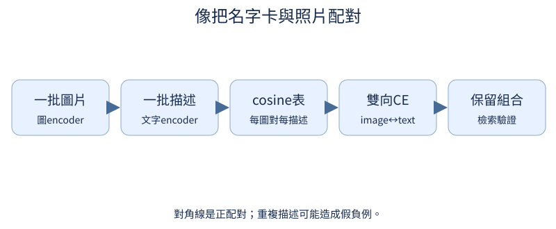

# 第 10 章：圖片如何進入文字模型

前置：embedding、序列與Linear。圖片入口先用16×16合成RGB，不需外部權重；圖片是否被理解必須等語言／視覺基礎能力訓練後測試。程式在tiny_perceptron/multimodal.py。

## 10.1 圖片是什麼 tensor？

**先想一想：**shape [3,16,16] 的3是三張圖片嗎？


RGB圖片每個座標有紅、綠、藍三個值。讀檔常得到[H,W,C]；模型常用[B,C,H,W]。換軸不是把圖片變成另一張。

**把直覺寫成數學：**uint8像素0–255可除255變0–1浮點數；先確認channel與座標軸。

**最小實驗：**以下程式只處理這節的問題。

```python
from tiny_perceptron.multimodal import scene

image = scene("red", "square")
print(image.shape, image[:, 8, 8])
import matplotlib.pyplot as plt

plt.imshow(image.permute(1, 2, 0))
plt.axis("off")
plt.show()
```

**如何讀結果：**單張tensor沒有batch軸，使用模型時再unsqueeze(0)。紅色中央像素是[1,0,0]。

**只改一件事：**只換成藍色，檢查哪個channel改變。

## 10.2 圖片怎麼切成序列？

**先想一想：**16×16圖、4×4patch，會有16還是64個patch？

把圖片依列順序切成不重疊小方塊，再把每塊內像素展成向量。先能拼回原圖，才相信patch順序正確。

**把直覺寫成數學：**patch數=(H/P)(W/P)，每個patch有C·P²個數。

**最小實驗：**以下程式只處理這節的問題。

```python
from tiny_perceptron.multimodal import scene, patchify, unpatchify

image = scene()[None]
patches = patchify(image, 4)
restored = unpatchify(patches, 3, 16, 16, 4)
print(patches.shape)
assert torch.equal(image, restored)
```

**如何讀結果：**[B,N,C·P²]；flatten順序在patchify/unpatchify中互相對應。

**只改一件事：**只把patch_size改成8，同時更新拼回配置。

## 10.3 Patch 怎麼變成向量？

**先想一想：**Dv=8會改變patch數嗎？

每個patch的像素經Linear轉成短向量，就和文字embedding一樣有固定feature維度。這個Linear會在所有patch共用。

**把直覺寫成數學：**[B,N,C·P²]→[B,N,Dv]。這不是把整張圖平均成一個token。

**最小實驗：**以下程式只處理這節的問題。

```python
from tiny_perceptron.multimodal import scene, patchify

patches = patchify(scene()[None], 4)
embedding = nn.Linear(48, 8)
features = embedding(patches)
print(patches.shape, features.shape)
assert features.shape == (1, 16, 8)
```

**如何讀結果：**Linear改feature軸，N不變；輸入pixel scale要與訓練一致。

**只改一件事：**只把Dv改成16。

## 10.4 怎麼保留圖片的空間位置？

**先想一想：**把圖左右交換和只換tensor儲存順序是同一件事嗎？

相同內容patch在不同位置，應帶不同空間線索。加入patch位置向量；重排內容時是否同時重排位置，代表不同操作。

**把直覺寫成數學：**x_i=patch_embedding_i+position_i；不固定空間對應就丟了位置。

**最小實驗：**以下程式只處理這節的問題。

```python
patches = torch.ones(1, 4, 3)
position = torch.arange(4.0)[None, :, None]
x = patches + position
print(x)
assert not torch.equal(x[:, 0], x[:, 3])
```

**如何讀結果：**這裡用數值示範位置，不是已學的視覺語意；encoder實作中位置是可學參數。

**只改一件事：**只移除position，檢查相同patch完全相同。

## 10.5 怎麼學到可用的視覺特徵？

**先想一想：**隨機encoder的shape正確，就代表知道圓形嗎？

先教encoder辨別生成器已知的形狀／顏色，才能談投影到語言模型。小分類head提供可核對label，之後丟掉head保留features。

**把直覺寫成數學：**分類CE的梯度回到encoder；train/held-out按屬性組合或生成seed分開。

**最小實驗：**以下程式只處理這節的問題。

```python
from tiny_perceptron.multimodal import VisionEncoder, scene

encoder = VisionEncoder(width=8)
classifier = nn.Linear(8, 2)
images = torch.stack([scene("red", "square"), scene("blue", "circle")])
features = encoder(images)
logits = classifier(features.mean(1))
loss = F.cross_entropy(logits, torch.tensor([0, 1]))
loss.backward()
print(features.shape, loss.item(), encoder.projection.weight.grad.norm().item())
```

**如何讀結果：**這裏只核對監督與梯度。GPU訓練入口是scripts/pretrain_encoders.py --modality vision --train。

**只改一件事：**只打亂shape labels，說明這將教錯什麼。

## 10.6 視覺與文字維度不同怎麼接？

**先想一想：**接頭維度正確，等於模型知道每個feature的意思嗎？


projector是兩種feature介面的轉接頭。輸入Dv維，輸出文字模型D維；尺寸相容只是必要條件，不表示語意已對齊。

**把直覺寫成數學：**projector W:[D,Dv]，輸出[B,N,D]。

**最小實驗：**以下程式只處理這節的問題。

```python
vision = torch.randn(1, 16, 8)
projector = nn.Linear(8, 12)
language_features = projector(vision)
print(language_features.shape)
assert language_features.shape == (1, 16, 12)
```

**如何讀結果：**projector需要合適訓練訊號；11.1比較隨機接頭與真的內容能力。

**只改一件事：**只改D，核對文字embedding也需匹配。

## 10.7 模型怎麼知道圖片放在哪？

**先想一想：**把3個視覺向量塞入1格，原回答索引還對嗎？

placeholder一格會展開成多個視覺向量。labels必須同步展開為ignored；完成後才shift一次，回答首字仍由前一格預測。

**把直覺寫成數學：**長度變化=N_visual−1；position、attention、labels都要用展開後長度。

**最小實驗：**以下程式只處理這節的問題。

```python
from tiny_perceptron.data import ByteTokenizer, IGNORE
from tiny_perceptron.multimodal import expand_modalities

tok = ByteTokenizer()
embedding = nn.Embedding(264, 8)
ids = torch.tensor([1, 5, 4, 73, 2])
labels = torch.tensor([-100, -100, -100, 73, 2])
features = {5: torch.randn(3, 8)}
x, y = expand_modalities(ids, labels, embedding, features, {5})
print(x.shape, y.tolist())
assert y[0, -2].item() == 73 and y.shape[1] == x.shape[1]
```

**如何讀結果：**ids是未shift序列；[73,2]是答案與EOS。attention依新長度建立，視覺位置不直接算文字loss。

**只改一件事：**只把視覺向量數從3改為5，核對答案索引跟著移動。

## 10.8 原本的文字功能還能正常嗎？

**先想一想：**新包裝即使不提供圖片，也應改變回答嗎？

沒有圖片時應直接走原文字路徑，不多加placeholder或改position。先檢查同權重的文字logits完全一樣，才比較多模態微調後能力。

**把直覺寫成數學：**同一weights、相同ids、相同positions下，兩個等價入口應相同。

**最小實驗：**以下程式只處理這節的問題。

```python
from tiny_perceptron.model import TinyLM, ModelConfig
from tiny_perceptron.multimodal import MultiModalLM

lm = TinyLM(ModelConfig(width=8))
multimodal = MultiModalLM(lm)
ids = torch.tensor([1, 20, 30])
a = lm(ids[None])["logits"]
b = multimodal(ids)["logits"]
assert torch.equal(a, b)
print("純文字路徑一致")
```

**如何讀結果：**這只驗證入口包裝，不能代替微調後的文字retention測試。

**只改一件事：**只故意加一個圖片標記但不提供圖，確認應拒絕此資料。

## 10.9 圖片和描述怎麼比較配對程度？

**先想一想：**相同方向但向量長度2倍，相似度應加倍嗎？



先在獨立實驗把圖與文字各編成向量，正規化後點積就是cosine相似度。矩陣對角線是原來的配對，不必用生成LLM纔有圖文對齊。

**把直覺寫成數學：**similarity=normalize(image)@normalize(text).T；值在−1到1附近。

**最小實驗：**以下程式只處理這節的問題。

```python
image = torch.tensor([[1.0, 0.0], [0.0, 1.0]])
text = torch.tensor([[2.0, 0.0], [0.0, 3.0]])
similarity = F.normalize(image, dim=-1) @ F.normalize(text, dim=-1).T
print(similarity)
assert torch.allclose(similarity, torch.eye(2))
```

**如何讀結果：**這是手設可查矩陣，不是CLIP訓練成果。每列問：這張圖最像哪段文字？

**只改一件事：**只交換文字兩列，觀察正確配對欄位改變。

## 10.10 正確描述怎麼比其他描述更接近？

**先想一想：**兩張一樣紅圓圖，各自文字都「紅圓」，應互斥當負例嗎？

把正確配對當分類答案，其餘batch文字當候選，使用CE教圖找文字。若多張圖共享同一句描述，它們可能成為假負例。

**把直覺寫成數學：**L_image=CE(similarity/τ, pairing_index)。τ與取樣temperature用途不同。

**最小實驗：**以下程式只處理這節的問題。

```python
scores = torch.tensor([[2.0, 0.0], [0.0, 2.0]], requires_grad=True)
targets = torch.arange(2)
loss = F.cross_entropy(scores / 0.5, targets)
loss.backward()
print(loss.item(), scores.grad)
```

**如何讀結果：**正配對分數收到提升方向，其他欄收到降低方向。實際重複描述需多正例處理或設計不同資料。

**只改一件事：**只把targets交換，觀察學習方向反轉。

## 10.11 能反過來用描述找圖片嗎？

**先想一想：**只加文字方向loss，feature尺寸需要改嗎？

文字找圖片是同一矩陣轉置後的問題。平均兩個方向的CE，避免只顧圖的查詢；但對角配對仍須正確。

**把直覺寫成數學：**L=(CE(S,I)+CE(Sᵀ,I))/2。

**最小實驗：**以下程式只處理這節的問題。

```python
scores = torch.tensor([[2.0, 0.1], [0.4, 1.8]], requires_grad=True)
labels = torch.arange(2)
loss = (F.cross_entropy(scores, labels) + F.cross_entropy(scores.T, labels)) / 2
loss.backward()
print(loss.item(), scores.grad)
```

**如何讀結果：**雙向檢索和生成caption是不同任務；學會配對不等於能寫句子。

**只改一件事：**只把某一方向權重加倍，檢查梯度變化。
