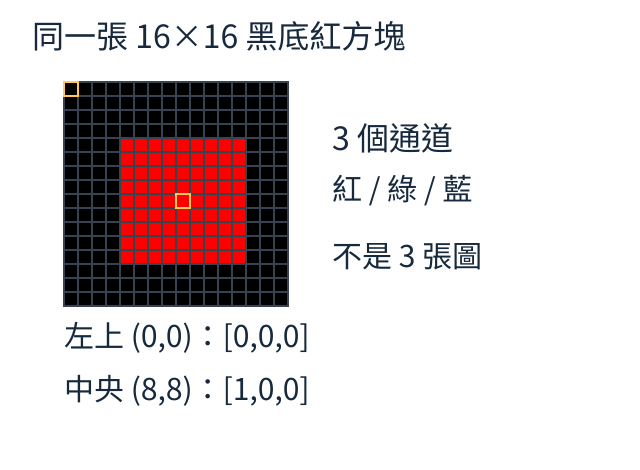
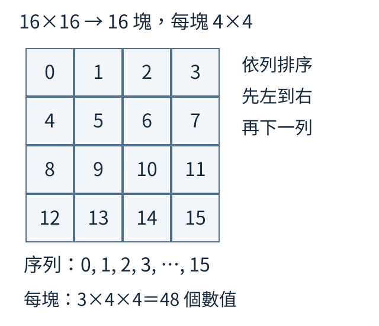
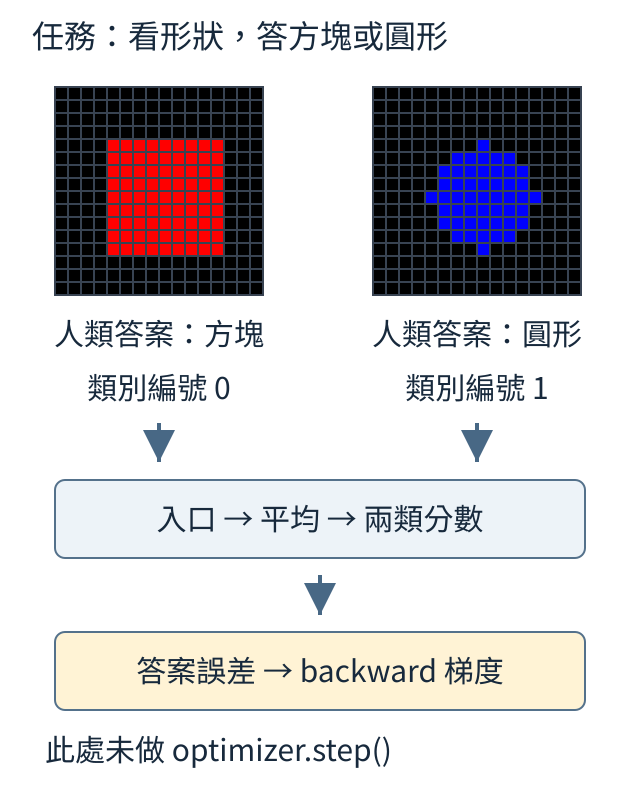
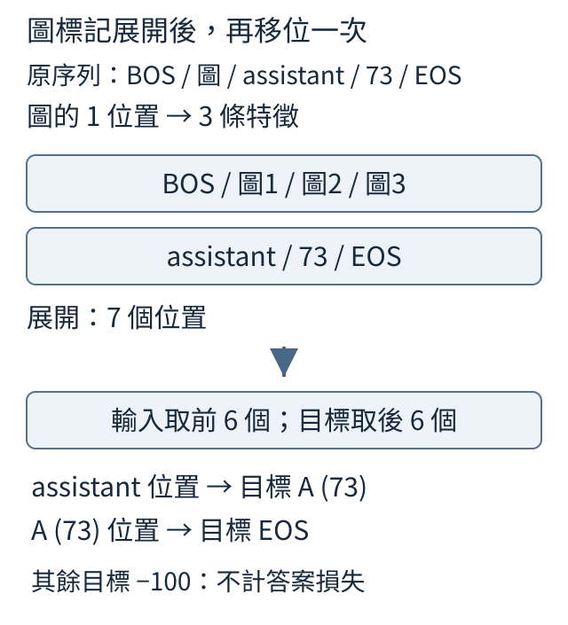

# 第 10 章：圖片如何進入文字模型

從一張黑底紅方塊開始，先把像素、圖塊與位置對應成數字，再接入文字序列。本章的短程式分別檢查形狀、排序、梯度與輸入目標對齊；接通介面和學會看圖，由不同證據確認。最後三節改問圖文配對，區分選候選卡片與生成句子。

## 10.1 一張紅色方塊，怎麼存成圖片 tensor？

看一張黑底紅方塊：中央像素是紅色，左上角是黑色。希望程式讀出中央的 `[1,0,0]` 與左上的 `[0,0,0]`，還要說清楚這些數字屬於哪一張圖、哪個位置。



RGB 是紅、綠、藍三個通道。一個像素的三個亮度合在一起才是它的顏色；本例 0 是沒有該色亮度，1 是生成器設定的最大亮度。tensor 是帶形狀的數字陣列，圖片用 `[C,H,W]` 排列：通道、高、寬。所以 `[3,16,16]` 表示一張圖的三種顏色通道，不是三張圖。

```python
from tiny_perceptron.multimodal import scene

image = scene("red", "square")
print("形狀", tuple(image.shape))
print("中央RGB", image[:, 8, 8].tolist())
print("左上RGB", image[:, 0, 0].tolist())
print("加入批次軸", tuple(image.unsqueeze(0).shape))
```

`scene("red","square")` 直接生成 16×16 的黑底紅方塊。`image[:,8,8]` 保留全部通道，取第 8 列、第 8 欄；索引從 0 開始。前三行印出 `(3,16,16)`、`[1.0,0.0,0.0]`、`[0.0,0.0,0.0]`。`.tolist()` 只是將選出的數值轉成清單，沒有更動圖片。

`unsqueeze(0)` 增加批次軸，得到 `(1,3,16,16)`；第一個 1 表示一次有一張圖。增加軸不會新增像素。若讀檔工具給的是 `[H,W,C]`，需要交換軸，不能只改形狀名稱而讓內容排錯。

照片常用整數 0–255 保存亮度，轉成浮點數後可以除以 255。這裡的合成圖已經是 0–1，不要再除一次。通道順序與亮度尺度都要和後續模型的約定一致。

練習把 red 改成 blue：中央應變成 `[0,0,1]`，軸長度不變。變的是藍通道的亮度，並不是增加了第三張圖。

<details>
<summary>回顧與查證</summary>

可回顧：[W.3的tensor與軸](../first-steps.md#W.3)。

</details>

## 10.2 圖片切成小塊後，如何排成序列？

同一張 16×16 圖，要排成一串可依序處理的材料。先切成邊長 4 的小方塊，英文叫 patch：每列 4 塊，共 16 塊；依列從左到右、再到下一列排列。每塊仍保存 RGB 的 3×4×4＝48 個數值。



圖中的 0–15 是小塊所在的序列位置，不是圖片類別。文字模型的一個輸入單位稱 token；在這裡，一條圖片特徵的位置來自一整塊圖，而不是塊內每個像素都變成一個字。

```python
import torch
from tiny_perceptron.multimodal import scene, patchify, unpatchify

image = scene()[None]
patches = patchify(image, 4)
restored = unpatchify(patches, 3, 16, 16, 4)
print("小塊序列", tuple(patches.shape))
print("拼回相同", torch.equal(image, restored))
```

`scene()[None]` 增加一張圖的批次軸。`patchify` 切塊並攤平每塊，得到 `(1,16,48)`。`unpatchify` 按通道 3、高寬 16、塊邊長 4 放回格子；`torch.equal` 印出 True，說明這次往返的每個數值相同。

往返成功核對的是兩個工具是否相容，還不能單獨證明排序符合約定。紙上四張卡若依列應為 `[a,b,c,d]`，切和拼都改成依欄的 `[a,c,b,d]`，仍能還原原圖。因此還要直接核對第二位置是否來自右上卡 b，真圖則核對已知位置與 RGB 通道。

把塊邊長改成 8 時，切和拼的參數都要一起改：每列 2 塊，共 4 塊，每塊 3×8×8＝192 個值，預期 `(1,4,192)` 且仍能拼回。這個切法沒有丟像素；下一節把每塊壓成短特徵時，才涉及哪些差異被保留。

<details>
<summary>回顧與查證</summary>

可回顧：[10.1的批次與RGB軸](10.md#10.1)。

</details>

## 10.3 每塊 48 個像素值，如何變成 8 個特徵？

上一節每塊有 48 個像素值，接下來希望每個位置用 8 個數字表示。可以用同一張加權配方表，對每塊的 48 個值乘權重、加總，再加偏置，產生 8 個輸出。這一排數字叫向量；配方表則是可以訓練的線性層。

```python
import torch
from torch import nn
from tiny_perceptron.multimodal import scene, patchify

torch.manual_seed(0)
patches = patchify(scene()[None], 4)
embedding = nn.Linear(48, 8)
features = embedding(patches)
print("輸入", tuple(patches.shape))
print("輸出", tuple(features.shape))
print("矩陣", tuple(embedding.weight.shape))
```

`nn.Linear(48,8)` 建立 48 進、8 出的變換；權重矩陣 `(8,48)` 的每一行負責一個輸出。固定種子 0 讓初始化可重做。程式印出 `(1,16,48)`、`(1,16,8)`、`(8,48)`：16 個位置保留，只改每位置的寬度。將像素變成這種特徵的入口稱 patch embedding。

共享配方表示每個位置遇到相似像素時使用相同計算，不表示 8 個數字已經懂顏色。它們的用途要由訓練目標建立。文字 embedding 按字詞編號查一排數字；這裡直接計算像素亮度的加權組合，兩者的入口不同。

例如兩個亮度 `[1,0]` 和 `[0,1]`，都經權重 `[0.5,0.5]`、偏置 0 得到 0.5。這個特定配方抹掉兩者差異。48 轉 8 同樣可能壓掉資訊，訓練要尋找保留任務線索的配方；寬度變短本身不是理解的證據。

練習只把輸出 8 改成 16，預期特徵 `(1,16,16)`、矩陣 `(16,48)`。兩個 16 分別是位置數與每位置特徵數，不能因數值相同就合成一個概念。

<details>
<summary>回顧與查證</summary>

可回顧：[10.2的patch形狀](10.md#10.2)、[W.5的矩陣配方](../first-steps.md#W.5)。

</details>

## 10.4 相同圖塊，如何知道它在左邊還是右邊？

兩塊像素內容相同的紅圖，一塊在左、一塊在右；只看內容向量無法分清所在格子。問「左邊是什麼」時，需要把位置也留下。可以像給卡片加座位提示，將等寬的位置向量加進內容向量。

```python
import torch

patches = torch.ones(1, 4, 3)
position = torch.arange(4.0)[None, :, None]
x = patches + position
print("形狀", tuple(x.shape))
print("位置0", x[0, 0].tolist())
print("位置3", x[0, 3].tolist())
print("仍相同", torch.equal(x[:, 0], x[:, 3]))
```

本例有 1 張圖、4 個位置、每位置 3 個特徵，內容全部是 1。`arange(4.0)` 產生 0、1、2、3，補軸後 `(1,4,1)`；廣播讓每位置的編號重複加到自己的三個特徵。輸出仍 `(1,4,3)`，位置 0 得 `[1,1,1]`，位置 3 得 `[4,4,4]`，相同比較為 False。

這是讓位置差異進入表示的手算式示範。正式模型可以使用可訓練位置向量，不會天然認定「加 3 就是右下」。切塊順序、位置對應與訓練要一起建立這個意義；四個位置也不能直接套在十六塊圖上。

還要分清兩種重排：只交換內容、位置提示留在原格，是把物件搬家；內容與原位置提示一起移動，只是換儲存順序，仍表示原來的空間位置。兩者不應混成同一個操作。

練習去掉 `+ position`，兩個位置都應是 `[1,1,1]`，比較變 True。它確認少掉的是位置區別，不是圖片張數或向量寬度。

<details>
<summary>回顧與查證</summary>

可回顧：[10.3每個patch的特徵](10.md#10.3)、[4.1文字序列的位置](04.md#4.1)。

</details>

## 10.5 形狀答案如何把梯度送回圖片入口？

看下面兩張合成圖：左邊是紅色方塊，右邊是藍色圓形。這次任務是回答形狀，所以人的答案先是「方塊」「圓形」。分類頭需要數字標籤，才約定方塊為 0、圓形為 1；因此兩張圖的正確標籤依序是 `[0,1]`。



編碼器把圖片變成特徵，分類頭再為方塊與圓形各算一個分數。交叉熵比較分數與正確標籤，得到猜錯代價；梯度則描述參數小幅改變會怎樣影響這個代價。本節只檢查這條影響能否傳回圖片入口。

```python
import torch
from torch import nn
from torch.nn import functional as F
from tiny_perceptron.multimodal import VisionEncoder, scene

torch.manual_seed(0)
encoder = VisionEncoder(width=8)
classifier = nn.Linear(8, 2)
images = torch.stack([scene("red", "square"), scene("blue", "circle")])
features = encoder(images)
logits = classifier(features.mean(1))
loss = F.cross_entropy(logits, torch.tensor([0, 1]))
loss.backward()
print("特徵", tuple(features.shape), "分數", tuple(logits.shape))
print("入口收到梯度", encoder.projection.weight.grad.norm().item() > 0)
```

`stack` 將兩張圖放成一批。`VisionEncoder(width=8)` 產生 `(2,16,8)`：兩張圖，各 16 個位置、8 個特徵。`mean(1)` 將每張的 16 條特徵平均，再由分類頭得到 `(2,2)`，每張各有兩個候選分數。標籤來自上面的形狀規則，不是模型自己猜出的名字。

`backward()` 反向計算梯度，最後檢查入口矩陣是否收到非零梯度，預期 True。程式沒有 `optimizer.step()`，所以參數尚未更新。它展示梯度通路，而不是訓練後能辨形狀的成績。

這兩張圖還有一個資料陷阱：紅色總是方塊，藍色總是圓形。即使後續練到兩張全對，模型也可能只用顏色。若要教形狀，應讓紅圓、藍圓同標圓形，紅方、藍方同標方塊；若要教顏色，則讓同色不同形狀共享顏色標籤。目標變了，資料與判準也要一起改。

特徵如何匯整同樣取決於問題。平均可以保留部分顏色線索，卻可能失去左右排列；同一份平均表示不會自動適合所有看圖問題。分類頭先提供可核對的監督，將來接文字模型仍需另測它能否寫出完整答案。

練習把標籤改成 `[1,0]`：現在提供的是相反形狀答案。程式仍可能收到梯度，因此梯度通過不能替作者保證標籤正確。

<details>
<summary>回顧與查證</summary>

可回顧：[10.3的像素變換](10.md#10.3)、[1.8分類猜錯代價](01.md#1.8)、[W.6梯度](../first-steps.md#W.6)。

原實驗的資料切分、更新設定與逐題結果見[既有實報](../../docs/course-experiments/results/encoders.json)；重做入口見[實驗說明](../../docs/course-experiments/README.md)。這是上述有限任務的歷史紀錄。

</details>

## 10.6 8 維圖片特徵，如何接到 12 維文字介面？

圖片入口每位置給 8 個數字，文字核心每位置需要 12 個。先用投影接頭 projector，把原有特徵重新組合成 12 個數字；它改的是每位置的寬度，不是把 16 塊圖變成 12 塊。

```python
import torch
from torch import nn

torch.manual_seed(0)
vision = torch.randn(1, 16, 8)
projector = nn.Linear(8, 12)
language_features = projector(vision)
print("視覺", tuple(vision.shape))
print("文字介面", tuple(language_features.shape))
print("接頭矩陣", tuple(projector.weight.shape))
```

`vision` 是人工造出的 `(1,16,8)` 特徵。線性接頭 `Linear(8,12)` 的矩陣是 `(12,8)`，各位置共用它，輸出 `(1,16,12)`。像輸入 `[1,2]` 分別取第一值、第二值、兩值相加，得到 `[1,2,3]`：新增輸出欄是重新組合，不是多出一份獨立知識。

尺寸相容使後面的算式能執行，含義是否合用還需學習。視覺特徵可能區分紅與藍，文字核心卻把自己的特徵用來區分詞義；成對圖片與正確描述可以教接頭，讓視覺差異成為生成答案的線索，這稱為對齊。

若編碼器把紅藍壓成完全相同表示，接頭無法可靠從相同輸入還原不同顏色。若輸出寬度設為 10，文字模型仍要求 12，則先遇到尺寸不符。這兩種失敗分別是資訊不足與介面不合，不能都靠改圖片大小處理。

練習把 12 改成 10，先算 `(1,16,10)` 和 `(10,8)`，再說明為何不能直接接 12 維核心。下一章再用完整回答確認是否對齊。

<details>
<summary>回顧與查證</summary>

可回顧：[10.3的特徵軸](10.md#10.3)、[W.5矩陣變換](../first-steps.md#W.5)。

</details>

## 10.7 圖片展開後，答案目標如何跟著移動？

一串訊息原本只有一個「圖片」格，實際圖片卻要放三條特徵。替換後，後面的助手角色與回答一起往後移兩格。除了移輸入，也要移對應目標，讓助手位置仍預測答案第一個字。

為了核對位置，本例手設答案為字母 A，再接結束標記。用 1 表開頭、5 表圖片、4 表助手、73 表 A、2 表結束；A 的 ASCII byte 是 65，加 8 得 ID 73。圖片特徵不對應要生成的字，目標填 `-100` 表示不計文字代價，但它們仍供後面讀取。

```python
import torch
from torch import nn
from tiny_perceptron.multimodal import expand_modalities

embedding = nn.Embedding(264, 8)
ids = torch.tensor([1, 5, 4, 73, 2])
labels = torch.tensor([-100, -100, -100, 73, 2])
features = {5: torch.randn(3, 8)}
x, y = expand_modalities(ids, labels, embedding, features, {5})
print("輸入特徵", tuple(x.shape))
print("下一格目標", y.tolist())
```

原五格展開為「開頭、圖1、圖2、圖3、助手、73、結束」七格，完整目標是 `[-100,-100,-100,-100,-100,73,2]`。然後只做一次下一位置對齊：輸入去掉末格，目標去掉首格，得到六格輸入 `(1,6,8)` 與 `[[-100,-100,-100,-100,73,2]]`。



圖裡將前四個上下文位置合成一列顯示，仍是開頭加三條圖特徵。索引 4 的輸入是助手、目標是 73；索引 5 的輸入是 73、目標是結束 2。不是先把答案給助手抄，也不是每個圖片位置都要輸出一個字。

後續位置編號和防偷看遮罩都按這六格建立：位置為 0–5，遮罩比較六個讀取位置與六個被讀位置。不能沿用原五格，或把未錯位七格當成實際輸入長度。先展開、再對齊，讓這個責任只發生一次。

練習將三條圖片特徵改成五條，預期輸入長度 8、前六個目標忽略，末兩個仍是 73 與 2。回答內容沒變，改變的是它在序列中的位置。

<details>
<summary>回顧與查證</summary>

可回顧：[10.6接頭輸出](10.md#10.6)、[7.4下一位置的答案對齊](07.md#7.4)。

</details>

## 10.8 沒附圖時，包裝會改變原文字計算嗎？

同一份文字模型、同一串三個文字編號，分別走原入口與加了圖片功能的包裝入口。沒有附圖時，希望兩者的候選分數逐項相同；這是介面接通前後的計算核對，不是問模型是否會寫文章。

```python
import torch
from tiny_perceptron.model import TinyLM, ModelConfig
from tiny_perceptron.multimodal import MultiModalLM

torch.manual_seed(0)
lm = TinyLM(ModelConfig(width=8)).eval()
multimodal = MultiModalLM(lm).eval()
ids = torch.tensor([1, 20, 30])
a = lm(ids[None])["logits"]
b = multimodal(ids)["logits"]
print("分數形狀", tuple(a.shape))
print("純文字入口相同", torch.equal(a, b))
```

`MultiModalLM(lm)` 包住的是同一個文字模型，不是另一份新權重。兩邊都設為 `eval()`，本例避開訓練模式下的隨機行為。原入口以 `ids[None]` 補批次軸，包裝則在內部處理它。

三個編號沒有圖片標記，輸出都是 `(1,3,264)`：一筆、三位置、264 個文字候選。`torch.equal` 印 True，確認包裝沿用相同文字計算。即使權重隨機、兩路都答不好，一致性仍可以成立；它和答案正確是兩個問題。

如果放圖片標記卻沒有圖片，應報缺資料。嘗試 `multimodal(torch.tensor([1,5,4]))` 會出現佔位標記缺少配對圖片／聲音的錯誤，不能默默把它當普通字詞。

訓練後若開放文字權重，計算可能合理地改變；是否保住舊技能，要用固定文字題核對答案。若改包裝後立即不同，先查輸入、位置與運算路徑；若只在訓練後退步，再查更新範圍與資料。練習換成 `[1,40,50]`，預期形狀與一致性仍相同。

<details>
<summary>回顧與查證</summary>

可回顧：[10.7模態標記與展開](10.md#10.7)、[4.6輸出候選分數](04.md#4.6)、[16.8](16.md#16.8)。

</details>

## 10.9 怎麼從向量方向比較圖文配對？

有兩張圖片卡和兩張文字卡，先只問「哪張說明卡最配這張圖」，不要求生成句子。下面用手設向量代表它們：第一對 `[1,0]` 與 `[2,0]` 同方向，第二對 `[0,1]` 與 `[0,3]` 同方向。

先除以自身長度，讓方向比較不受倍率支配，叫歸一化。例如 `[3,4]` 長度是 √(9+16)＝5，變成 `[0.6,0.8]`。歸一化向量的點積稱餘弦相似度，同方向 1、垂直 0、反方向 −1；這是數字空間的方向，並非圖上的左右。

```python
import torch
from torch.nn import functional as F

image = torch.tensor([[1.0, 0.0], [0.0, 1.0]])
text = torch.tensor([[2.0, 0.0], [0.0, 3.0]])
similarity = F.normalize(image, dim=-1) @ F.normalize(text, dim=-1).T
print(similarity)
print("每張圖選文字欄", similarity.argmax(-1).tolist())
```

`normalize(...,dim=-1)` 各自處理每列向量；文字矩陣轉置後，矩陣乘法算出 `[[1,0],[0,1]]`。每橫列是一張圖，每直欄是一段文字，選各列最大欄得到 `[0,1]`，與此例預先安排的配對一致。

相似度不是機率，一列不必加總為 1。`[1,1]` 歸一化後和 `[1,0]` 的相似度約 0.707；兩個候選可以同時得到這個值。之後若用分類代價學配對，才再將候選分數轉成機率。

這個手算核對了比較方式，沒有執行真實編碼器。真圖與真文字需要各自學出有用向量；同寬隨機特徵不會自動有配對意義。這種從候選找匹配內容的工作叫檢索，和寫出新的描述不同。

練習交換兩張文字卡，預期矩陣變成 `[[0,1],[1,0]]`、選中欄 `[1,0]`。配對身份不變，只有顯示位置改變；數值仍用浮點數，因為歸一化需要它。

<details>
<summary>回顧與查證</summary>

可回顧：[W.5向量與點積](../first-steps.md#W.5)、[10.5編碼器特徵](10.md#10.5)。

原實驗的資料切分、更新設定與逐題結果見[既有實報](../../docs/course-experiments/results/contrastive.json)；重做入口見[實驗說明](../../docs/course-experiments/README.md)。這是上述有限任務的歷史紀錄。

</details>

## 10.10 配對標籤怎麼決定分數的調整方向？

兩張圖的正確描述依序放在文字欄 0、1。希望每張圖的正確欄分數比另一欄高。將同批文字當候選、用正確欄當標籤，就能算猜錯代價；這種拿正確配對和其他候選比較的學習稱對比學習。

```python
import torch
from torch.nn import functional as F

scores = torch.tensor([[2.0, 0.0], [0.0, 2.0]], requires_grad=True)
targets = torch.arange(2)
loss = F.cross_entropy(scores / 0.5, targets)
loss.backward()
print("代價", round(loss.item(), 4))
print("梯度", scores.grad)
```

本例手設分數 `[[2,0],[0,2]]`，並不等於上一節的餘弦矩陣。`targets` 為 `[0,1]`；分數除以正數 0.5 是溫度縮放，使候選差距放大。交叉熵比較正確欄機率，代價約 0.0181，梯度約 `[[-0.0180,0.0180],[0.0180,-0.0180]]`。

梯度下降用舊值減去步長乘梯度。正確欄是負梯度，若以 0.1 更新，2 約成 2.0018；錯誤欄是正梯度，0 約成 −0.0018。這是從符號追到調整方向的手算，程式只做 backward，沒有真正更新。

若分數由圖片和文字編碼器算出，梯度會沿計算傳回兩端。共享參數會同時影響多個分數，因此更新後需要重新算矩陣，不能只在報表對角線加數字就算完成訓練。

還要先確認候選確實不配。兩張圖若都是紅圓、兩段描述也都是「紅圓」，非對角欄同樣正確；硬把它當錯誤便是假負例。可以允許多個正確描述，或在入門批次先選不同屬性的配對。

練習將標籤改為 `[1,0]`，預期非對角欄收到負梯度，代價提高。這是把配對告訴模型反了，不是合理的資料增強。

<details>
<summary>回顧與查證</summary>

可回顧：[10.9相似度矩陣](10.md#10.9)、[1.8交叉熵](01.md#1.8)、[1.12梯度下降更新](01.md#1.12)。

原實驗的資料切分、更新設定與逐題結果見[既有實報](../../docs/course-experiments/results/contrastive.json)；重做入口見[實驗說明](../../docs/course-experiments/README.md)。這是上述有限任務的歷史紀錄。

</details>

## 10.11 圖找文和文找圖，為什麼要分開算？

同一張配對分數表，找文字時在每橫列選候選；找圖片時則在每直欄選候選。先看手設表 `[[2.0,0.1],[0.4,1.8]]`：橫列代表圖，直欄代表文字，正確配對都是索引 0、1。

```python
import torch
from torch.nn import functional as F

scores = torch.tensor([[2.0, 0.1], [0.4, 1.8]], requires_grad=True)
labels = torch.arange(2)
image_to_text = F.cross_entropy(scores, labels)
text_to_image = F.cross_entropy(scores.T, labels)
loss = (image_to_text + text_to_image) / 2
loss.backward()
print("圖找文", round(image_to_text.item(), 4))
print("文找圖", round(text_to_image.item(), 4))
print("平均", round(loss.item(), 4))
print("梯度符號", torch.sign(scores.grad).tolist())
```

原表算「圖找文」，轉置 `scores.T` 讓文字變橫列、圖變直欄，算「文找圖」。兩個交叉熵約 0.1799、0.1758，平均約 0.1779；梯度符號是 `[[-1,1],[1,-1]]`。同一分數因此收到兩方向候選競爭的影響。

兩項不必相等：圖找文比較 2.0 對 0.1、0.4 對 1.8；文找圖比較 2.0 對 0.4、0.1 對 1.8，差距不同。若只用對稱表，很容易把雙向誤讀為同一算式重複兩次。

雙向平均表達兩種查詢都重要，但不保證每次效果勝過單向。原六類小實驗中，兩種版本的最後題、兩個方向都為 6/6，沒有觀察到答對數優勢；驗證也非全部正確。這只能支持該有限候選配對，不能當大型檢索比較。

檢索是在既有卡片中選一張，生成描述要逐步寫出文字。兩者可共享特徵，能力證據仍需分開。相同描述對多張圖時，也要沿用上一節的多正確配對規則。

練習改成 `(2*image_to_text + text_to_image)/3`，預期形狀不變、代價更靠近圖找文。它改的是重視程度，沒有增加新圖片資訊。

<details>
<summary>回顧與查證</summary>

可回顧：[10.10把配對當分類](10.md#10.10)、[W.5矩陣轉置](../first-steps.md#W.5)。

原實驗的資料切分、更新設定與逐題結果見[既有實報](../../docs/course-experiments/results/contrastive.json)；重做入口見[實驗說明](../../docs/course-experiments/README.md)。這是上述有限任務的歷史紀錄。

</details>
