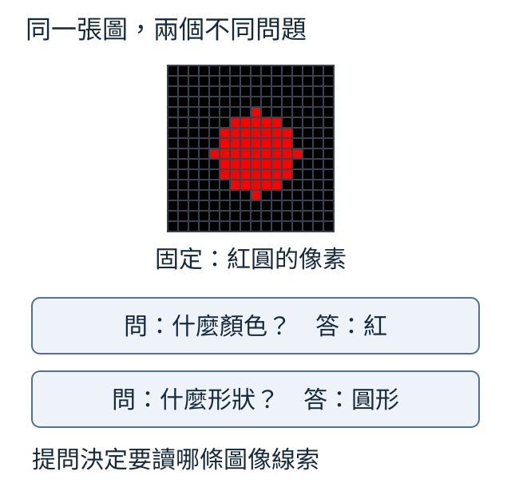
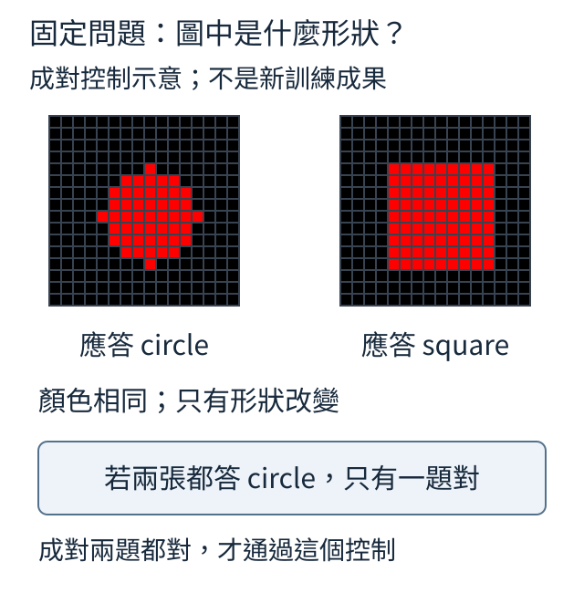
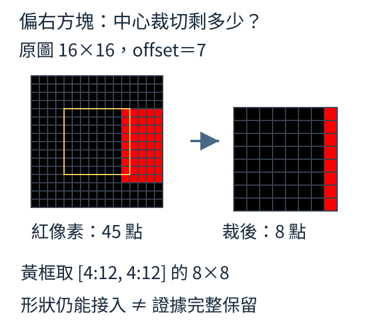
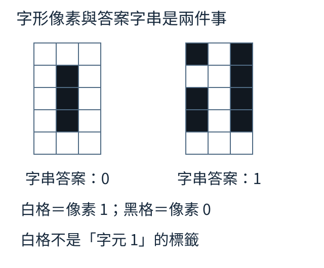
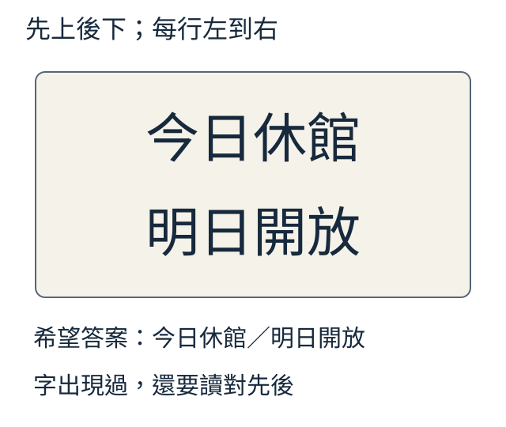
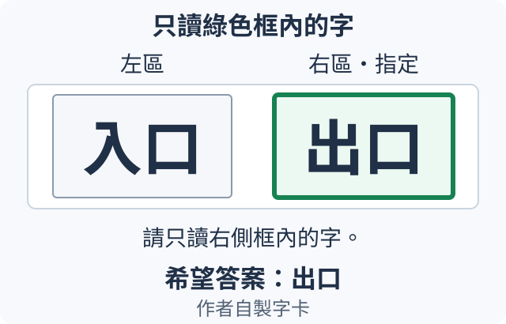

# 第 11 章：對齊、問答與語言能力保留

圖片接到文字介面之後，還要確認它能改變正確答案。本章先分開接通、梯度與實際更新，再設計同圖多問、替圖與舊文字技能對照。後半段檢查像素可見性、有限讀字與順序，最後以少量服飾和短字詞安排可核對的看圖任務。

## 11.1 接頭輸出不同，就算理解圖片了嗎？

文字描述「紅色圓形」時能回答紅，換成紅圓圖片時也應回答紅，再換藍圓圖片時應改答藍。這三個對照分別檢查原文字能力、圖片接入與圖片內容的作用。只知道兩個輸出分數不同，還不夠。

先看一個更小的算例：寬 4 的全 0、全 1 特徵，經同一接頭變成寬 8 的向量。

```python
import torch
from torch import nn

torch.manual_seed(0)
projector = nn.Linear(4, 8)
a, b = torch.zeros(1, 4), torch.ones(1, 4)
difference = (projector(a) - projector(b)).norm()
print("輸出形狀", tuple(projector(a).shape))
print("對輸入差異敏感", difference.item() > 0)
```

輸出 `(1,8)`，兩個輸出差向量的長度大於 0，印 True。`Linear` 用權重乘輸入並加偏置；例如權重 `[1,2,0,0]`、偏置 0.5，兩輸入會得到 0.5、3.5。隨機配方同樣可能傳遞差異，但沒有正確答案或文字模型，所以不證明懂紅藍。

「維度相容」只說每位置的數字個數符合介面；「語義對齊」還要確認這些線索能被核心用來生成正確內容。原文字題先失敗，就不能把後面所有失敗歸給圖片接頭；文字題成功而圖片題失敗，才進一步查圖片特徵與接頭。

將以下兩行放在算 difference 之前，再重新執行：

```python
with torch.no_grad():
    projector.weight.zero_()
```

所有輸入乘 0，輸出只剩相同偏置，所以差長度 0、比較 False。這是手動安排對照權重，不是訓練；在差值已算完後清零，舊 difference 也不會自行重算。它找出通路不傳差異，仍不能單獨判斷是否懂圖片。

<details>
<summary>回顧與查證</summary>

可回顧：[10.6的projector接頭](10.md#10.6)、[10.5的視覺特徵訓練](10.md#10.5)。

</details>

## 11.2 怎麼確認真正被更新的是哪一批參數？

只想教圖片接頭，就先把它的名字與數量列出，再確認優化器收錄同一批參數。接頭得到梯度、被列入更新名單、數值真的改變，是三個不同的檢查。

```python
import torch
from tiny_perceptron.model import TinyLM, ModelConfig
from tiny_perceptron.multimodal import MultiModalLM

model = MultiModalLM(TinyLM(ModelConfig(width=8)))
model.requires_grad_(False)
model.image_projector.requires_grad_(True)
trainable = []
parameters_to_update = []
for name, p in model.named_parameters():
    if p.requires_grad:
        trainable.append((name, p.numel()))
        parameters_to_update.append(p)
optimizer = torch.optim.AdamW(parameters_to_update, lr=0.001)
print("可訓練", trainable)
print("更新參數總數", sum(p.numel() for group in optimizer.param_groups for p in group["params"]))
```

程式先凍結整個模型，再開放 `image_projector`。`requires_grad` 控制是否為該參數累積新梯度；`named_parameters()` 提供名稱與參數，`numel()` 數數字。文字寬 8、圖片寬 16，因此權重有 8×16＝128 個值，偏置 8 個，共 136。

兩份清單收同一批參數：一份印名稱和數量，一份交給 AdamW。`optimizer.param_groups` 裡的參數數量也應為 136。這裡沒有算代價或執行 step，只確認名單，不宣稱已更新。

凍結文字權重不等於禁止它參與計算。只要計算仍被記錄，答案代價可以穿過固定文字運算，傳回接頭；若把整段文字計算放在 `no_grad()` 中，則可能切斷所需路徑。`eval()` 改變訓練模式行為，也不等於凍結。

階段切換時先決定範圍，再建優化器。若途中凍結，舊 grad 要清成 None，並排除更新名單；只改開關不會清掉歷史梯度。反過來，解凍新層也不會讓原優化器自動收它。None表示沒有梯度，本段AdamW會跳過該參數；0則是一份數值為零的梯度，仍可能受保留的歷史方向或權重衰減影響。歷史方向如何延續見[5.3](05.md#5.3)，零梯度仍縮小權重的例子見[5.5](05.md#5.5)。

練習在 `model.image_projector.requires_grad_(True)` 後、`trainable = []` 前，加入一行 `model.language.blocks[-1].requires_grad_(True)`，再重新執行本節程式。`[-1]` 選最後文字區塊；這個預設模型只有一個區塊，所以預期名單新增 `language.blocks.0`，總數由136成976。這次只核對名稱與優化器收錄的數量；[11.3](#11.3)接著檢查梯度通路，[5.1](05.md#5.1)示範step前後的數值更新。真正訓練時仍要分別核對這三件事。

<details>
<summary>回顧與查證</summary>

可回顧：[W.6梯度與更新](../first-steps.md#W.6)、[10.6接頭](10.md#10.6)、[5.17](05.md#5.17)。

</details>

## 11.3 只調圖片接頭，梯度怎麼穿過固定文字核心？

給一張紅方塊，目標短描述是 `red square`。如果圖片特徵能分相關屬性，文字核心也會用這些詞，可以先只調接頭，讓視覺線索接到文字行為。本節先確認答案代價能穿過固定核心回到接頭。

```python
import torch
from tiny_perceptron.data import ByteTokenizer
from tiny_perceptron.model import TinyLM, ModelConfig, masked_loss
from tiny_perceptron.multimodal import MultiModalLM, scene

torch.manual_seed(0)
tok = ByteTokenizer()
model = MultiModalLM(TinyLM(ModelConfig(width=8)))
model.requires_grad_(False)
model.image_projector.requires_grad_(True)
answer = tok.encode("red square") + [tok.eos_id]
prefix = [tok.bos_id, tok.user_id, tok.image_id, tok.eos_id, tok.assistant_id]
ids = torch.tensor(prefix + answer)
labels = torch.tensor([-100] * len(prefix) + answer)
out = model(ids, labels, image=scene())
loss = masked_loss(out["logits"], out["labels"])
loss.backward()
print("接頭收到梯度", model.image_projector.weight.grad.norm().item() > 0)
print("語言權重未累積梯度", model.language.embedding.weight.grad is None)
```

答案 10 個 ASCII 位元組加 EOS，共 11 個有效目標。前綴放角色、圖片與助手位置，labels 把前綴設 −100；模型先展開圖片，再做下一位置對齊。masked_loss 只對回答與結束算交叉熵，圖片仍是上下文。

兩行預期 True：接頭收到非零梯度，凍結的文字 embedding 沒有自己的 grad。固定文字運算仍傳遞對接頭的影響；沒有優化器 step，所以這個短例是梯度通路，不是生成成功率。

既有接頭小實驗真正更新後，完整描述仍為 0/6，雖然標準答案上下文裡的預測代價降低。紅方塊只生成 `red`，缺了空白與 square；綠圓還會重複 e。這保留一個有用差別：訓練時計算下一字常用標準前文，叫 teacher forcing；生成時接自己的上一字，前面一錯，後面可能跟著偏離。

因此要分開核對兩端能力、接頭更新、完整回答與 EOS。這次弱底座只有部分文字題做對，不能拿失敗推出所有接頭方案都無效；接頭也無法補回圖片入口已丟掉的資訊。

練習將接頭也凍結，在 backward 前印可訓練總數，會是 0，接著 backward 報代價未連到可求梯度參數。這是關閉所有學習路徑的反例，應在啟動訓練前攔下。

<details>
<summary>回顧與查證</summary>

可回顧：[11.1尺寸與理解的區別](11.md#11.1)、[11.2凍結名單](11.md#11.2)、[10.7展開後才錯位](10.md#10.7)、[W.6梯度與更新](../first-steps.md#W.6)。

原實驗的資料切分、更新設定與逐題結果見[既有實報](../../docs/course-experiments/results/projector.json)；重做入口見[實驗說明](../../docs/course-experiments/README.md)。這是上述有限任務的歷史紀錄。

</details>

## 11.4 同一張圖片，換問題後應怎麼改答案？

同一張紅圓圖，問顏色希望答「紅」，問形狀希望答「圓形」。圖片沒變，問題決定要取哪項資訊；這才是圖片問答，而不只是每次念出完整描述。



```python
records = [
    {"image": "red_circle", "question": "什麼顏色？", "answer": "紅"},
    {"image": "red_circle", "question": "什麼形狀？", "answer": "圓形"},
]
for row in records:
    print(row["image"], row["question"], "→", row["answer"])
print("同圖", records[0]["image"] == records[1]["image"])
print("答案不同", records[0]["answer"] != records[1]["answer"])
```

兩筆記錄的 image 身份相同、答案不同，兩項比較都印 True。image 欄的 `red_circle` 是資料名稱，不是已送進模型的像素；實際資料要同時保存圖或可重建它的生成條件，不能只教問答文字便宣稱模型看圖。

訓練時把圖、問題與正確短答保持成對，回答位置算代價。若生成器有隨機選擇，也記種子、版本與參數，才能重建材料。例如分成訓練組與留出檢查組，同一原圖的所有問答都要放在同一組；否則圖片可能已在訓練中出現，卻把換問法的題目當成新圖檢查。

再固定問題、換圖片：紅圓與藍圓都問顏色，答案應分別紅與藍。同圖多問檢查選擇範圍，同問換圖檢查圖片作用。若只有紅圓多問，模型可能靠「顏色題答紅」猜中。

回答「紅色圓形」雖包含正確詞，對只要顏色的問題仍多答了內容。先訂短答規則，再評內容與範圍；練習加一筆「同時給顏色與形狀」，才把目標改成「紅色圓形」。

<details>
<summary>回顧與查證</summary>

可回顧：[11.3圖片描述目標](11.md#11.3)、[7.1對話資料](07.md#7.1)。

原實驗的資料切分、更新設定與逐題結果見[既有實報](../../docs/course-experiments/results/vqa.json)；重做入口見[實驗說明](../../docs/course-experiments/README.md)。這是上述有限任務的歷史紀錄。

</details>

## 11.5 多開一些文字層，怎麼比較成本與效果？

圖片問答可以只調接頭，也可以連最後文字區塊一起調，或開放整個模型。先數每種方案允許改幾個數字，再用相同資料與預算比較答案；參數多不代表新題一定更好。

```python
from tiny_perceptron.model import TinyLM, ModelConfig
from tiny_perceptron.multimodal import MultiModalLM

model = MultiModalLM(TinyLM(ModelConfig(width=8)))
for mode in ["projector", "partial", "all"]:
    model.requires_grad_(mode == "all")
    model.image_projector.requires_grad_(True)
    if mode == "partial":
        model.language.blocks[-1].requires_grad_(True)
    count = sum(p.numel() for p in model.parameters() if p.requires_grad)
    print(mode, count)
```

每輪先重設開關，再開所需部分，避免上輪殘留。寬 8 的預設模型印 projector 136、partial 976、all 8296。partial 在這段程式只開最後一個文字區塊與接頭；all 包含聲音零件，純圖片輸入未必讓它們收到梯度。

可訓練數量是成本線索。參數本身之外，訓練還可能存梯度與 AdamW 歷史狀態；實際用量取決於參數是否參與更新。新任務效果則要從相同起點、同樣題目與有效回答位置比較，並另測原文字任務。

既有較寬模型的小對照，每版都使用3,830個有效回答目標；驗證十二題與最後檢查十二題是分開的兩組題，結果如下：

| 更新範圍 | 可訓練參數 | 驗證答對 | 最後題答對 |
| --- | ---: | ---: | ---: |
| 圖片接頭 | 1,088 | 3/12 | 3/12 |
| 接頭＋最後文字區塊 | 50,816 | 10/12 | 12/12 |
| 全部 | 145,664 | 12/12 | 9/12 |

最多參數沒有最高最後題成績；中間方案的驗證也有錯題。這批只有十二題，不能選成所有模型的最佳範圍。比較的是這份資料與配方，而不是單看參數排名。

練習將短程式的 `ModelConfig(width=8)` 改成 `ModelConfig(width=8, layers=2)`，接頭仍 136，partial 仍只開最後一層，all 多一個區塊。寬度、深度與更新範圍是三種選擇。重做表中實驗時，固定工具的 partial 是最後區塊；[T.6的訓練CLI](../training.md#T.6)則把partial定義為接頭加首末文字區塊，按所用入口的約定選擇更新範圍。

<details>
<summary>回顧與查證</summary>

可回顧：[11.2參數凍結與優化器](11.md#11.2)、[4.5一個模型區塊](04.md#4.5)。

原實驗的資料切分、更新設定與逐題結果見[既有實報](../../docs/course-experiments/results/vqa.json)；重做入口見[實驗說明](../../docs/course-experiments/README.md)。這是上述有限任務的歷史紀錄。

</details>

## 11.6 先對齊再問答，怎麼和直接問答公平比較？

一個方案先教圖片描述，再教問答；另一個直接用問答學接頭與回應。如果第一方案多花一整段訓練，最後較好可能只是多用了資料。先把兩者的總有效回答位置排成相同預算。

```python
budget = 10000
plans = {
    "兩階段": {"描述對齊": 4000, "問答微調": 6000},
    "直接問答": {"描述對齊": 0, "問答微調": 10000},
}
for name, plan in plans.items():
    total = sum(plan.values())
    print(name, plan, "總有效位置", total, "符合預算", total == budget)
```

兩階段分 4,000＋6,000，直接問答用 10,000，程式都印總數 10,000、True。有效位置指真正計入答案代價的位置，不是問題字數，也不是完整樣本數；長答與短答混合時，相同步數未必同量。

這張表只是預算核對。實際比較還要同一初始模型、明確的更新範圍、同一批留出圖文題，以及基模原本會做的文字題。第一階段接頭需要帶到第二階段，不能花完預算又從隨機接頭重新開始。

既有小對照將兩階段合計 18,238 個有效目標，直接方案到最後一批為 18,256，差 18 個。最後圖片問答分別 9/12、10/12；一題差距不支持普遍優劣，也不能說前段對齊完全沒影響。直接版本未另列原文字留出分數，所以這個比較不支持文字保留結論。

描述對齊與問答 SFT 都可以用文字預測代價，差在材料、任務與開放參數。兩種是可比較安排，不是規定每個成品都必須先後做完。

練習把對齊 4,000 改 2,000，問答要改 8,000 才保持總量。只改第一項，預算核對會 False；計畫改了，測量結果不能跟著手改。

<details>
<summary>回顧與查證</summary>

可回顧：[11.3描述對齊](11.md#11.3)、[11.4圖片問答](11.md#11.4)、[7.3有效學習位置](07.md#7.3)。

原實驗的資料切分、更新設定與逐題結果見[既有實報](../../docs/course-experiments/results/vqa.json)；重做入口見[實驗說明](../../docs/course-experiments/README.md)。這是上述有限任務的歷史紀錄。

</details>

## 11.7 新圖文能力進步時，舊文字能力有沒有退步？

手寫成績表裡，圖文題從 2/10 成 7/10，原文字題卻從 8/10 成 6/10。新技能進步可以和舊技能退步同時發生。把兩類並排，才知道學習共享文字權重的代價。

```python
recipe = {"文字有效位置": 750, "圖文有效位置": 250}
recorded = {
    "訓練前": {"文字答對": 8, "圖文答對": 2},
    "訓練後": {"文字答對": 6, "圖文答對": 7},
}
total_positions = sum(recipe.values())
ratios = {}
for category, positions in recipe.items():
    ratios[category] = positions / total_positions
print("示例訓練比例", ratios)
for phase, scores in recorded.items():
    print(phase, "文字", scores["文字答對"] / 10, "圖文", scores["圖文答對"] / 10)
```

recipe 將 1,000 個有效位置分成文字 750、圖文 250，印比例 0.75、0.25；recorded 是人工成績示例，兩類各除固定十題，印前後正確率。這不是 75% 回放的訓練結果，而是報告方式。

能力保留是固定原文字題，在訓練前後核對答案。訓練前介面計算一致，不能替代這項檢查。舊文字例可混回訓練，稱回放，但留出題不能混入。

既有小實驗的對照如下，圖文與文字分母不同：

| 更新方案 | 新圖片題 | 原文字題 |
| --- | ---: | ---: |
| 只訓接頭 | 3/12 | 5/10 |
| 接頭＋最後文字區塊 | 12/12 | 2/10 |
| 全部開放 | 9/12 | 1/10 |
| 全部＋文字回放 | 9/12 | 4/10 |

原起點文字都是 5/10。回放版較能保留這批文字題，但沒有完全回到起點；它和其他版本的總有效目標不相同，所以不是嚴格隔離回放比例的因果比較。0.5 抽文字題的機率，也不等於有效位置或時間各半。

實測要看逐題哪個答案改對、哪個改錯，固定生成方式，不只看淨少兩題。混合 loss 下降也可能來自較容易的組佔比變大。練習只改 recipe 為 500／500，比例成各半；recorded 保持原值，因為改計畫不會自行產生成績。

<details>
<summary>回顧與查證</summary>

可回顧：[7.15舊技能遺忘](07.md#7.15)、[7.16舊資料回放](07.md#7.16)、[10.8純文字入口一致性](10.md#10.8)。

原實驗的資料切分、更新設定與逐題結果見[既有實報](../../docs/course-experiments/results/vqa.json)；重做入口見[實驗說明](../../docs/course-experiments/README.md)。這是上述有限任務的歷史紀錄。

</details>

## 11.8 換圖後答對新圖，才能說用了圖片嗎？

四張圖是兩圓兩方；完全不看圖、永遠猜圓，只能答對一半。若資料改成九圓一方，同一規則就能得九成。先算這個固定猜測基準，才知道高分是否真的需要圖片。

```python
truth = ["circle", "square", "circle", "square"]
text_only = ["circle"] * len(truth)
accuracy = sum(a == b for a, b in zip(truth, text_only)) / len(truth)
print("平衡資料的固定猜測", accuracy)
imbalanced = ["circle"] * 9 + ["square"]
print("九比一資料的固定猜測", imbalanced.count("circle") / len(imbalanced))
```

前一組印 0.5，後一組印 0.9；變的是資料比例，不是模型。真模型還需成對檢查：固定「什麼形狀」，圓換成方時，希望答案 circle→square，並按換入圖的真值評分。



圖中展示既有六對形狀題的失敗模式：模型一直答 circle，原題和替圖各 3/6，兩端同時正確卻是 0/6。只看前後同樣一半，會漏掉它根本沒正確跟隨形狀。

遮圖是另一種檢查：移除像素但保留原答案，觀察原題成績對線索的依賴，稱消融。錯配圖片仍按原答案也是原答案一致率；改按新圖答案才是新圖正確率。兩者不能混報成同一能力。

既有介入中，顏色換圖後能跟著改對，例如紅圖換入綠圖回 green；形狀始終猜 circle。原圖總數 9/12 因而掩蓋不同線索的使用。遮圖後分數下降可以提供線索，成對回答按規則改對則更直接。

替換要改問題相關屬性。紅圓換藍圓，形狀答案本來不必變；不能把不變一律算沒看圖。練習為一張圓改成方，先寫應改的答案，再看模型；這比事後只說輸出不同更清楚。

<details>
<summary>回顧與查證</summary>

可回顧：[11.4答案依圖與問題](11.md#11.4)、[11.1敏感不等於正確](11.md#11.1)。

原實驗的資料切分、更新設定與逐題結果見[既有實報](../../docs/course-experiments/results/vision_ablation.json)；重做入口見[實驗說明](../../docs/course-experiments/README.md)。這是上述有限任務的歷史紀錄。

</details>

## 11.9 裁切後，模型還收得到作答線索嗎？

紅方塊靠在原圖右邊，中心裁切只留下一條紅色窄帶。問顏色可能仍有線索，問完整形狀卻可能缺資料。先看前處理後的圖，再判斷是哪一段出問題。



```python
from tiny_perceptron.multimodal import scene

image = scene("red", "square", offset=7)
crop = image[:, 4:12, 4:12]
print("原圖形狀", tuple(image.shape), "裁切形狀", tuple(crop.shape))
print("原圖紅色格", int((image[0] > 0).sum()))
print("裁切紅色格", int((crop[0] > 0).sum()))
```

原圖 `(3,16,16)`，裁切 `(3,8,8)`，紅通道亮格從 45 成 8。切片 `4:12` 取索引 4–11；方塊中心橫索引 15，本來就超出右界一部分，所以原圖也不是完整 81 格。

圖中的框是實際裁切範圍，不是模型自動找出的物件。補空白或放大可以恢復入口尺寸，卻不能還原被切掉的像素。縮圖則是把較多像素合成較少像素，也可能把小字與背景混在一起。

既有裁切介入後，十二題仍答對九題（9/12），不能說資訊無損：殘留色帶仍能辨色，而形狀原先就一律猜 circle。原本不會辨形狀的測試，無法顯示裁切造成多少形狀退步。

排錯時保存原圖、裁切設定與處理後圖。若目標完全消失，答案也應允許看不見，不能強迫用原圖真值猜。練習把 offset 改 0，原紅格 81、中心裁切紅格 64；這次只改前處理材料，沒有改變模型。

<details>
<summary>回顧與查證</summary>

可回顧：[10.1像素與坐標](10.md#10.1)。

原實驗的資料切分、更新設定與逐題結果見[既有實報](../../docs/course-experiments/results/vision_ablation.json)；重做入口見[實驗說明](../../docs/course-experiments/README.md)。這是上述有限任務的歷史紀錄。

</details>

## 11.10 切得更細，圖片會佔多少序列空間？

16×16 圖把塊邊長從 4 改成 2，上下、左右塊數都加倍，總位置從 16 成 64。更細的材料可能保住小物件，但也佔更多上下文。先算圖片與二十個文字位置合起來多長。

這裡也數完整注意力表的格子：每列是一個要讀取資訊的位置，每欄是一個提供資訊的位置，兩邊都包含圖片與文字位置。總長若是 N，每個讀取位置對每個來源位置各有一格，因此有 N×N 格；程式的 `total**2` 就是在數這張完整表。

```python
height = 16
text_tokens = 20
for patch_size in [8, 4, 2]:
    visual_tokens = (height // patch_size) ** 2
    total = text_tokens + visual_tokens
    print("邊長", patch_size, "視覺位置", visual_tokens, "總長度", total, "注意力格數", total**2)
```

邊長 8、4、2 分別有 4、16、64 個視覺位置；總長 24、36、84，完整注意力矩陣格數 576、1296、7056。視覺 token 在這裡是一塊圖的特徵位置，不是一個中文字；平方格數是成本線索，不等於精確秒數。

若模型上限 64，最後方案的 84 已放不下。截掉文字可能連答案目標一起截掉；設定更大上限也不保證相關任務已學好。需要同時看容量、可見材料與答案。

改切法還會改入口矩陣：RGB 的邊長 4 塊有 48 個值，邊長 2 只有 12。舊 48 欄權重不能直接接新 12 值，必須用對應配置與訓練，不能只改推論參數便比較效果。

既有小對照只做塊邊長 4 與 8，兩者最後圖片題都是 9/12，沒有測出細切優勢，也沒測小字。較大塊位置少，但每塊像素多，入口矩陣反而較大；位置成本與參數量是不同帳目。

練習圖邊長改 32，三種位置成 16、64、256；最後總長 276、注意力格數 76176。它幫助先規劃可用空間，並未證明增加位置就增加理解。

<details>
<summary>回顧與查證</summary>

可回顧：[10.2切塊數量](10.md#10.2)、[3.1多位置注意力](03.md#3.1)。

原實驗的資料切分、更新設定與逐題結果見[既有實報](../../docs/course-experiments/results/vision_ablation.json)；重做入口見[實驗說明](../../docs/course-experiments/README.md)。這是上述有限任務的歷史紀錄。

</details>

## 11.11 平均九成，為什麼稀少題仍可能全錯？

常見組 90/90、稀少組 0/10，全部題合計仍是 90%。稀少需求的使用者卻一次也沒成功。材料已經給出每組答對與總數，先用兩種平均看它們的權重。

```python
groups = {"常見": {"correct": 90, "count": 90}, "稀少": {"correct": 0, "count": 10}}
micro = sum(g["correct"] for g in groups.values()) / sum(g["count"] for g in groups.values())
macro = sum(g["correct"] / g["count"] for g in groups.values()) / len(groups)
for name, group in groups.items():
    print(name, "答對/總數", group["correct"], group["count"])
print("按題平均", micro, "按組平均", macro)
```

按題平均 micro 把分子 90＋0、分母 90＋10 合起來，得 0.9；按組平均 macro 先算 1、0，再給兩組同權重，得 0.5。程式的人工反例沒有改模型，只改觀看成績的方式。

平均方式不會自動揭露所有弱點。既有視覺題顏色 6/6、形狀 3/6，兩組同大，micro 和 macro 都是 75%；再看形狀，圓 3/3、方 0/3，才知道固定猜 circle 的問題。

因此每組定義、分子、分母與具體答案都應保存。組別可以按題型、目標大小或未見組合預先安排；重疊組不能讓 micro 重複加同一題。小組只一題，即使 1/1 也不足以說穩定可靠。

兩模型都答對 90/100：一個是 90/90 與 0/10，另一個是 81/90 與 9/10。總數相同，使用經驗不同。哪種平均重要，要看是否關注實際使用比例或各類表現，不能只挑好看的那個。

練習稀少 count 改 20、correct 仍 0，micro 成 90/110 約 0.8182，macro 仍 0.5。測試組成改了，不代表模型學壞。

<details>
<summary>回顧與查證</summary>

可回顧：[11.8資料分布影響成績](11.md#11.8)。

原實驗的資料切分、更新設定與逐題結果見[既有實報](../../docs/course-experiments/results/vision_ablation.json)；重做入口見[實驗說明](../../docs/course-experiments/README.md)。這是上述有限任務的歷史紀錄。

</details>

## 11.12 像素寫的0與標籤字串0，怎麼對應？

下面兩張五行、三欄的字形，左邊寫數字 0，右邊寫數字 1。希望讀字結果是字串 `"0"`、`"1"`。先把這些真正可見的筆畫與標籤配好，再談辨識器。



```python
import torch

glyphs = {"0": ["111", "101", "101", "101", "111"], "1": ["010", "110", "010", "010", "111"]}
for label, rows in glyphs.items():
    image = torch.tensor([[int(c) for c in row] for row in rows], dtype=torch.float32)
    print("文字標籤", label, "像素形狀", tuple(image.shape))
    print(image)
```

字典的鍵是正確文字標籤，值是五行字形。行內 `"1"` 轉成像素亮度 1、`"0"` 轉成背景 0；每張 tensor `(5,3)`。因此「像素 0」表示暗，而「標籤 0」表示應讀的字，角色不同。

從圖片讀出字元稱 OCR。可以用分類頭選 0 或 1，也可以讓文字核心逐步生成答案。分類選對類別就算對；生成若要求完整字串，`"00"` 比標籤多一字仍錯。這段只建立資料，沒有更新辨識器。

字形與標籤要人工核對，梯度不會發現畫圖器把 1 畫成 0。本例只改位移或粗細而未改字元時，答案標籤仍相同。同一原始字形及其變體稱為一個來源家族；切分資料時，整個家族都放訓練組或都放留出檢查組，避免把練習字形的變體當成全新材料。若用 RGB 入口，要把單通道小圖放到固定畫布、再明確複製通道，不能把 `(5,3)` 直接當 `(3,16,16)`。

既有 0–99 固定字形實驗，訓練代價降低，最後新字串完整讀對只有 2/30。它留下「熟悉練習改善不等於新組合讀對」這個例子；沒有測另一套字體或手寫。下一節再看整串與逐字判尺。

練習把 1 第一行 `010` 改 `110`，畫出多的左上筆畫，標籤仍為 1。改變字體外觀和改變需要辨識的字，是不同的資料操作。

<details>
<summary>回顧與查證</summary>

可回顧：[10.1像素tensor](10.md#10.1)、[10.5分類監督](10.md#10.5)。

原實驗的資料切分、更新設定與逐題結果見[既有實報](../../docs/course-experiments/results/ocr.json)；重做入口見[實驗說明](../../docs/course-experiments/README.md)。這是上述有限任務的歷史紀錄。

</details>

## 11.13 四個字對三個，整串編號就正確嗎？

材料寫 `1010`，預測寫 `1000`。第三位 1 被讀成 0，四位對三位，整串卻不相同。查驗編號要用完整字串，所以要把逐位正確與整串成功分開。

```python
truth = "1010"
predicted = "1000"
assert len(truth) == len(predicted)  # 本實驗只比較等長且對齊的字串
matched = sum(a == b for a, b in zip(truth, predicted))
print("等長逐位正確率", matched / len(truth))
print("整串正確", truth == predicted)
print("本例一次替換的CER", 1 / len(truth))
print("獨立錯誤假設下五位全對", round(0.9**5, 4))
```

本例等長且對齊，matched＝3，印逐位 0.75、整串 False；一次替換的字元錯誤率 CER 是 1/4＝0.25。CER 一般用最少插入、刪除、替換次數除以參考長度。程式只算這個已知一次替換例，沒有用 zip 假裝通用編輯距離。

若預測 `10100`，刪多的一個 0，仍是 1/4；若預測 `010`，在開頭補一個 1，也只是一次編輯，不能把錯位的逐位置差異全部算成錯字。參考長度仍 4，不是預測長度。

最後一行假設每位正確率 0.9 且互相獨立，五位全對約 0.5905。這是乘法直覺，真實裁切或字序錯誤可能一起發生，仍要直接量完整字串，不能由逐字平均推算。

完整有序答案最後加 EOS，通知生成停止；它不是圖片上的字。既有 OCR 最後題 30/30 都以 EOS 結束，完整內容卻只有 2/30，通用編輯距離合計 40 次、參考 57 字，CER 約 70.2%。會停止和讀對，仍是兩個能力。

練習改預測為 `1010`，逐位應 1、整串 True；本例 CER 那行也改成零次編輯。再寫 `101`，說明補末尾 0 仍是 1/4，而程式的等長 assert 會拒絕直接拿來算。

<details>
<summary>回顧與查證</summary>

可回顧：[11.12字形與文字標籤](11.md#11.12)、[W.2清單與迴圈](../first-steps.md#W.2)。

原實驗的資料切分、更新設定與逐題結果見[既有實報](../../docs/course-experiments/results/ocr.json)；重做入口見[實驗說明](../../docs/course-experiments/README.md)。這是上述有限任務的歷史紀錄。

</details>

## 11.14 平均物件線索，還能知道左右順序嗎？

紅條在藍條左邊，交換後紅條在右邊。兩圖的紅藍總量相同，但「紅在藍哪邊」的答案不同。如果入口只平均同一區像素，這項位置線索可能消失。


```python
from tiny_perceptron.natural_concepts import picture_order_report

report = picture_order_report()
print("不同的像素數", report["different_pixels"])
print("4乘4平均摘要相同", report["same_4_by_4_summary"])
print("完整像素序列相同", report["same_pixel_sequence"])
```

工具建立 32×32 合成圖，只交換同一個 8 像素寬區域內的紅藍順序。印不同數值 128、4×4 平均摘要相同 True、完整序列相同 False。128 分開計 RGB 通道，不是 128 個彩色座標。

每摘要格平均 8×8 像素，這次交換留在同格，所以總和與平均不變。保留完整序列則還能分位置。這是資訊流的反例，沒有載模型，也不證明序列一保留便會懂自然照片。

知道圖有「人、杯子、桌子」也類似，不夠回答誰拿著杯子、杯子在哪邊。關係問答需要相應材料與答案；標物件框是提供位置的一種方法，整圖特徵序列也可以學利用關係。

練習把紅條移到另一個平均格，原格與新格的平均還會一樣嗎？接下來的有限服飾關係圖會用這個問題，明確保留物件與位置，不把物件命名直接當關係理解。

<details>
<summary>回顧與查證</summary>

可回顧：[11.4圖片問答](11.md#11.4)、[10.2圖片序列](10.md#10.2)。

</details>

## 11.15 筆畫已被縮掉，較大的模型能確定補回嗎？

「未」和「末」有很小的筆畫差異；若縮圖把差異合在一起，後面的模型只收到縮完的數字。先用一條一像素寬亮線，單獨看縮小到底留下什麼。


```python
from tiny_perceptron.natural_concepts import thin_stroke_report

report = thin_stroke_report()
print("原圖與縮圖尺寸", report["original_shape"], report["small_shape"])
print("最亮的數字", report["original_brightest"], report["small_brightest"])
print("至少半亮的數字個數", report["pixels_at_least_half_bright_before"], report["pixels_at_least_half_bright_after"])
```

原圖 32×32，整欄 32 點設 1，再將每 8×8 平均成一格，得到 4×4。八欄只有一欄亮，因此最高從 1 成 1/8＝0.125；至少 0.5 的格數從 32 成 0。

0.5 是讓變化可見的手設門檻，不是 OCR 必然判準；這個計算沒有測認字。它說明前處理會改變模型可用的證據。更大文字模型可能憑語境猜字，卻無法可靠從相同模糊數字還原不同原筆畫。

可以保留較高解析度，或裁小窗放大讀，同時保留小窗在原圖的位置。這裡的圖片特徵位置，是共同序列中每一小塊圖所佔的位置，不是原圖的坐標。如果每塊的像素大小不變，保留更大圖片或增加小窗就需要處理更多塊，序列會更長、計算量也會增加，詳見[11.10的位置與成本](11.md#11.10)。原圖本就模糊或遮住，也應允許看不清，而不強迫補詞。

主線有限中文字任務還需要教字形與正確答案，數字字形訓練不能代替中文材料。練習分別說明「放大生成模型」「保留像素細節」「補字形示範」各解決哪一段；別把三個選擇當作相同方法。

<details>
<summary>回顧與查證</summary>

可回顧：[11.9縮圖與裁切](11.md#11.9)、[11.12讀字任務](11.md#11.12)。

第20章沿用既有圖文底座，是另一條延伸；當前保留原底座而未啟用微調修正，不用它的能力替代這個自訓練任務。

</details>

## 11.16 字都出現了，為什麼仍可能讀錯順序？

下面告示先寫「今日休館」，再寫「明日開放」。希望按橫排規則先上後下、每行左到右，讀成「今日休館／明日開放」。如果先念第二行，字的種類一樣，訊息順序仍變了。



再把「今天去臺北」當作參考答案，把「今天去台北」當作預測結果，看逐字判準。編輯距離是將預測變成參考的最少插入、刪除或替換；CER 再除以參考字數。

```python
from tiny_perceptron.natural_concepts import text_error_report

reference = "今天去臺北"  # 參考答案
prediction = "今天去台北"  # 預測結果
report = text_error_report(reference, prediction)  # 先參考、後預測
print("完全相同", report["exact"])
print("最少編輯次數", report["edits"])
print("參考字數與CER", report["reference_characters"], report["cer"])
```

輸出 False、1、以及 5 與 0.2：參考五個字、一字替換。這裡按 Unicode 字元計，不按 UTF-8 bytes；日常異體字同義，也不等於逐字照抄相同。

若要接受異體字，事先訂比較前的正規化規則，並保留未轉換結果；不能看到錯字才改規則。漏末尾北，參考分母仍 5；前後字序不同也用整串比較，不能只數全部字有沒有出現。

有無文字、逐字與讀序分別核對。空白圖不應憑常見句子補字；直排、多欄的規則則另定，不用本例橫排約定硬套。練習交換兩行，即使忽略換行，為何仍不等於原有序字串？下一節再把有限物件與短字詞任務安排清楚。

<details>
<summary>回顧與查證</summary>

可回顧：[11.13整串與字元錯誤](11.md#11.13)。

</details>

## 11.17 有限物件與短字詞，如何做成可學的看圖問答？

先看下圖的一個包，問題是「圖片裡是什麼？」我們希望答案只有「包」。如果材料再加上一隻短靴，問題改成「包在短靴的哪一邊？」，希望答案就變成「左邊」。物件名稱沒有變，但第二題還需要位置。設計小型看圖助手，先要說清楚這種材料、問題與答案的對應。


可以用 Fashion-MNIST 的褲子、包、短靴三類商品圖來設計這個有限任務。它們是小幅灰階影像，所以這一步先問類別，不問衣服顏色、材質或使用者穿起來是否合適。範圍小，才能讓「答對」有清楚的意思。

單物件題需要保留能分辨類別的輪廓與局部形狀。圖片入口把像素轉成一列數字特徵，接頭再把這些特徵接成文字核心可以使用的輸入位置；文字核心同時讀到問題，生成「包」。這些數字不是老師先寫好的物件名稱，而是由可調參數算出來的表示。主線中的圖片入口、接頭與文字核心都要自行訓練。

現在只增加一個變化：把包和短靴放在同一張關係圖，包在左，短靴在右。


可以把兩張來源商品圖放進固定格位，製成自己的關係場景。讀「包在短靴哪一邊」時，核心需要把物件特徵和所在格位一起使用。如果入口只留下「有包、有短靴」，交換左右之後仍得到相同摘要，就不夠回答這一題。這正接續前面整張圖的關係：留下哪些資訊，要由問題決定。

教這個任務時，可以提供圖片、問題及正確短答，讓模型把預測和答案比較，再更新參數。推論時則只提供圖片與問題。若程式把「包在左」直接附在問題後面，模型讀到的是答案線索，不能拿來說明它會看圖。

檢查時也要沿用同一個變化。先把兩個物件對調，原問題的希望答案應改成「右邊」；再保留原圖，改問「短靴在包的哪一邊？」，希望答案仍是「右邊」。前一題看是否使用位置，後一題看是否使用問題裡的物件次序。只會對所有圖回答「左邊」，即使碰巧答對第一圖，也沒有完成關係問答。

還要換成訓練時未使用的原始商品影像。同一個包的裁切、縮放或不同配對，都屬於同一素材家族，不能一部分放訓練、一部分放測試，然後宣稱能認出陌生商品。

中文字也可以採相同的安排：先限定字表、短詞與答案形式，再決定入口必須保留哪些筆畫。下一節用真正可見的「入口／出口」字卡，單獨處理「指定哪一區」與「讀出哪些字」，不把物件分類、關係判斷和讀字混成同一項成績。

<details>
<summary>材料來源與前文連結</summary>

Fashion-MNIST 的[官方 README](https://github.com/zalandoresearch/fashion-mnist/blob/b2617bb6d3ffa2e429640350f613e3291e10b141/README.md)說明 28×28 灰階商品圖及各類名稱，[LICENSE](https://github.com/zalandoresearch/fashion-mnist/blob/b2617bb6d3ffa2e429640350f613e3291e10b141/LICENSE)明列 MIT 授權。使用或散佈來源影像時需保留相應聲明。本節插圖由作者繪製，沒有取用該資料集的影像；希望答案為人工指定的設計例，不是模型執行結果。

前文的[11.14](11.md#11.14)已說明平均摘要可能丟掉左右資訊；本節把它接到有限商品與關係問題。[主線來源筆記](../../docs/course-revision-20261005/sources/selftrained-capstone.md)另記錄範圍與資料分組條件。

</details>

## 11.18 指定哪一塊文字，如何只讀那一塊？

這張字卡左邊寫「入口」，右邊寫「出口」。如果問題是「只讀右側框內的字」，希望答案是「出口」，不需要把左邊一起抄出來。先看清兩區的內容，再看綠色框指定了哪一區。



字卡是作者製作的可見材料。「入口」和「出口」都只用到主線有限字表裡的字，這一題也不用先會讀任意街景招牌。框線提供位置，不提供字詞答案：把右框裡的內容換成「開關」，同一條「只讀右側框內的字」就應得到「開關」。

這個工作可以拆成兩個理解步驟。先選出使用者指定的區域，再辨認該區的字。選區回答「我要看哪裡」，讀字回答「那裡寫了什麼」。假如選到左區，卻完整讀出「入口」，辨字可能沒錯，指定範圍仍然錯了。假如選到右區，卻寫成「出入」，選區正確，字詞內容或次序仍然錯了。

最容易看懂的入口，是讓使用者指定框，再由固定的裁切步驟取出框內像素，送給自行訓練的讀字入口。裁切只按座標拿出一塊圖，不會認字；讀字入口仍要從像素取得特徵，再交給文字核心生成字串。這條路把區域選取交給已知的框，讓我們先專心教少量字形和字序。

也可以保留整張圖和框的位置，讓模型學會只使用指定區域。兩種安排的差別在於：前者直接移除框外像素，後者還要學會把注意放在框內。本節先使用指定框的安排，不把固定位置裁切說成「會自動找到任何圖片裡的文字」。自動尋找文字位置是另一個任務，需要相應的材料與檢查。

訓練示範應把整張材料、指定框和正確字串連在一起。可以先用已知字表的單字與短詞，讓模型學字形對應，再增加少量字的組合。框內「出口」的示範答案是「出口」；若總把左右文字一起寫進答案，模型學到的就會是整張抄寫。答案範圍必須和要求一致。

可以用同一張圖安排三個小對照。指定右框時，檢查是否只得到「出口」；改指定左框時，檢查是否只得到「入口」；保持右框不動，但把兩區內容互換時，檢查是否改讀「入口」。最後一個對照很重要：如果右側位置永遠放「出口」，模型可能只靠位置猜詞，未必使用字形。

這些對照也讓錯誤更容易解讀。「入口出口」包含正確字詞，卻多抄了框外內容；「出口」符合內容與範圍；「口出」用了相同兩個字，次序仍不符合原圖。前面已學過逐字與字序的檢查，這裡多加的是選取範圍，而不是重新發明一種讀字分數。

驗收有限字卡時，還要留出字體或版面變體，並試已知字元組成的新短串。這樣才知道模型是否只記住一張「出口」圖。讀過這張清晰字卡，也不足以推出它能閱讀模糊、傾斜或未見字的真實招牌。

<details>
<summary>字型來源與前文連結</summary>

字卡短詞與希望答案由作者選寫，是教材設計例；SVG 指定 Noto Sans CJK TC 並提供系統中文字型作備援。Noto CJK 的[官方字型授權](https://github.com/notofonts/noto-cjk/blob/main/Sans/LICENSE)是 SIL OFL 1.1。使用字型產生文件與重新散佈字型檔，是不同的授權情況；本節沒有打包字型檔。

[11.15](11.md#11.15)說明筆畫資訊，[11.16](11.md#11.16)說明逐字與順序；本節再問指定框是否改變應讀的內容。

</details>
