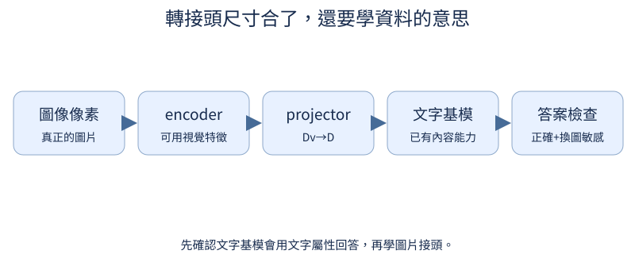

# 第 11 章：對齊、問答與語言能力保留

前置：第10章介面與第7章SFT。能力實驗需先有「文字屬性→正確答案」基模，以及可分類的視覺encoder；用scripts/prepare_data.py和pretrain_encoders.py準備。下面隨機模型只驗證資料／梯度，所有品質留給讀者訓練後量測。

## 11.1 維度相同就能理解圖片嗎？

**先想一想：**換圖片會改回答就代表VLM成功嗎？



隨機projector確實讓圖片改變logits，但改變不一定是正確理解。先用文字屬性測LM是否會答，再檢查圖片換成相同屬性時是否也答對。

**把直覺寫成數學：**敏感度≠正確率；dimensional compatibility≠semantic alignment。

**最小實驗：**以下程式只處理這節的問題。

```python
projector = nn.Linear(4, 8)
a, b = torch.zeros(1, 4), torch.ones(1, 4)
print("隨機projector輸出差", (projector(a) - projector(b)).norm().item())
print("另外必須測：文字屬性基準、圖片答案正確、換圖答案按規則改變")
```

**如何讀結果：**非零隻是接口會傳遞差異。沒有可用LM基礎能力時，projector-only可能無法完成任務。

**只改一件事：**只把projector權重設零，指出敏感度檢查會揭露什麼。

## 11.2 哪些參數正在學習？

**先想一想：**一個參數requires_grad=True但沒進optimizer，會更新嗎？

凍結是requires_grad=False；optimizer只收本階段要更新的參數。列出名單、梯度範數和更新前後差值，避免以為eval等於freeze。

**把直覺寫成數學：**有梯度、被optimizer收錄、真的step，三者都要確認。

**最小實驗：**以下程式只處理這節的問題。

```python
from tiny_perceptron.model import TinyLM, ModelConfig
from tiny_perceptron.multimodal import MultiModalLM

model = MultiModalLM(TinyLM(ModelConfig(width=8)))
model.requires_grad_(False)
model.image_projector.requires_grad_(True)
trainable = [(n, p.numel()) for n, p in model.named_parameters() if p.requires_grad]
optimizer = torch.optim.AdamW([p for p in model.parameters() if p.requires_grad], lr=0.001)
print(trainable, "optimizer參數羣", len(optimizer.param_groups))
```

**如何讀結果：**凍結視覺/語言不阻止梯度穿過它們回到projector，只是不為凍結權重累積grad。

**只改一件事：**只解凍最後一個語言block，再列名單。

## 11.3 只訓練 projector 能學到什麼？

**先想一想：**基模不會「square」的文字任務，projector一定能補救嗎？

先用簡單caption把視覺表示接到已有文字知識上。只更新projector時，編碼器必須能提供相關屬性，LM也必須知道如何用它們回答。

**把直覺寫成數學：**固定encoder/LM，最小化caption的assistant-only CE。

**最小實驗：**以下程式只處理這節的問題。

```python
from tiny_perceptron.model import TinyLM, ModelConfig, masked_loss
from tiny_perceptron.multimodal import MultiModalLM, scene

model = MultiModalLM(TinyLM(ModelConfig(width=8)))
model.requires_grad_(False)
model.image_projector.requires_grad_(True)
ids = torch.tensor([1, 3, 5, 4, 123, 2])
labels = torch.tensor([-100, -100, -100, -100, 123, 2])
result = model(ids, labels, image=scene())
loss = masked_loss(result["logits"], result["labels"])
loss.backward()
print("projector梯度", model.image_projector.weight.grad.norm().item())
```

**如何讀結果：**數字123只是介面對齊例。真實caption實驗先載checkpoint；CLI --task vision --freeze projector。

**只改一件事：**只凍結projector，檢查已經沒有任何可學習參數時應報錯。

## 11.4 圖片描述怎麼擴展成問答？

**先想一想：**同一紅圓圖，問顏色與問形狀答案應一樣嗎？

caption只有一個描述目標；VQA同一圖會根據問題選擇不同屬性。資料中保留同圖多問，測試新組合，確認問題也有作用。

**把直覺寫成數學：**答案=f(image,question)，不是隻依圖片label。

**最小實驗：**以下程式只處理這節的問題。

```python
records = [
    {"image": "red_circle", "question": "color?", "answer": "red"},
    {"image": "red_circle", "question": "shape?", "answer": "circle"},
]
print(records)
assert records[0]["answer"] != records[1]["answer"]
```

**如何讀結果：**這是訓練schema；真實圖在synthetic manifest裏記錄生成seed與屬性，不能只喂問題答案。

**只改一件事：**只替換問題，保持圖片不變。

## 11.5 哪些文字層需要一起調整？

**先想一想：**訓練參數更多就必然更好嗎？

projector-only改動小；部分解凍讓語言模型學新接口；全參自由度高，但成本和遺忘風險也更大。比較需同一資料與預算。

**把直覺寫成數學：**每種策略記錄trainable parameters與optimizer state bytes；並評文字retention。

**最小實驗：**以下程式只處理這節的問題。

```python
from tiny_perceptron.model import TinyLM, ModelConfig
from tiny_perceptron.multimodal import MultiModalLM

model = MultiModalLM(TinyLM(ModelConfig(width=8)))
for mode in ("projector", "partial", "all"):
    model.requires_grad_(mode == "all")
    model.image_projector.requires_grad_(True)
    if mode == "partial":
        model.language.blocks[-1].requires_grad_(True)
    print(mode, sum(p.numel() for p in model.parameters() if p.requires_grad))
```

**如何讀結果：**這裏只有參數成本，品質需要匹配資料、有效token數並實際訓練。

**只改一件事：**只增加語言層數，觀察partial與all成本不同。

## 11.6 對齊和 SFT 能合併嗎？

**先想一想：**兩階段跑兩倍tokens，結果較好就證明順序更好嗎？

兩階段先caption對齊，再問答；直接SFT一次學接口與任務。比較時總預算要包含第一階段，而不是免費送給兩階段。

**把直覺寫成數學：**budget_two_stage=tokens_align+tokens_sft；direct用相同總量或時間。

**最小實驗：**以下程式只處理這節的問題。

```python
budget = 10000
plans = {
    "two_stage": {"alignment_tokens": 4000, "sft_tokens": 6000},
    "direct": {"alignment_tokens": 0, "sft_tokens": 10000},
}
print(plans)
assert all(sum(p.values()) == budget for p in plans.values())
```

**如何讀結果：**這是一張可執行配方的預算表，尚無實測收斂曲線；使用相同基模、seed與task測試。

**只改一件事：**只把對齊比例從40%改爲20%，保持總量。

## 11.7 怎麼維持文字能力？

**先想一想：**圖文loss下降，純文字回答能不測嗎？

新增圖文任務會改變共享語言參數，混入純文字例幫助保留舊技能。資料比例和有效tokens要分項記錄，不能只報混合loss。

**把直覺寫成數學：**評價至少含text任務與vision任務；不把文字能力當成理所當然。

**最小實驗：**以下程式只處理這節的問題。

```python
recipe = {"text_examples": 3, "vision_examples": 1}
metrics = {"before": {"text": None, "vision": None}, "after": {"text": None, "vision": None}}
print(recipe, metrics)
print("讀者用同一文字測試評基模與modal checkpoint，填入真實分數")
```

**如何讀結果：**文字無模態路徑已由10.8檢查；這裏要求訓練後能力retention，兩種驗證不同。

**只改一件事：**只改文字混合比例，不改總有效token預算。

## 11.8 模型有看圖還是猜答案？

**先想一想：**隨機打亂圖片後分數沒下降，可能說明什麼？

先留出屬性組合，再用同一道題替換圖片。正確VLM應依新的圖像線索改變答案；只看問題的模型會在平衡資料上暴露弱點。

**把直覺寫成數學：**同時量原圖accuracy、替圖後按規則變化率、shuffle後accuracy。

**最小實驗：**以下程式只處理這節的問題。

```python
truth = ["circle", "square", "circle", "square"]
text_only = ["circle"] * 4
print("平衡組合上的問題-only基準", sum(a == b for a, b in zip(truth, text_only)) / 4)
print("還需評trained model原圖與替圖，不能只檢查logits不同")
```

**如何讀結果：**0.5是這個明示平衡資料的規則基準，不是實際VLM測量。

**只改一件事：**只把類別分佈改爲90:10，觀察多數猜測的虛高。

## 11.9 縮圖與裁切會丟掉什麼？

**先想一想：**物件在最右邊，中心裁切還能回答它的顏色嗎？


縮圖可能讓小物件消失；中心裁切可能丟邊緣物件。前處理不是中性的I/O，會改變任務是否有足夠資訊。

**把直覺寫成數學：**可見資訊先檢查再訓練；不存在的像素無法由更好的projector還原。

**最小實驗：**以下程式只處理這節的問題。

```python
from tiny_perceptron.multimodal import scene

image = scene("red", "square", offset=7)
crop = image[:, 4:12, 4:12]
print("原圖紅色像素", int((image[0] > 0).sum()), "裁切後", int((crop[0] > 0).sum()))
```

**如何讀結果：**這是生成規則下的圖像資訊檢查；另外保存前處理設置與原圖以便定位錯誤。

**只改一件事：**只移動物件offset，不改模型。

## 11.10 視覺 token 預算怎麼影響能力？

**先想一想：**patch邊長減半，token數是兩倍嗎？

更小patch保留較細粒度的空間資訊，但增加視覺token。序列變長也增加自注意力工作；換patch size會改變encoder權重shape。

**把直覺寫成數學：**N=(H/P)(W/P)；完整attention矩陣元素約(T_text+N)²。

**最小實驗：**以下程式只處理這節的問題。

```python
h = 16
text_tokens = 20
for p in (8, 4, 2):
    n = (h // p) ** 2
    print(p, "視覺tokens", n, "總attention格數", (text_tokens + n) ** 2)
```

**如何讀結果：**換patch size不能直接加載舊patch投影參數；需對應checkpoint重新訓練比較。

**只改一件事：**只把圖像分辨率加倍，保持patch大小。

## 11.11 平均高分掩蓋了哪些弱項？

**先想一想：**常見組90題全對，稀少組10題全錯，總分掩蓋什麼？

平均分會被常見類別主導。按顏色、形狀與稀少組合列正確數/總數，避免把總體高分當成每個子任務都可靠。

**把直覺寫成數學：**micro accuracy按例子加權；macro accuracy按組平均，兩者用途不同。

**最小實驗：**以下程式只處理這節的問題。

```python
groups = {"常見": {"correct": 90, "count": 90}, "稀少": {"correct": 0, "count": 10}}
micro = sum(g["correct"] for g in groups.values()) / sum(g["count"] for g in groups.values())
macro = sum(g["correct"] / g["count"] for g in groups.values()) / len(groups)
print("micro", micro, "macro", macro, groups)
```

**如何讀結果：**數字是明確構造的反例，不是報告trained模型結果。

**只改一件事：**只改變稀少組樣本數，查看macro爲什麼不隨頻率變。

## 11.12 圖片裡的字也能辨識嗎？

**先想一想：**認得一個字體的0，就表示所有手寫0都認識嗎？

先從手工黑白數字字形開始OCR，把像素形狀映射到字符label。手工字形不需要系統字體，方便離線復現。

**把直覺寫成數學：**圖像classification和文字生成可共用同一監督label，但評價方式不同。

**最小實驗：**以下程式只處理這節的問題。

```python
glyphs = {"0": ["111", "101", "101", "101", "111"], "1": ["010", "110", "010", "010", "111"]}
for label, rows in glyphs.items():
    image = torch.tensor([[int(c) for c in row] for row in rows], dtype=torch.float32)
    print(label, image)
print("訓練/測試分別留不同位移與stroke變體")
```

**如何讀結果：**這裏只准備可讀資料；完整OCR生成器與訓練讀法見course/training.md。

**只改一件事：**只把筆畫加粗，保持label不變。

## 11.13 多個字怎麼依序讀出？

**先想一想：**每個字90%正確，5位整串會有90%正確嗎？

多個數字串接後，目標變成有順序的字符序列。每字符準確率和整串準確率要分開；圖像裁切可能直接讓答案缺字。

**把直覺寫成數學：**exact_match要求所有字符一致；CER爲編輯距離/標準答案長度。

**最小實驗：**以下程式只處理這節的問題。

```python
truth = "1010"
predicted = "1000"
char_accuracy = sum(a == b for a, b in zip(truth, predicted)) / len(truth)
print("字符準確率", char_accuracy, "整串正確", truth == predicted)
print("獨立錯誤假設下，5位全對約", 0.9**5)
```

**如何讀結果：**獨立假設只是直覺；真實OCR錯誤可能相關，需直接算完整串。

**只改一件事：**只增加字串長度，記錄整串指標變化。
