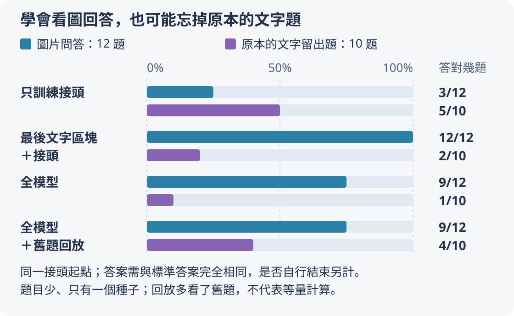
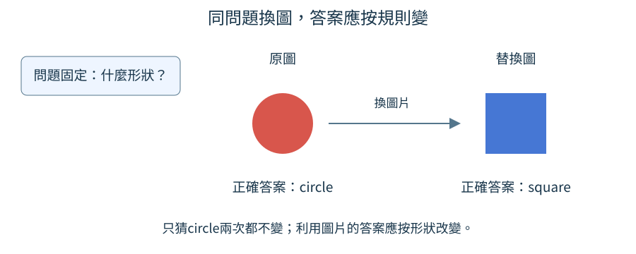
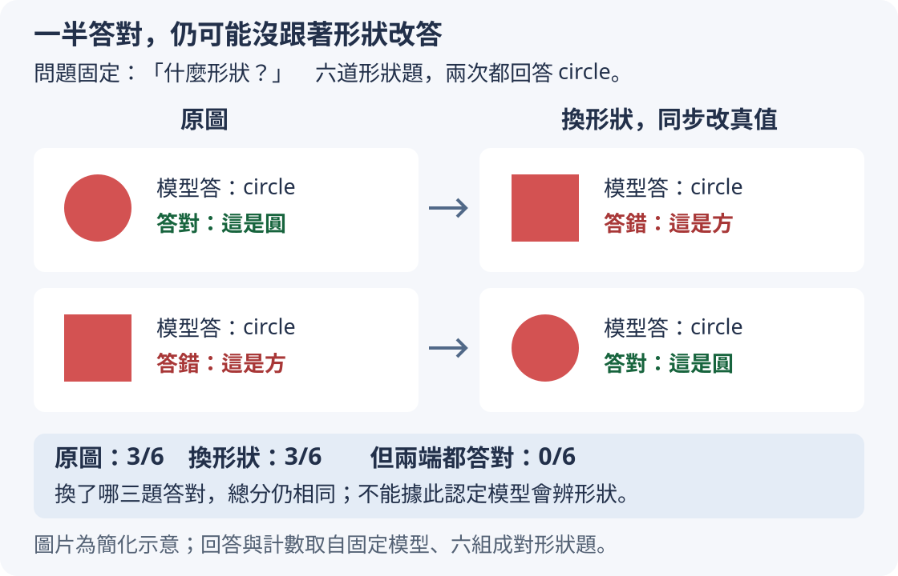
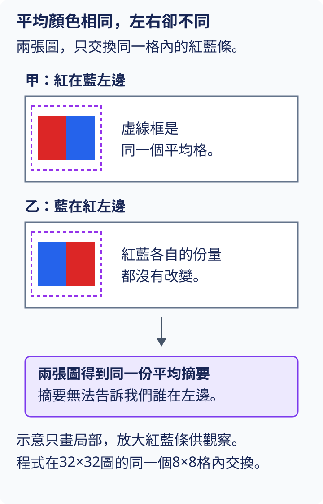
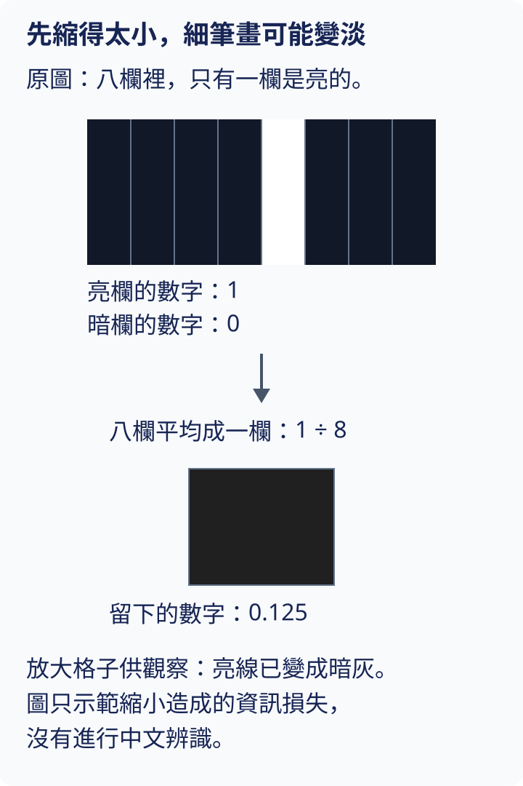

# 第 11 章：對齊、問答與語言能力保留

一條線接通，不等於另一端聽懂了話。[第10章的圖片介面](10.md#10.6)解決了數字形狀與插入位置，本章要檢查圖片內容是否真的影響正確答案。先看哪些參數會更新，再討論描述與問答的訓練安排、文字能力是否受損，以及如何用替圖和分組測試找出假進步。最後以圖片中的數字為例，將辨識一個字擴展成按順序讀完整字串。

## 11.1 維度相同就能理解圖片嗎？

把圖片接到文字模型後，紅圖與藍圖的回答分數不同，這看起來像模型在看圖。但是兩次都答「綠」也可能有不同分數；差異只表示訊號有傳過來，沒有保證內容正確。本節把接頭能傳遞差異與模型理解圖片分開檢查。

前置是[10.6的projector接頭](10.md#10.6)與[10.5的視覺特徵訓練](10.md#10.5)。維度相容指每位置數字數量符合下一層要求；語義對齊則指視覺內容經接頭後，能被語言模型用來作出正確回答。同樣8個數字，並不表示兩個系統對它們有同一種解讀。

```python
import torch
from torch import nn

torch.manual_seed(0)
projector = nn.Linear(4, 8)
a, b = torch.zeros(1, 4), torch.ones(1, 4)
difference = (projector(a) - projector(b)).norm()
print("輸出形狀", tuple(projector(a).shape))
print("對輸入差異敏感", difference.item() > 0)
```

輸入是兩個人工特徵：全0與全1，都寬4。`nn.Linear(4,8)`產生8個輸出，每個輸出都有自己的計算配方：把4個輸入各乘一個權重，再加總，最後加上一個偏置。權重控制各個輸入的份量，偏置是這個輸出固定多加的數。例如某個輸出的權重為[1,2,0,0]、偏置為0.5，全0輸入得到0.5，全1輸入得到3.5；這些數只用來解釋配方，程式的實際權重由亂數初始化。

`norm()`計算兩個輸出差向量的長度：把8個差各自平方、加總，再開平方根。`difference.item()`取出這個只有一格的tensor所保存的普通Python數字，`>0`檢查差長度是否大於0。輸出形狀`(1,8)`，第二行True。這個結果沒有標準答案，也沒有語言模型，所以只能說隨機變換通常會對輸入有反應。它甚至還不知道a代表紅還是方塊。

實際對齊至少需要三種對照。先用文字告訴語言模型「這是紅色圓形」，問顏色，確認它原本會答紅；再送相同屬性的圖，問同一問題，確認能答紅；最後換藍色同形狀圖，確認答案按規則改為藍。第一個檢查語言基礎，第二個檢查跨介面使用，第三個檢查圖片因果作用。只看兩組logits不同，會漏掉是否答對。

若編碼器本來無法區分紅藍，接頭沒有足夠資訊；若語言模型連文字描述都不會用，單獨訓練接頭也未必夠。對齊要把已有相關能力接起來，不能預設一個小接頭必定補齊兩端所有知識。後面會分別列出可訓練範圍與訓練目標。

實際對齊時，要分開保存兩端的基礎成績，再核對接起來的回答；[11.3](11.md#11.3)會用一份完整實驗說明如何區分這些證據。

可以把三種對照都問同一句「什麼顏色」：文字紅圓→紅，紅圓圖→紅，藍圓圖→藍。第一步若失敗，圖片接頭無法獨自證明後續錯誤來自哪裡；第二步失敗而第一步成功，就更值得查視覺特徵與接頭；第三步才檢查它沒有對每張圖都回紅。這是一個逐段定位方法，不是在測試前假設各組件都有效。隨機接頭對0與1的輸出差通常非零，就像插座有電卻不表示收音機調到正確頻道，必須再核對收到的內容。

練習在`difference = ...`那一行之前加入下面兩行，保持偏置不變，然後從頭重跑。`projector.weight`是接頭那份權重；`zero_()`把裡面所有數字原地改成0，尾端的底線提醒我們它會修改原物件。`torch.no_grad()`讓縮排內這次手動改值不被記入求導關係；這裡只是安排對照用的權重，不是在做訓練更新。

```python
with torch.no_grad():
    projector.weight.zero_()
```

所有輸入都先乘0，所以每個輸出只剩自己的偏置；a與b會得到同一排8個偏置值。先預測重新計算的差長度為0、第二行False，再執行核對。不能等差值已算好才清零權重，因為既有的`difference`不會自動重算。這個失敗能找出接頭沒有傳差異，卻仍不能獨立診斷語言理解是否正確；不同檢查負責不同問題。

## 11.2 哪些參數正在學習？

你打算只訓練圖片接頭，卻發現整個語言模型也在改變；或者參數有梯度，數值卻一直不動。訓練的範圍不能靠一句「已經凍結」確認：先決定哪些參數要接收新的梯度，再核對優化器收了哪些參數，最後檢查實際更新。本節先把訓練名單印出來，避免在錯誤範圍上花時間。

前置是[W.6梯度與更新](../first-steps.md#W.6)及[10.6接頭](10.md#10.6)。`requires_grad=False`表示不為該參數累積新的梯度，稱為凍結；optimizer是執行參數更新的優化器，只能更新交給它的參數。改這個開關不會清掉已經存在的`.grad`；若參數仍在優化器裡，AdamW仍可能使用留下的梯度更新它。`eval()`調整模型中的訓練行為，不等於凍結，詳見[5.17](05.md#5.17)。

```python
import torch
from tiny_perceptron.model import TinyLM, ModelConfig
from tiny_perceptron.multimodal import MultiModalLM

model = MultiModalLM(TinyLM(ModelConfig(width=8)))
model.requires_grad_(False)
model.image_projector.requires_grad_(True)
trainable = []
parameters_to_update = []
for name, p in model.named_parameters():
    if p.requires_grad:
        trainable.append((name, p.numel()))
        parameters_to_update.append(p)
optimizer = torch.optim.AdamW(parameters_to_update, lr=0.001)
print("可訓練", trainable)
print("更新參數總數", sum(p.numel() for group in optimizer.param_groups for p in group["params"]))
```

輸入是文字寬度8的多模態模型，視覺寬度預設16。先凍結整個模型，再只開放`image_projector`。`named_parameters()`逐項提供一對內容：參數名稱與那份參數本身。`for name, p`把這一對分別收進`name`與`p`；名稱是字串，p是裝著可調數字的tensor。`if p.requires_grad`只讓開關為True的項目進入縮排內的兩行。`append`在清單尾端增加一筆：`trainable`保存名稱和數量，供我們閱讀；`parameters_to_update`保存p本身，交給優化器更新。`numel()`數出p裡有幾個數字。

因此輸出名單為`image_projector.weight`有128個數、`image_projector.bias`有8個數，總計136。權重128來自8×16，偏置是每個輸出多加一個數。兩份清單收的是同一批參數，沒有因為印出名稱就另造一份待更新權重；它們分別負責讓人核對與讓優化器實際取用。

創建AdamW時，清單再次只收`requires_grad`為True的參數；學習率0.001是本例設置的更新步長。`optimizer.param_groups`是優化器保存的分組清單，每組是一個字典，`group["params"]`取出該組的參數清單。最後的兩個`for`先走訪各組，再走訪組內每個參數p；`p.numel()`數出它有幾個數字，`sum`把這些數量加總成136，驗證聲明與真正收錄的參數相符。清單、字典和迴圈的寫法可回看[W.2](../first-steps.md#W.2)。程式還沒有計算答案代價或執行`step()`，所以不能說136個數字已經改變。

凍結編碼器或語言權重，也不一定切斷對接頭的訓練信號。只要計算仍被記錄，代價的梯度可以穿過固定運算回到接頭，類似固定齒輪仍能傳遞動作；凍結的是齒輪尺寸的調整。若對整段語言計算使用`no_grad()`，則可能截斷這條路徑，下一節會檢查接頭是否收到梯度。

正式模型也要核對可訓練名單、收到的梯度與更新前後差值；[11.3](11.md#11.3)把這些執行證據和描述結果放在一起，避免把「真的更新」等同於「已學會」。

還有一個容易漏掉的順序：先決定凍結範圍，再建立優化器。如果在訓練途中改成凍結，還要把該參數的舊梯度設成`None`，並將它排除在這一階段的優化器名單之外；只改開關，原清單與舊梯度都可能留下。如果建立時只收接頭，後來解凍語言層，清單又不會自動補上。最好在每一階段開始印出兩份名單並核對，參數有梯度後再看一次更新前後差值。梯度為0與未收到梯度也不同：前者可以是當前資料剛好不敏感，後者None可能表示它根本沒參與鏈路。對AdamW來說，0也不等於跳過更新，因為過去的更新紀錄與權重衰減仍可能使數值改變。這些資訊比單看「訓練中」的字樣具體。

練習在列名單前增加`model.language.blocks[-1].requires_grad_(True)`，只開放最後一個語言區塊。`model.language`是包裝內的文字模型，`blocks`保存它的一組組可調層，每組稱為區塊；索引`[-1]`取最後一組。本例預設只有一個區塊，編號為0，所以新增名稱以`language.blocks.0`開頭。先預測名單會新增這組參數，優化器總數大於136，再重跑核對本例總數976。不要僅在創建優化器之後解凍：那會讓新參數能算梯度，但原優化器尚未收錄它們。

## 11.3 只訓練 projector 能學到什麼？

假如視覺編碼器能區分紅與藍，文字模型也能從「red square」回答屬性，我們希望只調接頭把兩端聯繫起來。最簡單的任務是給紅方塊圖，目標描述寫red square。接頭因描述預測錯誤收到梯度，就有機會學哪些視覺數字應轉成文字模型可用的線索。這是對兩端能力的條件，實際小底座只部分具備，不能先當成已通過的前提。

前置是[11.1尺寸與理解的區別](11.md#11.1)、[11.2凍結名單](11.md#11.2)、[10.7展開後才錯位](10.md#10.7)與[W.6梯度與更新](../first-steps.md#W.6)。梯度描述參數小幅改動時，代價會往哪個方向、改變多少；本例先驗證這種影響能沿計算路線回到接頭，仍用隨機模型，不能把一次反向計算叫成學會描述。真正能力訓練需先準備兩端已有的相關知識，否則接頭可能面對無法區分屬性的特徵或不懂目標的語言模型。

```python
import torch
from tiny_perceptron.data import ByteTokenizer
from tiny_perceptron.model import TinyLM, ModelConfig, masked_loss
from tiny_perceptron.multimodal import MultiModalLM, scene

torch.manual_seed(0)
tok = ByteTokenizer()
model = MultiModalLM(TinyLM(ModelConfig(width=8)))
model.requires_grad_(False)
model.image_projector.requires_grad_(True)
answer = tok.encode("red square") + [tok.eos_id]
prefix = [tok.bos_id, tok.user_id, tok.image_id, tok.eos_id, tok.assistant_id]
ids = torch.tensor(prefix + answer)
labels = torch.tensor([-100] * len(prefix) + answer)
out = model(ids, labels, image=scene())
loss = masked_loss(out["logits"], out["labels"])
loss.backward()
print("接頭收到梯度", model.image_projector.weight.grad.norm().item() > 0)
print("語言權重未累積梯度", model.language.embedding.weight.grad is None)
```

`torch.manual_seed(0)`固定這裡PyTorch亂數的起點，方便在同一環境重跑這段小例子核對；0只是本例選用的種子，正式實驗另用42，兩者不需要相同。輸入包含紅方塊圖和完整未錯位序列。`ByteTokenizer`將英文字串逐位元組轉成編號，答案還加結束標記；prefix放開頭、用戶角色、圖片、用戶結束、助手角色。labels將前綴全部設忽略，只有回答與結束參與代價。模型內部把圖片標記展開16個位置，再執行下一位置對齊，`masked_loss`只在有效目標上算交叉熵。

`out["logits"]`是每個輸入位置對全部詞表候選的原始分數，稱為[logits](04.md#4.6)。[交叉熵](01.md#1.8)先把這組分數轉成候選機率，再用正確目標編號衡量猜錯代價；正確候選機率越低，代價越高。`masked_loss`依`out["labels"]`排除-100位置，將其餘位置的代價平均，得到單個數字`loss`，再由它求出梯度。

`loss.backward()`從這個代價反向計算，將可訓練參數的梯度累加到其`grad`欄位；本例剛建立模型，還沒有先前累積的梯度。接頭的`weight.grad.norm()`把所有梯度格的平方加總再開平方根，大於0表示至少有一格非零。文字embedding的`grad is None`表示沒有為這份凍結參數保存梯度，與保存了一排0不同。

兩行正常均為True：接頭收到非零梯度，凍結的文字embedding沒有自己的梯度。計算信號能夠穿過固定文字模型回到接頭，正是只訓接頭所需的路徑。程式沒有優化器更新，也沒有新圖測試，因此尚未得到描述成功率。

只訓接頭常用於先對齊描述；之後遇到問答可能需要進一步調整語言層。

[正式接頭實驗](https://github.com/birdhackor/tiny-perceptron-vlm/blob/main/docs/course-experiments/results/projector.json)先固定兩端，再只教接頭生成完整描述。SFT是監督式微調（Supervised Fine-Tuning），用問題和標準回答教模型預測回答；這裡採用的直接SFT底座先學小世界的屬性問答，沒有先做一般文字續寫預訓練。整份設定如下：

| 要固定的項目 | 本實驗的設定 |
| --- | --- |
| 視覺起點 | [10.5](10.md#10.5)的已訓練編碼器，六類新位置測試6/6；每個位置輸出16維。 |
| 文字起點 | [7.12](07.md#7.12)直接SFT分支的`model.pt`，寬64、兩層，十道屬性留出題答對5/10。 |
| 開放範圍 | 只開圖片接頭：64×16個權重加64個偏置，共1,088個；包裝模型總參數145,664個。 |
| 資料切分 | 位移−2、−1、0的18張合成圖訓練；位移1的六張驗證；位移2的六張最後測試。 |
| 更新配方 | AdamW、300次更新、每次四張圖、學習率0.003、種子42。 |
| 生成與判分 | 最多16個新ID；生成顏色、空白與形狀，原始byte逐項相同才算完整描述；EOS另計。 |

接頭確實收到非零梯度，更新後權重也改變；語言模型全部權重逐項核對保持相同。固定訓練小批代價從4.1480降到1.2093，測試的平均回答目標代價從4.0965降到1.3195，但驗證與測試的完整描述仍都是0/6。這些數字各回答不同問題：前兩項是在標準答案上下文裡算預測代價，最後一項才要求模型自己完成整句。

兩張紅圖更新後都只答`red`，不是應有的`red circle`與`red square`；綠圓目標`green circle`，卻生成`reeeeeeeeen`。六張測試中五張產生EOS，另有一張到16個新編號上限仍沒結束。代價計算時依序提供標準答案前面的字，稱為teacher forcing；真正生成則把自己上一個輸出當下一步上下文。即使標準前綴上的預測更接近，自己漏掉空白或重複e之後，後續也可能走偏。因此代價下降、結束比例與整串成功率都要保留，不能只挑其中最好的一項。

這次可以說「接頭有學習信號、確實改變、目標代價降低」，還不能說「完整描述已對齊」。它只是一種弱底座、這份資料與這個預算的結果，不能推出任何接頭都無法學好。下一階段保留這份已更新接頭，再比較開放不同語言層做問答，讓後續實驗檢查增加自由度是否有幫助。

red square共有10個英文字母與空白，都屬於ASCII這個單位元組字元集合，所以這個位元組切詞也有10個正文編號，加結束一共11個有效目標。使用者和圖片位置沒有被當作要生成的文字；它們仍影響這11次預測。若標籤把圖片位置也設成普通文字答案，就等於要求模型在沒有相應文字真值的格子猜字，改變了原任務。只訓接頭可以重新組合固定特徵，卻不能把編碼器本來丟掉的資訊找回來；因此「基模會用相關文字線索」與「編碼器能分相關屬性」是能力實驗的前提，不是可省略的背景。

練習把`image_projector.requires_grad_(True)`改False，並在`loss.backward()`前加上`print(sum(p.numel() for p in model.parameters() if p.requires_grad))`，沿用[11.2](11.md#11.2)的方法數出可訓練參數總數。先預測它印0，接著`backward()`會報錯，因為代價已沒有連到任何需計算梯度的參數，再執行核對。這是故意關閉所有學習路徑的反例；合理做法是在啟動訓練前拒絕這個配置，不是讓它空跑許多步後期待進步。

## 11.4 圖片描述怎麼擴展成問答？

同一張紅圓形圖片，問「什麼顏色」應答紅，問「什麼形狀」應答圓。只訓練「紅色圓形」描述，目標每次固定，無法直接告訴我們模型是否會讀問題挑選屬性。本節先用同圖多問，示範目標如何隨問題改變，再用同問題配不同圖的對照檢查圖片的作用。

前置是[11.3圖片描述目標](11.md#11.3)與[7.1對話資料](07.md#7.1)。圖片問答英文叫Visual Question Answering，縮寫VQA。它不是只給圖片一個類別，而是回答該問題所要求的內容。資料必須保留實際圖片或可恢復圖片的生成條件，不能只喂問題與答案後聲稱模型用圖。

```python
records = [
    {"image": "red_circle", "question": "什麼顏色？", "answer": "紅"},
    {"image": "red_circle", "question": "什麼形狀？", "answer": "圓形"},
]
for row in records:
    print(row["image"], row["question"], "→", row["answer"])
print("同圖", records[0]["image"] == records[1]["image"])
print("答案不同", records[0]["answer"] != records[1]["answer"])
```

輸入兩筆字典，`image`這裡只是可讀的圖片身份名稱，不是像素。前三個字段分別記錄圖、題目、目標回答。輸出第一行紅圓圖顏色→紅，第二行同圖形狀→圓形，後面兩個比較均True。它讓作者看見「保持圖不變，只換問題」確實對應不同目標。

真正資料可以用[10.1的scene工具](10.md#10.1)按red、circle生成該圖，並記錄大小與位移；這個工具按指定條件直接畫圖，沒有隨機選擇。更複雜的產圖工具若會隨機挑位置或背景，還要記seed（種子）：它是一個指定亂數選擇起點的整數，像抽籤機的起始號碼。例如產圖前設定42，就保存42；重建時用相同生成程式、參數與呼叫順序，從42開始重播這批選擇。生成配方與軟體版本也應一起保存，方便重建相同圖。將圖片標記與像素一起送入模型後，答案位置計算代價的方式仍如上一節，不需要為每種問句另造一個全新輸出系統。

[正式問答實驗](https://github.com/birdhackor/tiny-perceptron-vlm/blob/main/docs/course-experiments/results/vqa.json)每張合成圖各問`shape?`與`color?`，要求只答`circle`、`square`或顏色名稱。六種顏色形狀各有三個訓練位置，共18張圖、36道問答；位移1的六張圖形成12道驗證題，位移2的六張圖形成12道最後測試題。同圖的兩問放在同一側，沒有拿訓練過的圖換問法當作新圖。這次留的是新位置，六種屬性組合仍已見過，不是未見組合的測試。

還要有同問題不同圖片。例如兩張都問顏色，一張紅圓一張藍圓，應回答紅與藍。只保留紅圓多問，模型可能不看圖片而記住「顏色題答紅、形狀題答圓」。同圖換問題、同問題換圖片，分別提供檢查問題選擇與圖片影響的對照；[11.8](11.md#11.8)會具體討論替圖驗證。若再把未拿來訓練的屬性組合留作測試，則可額外檢查模型能否把已學的顏色與形狀用在新搭配。

例如若模型對同圖兩問都回「紅色圓形」，描述內容沒錯，卻未必遵循只要顏色或形狀的任務。評估應按問題要求判斷，不能因為答案含正確詞就全部算對。可以先用短而明確的目標紅、圓形，再用另一個同時詢問兩項的題允許完整描述。這樣資料和檢查都告訴模型「問題會改變要輸出的範圍」。同圖身份也讓作者追查是否錯誤配了另一張圖；保持記錄中的圖、問題與目標一並移動，別分別打亂三個清單。

練習增加第三筆：圖保持red_circle，問題改為「請同時給顏色與形狀」，目標寫「紅色圓形」。先預測哪些字段相同、哪些改變，再打印核對。若只換問題不換答案，你是在提供矛盾訓練；問題的要求應在目標內容裡留下可觀察的變化。

## 11.5 哪些文字層需要一起調整？

只訓練接頭改動小，但有時語言模型還需要適應新的視覺上下文。我們可以開放最後一層，也可以開放所有參數。選擇範圍像修一間房子：只改門把、改一面牆、全部翻修，成本和影響不同。本節先算各方案會動多少數字，不用成本數值替代效果比較。

前置是[11.2參數凍結與優化器](11.md#11.2)及[4.5一個模型區塊](04.md#4.5)。區塊block是一次注意力與特徵處理等運算組成的層；最後一個block最靠近輸出。partial指本例只開放它和圖片接頭，all則開放整個包裝模型，包括語言、視覺與聲音部分。

```python
from tiny_perceptron.model import TinyLM, ModelConfig
from tiny_perceptron.multimodal import MultiModalLM

model = MultiModalLM(TinyLM(ModelConfig(width=8)))
for mode in ["projector", "partial", "all"]:
    model.requires_grad_(mode == "all")
    model.image_projector.requires_grad_(True)
    if mode == "partial":
        model.language.blocks[-1].requires_grad_(True)
    count = sum(p.numel() for p in model.parameters() if p.requires_grad)
    print(mode, count)
```

輸入同一個寬度8模型，每輪先重設全部開關，再開放該方案需要的部分，避免上輪的狀態殘留。`[-1]`選最後一個block，`numel`數所有允許梯度的數字。當前預設配置輸出projector 136、partial 976、all 8296。最後一個數量包括未在圖片任務中使用的聲音參數；允許梯度不等於每筆都會收到梯度，這點仍需按[11.2](11.md#11.2)檢查實際路徑。

這些數量說明訓練成本起點。以32位元浮點數保存，每個參數本身約4位元組；還要加梯度與優化器狀態，AdamW通常另外保存兩組歷史數字，因此訓練記憶體不只參數本身。各參數組是否真的分配狀態取決於有沒有收到梯度，不能機械用一個倍數報告所有實際用量。

更多自由度可能幫助新接口，也可能把原來的文字能力改變。公平比較需同樣訓練資料、總有效回答位置或時間預算，並另測純文字任務。[有效回答位置](07.md#7.5)指目標標籤未被忽略、實際計入猜錯代價的位置，問句與補齊位置通常不計入。例如一份例子有3個計入代價的回答位置，用它訓練10次就提供30個位置；控制這個總數，有助於比較方案是否接受相近的學習量。只看到all參數多，不足以斷言它最好；只看到projector便宜，也不代表它一定夠用。

正式實驗從[11.3已更新的接頭](11.md#11.3)複製相同起點，分別再更新160次，每次抽四題，學習率0.003、種子42。只訓接頭、接頭加最後文字區塊、全部開放三種版本，抽同樣圖文題，都是3,830個有效回答目標；結果如下。全部開放的參數數量仍包括這個圖片任務沒有輸入的聲音零件，不表示那些零件也都更新了。

| 開放範圍 | 可訓練參數 | 驗證答對／12 | 最後測試答對／12 |
| --- | ---: | ---: | ---: |
| 圖片接頭 | 1,088 | 3 | 3 |
| 接頭＋最後文字區塊 | 50,816 | 10 | 12 |
| 全部 | 145,664 | 12 | 9 |

只訓接頭的六道顏色題全錯，形狀題3/6；全部開放則顏色6/6、形狀3/6，三個方形都答成circle。最後文字區塊版本這批12題全對，但它的驗證還有兩道錯題，樣本也很少，不能據此定出所有模型的最佳凍結範圍。參數最多的版本沒有最高測試分，正是要看新題、不能只看訓練代價的原因。

本表的中間方案一律稱「接頭＋最後文字區塊」。固定實驗工具把它記為`partial`，但一般`train.py --freeze partial`開的是首末文字區塊：兩層模型會開兩個區塊，仍不等於開放所有參數。要重跑本表，使用[T.6的固定實驗入口](../training.md#T.6)；該節也列出一般CLI的範圍，讓名稱相同的兩份配方各自有清楚用途。

partial在這個預設模型裡只開放一個語言block，所以976減136=840，是新增語言區塊的數字數，不是新增訓練樣本數。若語言模型有四層，最後一層仍只有一層參數；all則開放更多層。訓練開始前還要用實際輸入檢查梯度：all名義開放聲音編碼器，純圖片批次沒有波形，它不一定收到訓練信號。參數統計提供配置成本，實際更新記錄提供發生事實，兩者並排才不會把沒有用到的模塊說成也學了新任務。

練習把ModelConfig加`layers=2`，先預測projector仍136，因為寬度沒變；partial仍只開最後一層，all則多一個語言block。重跑核對，再說出為什麼層數增加沒有自動讓接頭矩陣變大。這個對照把寬度、深度與可訓練範圍三個不同選擇分開了。

## 11.6 對齊和 SFT 能合併嗎？

一種訓練方案先用圖片描述連接視覺與語言，再用問答教任務；另一種直接用問答，同時學習接頭與應答。前者像先學字詞再讀問句，後者像在完整對話中一起學。哪種更好要看基礎能力與資料，不能讓前者多花一倍訓練量後只說順序比較優越。

前置是[11.3描述對齊](11.md#11.3)、[11.4圖片問答](11.md#11.4)與[7.3有效學習位置](07.md#7.3)。SFT是使用人工目標回答的有監督微調；描述對齊也可使用相同文字預測代價，只是任務目標與可訓練範圍不同。總預算要把兩階段都加進去，不能把第一階段當免費準備。

```python
budget = 10000
plans = {
    "兩階段": {"描述對齊": 4000, "問答微調": 6000},
    "直接問答": {"描述對齊": 0, "問答微調": 10000},
}
for name, plan in plans.items():
    total = sum(plan.values())
    print(name, plan, "總有效位置", total, "符合預算", total == budget)
```

輸入是一張計劃表，數字表示參與目標代價的回答位置數量，不是樣本筆數。`plans`是字典：冒號左邊是方案名稱，右邊是這個方案的階段表；階段表也是字典，用階段名稱對應數量。`plans.items()`逐次提供一對「方案名稱、階段表」，`for name, plan`分別用name與plan接收這一對。第一輪name是`"兩階段"`，plan是`{"描述對齊": 4000, "問答微調": 6000}`；第二輪才換成直接問答的表。

`plan.values()`只取當前表的兩個數量，`sum()`把它們合計。輸出兩方案總數都是10000、符合預算True。兩階段分4000與6000，直接方案全給問答。這個程式沒有模型，沒有收斂曲線，完成的是實驗前的公平預算核對。

若描述平均短、問答平均長，相同步數不一定有相同位置數量；應由實際標籤中非-100的數量計費，如[8.3](08.md#8.3)的例子。也可以固定總執行時間比較，但要報告每方案實際用了多少有效位置與哪些參數，因為不同方案計算成本可能不同。

兩方案還要從同一份初始模型出發，結束後回答同一批未參與訓練的圖片題，例如給一張保留的方塊圖，問「方塊是什麼顏色？」，用該圖的正確顏色核對。這批題目檢查新學的圖片問答能力。

另外共用一批純文字題，例如「只回答yes」，目標答案是`yes`，不提供圖片。先用訓練前模型回答這批題並記錄正確率，再對照兩方案微調後的正確率，觀察原有的純文字回答能力是否退步；這就是本節的「文字保留」。保留檢查要包含基礎模型原本能答對的題目，才看得出學新能力後是否仍會做。兩類評估題都留在訓練之外，兩方案使用相同題目與判分規則。

兩階段通常把第一階段接頭權重帶進第二階段；直接方案沒有這一步，但其全部10000位置都在問答學習。它們比較的是預算分配與訓練路徑，不只是把同一批資料文件換個名字。上面的預算表沒有執行這些評估，能力變化仍須在實際訓練後測量。

兩階段還涉及交接內容。第一階段產生更新後的接頭，第二階段應從這份狀態繼續，而不是誤從隨機接頭重新開始；否則你花了4000位置卻沒有把學到的東西帶過去。另一方面，第二階段若開放語言層，需在記錄中注明與第一階段不同的範圍。比較時保存每階段起點、終點和有效位置計數，就能重現所謂先對齊再問答的含義。直接問答方案則只有一個起點與一個階段，它可能也通過問答學會對齊，但要由答案測試證明。

正式結果把「接頭描述300步＋全部開放問答160步」當兩階段：前段14,408個、後段3,830個有效回答目標，共18,238個。直接問答從相同直接SFT底座、相同已訓練編碼器與未對齊接頭出發，全部開放，只用問答更新；累計到18,256個目標時停止，共762步，最後一批比預算多18個。這是按有效目標匹配到最後一批的比較，不是按步數或秒數完全相同。

最後12道新位置題，兩階段9/12，直接問答10/12；兩者驗證都是12/12。這次先對齊沒有觀察到優勢，直接版本也仍把兩道方形答成circle。一題差距不能推出直接路線普遍較好，也不能把前段描述0/6當成那14,408個目標完全沒有影響。此次直接版本沒有另列純文字留出成績，所以這個比較只支持圖片問答結論；不能從10/12推論它更會保住舊文字功能。後面的文字保留對照使用另四個確實量過的版本。

練習把對齊預算4000改2000，先預測問答需從6000改8000才能維持10000，再修改核對True。若只改第一項就輸出總數8000、False，計劃已不再匹配。提出「對齊佔20%可能夠嗎」是可測試假設，不能從這張預算表直接讀出答案。

## 11.7 怎麼維持文字能力？

假如圖文訓練後模型更會認顏色，卻開始把原本會答的純文字屬性題答錯，這就不是圖片入口的形狀問題，而是新任務改變了共享語言參數，使舊技能退步。本節把舊文字例混進訓練，同時把兩類成績並排看，避免只看圖文代價下降。

前置是[7.15舊技能遺忘](07.md#7.15)、[7.16舊資料回放](07.md#7.16)與[10.8純文字入口一致性](10.md#10.8)。10.8確認訓練前包裝沒有改變計算；這裡稱為retention的能力保留，檢查訓練後的行為是否仍會做原任務。兩件事發生在不同階段，不能用前者通過代替後者。

```python
recipe = {"文字有效位置": 750, "圖文有效位置": 250}
recorded = {
    "訓練前": {"文字答對": 8, "圖文答對": 2},
    "訓練後": {"文字答對": 6, "圖文答對": 7},
}
total_positions = sum(recipe.values())
ratios = {}
for category, positions in recipe.items():
    ratios[category] = positions / total_positions
print("示例訓練比例", ratios)
for phase, scores in recorded.items():
    print(phase, "文字", scores["文字答對"] / 10, "圖文", scores["圖文答對"] / 10)
```

recipe是用名稱查數字的字典，冒號左邊是名稱、右邊是數量，例如`recipe["文字有效位置"]`取出750。這張表分配計劃中1000個有效回答位置，不是同樣數量的完整對話。`recipe.values()`取出750與250，`sum()`相加為1000；`recipe.items()`則逐次提供「名稱、數量」一對，分別交給category與positions。`ratios = {}`先建立空字典，再把每項數量除以總數、按原名稱填回去，得到文字0.75、圖文0.25。

recorded是人工構造的成績示例，每個階段名稱又對應一張成績字典。`for phase, scores in recorded.items()`第一輪把`"訓練前"`交給phase，把`{"文字答對": 8, "圖文答對": 2}`交給scores；`scores["文字答對"]`就取出8。兩類各有10道固定測試題，所以再除10得到答對率。輸出前後文字0.8到0.6，圖文0.2到0.7。這樣並排就看見新任務進步與舊任務退步同時存在。

這不是宣稱75%文字回放仍必定遺忘：程式沒有訓練，數字用來演示報告方法。實際要建立不進入訓練的文字測試，固定題目與評分規則，在基模和多模態權重上各跑一遍。還可以按算術、格式、一般文字等子任務拆開，看退步集中在哪裡。訓練時用目標答案衡量預測的猜錯代價，稱為loss；通常越低表示對訓練目標的預測越吻合，具體計算可看[1.8](01.md#1.8)。固定測試的答對率則是答對題數除以總題數，例如8/10。本段程式只整理人工成績，沒有計算loss。混合後的總loss較低，也可能只是較容易的那組佔比增加，並不保證所有技能都改善。

正式問答實驗另外固定[7.12的十道SFT留出題](07.md#7.12)，各版本開始前都答對5/10。只訓圖片接頭後仍5/10，開最後文字區塊後2/10，全部開放後1/10，全部開放加文字回放後4/10。回放只從原SFT訓練45題抽，不把這十道測試題或五道驗證題送進去。回放版本每次抽樣有0.5機率選文字，仍更新160次；其最後圖片問答9/12，與無回放全部版本同分，但文字少掉的能力較少，仍沒有完全回到5/10。

下圖每個方案有兩條：藍色是十二道新圖片問答，紫色是十道原文字留出題；條長用共同的0到100%尺度，右邊仍保存不同分母的答對數。第二組藍條最長、紫條卻很短，表示最後文字區塊版本這批新題全對，原文字題只剩2/10。像練好新曲子時忘掉舊曲的幾段，不能只看新曲成績就說整個曲庫都進步。這裡的舊題只是固定屬性問答，也不是所有文字能力的總分。



這個比較沒有固定總有效回答目標：回放版累計4,214個，其他三版各3,830個，而且4,214中含文字與圖文，不是全給圖片。0.5是選完整題目的機率，不是兩類目標數量或時間各佔一半；答案長短不同就會改變比例。因此可以報告「此配方下文字從1/10改善到4/10」，不能把改善全部歸因於一個已嚴格控制的回放比例。原底座也只會部分屬性題，這次沒有測算術或開放對話，更不能把文字保留欄讀成所有語言能力。

選擇回放比例時，要保持總有效位置預算不變，否則加文字同時延長訓練，會把比例與總資源混在一起。[接頭（projector）](10.md#10.6)是圖片與文字模型之間的轉換層，把圖片特徵轉成文字模型要求的特徵個數。[語言權重凍結](11.md#11.2)指訓練時固定這些參數的數值、不更新它們，仍讓它們照常參與計算。若只有圖片接頭更新，純文字輸入使用的語言參數維持原值，文字路徑按理應更容易保持；仍需核對完整應用的提示或前處理是否也維持一致。開放更多語言層更新則提供更多調整空間，也增加檢查舊能力的必要。

示例中的文字下降是8/10到6/10，不一定有足夠樣本判斷每次訓練都真的退步。recorded只保存答對總數，沒有逐題回答；淨少答對兩題，可能同時有些題改對、更多題改錯，不能推出恰好新增兩道錯題。實測時把前後逐題回答並排，找出原先答對、後來答錯的題目，再確認失誤類型。若兩份模型生成有隨機性，應固定選擇方式或重複測量，避免把一次抽樣差異當遺忘。圖文7/10也有三道失敗，仍需查圖像前處理與題目類別。並排表的價值是讓這些問題有入口，而不是用一個較漂亮的新任務平均分結束討論。

練習只把recipe改成文字500、圖文500，先預測比例各0.5而總數仍1000，再執行核對。不要改recorded成績：比例計劃改變不能憑空產生測量結果。要知道新比例是否改善保留，必須訓練後重新填入真實測試成績，未量測的格子應標為未知。

## 11.8 模型有看圖還是猜答案？

如果訓練資料十張圖有九張圓，模型不看圖、一律回答圓，就有90%正確率。這個高分對「它會看圖」的證據很弱。本節先用類別平衡的資料計算這種猜測基準，再說明如何換圖檢驗答案是否跟視覺線索變化。

前置是[11.4答案依圖與問題](11.md#11.4)與[11.1敏感不等於正確](11.md#11.1)。問題都固定為「什麼形狀」，真值由圖片生成條件給定。問題-only基準指只利用文字問題、不讀取圖的預測方法；它能揭露資料分布本來就允許猜多高。

```python
truth = ["circle", "square", "circle", "square"]
text_only = ["circle"] * len(truth)
accuracy = sum(a == b for a, b in zip(truth, text_only)) / len(truth)
print("平衡資料的固定猜測", accuracy)
imbalanced = ["circle"] * 9 + ["square"]
print("九比一資料的固定猜測", imbalanced.count("circle") / len(imbalanced))
```

輸入第一組兩圓兩方，`text_only`產生四個圓預測。`zip`將真值與預測逐項配對，比較True計1、False計0，除4得到0.5。第二組九圓一方，`count`數圓，除10得到0.9。輸出變化來自類別比例，模型規則完全沒變；所以資料不平衡會讓固定猜測顯得很厲害。

實際視覺模型先用原圖評正確率，再將同問題配不同圖：圓換方時，正確答案必須從圓變方。應按新圖真值重新評分，不是只看文字變了。如果新回答從圓變「紅」，雖然有變化，仍沒有完成形狀問題。會看圖的模型在換圖後仍可能全部答對，因為我們也按新圖改了正確答案；這正是期待的結果。

另做一個遮蔽檢查：把原圖的視覺內容遮住，問題與參考答案仍保留原題的版本。例如原題答案是circle，遮蔽後仍以circle作參考。這次刻意移除作答所需的視覺線索，觀察原題成績是否下降，叫消融（ablation）。換圖並重標答案是在檢查「是否答對新圖」；遮蔽但保留原答案是在檢查「原題的表現是否依賴視覺線索」。兩種檢查的評分規則要分開記錄。

下圖把問題固定在「什麼形狀」，左邊紅圓換成右邊藍方，箭頭表示只替換圖片資料。正確答案要從circle變square；即使顏色也變了，題目仍只問形狀，不能拿「藍」當成功回答。



若遮蔽圖後成績幾乎不變，可能模型沒有利用圖，也可能測試本來能靠問題或分布猜答案；需要回查資料與具體回答，不能單憑一個分數下結論。上方短程式只算固定猜測基準，沒有執行換圖或遮蔽的模型檢查；下方另有完成的正式實跑。保留未訓練屬性組合，例如訓練紅圓與藍方、測試紅方與藍圓，更能檢驗它是否把顏色當成形狀捷徑。

[正式視覺介入實驗](https://github.com/birdhackor/tiny-perceptron-vlm/blob/main/docs/course-experiments/results/vision_ablation.json)已另完成上述模型檢查。它從[11.5的全部開放版本](11.md#11.5)繼續更新100次；「全部開放」表示視覺編碼器、圖片接頭與文字模型都允許更新。更新後再固定這份模型與同一批12道新位置題比較。原圖9/12，空白圖5/12，錯配圖片但仍按原答案3/12；真正把圓換方、方換圓且同步改形狀答案後，是9/12。這些數字都有逐題回答，不能只因最後一欄沒有下降就宣布替圖成功。

拆開後才看到原因：原圖顏色6/6，遮蔽後2/6，錯配後按原顏色0/6；改按換入圖的顏色核對，又是6/6。例如原紅圖換入綠圖時生成green，對原題算錯、對新圖算對，支持它確實利用了顏色。形狀卻相反：原圖、遮蔽、錯配與真正換形狀，每組都3/6，而且全部回答circle。原本的三張圓對、三張方錯；替換後換成另外三張對、三張錯，平均仍一半。因此目前證據支持顏色使用，沒有支持正確辨圓方。這正是「回答照圖片改對」比「總分有變」更明確的地方。

再把每道形狀題的原圖和替換圖排成一對：原圓圖應答circle，換方後應答square，模型卻兩次都答circle，連原始生成編號也完全相同。這裡的編號是模型逐格輸出的文字單位代號，按[1.1的字表查詢方式](01.md#1.1)還原成顯示的文字；這次使用位元組字表，circle的六個字母各有一個代號，後面還有結束代號。因此額外核對的是完整輸出代號清單，也包含結束位置。

六對中「原圖與新圖都答對」是0/6，雖然各自仍有3/6單題答對。這個成對計數說明哪個觀察才支持形狀線索：答案必須按該對圖片的正確形狀變化，不能用換圖前後相同的9/12總分代替。



圖中兩列是圓換方、方換圓的簡化示意；實測六對都像這兩列，模型始終回答circle，只換了哪三題答對。

替圖時應改變目標相關屬性。只把紅圓換成藍圓，形狀答案本來就該保持circle，不能因答案沒變說模型忽略圖。若問顏色，這個替換才應改變回答。先寫出每個干預下的理想變化，再執行模型，能避免在看到結果後隨意解釋。本節前面的紅圓換藍方示意同時換顏色與形狀，問題明確只選形狀，讓核對仍有唯一目標；正式形狀替換則保留顏色，只換圓方。

練習把第一組改成九圓一方，先預測一律猜圓得0.9，再執行核對。然後在紙上為其中一張圓圖改成方圖，寫出理想模型應改變的那一個答案。這個對照不需要新術語，卻比只說「回答有變化」更明確地規定了什麼叫有用到圖片。

## 11.9 縮圖與裁切會丟掉什麼？

原圖右邊有一個紅方塊，中心裁切卻把它大部分切掉；模型答不出顏色，可能是它沒有收到足夠像素，而不是模型後續計算出了錯。前處理決定模型實際看見什麼。本節先檢查可見資訊，避免把已經丟掉的證據歸咎於更後面的訓練。

前置是[10.1像素與坐標](10.md#10.1)。裁切是選取原圖一部分，縮圖則把原圖重新表示為更少像素；兩者都可能影響小物件或邊緣物件。這裡先用能直接計數的紅色像素檢查裁切，不需要外部圖片或影像套件。

```python
from tiny_perceptron.multimodal import scene

image = scene("red", "square", offset=7)
crop = image[:, 4:12, 4:12]
print("原圖形狀", tuple(image.shape), "裁切形狀", tuple(crop.shape))
print("原圖紅色格", int((image[0] > 0).sum()))
print("裁切紅色格", int((crop[0] > 0).sum()))
```

輸入生成器將方塊中心向右移7格，原圖仍16×16。`[:,4:12,4:12]`保留全部RGB通道，取列與行索引4到11，共8×8的中心區域；終點12不包含。`image[0]`取紅通道，比較大於0後統計紅色格數量。輸出形狀分別`(3,16,16)`與`(3,8,8)`，紅色數量45與8。

45不是完整9×9方塊的81，因為物件在生成時已經部分超出右邊界；8更少，因為中心裁切又丟掉大部分可見紅塊。兩個步驟都可能造成資訊損失。還剩8格紅色，或許可回答顏色，但不一定能可靠識別完整形狀；判定資料夠不夠必須配合實際問題。

縮圖也有不同風險：遠處的小字可能從多格壓成一格，與背景混在一起。圖片送入模型之後的計算，無法從未提供的像素恢復確定答案。應該保存原圖、前處理配置與處理後圖，遇到錯誤時先檢查模型收到的版本，再考慮增加訓練資料。對於裁切後完全沒有目標的圖片，目標回答也應反映看不見，而不是強迫猜原圖真值。

另一種核對方式是先把目標區域標在原圖上，再看看裁切範圍是否覆蓋它。這裡方塊中心的橫索引是8+7=15，接近最右端；中心裁切只到索引11，所以只保留方塊左側的一小條。這個坐標關系能解釋45與8，而不需猜模型到底哪裡出了錯。裁切還把輸入變成8×8，若接收圖片的工具要求16×16，就需要明確縮放或補畫布，不能直接把不同形狀送進去。補回空白能恢復尺寸，卻不會恢復被切掉的原像素，這兩種「恢復」要分清。

這個裁切也用在[11.8的正式視覺介入實驗](11.md#11.8)：固定那份已繼續更新100次的模型，測試紅、綠、藍各配圓與方的六張圖；每張各問顏色、形狀，共12題。原圖答對9/12，其中顏色6/6、形狀3/6。裁切介入把各圖物件先移到位移7，取同樣中心8×8區域，再放大回入口要求的16×16；題目與原物件的參考答案保持不變。最後仍9/12：顏色6/6、形狀3/6，和原圖總數相同。形狀題中有三張圓、三張方，一律猜circle就會恰好答對三題。這不是裁切無損的證明；殘留色塊仍足以辨色，而這份模型本來就對所有形狀猜circle，因而看不出它有失去多少形狀能力。像只問紙張顏色的人，少了紙上的圖案也可能答對；要檢驗圖案損失，需要原先真的會讀圖案的模型與相應題目。9/12不能抵消上面可見像素已減少的事實。

練習只把offset=7改0，先預測中心方塊更靠近裁切區，保留的紅格增加，再執行核對。原圖紅格應81、裁切紅格64，因為中心8×8裁切保留了方塊中的64格。保持模型不變，就能發現前處理本身改變了問題可用資訊。

## 11.10 視覺 token 預算怎麼影響能力？

把圖片分得更細，能讓小物件佔多個位置，但會讓整串上下文變長。16×16圖的patch邊長從4變2，不是只多一倍位置，而是上下、左右各多一倍，總共四倍。本節把這種成本先算出來，才知道更細圖片特徵需要多少序列空間。

前置是[10.2切塊數量](10.md#10.2)與[3.1多位置注意力](03.md#3.1)。視覺token在這裡指一個patch產生、插入模型的一條特徵，不是一個中文字。若文字有T個位置、圖有N個位置，完整自注意力要比較每個位置與其他位置，矩陣大約有(T+N)²格。這個格數是工作量線索，不等於整個模型的精確執行時間。

```python
height = 16
text_tokens = 20
for patch_size in [8, 4, 2]:
    visual_tokens = (height // patch_size) ** 2
    total = text_tokens + visual_tokens
    print("邊長", patch_size, "視覺位置", visual_tokens, "總長度", total, "注意力格數", total**2)
```

輸入圖高寬都16、文字位置20。`//`是整數除法，這裡的邊長都整除16；每列塊數平方得到N。輸出三行分別：邊長8有4視覺位置、總長24、576格；邊長4有16位置、總長36、1296格；邊長2有64位置、總長84、7056格。邊長減半讓N四倍，注意力成本還受固定20個文字位置影響。

更細切塊可能幫助讀小字，卻不保證答案更準，因為把像素整理成特徵的工具仍需要訓練，才能保留問題所需的資訊。還需確認總長度沒超過模型的最大上下文，圖佔的格子會擠掉文字空間。如果為符合長度而截斷答案，可能連訓練目標都消失，這個問題與[7.10](07.md#7.10)相連。

每塊RGB像素有三個通道；邊長4時一塊有4×4×3=48個數，邊長2時則只有2×2×3=12個數。把這些數混合成固定寬度特徵的加權表，叫像素投影矩陣；依照本課程的PyTorch表格約定，每一行負責一個輸出特徵，每一欄對應一個輸入數，因此有48個輸入欄的舊表不能直接接到只有12個數的新入口。[10.3](10.md#10.3)有這個轉換的實例。比較不同切法應準備相應配置與權重，報告訓練預算，不能只改一個推理參數就說細粒度方案失敗。

注意力有因果遮罩時，後面不能偷看未來，一部分格子會被遮住；但常見實現仍建立或處理大尺寸矩陣，平方量級仍是有用預算線索。還有每頭、每層的倍數與投影成本，本表沒有列，因此576格不是整個訓練只做576次運算。它適合比較相同模型下序列長度變化，而不是預測不同硬體的精確秒數。例如，若你設定模型最多接收64個位置，視覺64加文字20得到總長84，就已經超過上限；若上限是128則仍放得下。先查自己配置的具體上限，再比總長，避免最後才發現答案被截掉。

正式比較只重跑patch邊長4與8，也就是16與4個視覺位置，沒有跑上面表裡的邊長2。兩者都從相同SFT文字權重出發，另建符合各patch大小的新視覺編碼器，讓視覺編碼器、圖片接頭（把視覺特徵轉成文字模型接收的寬度）與文字模型的參數都允許更新，共更新200次，每次抽同樣四題，累計都是4,765個有效回答目標。最後都是9/12，顏色6/6、形狀3/6；這個簡單任務沒有測出較細切塊的答對優勢，也沒有測小字或複雜照片。

兩者的總參數卻不是一樣：patch4是145,664，patch8是147,776，因為位置雖少了，每塊的RGB像素數卻從48增至192，入口矩陣變大。訓練迴圈在這次L4上約8.16秒與6.74秒，範圍含日誌、周期保存與裝置同步，未含訓練前後的固定小批檢查、測試與最後寫檔。固定小批檢查（probe）用同一批題量一次訓練前與訓練後的猜錯代價，觀察這批題有沒有改善；測試則另用保留的新位置題評答案是否正確。這個秒數不是整套操作耗時。它只能作同次小配方的測量，不能保證某個patch在讀者的機器上固定更快或更準。

練習只把height改32，保持patch_size列表與文字20不變。先算N分別16、64、256，最後一行總長276、格數76176，再執行核對。圖的邊長翻倍同樣讓面積四倍；這個預算表可幫助你先決定哪些配置適合CPU短實驗。

## 11.11 平均高分掩蓋了哪些弱項？

一個模型在90道常見組合全對，10道稀少組合全錯，總正確率仍有90%。需要處理稀少組合的使用者卻一次也沒成功。平均值沒有說謊，只是把頻繁題佔多數的事實藏進了加權方式。本節用兩種平均說明怎樣把弱項重新看見。

前置是[11.8資料分布影響成績](11.md#11.8)。每組應同時保存答對數和總數，而不只存百分比。micro accuracy把全部題合起來算，常見組自然佔較大權重；macro accuracy先算各組正確率，再讓每組同樣重要。兩者回答不同問題，通常可以並排報告。

```python
groups = {"常見": {"correct": 90, "count": 90}, "稀少": {"correct": 0, "count": 10}}
micro = sum(g["correct"] for g in groups.values()) / sum(g["count"] for g in groups.values())
macro = sum(g["correct"] / g["count"] for g in groups.values()) / len(groups)
for name, group in groups.items():
    print(name, "答對/總數", group["correct"], group["count"])
print("按題平均", micro, "按組平均", macro)
```

輸入是人工構造的反例，不是真模型成績。`values()`逐組取字典，micro的分子90+0、分母90+10，結果0.9；macro先算90/90=1和0/10=0，再除組數2，結果0.5。輸出原始計數能讓讀者自己重算，發現稀少組確實是0/10。

對視覺問答，可以按顏色、形狀、是否有小物件或未見組合拆組。分組必須在報告中說明，不能只挑有利類別；組別可能重疊，micro也不能把同一道題重複加總。macro給小組同樣權重，但小組若只有一題，結果也很不穩定，因此樣本數仍不可省略。

高macro不自動代表所有組可靠，同樣可以隱藏組內差異。目的不是選出唯一「正確的平均」，而是把總表現與子任務表現放到可檢查的位置。若評估資料本來按真實使用比例取樣，micro對一般使用平均有意義；若關注每類公平表現，macro更容易突出稀少弱項。

正式視覺介入就是一個真實更新後的反例：原圖9/12，看起來75%，拆成題型卻是顏色6/6、形狀3/6。兩組各六題，按組平均也剛好75%，所以換一個平均名字不會自動揭露每個弱點；要把各組計數保留下來。再看形狀真值，圓形3/3、方形0/3，原因是模型一律答circle，而不是已有穩定的形狀辨識。空白圖下顏色降到2/6、形狀仍3/6，也讓兩組使用圖片的程度更容易分清。這些組別按資料的問題與生成形狀定義，沒有事後只替錯題另取一個組名。

真實服飾支線的3/10也能這樣拆：十類各一張測試圖，Ankle boot、Sneaker、Sandal各1/1，其餘七類各0/1。按題平均30%，按這十個類別平均也30%，因為各類題數本來相等，改平均方式無法消除錯題。三張答對剛好都是鞋類，卻不能說它對每種鞋都可靠；驗證中的Sneaker還被叫成Sandal。每類僅一張，換張照片就可能改變分數，這種分項是指出本批弱處，不是替每類頒發穩定能力證書。[10.5](10.md#10.5)保留了50張來源、縮圖與30／10／10的切分規則。

例如兩模型總分都0.9，一個常見90/90、稀少0/10；另一個常見81/90、稀少9/10。總答對都90題，卻代表不同使用經驗，後一模型兩組都約0.9。這個對照說明分項不是額外裝飾，而是幫助解釋同分模型該怎麼選擇。若任務必須處理稀少組合，第一模型可能完全不可用；若只報告總分，這種差異看不見。也要把組別定義保存，例如「訓練未見的顏色形狀組合」，而不是事後把所有錯題另起一個方便命名的組。

練習只把稀少組count從10改20，correct仍0。先手算micro=90/110約0.8182，macro仍0.5，再執行核對。稀少組正確率沒有改變，改變的是它在按題平均中的重量。不能從micro下降推論模型學壞了，因為這次我們只改了測試組成。

## 11.12 圖片裡的字也能辨識嗎？

認出「紅色圓形」還不等於會讀圖片中的數字。數字0與1由不同筆畫組成，圖片裡可能還有不同字體、位移或粗細。本節先把兩種最小字形變成像素，讓我們看清楚輸入和正確標籤如何對應。這種從圖中文字讀出字符的任務叫OCR，英文Optical Character Recognition。

前置是[10.1像素tensor](10.md#10.1)與[10.5分類監督](10.md#10.5)。不依賴電腦字體，我們直接用五行、每行三格畫字：1表示白色筆畫，0表示黑色背景。這裡字串鍵"0"是正確文字標籤，圖裡的數值0則是黑色像素，兩者角色不同。

```python
import torch

glyphs = {"0": ["111", "101", "101", "101", "111"], "1": ["010", "110", "010", "010", "111"]}
for label, rows in glyphs.items():
    image = torch.tensor([[int(c) for c in row] for row in rows], dtype=torch.float32)
    print("文字標籤", label, "像素形狀", tuple(image.shape))
    print(image)
```

輸入字典存兩種人工字形。`glyphs.items()`每次取出一組「鍵、值」：第一組的鍵是字串"0"，值是它的五行字形清單；`label`接住這個鍵，`rows`接住該清單。下一次則接住標籤"1"與它自己的五行，讓標籤和像素保持成對。內層`for c in row`逐字讀一行的"0"或"1"，`int(c)`轉成數值；外層逐行組成二維清單，最後變成浮點tensor。輸出每張形狀`(5,3)`。標籤0的第一與最後一行全1、中間是[1,0,1]，形成空心框；標籤1上方以中間直線為主，最後一行全1做底座。你可以從打印矩陣直接核對筆畫。

這段只準備資料，沒有訓練辨識器。之後可讓分類頭預測0或1，也可把標籤接成語言模型的目標回答；前者一次選類別，後者逐步輸出文字。真值指資料事先給定的正確標籤，例如字形0的標籤是字串"0"。分類時，選類別0算對、選1算錯；生成回答時，可以要求完整字串與標籤相同，輸出"0"算對，"1"或多出一字的"00"都算錯。兩者用同一份正確標籤，但生成還要核對是否多字、少字。若要沿用本項目的RGB視覺入口，還需把單通道字形放到固定畫布，再複製成三通道；不能直接把(5,3)當成(3,16,16)。

只看同一張字形的成功不表示認得所有字體。訓練與測試可以保留不同位移、筆畫粗細或噪聲條件，看模型是否抓到穩定形狀，而不是背出固定位置。生成規則要保存，讓錯誤可回查原圖與標籤；完整訓練流程可另讀[訓練指南](../training.md)。

字形資料最重要的對應是「這份像素確實寫這個標籤」。如果繪圖器把1畫成0，程式仍會照標籤訓練，梯度不會替作者糾正。小矩陣的優勢是讀者能直接數格子：0的中間三行左右亮、中間暗，1的主豎線在中央。位移可以在外加空白格，而不是把筆畫換成別的字。改變字體後標籤不變，測試的正是對同一字符外觀變化的穩定性；改變字符後則必須改標籤，這兩種資料增強不能混在一起。

[正式OCR實驗](https://github.com/birdhackor/tiny-perceptron-vlm/blob/main/docs/course-experiments/results/ocr.json)另外把0到99的一至兩位數畫進16×16 RGB畫布，白字黑底，用的是每字五格寬、七格高的固定字形，和上面三格寬的小示意不同。每個字串各有水平位移−1、0、1的三張圖，先按字串分成80個訓練家族、10個驗證家族、10個測試家族，再生成240、30、30張圖；同一字串的三種位置不跨組。這是在問「已看過這套字形，能否讀出新的數字組合」，沒有測手寫、另一套字體或文件照片。

這次從直接SFT文字底座與已訓練的視覺編碼器接起，全模型開放更新500次，每次八張，累計11,584個有效回答目標。同一批訓練探針的代價從9.282降到0.809，但驗證只9/30完整讀對，測試更只有2/30，約6.7%。代價下降像練習抄字時越寫越順，換到新編號仍可能抄錯；不能拿熟悉練習紙上的進步代替新題辨識。下一節拆開這批錯字，看看整串計數與字元錯誤各能告訴我們什麼。

練習把標籤1的第一行從"010"改"110"，先畫出新增的左上筆畫，確認文字標籤仍是1，再執行查看第一行矩陣變化。只改一種筆畫，不能同時把標籤改0；我們要觀察字體變化，而不是改變需要辨識的字符。

## 11.13 多個字怎麼依序讀出？

圖片上寫1010，模型讀成1000，四個位置對了三個，卻沒有整串正確。對查驗編號的使用者，這一次仍可能失敗。多個字的OCR不只要逐字認對，還要保留順序、避免遺漏。本節把單字符表現與整串表現分開，讓指標貼近實際用途。

前置是[11.12字形與文字標籤](11.md#11.12)和[W.2清單與迴圈](../first-steps.md#W.2)。exact match指完整字串完全相同才算成功。字符錯誤率CER是把預測改成真值所需的最少插入、刪除、替換次數，除以真值長度。本例只有一次替換，因此不用複雜算法也能手算1/4=0.25。

```python
truth = "1010"
predicted = "1000"
assert len(truth) == len(predicted)  # 本實驗只比較等長且對齊的字串
matched = sum(a == b for a, b in zip(truth, predicted))
print("等長逐位正確率", matched / len(truth))
print("整串正確", truth == predicted)
print("本例一次替換的CER", 1 / len(truth))
print("獨立錯誤假設下五位全對", round(0.9**5, 4))
```

輸入兩串長度4的文字。`zip`按相同位置產生一對一對的字，`for a, b`把每對拆成真值a與預測b，再用 `a == b`比較。`sum`加總這些結果時，把True當1、False當0；只有第三位真值1、預測0不同，因此matched=3。輸出0.75、False、0.25。這裡特意限制等長且位置對齊；若預測少一個字，不能用zip悄悄跳過末尾後仍叫完整CER，應使用能處理插入與刪除的編輯距離。

最後一行約0.5905：假設每位正確機率0.9，而且各位錯誤互不影響，五位同時正確的機率是五個0.9相乘。它解釋為什麼逐字90%不等於五位整串90%，但獨立只是例子假設。真實錯誤可能一起發生，例如裁切丟掉兩個末尾字，應該直接計算測試字串的exact match，不能靠這個乘法代替實測。

訓練目標要寫完整有序字串，讓模型逐步輸出直到[結束標記EOS](07.md#7.9)。這是通知生成工具停止回答的特殊編號，並非圖片上需要讀出的文字；評估整串正確率與CER時，比較解碼後的文字，不把這個停止標記當成多出的字。前處理若切掉一半字，模型收到的資訊不足，必須先處理可見性問題。評估可同時報告整串正確率、CER與長度分組；長串通常更難，平均值可能掩蓋這種差異。

CER的分母用真值長度，所以真值1010、預測10100多一個0，也是一刪除、1/4=0.25；不是除預測長度5變0.2。若一個位置讀錯是替換，漏字是插入才能補齊，多字是刪除才能消掉。遇到錯位時，最少編輯可能不是逐位不同比例，例如預測010少了最前1，逐位對比看似多處錯誤，實際只需在開頭插入1。理解這個區別以後，再實現通用編輯距離才有明確目的；本節的等長小實驗特意沒有假裝完成它。

正式OCR報告則真的逐串算了能處理長短不同的編輯距離。30張測試圖共有57個參考數字字元：九個兩位數家族各三張，共54字元，另有三張單字3。預測合計需要40次最少編輯，CER是40/57，約70.2%；不是把每張的比例再平均，也不是用EOS作分母。整串答對的只有位移0的28與位移1的94，2/30。86的三種位置分別讀成62、68、68；17讀成27、57、9，其中17→9既少了字，也認錯字，正需要通用編輯距離，不能只用zip逐位比較。

這30題全部產生EOS，卻只有兩題讀對。像抄完錯誤編號仍能在最後畫句點，懂得停止回答和正確讀字是兩個能力。把圖全部遮成空白後，30題一律答9，按原圖參考答案是0/30；原圖2/30也不足以說已學會可靠OCR。空白圖在這裡只是移除線索的檢查，並沒有被教成應回答某個數字或必須拒絕。驗證9/30與測試2/30的落差也提醒我們，十個新字串家族太少，不能把這一次的分數當成穩定能力，或看過測試錯題後再調配方並沿用同一測試成績。

練習只把predicted改成"1010"，先預測逐位正確率1、整串True、CER0，再執行；CER那一行也應按這次已無編輯改成0。然後在紙上把預測寫成"101"，說明缺最後一個0需要一次插入，CER仍1/4，而整串仍False。程式的assert會拒絕等長實驗之外的情況，這個提醒比假裝算出了通用錯誤率更清楚。
## 11.14 看見物件，和看懂整張圖，有什麼距離？

一張照片裡有「人、杯子、桌子」，還不足以說明發生什麼事。那個人是在端起杯子，還是杯子只是放在桌上？杯子在誰的左邊？描述整張圖，要把物件、動作與彼此關係一起說清楚。這也不表示模型知道照片之前或之後發生的故事；沒有拍到的部分仍可能不知道。

前置是[11.4圖片問答](11.md#11.4)與[10.2圖片序列](10.md#10.2)。先用最小的左右例子：紅條在藍條左邊與右邊，兩張圖的顏色總量完全相同。若先把同一小區的像素平均，這個差別就可能消失。像把兩張座位表攪成「各有一個紅色座位、一個藍色座位」，再聰明的人也不能從這份摘要還原誰坐哪邊。



```python
from tiny_perceptron.natural_concepts import picture_order_report

report = picture_order_report()
print("不同的像素數", report["different_pixels"])
print("4乘4平均摘要相同", report["same_4_by_4_summary"])
print("完整像素序列相同", report["same_pixel_sequence"])
```

程式建立兩張32乘32的合成圖片，只交换第一個8像素寬區域裡的紅、藍順序。輸出是128、True、False。不同像素數是把RGB各通道的數字也分開數；不是128個彩色位置。4乘4摘要的每格平均8乘8原始像素，所以這次交換恰好留在同一格內，平均完全相同。這只是輸入會丟資訊的反例，沒有載模型，也沒有證明保留序列便能理解自然照片。

自然照片還有光線、遮擋、姿勢與多個物件。需要含整圖描述或關係問答的示範，才能教到「拿著」「左邊」「正在做什麼」；只增加顏色標籤不會自動教會這些關係。[20.9](20.md#20.9)介紹自然照片的逐項判準，實際場景、動作與關係題成績見[20.13](20.md#20.13)。有些系統先用長方形框標出人、杯子等物件的位置，這叫物件偵測；框的位置可以提供線索。整圖問答也可以直接接收圖片區塊的序列，學習利用其中的物件與位置關係。

練習在紙上畫兩個8乘8平均格：原本紅、藍都在第一格，接著把紅條移到第二格。想一想各格的顏色平均是否仍相同。再為「有人拿著杯子」寫一題需要觀察整張照片的問題，以及一個照片不能支持的猜測。

## 11.15 中文的小筆畫，能靠放大模型救回來嗎？

把紙上的「未」與「末」縮到很小，兩條橫線的差別可能糊在一起。模型收到的是縮完的數字，並沒有偷偷保留原紙張。這像先把文件影印得模糊，再請更聰明的人讀：他可能根據句子猜字，卻不能保證把已消失的筆畫找回來。

前置是[11.9縮圖與裁切](11.md#11.9)與[11.12讀字任務](11.md#11.12)。下面不畫完整中文字，只留一条一像素寬的亮線，隔離「縮小會如何影響細節」這件事。



```python
from tiny_perceptron.natural_concepts import thin_stroke_report

report = thin_stroke_report()
print("原圖與縮圖尺寸", report["original_shape"], report["small_shape"])
print("最亮的數字", report["original_brightest"], report["small_brightest"])
print("至少半亮的數字個數", report["pixels_at_least_half_bright_before"], report["pixels_at_least_half_bright_after"])
```

`thin_stroke_report()`先建立一張32乘32的黑圖，把其中一整欄的32個數字設成1，再把每個8乘8區域平均成一個數字。它把比較結果放進名為`report`的字典；`report["original_shape"]`這種寫法，是按項目名稱取出原圖尺寸，其他名稱分別取縮圖尺寸、最亮數字與達到門檻的個數。

原圖32乘32縮成4乘4，最亮數字從1變成0.125；至少0.5的數字從32個變成0個。這次用區域平均：一格裡八欄只有一欄亮，因此只留下八分之一。門檻0.5只是讓變化容易看見，不是OCR模型必然使用的規則；這個實驗沒有測辨字能力。

實際做法可以保留較高解析度，或把一張大圖切成多個小窗，再保留各窗在原圖的位置。像先看文件全貌，再把小字區域放大讀，兩種線索都有用途。小窗越多，模型要處理的圖片位置也通常越多，時間和記憶體隨之增加；不能把放大圖片當成免費的能力。圖片本來就模糊、字被遮住時，仍應允許回答「看不清」。

[第20章](20.md#20.1)的實用成品接手已學過大量圖文的模型；這份起始權重叫作底座。它配套的圖片處理器，負責把原圖轉成模型接收的尺寸與區塊。我們再用本課示範回答調整部分權重，這一步叫微調。前面的16乘16數字OCR只練過數字，不足以證明能閱讀中文。

練習說明：把生成回答的文字模型放大、保留原圖細節、補上中文字圖片及正確文字示範，分別解決哪一種問題？先想想增加可學的數字能否找回已縮掉的筆畫，再想想模型如何得知某個可見字形應回答哪個字。

## 11.16 認對每個字，就等於讀對整段文字嗎？

看一張上下兩行的告示：第一行「今日休館」，第二行「明日開放」。把字都認出來，卻先念第二行，內容就變了。中文OCR需要另外指定閱讀順序，例如本教材的橫排告示先上後下、每行先左後右；直排或多欄文件需要不同規則。

前置是[11.13整串與字元錯誤](11.md#11.13)。用真正能處理少字、多字、錯字的編輯距離，觀察「臺」與「台」的差別。編輯距離是把預測改成參考文字最少需要的插入、刪除或替換次數；字元錯誤率CER再把這個次數除以參考字元數。

```python
from tiny_perceptron.natural_concepts import text_error_report

report = text_error_report("今天去臺北", "今天去台北")
print("完全相同", report["exact"])
print("最少編輯次數", report["edits"])
print("參考字數與CER", report["reference_characters"], report["cer"])
```

`text_error_report()`的第一個字串是參考文字，也就是題目指定的正確內容；第二個是模型的預測。函式計算最少編輯次數，並把結果放進字典`report`，程式依項目名稱取出完整相同與否、編輯次數、參考字數和CER。分母一律用第一個字串的長度：若第二個字串漏了最後的「北」，參考仍有5字，不能改成除以預測的4字。

輸出False、1，以及5與0.2。這裡按Python的Unicode字元計算，每個例中的中文字算一個；儲存成UTF-8檔案時用幾個bytes，不是這次的分母。「台北」與「臺北」日常可能表達同一地方，但逐字抄寫仍有一字不同。若評估要接受異體字，必須事先訂好正規化規則，也就是比較前如何統一字串。例如事先約定把「台」轉成「臺」，就會改變本例的比較結果；因此也要保留未轉換的逐字結果，不能等看到錯字才臨時寬鬆。

有無文字、逐字正確與閱讀順序，也應分開測。空白背景不能因語言模型常見某句話就被補出文字；多行題不能用「所有字都出現過」代替正確順序。[20.10](20.md#20.10)先說明有字／無字與逐字轉寫的判尺，[20.11](20.md#20.11)再檢查行序。合成文件與真實招牌要分開驗收；本版最後考卷使用真實照片，結果及版面能力的範圍見[20.13](20.md#20.13)。

練習把兩行寫成「明日開放今日休館」，和「今日休館明日開放」比較。即使字的種類完全相同，為什麼仍應算錯？若換行被忽略，哪一種順序錯誤仍然存在？
