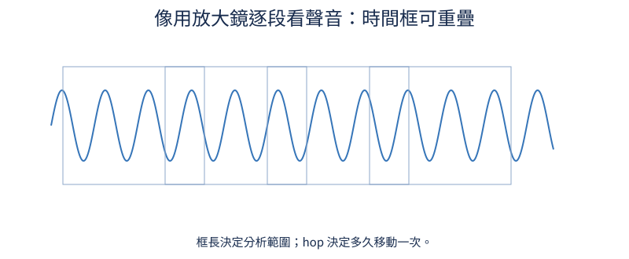
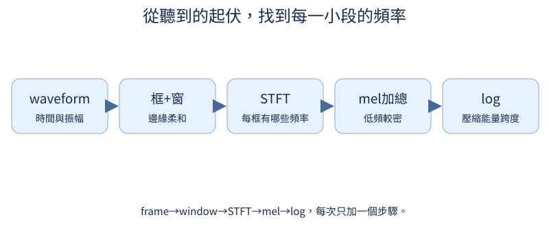
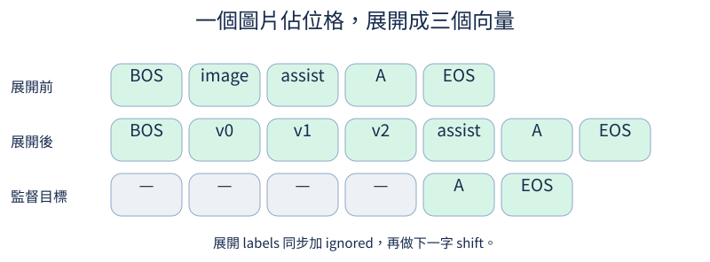
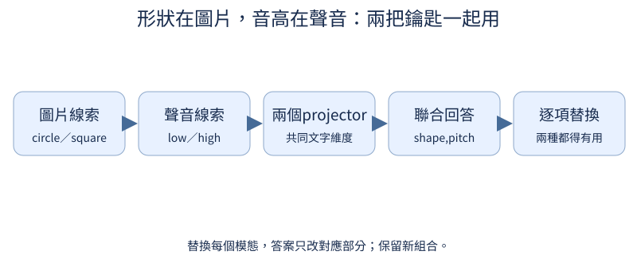

# 第 12 章：沿用相同介面加入聲音

前置：第10章模態展開與第7章loss mask。頻譜可獨立讀；聲音生成與log-mel都從PyTorch寫起，不依賴Whisper或torchaudio。FSDD爲額外真實語音pilot；本章默認合成音高／時長任務。

## 12.1 音訊是什麼 tensor？

**先想一想：**音高更高就一定振幅更大嗎？



waveform是一維隨時間變化的振幅。播放是體驗，數值與時間軸纔是計算輸入；左右聲道則多一條channel軸。

**把直覺寫成數學：**單聲道[N]、batch[B,N]；amplitude不是頻率。

**最小實驗：**以下程式只處理這節的問題。

```python
from tiny_perceptron.multimodal import tone

wave = tone(440.0)
print(wave.shape, wave.min().item(), wave.max().item())
import matplotlib.pyplot as plt

plt.plot(torch.arange(100) / 16000, wave[:100])
plt.xlabel("seconds")
plt.show()
```

**如何讀結果：**固定振幅0.5，只有頻率決定起伏速度；音訊資料通常另存sample_rate。

**只改一件事：**只把頻率從440改成880，不改振幅。

## 12.2 每秒多少樣本？

**先想一想：**1600個樣本在16kHz和8kHz下時長一樣嗎？

sample rate是每秒取幾個點；同樣N個樣本用不同rate播放，會改變時長與音高。改metadata不等於真正重取樣。

**把直覺寫成數學：**duration=N/sample_rate；奈奎斯特頻率=sample_rate/2。

**最小實驗：**以下程式只處理這節的問題。

```python
n = 1600
for rate in (16000, 8000):
    print(rate, "seconds", n / rate, "Nyquist Hz", rate / 2)
```

**如何讀結果：**8kHz的FSDD不能只宣告成16kHz；先真正resample或用正確rate作頻譜。

**只改一件事：**只改rate，計算一個440Hz週期需要幾個樣本。

## 12.3 怎麼看聲音隨時間變化？

**先想一想：**框400點、hop160點，是不重疊嗎？

聲音頻率會隨時間改變，所以切成短框。框可重疊；hop決定時間分辨率，frame長度決定頻率分析範圍。

**把直覺寫成數學：**frames=N.unfold(size,hop)；相鄰框可共享樣本。

**最小實驗：**以下程式只處理這節的問題。

```python
from tiny_perceptron.multimodal import tone

wave = tone()
frames = wave.unfold(0, 400, 160)
print(frames.shape, "框秒", 400 / 16000, "步秒", 160 / 16000)
assert torch.equal(frames[0, 160:], frames[1, :240])
```

**如何讀結果：**PyTorch STFT center=True會在兩邊padding，框數可比直接unfold多；要記錄此設置。

**只改一件事：**只把hop改成400。

## 12.4 時間框的邊緣如何處理？

**先想一想：**window只改邊緣，會影響所有頻率嗎？

短框直接截斷會在邊緣出現跳變，引出額外頻譜泄漏。Hann window把邊緣逐漸壓小，代價是主峯變寬。

**把直覺寫成數學：**w[n]=0.5(1−cos(2πn/N))；PyTorch默認periodic Hann，和N−1版本略有差異。

**最小實驗：**以下程式只處理這節的問題。

```python
from tiny_perceptron.multimodal import tone

frame = tone()[:400]
window = torch.hann_window(400)
print("邊緣window", window[:3], window[-3:])
print("前後energy", frame.square().sum().item(), (frame * window).square().sum().item())
```

**如何讀結果：**window能降低突變，但不能把不同長度或sample rate自動變一致。

**只改一件事：**只換成全1 rectangular window。

## 12.5 一小段聲音有哪些頻率？

**先想一想：**16kHz、n_fft400，每格相差40Hz還是400Hz？



STFT每框做Fourier變換：問這一小段含哪些頻率，再沿時間擺成圖。複數同時保存幅度與相位，先看功率。

**把直覺寫成數學：**frequency_bin≈k·sample_rate/n_fft；frequency分辨率≈sample_rate/n_fft。

**最小實驗：**以下程式只處理這節的問題。

```python
from tiny_perceptron.multimodal import tone

wave = tone(440.0, seconds=0.2)
spectrum = torch.stft(wave, 400, 160, window=torch.hann_window(400), return_complex=True)
power = spectrum.abs().square()
peak = power.mean(-1).argmax().item()
print(power.shape, "peak Hz", peak * 16000 / 400)
assert abs(peak * 40 - 440) <= 40
```

**如何讀結果：**一秒內不是隻有一個頻率格；有限框與window會使峯附近也有能量。

**只改一件事：**只換成880Hz，覈對峯位置。

## 12.6 怎麼組合頻率區段？

**先想一想：**bands從16變32，時間框數會加倍嗎？

mel軸在低頻較密、高頻較疏；一組重疊三角濾波器把細頻率格加總成較少bands。它是前處理座標選擇，不是學來的編碼器。

**把直覺寫成數學：**mel(f)=2595·log10(1+f/700)；過濾矩陣[M,F]乘power[F,T]。

**最小實驗：**以下程式只處理這節的問題。

```python
from tiny_perceptron.multimodal import mel_filter_bank

bank = mel_filter_bank(bands=16)
print(bank.shape, bank.min().item(), bank.max().item())
assert bank.shape == (16, 201) and (bank >= 0).all()
```

**如何讀結果：**每個band都有自己的頻率權重；高低頻並非簡單等寬分組。

**只改一件事：**只把bands改爲32。

## 12.7 大小差很多的能量怎麼顯示？

**先想一想：**把整段音量乘2，會讓log-mel每格乘2嗎？

功率跨度很大，直接看會被最強頻率支配。先clamp避免log0，再取log壓縮動態範圍。單位和底數要與訓練一致。

**把直覺寫成數學：**log(max(power,ε))；amplitude乘2會讓power乘4。

**最小實驗：**以下程式只處理這節的問題。

```python
from tiny_perceptron.multimodal import tone, log_mel

wave = tone()
a = log_mel(wave)
b = log_mel(2 * wave)
print(a.shape, "finite", a.isfinite().all().item(), "平均差", (b - a).mean().item())
assert a.isfinite().all() and b.isfinite().all()
```

**如何讀結果：**低於clamp的格不符合統一平移；不要把靜音邊緣視爲真實頻率。

**只改一件事：**只把epsilon擴大，說明哪些小能量格受影響。

## 12.8 頻譜怎麼變成特徵序列？

**先想一想：**音頻encoder的T一定與文字token數相同嗎？

每個時間框的mel向量經Linear變成hidden features。先用音高／時長分類head訓練，確認獨立held-out屬性組合，再接語言模型。

**把直覺寫成數學：**[B,M,T]→transpose→[B,T,M]→[B,T,Da]。

**最小實驗：**以下程式只處理這節的問題。

```python
from tiny_perceptron.multimodal import AudioEncoder, tone

encoder = AudioEncoder(width=8)
wave = torch.stack([tone(220.0), tone(880.0)])
features = encoder(wave)
classifier = nn.Linear(8, 2)
loss = F.cross_entropy(classifier(features.mean(1)), torch.tensor([0, 1]))
loss.backward()
print(features.shape, encoder.projection.weight.grad.norm().item())
```

**如何讀結果：**這裏只覈對分類監督與梯度，未訓練音高辨識器；CLI pretrain_encoders --modality audio --train。

**只改一件事：**只換兩種時長，觀察frame數不同需如何pad。

## 12.9 音訊怎麼進入既有模型？

**先想一想：**聲音加倍長，回答label索引應不變嗎？



聲音projector把Da轉成文字D，音訊placeholder展開成多個時間features。和圖片共享labels契約，但長度取決於聲音時長。

**把直覺寫成數學：**增加長度=T_audio−1；首回答位置依新序列覈對，不預設固定視覺patch數。

**最小實驗：**以下程式只處理這節的問題。

```python
from tiny_perceptron.model import TinyLM, ModelConfig
from tiny_perceptron.multimodal import MultiModalLM, tone

model = MultiModalLM(TinyLM(ModelConfig(width=8)))
ids = torch.tensor([1, 3, 6, 4, 100, 2])
labels = torch.tensor([-100, -100, -100, -100, 100, 2])
result = model(ids, labels, waveform=tone())
print(result["logits"].shape, result["labels"].shape)
assert result["labels"][0, -2] == 100
```

**如何讀結果：**音訊features不是UTF-8位元組；模態位置只做context，不當成文字答案label。

**只改一件事：**只增加音訊時長，覈對新的labels長度。

## 12.10 模型有聽聲音嗎？

**先想一想：**所有題都猜high，在balanced高低音上能多高分？



平衡高低音資料後，分別替換同題音訊；答案應按音高規則改變。只測waveform改變logits不能說明任務成功。

**把直覺寫成數學：**原音accuracy與replacement按規則變化率分開量；以未見頻率作holdout。

**最小實驗：**以下程式只處理這節的問題。

```python
frequency = torch.tensor([180.0, 220.0, 880.0, 1000.0])
truth = frequency > 500
always_high = torch.ones(4, dtype=torch.bool)
print("多數猜測基準", (truth == always_high).float().mean().item())
print("正式訓練：python scripts/train.py --task audio --train --steps 300")
```

**如何讀結果：**0.5只屬於這個構造的規則基準。真實音訊語言能力還需更多任務，不從單音外推。

**只改一件事：**只換held-out頻率而保持high/low邊界。

## 12.11 先轉成文字會少掉什麼？

**先想一想：**兩個音訊都轉成「你好」，還能從轉寫推斷哪個更高音嗎？

同一說詞可以用不同音高說出來。先轉文字會丟掉不在轉寫中的聲音屬性；直接features能保留，但模型仍需學會用它。

**把直覺寫成數學：**information(audio)一般比給定transcript包含更多屬性；不表示端到端一定更準。

**最小實驗：**以下程式只處理這節的問題。

```python
examples = [{"transcript": "你好", "pitch": "low"}, {"transcript": "你好", "pitch": "high"}]
print(examples)
assert examples[0]["transcript"] == examples[1]["transcript"]
print("純轉寫路徑缺音高資訊；直接feature路徑需額外音高監督")
```

**如何讀結果：**這是預錄轉寫／玩具標註示例，不調用ASR或外部模型。

**只改一件事：**只把音高標註也寫進文字，說明比較條件已變。

## 12.12 答案需要同時看圖和聽聲音時怎麼辦？

**先想一想：**只提供圖片，能唯一決定「circle,high」嗎？

設計一個答案必須依兩種線索的任務：圖片給形狀、聲音給高低音。各自替換應只改變對應答案部分，新組合留作holdout。

**把直覺寫成數學：**answer=(shape(image),pitch(audio))；單一模態只能獲得其中一項。

**最小實驗：**以下程式只處理這節的問題。

```python
from tiny_perceptron.model import TinyLM, ModelConfig, masked_loss
from tiny_perceptron.multimodal import MultiModalLM, scene, tone

model = MultiModalLM(TinyLM(ModelConfig(width=8)))
ids = torch.tensor([1, 3, 5, 6, 4, 100, 2])
labels = torch.tensor([-100] * 5 + [100, 2])
out = model(ids, labels, image=scene(), waveform=tone())
loss = masked_loss(out["logits"], out["labels"])
loss.backward()
print(
    out["logits"].shape,
    "圖梯度",
    model.image_projector.weight.grad.norm().item(),
    "音梯度",
    model.audio_projector.weight.grad.norm().item(),
)
```

**如何讀結果：**這裏只證實兩種入口有梯度。聯合SFT後應報告兩項與聯合exact match，並替換圖／音做消融。

**只改一件事：**只替換聲音，保持圖和問題不變。
