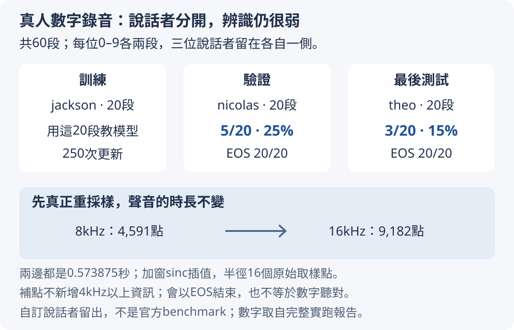
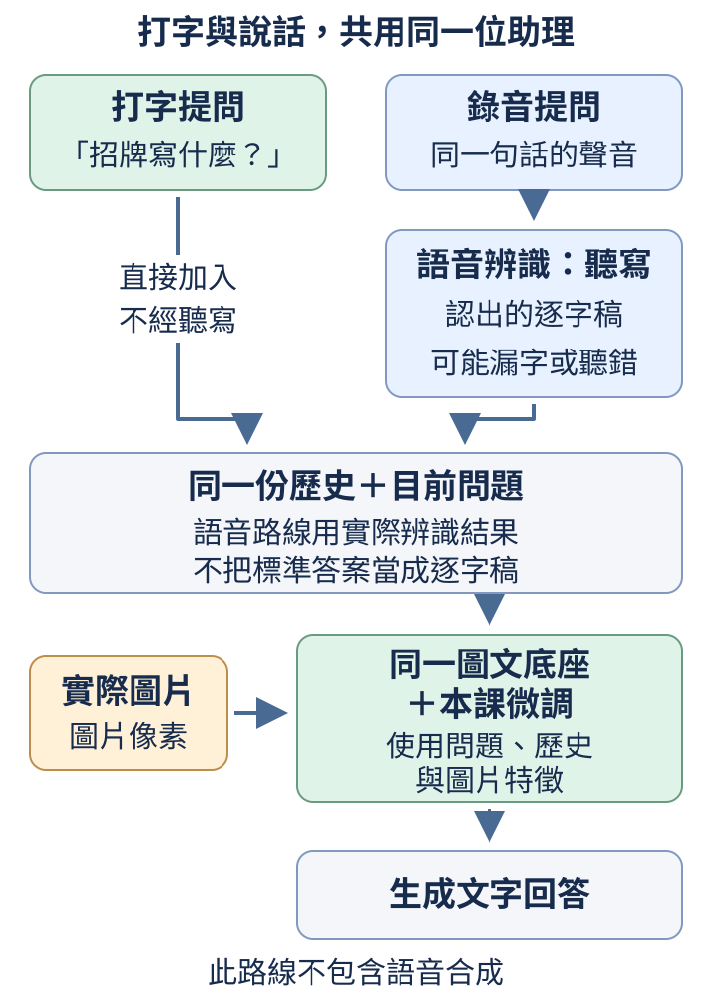

# 第 12 章：沿用相同介面加入聲音

圖片需要先變成特徵，聲音也一樣。這次原始資料不是二維像素，而是沿時間記錄的一串振幅。本章先用一段合成單音，逐步看取樣率、時間框、頻率與log-mel，再把每框特徵接進既有文字介面。這些短例子能離線執行，不需要Whisper或torchaudio。後面的[12.8](#12.8)再帶到FSDD真人數字錄音：我們已用它訓練並留出另一位說話者檢查，讓你看見能分單音高低，與能聽懂人說的數字，相隔了哪些問題。

## 12.1 音訊是什麼 tensor？

一根琴弦振動，空氣壓力隨時間上下起伏。數位音訊把這種起伏按固定時間間隔記成一串數字，叫波形waveform。一次起伏有多大是振幅，起伏重複有多快是頻率。音比較高不代表振幅一定更大；本節先認清模型最前面收到哪一串數字。

前置是[W.3的一維tensor](../first-steps.md#W.3)。單聲道有N個時間樣本，形狀[N]；一批B段等長單聲道可為[B,N]。左右雙聲道則需要另外一條通道軸，不能把左右兩串接成一段兩倍長的錄音，否則時間意義會變。

```python
from tiny_perceptron.multimodal import tone

wave = tone(440.0)
print("樣本形狀", tuple(wave.shape))
print("前三個值", [round(v, 3) for v in wave[:3].tolist()])
print("最小最大", round(wave.min().item(), 2), round(wave.max().item(), 2))
```

輸入`tone(440.0)`生成440Hz的正弦單音，Hz表示每秒重複幾次。正弦是一種特定的平滑曲線；在這個例子裡，它規律地從0升到最高、回到0、降到最低、再回到0，這完整一輪叫一個週期。440Hz就是每秒走完440輪。工具預設長0.1秒、每秒記錄16000個樣本，振幅0.5。它不讀取檔案或播放聲音，直接算出浮點tensor。輸出形狀`(1600,)`，前三值約[0.0,0.086,0.169]，最小最大約-0.5與0.5。波形先從0向上，之後會繼續上下往復；負數不是錯誤，而是相對基準的另一方向起伏。

每個數字本身沒有附時間，必須另外知道取樣率16000，才能說第1個索引在1/16000秒。1600是樣本數量，不是1600Hz，也不是1600個語言token。進入音訊編碼器之前還會切成短時間框，每框形成一條特徵，這個轉換會在後面逐步解釋。

振幅是這份數字記錄的尺度，常與聲音強弱有關，但真實聽感還受設備與頻率影響；不要把0.5直接叫固定分貝。頻率440控制起伏速度，而工具裡的0.5控制上下幅度，兩者在這個生成器裡能獨立改變。

若把波形畫成圖，橫軸是時間或樣本索引，縱軸是振幅；曲線越密集通常表示起伏越快，而不是樣本編號越大代表聲音越高。下圖只放大一個週期，用「這一輪走完多少」作橫軸：走到1/4輪時振幅是0.5，1/2輪時回到0，3/4輪時是-0.5，走完一輪又回到0，接著重複。


相位指起伏目前走到週期中的哪個位置，可以先當作「這一輪的進度」。相位不是振幅：同樣振幅0，可能是在起點向上，也可能是在半輪時向下。工具從圖左的0開始，索引0是第一點；索引1是1/16000秒後的第二點，這時440Hz的波走了440/16000輪，還沒到最高點，生成器算出的振幅約0.086。要解釋的是取樣時刻在曲線上的哪裡，不需要先學正弦公式。

這條曲線是確定生成的測試輸入，方便我們知道答案，不是從音樂中成功抽取了音高。真實錄音還可能有噪聲、靜音或多個聲源，單看前三個值無法辨識全部內容；後面才會在短框內匯整這些變化。

練習只把440改880，先預測形狀仍1600、極值仍約±0.5，而前幾個值變得更快上升，再執行核對。它在同樣時間內起伏約兩倍次數，不會因此多出兩倍樣本。下一節將解釋樣本數量如何與真實時間聯繫。

## 12.2 每秒多少樣本？

一串1600個音訊數字，用每秒16000點解釋是0.1秒，用每秒8000點解釋則是0.2秒。數字沒改，時間尺改變，播放速度與音高也跟著變。本節說明為什麼取樣率不是可隨便改寫的檔案標籤。

前置是[12.1的波形樣本](12.md#12.1)。sample rate取樣率指每秒記錄的樣本數；總時長等於樣本數除取樣率。16kHz就是16000樣本/秒，k代表千。要讓相同聲音從8kHz改用16kHz表示，需要真正重新取樣，計算新時間點的數值，而不只是把metadata，也就是附帶說明資料，改成16000。

```python
samples = 1600
for rate in [16000, 8000]:
    print("取樣率", rate, "時長", samples / rate, "奈奎斯特界線", rate / 2, "440Hz每週期樣本", round(rate / 440, 2))
```

輸入固定samples=1600，只改每秒點數。輸出16000時長0.1、奈奎斯特界線8000、每週期約36.36個樣本；8000時長0.2、奈奎斯特界線4000、每週期18.18個樣本。`rate/440`表示如果記錄的真實音頻率是440Hz，每次往復平均會分到多少取樣點，並不要求週期剛好落在整數格。

取樣率一半的頻率稱為奈奎斯特頻率Nyquist frequency，這裡叫它「奈奎斯特界線」。在理想取樣條件下，要從取到的數字可靠還原起伏，保留的各頻率都應嚴格低於這條界線；對單音來說，就是每週期要多於兩個樣本。恰好兩點是邊界，不能保證記到起伏：若8000Hz正弦波從0開始，用每秒16000點取樣，兩點恰巧都落在0，整串就看起來像沒有聲音。

更快的起伏還可能在取樣後看起來像較慢的波，稱為混疊。真正重取樣時，通常要先濾除新取樣率無法可靠保存的高頻，避免它們混入低頻；不能只改取樣率標籤。

上面每週期數字是兩種取樣設計記錄同一440Hz聲源的比較；若把已錄好的16kHz波形僅改標籤為8kHz播放，同樣36.36個點被安排在兩倍時間裡，聽起來會變成約220Hz。要分清重新記錄同一聲音與用錯誤時間尺解釋舊數字。

頻譜是把一小段聲音按頻率整理、列出各頻率成分強弱的表示。程式把頻率位置排成一格一格，叫頻率格（frequency bin）；每格對應一個頻率位置，最強的位置叫主峰。[12.5](12.md#12.5)會示範怎麼從波形產生頻譜並找到主峰，此處先知道頻率格還要靠取樣率換算成Hz。

FSDD（Free Spoken Digit Dataset，收錄人聲0到9錄音的資料集）這批原錄音確實是8kHz單聲道PCM16：每個樣本用16位元的帶正負號整數記錄振幅。不可直接宣稱為16kHz再送進按16kHz配置的頻譜流程。[正式真實資料實驗](https://github.com/birdhackor/tiny-perceptron-vlm/blob/main/docs/course-experiments/results/real_modal.json)把60段都先真正重採樣成16kHz浮點檔，保留原檔與衍生檔SHA-256、兩側取樣率和點數。它用半徑16個原始取樣點的加窗sinc插值，按附近點計算新時間點的值，不是只改檔案標籤。

例如`0_jackson_5.wav`由4,591點變9,182點，兩邊時長仍是4,591/8,000＝9,182/16,000＝0.573875秒。增加的是時間點密度，不能補回原始8kHz沒有記錄的4kHz以上細節。PCM16讀成浮點時按固定比例除以32768。例如這個原檔索引1017的整數是−4096，換算成−4096/32768＝−0.125；只把整數寫成−4096.0不會得到同樣尺度。每段都使用同一把尺，原本較小的振幅仍較小，這與把每段最大振幅都調成1不同。之後沒有另把每段峰值或平均能量調成相同大小，衍生檔也沒有再削掉較大振幅。這些格式、尺度與樣本已在[60段錄音的補充核對](https://github.com/birdhackor/tiny-perceptron-vlm/blob/main/docs/course-experiments/student-checks/fsdd-format-and-resampling.json)逐檔記錄：`source_subtype`是原PCM16、`derived_subtype`是衍生浮點格式，`actual_sample`保留實際整數與換算結果，`amplitude_processing`說明是否另調強度或截波。這個尺度處理和重新取樣分屬兩件事，都要記錄，不能統稱「整理過聲音」就省略。

錄音的時間尺應與每個運算一起走。若頻譜程式看到16000，它會把每個頻率格按16000來換算Hz；輸入其實按8000錄制時，報告的頻率可能被錯算兩倍。這個錯誤可以貫穿整個訓練，讓模型學習到錯誤標籤，卻未必引起任何形狀報錯。檢查原檔取樣率、實際重取樣過程與送入頻譜的參數，是比只看tensor長度更完整的核對。你也可以先用已知440Hz的合成音作測試，確認工具報告的主峰接近440，再處理真實檔案。

練習把samples改3200，先預測兩種時長都加倍，但奈奎斯特與每週期點數不變，再執行核對。改變錄音長度與改變每秒點數，是兩種不同操作。

## 12.3 怎麼看聲音隨時間變化？

一段聲音開始是低音，後來轉高音，只對整段統計會丟掉何時變化。我們可以像沿錄音移動一扇小窗，每次看一小段，叫時間框frame。相鄰框可以重疊，使變化不必等整框結束才被發現。本節先看哪些樣本被哪一框包含。

前置是[12.2樣本到時間的換算](12.md#12.2)。框長400樣本，在16kHz下是0.025秒；移動步長hop為160樣本，即0.01秒。第一框取索引0到399，第二框160到559，所以兩框共用160到399這240個樣本。框長決定一回看多少資料，hop決定多久重新看一次。

```python
import torch
from tiny_perceptron.multimodal import tone

wave = tone()
frames = wave.unfold(0, 400, 160)
print("框形狀", tuple(frames.shape))
print("框秒數", 400 / 16000, "移動秒數", 160 / 16000)
print("重疊相同", torch.equal(frames[0, 160:], frames[1, :240]))
```

輸入是一段1600點錄音。`unfold(0,400,160)`沿時間軸0，每次取400點、向後160點；最後不足400的尾段不另成一框。輸出`(8,400)`，8框各400點；框0.025秒、移動0.01秒，最後True。比較式把第一框後240點與第二框前240點逐項核對，證明重疊不是複製了新聲音，而是重複觀察同一段樣本。

框數可手算為(1600−400)//160+1=8，最後一框從1120開始到1519。還剩80點沒有形成完整框，這個邊界選擇要記錄。後面的[STFT（short-time Fourier transform，短時傅立葉轉換）](12.md#12.5)會把每個短框按頻率整理成強弱資訊，也就是逐框產生頻譜。這種工具預設可能在波形兩側補樣本，使第一個框以起點為中心，因此框數會不同；同一段聲音的兩種算法不能只比較形狀後就以為資料變長。

目前每框仍是400個原始振幅；後面會把每框轉成一組表示聲音的數字，例如各頻率的強弱，這組數字叫特徵。依照框的時間順序排列這些特徵，就是特徵序列；它的長度是框數8，400則是本例每框的原始樣本數。固定錄音長度與框長，減小hop會讓相鄰框共用更多內容，框數則不會減少，但不一定每次都增加。因為只算完整框，框數還要取整：本例把hop從160改成159，重疊由240增為241點，框數仍是(1600−400)//159+1=8。

訓練資料用來讓模型學習，測試資料用來檢查它能否處理沒學過的內容。不能把八框當成八段獨立錄音來拆到兩邊，否則幾乎相同的樣本會同時出現。應讓同一段錄音的重疊框一起放在同一邊，避免把接近看過的內容當新題。

可以把八框想成八張連續拍攝的近景照片，同一段物件會在相鄰照片裡重複出現。相鄰框共用內容，後續算出的特徵常會比較接近；這不保證每個特徵都平滑，也沒有讓原錄音的樣本總長度從1600變成3200。unfold產生的視圖可能共享原儲存，不應隨意對某框就地寫值，否則也可能影響重疊框；本例只讀它們來比較。若要保留尾端80點，有幾種選擇：補到完整框、接受較短末框或丟棄。不同選擇會改變後面特徵長度與邊界資訊，應在資料流程中寫明，而不是把不足一框的內容悄悄當成完整。

練習把`unfold(0, 400, 160)`的第三個參數改成400，也把印移動秒數的`160 / 16000`改成`400 / 16000`，讓輸出描述新的hop。將重疊比較那行換成`print("第一框末索引", 399, "第二框首索引", 400)`。先預測框形狀(4,400)、移動0.025秒，相鄰不再重疊，再執行核對。框長仍400，所以每一框分析範圍不變，改的是觀察頻率；紙上也可核對第一框0到399、第二框400到799，沒有共用樣本。

## 12.4 時間框的邊緣如何處理？

剪下一小段波形，起點與終點可能不接在同一個高度。如果頻率分析把這段當成可以首尾重複的片段，接縫就會突然跳變，額外制造許多頻率成分。像逐漸淡入淡出音量，我們可以將框邊緣慢慢壓小，減輕接縫影響。這叫加窗windowing。

前置是[12.3時間框](12.md#12.3)。Hann窗是一串從邊緣接近0、中間接近1的權重，波形逐點乘上它。它減少頻譜泄漏，即本來集中在一個頻率附近的能量因截斷而散到別處；代價是主峰會變寬，所以不是讓所有頻率判斷無條件更準。

```python
import torch
from tiny_perceptron.multimodal import tone

frame = tone()[:400]
window = torch.hann_window(400)
weighted = frame * window
print("起點權重", window[0].item(), "中間權重", window[200].item())
print("最後權重", round(window[-1].item(), 6))
print("原能量", round(frame.square().sum().item(), 2))
print("加窗能量", round(weighted.square().sum().item(), 2))
```

輸入400點單音與同長窗。`square().sum()`把每點振幅平方再加總，這裡當作框的能量量度。輸出起點0、中間1、最後約0.000062，能量50降到18.75。因為窗壓小了很多樣本，這個降低是預期結果，不是聲音憑空消失或模型訓練變好。

PyTorch預設periodic Hann，公式使用N個取樣點作為週期長度，所以最後一點接近0而不必恰好0；另一種對稱窗把兩端都設為0，公式分母會用N−1。若比較不同工具的頻譜，要記錄用哪一種，不能把末端微小差值誤判為程式錯誤。這裡不必背餘弦公式，重點是逐點權重與邊緣處理的目的。

加窗沒有改變取樣率、框長或hop，也沒有產生新的時間軸。它改變的是同一框內哪些點影響頻率統計較大。靜音區域、重取樣與錄音長度仍需各自處理，不能期待一個窗函數統一解決所有音訊問題。

接縫問題可以先從波形看：假如框末振幅0.4、框首-0.3，首尾直接相接時一下跳0.7，這不是原本連續聲音中的變化，卻會被頻率分析解釋成額外快起伏。窗把兩端壓向0，讓這個人工跳變減小。它同時也弱化框邊緣真實內容，所以相鄰重疊框有價值：一段聲音在某框邊緣被壓低，可能在下一框中心得到較大權重。窗與hop因此是相關的前處理選擇，但仍應分別記錄，不能只寫「做了頻譜」就丟掉它們的具體設定。

練習只把`torch.hann_window(400)`換成`torch.ones(400)`，先預測起點、中間、最後都1，加窗能量等於原能量50，再執行核對。這叫矩形窗，等於保留整框不淡入淡出；下一節的頻率分析便能比較不同邊緣處理造成的影響。

## 12.5 一小段聲音有哪些頻率？

聽到一段單音，我們想知道它主要每秒振動幾次；真實聲音還可能同時含多種頻率。可以在每個短框裡問「各種快慢的正弦起伏各佔多少」，再把結果沿時間排列。這叫短時傅立葉變換STFT：每框做頻率分析，保留何時出現哪些頻率。

前置是[12.2取樣率](12.md#12.2)、[12.3時間框](12.md#12.3)與[12.4加窗](12.md#12.4)。傅立葉變換輸出複數，可以先把它看成一起保存的一對數值：實部a與虛部b。Python用j標示虛部，例如 `3+4j`保存3與4。複數的絕對值不是只把負號去掉，而是這一對數值的幅度，算作a平方加b平方後開根號；3平方加4平方是25，開根號得到5。因此這個例子的 `.abs()`得5，再 `.square()`得功率25。這對數值也保存相位，也就是起伏從週期的哪個位置開始；本節只取幅度平方，不討論如何由相位重建波形。

```python
import torch
from tiny_perceptron.multimodal import tone

wave = tone(440.0, seconds=0.2)
spectrum = torch.stft(wave, 400, 160, window=torch.hann_window(400), return_complex=True)
power = spectrum.abs().square()
peak = power.mean(-1).argmax().item()
print("頻率格、時間框", tuple(power.shape))
print("最高格編號", peak, "對應Hz", peak * 16000 / 400)
```

輸入0.2秒、3200點、440Hz單音。STFT的400是每框分析點數n_fft，160是hop，窗用Hann。預設center=True在邊界補資料，讓框中心從開頭開始，所以輸出`(201,21)`，不是直接unfold的框數。201來自400/2+1：實數波形只需保留0到奈奎斯特的非負頻率部分。

第一軸每一格差16000/400=40Hz，格0為0Hz、格11為440Hz、格200為8000Hz。`mean(-1)`沿時間框平均功率，留下各頻率一項，再`argmax`找最大格，輸出11與440.0。這裡的最高格表示主要頻率；附近仍可能有能量，有限框與窗形狀會讓峰不只一個點。

畫時頻圖時，橫軸是時間框、縱軸是頻率格，顏色或亮度才是功率。

上圖畫波形的前0.008秒，縱向是振幅，正負起伏不代表高低音類別；下圖橫軸換成每0.01秒一框的中心時間，縱軸列頻率，440Hz帶用橘色示意功率較強。下圖只畫前五框，各欄下方的刻度對準這一框的中心，時間從0到0.04秒；程式分析的完整聲音仍長0.2秒，共21框。下圖亮度是示意，不是這段程式實測矩陣；它幫我們分清兩種圖的軸，而不是增加一份量測。


不能把201行當201秒，也不能把21列當21Hz。窗長加大通常能讓頻率格更密，但每框覆蓋更久，瞬間變化可能更難定位，這是一種時間與頻率觀察尺度的取捨。

若聲音是450Hz而不是440，400點分析的格子仍只有440、480等40Hz間距，不會自動多出450這一格。功率可能分布在附近格子，最高格接近450卻不必恰等於450。我們找到440是因為合成頻率剛好落第11格，方便核對。增加n_fft通常讓格距更小，若只是補零而不增加真實觀察長度，則不能憑空分辨原框沒有足夠資料區分的相近頻率。讀頻譜時先知道分析尺度，才不會把格號換算的小數當成無限精確的頻率測量。

練習只把440改880，先預測峰從第11格到22格、形狀仍(201,21)，再執行核對。頻率變了，但錄音時長、取樣率與框設置沒變，因此兩條軸的長度保持相同。

## 12.6 怎麼組合頻率區段？

每框有201個頻率格，後續文字模型接收的是每框一排數字特徵，不一定需要逐格保留這201項；這裡稱兩者銜接處為語言接口。我們可以用幾組重疊權重，把附近頻率加權合成16個區段。區段不像簡單每十格一組：低頻分得較細、高頻分得較粗，這種尺度叫mel。它反映一種聽覺頻率刻度選擇，但仍是固定前處理，不是已經訓練好的語音理解。

前置是[12.5頻率格與功率](12.md#12.5)和[W.5加權矩陣](../first-steps.md#W.5)。濾波器組filter bank是一張權重表，每一橫排負責一個頻率區段，每一欄對應一個原始頻率格。本項目採用三角權重：接近區段中心權重較大，向兩側降到0，相鄰區段可以同時收到同一頻率的貢獻。

```python
import torch
from tiny_perceptron.multimodal import mel_filter_bank

bank = mel_filter_bank(bands=16)
power = torch.ones(201, 3)
mel_power = bank @ power
print("權重表", tuple(bank.shape))
print("合成後", tuple(mel_power.shape))
print("權重非負", bool((bank >= 0).all()))
```

輸入bank使用預設16kHz、n_fft400，因此原頻率格201；power造三框全1功率，便於只觀察維度變換。`bank @ power`用(16,201)乘(201,3)，輸出(16,3)。第一行權重表(16,201)，第二行16區段、3時間框，最後True。區段數改變的是頻率軸，不會讓時間框數加倍。

mel刻度常寫為mel(f)=2595×log10(1+f/700)，f是Hz。log10是以10為底的對數，回答「10的幾次方會得到這個數」；例如log10(1)=0、log10(10)=1、log10(100)=2。f=700時，括號裡是2，log10(2)約0.30103，再乘2595得到約781.17mel。

可以把0、700、2100Hz代入同一公式：括號裡依序是1、2、4，log10(4)約0.60206，得到約0、781.17、1562.34mel。三個mel點的間距相同，對應的Hz間距卻是700、1400，讓你看見高頻的Hz間距較大。這三點只是示意；正式16區段的中心由工具按範圍安排。公式的意義是決定區段中心如何排布，不是給每個格一個模型預測標籤。這裡權重也不是每行必然加總1，不能預設輸出是簡單平均能量。

合並之後會失去一部分細頻率差異，例如落在同一區段的兩個很接近單音可能更難分。是否足夠，要看任務；區分高低音或識別語音需要的細節不同。設置應記錄bands、取樣率與n_fft，和訓練資料保持一致。

三角加權可以用三格頻率、兩組區段的小表想像：第一組權重[1,0.5,0]，第二組[0,0.5,1]，原功率[4,2,1]。第一輸出4+1=5，第二輸出1+1=2；中間格2同時給兩組各貢獻1。這是重疊區段，不是必須互斥的分類。真實bank有16橫排、201欄，矩陣乘法一次完成相同的逐格乘加。功率表有三欄時間框時，同一張權重表各用一次，故輸出仍三框；若把表轉錯軸，結果會不匹配，而不是聲音變得更長。

下圖只畫這張三格小表。箭頭標的是「原功率乘這條路徑的權重」：中間格2沿兩條0.5路徑，給A與B各1；左格4只給A，右格1只給B，最後得到5與2。權重為0的路徑沒有畫出。這個示意不表示真實濾波器組的全部區段一定保持功率總和；還要按實際權重計算。


練習只把bands改32，先預測權重表(32,201)、輸出(32,3)，時間框仍3，再執行核對。區段變多不等於原始錄音多了資訊，只是用更細的表示保留原本頻譜的部分差異。

## 12.7 大小差很多的能量怎麼顯示？

頻譜裡有的功率是1，有的是萬分之一，直接並排顯示時，小值很容易看不見。對數log能把「倍率差」轉換成較容易比較的「加減差」，但0不能取有限對數，因此還要先設一個最低值。本節把這兩個步驟分別算出來，避免把靜音變成無窮大負數。

前置是[W.4機率與log](../first-steps.md#W.4)及[12.6的mel功率](12.md#12.6)。這裡用自然對數，底數是e；log-mel就是先合成mel功率，再取log。最低值epsilon是我們人為定義的小正數，`clamp`把比它更小的值提升到它，並不是發現了真實能量。

```python
import torch

power = torch.tensor([0.0, 1e-10, 1e-4, 1.0])
floor = 1e-8
compressed = power.clamp(min=floor).log()
scaled = (4 * power).clamp(min=floor).log()
print("log功率", [round(x, 2) for x in compressed.tolist()])
print("放大後差", [round(x, 2) for x in (scaled - compressed).tolist()])
print("皆為有限值", bool(compressed.isfinite().all()))
```

輸入四個功率值，`1e-8`表示10的負8次方。前兩項低於最低值，變成1e-8，所以輸出約[-18.42,-18.42,-9.21,0.0]。0沒有變成負無窮，因為取log前已設底。`isfinite`逐項檢查不是無窮或無效數字，最後True。

第二行差約[0.0,0.0,1.39,1.39]。功率乘4時，正常格的log增加log(4)約1.386；低於底的兩格放大後仍被壓到同一個底，所以差0。若波形振幅乘2，功率因平方而乘4，並不是log-mel每格也乘2。這種變換在[12.5](12.md#12.5)的`abs().square()`已經決定了。

實際專案`log_mel`採用相同1e-8最低值。合成單音有許多接近靜音的格，因此整張圖平均差可能小於log4；不能拿統一平移公式套在已觸底的格上。訓練是用例子調整模型數字，推理則是用已選定的模型處理新的聲音、產生回答；兩階段要保持對數底數、最低值與前處理相同，否則模型見到的數值尺度會改變。

1與萬分之一在原尺度差一萬倍，對數後0與約-9.21差約9.21，弱格因此更容易放到同一顯示範圍。負的log不表示負功率：原始功率仍非負，只是小於1的數取自然log會為負。最低值還把0與1e-10變成相同表示，我們失去了辨別兩者的能力，這是有意的數值折衷。若任務需要區分極弱聲音，最低值或歸一化方式就可能重要；歸一化指按一套約定重新調整數字尺度，例如將各格除以同一個參考大小，本例沒有另做這一步。若只是避免靜音處異常，則要確認它不會壓掉目標相關差異。記錄範圍與單位，比認為越漂亮的色圖就越有資訊更可靠。

練習只把floor改1e-3，先預測原本1e-4也被壓到底，輸出前三項都約-6.91、最後0，再執行核對。更高最低值讓更多弱能量細節合並；它避免數值問題的同時也改變資訊，不能任意調高後說聲學特徵完全相同。

## 12.8 頻譜怎麼變成特徵序列？

log-mel每一列是頻率區段，每一列橫向又有多個時間框；文字接口則希望一串位置，每個位置有固定特徵寬度。於是把頻譜轉一下軸，讓一個時間框成為一條向量，再用線性變換得到較短的特徵。這裡的序列位置來自時間，不是原始每個振幅樣本。

前置是[12.7的log-mel](12.md#12.7)、[10.3的共享線性變換](10.md#10.3)與[W.3軸順序](../first-steps.md#W.3)。輸入一批B段錄音，頻譜是[B,M,T]，M為mel區段數、T為框數；`transpose`後為[B,T,M]，再轉成[B,T,Da]，Da是音訊特徵寬度。

```python
from tiny_perceptron.multimodal import tone, log_mel, AudioEncoder

wave = tone()[None]
spectrogram = log_mel(wave)
encoder = AudioEncoder(bands=16, width=8)
features = encoder(wave)
print("頻譜", tuple(spectrogram.shape))
print("時間特徵", tuple(features.shape))
```

輸入預設0.1秒單音，`[None]`增加一段錄音的批次軸，成為(1,1600)。頻譜輸出(1,16,11)，表示16區段、11框。編碼器內部先做同樣log-mel、交換最後兩軸，再用16進8出的線性層及特徵處理；最終(1,11,8)。框數11保留，16是輸入區段數，8是每框特徵數。

當前權重隨機，因此這些8維數字還沒有明確的任務意義。可以像[10.5的視覺分類](10.md#10.5)一樣，在特徵上加分類頭，教高低音或時長，觀察梯度回到編碼器，再用保留頻率與時長組合測量。分類頭可以之後拿掉，留下特徵接語言模型；形狀正確只是第一步。

[正式編碼器實驗](https://github.com/birdhackor/tiny-perceptron-vlm/blob/main/docs/course-experiments/results/encoders.json)已另把寬度16的音訊編碼器與兩類分類頭一起訓練250次，合計610個參數，每次抽八段單音。規則明定「頻率大於300Hz為high，其餘為low」；訓練用140、180、220、260、340、380、420、460Hz，驗證用160、240、360、440Hz，最後測試用200、280、290、300、310、320、400Hz。每個頻率各有振幅0.25、長0.1秒，以及振幅0.5、長0.12秒兩種版本，同頻率的版本一起留在同一側，得到16、8、14段。錄音各自算特徵、各自平均時間框，再合成一批分類；較短錄音沒有補零後與較長錄音一起平均。

更新前測試6/14，更新後驗證8/8、測試11/14。同一固定訓練小批的交叉熵從0.7107降到0.0004004，卻仍不能把測試邊界全部判對：300Hz的長版本被判high，320Hz兩種版本都被判low。300Hz照規則應是low，320Hz應是high；這三道失敗是分類錯誤，不能用「大概接近」消掉。想像尺上練過遠離刻度線的點，到了線旁邊才發現界線劃錯；驗證頻率離300Hz較遠，全部答對並不代表線旁也學好了。

合成波形由16kHz時間尺生成，先算功率、mel合成與自然log，再進線性層和特徵內的LayerNorm。這裡沒有另外把每段波形的峰值或平均能量調成一樣；振幅差異仍是輸入的一部分。分類結果量的是這套前處理下的人工高低音規則，尚未量測真人說了哪個字。連分類信心也可能在新頻率上失準，[9.10](09.md#9.10)保留了同一批權重的實測校準結果。

真人數字錄音則另做了FSDD支線：0至9每位說話者各兩段，jackson的20段訓練，nicolas的20段驗證，theo的20段測試，三位不跨組。這些是上游原training錄音中的第5、6號，由我們另設說話者留出，不是官方test。它用新音訊編碼器接同一直接SFT底座，全開更新250次，共2,000個有效回答目標；輸出是聽到的單一數字字串，不是單音high／low，也不是完整語句轉寫。

固定訓練探針代價從7.519降到0.00216，換到nicolas卻只5/20，theo只3/20。測試正確的是兩段2與一段4；另外17段都沒有完整答對，例如兩段1都答4。20題全部以EOS結束，所以會停止生成仍不是聽懂。像只跟一個人的發音練習，換個人就常認錯，這份記錄沒有證明跨說話者的穩定辨音能力。



這裡每段先各自算log-mel，仍用16kHz、400點的短框、160點的框間距、16個mel區段與1e-8自然log最低值，再進特徵內的LayerNorm；不是先把所有錄音的音量調成一樣，也沒有把長短錄音補成同長後平均。真人錄音較長，語言上下文按本批長度從128擴到176個位置，舊位置參數保留、新位置另建，總參數因而是148,736。這些配置讓錄音放得進模型，沒有替3/20增添辨識能力。
語言token是把文字切分後交給模型的一個單位，可能是一個字、一個詞或詞的一部分，見[6.1的文字單位](06.md#6.1)。每框特徵也不與語言token一一對應。一個字的發音可能跨許多框，一個框也可能處在字間；本章單音任務更根本沒有詞句。先從可核對高低音任務開始，是為了分清聲學輸入、特徵與語言輸出，而不是暗示11個框對應11個字。

轉軸並不是轉寫語音。把第0框16個mel區段放成一排、第1框另放一排，是把同一份數值改成方便序列處理的排列，沒有新增識別出的字詞。共享線性層讓每框用相同配方，而框順序保留聲音先後。若任務問時長，可由框數或時序變化提供線索；若只把全部框平均成一條特徵，某些順序與持續時間資訊可能被壓縮。之後使用什麼匯整方式，應由問題決定，這和圖像問左右時不能隨便平均位置是相同原則。

練習只把width8改12，先預測頻譜仍(1,16,11)、特徵變(1,11,12)，再執行核對。再只把`AudioEncoder(bands=16, width=8)`的bands改成32，特徵仍能輸出(1,11,8)：編碼器會一起把內部log-mel與線性層入口改為32區段。獨立展示的`spectrogram = log_mel(wave)`沒有跟著改，仍印(1,16,11)；若要讓展示也對應編碼器，另改成`log_mel(wave, bands=32)`，就印(1,32,11)。這兩次log-mel各自計算，不是把展示用的16區段表送進32入口，不能預告只改bands就會報錯。

## 12.9 音訊怎麼進入既有模型？

圖片用佔位標記展開成多條視覺特徵，聲音也能沿用同一接口：音訊標記被替換成11條時間框特徵，接頭把它們轉成文字模型的寬度。回答文字在後面，只有回答位置計算猜錯代價。本節檢查這條路徑確實能傳遞訓練信號。

前置是[12.8時間特徵](12.md#12.8)、[10.7展開與標籤錯位](10.md#10.7)和[11.3梯度檢查](11.md#11.3)。音訊標記編號來自ByteTokenizer，不靠輸入字串中寫「音訊」兩字。目標high是人工設定的示範標籤，表示在我們的玩具規則裡440Hz超過300Hz，歸為高音。

```python
import torch
from tiny_perceptron.data import ByteTokenizer
from tiny_perceptron.model import TinyLM, ModelConfig, masked_loss
from tiny_perceptron.multimodal import MultiModalLM, tone

torch.manual_seed(0)
tok = ByteTokenizer()
model = MultiModalLM(TinyLM(ModelConfig(width=8)))
prefix = [tok.bos_id, tok.user_id, tok.audio_id, tok.eos_id, tok.assistant_id]
answer = tok.encode("high") + [tok.eos_id]
ids = torch.tensor(prefix + answer)
labels = torch.tensor([-100] * len(prefix) + answer)
out = model(ids, labels, waveform=tone(440))
loss = masked_loss(out["logits"], out["labels"])
loss.backward()
print("分數形狀", tuple(out["logits"].shape))
print("聲音接頭收到梯度", model.audio_projector.weight.grad.norm().item() > 0)
```

輸入包含錄音、角色與答案編號。prefix長度5，answer有high四個位元組加結束，共5格。原序列10格，音訊標記從1格變11格，增加10格，再作一次下一位置對齊去1格，因此分數形狀(1,19,264)。前兩軸是批次與展開後輸入長度，最後264是文字候選數。

`masked_loss`忽略前綴與音訊位置，只對五個答案目標計算；`backward`將其影響傳回聲音接頭，第二行通常True。這裡隨機模型還沒有訓練更新，所以high不是它預測正確的結果。訓練高低音任務需要更多頻率、平衡標籤與保留測試；也要先驗證編碼器特徵能提供相關差異。

相同接口讓角色、答案結束與文字loss規則繼續沿用，不需要為聲音重新寫一套對話邏輯。

音訊標記展開11格後，原來接在它後面的用戶結束、助手角色與high編號都往後10格。標籤裡的忽略區必須一起伸長，才能讓助手位置預測h、h預測i、i預測g、g預測h、最後h預測結束。這裡有五次有效目標，聲音11框本身沒有對應要寫出的文字標籤。這樣安排允許模型依據聲音決定回答，卻不要求它把每個時間框都硬翻成一個字。若直接把原標籤長度10套進19格輸出，既可能形狀報錯，也可能錯配監督；先核對展開長度與有效目標，才是接口調試的起點。

[正式音高問答](https://github.com/birdhackor/tiny-perceptron-vlm/blob/main/docs/course-experiments/results/audio.json)已把這條路徑真正訓練起來：直接SFT文字底座接已訓練的音訊編碼器，全部開放更新300次，每次四段，累計5,409個有效回答目標。八個訓練頻率各有振幅0.25、時長0.1秒，以及振幅0.5、時長0.12秒兩種版本，共16段；驗證四個新頻率共8段，測試七個新頻率共14段。同一頻率的兩種版本留在同側，波形直接以每秒16,000點合成，沒有把同一頻率換個音量就稱為新頻率測試。

同一批訓練探針的代價從3.891降到約0.000045，驗證8/8，測試11/14，且14題都正常以EOS結束。三個錯題在邊界附近：290Hz較短、較小振幅的版本答high，300Hz兩種版本也答high；本規則把300Hz歸low。這不等於它學到精確的300Hz分界，下面還要換聲音檢查。這裡的11/14與12.8編碼器分類頭的11/14雖恰巧同分，錯題卻不同，前者是更新後生成文字的問答模型，後者是分類頭，不能沿用分類頭的校準信心作問答可靠度。

練習只把目標high改low，保持錄音440不變，先說明這是錯誤監督，因為違反本例300Hz邊界。程式仍可能收到梯度，這提醒我們路徑正常不代表資料標籤可靠。

## 12.10 模型有聽聲音嗎？

一個問句總是「這是高音還是低音」，資料裡高音佔九成，模型只答高也可能得九成。要證明它聽了波形，需要換聲音、保持問句相同，觀察答案是否按頻率規則改變。本節先算完全不聽的基準，讓高分有可比較的起點。

前置是[12.9聲音訓練接口](12.md#12.9)與[11.8替圖檢驗](11.md#11.8)。規則在這裡明確設為頻率大於300Hz叫high，否則low；不是宣稱人類聽覺的統一高低音界線。保留測試應含沒用於訓練的頻率，但仍按相同規則給真值。

```python
frequencies = [200, 220, 440, 660]
truth = ["high" if f > 300 else "low" for f in frequencies]
no_audio = ["high"] * len(frequencies)
accuracy = sum(a == b for a, b in zip(truth, no_audio)) / len(truth)
print("頻率", frequencies)
print("標準答案", truth)
print("不聽聲音的固定猜測", accuracy)
```

輸入四個Hz值，兩低兩高。清單生成式逐個判斷f>300，輸出[low,low,high,high]。`no_audio`故意不讀取波形、全猜high，後面逐項核對只有兩題正確，輸出0.5。這不是訓練後音訊模型的測量，只有構造的規則基準。

真實模型測試應先保存原聲音的回答，再將200Hz換成440Hz，仍問同一句，正確答案必須從low變high。替換660為440，兩者同屬high，理想類別答案則不必變化。這種按規則的變化比「兩個輸出不一樣」更嚴格；隨機數字也會不同，卻不一定答對。

另可把錄音打亂配對，但要分開兩種評分。依換入頻率重新標答案，量的是新波形的正確率，真正聽聲音的模型仍應答對；保留原答案則量原答案一致率，是檢查輸出是否依聲音改變，不是新波形的真實正確率。例如四段從[200,220,440,660]換成[440,660,200,220]，新答案為[high,high,low,low]；理想模型照新聲音回答，按新標籤是1.0，按舊標籤則是0.0。不能把前者下降當成成功，也不能把後者下降直接稱為辨音能力退步。靜音在規則裡沒有有效單音頻率，沒有可重新判為high或low的新真值；仍可保留原標籤作消融參考，量移除線索後有多少原題答案留下，卻不能把這個數字叫靜音的音高辨識正確率。也應記錄它是否仍固定猜同一類，作為缺資訊時的單獨檢查。單音識別成功也不能外推成理解說話內容，真實語音的噪聲、多人聲音與詞句需要額外任務。

高低音真值來自合成頻率，不是來自模型輸出。因此若要評新聲音的辨音正確率，替換後必須同步重新計算真值；保留原答案low來核對440Hz時，量的則是原答案一致率。另一方面，問題字串不應偷偷加「這是高音」，否則文字已經泄漏目標，聽不聽都能答。一個好的成對實驗只換實際波形與由規則確定的標籤，其他可見條件固定。將問句-only、原聲音、替換聲音與靜音結果並排，會讓每項證據比較清楚；只有原聲音一欄高分時，應再查其它欄，避免靠單一成功故事下結論。

正式14題的頻率是200、280、290、300、310、320、400Hz，每個兩段，因而low有8題、high有6題。固定猜low就是8/14，約57.1%；報告的`text_only_majority_accuracy`只是從標籤比例計算這個基準，沒有另外訓練一個只讀問題的模型。原聲音11/14超過固定猜測，但仍漏掉三個邊界例。靜音時全部答high，按原答案留下6/14，約42.9%；這是原題參考答案一致率，沒有證明靜音屬於high。

錯配採固定規則，將第0題換入第7題的錄音，第1題換入第8題，以此循環。仍按原答案只有3/14，改按換入錄音的真值逐題核對卻是11/14；每段錄音都恰好用了一次。比如200Hz換入300Hz的長版本後回答high，對原200Hz和新300Hz都錯；另一個200Hz換入310Hz後也答high，對原題錯，對新錄音則對。這樣的逐題對照支持回答使用了聲音，並保留它在邊界仍會犯錯的限制，不能把3/14寫成新聲音辨識成績。

14組錯配中，有12組的正確高低類別應改變，兩組仍同為low；即使理想模型把換入聲音全部讀對，按舊答案仍會得到2/14。因此不能預設錯配後必須零分。這個規則像交換兩張寫有溫度的紙條：先確定要核對原紙條還是換入紙條，才知道同一個回答該算對或錯。這批只有七個測試頻率家族、單一種子與乾淨短單音，足以看這次介入，尚不能代表各種聲音環境。

FSDD真人數字支線的測試則只有3/20，不能和單音11/14合併成一個「聲音能力」分數：前者要辨認另一位說話者念的0至9，後者只按300Hz界線辨兩類。真人支線沒有另跑靜音或錯配檢查，不能替它填入本節單音的消融成績；要判斷它到底利用了哪種聲學線索，仍需自己的介入證據。這次能說的是資料、重採樣與更新都接通，而跨說話者辨識仍很弱。

練習只把測試頻率改成[180,260,480,720]，先預測標籤仍兩低兩高、固定猜測仍0.5，再執行核對。它們是不同數值而同一規則的例子；若模型只背過200與440，新頻率測試更容易暴露這種限制。

## 12.11 先轉成文字會少掉什麼？

兩個人都說「你好」，一段音高較低、另一段音高較高，轉寫結果可能完全相同。如果問題是「他們說了什麼」，文字轉寫很有用；如果問「哪段更高音」，僅靠兩個一樣的你好就不夠。本節比較的是中間表示保留了哪些資訊，不直接決定哪條模型路線更好。

前置是[12.1頻率與振幅](12.md#12.1)及[12.8聲音特徵](12.md#12.8)。ASR是Automatic Speech Recognition，自動語音辨識，將錄音變成文字轉寫。轉寫通常重視說話內容，不一定保存音高、時長或環境聲。直接特徵路線保留聲學輸入，卻仍需要訓練模型學會讀這些屬性。

```python
examples = [
    {"transcript": "你好", "pitch": "low"},
    {"transcript": "你好", "pitch": "high"},
]
print("轉寫相同", examples[0]["transcript"] == examples[1]["transcript"])
print("音高相同", examples[0]["pitch"] == examples[1]["pitch"])
for row in examples:
    print("只看轉寫", row["transcript"], "實際標籤", row["pitch"])
```

輸入是人工指定的轉寫與音高標籤，沒有調用辨識服務，也沒有合成人聲。前兩行輸出True與False，後面同樣的你好分別對應low與high。若程式只拿`transcript`作輸入，兩個例子無法區分，確定性分類器是相同輸入每次給相同輸出的判類別程式，因此不能憑兩份相同輸入，可靠給出兩個不同答案。

這並不表示所有轉寫系統都無法保存音高。可以在文字旁增加「高音」等標注，或把時間戳與聲音屬性另存；那時輸入已不是純轉寫，比較條件就改變了。同樣地，直接波形有更多原始資料，也可能更難訓練、需要更多算力，並非一定更準。

任務決定要保留什麼。如果只是查語句，先轉寫可以借用已有文字能力；若要判斷笑聲、警報或說話強弱，僅有詞句可能缺關鍵資訊。應明確告訴讀者系統收到了什麼，並用能區分兩種路線的測試，而不是把「端到端」四個字當成效果證明；端到端這裡指從聲學輸入直接訓練到最終文字輸出。

12.9至12.10的正式11/14是直接從合成單音生成high或low的結果，沒有語句轉寫，也沒有訓練或評估ASR系統。它只能說這個小問答模型在部分新頻率與換聲音檢查中利用了聲學線索，不能拿來宣布直接聲音路線勝過ASR。若要比較本節兩條路線，仍需同一批真實錄音、同一個問題、明確保存的轉寫內容與各自的實際回答。

同樣的詞句也可以拉長、帶笑聲或夾雜背景警報。若問題要判斷哪段更久，單獨保存你好無法計時；若問有沒有警報，轉寫也可能完全忽略那段非語言聲音。給文字增加時間戳或事件標籤可以補回特定屬性，但這些標註仍須從聲學資料取得。例如語音辨識模型可以同時輸出文字與時間戳，不一定要另接系統。這樣路線依然可以合理，只是應承認輸入內容已改變。比較兩種系統時要用同一任務真值與相同可用資料；真值是拿來核對預測的正確答案，例如本例人工指定的low與high，不是Python判斷式輸出的True或False。記錄轉寫漏字和聲學判斷各自的錯誤，不能把兩種資訊來源的差異混成一個總質量標籤。

練習把兩筆transcript分別改成「低音的你好」與「高音的你好」，先預測轉寫相同變False，再執行核對。解釋為什麼現在文字路線可以分高低：我們額外提供了目標相關屬性，並沒有從原本同樣的你好裡憑空推理出來。

## 12.12 答案需要同時看圖和聽聲音時怎麼辦？

給一張圓形圖和一段高音，要求回答「circle,high」。圖片可以告訴形狀，卻不能告訴音高；聲音告訴音高，卻沒有圖片形狀。這樣的任務讓兩種輸入各提供一項必需線索，避免模型靠單一模態完成全部答案。本節先檢查兩條路都接到文字代價。

前置是[10.7圖片展開](10.md#10.7)、[12.9聲音展開](12.md#12.9)與[11.8按規則替換](11.md#11.8)。模態modality指資訊來源的種類，這裡是圖與聲音。答案由兩個部分組成，聯合exact match要求兩部分同時正確；單項正確率則分別看形狀與音高。

```python
import torch
from tiny_perceptron.data import ByteTokenizer
from tiny_perceptron.model import TinyLM, ModelConfig, masked_loss
from tiny_perceptron.multimodal import MultiModalLM, scene, tone

torch.manual_seed(0)
tok = ByteTokenizer()
model = MultiModalLM(TinyLM(ModelConfig(width=8)))
prefix = [tok.bos_id, tok.user_id, tok.image_id, tok.audio_id, tok.eos_id, tok.assistant_id]
answer = tok.encode("circle,high") + [tok.eos_id]
ids = torch.tensor(prefix + answer)
labels = torch.tensor([-100] * len(prefix) + answer)
out = model(ids, labels, image=scene("red", "circle"), waveform=tone(440))
masked_loss(out["logits"], out["labels"]).backward()
print("圖路徑梯度", model.image_projector.weight.grad.norm().item() > 0)
print("音路徑梯度", model.audio_projector.weight.grad.norm().item() > 0)
```

輸入同時有兩種標記與對應資料，人工目標circle,high遵守300Hz高低邊界。模型將圖片標記換16條特徵、聲音標記換11條特徵，再對完整展開序列做一次錯位。兩個接頭都在回答預測的計算鏈中，兩行通常True；不過梯度來自整個字串代價，不表示它已學會把形狀只歸圖、音高只歸聲。

這段沒有更新參數，真正學習應包含circle,low、circle,high、square,low、square,high等組合，留新組合或新頻率位置用於測試。若圓形總搭高音，模型可能從圖片猜兩項，違背原本設計的聯合需求。

訓練後做兩種替換：保持圖與問句、只換高低音，理想只改逗號後那項；保持聲音與問句、只換圓方圖，理想只改前項。再分別報告兩項與整串成功率。

聯合任務的猜測基準比單項更難：形狀圓方各半、音高高低各半且獨立時，只猜circle,high約有四分之一整串正確；只猜對形狀但音高隨機，也不能叫成功融合。這裡獨立與平衡要由資料設計保證，如果所有圓圖都配高音，一個模態就可能推兩項。測量時保存每筆的形狀目標、音高目標和完整輸出，讓讀者知道錯誤集中哪一項。梯度兩條都非零只是證明計算能經過它們，真正語義分工要靠後續保持一項、替換另一項的測試來確認。

[正式聯合實驗](https://github.com/birdhackor/tiny-perceptron-vlm/blob/main/docs/course-experiments/results/joint.json)把三種顏色、兩種形狀與高低頻率獨立配齊。聯合階段用位移0、180／220／380／420Hz的24題教學，位移1、200／400Hz的12題驗證，位移2、260／340Hz的12題最後檢查。260與340Hz沒有參與這一階段更新，但先前音訊編碼器訓練已見過，不能說整條路徑從未見過這些頻率。它從直接SFT底座與兩個已訓練編碼器接起，全部開放400次，每次四題，共18,422個有效回答目標；同一批訓練探針代價從1.196降到約0.000051。

最後原圖原聲音12/12整串正確，形狀與音高也各12/12。按同一批原題答案核對遮蔽結果如下；每組都有12題，不把缺失線索重新當作另一種形狀或音高真值。

| 提供的線索 | 整串答對 | 形狀項答對 | 音高項答對 |
| --- | --- | --- | --- |
| 圖與聲音都有 | 12/12 | 12/12 | 12/12 |
| 圖片遮成空白 | 6/12 | 6/12 | 12/12 |
| 聲音改成靜音 | 6/12 | 12/12 | 6/12 |
| 兩者都遮蔽 | 3/12 | 6/12 | 6/12 |

遮圖時形狀一律猜circle，音高仍按聲音答對；靜音時音高一律猜high，形狀仍按圖答對。兩者皆遮蔽就全答circle,high，四種平衡組合中只留下3/12。這像兩張各寫一項答案的卡片：拿走一張，另一張的內容仍讀得到，被拿走的那項只剩猜測。單看整串6/12不會知道丟了哪項，分項計數才呈現這次模型的分工。

真正替換的結果又不同。逐題把圓換方、方換圓，同步改形狀真值，12題都正確改了逗號前的項目，逗號後音高保持不變；只把260換340Hz或反向換回，12題都正確改了音高，形狀保持不變。兩種替換各12/12，原題與替換題兩端都答對的配對也各12/12。這些成對回答支持它在這個小世界中使用兩種線索，比只看遮蔽後分數下降更明確；替換是在這批平衡題內重新配對，不是額外測了一套新圖形或新聲音。

仍要保留驗證8/12這個較差結果：音高12/12，形狀只有8/12。測試全對不表示各個新位置都會答對，更不代表自然照片、真人語音或安全判斷已可靠。這次只有一個種子、12道測試組合；完整回答、分項與干預規則都應一起保存，讓成功與失敗都能被核對。

練習先將錄音換200Hz，目標只改成circle,low；說明哪些輸入與答案部分保持不變，再執行核對兩條梯度路徑仍存在。要證明正確利用兩種資訊，仍需之後的實際回答測試。
## 12.13 聽寫一句話，和回答一句話，是同一件事嗎？

有人說：「我今天很累，晚餐做什麼比較省事？」一位助手先把聽到的話寫下來，另一位助手再回答簡單的晚餐建議。第一位的任務是聽寫，通常叫語音辨識或ASR；第二位的任務才是聊天。把原話抄得完全正確，並不等於已回答問題。

前置是[12.8沿時間保留特徵](12.md#12.8)與[12.11先轉文字的取捨](12.md#12.11)。普通句子比「零到九」長，語音順序更重要。「先去臺北，再去臺中」與相反順序，不應只因含相同地名就得到同一段文字。下面把已取得的頻譜時間框反向排列，看看平均摘要留下什麼。

```python
from tiny_perceptron.natural_concepts import audio_order_report

report = audio_order_report()
print("時間框與頻帶", report["time_frames"], report["bands"])
print("先後序列相同", report["same_time_sequence"])
print("平均摘要近似相同", report["same_mean_with_roundoff_tolerance"])
```

`audio_order_report()`先接一段440Hz與一段880Hz合成單音，取出21個時間框、每框16個頻帶，再反轉這21框的順序。它把結果放進字典`report`，程式按項目名稱取出框數、頻帶數與兩種比較。輸出21、16、False、True。平均對排列不敏感；浮點加總可能因順序有極小差別，所以這裡比較是否在容許誤差內相同。本例反轉的是已算好的頻譜時間框，沒有使用真人語音，也沒有把原錄音倒放後重新分析。

要實際把普通人說話轉成文字，需要有錄音與逐句稿的資料、可處理順序的模型，並另外留出錄音、盡可能用不同說話者檢查。不同口音、背景聲與專有名詞還要另外測。[20.12](20.md#20.12)教你分開核對真人錄音的轉寫與聊天，最後實測集中在[20.13](20.md#20.13)；前面的合成單音與英文數字實驗仍只支持各自的窄任務。

練習用一句話說明：哪一種資料教模型「他說了什麼」，哪一種示範教模型「接下來如何回應」？不要求回答一定強，但不要把兩種能力混成一個分數。

## 12.14 打字或說話，怎麼交給同一位聊天助手？

最容易檢查的第一個完整系統，是把語音當成另一個輸入入口。打字直接進聊天模型；說話先經語音辨識，得到逐字稿，再進同一個聊天模型。兩條路共用對話記錄，因此你先打字說「我不吃辣」，下一次用語音問晚餐，這個限制仍應留在上下文裡。

前置是[12.13聽寫與回答的分工](12.md#12.13)與[7.1對話表示](07.md#7.1)。這條路會失去聲調、情緒等逐字稿沒有寫出的資訊，限制與[12.11](12.md#12.11)相同。直接把聲音特徵送進語言模型，是另一條可學的路；本次實用成品採兩段式分工，沒有宣稱其聊天核心直接理解原始波形，也不提供朗讀回答的TTS。

圖中的「圖文聊天底座」是已學過大量圖片與文字的聊天模型；「本課微調」是在它的起始權重上調整部分數字。微調是與底座比較的候選配置；第20章依驗證保留原底座，沒有開啟這份修正。照片也能送給這位助理，提供問題需要的畫面線索。這裡先看兩種提問方式如何會合；[20.1](20.md#20.1)完整介紹照片、打字與說話的共同入口。



```python
from tiny_perceptron.natural_concepts import speech_stages

report = speech_stages("我不吃辣", "我不吃拉", "選清淡的湯麵。", "選清淡的湯麵。")
print("聽寫字元錯誤率", report["transcription"]["cer"])
print("兩路回答完全相同", report["answers_identical"])
print("相同是否足以證明正確", report["answers_correct"])
```

`speech_stages()`的四個字串依次是正確原話、辨識逐字稿、打字路線的回答、語音路線的回答。這些文字都是我們手寫的例子，程式沒有播放音訊、載入模型或生成晚餐建議。`report`保存兩段評估；`report["transcription"]["cer"]`先取聽寫比較，再取其中的CER。

CER是字元錯誤率：把辨識結果改成正確原話最少需幾次插入、刪除或替換，再除以正確原話的字數。本例四字原話有一字替換，第一行是1／4＝0.25；兩個答案相同，第二行是True。第三行是None，這是Python表示此項結果尚未提供的值。本例尚未判定回答是否正確，不能只靠答案相同便替我們作判斷。反過來，兩條路用了不同說法，也不一定代表意思不同。要檢查回答是否合理，仍需先訂好這個聊天任務的判準。

實測要同時留下正確原話、辨識出的逐字稿、文字路徑的回答、語音路徑的回答與對話歷史。語音路徑只能收到模型辨識的逐字稿，不能偷偷替換成正確原話。這像檢查接力賽：第一棒交錯紙條與第二棒看對紙條卻答錯，需要分開找原因。[20.1](20.md#20.1)先展示整套輸入分工，[20.12](20.md#20.12)教你分開檢查兩站，最後成績見[20.13](20.md#20.13)。

練習為「我不吃辣」接著「給我晚餐建議」設計兩輪對話，指出語音入口應保留哪段歷史。這次希望能進行聊天，不要求教學模型達到長篇推理或強大考試能力。
