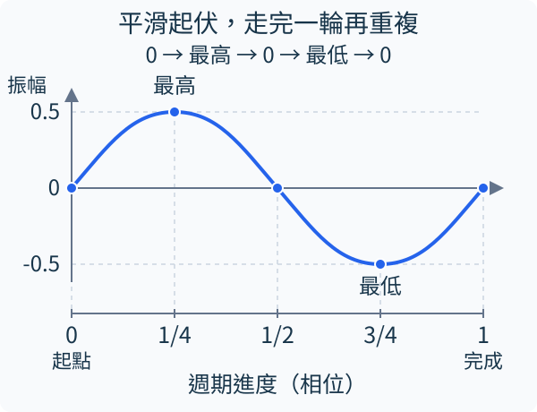
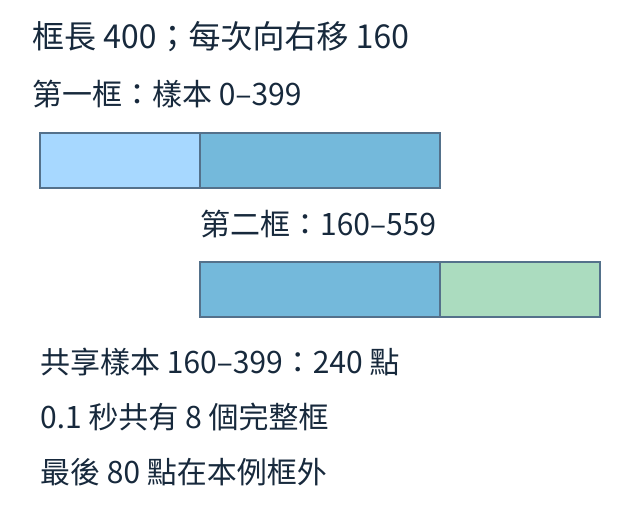
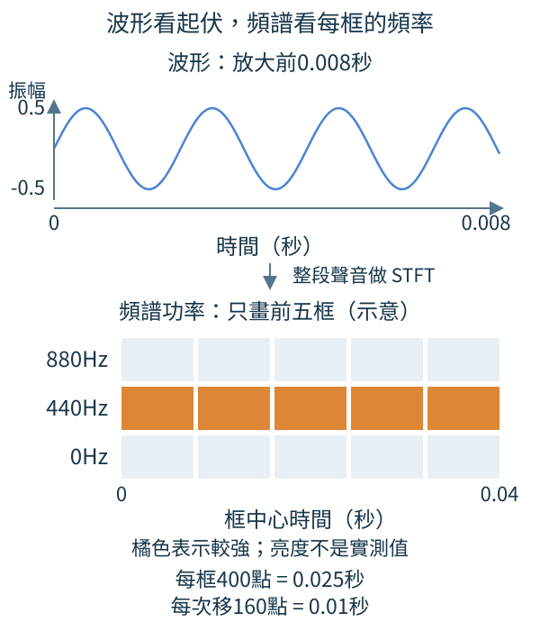
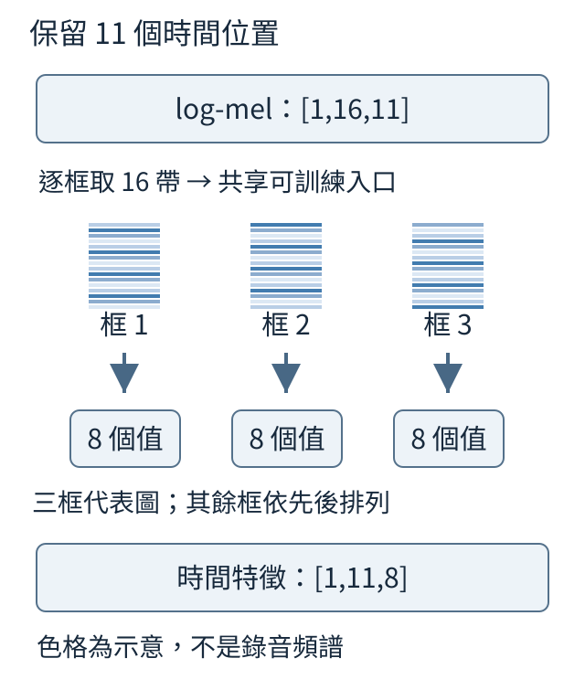
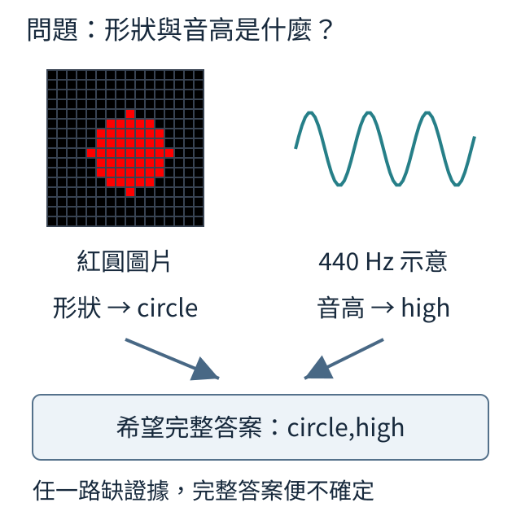
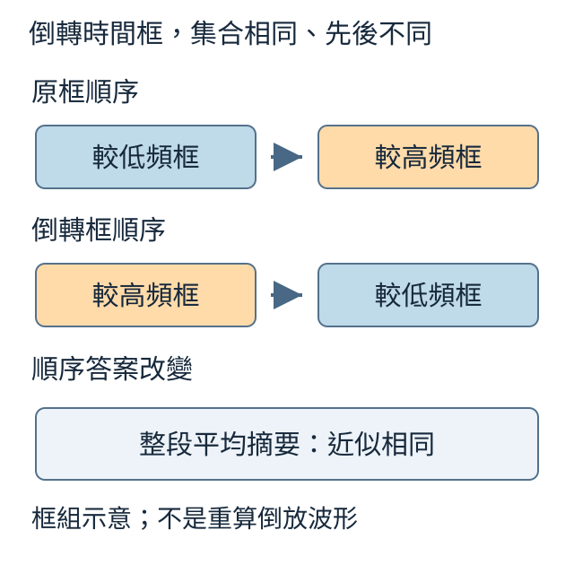
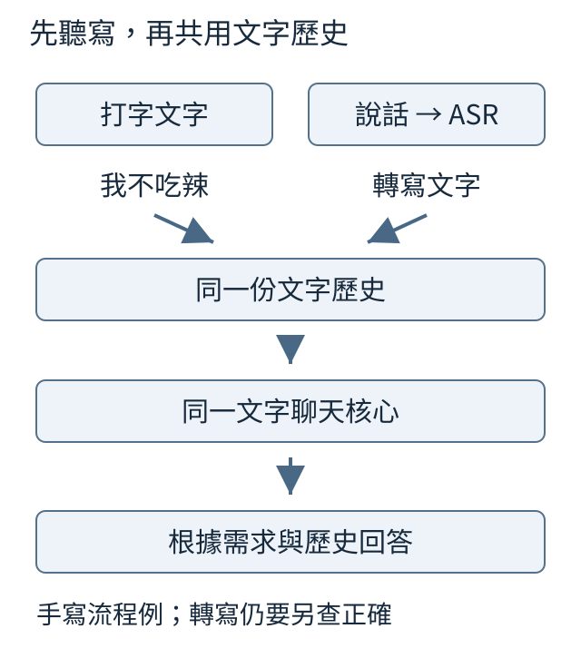
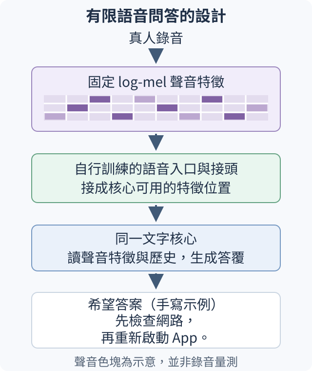
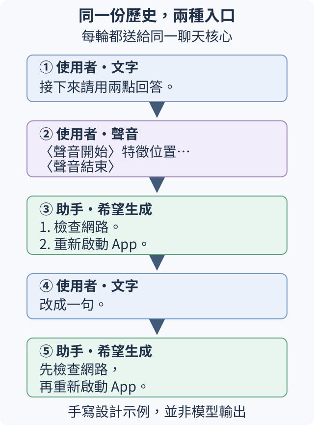

# 第 12 章：聲音特徵、有限語音意圖與共享對話

聲音先是一串帶時間的振幅，再經固定頻譜處理，交給自行訓練的入口。本章先用合成單音看清資料流與控制；後半段分開聽寫與需求回答，最後讓真人短句的有限意圖和打字共用同一段對話。

## 12.1 一段聲音，怎麼存成一串數字？

先看一個振幅 0.5、每秒振動 440 次的合成單音。它不是人說的句子；希望用一串數字表示聲音隨時間的變化，並分清一個數字與一個完整週期。



聲音的波形在這裡是一維 tensor，每個位置是一個時間點的振幅。正負表示相對零點的方向，不是高低音標籤。圖中上升到 0.5、下降到 −0.5 再回到起點是一個週期；週期重複得越快，這種單音的頻率越高。

```python
from tiny_perceptron.multimodal import tone

wave = tone(440.0)
print("樣本形狀", tuple(wave.shape))
print("前三個值", [round(v, 3) for v in wave[:3].tolist()])
print("最小最大", round(wave.min().item(), 2), round(wave.max().item(), 2))
```

`tone(440.0)` 預設每秒取 16000 個點、長 0.1 秒，產生 1600 個樣本。前三個數約為 `[0.0,0.086,0.169]`，最小與最大約 −0.5、0.5。440 Hz 表示每秒 440 個週期，不能把第 440 個樣本當作 440 Hz 的意思。

振幅與頻率是不同變化。把振幅倍增，數字起伏變大而週期不變；把頻率倍增，同樣時間內起伏更密。真實聲音通常混合許多頻率，波形不像本圖這麼規則，因此不能只找一個最高點就辨認說了什麼。

批次處理可增加軸，將兩段等長聲音排成 `[2,1600]`。若錄音長度不同，需要另外約定補齊與有效長度，補出的零不能算作真人沉默的證據。練習把呼叫改成 `wave = tone(440.0, seconds=0.2)`，其中 `seconds` 指時長；預期樣本數 3200，頻率仍是 440 Hz，不表示音高變成兩倍。

<details>
<summary>回顧與查證</summary>

可回顧：[W.3的一維tensor](../first-steps.md#W.3)。

</details>

## 12.2 同樣 1600 個數字，為什麼可能長短不同？

拿到 1600 個聲音樣本，還不能知道錄了多久。若每秒取 16000 點，它長 0.1 秒；每秒取 8000 點，則長 0.2 秒。這個「每秒多少點」叫取樣率，是讀懂時間軸的必要資料。

```python
samples = 1600
for rate in [16000, 8000]:
    print("取樣率", rate, "時長", samples / rate, "奈奎斯特界線", rate / 2, "440Hz每週期樣本", round(rate / 440, 2))
```

程式並列兩種取樣率。時長是 `樣本數／取樣率`；440 Hz 每週期的樣本數是 `取樣率／440`，約 36.36 與 18.18。後者是假設兩份錄音各自正確記錄同一個 440 Hz 聲音，並不是把原陣列改個標籤。

若原本按 16000 Hz 記錄的數字，直接以 8000 Hz 播放，同樣週期會花兩倍時間，440 Hz 聽起來變 220 Hz。正確改取樣率需要重取樣：先控制超過新界線的成分，再在新的時間點計算數值，讓時長與原聲音的音高保持相應關係。

取樣率的一半稱奈奎斯特界線：16000 Hz 對應 8000 Hz，8000 Hz 對應 4000 Hz。理想條件下，高於界線的變化不能由這串樣本唯一重建，可能混成較低頻率。增加模型大小不能把已混在一起的資訊可靠分開。

真人錄音資料因此要先核對取樣率與振幅尺度，不能只看副檔名。例如將 4591 點的 8000 Hz 聲音重取樣成 9182 點的 16000 Hz 聲音，兩者時長仍為 0.573875 秒。完整讀檔格式和既有數字錄音紀錄放在補充，這裡先掌握時間換算。

練習：8000 點、8000 Hz 是 1 秒；若改為 16000 Hz 並維持同一秒，應有多少點？答案 16000，不能只修改檔案中的 rate。

<details>
<summary>回顧與查證</summary>

可回顧：[12.1的波形樣本](12.md#12.1)。

原實驗的資料切分、更新設定與逐題結果見[既有實報](../../docs/course-experiments/results/real_modal.json)；重做入口見[實驗說明](../../docs/course-experiments/README.md)。這是上述有限任務的歷史紀錄。

</details>

## 12.3 短聲音如何分成重疊的時間框？

一段 1600 點、0.1 秒的單音，想分段看局部變化。取前 400 點作第一框，往右移 160 點再取 400 點作第二框；相鄰兩框重疊 240 點，同一段聲音會在兩框中出現。



```python
import torch
from tiny_perceptron.multimodal import tone

wave = tone()
frames = wave.unfold(0, 400, 160)
print("框形狀", tuple(frames.shape))
print("框秒數", 400 / 16000, "移動秒數", 160 / 16000)
print("重疊相同", torch.equal(frames[0, 160:], frames[1, :240]))
```

`unfold(0,400,160)` 沿唯一的時間軸取窗，不改振幅。輸出 `(8,400)`，每框 400／16000＝0.025 秒，框起點每次前進 0.01 秒。比較第一框後 240 點與第二框前 240 點，印 True，直接核對它們來自同一段原資料。

八框起點為 0、160、…、1120；最後一框到 1519。末尾 80 點不足再放一個完整框，這個 `unfold` 例子便留在框外。若補零或先在兩端加資料，框數會不同；後面的頻譜函式有自己的邊界約定，不能只看「400、160」就以為所有框數必相同。

短框方便表示局部頻率，但框太短時很難分清接近的頻率；框太長又把較長時間混在一起。重疊能讓起點落在框邊的聲音仍出現在鄰框中，代價是更多計算，不是新增一份獨立錄音。

資料拆分也要守住這點：同一錄音的所有時間框應跟原錄音在同一分組，不能把第一框訓練、第二框測試，便稱測到新聲音。練習把步長改為 400，完整框數應為 4 且沒有重疊。

<details>
<summary>回顧與查證</summary>

可回顧：[12.2樣本到時間的換算](12.md#12.2)。

</details>

## 12.4 截取時間框時，為什麼要讓兩端變小？

上一節取出的 400 點不一定剛好在波形相同的地方起止。頻率計算若把這一框當作可重複的一段，首尾接起來可能突然跳一下。頻率計算也會把這個接點跳變算進去，帶出原本不是單音本身的額外頻率成分，讓能量分散。

可以讓首尾數字逐漸接近零、中間保留較大比重。這排乘數叫窗函數；本例用 Hann 窗，每個波形樣本乘所在位置的權重。

```python
import torch
from tiny_perceptron.multimodal import tone

frame = tone()[:400]
window = torch.hann_window(400)
weighted = frame * window
print("起點權重", window[0].item(), "中間權重", window[200].item())
print("最後權重", round(window[-1].item(), 6))
print("原能量", round(frame.square().sum().item(), 2))
print("加窗能量", round(weighted.square().sum().item(), 2))
```

起點權重為 0，中間約 1，最後約 0.000062。PyTorch 預設採供週期延續使用的版本，所以最後一點很接近零卻不是正好零。若改用包含兩端的對稱版本，公式與最後一點會稍有不同。

原能量是振幅平方後相加，約 50；乘窗後約 18.75。這只是同一框經過加權，並沒有模型學習，也不表示音源變小了。加窗緩和的是首尾跳變帶出的額外頻率成分，並不表示所有能量都會集中成一點。另一個代價是主要頻率附近的峰本身會變寬：若把各頻率的能量畫成高低，主峰是主要頻率附近最高的一帶；這一帶變寬，兩個較近頻率的峰就可能更難分開。

窗長 400、取樣率 16000 仍表示 25 毫秒，乘窗不更動時間點。後續若要比較不同錄音的能量，必須使用一致的窗與正規化約定，不能把不同配方的數字直接當成同一尺度。

練習將 400 個權重都設成 1：weighted 應等於 frame、兩個能量相同。再說明這個控制保留了振幅，卻沒有緩和首尾接合的不連續。

<details>
<summary>回顧與查證</summary>

可回顧：[12.3時間框](12.md#12.3)。

</details>

## 12.5 怎麼找出一段單音的主要頻率？

仍用 440 Hz 單音，這次長 0.2 秒。希望每個短時間框都能指出「哪些頻率較強」，並核對最強的格子是否對應 440 Hz。把時間框分解成各頻率的計算叫短時傅立葉轉換，簡寫 STFT。



```python
import torch
from tiny_perceptron.multimodal import tone

wave = tone(440.0, seconds=0.2)
spectrum = torch.stft(wave, 400, 160, window=torch.hann_window(400), return_complex=True)
power = spectrum.abs().square()
peak = power.mean(-1).argmax().item()
print("頻率格、時間框", tuple(power.shape))
print("最高格編號", peak, "對應Hz", peak * 16000 / 400)
```

400 點一框、每次移 160 點，輸出功率 `(201,21)`：201 個非負頻率格、21 個時間框。函式預設在邊界補資料，使框中心落在相應時間點；所以它與直接 `unfold` 的完整框數不同。這裡 3200 點得到 21 框，不是沒有補齊的 18 框。

STFT 結果是複數，含頻率成分的大小與相位。`abs()` 取大小，再平方得到功率；例如 `3+4j` 的大小是 5，功率是 25。圖用功率亮度表達，不直接顯示相位。

頻率格間隔為 `16000／400＝40 Hz`，第 11 格對應 440 Hz。把各框功率平均後找最大，程式印出 11 與 440.0，符合這個單音的來源。真人語音含多種變化，最強一格只能描述當下能量，不能當成某個字的編號。

頻譜也不是音高列表：圖上不同頻率可能同時亮起。練習改成 480 Hz 單音，預期最大格約 12；若用 450 Hz，則不能要求它剛好落在整格，附近格會一起分到能量。

<details>
<summary>回顧與查證</summary>

可回顧：[12.2取樣率](12.md#12.2)、[12.3時間框](12.md#12.3)、[12.4加窗](12.md#12.4)。

</details>

## 12.6 相鄰頻率怎麼合成少量頻帶？

頻譜每框有 201 個頻率格，想用 16 個較寬區段表示能量。讓每個區段用一排非負權重加總，本課配方中間權重最大、兩側逐漸降至0，畫成三角形；相鄰三角形可以重疊，共同接收同一頻率。


這種依 mel 尺度配置的頻帶，低頻安排得較密、高頻較疏。常用換算為 `mel＝2595×log10(1＋f／700)`；0、700、2100 Hz 約為 0、781、1562 mel。Hz 間隔越往上越大，mel 間隔仍可相同。

程式先用全 1 的示範功率表，代表 201 個頻率格、3 個時間框，核對合成後的形狀與權重是否非負。

```python
import torch
from tiny_perceptron.multimodal import mel_filter_bank

bank = mel_filter_bank(bands=16)
power = torch.ones(201, 3)
mel_power = bank @ power
print("權重表", tuple(bank.shape))
print("合成後", tuple(mel_power.shape))
print("權重非負", bool((bank >= 0).all()))
```

權重表 `(16,201)`，每列負責一個頻帶；功率表 `(201,3)` 表示三個時間框。矩陣相乘得到 `(16,3)`，時間框沒有被平均掉。權重非負印 True，說明本配方以加權相加組合功率。

手算只取三格功率 `[4,2,1]`：若第一帶權重 `[1,0.5,0]`，得到 5；第二帶權重 `[0,0.5,1]`，得到 2。同一個中間格 2 各以一半貢獻，兩帶便有重疊。這個小算例展示相乘，不是實際 16 帶的權重值。

頻帶變少會合併差異，因此不能由 16 帶唯一還原所有 201 格。mel 配方是固定的聲音前處理；後面自行訓練的入口才學如何利用它答題。練習把 bands 改成 32，預期權重表 `(32,201)`、輸出 `(32,3)`，並保持三個時間框。

<details>
<summary>回顧與查證</summary>

可回顧：[12.5頻率格與功率](12.md#12.5)、[W.5加權矩陣](../first-steps.md#W.5)。

</details>

## 12.7 功率相差很大，取 log 有什麼效果？

四個頻譜格的功率為 `[0,10⁻¹⁰,10⁻⁴,1]`。若直接用同一亮度尺度，前三格可能幾乎都看不見。取自然對數能壓縮跨度，但零不能直接取 log，所以先設最小值 10⁻⁸。

```python
import torch

power = torch.tensor([0.0, 1e-10, 1e-4, 1.0])
floor = 1e-8
compressed = power.clamp(min=floor).log()
scaled = (4 * power).clamp(min=floor).log()
print("log功率", [round(x, 2) for x in compressed.tolist()])
print("放大後差", [round(x, 2) for x in (scaled - compressed).tolist()])
print("皆為有限值", bool(compressed.isfinite().all()))
```

結果約為 `[-18.42,-18.42,-9.21,0]`，全都是有限值。前兩格低於下限，都先變成 10⁻⁸；這些差異已被捨棄。負值只表示原功率小於 1，不表示能量為負。

功率乘 4 後，未被下限夾住的兩格增加 `ln(4)≈1.39`；前兩格仍在下限，差為 0。乘法變成加法，有助於讓大尺度變化比較平緩。若波形振幅乘 2，功率才乘 4，不能混用振幅與功率的倍數。

把頻率功率合成 mel 頻帶後再取 log，就得到 log-mel 特徵。這是固定算式整理聲音，而不是成熟辨識模型提供的隱藏答案。它仍保留每一時間框，以便後續入口學會利用局部變化。

比較不同錄音時，要使用相同的下限。若後續還會調整特徵的數值尺度（正規化），也要對各段採用同一套調整規則，尤其比較安靜片段時。過大的下限會讓不同弱聲音得到相同數值。練習把下限改為 10⁻¹²，零仍需替代，但 10⁻¹⁰ 不再被夾住。說明「避免無限值」與「保留弱聲音差異」為何需要同時考慮。

<details>
<summary>回顧與查證</summary>

可回顧：[W.4機率與log](../first-steps.md#W.4)、[12.6的mel功率](12.md#12.6)。

</details>

## 12.8 每個時間框，如何變成一條聲音特徵？

一段 0.1 秒單音經 log-mel 處理，得到 16 個頻帶、11 個時間框。現在希望每框用 8 個數字表示，依先後排成 11 條特徵，供後面的模型逐位置讀取；這一步不把整段平均成一個數字。



```python
from tiny_perceptron.multimodal import tone, log_mel, AudioEncoder

wave = tone()[None]
spectrogram = log_mel(wave)
encoder = AudioEncoder(bands=16, width=8)
features = encoder(wave)
print("頻譜", tuple(spectrogram.shape))
print("時間特徵", tuple(features.shape))
```

`tone()` 先產生一維波形；`[None]` 在最前面新增大小為 1 的軸，讓輸入表示一筆聲音。獨立算出的 `spectrogram` 用來列印並對照形狀；`encoder(wave)` 接收波形後，會在內部先算 log-mel，再調軸並套用逐框入口。程式印出頻譜 `(1,16,11)`、時間特徵 `(1,11,8)`。第一軸的 1 是一段聲音；頻譜表先按「頻帶、時間」保存，入口轉成「時間、頻帶」，讓同一組可訓練配方對每框的 16 個值產生 8 個輸出。本入口先做線性投影，再經正規化、另一線性層與非線性函數GELU，這些運算都保持時間位置。11 個位置仍代表時間框，不是 11 個字。

16 轉 8 是每框的摘要，與把 11 框全部平均掉不同。前者仍能表示哪種變化先來；後者可能只留整體多寡。配方共享表示每框使用同一入口，不表示隨機初始化的 8 個數字已經認得聲音。

入口要從任務材料學出有用特徵。單音任務可以教「頻率高於 300 Hz 回 high，否則 low」；真人短句的有限需求則需要真人錄音與需求標註。兩種答案不是同一件事：前者只驗證單音高低，不能據此宣稱聽懂中文問句。

下一節先用單音檢查接到文字核心後的梯度通路；[12.15](12.md#12.15) 再設計真人短句意圖入口。這樣頻譜轉特徵是共同機制，各任務仍有各自材料與判準。

練習只把入口 width 改成 12，時間特徵應為 `(1,11,12)`，原本 log-mel 頻帶仍為 16。若想用 32 帶，前處理與入口的 bands 都要一致，不能只改一邊。

<details>
<summary>回顧與查證</summary>

可回顧：[12.7的log-mel](12.md#12.7)、[10.3的共享線性變換](10.md#10.3)、[W.3軸順序](../first-steps.md#W.3)。

原實驗的資料切分、更新設定與逐題結果見[既有實報](../../docs/course-experiments/results/encoders.json)；重做入口見[實驗說明](../../docs/course-experiments/README.md)。這是上述有限任務的歷史紀錄。

</details>

## 12.9 聲音特徵怎麼接進文字模型的回答位置？

用 440 Hz 單音做一題：規則是頻率高於 300 Hz 回 `high`，否則回 `low`，所以本題希望答案 `high`。先檢查聲音入口能否接到文字模型，讓答案誤差沿這條路徑傳回。

文字序列中放一個 `<audio>` 位置，實際計算時以聲音的 11 條特徵取代它；接頭把聲音特徵寬度轉成文字核心的寬度。這個標記提供放入聲音的位置，裡面沒有預先寫 `high`。

```python
import torch
from tiny_perceptron.data import ByteTokenizer
from tiny_perceptron.model import TinyLM, ModelConfig, masked_loss
from tiny_perceptron.multimodal import MultiModalLM, tone

torch.manual_seed(0)
tok = ByteTokenizer()
model = MultiModalLM(TinyLM(ModelConfig(width=8)))
prefix = [tok.bos_id, tok.user_id, tok.audio_id, tok.eos_id, tok.assistant_id]
answer = tok.encode("high") + [tok.eos_id]
ids = torch.tensor(prefix + answer)
labels = torch.tensor([-100] * len(prefix) + answer)
out = model(ids, labels, waveform=tone(440))
loss = masked_loss(out["logits"], out["labels"])
loss.backward()
print("分數形狀", tuple(out["logits"].shape))
print("聲音接頭收到梯度", model.audio_projector.weight.grad.norm().item() > 0)
```

原序列有 5 個前綴位置、`high` 的 4 個 ASCII bytes 與 EOS，共 10 個位置。聲音標記 1 個位置擴成 11 個，成為 20；再為下一個 token 的預測移位，分數形狀是 `(1,19,264)`。264 是 tokenizer 詞表大小，不是聲音類別數。

前綴標籤為 −100，聲音插入位置也不計答案損失；只有四個字母與 EOS 是有效目標。計算訓練損失時放入正確前文，和真正生成時只能拿自己的前一個輸出不同。

`backward()` 後接頭梯度大於零，表示損失與聲音路徑相連；本程式沒有 optimizer step，沒有把這題教會模型。既有單音訓練另測 14 題，生成答案對 11/14，錯誤集中在邊界與時長變化；完整配方放補充，不與這段梯度示範混稱成果。

練習把頻率改成 200，答案與有效目標應一起改成 `low`。接通相同通路之後，還要用換聲音控制確認模型不是固定回 high，這是下一節的問題。

<details>
<summary>回顧與查證</summary>

可回顧：[12.8時間特徵](12.md#12.8)、[10.7展開與標籤錯位](10.md#10.7)、[11.3梯度檢查](11.md#11.3)。

原實驗的資料切分、更新設定與逐題結果見[既有實報](../../docs/course-experiments/results/audio.json)；重做入口見[實驗說明](../../docs/course-experiments/README.md)。這是上述有限任務的歷史紀錄。

</details>

## 12.10 怎樣判斷回答真的受聲音影響？

四題單音為 200、220、440、660 Hz，規則仍是高於 300 Hz 回 high。答案依序為 low、low、high、high。假如完全不聽，每題都回 high，也能對 2/4；有分數不等於有使用聲音。

```python
frequencies = [200, 220, 440, 660]
truth = ["high" if f > 300 else "low" for f in frequencies]
no_audio = ["high"] * len(frequencies)
accuracy = sum(a == b for a, b in zip(truth, no_audio)) / len(truth)
print("頻率", frequencies)
print("標準答案", truth)
print("不聽聲音的固定猜測", accuracy)
```

這個固定答案對照印出 0.5。測試集若高低音不平衡，基準也跟著變。既有 14 題中低音 8 題、高音 6 題，固定回 low 可對 8/14；必須報分母與各類數量，才能理解模型的 11/14。

接著固定提問，替換聲音。例如 200 Hz 應回 low，換成 310 Hz 應回 high。替換後要用新聲音的答案判正確；若繼續拿舊答案比，看到答覆改變只能說它受替換影響，不能直接說答錯。

既有試驗在原聲音對 11/14，全部改成靜音時對 6/14、都回 high。靜音沒有可判斷的單音頻率，所以這裡的分數只是與原題答案相比的控制，不是「靜音本應 high」的規則。

再交換高低來源，按舊答案得 3/14，按新聲音答案仍 11/14。這支持聲音被利用，而且說明答案變化與正確性要分開看；替換的 14 題有 2 題新舊標籤未變，不能要求所有題都一定翻轉。它仍只涉及合成單音，不推出真人需求辨識。

練習若十題有九題 low，固定回 low 的基準是多少？再列出「原音、替音按新答案、靜音」三個控制各能回答什麼。安排訓練組與留出檢查組時，以同一原聲音及由它製作的變體為一組；原聲音若放留出，變體也都留出，避免把練習音訊的改版當作陌生聲音。

<details>
<summary>回顧與查證</summary>

可回顧：[12.9聲音訓練接口](12.md#12.9)、[11.8替圖檢驗](11.md#11.8)。

原實驗的資料切分、更新設定與逐題結果見[既有實報](../../docs/course-experiments/results/audio.json)；重做入口見[實驗說明](../../docs/course-experiments/README.md)。這是上述有限任務的歷史紀錄。

</details>

## 12.11 把聲音轉成文字後，哪些問題仍答不了？

兩段聲音都說「你好」，一段低音、一段高音。若問題是「說了什麼」，同樣轉寫「你好」可以回答；若問題是「哪段音高較高」，這兩個相同字串就不足以區分。

```python
examples = [
    {"transcript": "你好", "pitch": "low"},
    {"transcript": "你好", "pitch": "high"},
]
print("轉寫相同", examples[0]["transcript"] == examples[1]["transcript"])
print("音高相同", examples[0]["pitch"] == examples[1]["pitch"])
for row in examples:
    print("只看轉寫", row["transcript"], "實際標籤", row["pitch"])
```

這是手寫的兩筆條件，印出轉寫相同 True、音高相同 False，沒有執行聽寫模型。只收到同一字串的確定性回答規則，不能根據字串本身，穩定回出兩個不同音高標籤。

自動語音辨識，英文縮寫 ASR，主要把語音轉成文字。文字入口適合「使用者說的內容」需要文字操作的任務；純文字轉寫通常不完整保留語氣、音高、先後事件與非語音聲響。若轉寫另帶時間戳、說話者或音高資料，輸入條件已經不同，不能再說它只用了相同兩個字。

直接聲音特徵能提供這些未轉成字的線索，但模型仍要用相應材料學會判斷。多接一條入口不保證語氣辨識；也不表示所有任務都應繞過 ASR。若只需把短句記成文字，先聽寫再交文字核心是清楚的分工。

練習將問題改成「請照抄這段話」，兩筆相同轉寫是否足夠？再改成「前半段比後半段高嗎」，列出純文字遺失的條件。下一節把圖與聲音一起用時，同樣先問答案到底需要哪條線索。

<details>
<summary>回顧與查證</summary>

可回顧：[12.1頻率與振幅](12.md#12.1)、[12.8聲音特徵](12.md#12.8)。

原實驗的資料切分、更新設定與逐題結果見[既有實報](../../docs/course-experiments/results/audio.json)；重做入口見[實驗說明](../../docs/course-experiments/README.md)。這是上述有限任務的歷史紀錄。

</details>

## 12.12 一個答案同時需要圖與聲音，怎麼檢查兩條線索？

圖片是紅圓，聲音是 440 Hz 單音。提問「形狀與音高是什麼」，希望回 `circle,high`：circle 由圖決定，high 由高於 300 Hz 的聲音規則決定。單看任一路都不足以確定完整答案。



先做一次不更新參數的 `backward`，檢查答案損失是否連到圖、聲音兩個接頭；這一步尚未測試模型是否答對。

```python
import torch
from tiny_perceptron.data import ByteTokenizer
from tiny_perceptron.model import TinyLM, ModelConfig, masked_loss
from tiny_perceptron.multimodal import MultiModalLM, scene, tone

torch.manual_seed(0)
tok = ByteTokenizer()
model = MultiModalLM(TinyLM(ModelConfig(width=8)))
prefix = [tok.bos_id, tok.user_id, tok.image_id, tok.audio_id, tok.eos_id, tok.assistant_id]
answer = tok.encode("circle,high") + [tok.eos_id]
ids = torch.tensor(prefix + answer)
labels = torch.tensor([-100] * len(prefix) + answer)
out = model(ids, labels, image=scene("red", "circle"), waveform=tone(440))
masked_loss(out["logits"], out["labels"]).backward()
print("圖路徑梯度", model.image_projector.weight.grad.norm().item() > 0)
print("音路徑梯度", model.audio_projector.weight.grad.norm().item() > 0)
```

前綴有 `<image>`、`<audio>` 兩個位置，各以自己的特徵序列替換，再交同一文字核心。圖接頭、音接頭都收到梯度印 True，證明這個答案損失連到兩條路徑；程式沒有更新，不能由此判斷是否已會同時辨識。

材料也要交叉配對：圓低、圓高、方低、方高都出現。如果圓永遠配高音，模型可能只看圖就回出兩段答案。測試時固定圖換聲，只有音高部分應隨新聲改；固定聲換圖，只有形狀部分應隨新圖改。

既有受控合成試驗有 12 題，以下按原題答案評分。拿掉一路後，它負責的部分退回 6/12，而另一路仍對 12/12：

| 輸入條件 | 形狀正確 | 音高正確 | 完整答案正確 |
| --- | ---: | ---: | ---: |
| 圖與聲音都有 | 12/12 | 12/12 | 12/12 |
| 空白圖，聲音保留 | 6/12 | 12/12 | 6/12 |
| 圖保留，聲音靜音 | 12/12 | 6/12 | 6/12 |
| 空白圖加靜音 | 6/12 | 6/12 | 3/12 |

替換一路後按新材料重標，完整答案亦對 12/12；每對都跟著該部分改，支持這個有限控制使用兩路。驗證集只有 8/12，且部分頻率曾用於聲音入口預訓練，所以不能把最後表格宣稱為所有線索都完全未見的測試。

練習指出空白圖/靜音行的分數，為何不是「空白圖應有某形狀」或「靜音應 high」？它們量的是拿掉證據後，模型與原題答案的關係。

<details>
<summary>回顧與查證</summary>

可回顧：[10.7圖片展開](10.md#10.7)、[12.9聲音展開](12.md#12.9)、[11.8按規則替換](11.md#11.8)。

原實驗的資料切分、更新設定與逐題結果見[既有實報](../../docs/course-experiments/results/joint.json)；重做入口見[實驗說明](../../docs/course-experiments/README.md)。這是上述有限任務的歷史紀錄。

</details>

## 12.13 整段平均後，還分得出哪個聲音先來嗎？

先有 440 Hz、再有 880 Hz，與把兩段順序交換不同；「哪段先來」的答案會變。先用已提取的時間框看這個問題：把框序列倒過來，框的集合不變，先後卻不同。



```python
from tiny_perceptron.natural_concepts import audio_order_report

report = audio_order_report()
print("時間框與頻帶", report["time_frames"], report["bands"])
print("先後序列相同", report["same_time_sequence"])
print("平均摘要近似相同", report["same_mean_with_roundoff_tolerance"])
```

工具將兩個合成單音串接後算 log-mel，得到 21 個時間框、16 個頻帶；再倒轉這份特徵的時間軸。序列相同印 False，平均摘要在容許浮點誤差下相同 True。這裡倒的是已取得的特徵框，不是重新合成另一段真人錄音，也不聲稱倒放波形的 STFT 逐格相同。

平均不管框在哪個位置，倒轉前後便可得到同一摘要；它可能保留兩種頻率的總量，卻失去「先低後高」的順序。若回答需要先後，入口與後續模型要保留時間位置，並接受相關任務的教學材料。

聽寫一句話更依賴有序聲音：同一批音節換位置，字串可能不同；回答需求則不一定要求逐字照抄。兩者都可能需要時間線索，但目標不同，不能以單音順序反例直接宣稱會聽寫，或以聽寫錯字直接判定需求答案必錯。

練習把問題改成「是否出現過較高的單音」，平均摘要是否可能足以幫忙？再改成「較高的先來嗎」，指出缺少的條件。接下來先介紹轉成文字的聊天路線，再設計保留聲音特徵的有限意圖路線。

<details>
<summary>回顧與查證</summary>

可回顧：[12.8沿時間保留特徵](12.md#12.8)、[12.11先轉文字的取捨](12.md#12.11)。

</details>

## 12.14 先聽寫成文字，怎麼共用聊天歷史？

使用者打字「我不吃辣」，或說出同樣需求。若採先聽寫的路線，希望兩種入口都把文字放進同一段對話，再由同一個聊天核心根據這個條件推薦餐點。



自動語音辨識 ASR 負責聲音轉文字，聊天核心負責根據文字與歷史回答。共用核心不等於每段文字都正確；要先分別檢查轉寫與答案。

下面手寫一對轉寫與回覆，讓判準分開看：正確文字是「我不吃辣」，假設轉寫為「我不吃拉」，兩路回答都填「選清淡的湯麵。」。

```python
from tiny_perceptron.natural_concepts import speech_stages

report = speech_stages("我不吃辣", "我不吃拉", "選清淡的湯麵。", "選清淡的湯麵。")
print("聽寫字元錯誤率", report["transcription"]["cer"])
print("兩路回答完全相同", report["answers_identical"])
print("相同是否足以證明正確", report["answers_correct"])
```

「我、不、吃、辣」共四字，有一字替換，聽寫 CER 為 1/4＝0.25。兩路回答相同印 True，但正確性欄是 None，因為函式沒有檢查湯麵配方或是否符合使用者條件。相同與正確仍是不同問題。

若聽寫把「不要加辣」變成「要加辣」，文字核心收到的條件已改變，無法只靠相同聊天程式補救。要報轉寫錯誤，也要用獨立答案判準檢查需求是否被滿足；保留文字歷史可讓下一輪追問「還有別的嗎」沿用已記錄條件。

這種共用歷史可以搭配自行訓練的有限聽寫入口，或第20章成熟 ASR 延伸。接下來的[真人意圖路線](12.md#12.15) 不要求先產生逐字稿，而把聲音特徵直接交給同一聊天核心；[12.16](12.md#12.16) 會讓這些聲音位置也留在跨入口的歷史中。

練習把轉寫改為「我不吃辣」，CER 應為 0；若兩路仍回相同不合條件的餐點，答案正確性仍要另判。

<details>
<summary>例子與延伸的界線</summary>

本節轉寫與回覆是手寫判準示例，圖解是流程示意。沒有以某段錄音或 ASR 實際輸出作證。第20章當前沿用原底座、未啟用微調修正，成熟模型能力另列延伸，不作自行訓練主線的驗收。

</details>

<details>
<summary>回顧與查證</summary>

可回顧：[12.13聽寫與回答的分工](12.md#12.13)、[7.1對話表示](07.md#7.1)、[12.11](12.md#12.11)。

</details>

## 12.15 幾種真人語音問題，如何從零學會回應？

有人說「我的銀行 App 打不開」，我們希望助手回一個短提示，例如「先檢查網路，再重新啟動 App。」這裡想教的是聽懂幾種需求後回應，不要求把任何人說的每個字都完整抄下來。

適合這個方向的公開材料是 MInDS-14 的中文真人錄音。它收集少數銀行情境的口語需求：參與者看到意圖說明與例句，再自己說出新的問法。「意圖」在這裡就是需求種類，例如更新地址、App 出問題、卡片無法使用。本節用這三種來設計短而一般的回覆；助手沒有連接銀行帳戶，不能回報未知餘額或完成帳戶操作。

聲音怎麼接到文字回答？先沿用前面學過的 log-mel 特徵：把錄音切成短時間段，記錄各頻帶的強弱，再做固定轉換，得到按時間排列的一列數字。這一步整理聲音的變化，沒有寫出「App」兩個字，也沒有決定應回哪一句話。



接著，語音入口使用可調參數，從這列聲音數字算出需求線索。接頭把線索轉成文字核心能接收的特徵位置，也就是放進模型序列中的一組數字表示。核心讀到這些位置與對話歷史，生成中文答覆。

若要從零建立這條路，語音入口、接頭與文字核心的權重都從隨機初值開始，並需要各自的訓練安排。固定 log-mel 計算可以使用一般工具，因為它不是已經學會中文的神經模型。辨識需求與產生答覆的部分，則由這些自行訓練的元件處理。

訓練材料需要把錄音與這個任務的正確短答配在一起。MInDS-14 提供需求種類，沒有提供我們要教的客服答覆，因此答案要另外撰寫、核對。可以先讓文字核心學這幾種需求的回應，再教語音入口把對應線索送進核心；訓練時利用答案比較預測、調整參數，推論時不把標準答案一起送進去。

要看是否使用了聲音，可以保留相同背景與提問方式，改用另一類需求的錄音，檢查回覆主題是否跟著改變。還要留出原始錄音與新問法：同一段聲音的裁切或加噪版本仍是同一素材家族，不能分散後算成陌生錄音。如果所有問題都得到「請聯絡客服」，雖然語句合理，也不足以說明模型分清了這三種需求。

這和前一節的聽寫路線有不同目標。ASR 要回答「他說了哪些字」；此處直接問答要回答「這個已教過的需求，該怎麼回應」。沒有生成逐字稿，不能稱作通用 ASR；能分清三種需求，也不推出能聽懂新數字、物件名或任意中文問題。

聲音特徵經過自行訓練的入口，可以成為同一文字核心的另一種輸入。下一節只增加對話歷史，看看文字與聲音如何接續同一段需求。

<details>
<summary>公開材料、方法與例子的性質</summary>

PolyAI 的[MInDS-14 官方資料卡](https://huggingface.co/datasets/PolyAI/minds14/blob/40ce77cb32a384e4d50a568e1ec39ac804019d33/README.md)標示 CC BY 4.0，中文有 502 條，各類可用短句仍需核對；沒有公開說話者 ID，不能據此宣稱跨說話者驗收。[原論文](https://arxiv.org/abs/2104.08524)說明真人口語收集，也說明其實驗使用現成 ASR 與預訓練文字編碼器。本節借用的是合法來源與有限需求設計，不引用那些成績當從零訓練的證據。

本文沒有讀取、播放或轉寫某段公開錄音。問句、希望答案與聲音色塊都是作者設計示例。直接語音需求辨識可參考[端到端語音理解研究](https://arxiv.org/abs/1904.03670)，但該研究涉及預訓練，不能拿其結果保證本課隨機初值模型的能力。

</details>

## 12.16 說話和打字，如何保留同一段對話？

先打字說「接下來請用兩點回答」，接著用語音提出「我的銀行 App 打不開」這個需求，再打字說「改成一句」。我們希望中間的回覆分成兩點，最後的回覆縮成一句，而且仍然在回應 App 的問題。換輸入方式，不應把原先的格式要求或談到的主題清掉。



圖中對話是手寫設計例。開頭的語音問句供讀者理解需求；模型訊息保留聲音特徵，不把旁註文字當逐字稿送入。

上一節讓自行訓練的語音入口，把聲音變成核心能接收的一組特徵位置。這一節沿用它，新增的是「把各輪保存在同一份歷史」。文字那輪有使用者角色和文字位置；聲音那輪也有使用者角色，內容則是帶起訖標記的聲音特徵位置。起訖標記告訴模型這段輸入從哪裡開始、到哪裡結束，不提供它的文字答案。

圖中的「聲音開始／聲音結束」是教學標記，不規定實作一定使用這些字面名稱。在真正的模型輸入中，特徵位置放的是語音入口算出的數字，並非把「聲音特徵」四個字打給模型。這和圖片特徵接進序列的觀念相同：入口不同，核心接收與利用的仍是一段排列好的輸入。

處理語音那輪時，核心應一起讀到先前的文字要求「用兩點回答」。所以希望答覆是「1. 檢查網路。2. 重新啟動 App。」這段助手答覆也要加入歷史，下一輪才知道自己剛剛說過什麼。當使用者再說「改成一句」，核心收到的是整段已保留的對話，加上這個新要求，可以知道「改」的是前一個答覆，而不是突然換了一個新問題。

共享歷史需要兩件事合作。系統要把角色、各輪內容與先後順序保存並送入；模型也要學會使用它們。只有保存記錄，不能保證模型會遵守格式；如果模型沒有收到前文，再強的語音入口也補不出已被清掉的要求。訓練示範因此需要包含這種跨輪對話，而不只是一段聲音對一段固定答案。

可以保持同一個語音需求，只改第一輪要求：一次用「兩點」，一次用「一句」。檢查主題是否相同、格式是否不同，就能看出舊要求有沒有參與回答。再保留「改成一句」，換成另一種先前需求，檢查最後一句是否跟著換主題。這兩個對照分別讓格式線索與主題線索發揮作用，不用把兩路回答逐字相同當作唯一判準。

前面的 12.14 已介紹另一種共享方式：語音先經 ASR 變成逐字稿，再把文字寫進共同歷史。本節改用 12.15 的直接特徵入口，所以語音那輪保留的是聲音特徵位置。兩條路都要保存對話，差別在於核心收到的內容；不能畫成聲音特徵路線，實際卻先用隱藏 ASR 換成正確文字。

練習把第一輪改成「請用一句回答」，最後一輪改成「改成兩點」，語音需求保持相同。希望答覆應在哪一輪改成兩點？核心需要保留哪些訊息，才知道修改的是同一個 App 問題？

<details>
<summary>前文與設計範圍</summary>

[12.14](12.md#12.14)保留 ASR 逐字稿路線；[12.15](12.md#12.15)說明有限需求的直接聲音入口。這裡接續[7.1 的角色與對話表示](07.md#7.1)，只把其中一輪的內容換成聲音特徵。

本節沒有取用特定公開錄音；語音來源與自訓練元件的範圍見[主線來源筆記](../../docs/course-revision-20261005/sources/selftrained-capstone.md)。

</details>
