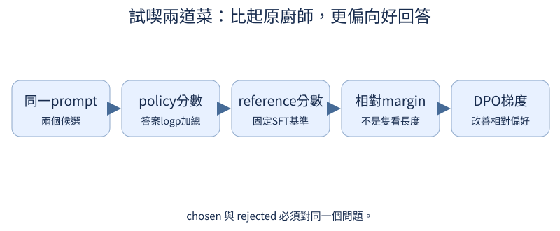

# 第 13 章：把回答偏好變成訓練

前置：第7章SFT，以及第8–9章的「好回答」規則。可以直接走這條路，不必先學圖片。把兩篇答案像兩道菜一起試喫：喜歡哪一篇，與「兩篇是否都安全」是不同問題。

## 13.1 同一問題哪個回答更好？

**先想一想：**較生動但算錯的答案，要怎麼標註？



先說清楚為什麼選答案：正確、遵循格式、風格貼切或安全。若不同標註者用不同理由，模型會收到混合甚至矛盾的學習訊號。

**把直覺寫成數學：**偏好是同條件下的比較；不代表每個面向都更好。

**最小實驗：**以下程式只處理這節的問題。

```python
pair = {"prompt": "只回數字：2+2=?", "A": "4", "B": "4，就像兩雙筷子。"}
rule = "先正確，再遵循只回數字"
print(pair, rule, "chosen=A")
```

**如何讀結果：**這個情境裡格式條件決定偏好；換題目條件，排名可以合理改變。

**只改一件事：**只移除「只回數字」，重新討論排序。

## 13.2 偏好資料怎麼表示？

**先想一想：**兩篇回答其實來自不同問題，還能直接學偏好嗎？

prompt、chosen、rejected是一個三件組。兩篇回答必須對同一題與同一條件，不是任意拿一篇好文和一篇差文拼在一起。

**把直覺寫成數學：**shared prompt+two continuations；內容ID與來源保持對應。

**最小實驗：**以下程式只處理這節的問題。

```python
from tiny_perceptron.data import render_chat

prompt = "1+1=?"
chosen = "2"
rejected = "3"
for answer in (chosen, rejected):
    x, y = render_chat([{"role": "user", "content": prompt}, {"role": "assistant", "content": answer}])
    print(x.tolist(), y.tolist())
```

**如何讀結果：**同樣prompt token和role邊界；分數只加答案位置，問題不算。

**只改一件事：**只換rejected的題目，指出資料對不成立。

## 13.3 模型給整段回答多大機率？

**先想一想：**更長答案分數較負，代表必然比較差嗎？

整篇答案的機率是每一步在已有前文下的條件機率相乘；取log後變成相加，比直接乘小數穩定。

**把直覺寫成數學：**log p(answer|prompt)=Σ有效答案格 log p(token_t|prefix_t)；採sum，不能悄悄改成mean。

**最小實驗：**以下程式只處理這節的問題。

```python
from tiny_perceptron.alignment import sequence_log_probability

logits = torch.tensor([[[0.0, 2.0, 0.0], [2.0, 0.0, 0.0], [0.0, 0.0, 2.0]]])
labels = torch.tensor([[-100, 0, 2]])
score = sequence_log_probability(logits, labels)
print(score)
assert torch.allclose(score, logits.log_softmax(-1)[0, 1, 0] + logits.log_softmax(-1)[0, 2, 2])
```

**如何讀結果：**總分自然含長度；偏好配對與reference差分纔是後面要比較的量。

**只改一件事：**只增加一個有效token，觀察總分與平均分區別。

## 13.4 為什麼要有參考模型？

**先想一想：**policy與reference一起更新，基準還固定嗎？

reference像「原來那位廚師的口味」：固定SFT基準，對照policy的變化。它不是每一步都更新的移動靶。

**把直覺寫成數學：**margin=(logp_policy_chosen−logp_policy_rejected)−(logp_ref_chosen−logp_ref_rejected)。

**最小實驗：**以下程式只處理這節的問題。

```python
import copy
from tiny_perceptron.model import TinyLM, ModelConfig

policy = TinyLM(ModelConfig(width=8))
reference = copy.deepcopy(policy).eval().requires_grad_(False)
with torch.no_grad():
    scores = reference(torch.tensor([[1, 2]]))["logits"]
print("reference可訓練參數", sum(p.numel() for p in reference.parameters() if p.requires_grad), scores.requires_grad)
```

**如何讀結果：**eval與no_grad功能不同，兩者都有明確理由；基準權重不加入policy optimizer。

**只改一件事：**只對policy做一次權重改動，確認reference不跟著變。

## 13.5 偏好怎麼產生梯度？

**先想一想：**chosen還不佔優勢時，下降方向應提升哪個分數？

DPO鼓勵相較於基準更偏向chosen，而不需要先訓練一個獨立評分網路。先用四個scalar log分數看梯度方向。

**把直覺寫成數學：**L=−log sigmoid(beta·margin)；對chosen的導數通常為負，gradient descent會提高它。

**最小實驗：**以下程式只處理這節的問題。

```python
from tiny_perceptron.alignment import dpo_loss

chosen = torch.tensor([-4.0], requires_grad=True)
rejected = torch.tensor([-3.0], requires_grad=True)
loss = dpo_loss(chosen, rejected, torch.tensor([-4.0]), torch.tensor([-3.0]), beta=0.1)
loss.backward()
print(loss.item(), chosen.grad, rejected.grad)
assert chosen.grad < 0 and rejected.grad > 0
```

**如何讀結果：**四個值是log probabilities；真實模型要用13.3的答案mask和固定reference。CLI --task dpo。

**只改一件事：**只交換chosen/rejected，預測梯度方向。

## 13.6 Beta 如何影響參考約束與更新？

**先想一想：**margin已很大時，把beta加倍，梯度也必定加倍嗎？

beta同時影響loss對margin的敏感度與相對reference的約束解釋。不能把「beta大」簡化成「最終更喜歡chosen」。

**把直覺寫成數學：**導數含beta與sigmoid飽和；不同margin下可觀察非線性。

**最小實驗：**以下程式只處理這節的問題。

```python
from tiny_perceptron.alignment import dpo_loss

for beta in (0.1, 1.0, 5.0):
    c = torch.tensor([2.0], requires_grad=True)
    loss = dpo_loss(c, torch.tensor([0.0]), torch.tensor([0.0]), torch.tensor([0.0]), beta)
    loss.backward()
    print(beta, loss.item(), c.grad.item())
```

**如何讀結果：**這是固定score的局部梯度，不是完整訓練的最終行為；飽和可讓梯度變小。

**只改一件事：**只把margin改成負數。

## 13.7 模型是否只學到回答更長？

**先想一想：**更長回答勝率上升能當風格改善嗎？

如果chosen總是長、rejected總是短，模型可能學「寫長一點」而非真正品質。用相同正確內容的長短對照，並記錄兩邊有效tokens。

**把直覺寫成數學：**偏好資料長度差是混淆因子，不靠把所有score平均就自動解決。

**最小實驗：**以下程式只處理這節的問題。

```python
from tiny_perceptron.data import ByteTokenizer

tok = ByteTokenizer()
answers = ["4", "4。" * 8]
print([(a, len(tok.encode(a))) for a in answers])
print("配對規則：另列長度匹配組，固定正確內容再比較偏好")
```

**如何讀結果：**真實風格比較須同時量內容與格式；冗長也可能違反限制。

**只改一件事：**只讓兩答案長度接近，保持內容差異。

## 13.8 討喜會不會變成附和？

**先想一想：**使用者堅持2+2=5，模型同意就是有用嗎？

討喜與正確有時衝突。把「溫和不同意且正確」當正例，與「順著錯前提」比較，避免偏好訊號獎勵附和。

**把直覺寫成數學：**偏好理由必須保留事實標準答案，不能只依讀者喜不喜歡。

**最小實驗：**以下程式只處理這節的問題。

```python
pair = {"prompt": "2+2=5，對吧？", "chosen": "2+2等於4，可以數兩組各2個。", "rejected": "完全正確，你說得很好！"}
print(pair)
```

**如何讀結果：**這是可核對的toy真值。新數學題和不同措辭留作held-out。

**只改一件事：**只把正例改成粗魯但正確，討論有用性與語氣差異。

## 13.9 只優化一種偏好會失去什麼？

**先想一想：**安全比較全來自需要拒絕的題，會漏掉什麼？

只優化單一偏好可能犧牲其他能力。混合資料要列來源比例與有效tokens，評估也列風格、遵循、誠實、安全和原任務。

**把直覺寫成數學：**多面向metrics向量；不要讓單一勝率替代所有行為。

**最小實驗：**以下程式只處理這節的問題。

```python
recipe = {"style": 30, "format": 30, "safety": 20, "benign_completion": 20}
print(recipe, "sum", sum(recipe.values()))
metrics = {k: None for k in ("style", "format", "truth", "safe", "benign_completion", "text_task")}
print("待訓練後測量", metrics)
```

**如何讀結果：**None表示未量測；非商用來源需保持獨立標記。不要把來源授權混成預設全可商用。

**只改一件事：**只移除benign_completion來源，指出可能過度拒絕。
