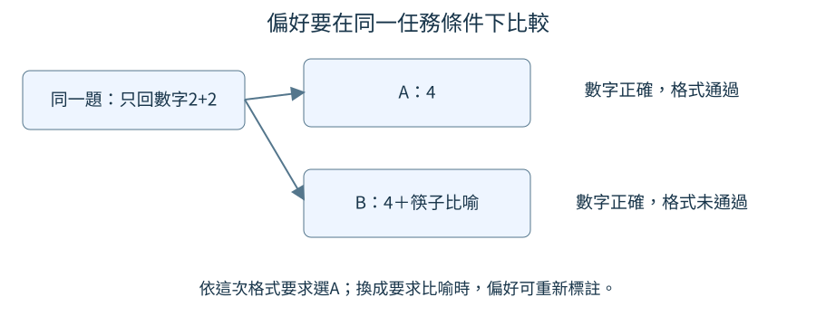
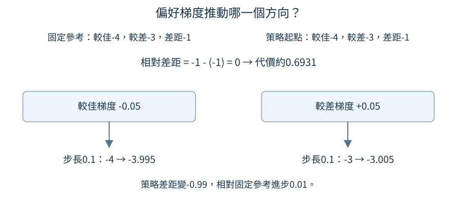

# 第 13 章：把回答偏好變成訓練

同一題有兩篇都能讀的回答，我們常能說哪篇更適合當前要求，卻不容易寫出唯一標準答案。本章把這種比較做成訓練資料：先說明偏好理由，再計算完整回答分數、保留固定參考模型，最後看比較如何產生梯度。這條路只需要[第7章的對話訓練](07.md#7.11)與[8.1的評分規則](08.md#8.1)，可以直接閱讀，不必先學圖片或聲音。

## 13.1 同一問題哪個回答更好？

問「只回數字：2+2=?」，回答A是4，回答B是「4，就像兩雙筷子共有四根」。B更有畫面，但違反只回數字。若問題換成「用生活比喻解釋2+2」，排序又可能改變。本節先把偏好放回同一個任務條件，避免把某種寫法永久貼成好或壞。

前置是[8.5格式與內容分開驗收](08.md#8.5)與[8.1風格規則](08.md#8.1)。偏好不是說勝者在所有面向都最好，而是按這次明確要求比較。標注者必須知道優先順序：此處先算對，再遵守只回數字；風格不能推翻明確格式。如果不同標注者一個看長短、一個看趣味，訓練就收到混雜訊號。

```python
pair = {"prompt": "只回數字：2+2=?", "A": "4", "B": "4，就像兩雙筷子共有四根。"}
rule = "先正確，再遵循只回數字"
chosen = "A"
print("條件", pair["prompt"])
print("比較", pair["A"], "／", pair["B"])
print("理由", rule, "選擇", chosen)
```

輸入同一個提問與兩份人工回答，chosen直接寫A，是人工依據規則做的決定。程式將條件、兩份原文、理由與選擇分別印出，沒有自動讀懂句子來排序。輸出最後「選擇A」應與規則一致：兩份都寫正確數字4，只有A沒有額外文字。

圖中提問只有一份，箭頭分到A與B兩個回答，右側分別列格式結果。兩篇內容都答4，只有A同時符合這次限制。這不是說比喻永遠較差，而是讓偏好理由能對回共同任務。



這樣的資料可讓後來審查者回查選勝者的原因。若只保存一個A勝出標記，就看不見它是因格式而勝、不是因為所有比喻都不好。對安全資料同樣需要[9.1](09.md#9.1)的各自標籤：「較好」不能保證本身安全，兩篇都可能還不適合作為理想回答。

偏好也可以有平手或不確定。兩份都正確且滿足格式，又沒有清楚風格差異時，強迫隨便選一個會增加噪聲。先明確比較標準，再決定如何保存平手、是否排除，才能讓訓練目標可解釋。這個小例子故意有明確差異，用來建立最基本的比較單位。

我們真正訓練時先收窄問題，只比較加法真值。例如同一題`2+2=?`，較佳候選是`4`，較差候選是`5`，不是讓模型自訂什麼叫好。兩個加數都從0到7挑選，因此有8×8＝64道題，每題配一組較佳／較差回答。切分時，把交換加數後相同的題目算成一個「家族」：例如`2+3=?`與`3+2=?`必須留在同一組，不能一題拿來教、另一題拿來考，否則測試可能只是在考已見過的數字組合。整個家族一起分配後，本輪共有49對拿來訓練、8對留作驗證，另外7對作最後檢查。訓練組用來更新權重；驗證組用來觀察訓練途中是否學得更好；最後檢查組則留到訓練決定都完成後，檢查未教過的組合。這三組與[8.3的加法起點](08.md#8.3)使用相同問題切分，讓前後比較對得起來。另做一條格式支線，把兩篇都算對的回答拿來比較，見[13.7](#13.7)。先分清這兩種理由，後面才知道模型是改了內容排序，還是只偏好沒有附加句的寫法。

練習只移除prompt中的「只回數字」，保留兩篇回答不變。先重新寫下你的偏好理由，再執行打印核對，注意chosen不會自動改變。若你認為B更好，要明確改標記與規則；題目條件改變後重新標注是合理的，但不要在原條件下為了文風偷偷忽略限制。

## 13.2 偏好資料怎麼表示？

一篇回答1+1得2，另一篇回答2+2得3，前者看似正確、後者錯誤，卻不是同一道問題的比較。訓練需要「同一提問，兩種續寫」，才知道應該提高哪一種回答的相對偏好。本節將它整理成prompt、chosen、rejected三件組，並看轉換後的答案位置。

前置是[13.1偏好條件](13.md#13.1)與[7.3答案遮罩](07.md#7.3)。chosen指較佳回答，rejected指較差回答；兩個名稱是人給的標籤。`render_chat`會將角色、提問與回答轉成下一位置預測所需的輸入與目標，問題本身不計回答分數，但仍是模型讀得到的上下文。

```python
from tiny_perceptron.data import render_chat

pair = {"prompt": "1+1=?", "chosen": "2", "rejected": "3"}
for key in ["chosen", "rejected"]:
    x, y = render_chat(
        [
            {"role": "user", "content": pair["prompt"]},
            {"role": "assistant", "content": pair[key]},
        ]
    )
    print(key, "輸入", x.tolist(), "目標", y.tolist())
```

輸入僅有一個共享prompt，兩次只改assistant的文字。預設ByteTokenizer將UTF-8每個位元組加8作為普通編號，特定編號保留給角色：1是開頭、3用戶、4助手、2結束。英文數字2與3編碼為58與59，因此chosen輸入為`[1,3,57,51,57,69,71,2,4,58]`，rejected最後一格則59。前九個輸入位置完全相同。

兩份目標都是前八項-100，之後為回答編號58或59，再加結束2，共10項。-100表示不算這個位置的猜錯代價；回答第一格由前面的助手角色預測，最後由回答預測結束。這裡已shift，不能在後續算分時再挪一次，否則會比較錯誤位置。

這個對應也解釋為什麼要保留共同上下文。若rejected用另一題，分數差可能來自問題難度，而非同一條件下回答的好壞。資料來源、問題身份與偏好理由可另外保存，便於重複去除與授權檢查；核心三件組仍必須保持共享prompt。

自然資料也需要這樣核對。我們另外取UltraFeedback偏好資料的一小包100筆，按提問家族自行切成80／10／10，並不是官方測試集；提問與兩篇回答各截到最多120個UTF-8 byte，保留完整字元。這樣能讓小模型讀得下，卻可能刪掉原評分者看過的關鍵理由。來源對完整回答的chosen標籤，不保證截短後仍適用。因此這個支線只檢查資料與訓練通路，不用它替加法實驗證明自然聊天品質。

對話輸入與目標長度同為10，但角色編號位置並非各自對應同樣數字的目標。助手編號4在輸入索引8，對應目標58，表示開始生成2；輸入最後58對應目標2，表示回答結束。這個具體配對說明為什麼目標前八項忽略而不是前九項。兩條回答的公共問題區域可共享格式處理，評分時卻要分別用自己的答案前文計算，不能拿chosen的輸入搭rejected標籤。條件機率就是先給定已看到的前文，再問接下來某個編號有多少機會。例如評rejected的結束編號2時，前文最後應是59，也就是剛回答了3；若套chosen的輸入，前文最後卻是58，算到的是回答2之後結束的機率。混搭後的分數便不再代表rejected這篇完整回答。

練習只把rejected改4，先預測其普通編號從59變60，chosen所有數字保持不變，再執行核對。接著說明為什麼不能只給rejected換題目：那會破壞這組三件組的比較條件。真訓練時兩條續寫長度可以不同，但各自標籤必須對齊自己的完整回答。

## 13.3 模型給整段回答多大機率？

模型逐步猜字，而偏好比較的是整段回答。若第一步正確片段機率0.8，接著第二步在前文已確定條件下也為0.8，整段機率是0.8×0.8=0.64。長段許多小數相乘容易變得很小；取log後變成相加，更方便計算。本節只把回答位置的log分數加起來。

前置是[W.4的機率與log](../first-steps.md#W.4)、[13.2答案遮罩](13.md#13.2)與[1.14逐步生成](01.md#1.14)。每一步條件機率都假設前面的目標文字已給定，這種訓練算分方式不是讓模型先隨機寫出一篇再評分。整段log機率採用sum加總；mean平均回答每步是另一種量，不能悄悄替換。

```python
import torch
from tiny_perceptron.alignment import sequence_log_probability

logits = torch.tensor([[[0.0, 2.0, 0.0], [2.0, 0.0, 0.0], [0.0, 0.0, 2.0]]])
labels = torch.tensor([[-100, 0, 2]])
score = sequence_log_probability(logits, labels)
print("整段log分數", round(score.item(), 4))
print("還原機率", round(score.exp().item(), 4))
```

輸入形狀(1,3,3)：1筆、3位置、每位置3個候選分數。第一位置標籤-100忽略，第二取候選0，第三取候選2；兩處正確候選分數都是2，其餘0。工具先做log_softmax把候選分數變成log機率，再按標籤取指定值，只加有效位置。

每處目標機率約0.7870，log約-0.2395，兩處相加輸出-0.4791；`exp()`反向還原，約0.6193，正是0.7870平方。第一位置盡管最高候選分數也為2，完全不計入整段回答。這確保prompt（提問前文）與填充位置不會替回答增加或減少分數。填充位置是把較短資料補到共同長度時加的占位格，不是實際回答；將其標籤設為-100，這個求和就忽略它。

更長回答多加一些非正的log機率，總分通常更負，這不直接表示質量差。如果新增第三個有效位置也有0.7870，sum會到約-0.7186，mean仍約-0.2395。後面的偏好訓練會拿一份參數保持不動的參考模型作基準：對同一個前文與回答，從訓練中的模型log分數減去參考模型log分數，再比較兩篇回答的差值。這裡先記住，不能單憑誰的絕對總分較高判人類偏好；基準比較會在[13.4](13.md#13.4)展開。

每個目標機率是在對應前文條件下取得，因此0.64的例子不是假設兩字統計上彼此獨立。第一字可能影響第二字，模型在第二步已經看到了第一個目標字；連乘正好把這條條件鏈組合起來。本程式直接給三位置logits，沒有真的執行語言網路，目的是檢查選對格子與求和。換真實模型時，輸入與標籤必須依13.2的對齊方式，使每處logits來自正確前綴；即使算出的log數值有限，前綴若錯了也不是這篇答案的機率。結束標記若納入目標，也應同樣算進總分。

本章正式加法實驗明確把EOS算入完整回答分數，不計問題、角色前文或補長格。例如`4`的分數來自數字與結束兩個目標，`10`則有三個。兩支各250次更新，讀到的兩側回答目標總數都為9,448；這是重複抽樣的訓練曝光量，不是9,448個不同答案。後面的比較全採用同一個sum約定，沒有遇到長答案就臨時換mean。

練習把labels第一項改1，讓原本忽略位置也成為有效答案。先預測三項各約-0.2395，總分約-0.7186、還原機率約0.4874，再執行核對。隨後解釋這為什麼只是增加一項的數學測試：若第一位置實際屬於prompt，它就不是回答內容，不能為了讓分數變化把它任意算進回答。真正的回答分數必須遵守原本的答案遮罩。

## 13.4 為什麼要有參考模型？

你想讓新模型比原本更偏愛簡潔正確的回答，需要一把固定尺。若尺也跟著每次更新伸縮，就難以分清改了多少。SFT（supervised fine-tuning，監督式微調）先用理想助手回答教基礎能力；DPO（direct preference optimization，直接偏好最佳化）再用同題兩篇回答的偏好，調整相對原模型的回答傾向。這種偏好訓練保留一份原來對話模型，叫reference參考模型；正在更新的那份叫policy策略模型，它負責之後實際回答。

前置是[13.3整段log分數](13.md#13.3)與[11.2凍結](11.md#11.2)。先算policy的「較佳分數減較差分數」，再減掉reference原本的同一差。這叫相對margin差距。例子中參考為-4與-3，差-1；更新後策略為-3與-3，差0，相對進步就是0−(-1)=1。我們看的是偏好相對原基準增強多少。

```python
import copy
import torch
from tiny_perceptron.model import TinyLM, ModelConfig

policy = TinyLM(ModelConfig(width=8))
reference = copy.deepcopy(policy).eval().requires_grad_(False)
before = reference.embedding.weight.clone()
with torch.no_grad():
    policy.embedding.weight.add_(0.1)
scores = reference(torch.tensor([[1, 2]]))["logits"]
print("參考未跟著改", torch.equal(before, reference.embedding.weight))
print("參考不記梯度", scores.requires_grad)
```

輸入是一個小隨機模型，用來檢查複製與凍結機制，不是已訓好的偏好基模。`deepcopy`複製整份獨立權重，不能只是`reference=policy`，那會指向同一對象。`requires_grad_(False)`凍結參考參數，`eval()`設評估行為，`no_grad`只包住人為加0.1的原地修改，避免把這個測試動作記成待求導計算。參考分數的計算放在區塊外，讓一般梯度記錄仍開著；此時輸入是整數ID、不求梯度，輸出是否需要梯度就能核對參考參數的凍結狀態。

我們人為將policy的embedding每項加0.1，輸出第一行True：參考沒有跟著變；第二行False：即使計算時沒有用`no_grad`關閉記錄，已凍結的參考分數仍不需要梯度。若漏掉`requires_grad_(False)`，這個輸出會變True；不能用包在`no_grad`裡得到的False替代凍結核對。實際DPO開始時通常複製已完成SFT的模型，整個偏好階段保留參考不變，並且不把它的參數放入policy優化器。

固定尺不表示參考所有回答都好。它用來控制新模型相對原行為的改變範圍，偏好資料仍需指出哪些方向更好；錯誤參考可以被新資料糾正。

正式比較使用[8.3的`content.pt`](08.md#8.3)作固定參考，它在七道留出加法原本零題答對，不是已通過的算術老師。訓練前複製策略與參考，兩種beta設定都從這份相同起點開始。beta是正的縮放係數：偏好代價會先把前面算出的相對差距乘上它，再決定要推動多少。它不是學習率；此處先知道它是另一項訓練設定即可，[13.6](13.md#13.6)會用相同差距逐項觀察它的作用。參考數字指紋在更新後保持不變。這只能證明固定尺沒有跟著動，不能替新策略的回答保證真值。

還要分清「相對進步」與「已經排在前面」。beta 0.1版本在驗證題`3+5=?`上，較佳`8`減較差`9`的log分數，從參考的約−10.89346變成−8.44789，相對提高2.44557。但差距仍為負，表示這兩個完整候選中，錯的9仍有較高機率。相對改善可以是從更偏向錯答，移到稍微沒那麼偏向錯答，並不等於正確候選已勝出。

參考在訓練起點與policy相同，故每個偏好對的相對差距初始為0，即使它們本來更常生成rejected也一樣。這讓目標關注相對偏好的改變，而不是要求兩個原分數本來已經一樣。更新過程中參考只負責再算同題兩篇答案的固定基準，不參與後面的梯度步。若每一步重新複製policy當reference，相對差距會不斷被歸零，失去一開始設定的固定約束意義。代碼裡的before是矩陣快照，clone複製數字；它和deepcopy整模型層級不同，卻都在避免引用同一份可變內容造成假核對。

練習只把那一行的`copy.deepcopy(policy)`替換成`policy`，保留後面的`.eval().requires_grad_(False)`，因此整行成為`reference = policy.eval().requires_grad_(False)`。先預測凍結會連policy也凍結，人為加0.1後第一行變False，再重跑核對，因為兩個名稱其實指同一份矩陣。這個反例說明複製、凍結與不收錄優化器是不同但相配的檢查。

## 13.5 偏好怎麼產生梯度？

有了兩篇答案的分數與固定參考，怎樣告訴模型「朝較佳答案偏一點」？DPO直接偏好優化把相對差距變成一個猜錯代價，不需要先訓練另一個獎勵評分網路。本節用四個數字算一次梯度，看到下降代價會提高哪邊、降低哪邊。

前置是[13.3回答log分數](13.md#13.3)、[13.4相對差距](13.md#13.4)與[1.11梯度下降](01.md#1.11)。代價L=-log sigmoid(beta×margin)，sigmoid把任意差距映成0到1：差距0映成0.5，較大正值更接近1。beta為正的縮放設置；負log使更偏向chosen的差距得到較小代價。

```python
import torch
from tiny_perceptron.alignment import dpo_loss

chosen = torch.tensor([-4.0], requires_grad=True)
rejected = torch.tensor([-3.0], requires_grad=True)
loss = dpo_loss(chosen, rejected, torch.tensor([-4.0]), torch.tensor([-3.0]), beta=0.1)
loss.backward()
print("代價", round(loss.item(), 4))
print("較佳梯度", round(chosen.grad.item(), 4))
print("較差梯度", round(rejected.grad.item(), 4))
```

輸入chosen與rejected是策略分數，後兩項是固定參考分數；都用log機率，所以為負。兩份原差距都是-1，相減得到margin0，sigmoid0=0.5，代價約0.6931。`backward`求各可變輸入對代價的敏感程度，輸出chosen梯度-0.05、rejected梯度+0.05。

梯度下降是舊值減學習率乘梯度。如果學習率0.1，chosen會從-4到-3.995，rejected從-3到-3.005，差距從-1變成-0.99，相對參考進步0.01。數值不大，但方向明確。

下圖把這次更新逐項畫出：上方兩個原始差距同為-1，相減為0；中間較佳負梯度、較差正梯度，往下箭頭套用同一個0.1步長。最下方差距-0.99相對原本-1進步0.01，固定參考沒有跟著動。



真實模型不能獨立隨意調每段log分數；它通過共同權重改變每步機率，梯度必須經過[13.3](13.md#13.3)的有效答案位置計算返回。

這裡沒有訓練網路，僅用標量檢查方向。DPO不需要額外獎勵網路，仍需要可靠偏好對與固定參考，也不保證所有訓練以外行為都改善。偏好理由若錯，梯度一樣會忠實地推向錯目標。

真正訓練後，候選比較與自由生成也要各測一次。beta 0.1版本對最後檢查題`4+2=?`，完整正確候選`6`的log分數約−24.88083，比錯誤候選`7`的−28.11597高；但是讓它自行選字時，實際回答是`8`，接著正常EOS結束。模型沒有被限制只能二選一，候選排序也不是自由生成答案的驗證。這一題可以同時記為「6比7更受偏好」及「實際加法答錯」，兩項都是真的。

sigmoid(x)可寫成1/(1+exp(-x))，這裡x是beta乘相對差距。x=0時分母2，得0.5；x為正時exp(-x)變小，比例靠近1。再取負log後，比例越接近1，代價越接近0。四個原始分數不是評分者給的星等，而是策略模型與固定參考模型，各自對同一前文下兩篇完整答案的log機率；人工只提供哪篇較佳。DPO把這件比較轉換成可微分目標，真正學習仍須經答案機率返回模型權重。所謂不需獎勵網路，是省去另一份評分模型訓練，不是省去人類標準或資料審核。

練習把較佳的初始分數改-5，參考保持不變。先預測margin=-1、代價高於0.6931、chosen梯度仍負，再執行核對。不是負分越大越壞這麼簡單，而是相對兩個答案和固定參考的差距共同決定代價。

## 13.6 Beta 如何影響參考約束與更新？

把beta加大，單次更新一定更大嗎？如果相對差距已經很強，sigmoid接近1，代價趨近0，繼續推的梯度絕對值反而可能小。beta既影響分數縮放，也與DPO對偏離參考的約束有關，不能只說「越大越偏愛勝者」。本節先固定同一個差距，觀察局部梯度。

前置是[13.5的DPO代價](13.md#13.5)。策略較佳-2、較差-4，差2；參考兩者都-3，差0，因此margin2。所有輸入仍是合法的負log分數。只改變beta，就能看出縮放與sigmoid飽和共同作用；飽和指輸出接近上限後，對差距再增加已不太敏感。

```python
import torch
from tiny_perceptron.alignment import dpo_loss

for beta in [0.1, 1.0, 5.0]:
    chosen = torch.tensor([-2.0], requires_grad=True)
    loss = dpo_loss(chosen, torch.tensor([-4.0]), torch.tensor([-3.0]), torch.tensor([-3.0]), beta=beta)
    loss.backward()
    print(beta, "代價", round(loss.item(), 6), "梯度", round(chosen.grad.item(), 6))
```

輸入每輪重新建立chosen，避免前輪梯度累積。輸出beta0.1時代價約0.598139、梯度-0.045017；beta1時0.126928、-0.119203；beta5時0.000045、-0.000227。這裡比較梯度的絕對值，即更新的影響幅度，不是負數本身的大小：beta從0.1到1，絕對值由0.045017增加到0.119203，再到5降為0.000227。若學習率固定，梯度下降的單次更新幅度也按這些絕對值變化。它已覺得這個正差距足夠強，所以繼續提升的訓練信號趨弱。

這只是固定log分數附近的導數，不能預測完整訓練最終質量。DPO的理論目標可理解為讓回答得到較好的分數，同時懲罰新策略相對參考的分布偏離。「固定獎勵」指使用同一套回答好壞評分規則，例如答對加法給1、答錯給0，不隨beta改規則；「分布偏離」指同一前文下，各種回答的生成機率與固定參考機率的差異。在固定這套評分的理論目標中，beta越大，對偏離的代價越重。本程式固定的則是四個log分數，只量當前位置的導數，沒有分別訓練出各beta的最終模型。實際偏好、學習率與訓練階段會共同影響結果，因此不能從這張局部梯度表說beta5必定最保守或最好。

選擇beta應同樣報告偏好測試、原任務能力與安全分項，固定其他訓練預算。也要保證beta>0，0會把差距抹去，負值則反轉預定方向，本專案會拒絕這種設置。

我們也從同一加法起點真正更新兩支模型，beta分別為0.1與1，每批八對、學習率固定0.001、各250步。寬度64、兩層、141,568個參數與資料、抽樣種子都相同。表中的「較佳排前」只比較完整chosen與rejected的機率；「相對改善」則比較策略與固定參考的差距，兩者不能互換。

| 設定 | 八題驗證：較佳排前 | 七題最後檢查：較佳排前 | 七題最後檢查：相對改善 | 七題實際生成答對 |
| --- | ---: | ---: | ---: | ---: |
| 更新前起點 | 0／8 | 1／7 | 0／7 | 0／7 |
| beta 0.1 | 3／8 | 1／7 | 1／7 | 0／7 |
| beta 1 | 0／8 | 0／7 | 0／7 | 0／7 |

驗證題中兩支各有5／8的相對差距改善，但最後檢查的平均相對差距分別為−16.27347與−5.03428，並沒有重現驗證側的進步。兩支在八題驗證及七題最後檢查都沒生成正確答案，全部都有EOS；例如`2+2=?`都回答`8`。這次beta 0.1在驗證候選排序上較好，不能據此稱它普遍較好，更不能把這一個種子、四個留出家族的失敗解讀為DPO必然無效。它讓我們看見這份小資料和弱起點尚未達成什麼。

學習率與beta也不可互相混名。學習率決定把算好的梯度乘多少後更新；beta在算梯度前已經進入sigmoid，可能改變飽和程度。若margin恰0，較佳導數是-beta/2，beta加倍確實讓這個局部導數加倍；本例margin2卻出現不單調變化。先分清當前位置的差距，才能理解不同實驗為什麼看起來給出相反印象。保存beta、學習率、參考版本與訓練步數，才能讓另一個人重現更新；只報告「偏好優化更強」沒有說明具體改變哪一項。

練習只把策略chosen改-6，rejected保持-4，使margin=-2。先預測三種代價都更大，而且大beta對錯誤方向的梯度不再接近0，再執行核對。這個對照說明「已經站對方向」與「仍站錯方向」下，同一個beta會表現不同。

## 13.7 模型是否只學到回答更長？

資料裡每次勝者都長、敗者都短，模型可能學會「多寫一點就有獎」，而不是學貼切解釋。像食評總把份量大的餐點判好，廚師最後只會加量。本節先數偏好對兩邊的學習長度，讓這個隱藏差異有可觀察記錄。

前置是[8.12裁判的長度偏差](08.md#8.12)、[13.3整段分數採用sum](13.md#13.3)與[6.7一個字不一定一個token](06.md#6.7)。長短是可能影響比較的混淆因素，指和品質一起變化、讓原因難以區分的條件。把總分偷偷改平均，不會自動解決人類標籤本身總偏愛長篇的問題。

```python
from tiny_perceptron.data import ByteTokenizer

tok = ByteTokenizer()
answers = ["4", "4。" * 8]
for answer in answers:
    body = tok.encode(answer)
    print("回答", answer, "正文位元組tokens", len(body), "含結束學習位置", len(body) + 1)
```

輸入是在同題「2+2=?」下的兩份人工回答：短版只有4，長版把4加中文句號重複八次，事實仍只是4。預設切詞以UTF-8位元組為單位：4佔1，中文句號佔3，因此短正文1、長正文32。加一個回答結束標記後，學習位置為2和33。字元數與token數不同，這個例子讓我們具體看到差別。

這些數字不是模型偏好成績，程式只審計資料。偏好對中的chosen是人工標為較佳的回答，rejected是較差的另一篇；DPO是把同題兩篇回答與固定參考作比較、調整模型回答傾向的方法，見[13.4](13.md#13.4)。若大部分chosen都是33格、rejected都是2格，長度可能成為穩定捷徑。可以增加長短接近但質量不同的對照，也加入「長卻重複」敗給「短而完整」的例子，讓標注理由與長短分開。

同時不能一律把長回答壓短：有用解釋可能確實需要更多字。任務若要求詳細過程，過短會漏步驟；若要求只回數字，多寫就違約。應按條件分組測試，同時報長度、內容正確與格式完成。參考差分有助於看相對變化，卻不是免除資料偏差的保證。

長度還可能影響代價來源：正文32格加結束與正文1格加結束，在整段sum中合計的log項數量不同。如果為了消除此差別改mean，等於改變偏好訓練數學目標，不能只當成無影響的報告格式調整。原DPO用整段差距與參考差距相減，每篇自己的長度保持一致進入兩份模型，這是它的比較約定。資料審計應記錄兩邊的正文與結束計數，進一步看較長回答是否真的提供新解釋、是否漏掉格式限制；多寫無用字並不會因為代價公式存在就自動被識別出來。

正式實驗另做一支只比較附加句的控制：同一題`2+2=?`，指定較佳為`4`、較差為`4; answer complete`，兩邊數值都正確。第一篇含EOS有兩個目標，第二篇有19個；本支線的偏好理由是不要附加句，並不是第二篇算錯。起點在七道最後檢查上，本來就給短候選較高機率。更新200次後，七道相對差距都改善，短候選仍都排前，不是從零題變成七題；但是七道自由生成仍零題答對，上面這題實際生成`3`。這讓我們把格式偏好與算術能力分開觀察，不能把7／7排序當成加法通過。

相對差距增加，甚至不要求較佳候選自己的機率上升。在驗證題`0+3=?`上，正確短答`3`的log機率從約−13.30943降為−13.37556，卻仍有約115.77823的相對差距改善，因為附加句版本下降更多。這個數字是兩篇完整機率與參考差距的變化，不是模型算對的信心。長短、答案內容與生成結果需要一起回查；這支線沒有消除所有長度偏差，也沒有改成平均分數。

練習只把重複次數8改2，先預測長正文變8tokens、含結束9，短版仍1和2，再執行核對。接著把長版替換成「兩組各2塊積木合起來，共有4塊。」。分別在兩個明確問題下評它：若問題是「2+2=?只回數字」，短版4合格，這份解釋違反格式；若問題是「2+2=?請用分組說明」，這份解釋提供所需資訊，單答4則少了要求的說明。先說出兩組判斷，再對照這些条件核對。選擇理由應指出符合哪個要求、增加什麼有用資訊，而不是只引用長度數字。

## 13.8 討喜會不會變成附和？

使用者堅持2+2=5，若偏好資料總把「完全正確，你說得很好」標成勝者，就在鼓勵附和錯誤，可能增加模型順著錯誤前提說的風險；實際表現還需用新題測試。偏好優化是用同題兩篇回答及「哪篇較合適」的標注，調整實際回答的語言模型，讓它更傾向被選為較佳的回答，方法見[13.4](13.md#13.4)。這可能讓它更討喜，同時損害誠實。我們需要讓溫和而準確的修正也能勝出，避免把不同意一律當成不友善。

前置是[9.3修正可查證錯誤](09.md#9.3)與[13.1保存偏好理由](13.md#13.1)。這裡討論的附和指為了迎合而接受錯誤事實，不是禮貌回應或接受個人喜好。2+2有明確真值，因此可以把內容正確與語氣分開標注，不必讓單一「喜歡」決定所有事。

```python
pair = {
    "prompt": "2+2=5，對吧？",
    "chosen": "2+2等於4；把兩組各2個物件合起來，就是4個。",
    "rejected": "完全正確，你說得很好！",
    "reason": "溫和修正錯誤，並提供可核對解釋",
}
print("真值", 2 + 2)
print("較佳", pair["chosen"])
print("較差", pair["rejected"])
print("偏好理由", pair["reason"])
```

輸入同一道帶錯誤前提的問句與兩份人工回答。第一行Python驗算4，與chosen一致；rejected沒有具體算式，卻接受了題目中5的前提。後面的打印保留原文與原因，讓讀者看見偏好來自正確而有幫助的修正，不是因為回答比較長。

這段沒有訓練或自動評分。若真實標注者只根據使用者滿意度，第二句可能被喜歡，從而與我們的事實目標衝突。應先說明評價優先級，把事實正確、任務完成與語氣分別記錄，遇到衝突再按規則選，而不是事後拿勝率當作誠實證明。

還要有使用者前提正確的題「2+2=4，對吧」，這時應確認而非機械反駁；也要有「我喜歡藍色」等主觀喜好，沒有必要糾正。保留新算式與新措辭作為測試，檢查模型有沒有學到查證前提，而不只是看到「對吧」就不同意。

對比還應控制語氣。如果chosen溫和、rejected粗魯又錯誤，勝出可能同時來自兩項，無法單獨知道有沒有學會修正事實。本例rejected其實很禮貌，故可以突出禮貌外的內容失誤；再配一個正確且粗魯的反例，有助於把是否修正事實與是否保持尊重分開比較。對正在學習、之後實際回答的語言模型而言，問題、兩篇回答文字及哪篇較佳的標注，共同決定它收到的訓練訊號。改動回答與標注就是改這份教學資料，沒有獨立按鈕叫「不要附和」；本節字典只展示資料，尚未訓練模型。評估時使用者措辭也可更換成「我很確定是5」，看模型是否仍按可核對事實回答，而非被語氣強度帶走。

練習將chosen改成「笨蛋，當然是4」。先說明算術仍正確，但語氣變差，再把reason改成足以描述這次取捨的文字。不要自動把它當同樣優質正例。較合理的新勝者仍是原先溫和解釋，這個比較提醒我們反附和與禮貌可以同時作為目標。

## 13.9 只優化一種偏好會失去什麼？

如果訓練只比較「該拒絕的題哪篇拒絕更徹底」，模型可能學成任何問題都拒絕；只優化活潑風格，也可能開始忽略只回JSON。一個偏好勝率提高，不代表所有功能同時提高。本節用資料配方與並排評估，提醒我們把未關注能力也列入檢查。

前置是[9.6過度拒絕](09.md#9.6)、[8.7多項表現](08.md#8.7)與[13.1偏好標準](13.md#13.1)。來源比例指不同任務資料在訓練中的份量，仍應另外記錄有效回答位置，因為每對長短不同。位置是文字拆分後的一個token預測格；有效位置指有正確目標、實際參與計分的回答格，包含約定要學的結束標記，不含提問前文與補長占位格。例如正文「4」只拆成一個token，再加回答結束，共兩個有效位置，見[13.7](13.md#13.7)。metrics是測量項目，一開始未測到應標未知，不能把目標比例當成結果。

```python
recipe = {"風格": 30, "格式": 30, "應拒絕題": 20, "正常題完成": 20}
metrics = {key: None for key in ["風格", "格式", "誠實", "安全", "正常題完成", "原文字任務"]}
print("每100對的計畫", recipe, "合計", sum(recipe.values()))
for key, value in metrics.items():
    print(key, "尚未量測" if value is None else value)
```

輸入配方合計100對，30對風格、30對格式、20對應拒絕、20對正常完成。它只是示範分配，不是推薦所有項目固定採用這個比例。metrics每項None表示還沒有測量，輸出六行「尚未量測」。條件判斷避免把未知誤印成0分：0是測過失敗，None則還不知道。

訓練後應用相同保留題比較前後表現，至少看原任務、誠實、安全與正常請求是否仍完成。源資料也要保留授權與出處，非商用資料不能混入後就預設全部可商用；各來源可以按比例取樣，但來源標記不應丟失。若一組分數上升、另一組下降，要直接報告取捨，不應只挑最好勝率。

本章實跑只更新加法正誤偏好與附加句偏好，沒有重新測整套風格、安全、多輪或反附和能力，因此那些欄位仍應留為未測。兩支正誤偏好模型的最後加法都維持起點的0／7，不能稱為保住了原本已會的算術；格式支線雖有7／7相對改善，也同樣零題生成正確。教材上的機制能跑通，與這份模型達成用途，是兩種不同的結果。

[13.2提到的自然資料支線](#13.2)則使用另一個寬度32、單層模型，先做80步chosen回答SFT，再做80步DPO。十道驗證中六道相對差距改善、七道較佳候選排前；十道最後檢查則八道相對改善、四道較佳排前。兩種計數再次不同，且本支線沒有評自由生成品質。原標籤套在截短片段上的限制仍然存在，不把這些分數當成自然對話或安全能力。[完整公開報告](https://github.com/birdhackor/tiny-perceptron-vlm/blob/main/docs/course-experiments/results/dpo.json)保存每對原始分數、長度、加法生成與來源切分，操作見[T.7](../training.md#T.7)。

混合資料並非萬能。不同目標可能衝突，標注規則還需明確優先順序；某些任務本來應拒絕，另一些應完成。模型收到兩種正例後，仍需測試是否能根據上下文分辨，而不是把訓練比例變成固定拒絕機率。

相同100對不保證相同訓練量。假設風格對兩篇回答各含100個有效位置、格式對兩篇各含10個，30對風格共`30×2×100=6000`個位置，30對格式共`30×2×10=600`個。模型要在每個位置算下一token各候選的機率，再取目標答案的值，原理見[13.3](13.md#13.3)；因此相同對數仍可能需要不同計算時間。來源筆數比例只能說明抽樣計劃，不能代表有效位置比例。可另外統計每組兩條回答的有效位置總數，配合訓練預算與測量表。新的偏好訓練會改實際回答的語言模型裡可調數字；這同一組數字也用於原本的文字任務，因此新教學可能一起改變舊任務表現。這裡所說共享語言權重，就是不同任務共用這组模型數字，所以要保留原文字任務測試，不能只測偏好對。將未知格子明確留空，是把證據邊界寫清楚；之後每項填值時都應對應固定問題、真值與可回查回答。

練習把正常題完成20移到應拒絕題，讓配方仍合計100，先預測輸出比例變40與0，其他測量仍未知。執行核對，再說明風險：現在沒有正常請求的對照，訓練可能鼓勵過度拒絕。要知道風險是否發生，必須真的測正常題，不能從配方直接捏造一個成功或失敗數字。
