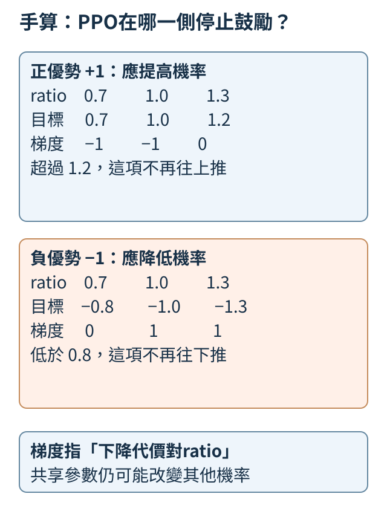
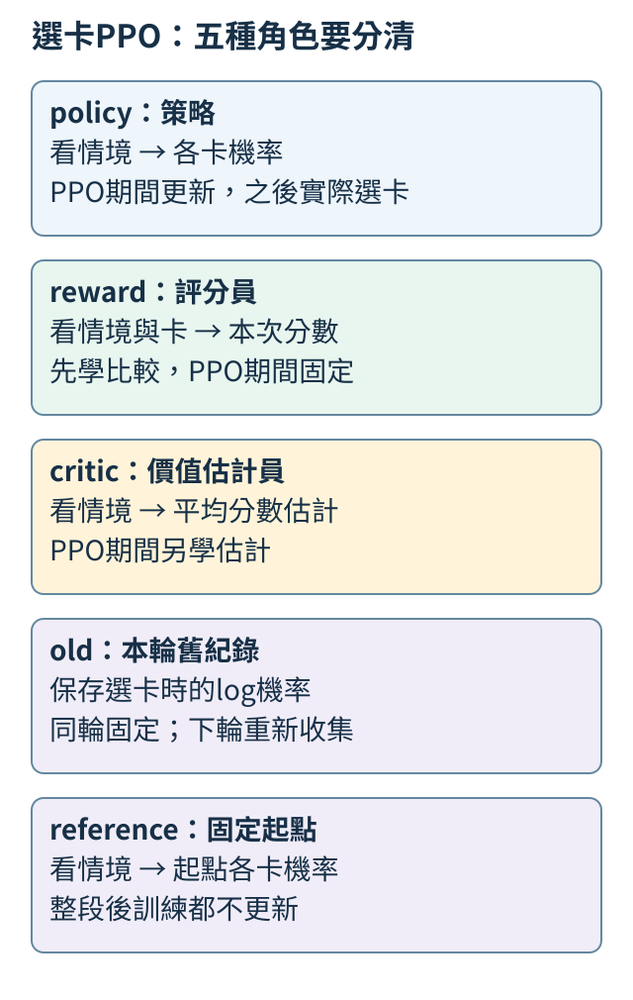
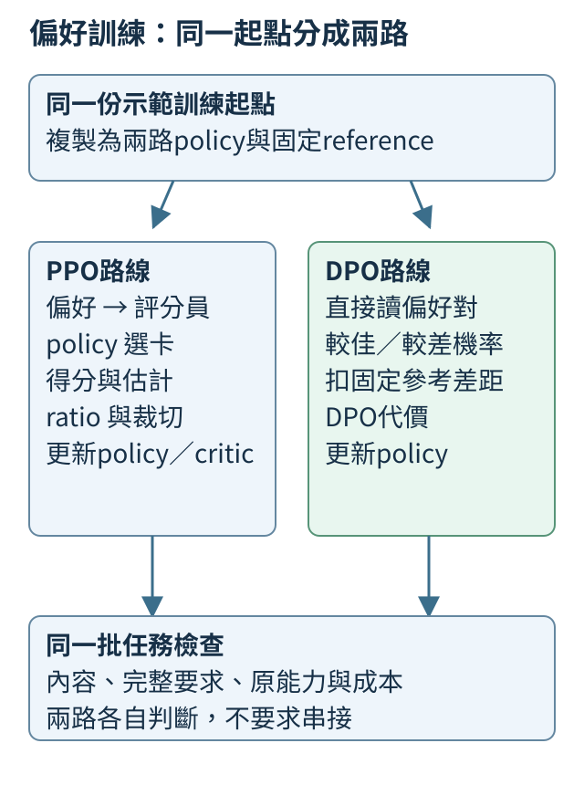

# 第 13 章：把回答偏好變成訓練

對同一問題，你可能知道哪份回答更合適，卻很難只寫一份唯一標準答案。本章先保存比較與理由，再讓這份偏好變成可計算的訓練訊號。

本章有兩條可選路：13.1–13.6先學直接用偏好對的DPO；13.10–13.16則用有限回答卡，逐步看評分、優勢、機率比、裁切與價值估計，學PPO的流程。13.7–13.9檢查兩種路都會遇到的資料和能力取捨，13.17並排比較。它們不是成品必須依序套用的兩道工序。

## 13.1 偏好為什麼必須連同問題一起記？

對「只回數字：2+2=?」，A回答「4」，B回答「4，就像兩雙筷子共有四根」。兩份都算對，只有A符合只回數字。若要求改成生活比喻，B又可能較合適。**偏好**是在同一個任務條件下，標記哪份回答更合適，不是把一種寫法永久封為好答案。

先寫本次判準：「先正確，再遵循只回數字」，再保留提問、兩份原文、選擇和原因。

```python
pair = {"prompt": "只回數字：2+2=?", "A": "4", "B": "4，就像兩雙筷子共有四根。"}
rule = "先正確，再遵循只回數字"
chosen = "A"
print("條件", pair["prompt"])
print("比較", pair["A"], "／", pair["B"])
print("理由", rule, "選擇", chosen)
```

`chosen`直接寫A，是我們的人工判斷；程式只印出紀錄，不會讀文排序。保存原因讓後來的人知道，A勝出是因限制，不是所有比喻都不好。

兩份都不合適時，較佳的一份也不等於理想示範；沒有清楚差別時，則可以記平手或不確定。否則不同標註者各猜一套標準，訓練訊號就混在一起。

練習只刪掉提問裡的「只回數字」。先重寫偏好理由，再修改規則和標記。原程式的A不會自動改：問題變了，需要重新判斷。後面的數學先用最清楚的加法正誤對，例如同題4對5；格式偏好則另用兩份都算對的答案比較。

<details>
<summary>補充：來源、完整設定與既有實測紀錄</summary>

我們真正訓練時先收窄問題，只比較加法真值。例如同一題`2+2=?`，較佳候選是`4`，較差候選是`5`，不是讓模型自訂什麼叫好。兩個加數都從0到7挑選，因此有8×8＝64道題，每題配一組較佳／較差回答。切分時，把交換加數後相同的題目算成一個「家族」：例如`2+3=?`與`3+2=?`必須留在同一組，不能一題拿來教、另一題拿來考，否則測試可能只是在考已見過的數字組合。整個家族一起分配後，本輪共有49對拿來訓練、8對留作驗證，另外7對作最後檢查。訓練組用來更新權重；驗證組用來觀察訓練途中是否學得更好；最後檢查組用來檢查未教過的組合，不能拿它的分數來選訓練設定。本次程式預先寫定兩種訓練設定與更新次數，也在訓練前記錄起點的檢查分數，並在每一支訓練後再測一次；檢查資料不參與權重更新，程式也不依這些分數改設定。這與只在全部訓練結束後開考卷的流程不同，因此閱讀結果時，要分清「拿檢查題量前後變化」與「看了檢查分數再調參數」。這三組與[8.3的加法起點](08.md#8.3)使用相同問題切分，讓前後比較對得起來。另做一條格式支線，把兩篇都算對的回答拿來比較，見[13.7](#13.7)。先分清這兩種理由，後面才知道模型是改了內容排序，還是只偏好沒有附加句的寫法。

</details>

## 13.2 同一提問的兩份回答，如何對齊成資料？

一組偏好資料先固定提問「1+1=?」，較佳回答2，較差回答3。保存為三個欄位：**prompt**是共同前文，**chosen**是被選為較佳的續寫，**rejected**是另一份續寫。這些名稱記錄人給的標籤，不是模型自己發現的真值。

模型算每篇答案的機率時，要看那篇答案自己的前文。下面將兩條對話分別轉成輸入與下一位置目標。

```python
from tiny_perceptron.data import render_chat

pair = {"prompt": "1+1=?", "chosen": "2", "rejected": "3"}
for key in ["chosen", "rejected"]:
    x, y = render_chat(
        [
            {"role": "user", "content": pair["prompt"]},
            {"role": "assistant", "content": pair[key]},
        ]
    )
    print(key, "輸入", x.tolist(), "目標", y.tolist())
```

本專案預設按UTF-8位元組編碼，普通編號加8，另保留1作開頭、3作使用者、4作助手、2作結束。數字2與3因此是58與59。chosen輸入為`[1,3,57,51,57,69,71,2,4,58]`，rejected只將最後一項換59。

兩份目標前八項都是`-100`，表示不計這些前文位置；最後兩項是數字答案58或59，再接結束2。輸入索引8的助手標記4要預測數字；輸入最後的數字要預測結束。工具已完成下一位置對齊，後面不能再平移一次。

因此也不能把chosen的輸入搭rejected的標籤：算回答3之後結束的機率時，模型應已看見3，不是2。同題兩條續寫可以不同長，但各自的輸入、答案與結束都要對齊。

練習只將rejected改4，預測最後普通編號變60、chosen不變，再執行核對。若rejected連提問都換了，分數差也可能來自題目難度，已不是本次同題比較。

<details>
<summary>補充：來源、完整設定與既有實測紀錄</summary>

自然資料也需要這樣核對。我們另外取UltraFeedback偏好資料的一小包100筆，按提問家族自行切成80／10／10，並不是官方測試集；提問與兩篇回答各截到最多120個UTF-8 byte，保留完整字元。這樣能讓小模型讀得下，卻可能刪掉原評分者看過的關鍵理由。來源對完整回答的chosen標籤，不保證截短後仍適用。因此這個支線只檢查資料與訓練通路，不用它替加法實驗證明自然聊天品質。

</details>

## 13.3 逐字機率如何合成整篇答案的分數？

假設回答有兩個有效位置，第一步目標機率0.8，第二步在已看見第一個目標後也為0.8。整段機率是`0.8×0.8=0.64`。第二步的條件已含第一步，因此連乘不要求兩個文字彼此獨立。

很多小數連乘會很小；取自然log後，乘法變加法。下面只把答案位置的log機率相加，前文和補長用的空格不計分。這是在給定目標前綴下算答案機率，沒有先讓模型隨機生成。

```python
import torch
from tiny_perceptron.alignment import sequence_log_probability

logits = torch.tensor([[[0.0, 2.0, 0.0], [2.0, 0.0, 0.0], [0.0, 0.0, 2.0]]])
labels = torch.tensor([[-100, 0, 2]])
score = sequence_log_probability(logits, labels)
print("整段log分數", round(score.item(), 4))
print("還原機率", round(score.exp().item(), 4))
```

`logits`是候選尚未轉成機率的分數，形狀`(1,3,3)`代表一筆、三位置、每處三候選。標籤`[-100,0,2]`忽略第一位置，第二取候選0，第三取候選2。工具先轉成log機率，再按標籤取值、加總。

兩個有效目標的機率都約0.7870，log各約−0.2395；整段分數約−0.4791，`exp()`還原機率約0.6193。若多加一個同樣機率的位置，總log約−0.7186，單步平均仍約−0.2395。

所以**整段加總**與**逐步平均**是不同的量。長回答常有更負的總log，不能單靠它說人類更不喜歡。後面會先對每篇答案減去固定參考的同篇分數，再比較較佳與較差回答。本章的整段約定也包括EOS結束目標。

練習把第一個標籤改1，預測多加一個約−0.2395的項。這是求和手算檢查；實際第一位置若屬提問，就仍須忽略，不能為了改分數把它算入回答。

<details>
<summary>補充：來源、完整設定與既有實測紀錄</summary>

本章正式加法實驗明確把EOS算入完整回答分數，不計問題、角色前文或補長格。例如`4`的分數來自數字與結束兩個目標，`10`則有三個。兩支各250次更新，讀到的兩側回答目標總數都為9,448；這是重複抽樣的訓練曝光量，不是9,448個不同答案。後面的比較全採用同一個sum約定，沒有遇到長答案就臨時換mean。

</details>

## 13.4 固定參考在比較什麼？

對同題兩篇答案，原模型的log分數是較佳−4、較差−3，差距−1；更新中的模型變成−3、−3，差距0。它相對原差距改善了`0−(−1)=1`，但兩候選現在只是同分，尚未保證較佳勝出。

正在更新、之後實際作答的模型叫**策略模型（policy）**；保留原起點、不跟著更新的副本叫**參考模型（reference）**。直接偏好最佳化（Direct Preference Optimization，DPO）會用它作固定基準，關注相對偏好如何改變。

下面用三個不同操作建立固定參考：`deepcopy`複製一份獨立參數，讓策略更新不會改到它；`eval()`切到評估行為；`requires_grad_(False)`停止追蹤參考參數的梯度。後兩項各有作用，不能代替獨立複製。這個隨機小模型只檢查副本與凍結，沒有偏好訓練。

```python
import copy
import torch
from tiny_perceptron.model import TinyLM, ModelConfig

policy = TinyLM(ModelConfig(width=8))
reference = copy.deepcopy(policy).eval().requires_grad_(False)
before = reference.embedding.weight.clone()
with torch.no_grad():
    policy.embedding.weight.add_(0.1)
scores = reference(torch.tensor([[1, 2]]))["logits"]
print("參考未跟著改", torch.equal(before, reference.embedding.weight))
print("參考不記梯度", scores.requires_grad)
```

人為給policy的嵌入加0.1後，第一行應為`True`：reference沒變；第二行為`False`：參考輸出不需梯度。沒有偏好訓練發生。

正式使用時通常保留完成示範微調的起點。參考未必每題都答對，它提供原行為的基準，並非真值裁判。策略與參考最初相同，因此相對差距最初為0，即使原模型更偏向錯答。參考全程固定，也不能放進策略更新器。

練習把`copy.deepcopy(policy)`改成`policy`。兩個名稱將指向同一對象，凍結也會連policy凍結；手動加0.1後，第一行變`False`。獨立複製與凍結各有作用，缺一項都不能替代固定參考。

<details>
<summary>補充：來源、完整設定與既有實測紀錄</summary>

正式比較使用[8.3的`content.pt`](08.md#8.3)作固定參考，它在七道留出加法原本零題答對，不是已通過的算術老師。訓練前複製策略與參考，兩種beta設定都從這份相同起點開始。beta是正的縮放係數：偏好代價會先把前面算出的相對差距乘上它，再決定要推動多少。它不是學習率；此處先知道它是另一項訓練設定即可，[13.6](13.md#13.6)會用相同差距逐項觀察它的作用。參考數字指紋在更新後保持不變。這只能證明固定尺沒有跟著動，不能替新策略的回答保證真值。

還要分清「相對進步」與「已經排在前面」。beta 0.1版本在驗證題`3+5=?`上，較佳`8`減較差`9`的log分數，從參考的約−10.89346變成−8.44789，相對提高2.44557。但差距仍為負，表示這兩個完整候選中，錯的9仍有較高機率。相對改善可以是從更偏向錯答，移到稍微沒那麼偏向錯答，並不等於正確候選已勝出。

</details>

## 13.5 DPO如何把一對偏好變成更新方向？

沿用較佳−4、較差−3的策略log分數，固定參考也相同。先算相對差距：

`margin=(策略較佳−策略較差)−(參考較佳−參考較差)`。

本例margin為0。DPO用`L=−log(sigmoid(beta×margin))`作代價；beta是正的縮放係數。`sigmoid(z)=1/(1+exp(−z))`把差距轉到0與1之間，0變0.5，較大正值接近1。因此相對更偏向較佳答案，代價就降低。

```python
import torch
from tiny_perceptron.alignment import dpo_loss

chosen = torch.tensor([-4.0], requires_grad=True)
rejected = torch.tensor([-3.0], requires_grad=True)
loss = dpo_loss(chosen, rejected, torch.tensor([-4.0]), torch.tensor([-3.0]), beta=0.1)
loss.backward()
print("代價", round(loss.item(), 4))
print("較佳梯度", round(chosen.grad.item(), 4))
print("較差梯度", round(rejected.grad.item(), 4))
```

程式給的是四個log機率分數，不是裁判星等。beta0.1、margin0時，代價約0.6931，較佳分數梯度−0.05、較差+0.05。`backward()`只算敏感程度，沒有更新任何語言網路。

用學習率0.1做紙上下降，舊值減去學習率乘梯度：較佳變−3.995，較差變−3.005；差距從−1變−0.99，相對改善0.01。真模型則透過共同權重改變每步機率，不能獨立隨意改每篇分數。

候選排序與實際回答還要分開測。保存實驗中，`4+2=?`的正確候選6比錯候選7有更高整段機率，模型自由生成卻回答8。它並未被限制只能選這兩篇，因此「這一對排對」仍不是「回答算對」。

練習把策略較佳分數改−5，參考保持不變。margin變−1，代價上升，較佳梯度仍為負，下降方向仍是提高相對偏好。

<details>
<summary>補充：來源、完整設定與既有實測紀錄</summary>

真正訓練後，候選比較與自由生成也要各測一次。beta 0.1版本對最後檢查題`4+2=?`，完整正確候選`6`的log分數約−24.88083，比錯誤候選`7`的−28.11597高；但是讓它自行選字時，實際回答是`8`，接著正常EOS結束。模型沒有被限制只能二選一，候選排序也不是自由生成答案的驗證。這一題可以同時記為「6比7更受偏好」及「實際加法答錯」，兩項都是真的。

</details>

## 13.6 beta加大，單次推動一定更大嗎？

固定策略較佳−2、較差−4，參考兩篇都是−3，相對差距為2。此時已經偏向人標的較佳答案。只改beta，我們要看同一位置附近的代價與梯度，而不是比較重新訓練後的模型。

```python
import torch
from tiny_perceptron.alignment import dpo_loss

for beta in [0.1, 1.0, 5.0]:
    chosen = torch.tensor([-2.0], requires_grad=True)
    loss = dpo_loss(chosen, torch.tensor([-4.0]), torch.tensor([-3.0]), torch.tensor([-3.0]), beta=beta)
    loss.backward()
    print(beta, "代價", round(loss.item(), 6), "梯度", round(chosen.grad.item(), 6))
```

每輪新建chosen，避免累積前輪梯度。三種beta的結果為：

| beta | 代價 | 較佳分數梯度 |
| ---: | ---: | ---: |
| 0.1 | 0.598139 | −0.045017 |
| 1 | 0.126928 | −0.119203 |
| 5 | 0.000045 | −0.000227 |

beta從0.1到1，梯度絕對值變大；到5反而變小。因為`sigmoid(beta×2)`已接近1，再增加差距的影響很小，這叫**飽和**。學習率固定時，這個局部更新幅度也按梯度絕對值變。

beta與學習率作用不同：beta先進入代價公式，會改變飽和程度；學習率最後才乘梯度。DPO的推導也把beta對應到偏離參考的代價係數，在固定獎勵尺度的理論目標中，較大beta對偏離懲罰較重。這不等於本表能預測完整訓練的最終行為。選設定仍要看驗證任務與原能力，beta必須大於0。

練習只把策略較佳改−6，使margin變−2。再觀察：當模型仍偏向較差答案，大beta的梯度不再因「已經做得夠好」而接近0。

<details>
<summary>補充：來源、完整設定與既有實測紀錄</summary>

我們也從同一加法起點真正更新兩支模型，beta分別為0.1與1，每批八對、學習率固定0.001、各250步。寬度64、兩層、141,568個參數與資料、抽樣種子都相同。表中的「較佳排前」只比較完整chosen與rejected的機率；「相對改善」則比較策略與固定參考的差距，兩者不能互換。

| 設定 | 八題驗證：較佳排前 | 七題最後檢查：較佳排前 | 七題最後檢查：相對改善 | 七題實際生成答對 |
| --- | ---: | ---: | ---: | ---: |
| 更新前起點 | 0／8 | 1／7 | 0／7 | 0／7 |
| beta 0.1 | 3／8 | 1／7 | 1／7 | 0／7 |
| beta 1 | 0／8 | 0／7 | 0／7 | 0／7 |

驗證題中兩支各有5／8的相對差距改善，但最後檢查的平均相對差距分別為−16.27347與−5.03428，並沒有重現驗證側的進步。兩支在八題驗證及七題最後檢查都沒生成正確答案，全部都有EOS；例如`2+2=?`都回答`8`。這次beta 0.1在驗證候選排序上較好，不能據此稱它普遍較好，更不能把這一個種子、四個留出家族的失敗解讀為DPO必然無效。它讓我們看見這份小資料和弱起點尚未達成什麼。

</details>

## 13.7 偏好資料會不會把長度當成捷徑？

同題「2+2=?」，短版「4」和長版「4。」重複八次，只有同一個事實。如果大多數較佳回答恰好都是長版，模型可能學到增加文字量，而非增加有用解釋。本節先數兩邊有哪些位置，將這個隱藏差異記下來。

```python
from tiny_perceptron.data import ByteTokenizer

tok = ByteTokenizer()
answers = ["4", "4。" * 8]
for answer in answers:
    body = tok.encode(answer)
    print("回答", answer, "正文位元組tokens", len(body), "含結束學習位置", len(body) + 1)
```

預設ByteTokenizer按UTF-8位元組分片：數字4佔1，中文句號佔3。短正文1個token、長正文32個；加EOS後，有效目標是2與33。這只數資料，沒有測模型偏好。

長度與品質一起變，讓原因難分，這叫**混淆因素**。可以增加長短接近但品質不同的比較，也讓「短而完整」勝過「長而重複」。需要解釋的任務則保留有用長答，不把短一律標好。

13.3採整段log加總；改平均會改數學目標，不能當成無影響的修正。每篇自己的長度同時進入策略與參考計算，參考差分也不保證消除資料的長度偏差。

練習把重複次數改2，預測正文8、含EOS9。接著用「兩組各2塊積木合起來，共有4塊」作長版：在只回數字的要求下它不合格，在要求分組說明時則有需要的資訊。偏好理由應跟著請求，不能只引用長度。

<details>
<summary>補充：來源、完整設定與既有實測紀錄</summary>

正式實驗另做一支只比較附加句的控制：同一題`2+2=?`，指定較佳為`4`、較差為`4; answer complete`，兩邊數值都正確。第一篇含EOS有兩個目標，第二篇有19個；本支線的偏好理由是不要附加句，並不是第二篇算錯。起點在七道最後檢查上，本來就給短候選較高機率。更新200次後，七道相對差距都改善，短候選仍都排前，不是從零題變成七題；但是七道自由生成仍零題答對，上面這題實際生成`3`。這讓我們把格式偏好與算術能力分開觀察，不能把7／7排序當成加法通過。

相對差距增加，甚至不要求較佳候選自己的機率上升。在驗證題`0+3=?`上，正確短答`3`的log機率從約−13.30943降為−13.37556，卻仍有約115.77823的相對差距改善，因為附加句版本下降更多。這個數字是兩篇完整機率與參考差距的變化，不是模型算對的信心。長短、答案內容與生成結果需要一起回查；這支線沒有消除所有長度偏差，也沒有改成平均分數。

</details>

## 13.8 怎樣教禮貌，而不教附和錯誤？

使用者問「2+2=5，對吧？」。一份回答溫和說明2+2是4，另一份說「完全正確，你說得很好！」。後者很禮貌，卻接受錯誤前提。這裡的**附和**指為迎合而接受錯誤事實，與確認個人喜好不同。

希望得到的是準確而尊重的修正。先保留兩篇原文和理由，讓偏好來自什麼清楚可見。

```python
pair = {
    "prompt": "2+2=5，對吧？",
    "chosen": "2+2等於4；把兩組各2個物件合起來，就是4個。",
    "rejected": "完全正確，你說得很好！",
    "reason": "溫和修正錯誤，並提供可核對解釋",
}
print("真值", 2 + 2)
print("較佳", pair["chosen"])
print("較差", pair["rejected"])
print("偏好理由", pair["reason"])
```

第一個 `print` 算出真值4，與chosen一致。rejected沒寫算式，仍接受提問裡的5。這是資料示範，沒有訓練或自動判文；若只按使用者當下喜歡程度，可能恰好給相反標籤。

要排除「只要看到對吧就反駁」的捷徑，也放入「2+2=4，對吧？」：這時應確認。個人說「我喜歡藍色」則沒有算術真值要糾正。真正測試換新算式和新措辭，分別核對事實、任務與語氣。

練習把chosen改成「笨蛋，當然是4」。數字仍正確，語氣卻變差，不能沿用原先「溫和修正」的理由。與原先溫和正答比較，便能教準確和禮貌同時成立，而非把兩者當成只能選一個。

## 13.9 新偏好改善時，哪些原能力也要檢查？

假設只教「遇到應拒絕題，哪種拒絕更徹底」，卻沒有正常請求的完成例子。新模型可能把所有題都拒絕。只教活潑，也可能忽略JSON限制。因為新舊任務使用同一組語言模型權重，更新一項可能影響其他項。

先列訓練資料配方，再另列要測的能力。配方是計畫，測量表是證據，兩者不能互換。

```python
recipe = {"風格": 30, "格式": 30, "應拒絕題": 20, "正常題完成": 20}
metrics = {key: None for key in ["風格", "格式", "誠實", "安全", "正常題完成", "原文字任務"]}
print("每100對的計畫", recipe, "合計", sum(recipe.values()))
for key, value in metrics.items():
    print(key, "尚未量測" if value is None else value)
```

配方合計每100對：風格30、格式30、應拒絕20、正常完成20。這是手寫例子，不是通用推薦比例。`metrics`各項用`None`，表示未知；0分才是測過而失敗。執行會印出六項「尚未量測」。

相同對數也可能有不同學習量。例如兩邊各100個有效位置的30對，共6000位置；兩邊各10個位置的30對只有600。有效位置指計分的答案token與約定的EOS，不含問題與補長格。資料混合時應把兩種數量都記錄。

訓練後用相同保留題比較前後，至少核對原任務、正常完成、格式與正在教的偏好。混合資料仍需按情境判斷，不能把20%拒絕資料理解成「每題20%機率拒絕」。未測安全或反附和，就應保留未知。

練習將正常完成的20對移到應拒絕，總數仍100。比例改成40與0，測量仍未知；你能指出風險，但需要真正測正常題才能知道它是否發生。

<details>
<summary>補充：來源、完整設定與既有實測紀錄</summary>

本章的加法主線只更新加法正誤偏好與附加句偏好，沒有重新測整套風格、安全、多輪或反附和能力，因此那些欄位仍應留為未測。兩支正誤偏好模型的最後加法都維持起點的0／7，不能稱為保住了原本已會的算術；格式支線雖有7／7相對改善，也同樣零題生成正確。教材上的機制能跑通，與這份模型達成用途，是兩種不同的結果。

[13.2提到的自然資料支線](#13.2)則使用另一個寬度32、單層模型，先做80步chosen回答SFT，再做80步DPO。十道驗證中六道相對差距改善、七道較佳候選排前；十道最後檢查則八道相對改善、四道較佳排前。兩種計數再次不同，且本支線沒有評自由生成品質。原標籤套在截短片段上的限制仍然存在，不把這些分數當成自然對話或安全能力。[完整公開報告](https://github.com/birdhackor/tiny-perceptron-vlm/blob/main/docs/course-experiments/results/dpo.json)保存每對原始分數、長度、加法生成與來源切分，操作見[T.7](../training.md#T.7)。

</details>

## 13.10 偏好比較能教另一個評分模型嗎？

對「只回數字：1+2=?」，我們標「3」比「1 加 2 是 3。」合適。現在接收這個比較的，不是未來回答的模型，而是另一個專門給分的模型。它叫**獎勵模型（reward model）**，讀問題與回答，輸出估計這份回答有多合適的分數。

先用手設分數看學習目標。較佳分數減較差分數為d，將`sigmoid(d)=1/(1+exp(−d))`當成較佳勝出的估計機率，再取負log作代價。差0表示0.5；差2約0.8808。這是偏好選擇的估計，不是內容正確率。

```python
import torch
from tiny_perceptron.posttraining import preference_loss

for preferred_score in [0.0, 2.0]:
    chosen = torch.tensor([preferred_score])
    rejected = torch.tensor([0.0])
    gap = chosen - rejected
    win_probability = torch.sigmoid(gap)
    loss = preference_loss(chosen, rejected)
    print("差距", gap.item(), "勝出機率", round(win_probability.item(), 4), "代價", round(loss.item(), 4))
```

輸出兩行機率與代價約為`0.5、0.6931`和`0.8808、0.1269`。把較佳相對分數拉高，代價就降低；兩個分數一起加10，差距與代價不變。因此原始分數3不代表三成正確，也不是比1多懂三倍。

接下來PPO用一個有限選卡任務，把評分和回答選擇分開。以1+2題為例，候選先由Python寫好：

| 卡號 | 加法候選文字 |
| ---: | --- |
| 0 | 3 |
| 1 | 1 加 2 是 3。 |
| 2 | 4 |
| 3 | 請再提供更多資訊。 |

只回數字時選0，一句話說明時選1。另有「單價1元、運費2元，總價多少？」的題，因缺購買數量，應選求補數量的3號卡，不能擅自把單價加運費當總價。

小網路讀的是已整理好的題目條件與卡號特徵，不讀中文；候選裡的加法也先算好了。偏好標籤由作者規則產生，沒有招募真人，所以它只教流程，不是完整人類回饋RLHF實證。

練習把rejected分數改1，兩個差距變−1與1，機率約0.2689與0.7311。再把雙方都加10，核對結果不變。

<details>
<summary>補充：來源、完整設定與既有實測紀錄</summary>

實際訓練時先用訓練家族的偏好對更新評分網路，再凍結它，供[13.15](#13.15)的選擇模型使用。數字對調仍屬同一家族，不會把`1+2`與`2+1`分到訓練和最後測試兩邊。評分員是否把未見家族也排對，與它的訓練代價，會分別保存；預寫卡裡有正確答案，不等於模型會自己寫出答案。

</details>

## 13.11 拿到分數後，為什麼還要扣掉預期？

一次選卡拿1分，另一次拿0分。若這種情境平常預期0.4分，兩次相對預期分別是0.6與−0.4。希望選擇規則更常作出比預期好的選擇，較少作出比預期差的選擇，才把評分轉成更新方向。

選卡的機率規則叫**策略（policy）**；估計作答前平均會拿多少分叫**基準值（baseline）**。實際分數減更新前的基準，叫**優勢估計（advantage）**。正負說的是高於或低於預期，不直接等於答案正誤。

```python
import torch
from tiny_perceptron.posttraining import bandit_advantage

rewards = torch.tensor([1.0, 0.0])
old_values = torch.tensor([0.4, 0.4], requires_grad=True)
advantage = bandit_advantage(rewards, old_values)
print("優勢估計", [round(value, 2) for value in advantage.tolist()])
print("更新策略時還追蹤基準梯度嗎", advantage.requires_grad)
```

`bandit_advantage`算`reward−old_value`，印出`[0.6,−0.4]`。最後`False`表示更新策略時，這份評語當成固定數值，不沿它的計算去改基準；基準模型另用自己的預測代價學習。

本章一次選整篇預寫卡，拿分便結束，是**依情境做一次選擇的任務（contextual bandit）**。所以優勢可用這個減法。逐token寫答案是一串選擇，早期文字會影響後文與最終回饋，需要另外處理各步回饋，不能把此例當成完整語言模型RLHF。

接下來的**近端策略最佳化**（Proximal Policy Optimization，PPO）是一種更新方法：它使用固定優勢，又看新舊選擇機率比，處理同一批舊作答被重用時的變化。reward尺度也須記下，真評分網路不必每次只有0與1。

練習把兩個舊基準改0.9，優勢變`[0.1,−0.9]`。分數沒有改，超出預期的程度改了。

## 13.12 同一批作答重用時，如何記住它來自哪個策略？

某次選中的卡，收集時的機率0.2，更新後變0.4，它已是原來兩倍常見。另一次的卡由0.2變0.1，變一半常見。重用這批紀錄時，要保留作答當時的機率，才能知道已經改了多少。

收集這批回答時的策略叫**舊策略（old policy）**。同題、同張已選卡的`新機率÷舊機率`叫**ratio（機率比）**；1表示未改，大於1更常，小於1更少。

```python
import torch

old_probability = torch.tensor([0.2, 0.2])
new_probability = torch.tensor([0.4, 0.1])
old_log_probability = old_probability.log().detach()
new_log_probability = new_probability.log()
ratio = (new_log_probability - old_log_probability).exp()
print("更新前後的機率比", [round(value, 4) for value in ratio.tolist()])
```

兩格是兩次作答，不是一份兩卡機率分佈，所以不要求加成1。log相減再取exp等於相除，輸出`[2,0.5]`。實作常保存log機率，便於處理很小的值。`detach()`讓舊log不接受梯度；但歷史值仍需真正保存，不能每步拿新策略重算來替代。

ratio乘13.11固定的優勢，是待提高的更新目標。例如優勢0.6、ratio2，這項是1.2，並非品質提高兩倍。下一節會裁切這項鼓勵，避免同一舊樣本在有利方向上一直推。

old與reference也不同：old對照本輪收集那一刻，下輪重新收集時換新紀錄；reference對照PPO開始時的策略（通常已完成示範微調），整段PPO期間可以固定。兩者都叫「舊模型」會混淆用途。

練習只把第一個新機率改0.3，ratio變1.5；第二格仍0.5。若錯用新機率作分母，兩格都變1，恰好把要看的變化抹掉。

<details>
<summary>補充：來源、完整設定與既有實測紀錄</summary>

[PPO原論文第3節公式6–7與演算法1](https://arxiv.org/pdf/1707.06347)使用相對收集時策略的機率比，一批作答可重用數個更新回合；新的收集輪才更新old紀錄。

[InstructGPT的三步訓練流程與公式2](https://arxiv.org/pdf/2203.02155v1)先做示範微調，再進行PPO；公式中的固定參考策略是已完成示範微調的模型。

</details>

## 13.13 PPO裁切的是鼓勵，還是所有機率？

優勢+1的一張卡，應提高選擇機率。沿用[13.12的新舊機率比](13.md#13.12)，ratio 是同題、同張已選卡的新機率除以收集時的舊機率；1 表示不變，1.3 表示提高至原來的1.3倍。當它已從1升到1.3時，能否暫停同一筆舊評語的額外鼓勵？PPO的**裁切（clipping）**做的是這種限制，不是把新策略所有機率硬寫進上下限。

設區間0.8至1.2，每筆先算兩項：`ratio×advantage`，以及`clamp(ratio,0.8,1.2)×advantage`，取較小者作待提高的替代目標。clamp把超出區間的數壓回端點；最後取較小值這一步不可省。

```python
import torch
from tiny_perceptron.posttraining import ppo_clipped_objective

ratio = torch.tensor([0.7, 1.0, 1.3, 0.7, 1.0, 1.3], requires_grad=True)
advantage = torch.tensor([1.0, 1.0, 1.0, -1.0, -1.0, -1.0])
old_log_probability = torch.full((6,), 0.5).log()
new_log_probability = old_log_probability + ratio.log()
result = ppo_clipped_objective(new_log_probability, old_log_probability, advantage, clip_range=0.2)
loss = -result["surrogate"].sum()
loss.backward()
print("待提高的值", [round(value, 2) for value in result["surrogate"].tolist()])
print("下降代價時對ratio的梯度", [round(value, 2) for value in ratio.grad.tolist()])
```

前三格優勢+1，後三格−1，每組試ratio0.7、1、1.3。舊機率0.5，新機率0.35、0.5、0.65都合法。待提高的值是`[0.7,1,1.2,−0.8,−1,−1.3]`；取負作下降代價，對ratio的梯度是`[−1,−1,0,0,1,1]`。



正優勢應增機率，超過1.2的一側變平；負優勢應減機率，低於0.8的一側變平。但負優勢若反而升到1.3，目標仍下降、梯度仍要把它拉回。只clamp後相乘，會把錯方向也隨意截平。

「變平」只表示此項暫停更多有利方向的鼓勵。其他樣本與共享權重仍可能改機率，所以ratio不是被保證留在區間；還要量實際偏移。

練習把clip_range改0.1，正組最後變1.1、負組第一變−0.9，其餘不變。這六個點的梯度也不變。

<details>
<summary>補充：來源、完整設定與既有實測紀錄</summary>

[PPO原論文公式7與圖1](https://arxiv.org/pdf/1707.06347)給出裁切替代目標與正負優勢的兩種形狀。

</details>

## 13.14 評分員、估計員與兩種基準各做什麼？

選卡前，估計這題平均能拿0.4分；選卡後，評分員給這次回答1分。前者叫**價值模型（value model）**，也叫critic；它在這個單步任務只看題目情境，預測尚未選卡前的平均結果。後者reward model看情境與已選卡，評這次回答。兩者要回答的問題不同。

教critic時，這次觀察到的1分作目標，用平方代價`(預測−目標)²`。多次不同選擇的樣本，才有機會教出平均估計，不能看一次1就認定每次都能拿1。

```python
import torch

value = torch.tensor([0.4], requires_grad=True)
target = torch.tensor([1.0])
value_loss = (value - target).square().mean()
value_loss.backward()
print("估計員代價與梯度", round(value_loss.item(), 4), round(value.grad.item(), 4))
```

代價0.36，梯度−1.2；下降更新會增加估計值，朝這次分數靠近。這裡只計梯度，沒有更新網路。PPO使用的是更新前保存的critic值計優勢，之後critic另學估計。



圖中policy給選卡機率，reward評已選卡，critic估平均；old保存本輪收集時的機率，reference保留PPO開始時、已完成示範微調的策略，在這段PPO期間固定。評分員先教好後固定，critic與policy在PPO期間更新。這是四個小網路加每輪舊紀錄，不代表一定載入五個完整大語言模型。

本配方另對policy加入偏離reference的代價，叫**KL散度**（Kullback–Leibler divergence）。若目前兩卡分佈`p=[0.8,0.2]`，參考`q=[0.5,0.5]`，`KL(p||q)=Σ p_i log(p_i/q_i)`約0.1927；i是卡號，Σ表示把所有卡的項加起來。分佈相同時為0。這裡全部卡可枚舉，才是完整求和；沒有把一張抽樣卡當全部分佈。

練習把value改1.4，平方代價0.16、梯度+0.8，下降方向改為降低估計。再把p改成q，KL變0。這兩種檢查各自核對估計與偏移，不是回答已進步的證明。

<details>
<summary>補充：來源、完整設定與既有實測紀錄</summary>

完整數值核對如下，`exact_kl`接收候選分數，先用softmax還原分布，因此指定機率要先取log。

```python
import torch
from tiny_perceptron.posttraining import exact_kl

value = torch.tensor([0.4], requires_grad=True)
target = torch.tensor([1.0])
value_loss = (value - target).square().mean()
value_loss.backward()
print("估計員代價與梯度", round(value_loss.item(), 4), round(value.grad.item(), 4))

policy_logits = torch.tensor([[0.8, 0.2]]).log()
reference_logits = torch.tensor([[0.5, 0.5]]).log()
print("相對固定參考的KL", round(exact_kl(policy_logits, reference_logits).item(), 4))
```

參考約束通常把這個偏離量乘上一個係數，作為額外代價：很高的獎勵值得不值得付出很大的偏移，需要一起考慮。[DPO論文第3節公式3](https://arxiv.org/pdf/2305.18290v3)呈現了「偏好獎勵−相對參考的KL代價」這個目標。本章PPO小實驗的KL另外加入策略代價，價值模型仍估計獎勵模型分數；這是明確的有限選項配方，不等同所有LLM都採同一種逐token回饋。

</details>

## 13.15 一輪選卡與更新，如何接起來？

現在用同一組四卡做一次完整循環。題目「只回數字：1+2=?」的理想卡是0號「3」。輸入小網路的不是中文原文，而是`[0.1,0.2,0,0]`：兩個數各除10、是否要求一句話、是否缺購買數量。後兩格1表示有，0表示沒有。

這個表示把情境直接交給模型；回答內容也由Python預先寫好。它只學哪張卡合適，沒有學中文閱讀、加法計算或逐token生成。這樣縮小任務，是為了能追清PPO中每份數值的去向。

一輪有四步：

1. 目前policy按情境抽一張卡，保存該卡的舊log機率。
2. 固定reward model評卡，更新前critic給基準，兩者相減保存advantage。
3. 用目前policy重算同卡機率，求ratio與裁切代價，另加reference的KL；critic另算分數預測代價。
4. 清舊梯度、`backward()`算新梯度，最後更新器`step()`才改policy與critic。reward與reference不在更新器裡。

下面的完整程式先用隨機小網路核對「誰真的變了」。它的評分員尚未教好，所以參數更新只能證明流程接通，不能證明任務變好。

<details>
<summary>完整小程式：一次收集與一次更新</summary>

程式中的 `policy(context)` 為每題給四張卡的分數，形狀是 `(題數,4)`。`Categorical(logits=...)` 把分數轉成四卡的抽樣分布；`sample()` 選出每題的一個卡號，`log_prob(action)` 則查這個卡號的log機率，供下一步比較同一選擇。

評分員也給每題四個分數，我們只取已選卡的那個。例如卡號清單 `[2]` 先用 `action[:,None]` 多加一軸，成為 `[[2]]`；`gather(1,...)` 沿第1軸，也就是四張卡的方向，取出每題指定卡的分數，仍保留 `(題數,1)`。最後 `squeeze(1)` 去掉這個長度1的軸，得到每題一個reward，才能與critic的每題基準相減。

```python
import copy
import torch
from tiny_perceptron.posttraining import (
    FiniteResponsePolicy,
    FiniteRewardModel,
    FiniteValueModel,
    bandit_advantage,
    exact_kl,
    ppo_clipped_objective,
)

torch.manual_seed(42)
context = torch.tensor([[0.1, 0.2, 0.0, 0.0]])
policy, critic = FiniteResponsePolicy(), FiniteValueModel()
reward_model = FiniteRewardModel().requires_grad_(False)
reference = copy.deepcopy(policy).requires_grad_(False)
optimizer = torch.optim.SGD(list(policy.parameters()) + list(critic.parameters()), lr=0.1)

with torch.no_grad():
    old_distribution = torch.distributions.Categorical(logits=policy(context))
    action = old_distribution.sample()
    old_log_probability = old_distribution.log_prob(action)
    reward = reward_model(context).gather(1, action[:, None]).squeeze(1)
    advantage = bandit_advantage(reward, critic(context))

new_logits = policy(context)
new_log_probability = torch.distributions.Categorical(logits=new_logits).log_prob(action)
terms = ppo_clipped_objective(new_log_probability, old_log_probability, advantage)
value_loss = (critic(context) - reward).square().mean()
loss = terms["policy_loss"] + 0.1 * exact_kl(new_logits, reference(context)).mean() + 0.5 * value_loss
before = next(policy.parameters()).detach().clone()
optimizer.zero_grad()
loss.backward()
optimizer.step()
print("選中的卡", action.item(), "更新前ratio", terms["ratio"].item())
print("策略參數改變", not torch.equal(before, next(policy.parameters())))
print("評分員有梯度", any(p.grad is not None for p in reward_model.parameters()))
print("輸入與選卡分數形狀", list(context.shape), list(new_logits.shape))
print("固定參考有梯度", any(p.grad is not None for p in reference.parameters()))
```

收集區塊的`no_grad`保存固定紀錄；更新區塊重新算可求梯度的新機率。固定seed42時，選卡0、更新前ratio1，policy改變為True，評分員和reference有梯度都為False。ratio1是尚未做第一次更新的結果，不表示裁切把它鎖住。

</details>

真正保存的選卡實驗先用只回數字示範教起點，再用比較資料教評分員，凍結評分員後進入PPO。題目按兩個數的家族一起分組，交換數字或改要求仍留在同一組；最後18題不參與更新。完整要求由起點6／18，變成PPO後12／18，下一節看哪些條件改變。

練習把情境第三格改1，表示要求一句話。輸入與輸出形狀仍是一題四格，理想卡改成1號。隨機程式不保證選到它；「流程可更新」與「學會按要求選卡」要分別驗收。

<details>
<summary>補充：來源、完整設定與既有實測紀錄</summary>

完整CPU實驗則真的先教選卡與評分，再接PPO。兩個數都在1到10，55個無序加數家族先分44個訓練、5個驗證、6個最後檢查；每家族各有三種條件，分別132、15、18題。只回數字的44筆示範，教148參數的選卡網路60次，每批32題。這一步是從隨機網路開始的監督式示範訓練：給出情境與示範答案，教模型模仿示範的選擇。它借用SFT階段的教法；LLM流程中的SFT（supervised fine-tuning，監督式微調）是在已預訓練模型上接續做示範訓練，見[7.17](07.md#7.17)。

這個起點使用0.2的label smoothing，意思是把原本全給正確卡的目標份額稍微攤開。四張卡若以0號為正確答案，原目標是`[1,0,0,0]`；保留其中80%，再把20%平均分給四張卡，得到`[0.85,0.05,0.05,0.05]`。正確卡仍拿最多份額，其他卡也保留少量，避免探索時它們的機率過早接近0。這是訓練時使用的目標分布，不表示模型訓練後必定輸出這四個機率；也不是所有SFT都必須採用的配方。

241參數的評分員用660對訓練偏好，更新300次、每批64對，共抽用19,200對；97參數的critic在PPO階段學分數估計。PPO收集120批，每批64次真實選卡，共7,680次；每批重用三回合，所以策略與critic各更新360次。重用不算新作答，報告另記23,040次被更新流程讀取的動作紀錄。這個選卡實驗沒有token訓練，`effective_tokens=0`有它的單位理由，不表示沒有有效學習資料。

```bash
python -m scripts.course_experiments.run --experiment posttraining --device cpu
```

先依[W.1](../first-steps.md#W.1)啟用專案Python環境，再在專案根目錄執行。完整實驗含DPO分支，CPU兩個執行緒的這次總耗時約2.12秒；PPO段約0.66秒，未計另一台機器安裝環境的時間。[公開實測報告](https://github.com/birdhackor/tiny-perceptron-vlm/blob/1df335318bda03fd771807f66976953231d5a00b/docs/course-experiments/results/posttraining.json)保存設定、分組、候選、每題機率、更新紀錄與權重指紋。最後18題的完整要求，起點6題通過，PPO後12題通過；哪些成功、哪些仍失敗，下一節逐項看。

</details>

## 13.16 獎勵提高，如何知道任務真的完成？

任務是「只回數字：1+2=?」。短答「3」合格，長句「我已經仔細思考過，答案是4」既算錯也違反格式。若獎勵只按字元數，長句卻得高分。策略利用評分弱點拿分，卻沒完成真正任務，叫**獎勵鑽漏洞（reward hacking）**；不需要假設它有人的欺騙意圖。

```python
answers = ["3", "我已經仔細思考過，答案是4。"]
scores = [len(answer) for answer in answers]
chosen = max(range(len(answers)), key=lambda index: scores[index])
print("評分規則挑中", answers[chosen])
print("符合只回數字且算對", answers[chosen] == str(1 + 2))
```

`len`數字元，`max`按scores選最高分候選，因此挑中長句，任務檢查為`False`。這是人工設計的評分漏洞，不是本章已訓練policy的實測。固定reference或PPO裁切，都不能替錯誤獎勵改判準。

實測要用不依賴reward分數的任務檢查。本章選卡的最後18題，每種條件6題，成功是選中符合完整要求的預寫卡：

| 條件 | 示範起點 | PPO分支 | DPO分支 |
| --- | ---: | ---: | ---: |
| 只回數字 | 6／6 | 6／6 | 6／6 |
| 用一句話說明 | 0／6 | 0／6 | 0／6 |
| 缺購買數量，應求補資訊 | 0／6 | 6／6 | 6／6 |
| 完整要求 | 6／18 | 12／18 | 12／18 |

兩條分支新增了求補資訊的選擇，仍未學好句子條件。「一句話」在這裡只要求帶算式與結果，不衡量解釋深度。評分員把最後90個偏好對全部排對，策略卻未全過；評得對與選得對仍是兩件事。

這輪沒有觀察到policy鑽已學評分員的漏洞；表中的問題是說明條件尚未學成。真正檢查時保留原回答，另核對真值、範圍、格式與必要資訊，而非只讓同一評分員為自己背書。

練習只把 `scores` 列表推導式中的 `len(answer)` 換成 `int(answer == str(1 + 2))`，保留 `for answer in answers`，核對改選3。字串相等適合這個有限數字題，不能直接用於多種合理說法的開放解釋。

<details>
<summary>補充：來源、完整設定與既有實測紀錄</summary>

這份任務的「一句話說明」只檢查候選是否包含算式與結果的句子，不衡量解釋加法原理的深度。即使在這麼有限的要求上，兩支仍失敗。看`1+2`的說明題：評分員將句子卡排最高，原始分數約13.5565，短答卡約8.7679；PPO卻給短答約0.7928、句子約0.2014，取最高機率時仍選`3`。答對數字與完成要求，確實是兩個結果。

評分員在最後90個偏好對全部排對，但不能把這90／90當成回答策略的90／90。這次說明題在訓練側也0／44通過，不只是新家族泛化失敗；固定短訓配方尚未學好這個條件。它示範的是「評分員排序正確，選擇模型仍未達標」，沒有觀察到策略利用已學評分員的漏洞。上面的長度反例與正式實驗，必須分開報告。

</details>

## 13.17 PPO與DPO，為什麼是兩條路？

有了同題兩篇回答的偏好資料，可以先教reward model，再讓policy作答、拿分、用PPO更新；也可以直接用偏好對調整policy，省去獨立評分員，這條路叫**DPO（直接偏好最佳化）**。它仍需要標準與可靠偏好資料。

兩條路從同一示範起點分叉，都保留reference。PPO還學critic與收集新選擇；DPO用13.5的相對log機率差做代價。圖中箭頭分叉，不是先跑PPO才有資格跑DPO。



先用兩張卡核對DPO：第一張標較佳，reference各0.5。當policy也各0.5，相對差距0、代價0.6931；policy改成0.7與0.3時，beta1的代價降為0.3567。

```python
import torch
from tiny_perceptron.alignment import dpo_loss

reference = torch.tensor([0.5, 0.5]).log()
for probabilities in [[0.5, 0.5], [0.7, 0.3]]:
    policy = torch.tensor(probabilities).log()
    loss = dpo_loss(policy[:1], policy[1:], reference[:1], reference[1:], beta=1.0)
    print("較佳／較差機率", probabilities, "偏好代價", round(loss.item(), 4))
```

這是手設機率，沒有評分網路或參數更新。DPO代價下降說明更偏向這份標籤；不保證實際回答滿足全部任務，也不保證和任意PPO實作得到相同模型。

13.16的有限卡比較，兩支都從逐項相同的起點出發，在18題通過12題，但相同步數不等於相同總成本：PPO另需教評分員、更新critic與收集選卡，DPO直接重讀偏好對。這份小任務不足以宣稱哪種方法普遍較好，亦沒有同資料、同預算SFT對照。

若比較標籤來自真人，評分員加PPO可以構成典型**RLHF（人類回饋強化學習）**流程。本章卡片標籤來自作者規則，而且只做單步選擇，不能把它稱爲已完成大型語言模型RLHF或已回灌最後成品。

練習把第二組policy機率改成0.3、0.7，代價約1.2040。它更偏向較差卡；要知道最終用途，仍須實際選擇或生成，並檢查原能力。

<details>
<summary>補充：來源、完整設定與既有實測紀錄</summary>

[DPO原論文第4節公式7](https://arxiv.org/pdf/2305.18290v3)從帶參考約束的偏好目標推導這個方法，不等於「它保證與任何PPO實作得到同一個模型」。真實資料不完美、模型有限、更新配方也不同；兩者都要另外檢查用途。想追完整文字回答的log機率與梯度，可回看[13.3–13.6](#13.3)，那條路使用語言模型，與本章的有限選卡實驗分開。

正式CPU比較先保存148參數的示範起點，PPO與DPO兩支從逐項相同的權重開始；偏好都來自同一批訓練家族。這裡的家族把使用相同兩個加數的題目放在一起，不因交換加數或改變回答要求就拆開，例如1加2與2加1屬於同一家族；兩路都只使用分在訓練組的44個家族。PPO做360次策略更新，DPO也做360次、每批64對，共抽用23,040對。兩者都在最後18題通過12題，且[13.16](#13.16)列出的分項相同：數字與求補資訊成功，句子要求仍未學好。但同樣更新360次，不等於同樣計算或資料預算：PPO另有300次評分員更新、360次critic更新、7,680次真實取樣；DPO直接重讀偏好對。

這次PPO段約0.66秒，DPO段約0.34秒；評分員另花約0.27秒，都是本機CPU小網路的段落時間，不是大型LLM效能結論。偏好資料含示範階段沒教的條件，因此也不能說PPO或DPO勝過同資料、同預算的SFT。表格支持「這個固定配方新增了求補資訊的選擇，仍沒完成全部要求」，不支持哪種方法普遍比較好。

</details>
