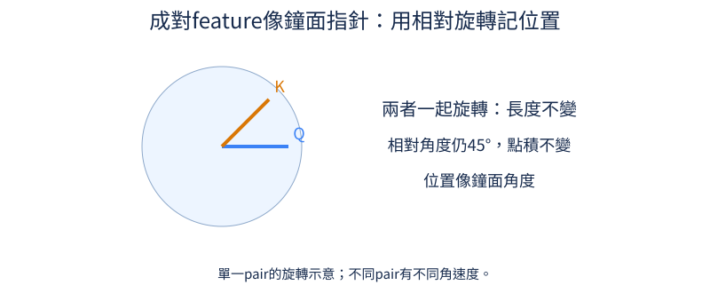
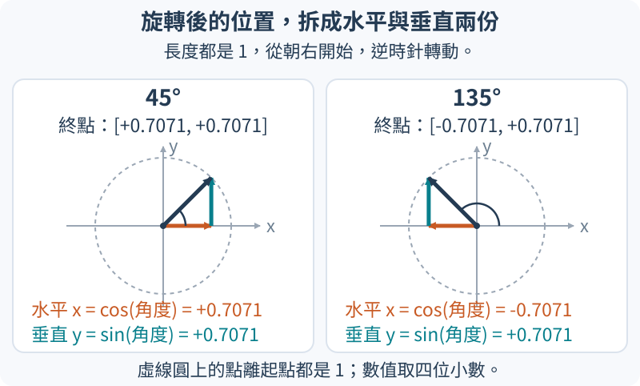

# 第 14 章：逐項理解現代文字模型的設計

完成[一層文字模型](04.md#4.5)後，我們可以逐項重新檢查它的設計：位置如何進入比對、數值尺度如何控制、特徵如何通過或受到另一組特徵調節，以及輸入輸出是否使用同一張表。本章每節固定一個小例子，先追蹤改動帶來的數值差別，再說明正式名稱。這些差別能在CPU上核對；它們對文字品質與速度的影響，則要在相同資料與資源條件下另做比較。

## 14.1 怎麼表示相對位置？

「小貓追小狗」與「小狗追小貓」包含同樣的詞，意思卻不同。注意力需要知道詞的先後，也常需要知道兩個詞相隔幾格。如果在句首加上「今天」，貓與狗的位置編號都增加一，但彼此距離並沒有變；我們希望用來比較兩者的某部分規則仍然相同。先回顧[注意力中的比對](03.md#3.2)與[位置資訊](04.md#4.1)：Query（Q）是當前位置提出的查詢向量，Key（K）是另一位置供它比對的向量，兩者點積提供注意力分數。

一個做法是把向量中的數字兩兩分組，當成平面上的箭頭。例如 `[1,0]` 是朝右、長度為一的箭頭。位置每往後一格，就把箭頭旋轉固定角度。假設每格轉45度，位置2的Q與位置5的K相差三格，旋轉角度差就是135度。若兩者都往後移十格，共同多轉450度，角度差仍是135度。箭頭長度也沒有變，因此兩者點積保持相同。這種把位置寫進旋轉的方式叫 Rotary Position Embedding，常縮寫為 RoPE。

下圖用一對數字形成的Q、K箭頭示意。圖中的45度是兩箭頭當下的夾角；一起轉動時夾角不變。實際模型有許多對數字，不同對使用不同轉速，並非所有位置都只用一個45度鐘面。



先把旋轉用到的數學名字對上箭頭。長度為一、朝右的箭頭是 `[1,0]`；把它轉到某個角度後，水平座標叫這個角度的餘弦（cos），垂直座標叫正弦（sin）。轉90度得到 `[0,1]`，所以這時cos為0、sin為1；轉45度得到約 `[0.7071,0.7071]`，轉135度則得到約 `[-0.7071,0.7071]`。Python的 `math.cos`、`math.sin` 幫我們求這些座標，不必先背三角函數表。它們接受的角度單位叫弧度：半圈180度記成π弧度，`math.pi` 是圓周率π，所以45度就是 `pi / 4` 弧度。

下圖的虛線圓標出長度為一的箭頭可以到達的終點；橘色水平箭頭是cos，青色垂直箭頭是sin。左右兩欄使用相同尺度：45度時水平向右為正，135度時水平向左為負，而兩者都向上，所以垂直值都是正的0.7071。



一般箭頭 `[x,y]` 可看成水平方向的x份加垂直方向的y份。旋轉後，原本水平的一份變成 `[cos,sin]`，原本垂直的一份變成 `[-sin,cos]`；把兩者分別乘上x、y再相加，新座標就是 `[cos*x-sin*y, sin*x+cos*y]`。例如 `[1,0]` 轉90度，代入cos=0、sin=1便得到 `[0,1]`。下面的 `rotate` 正是這兩行四則運算；它接受箭頭與位置，先把位置乘上每格的轉角，再求新座標。`score` 把兩支旋轉後的箭頭逐項相乘再相加，也就是點積。

```python
import math
import torch


def rotate(x, position):
    angle = position * math.pi / 4
    c, s = math.cos(angle), math.sin(angle)
    return torch.tensor([c * x[0] - s * x[1], s * x[0] + c * x[1]])


q = torch.tensor([1.0, 0.0])
k = torch.tensor([1.0, 0.0])


def score(a, b):
    return torch.dot(rotate(q, a), rotate(k, b)).item()


print(round(score(2, 5), 4))
print(round(score(12, 15), 4))
print(round(score(3, 5), 4))
```

前兩行都是 `-0.7071`，正是135度的餘弦；第三行是 `0.0`，因為只移Q，距離由三格變成兩格，角度差變成90度。負點積是比對分數，不是負機率，後續仍要透過softmax轉成注意力權重。這個實驗證明共同平移保留旋轉點積，不能證明模型在訓練未見過的超長文章上仍答得好：多種轉速與內容一起作用，還需要長度測試。

旋轉與相對點積的原始推導可讀[RoFormer第3.2節、式14–16](https://arxiv.org/pdf/2104.09864v5)。我們也另做了真正更新權重的比較：同一批TinyStories、寬度64、兩層、四頭，各更新240次，完整條件與六組結果在[T.8](../training.md#T.8)。一個[注意力頭](03.md#3.7)是用自己一組Q、K、V尋找關聯的單位，四頭表示同一層並排做四組這樣的查詢。這次文字按UTF-8編碼拆成byte，每個byte是0至255的數值單位，並另加一個表示故事結束的特殊目標；英文常用字母通常佔一byte，中文字通常需要多個byte，所以分母不是中文字數。基準與RoPE的驗證代價分別為2.26331與1.74158，最後檢查為2.29163與1.77812；分母分別是39,256與41,914個下一byte／結束目標，越低表示這批原文更容易預測。

此RoPE組移除128×64的位置表，總參數由141,568減為133,376，並未保持參數量相同。它在這次短訓的留出代價較低，但同一個最後檢查提示 `Once upon a time, there ` 的續寫仍是 `was a loked there was a bough a `。一次小模型比較既沒有證明故事寫得好，也沒有測試超過128位置的外推。

練習把最後一個 `print` 內的 `score(3, 5)` 改成 `score(22, 25)`，保留外面的 `print` 與 `round`，也就是 `print(round(score(22, 25), 4))`。先預測是否等於前兩行，再執行核對；接著只把其中的引數改成 `score(22, 26)`。你應能用「相隔三格或四格」解釋結果，而不用重新記一個位置表。

## 14.2 正規化能否簡化？

如果一個位置的三個特徵是 `[2,2,2]`，模型下一層收到的是「三者都同樣大」以及「共同偏向正值」兩種資訊。正規化要控制數值尺度，但控制時是否應抹掉共同偏移？這不是純粹少做一行運算的問題：兩種規則保留的資訊不同。前置是[各位置的數值尺度](04.md#4.3)；這裡只回顧必要部分：特徵是同一位置向量的各項數字，正規化沿這些項目進行，不把其他時間位置一起算進來。

LayerNorm先算平均，逐項減掉平均，再除以標準差。對 `[2,2,2]` 而言，平均是2，減完得到全零；雖然標準差也是零，分母的小常數能避免除以零。RMSNorm採用另一規則：把每項平方，求平均，再開平方根，所得稱為均方根（Root Mean Square，RMS）。此例平方都是4，均方根為2，直接用原數字除以2便得到 `[1,1,1]`。它保留共同偏移，不先搬到平均零。

圖中的卡片 `[1,2,3]` 表示同一位置的三個特徵，箭頭依序通過尺度計算、正規化和可學縮放。gamma是逐項乘上的係數，beta是逐項加上的偏移；標準LayerNorm可有兩者，常見RMSNorm只有gamma。這裡都固定gamma為1，LayerNorm的beta為0，先看兩條規則本身。


下列輸入每一列代表一個位置，三欄代表三項特徵。`mean(..., keepdim=True)`保留一欄，方便將同一個分母除到該列三個數字上。`-1`指定最後一個軸，也就是三個特徵；`(3,)`則告訴LayerNorm對最後三項特徵做正規化。`eps`是避免全零輸入除以零的小常數，並不是要把正常數字改成零。

```python
import torch
import torch.nn.functional as F

x = torch.tensor([[2.0, 2.0, 2.0], [1.0, 2.0, 3.0]])
eps = 1e-5
ln = F.layer_norm(x, (3,), eps=eps)
rms = x / torch.sqrt(x.square().mean(-1, keepdim=True) + eps)
print("LN", ln.round(decimals=4))
print("RMS", rms.round(decimals=4))
```

LN第一列為全零，第二列約 `[-1.2247,0,1.2247]`：1和3位於平均2的兩側。RMS第一列約全一，第二列約 `[0.4629,0.9258,1.3887]`，因為分母是 `sqrt(14/3)`，約2.1602。兩者形狀相同，數值與意義卻不同；把訓練好的LayerNorm直接換成RMSNorm，後面的權重未必能適應。省去平均與偏移可能簡化運算，但品質與速度需要在相同模型條件下量測。

[RMSNorm原論文第4節、式4](https://arxiv.org/pdf/1910.07467v1)給出只使用均方根的規則；論文中的速度結果仍取決於其模型與硬體。我們在[T.8](../training.md#T.8)的L4短訓中，LayerNorm與RMSNorm的驗證代價為2.26331與2.25913，最後檢查為2.29163與2.28631。bias就是前面的可學偏移beta；此模型五處正規化各有64個偏移，移除它們後RMSNorm少 `5×64=320` 個參數。每步暖機後中位數卻是13.062與13.952毫秒，這輪沒有測到速度收益；計時含向前、反向、梯度核對與更新，不是只量一個正規化函式。這個很小的代價差也只有一個隨機種子：種子是產生隨機數的起始設定，固定它可重現模型初始化及抽樣的隨機序列；換種子可能換掉起點與看到例子的次序，結果也可能改變。這次只跑一個種子，還不能把小差距當成穩定的品質優勢，需換種子重跑才能檢查。

練習將 `x` 改成 `x + 10`，先預測哪一種輸出不變。重跑後比較：LayerNorm會消去新增的共同平均，RMSNorm只調尺度，因此通常改變。這能說明「正規化」這個名字並不保證各種方法等價。

## 14.3 Q／K 的尺度怎麼影響注意力？

你想在兩個候選位置中找出與當前問題相近的一個。如果它們方向一樣接近，僅有一個向量的數字放大100倍，注意力會不會偏向它？先回顧[查詢與被查詢](03.md#3.3)：Query（Q）與Key（K）是同一組特徵轉換出的兩種向量，點積逐項相乘再相加。點積除了反映方向，也會隨向量長度增加，因此高分未必只代表方向更合適。

取 `Q=[1,1]`，兩個K分別是 `[1,0]` 和 `[0,100]`。Q位在對角方向，與水平、垂直方向的夾角都45度；但點積分別為1和100。softmax把分數轉成總和為一的非負權重：先對每個分數s求 `exp(s)`，也就是以約2.718的數e為底、取s次方，再除以這些結果的總和。例如分數 `[1,0]` 先變成約 `[2.718,1]`，各除以3.718，就得到約 `[0.7311,0.2689]`。`[1,100]` 的第二項取指數後大得多，第二個位置便幾乎獨占注意力。這是長度改變造成的偏好，不是我們改了查詢或候選的方向。

可以先將Q、K各自除以自己的長度。例如Q的長度是 `sqrt(1²+1²)=sqrt(2)`，會變成 `[0.7071,0.7071]`；兩個K則變成 `[1,0]` 與 `[0,1]`。這叫L2 normalization，正規化後的點積就是夾角餘弦。兩個分數現在同為0.7071，softmax得到各0.5。這只是QK正規化的一種選擇：其他模型可能採用[均方根尺度](14.md#14.2)，應清楚說明實際規則。

```python
import torch
import torch.nn.functional as F

q = torch.tensor([[1.0, 1.0]])
k = torch.tensor([[1.0, 0.0], [0.0, 100.0]])
raw = q @ k.T
unit = F.normalize(q, dim=-1) @ F.normalize(k, dim=-1).T
print("原分數", raw.tolist())
print("原權重", raw.softmax(-1).tolist())
print("正規化分數", unit.round(decimals=4).tolist())
print("正規化權重", unit.softmax(-1).tolist())
print("有方向差的權重", torch.tensor([1.0, 0.0]).mul(4).softmax(-1).tolist())
```

輸入是一列Q與兩列K，`k.T`把K轉置，讓矩陣乘法一次比較兩個候選。`dim=-1`指定沿最後一軸：在 `F.normalize` 收到的q、k裡，最後一軸是每個向量的兩項特徵，所以各向量除以自己的長度；若沿候選軸正規化，就變成另一個問題。乘完得到的raw與unit形狀卻是 `[1,2]`，這裡一列列出兩個候選的分數，所以 `softmax(-1)` 的最後一軸是候選，不再是特徵。同樣寫 `-1`，仍要先看目前這張表各軸代表什麼。前三種結果應對照上述手算：原分數 `[1,100]`，原權重接近 `[0,1]`，正規化後權重 `[0.5,0.5]`。

最後一行另外示範「控制分數尖銳程度」：假設兩方向分數為1與0，乘4後softmax約 `[0.9820,0.0180]`，比不乘4時的 `[0.7311,0.2689]`更集中。這個乘數常稱scale；若用除數表達，便稱temperature（溫度），溫度越低越集中。正規化拿掉長度差後，仍能另行設定或學習這個尺度，讓模型調整選擇強度。

本節只有局部方向與尺度的CPU示範。[T.8](../training.md#T.8)的正式modern比較沒有QK normalization組；TinyLM也沒有對應的整模型開關。因此不能由本節的兩候選數字，宣稱整個模型訓練更穩、速度更快或文字品質更好。

練習只把K中的100改成0.1，先預測原權重如何變、正規化權重是否變。核對後應看見原分數變成 `[1,0.1]`，而兩個方向相同，正規化仍各0.5。不要把這個例子推成「長度一定無用」；模型可能學會用長度表達訊息，改規則需要重新訓練與比較。

## 14.4 MLP activation 可以怎麼選？

假設一層模型先把「這裡需要某項特徵」算成數字，輸出可能是負的、零或正的。接下來應直接把它送出，還是改變不同大小的通過方式？先只看一個數字x：先乘2、再乘3，總能改寫成一次乘6，輸入1與2時輸出6與12，始終按同一倍數變化。如果在中間平方，輸出卻變成 `3×(2x)²`，輸入1與2時是12與48；第一個輸入需要乘12，第二個需要乘24，已不能用同一倍數描述。前者叫線性，後者叫非線性，畫出輸入與輸出的關係也不再是原來那種直線。模型中矩陣乘法只是把這種乘係數、再相加的規則擴展到一列數字；若各層都只有矩陣乘法，連續兩次仍可合成一次，增加層數也不能提供這種新關係。[混合位置後處理特徵](04.md#4.4)所用的MLP，就是在矩陣乘法之間加入非線性函數；activation（啟動函數）指的便是這個逐項改數字的步驟。

用三個容易追蹤的輸入 `[-1,0,2]` 看兩種選擇。ReLU先把負數改成零、保留正數，因此得到 `[0,0,2]`；ReLU²再平方，得到 `[0,0,4]`。GELU則平滑地縮小數字。它可寫成 `x × Φ(x)`：把標準常態分布想成以0為中心、左右對稱的鐘形分布，Φ(x)是落在x及其左邊的比例，所以介於0和1。x很負時左邊只剩很少比例，Φ接近0；x很正時幾乎全在左邊，Φ接近1。對x=-1，Φ約0.1587，輸出約-0.1587；對x=2，Φ約0.9772，輸出約1.9545。這個公式用來理解通過的比例，實際數值交給下面的 `F.gelu` 計算。負值沒有整段硬切成零，而大正值接近原值。

下面擴成五個固定輸入，避免隨機值讓重點難辨。`F`是PyTorch提供常用函數的模組；`F.gelu`實作上述GELU，`F.relu(x).square()`清楚分成截掉負值、再平方兩步。所有函數都逐項工作，輸入與輸出形狀相同。

```python
import torch
import torch.nn.functional as F

x = torch.tensor([-2.0, -1.0, 0.0, 1.0, 2.0])
print("輸入", x.tolist())
print("GELU", F.gelu(x).round(decimals=4).tolist())
print("ReLU平方", F.relu(x).square().tolist())
```

GELU約輸出 `[-0.0455,-0.1587,0,0.8413,1.9545]`；ReLU²為 `[0,0,0,1,4]`。觀察x=-2與-1：GELU並不是把所有負值乘同一個常數，更大的負值反而更接近零。觀察正側：ReLU²在x=2時變成4，比x=1時的1大四倍，因此對大正值更敏感。這些數字說明函數如何處理訊號，還沒有說明它們在文字任務上誰比較好。

把啟動函數換到訓練好的模型，會改變下一層收到的尺度和負值分布。即使新函數不增加參數，也可能需要讓權重重新適應。公平比較應固定訓練資料、層數、特徵寬度與訓練步數，分別訓練後再比較驗證loss（未用於更新權重的資料上，預測答案的誤差）及耗時。單看函數名字、單次輸出或省一個運算，不能替整個模型排名。

[T.8](../training.md#T.8)另保持全部141,568個參數與抽題順序，分別用GELU、ReLU²更新240次。驗證代價為2.26331與2.23590，最後檢查為2.29163與2.26438；每步中位數13.062與12.893毫秒。ReLU²在這輪略低、略快，但最後檢查的第一筆仍續寫 `was a was the the the the ar and`，不能把更低的代價換成「已能寫好故事」。小時間差與單一種子（產生隨機初始化與抽樣序列的起始設定）也需要更多重複測量才適合外推。

練習把 `x` 改成 `[-4,-2,0,2,4]`。執行前先預測ReLU²最後一項是16，GELU最後一項接近4；再核對負側是否依然保留很小的負數。若畫圖，橫軸應是輸入，縱軸應是各函數輸出，不能把這條曲線當作訓練品質圖。

## 14.5 怎麼讓特徵控制另一組特徵？

一個特徵很強，不代表在每段文字裡都應使用它。例如模型辨認出「可能是人名」的訊號，但上下文顯示這是商品名稱，便需要另一組訊號調整它。普通MLP先算出內容，再經[啟動函數](14.md#14.4)改變大小；我們也能準備兩條路，一條產生內容，另一條根據同一個輸入決定每項內容要放大、縮小或反號。後者叫gate（閘門），逐項相乘的組合叫gating。

先用確定的數字把這件事拆開。內容路徑輸出 `[2,2,2]`，閘門路徑輸出 `[-2,0,2]`。我們先對閘門套SiLU：它把x乘上 `sigmoid(x)`，而sigmoid把任意數字變成0到1之間。-2的sigmoid約0.1192，SiLU約-0.2384；0變0；2變1.7616。再與內容逐項相乘，得到約 `[-0.4768,0,3.5232]`。第一項反號、第二項消失、第三項變大。

這個組合稱為SwiGLU，意指使用SiLU的閘門式線性單元。名稱裡的閘門容易讓人誤以為最後係數是0到1的機率；其實SiLU仍含原來的x，輸出可以負、也可以大於1。完整層先把寬度d的輸入投影成寬度h的閘門和內容，兩者相乘後，再投影回d，讓後面的模型維持原形狀。

```python
import torch
import torch.nn.functional as F

content = torch.tensor([2.0, 2.0, 2.0])
gate = torch.tensor([-2.0, 0.0, 2.0])
factor = F.silu(gate)
print("閘門係數", factor.round(decimals=4).tolist())
print("調節內容", (content * factor).round(decimals=4).tolist())
d, h = 8, 16
print("普通MLP權重數", d * h + h * d)
print("SwiGLU權重數", d * h + d * h + h * d)
```

前三個tensor是可追蹤的小例子；`content * factor`是相同位置逐項乘，不是矩陣乘法。兩行輸出應是上述係數和內容。最後兩行不建立隨機模型，而直接數矩陣裡的數字：普通MLP有 `d×h` 和 `h×d` 兩張權重表，得到256；SwiGLU多了一張 `d×h` 的閘門表，得到384。這裡不使用bias（每項額外加的常數），所以數量只算矩陣權重。

同樣h不等於同樣模型大小。若要公平比較，可把SwiGLU的h減到普通MLP的約三分之二，讓三張表的總數接近原來兩張表，再分別訓練並量測。這也說明架構設計常需要同時考慮「函數做了什麼」與「花多少參數和計算」，不能只把零件換上去就宣稱有收益。

這個三表結構見[GLU Variants Improve Transformer第2節、式5–6](https://arxiv.org/pdf/2002.05202v1)；原文也明確縮小中間寬度以匹配參數與計算。我們的[T.8](../training.md#T.8)則保留各組中間寬度256，SwiGLU連bias共174,848個參數，基準為141,568。相同240次更新後，SwiGLU驗證代價2.25444、最後檢查2.28009，略低於基準2.26331與2.29163；每步13.336毫秒，基準13.062毫秒。這回答的是固定資料與更新預算下換上較多參數的閘門，並非重現論文的等參數比較。

練習把gate改成全零，先預測內容是否仍為 `[2,2,2]`，再核對輸出。接著只改第一項為2，確認只有第一項被放大。你不需要訓練模型，就能先分辨逐特徵控制與把整個向量乘同一音量的差別。

## 14.6 輸入輸出權重應該共享嗎？

模型讀到「貓」時，要從詞表查出代表貓的向量；準備輸出下一字時，又要用當前向量替「貓、狗、車」等候選打分。這兩件事都需要一張「每個token對應一列數字」的表，能否只存一張？前置是[字如何變成向量](02.md#2.1)和[下一字分數](04.md#4.6)。token是文字切分後的單位，詞表是所有可用單位的清單；輸入查表取一列，輸出則拿當前向量與各列做點積。

假設詞表只有三項、每項用兩個特徵，輸入表E是三列兩欄，共六個權重。若輸出再存一張同形狀的表，就多六個。Weight tying（權重共享）把輸出層的權重設成同一張E，輸出分數就是 `h @ E.T`，h是當前兩個特徵；`@`是矩陣乘法，`.T`將E的列與欄對調，讓h一次與各候選做點積。點積就是同位置的數字先相乘，再把乘積相加：若E三列為 `[1,0]`、`[0,1]`、`[1,1]`，h為 `[2,1]`，三個分數分別是 `2×1+1×0=2`、`2×0+1×1=1`、`2×1+1×1=3`。`h @ E.T` 是一次完成這三列同樣的運算，並沒有多一條打分規則。這個點積仍是分數，還沒有轉成機率。

關鍵在於「同一張」。複製E的初值到另一張表，只是此刻數字相同；日後兩張表收到不同學習訊號，仍會各自改變。共享則是兩個模組引用同一個Parameter，Parameter是PyTorch用來記錄可學數字的物件，因此更新時只更新這一份。下面刻意建立共享、複製兩種輸出，直接觀察差別。

```python
import torch
from torch import nn

embedding = nn.Embedding(3, 2)
with torch.no_grad():
    embedding.weight.copy_(torch.tensor([[1.0, 0.0], [0.0, 1.0], [1.0, 1.0]]))
tied = nn.Linear(2, 3, bias=False)
tied.weight = embedding.weight
copied = nn.Linear(2, 3, bias=False)
with torch.no_grad():
    copied.weight.copy_(embedding.weight)
h = torch.tensor([[2.0, 1.0]])
print("原分數", tied(h).tolist(), copied(h).tolist())
print("同一物件", tied.weight is embedding.weight, copied.weight is embedding.weight)
with torch.no_grad():
    embedding.weight[0, 0] += 1
print("改表後", tied(h).tolist(), copied(h).tolist())
```

輸入h是一列兩欄，`nn.Linear(2,3)`將它轉成三個候選分數。`bias=False`省去額外偏移，使結果只看權重表。`no_grad`暫停記錄學習用的導數，讓我們直接設初值和手動改數字。第一行兩者都是 `[[2,1,3]]`，第二行是 `True False`。修改第一列第一項之後，共享輸出變成 `[[4,1,3]]`，複製輸出仍是 `[[2,1,3]]`，因為只有共享版本真的讀到被改的同一份數字。

真實模型若詞表大小V、特徵寬度D，共享可省 `V×D` 個權重；但輸入表和輸出表也失去各自調整的自由度。這是模型設計選擇，不能單憑省參數斷言品質更好。模型儲存、載入或量化（改用較少位元表示權重）後，也應再次核對共享關係，以免轉換程序建立了兩份表。

[Press與Wolf的原論文第3節](https://arxiv.org/pdf/1608.05859v3)說明輸入與輸出表的綁定。我們在[T.8](../training.md#T.8)保存的共享組有124,672個參數，比基準少264×64=16,896個。240次更新後，驗證代價2.36276、最後檢查2.38422，這輪高於基準2.26331與2.29163。

還要看起點：共享組把原本獨立的輸出表改成embedding那份初值，訓練前代價43.87647，基準只有5.76007。共有形狀的其他表雖然沿用同一初值，輸出分布已不同，所以不能用這次短訓斷言共享本身傷害品質。省下的權重數是可核對的結構事實；需要多少訓練適應、最後品質如何，仍是另一個實驗問題。

練習只把 `embedding.weight[0,0] += 1` 改成第二列第二項加1。先用h第二項是1預測共享的第二個分數只增加1，再執行核對。若只看兩個表最初數字相等，會漏掉這節最重要的物件共享差別。
