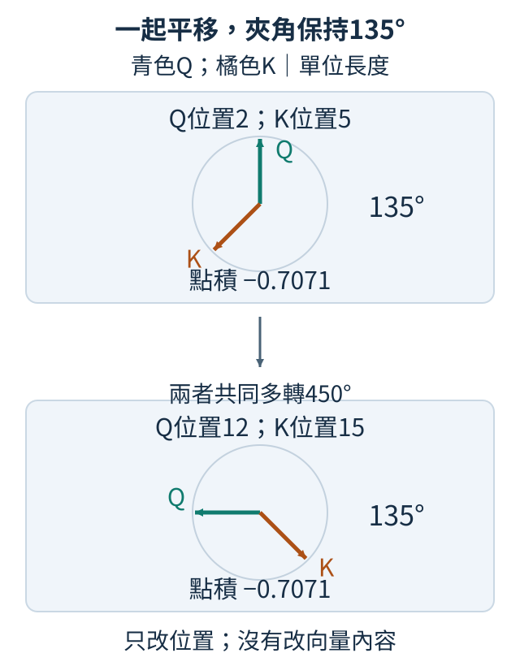
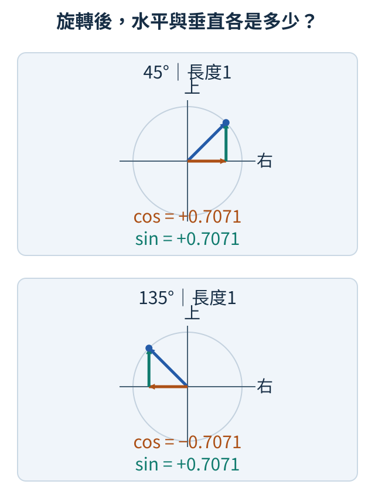
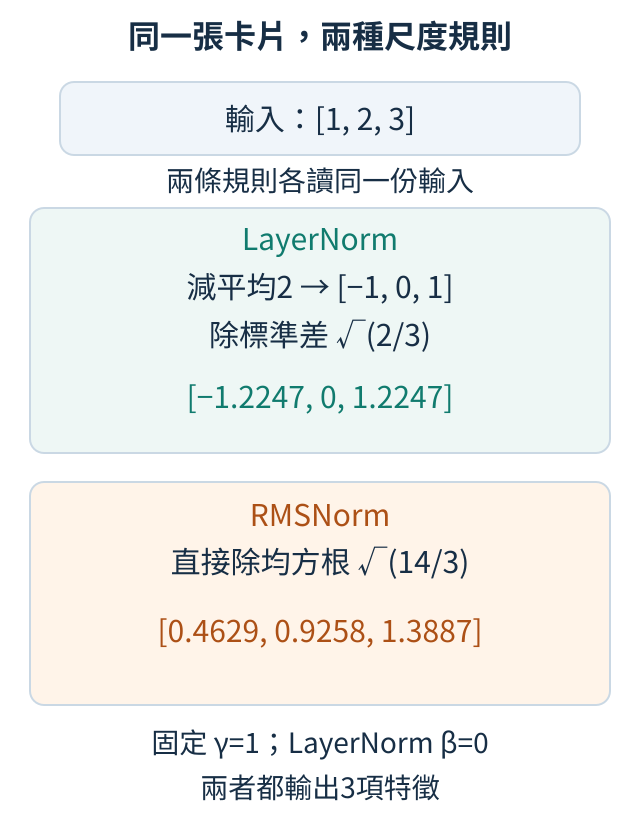
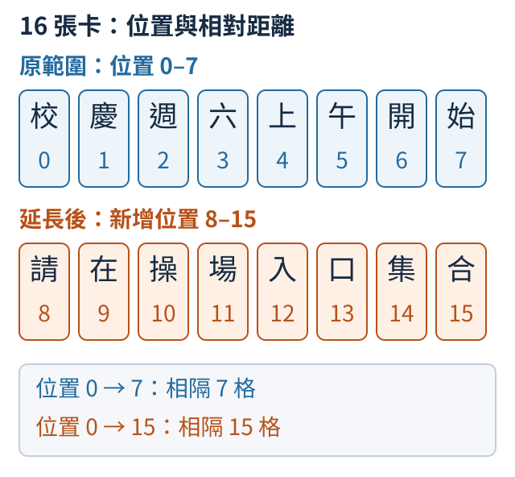
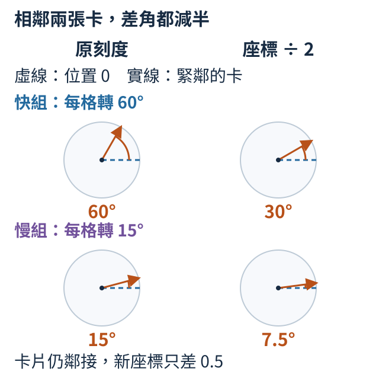
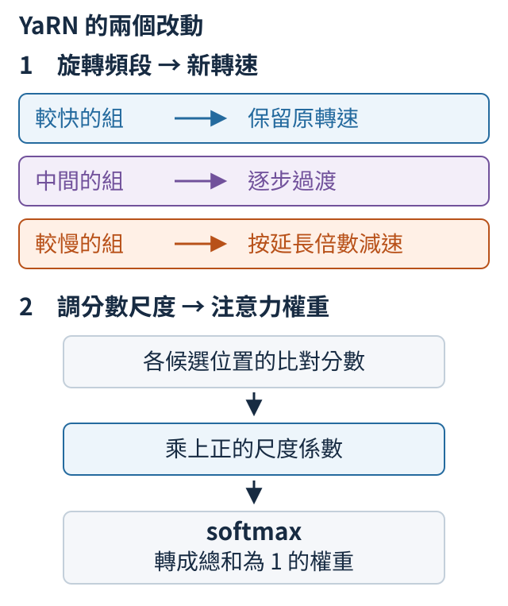

# 第 14 章：逐項理解現代文字模型的設計

「小貓追小狗」換成「小狗追小貓」，詞沒變，意思卻變了。完成[一層文字模型](04.md#4.5)後，我們從這種小差別重新檢查設計：位置怎麼進入比對、數值尺度怎麼控制、哪些特徵通過，以及兩張字表能否共享。每節先用固定數字追蹤一個改動。最後把位置範圍拉長，沿著16張卡片理解位置插值與不同轉速的調整；能算出座標，和模型能讀懂長文，仍是需要分別回答的問題。

## 14.1 兩個詞一起往後移，位置比對能保持嗎？

「小貓追小狗」與「小狗追小貓」包含同樣的詞，意思卻不同。注意力需要知道詞的先後，也常需要知道兩個詞相隔幾格。如果在句首加上「今天」，貓與狗的位置編號都增加一，但彼此距離並沒有變；我們希望用來比較兩者的某部分規則仍然相同。先回顧[注意力中的比對](03.md#3.2)與[位置資訊](04.md#4.1)：Query（Q）是當前位置提出的查詢向量，Key（K）是另一位置供它比對的向量，兩者點積提供注意力分數。

這裡先固定Q、K的內容，只改它們所在的位置。一個做法是把向量中的數字兩兩分組，當成平面上的箭頭。例如 `[1,0]` 是朝右、長度為一的箭頭。位置每往後一格，就把箭頭旋轉固定角度。假設每格轉45度，位置2的Q與位置5的K相差三格，旋轉角度差就是135度。若兩者都往後移十格，共同多轉450度，角度差仍是135度。箭頭長度也沒有變，因此兩者點積保持相同。這種把位置寫進旋轉的方式叫 Rotary Position Embedding，常縮寫為 RoPE。

下圖沿用位置2的Q與位置5的K，兩箭頭夾135度。把兩個位置各加10後，它們共同多轉450度，夾角與點積仍相同。實際模型有許多對數字，不同對使用不同轉速，並非所有位置都只用這一組每格45度的指針。



先把旋轉用到的數學名字對上箭頭。長度為一、朝右的箭頭是 `[1,0]`；把它轉到某個角度後，水平座標叫這個角度的餘弦（cos），垂直座標叫正弦（sin）。轉90度得到 `[0,1]`，所以這時cos為0、sin為1；轉45度得到約 `[0.7071,0.7071]`，轉135度則得到約 `[-0.7071,0.7071]`。Python的 `math.cos`、`math.sin` 幫我們求這些座標，不必先背三角函數表。它們接受的角度單位叫弧度：半圈180度記成π弧度，`math.pi` 是圓周率π，所以45度就是 `pi / 4` 弧度。

下圖的圓標出長度為一的箭頭可以到達的終點；橘色水平箭頭是cos，青色垂直箭頭是sin。上下兩圖使用相同尺度：45度時水平向右為正，135度時水平向左為負，而兩者都向上，所以垂直值都是正的0.7071。



一般箭頭 `[x,y]` 可看成水平方向的x份加垂直方向的y份。旋轉後，原本水平的一份變成 `[cos,sin]`，原本垂直的一份變成 `[-sin,cos]`；把兩者分別乘上x、y再相加，新座標就是 `[cos*x-sin*y, sin*x+cos*y]`。例如 `[1,0]` 轉90度，代入cos=0、sin=1便得到 `[0,1]`。下面的 `rotate` 正是這兩行四則運算；它接受箭頭與位置，先把位置乘上每格的轉角，再求新座標。`score` 把兩支旋轉後的箭頭逐項相乘再相加，也就是點積。

```python
import math
import torch


def rotate(x, position):
    angle = position * math.pi / 4
    c, s = math.cos(angle), math.sin(angle)
    return torch.tensor([c * x[0] - s * x[1], s * x[0] + c * x[1]])


q = torch.tensor([1.0, 0.0])
k = torch.tensor([1.0, 0.0])


def score(a, b):
    return torch.dot(rotate(q, a), rotate(k, b)).item()


print(round(score(2, 5), 4))
print(round(score(12, 15), 4))
print(round(score(3, 5), 4))
```

前兩行都是 `-0.7071`，正是135度的餘弦；第三行是 `0.0`，因為只移Q，距離由三格變成兩格，角度差變成90度。負點積是比對分數，不是負機率，後續仍要透過softmax轉成注意力權重。這個實驗證明共同平移保留旋轉點積，不能證明模型在訓練未見過的超長文章上仍答得好：多種轉速與內容一起作用，還需要長度測試。

練習把最後一個 `print` 內的 `score(3, 5)` 改成 `score(22, 25)`，保留外面的 `print` 與 `round`，也就是 `print(round(score(22, 25), 4))`。先預測是否等於前兩行，再執行核對；接著只把其中的引數改成 `score(22, 26)`。你應能用「相隔三格或四格」解釋結果，而不用重新記一個位置表。

<details>
<summary>選讀：來源、量測條件與原始實報</summary>

旋轉與相對點積的原始推導可讀[RoFormer第3.2節、式14–16](https://arxiv.org/pdf/2104.09864v5)。我們也另做了真正更新權重的比較：同一批TinyStories、寬度64、兩層、四頭，各更新240次，完整條件與六組結果在[T.8](../training.md#T.8)。一個[注意力頭](03.md#3.7)是用自己一組Q、K、V尋找關聯的單位，四頭表示同一層並排做四組這樣的查詢。這次文字按UTF-8編碼拆成byte，每個byte是0至255的數值單位，並另加一個表示故事結束的特殊目標；英文常用字母通常佔一byte，中文字通常需要多個byte，所以分母不是中文字數。基準與RoPE的驗證代價分別為2.26331與1.74158，最後檢查為2.29163與1.77812；兩個模型在驗證集各計39,256個下一byte／結束目標，在最後檢查集各計41,914個目標。平均代價越低，表示這批原文更容易預測。

此RoPE組移除128×64的位置表，總參數由141,568減為133,376，並未保持參數量相同。它在這次短訓的留出代價較低，但同一個最後檢查提示 `Once upon a time, there ` 的續寫仍是 `was a loked there was a bough a `。一次小模型比較既沒有證明故事寫得好，也沒有測試超過128位置的外推。

</details>

## 14.2 正規化能否簡化？

同一位置的三個特徵是 `[2,2,2]`。我們想控制它的數值尺度，卻有兩種可能的答案：先拿掉共同平均，會得到 `[0,0,0]`；只按共同大小縮小，會接近 `[1,1,1]`。前者抹掉「一起偏向正值」的資訊，後者保留它，因此兩種正規化不是同一個規則少做一行運算。這裡的特徵是同一位置向量的各項數字；尺度沿這三項計算，不把其他時間位置混進來，做法可回顧[4.3](04.md#4.3)。

LayerNorm先算平均，逐項減掉平均，再除以標準差。對 `[2,2,2]` 而言，平均是2，減完得到全零；雖然標準差也是零，分母的小常數能避免除以零。RMSNorm採用另一規則：把每項平方，求平均，再開平方根，所得稱為均方根（Root Mean Square，RMS）。此例平方都是4，均方根為2，直接用原數字除以2便得到 `[1,1,1]`。它保留共同偏移，不先搬到平均零。

圖中的卡片 `[1,2,3]` 表示同一位置的三個特徵。上下兩塊分別列出先減平均再除標準差，以及直接除均方根的結果。完整層還可學習逐項縮放：gamma是每項乘上的係數，beta是每項加上的偏移；標準LayerNorm可有兩者，常見RMSNorm只有gamma。這裡都固定gamma為1，LayerNorm的beta為0，先看兩條規則本身。



下列輸入每一列代表一個位置，三欄代表三項特徵。`mean(..., keepdim=True)`保留一欄，方便將同一個分母除到該列三個數字上。`-1`指定最後一個軸，也就是三個特徵；`(3,)`則告訴LayerNorm對最後三項特徵做正規化。`eps`是避免全零輸入除以零的小常數，並不是要把正常數字改成零。

```python
import torch
import torch.nn.functional as F

x = torch.tensor([[2.0, 2.0, 2.0], [1.0, 2.0, 3.0]])
eps = 1e-5
ln = F.layer_norm(x, (3,), eps=eps)
rms = x / torch.sqrt(x.square().mean(-1, keepdim=True) + eps)
print("LN", ln.round(decimals=4))
print("RMS", rms.round(decimals=4))
```

LN第一列為全零，第二列約 `[-1.2247,0,1.2247]`：1和3位於平均2的兩側。RMS第一列約全一，第二列約 `[0.4629,0.9258,1.3887]`，因為分母是 `sqrt(14/3)`，約2.1602。兩者形狀相同，數值與意義卻不同；把訓練好的LayerNorm直接換成RMSNorm，後面的權重未必能適應。省去平均與偏移可能簡化運算，但品質與速度需要在相同模型條件下量測。

練習將 `x` 改成 `x + 10`，先預測哪一種輸出不變。重跑後比較：LayerNorm會消去新增的共同平均，RMSNorm只調尺度，因此通常改變。這能說明「正規化」這個名字並不保證各種方法等價。

<details>
<summary>選讀：來源、量測條件與原始實報</summary>

[RMSNorm原論文第4節、式4](https://arxiv.org/pdf/1910.07467v1)給出只使用均方根的規則；論文中的速度結果仍取決於其模型與硬體。我們在[T.8](../training.md#T.8)的L4短訓中，LayerNorm與RMSNorm的驗證代價為2.26331與2.25913，最後檢查為2.29163與2.28631。bias就是前面的可學偏移beta；此模型五處正規化各有64個偏移，移除它們後RMSNorm少 `5×64=320` 個參數。每步暖機後中位數卻是13.062與13.952毫秒，這輪沒有測到速度收益；計時含向前、反向、梯度核對與更新，不是只量一個正規化函式。這個很小的代價差也只有一個隨機種子：種子是產生隨機數的起始設定，固定它可重現模型初始化及抽樣的隨機序列；換種子可能換掉起點與看到例子的次序，結果也可能改變。這次只跑一個種子，還不能把小差距當成穩定的品質優勢，需換種子重跑才能檢查。

</details>

## 14.3 Q／K 的尺度怎麼影響注意力？

取一個查詢 `Q=[1,1]`，候選是水平的 `[1,0]` 與垂直的 `[0,100]`。Q與兩個方向都夾45度，我們想比較方向是否合適，第二個候選卻可能因長度大而獨占注意力。原因是[Q與K的比對](03.md#3.3)用點積：對應數字逐項相乘再相加，既反映方向，也受向量長度影響。本節先讓兩個候選回到相同長度，再看分配是否改變。

取 `Q=[1,1]`，兩個K分別是 `[1,0]` 和 `[0,100]`。Q位在對角方向，與水平、垂直方向的夾角都45度；但點積分別為1和100。softmax把分數轉成總和為一的非負權重：先對每個分數s求 `exp(s)`，也就是以約2.718的數e為底、取s次方，再除以這些結果的總和。例如分數 `[1,0]` 先變成約 `[2.718,1]`，各除以3.718，就得到約 `[0.7311,0.2689]`。`[1,100]` 的第二項取指數後大得多，第二個位置便幾乎獨占注意力。這是長度改變造成的偏好，不是我們改了查詢或候選的方向。

可以先將Q、K各自除以自己的長度。例如Q的長度是 `sqrt(1²+1²)=sqrt(2)`，會變成 `[0.7071,0.7071]`；兩個K則變成 `[1,0]` 與 `[0,1]`。這叫L2 normalization，正規化後的點積就是夾角餘弦。兩個分數現在同為0.7071，softmax得到各0.5。這只是QK正規化的一種選擇：其他模型可能採用[均方根尺度](14.md#14.2)，應清楚說明實際規則。

```python
import torch
import torch.nn.functional as F

q = torch.tensor([[1.0, 1.0]])
k = torch.tensor([[1.0, 0.0], [0.0, 100.0]])
raw = q @ k.T
unit = F.normalize(q, dim=-1) @ F.normalize(k, dim=-1).T
print("原分數", raw.tolist())
print("原權重", raw.softmax(-1).tolist())
print("正規化分數", unit.round(decimals=4).tolist())
print("正規化權重", unit.softmax(-1).tolist())
print("有方向差的權重", torch.tensor([1.0, 0.0]).mul(4).softmax(-1).tolist())
```

輸入是一列Q與兩列K，`k.T`把K轉置，讓矩陣乘法一次比較兩個候選。`dim=-1`指定沿最後一軸：在 `F.normalize` 收到的q、k裡，最後一軸是每個向量的兩項特徵，所以各向量除以自己的長度；若沿候選軸正規化，就變成另一個問題。乘完得到的raw與unit形狀卻是 `[1,2]`，這裡一列列出兩個候選的分數，所以 `softmax(-1)` 的最後一軸是候選，不再是特徵。同樣寫 `-1`，仍要先看目前這張表各軸代表什麼。前三種結果應對照上述手算：原分數 `[1,100]`，原權重接近 `[0,1]`，正規化後權重 `[0.5,0.5]`。

最後一行另外示範「控制分數尖銳程度」：假設兩方向分數為1與0，乘4後softmax約 `[0.9820,0.0180]`，比不乘4時的 `[0.7311,0.2689]`更集中。這個乘數常稱scale；若用除數表達，便稱temperature（溫度），溫度越低越集中。正規化拿掉長度差後，仍能另行設定或學習這個尺度，讓模型調整選擇強度。

這個局部例子把向量長度的影響拿掉，讓兩個相同夾角得到相同比例。整個模型是否需要長度傳達訊息，則是設計與訓練問題；不能只由這兩個候選替不同正規化方法排名。

練習只把K中的100改成0.1，先預測原權重如何變、正規化權重是否變。核對後應看見原分數變成 `[1,0.1]`，而兩個方向相同，正規化仍各0.5。不要把這個例子推成「長度一定無用」；模型可能學會用長度表達訊息，改規則需要重新訓練與比較。

<details>
<summary>選讀：這個局部例子與整模型比較的範圍</summary>

本節只有局部方向與尺度的CPU示範。[T.8](../training.md#T.8)的正式modern比較沒有QK normalization組；TinyLM也沒有對應的整模型開關。因此不能由本節的兩候選數字，宣稱整個模型訓練更穩、速度更快或文字品質更好。

</details>

## 14.4 逐項改數字，為何能增加表達方式？

一個輸入先乘2、再乘3，和中間插入平方，差在哪裡？先只看一個數字x：先乘2、再乘3，總能改寫成一次乘6，輸入1與2時輸出6與12，始終按同一倍數變化。如果在中間平方，輸出卻變成 `3×(2x)²`，輸入1與2時是12與48；第一個輸入需要乘12，第二個需要乘24，已不能用同一倍數描述。前者叫線性，後者叫非線性，畫出輸入與輸出的關係也不再是原來那種直線。模型中矩陣乘法只是把這種乘係數、再相加的規則擴展到一列數字；若各層都只有矩陣乘法，連續兩次仍可合成一次，增加層數也不能提供這種新關係。[混合位置後處理特徵](04.md#4.4)所用的MLP，就是在矩陣乘法之間加入非線性函數；activation（啟動函數）指的便是這個逐項改數字的步驟。

用三個容易追蹤的輸入 `[-1,0,2]` 看兩種選擇。ReLU先把負數改成零、保留正數，因此得到 `[0,0,2]`；ReLU²再平方，得到 `[0,0,4]`。GELU則平滑地縮小數字。它可寫成 `x × Φ(x)`：把標準常態分布想成以0為中心、左右對稱的鐘形分布，Φ(x)是落在x及其左邊的比例，所以介於0和1。x很負時左邊只剩很少比例，Φ接近0；x很正時幾乎全在左邊，Φ接近1。對x=-1，Φ約0.1587，輸出約-0.1587；對x=2，Φ約0.9772，輸出約1.9545。這個公式用來理解通過的比例，實際數值交給下面的 `F.gelu` 計算。負值沒有整段硬切成零，而大正值接近原值。

下面擴成五個固定輸入，避免隨機值讓重點難辨。`F`是PyTorch提供常用函數的模組；`F.gelu`實作上述GELU，`F.relu(x).square()`清楚分成截掉負值、再平方兩步。所有函數都逐項工作，輸入與輸出形狀相同。

```python
import torch
import torch.nn.functional as F

x = torch.tensor([-2.0, -1.0, 0.0, 1.0, 2.0])
print("輸入", x.tolist())
print("GELU", F.gelu(x).round(decimals=4).tolist())
print("ReLU平方", F.relu(x).square().tolist())
```

GELU約輸出 `[-0.0455,-0.1587,0,0.8413,1.9545]`；ReLU²為 `[0,0,0,1,4]`。觀察x=-2與-1：GELU並不是把所有負值乘同一個常數，更大的負值反而更接近零。觀察正側：ReLU²在x=2時變成4，比x=1時的1大四倍，因此對大正值更敏感。這些數字說明函數如何處理訊號，還沒有說明它們在文字任務上誰比較好。

把啟動函數換到訓練好的模型，會改變下一層收到的尺度和負值分布。即使新函數不增加參數，也可能需要讓權重重新適應。公平比較應固定訓練資料、層數、特徵寬度與訓練步數，分別訓練後再比較驗證loss（未用於更新權重的資料上，預測答案的誤差）及耗時。單看函數名字、單次輸出或省一個運算，不能替整個模型排名。

練習把建立`x`的清單改成 `[-4.0,-2.0,0.0,2.0,4.0]`，保留小數寫法，讓PyTorch建立浮點數表；若全部寫成整數，預設會得到整數表，`F.gelu`不能接受。執行前先預測ReLU²最後一項是16，GELU最後一項接近4；再核對負側是否依然保留很小的負數。第一項可能印成`-9.999999747378752e-05`，這個科學記號寫法在這裡約等於`-0.0001`，因此仍是很小的負值。若畫圖，橫軸應是輸入，縱軸應是各函數輸出，不能把這條曲線當作訓練品質圖。

<details>
<summary>選讀：來源、量測條件與原始實報</summary>

[T.8](../training.md#T.8)另保持全部141,568個參數與抽題順序，分別用GELU、ReLU²更新240次。驗證代價為2.26331與2.23590，最後檢查為2.29163與2.26438；每步中位數13.062與12.893毫秒。ReLU²在這輪略低、略快，但最後檢查的第一筆仍續寫 `was a was the the the the ar and`，不能把更低的代價換成「已能寫好故事」。小時間差與單一種子（產生隨機初始化與抽樣序列的起始設定）也需要更多重複測量才適合外推。

</details>

## 14.5 怎麼讓特徵控制另一組特徵？

內容路徑算出 `[2,2,2]`，但我們想讓三項分別反號、關閉、放大，要怎麼控制？一個特徵很強，不代表在每段文字裡都應使用它。例如模型辨認出「可能是人名」的訊號，但上下文顯示這是商品名稱，便需要另一組訊號調整它。普通MLP先算出內容，再經[啟動函數](14.md#14.4)改變大小；我們也能準備兩條路，一條產生內容，另一條根據同一個輸入決定每項內容要放大、縮小或反號。後者叫gate（閘門），逐項相乘的組合叫gating。

先用確定的數字把這件事拆開。內容路徑輸出 `[2,2,2]`，閘門路徑輸出 `[-2,0,2]`。我們先對閘門套**SiLU**（Sigmoid Linear Unit，Sigmoid線性單元，也稱Swish）：它把x乘上 `sigmoid(x)`，而sigmoid把任意數字變成0到1之間。-2的sigmoid約0.1192，SiLU約-0.2384；0變0；2變1.7616。再與內容逐項相乘，得到約 `[-0.4768,0,3.5232]`。第一項反號、第二項消失、第三項變大。

這個組合稱為**SwiGLU**。名字由Swish與GLU組成；GLU是Gated Linear Unit，閘門式線性單元。本例用SiLU來做閘門。名稱裡的閘門容易讓人誤以為最後係數是0到1的機率；其實SiLU仍含原來的x，輸出可以負、也可以大於1。完整層先把寬度d的輸入投影成寬度h的閘門和內容，兩者相乘後，再投影回d，讓後面的模型維持原形狀。

```python
import torch
import torch.nn.functional as F

content = torch.tensor([2.0, 2.0, 2.0])
gate = torch.tensor([-2.0, 0.0, 2.0])
factor = F.silu(gate)
print("閘門係數", factor.round(decimals=4).tolist())
print("調節內容", (content * factor).round(decimals=4).tolist())
d, h = 8, 16
print("普通MLP權重數", d * h + h * d)
print("SwiGLU權重數", d * h + d * h + h * d)
```

前三個tensor是可追蹤的小例子；`content * factor`是相同位置逐項乘，不是矩陣乘法。兩行輸出應是上述係數和內容。最後兩行不建立隨機模型，而直接數矩陣裡的數字：普通MLP有 `d×h` 和 `h×d` 兩張權重表，得到256；SwiGLU多了一張 `d×h` 的閘門表，得到384。這裡不使用bias（每項額外加的常數），所以數量只算矩陣權重。

同樣h不等於同樣模型大小。若要公平比較，可把SwiGLU的h減到普通MLP的約三分之二，讓三張表的總數接近原來兩張表，再分別訓練並量測。這也說明架構設計常需要同時考慮「函數做了什麼」與「花多少參數和計算」，不能只把零件換上去就宣稱有收益。

練習把gate改成全零，先預測內容是否仍為 `[2,2,2]`，再核對輸出。接著只改第一項為2，確認只有第一項被放大。你不需要訓練模型，就能先分辨逐特徵控制與把整個向量乘同一音量的差別。

<details>
<summary>選讀：來源、量測條件與原始實報</summary>

這個三表結構見[GLU Variants Improve Transformer第2節、式5–6](https://arxiv.org/pdf/2002.05202v1)；原文也明確縮小中間寬度以匹配參數與計算。我們的[T.8](../training.md#T.8)則保留各組中間寬度256，SwiGLU連bias共174,848個參數，基準為141,568。相同240次更新後，SwiGLU驗證代價2.25444、最後檢查2.28009，略低於基準2.26331與2.29163；每步13.336毫秒，基準13.062毫秒。這回答的是固定資料與更新預算下換上較多參數的閘門，並非重現論文的等參數比較。

</details>

## 14.6 輸入輸出權重應該共享嗎？

模型讀到「貓」時，要從詞表查出代表貓的向量；準備輸出下一字時，又要用當前向量替「貓、狗、車」等候選打分。這兩件事都需要一張「每個token對應一列數字」的表，能否只存一張？把[輸入查表](02.md#2.1)和[輸出打分](04.md#4.6)放在一起看：token是文字切分後的單位，詞表是所有可用單位的清單；輸入取一列，輸出拿當前向量與各列做點積。

假設詞表只有三項、每項用兩個特徵，輸入表E是三列兩欄，共六個權重。若輸出再存一張同形狀的表，就多六個。Weight tying（權重共享）把輸出層的權重設成同一張E，輸出分數就是 `h @ E.T`，h是當前兩個特徵；`@`是矩陣乘法，`.T`將E的列與欄對調，讓h一次與各候選做點積。點積就是同位置的數字先相乘，再把乘積相加：若E三列為 `[1,0]`、`[0,1]`、`[1,1]`，h為 `[2,1]`，三個分數分別是 `2×1+1×0=2`、`2×0+1×1=1`、`2×1+1×1=3`。`h @ E.T` 是一次完成這三列同樣的運算，並沒有多一條打分規則。這個點積仍是分數，還沒有轉成機率。

關鍵在於「同一張」。複製E的初值到另一張表，只是此刻數字相同；日後兩張表收到不同學習訊號，仍會各自改變。共享則是兩個模組引用同一個Parameter，Parameter是PyTorch用來記錄可學數字的物件，因此更新時只更新這一份。下面刻意建立共享、複製兩種輸出，直接觀察差別。

```python
import torch
from torch import nn

embedding = nn.Embedding(3, 2)
with torch.no_grad():
    embedding.weight.copy_(torch.tensor([[1.0, 0.0], [0.0, 1.0], [1.0, 1.0]]))
tied = nn.Linear(2, 3, bias=False)
tied.weight = embedding.weight
copied = nn.Linear(2, 3, bias=False)
with torch.no_grad():
    copied.weight.copy_(embedding.weight)
h = torch.tensor([[2.0, 1.0]])
print("原分數", tied(h).tolist(), copied(h).tolist())
print("同一物件", tied.weight is embedding.weight, copied.weight is embedding.weight)
with torch.no_grad():
    embedding.weight[0, 0] += 1
print("改表後", tied(h).tolist(), copied(h).tolist())
```

輸入h是一列兩欄，`nn.Linear(2,3)`將它轉成三個候選分數。`bias=False`省去額外偏移，使結果只看權重表。`no_grad`暫停記錄學習用的導數，讓我們直接設初值和手動改數字。第一行兩者都是 `[[2,1,3]]`，第二行是 `True False`。修改第一列第一項之後，共享輸出變成 `[[4,1,3]]`，複製輸出仍是 `[[2,1,3]]`，因為只有共享版本真的讀到被改的同一份數字。

真實模型若詞表大小V、特徵寬度D，共享可省 `V×D` 個權重；但輸入表和輸出表也失去各自調整的自由度。這是模型設計選擇，不能單憑省參數斷言品質更好。模型儲存、載入或量化（改用較少位元表示權重）後，也應再次核對共享關係，以免轉換程序建立了兩份表。

練習只把 `embedding.weight[0,0] += 1` 改成第二列第二項加1。先用h第二項是1預測共享的第二個分數只增加1，再執行核對。若只看兩個表最初數字相等，會漏掉這節最重要的物件共享差別。

<details>
<summary>選讀：來源、量測條件與原始實報</summary>

[Press與Wolf的原論文第3節](https://arxiv.org/pdf/1608.05859v3)說明輸入與輸出表的綁定。我們在[T.8](../training.md#T.8)保存的共享組有124,672個參數，比基準少264×64=16,896個。240次更新後，驗證代價2.36276、最後檢查2.38422，這輪高於基準2.26331與2.29163。

還要看起點：共享組把原本獨立的輸出表改成embedding那份初值，訓練前代價43.87647，基準只有5.76007。共有形狀的其他表雖然沿用同一初值，輸出分布已不同，所以不能用這次短訓斷言共享本身傷害品質。省下的權重數是可核對的結構事實；需要多少訓練適應、最後品質如何，仍是另一個實驗問題。

</details>

## 14.7 為什麼位置公式算得出，長文章卻未必讀得好？

把「校慶週六上午開始請在操場入口集合」依序寫成十六張卡片，每張卡放一個字。這裡為了只看位置，約定一張卡就是一個token；真實文字如何切成token，仍由所用的切詞工具決定。卡片從0編到15。假設一個模型訓練時，每段文字最多八張卡，它收到的位置便只有0到7。現在我們希望它連後面的八張也一起讀，位置公式算得出8到15，是否就表示它能讀好整段？

位置公式做的是替卡片提供位置資訊。回想用旋轉表示位置的RoPE：Query是某位置用來查找關聯的向量，Key是其他位置供它比對的向量；把其中成對的數字依位置旋轉，兩者的點積便會包含相對位置的影響。旋轉可以繼續算下去，轉到第15格不需要多查一張位置表。但這只是算出一組數字，模型還要學會在這組數字下，怎樣利用文字內容找出關聯。

在我們的八格假設裡，兩張卡最遠相隔七格。例如位置0和7相隔七格；位置0和15卻相隔十五格，這種距離沒有出現在原來的訓練段落中。熟悉位置之間也有很多不同詞句與關係，並不是在訓練範圍內就全部會答。把文章拉長，則又增加了原先根本遇不到的距離與位置組合。

下圖藍色卡片是原來可能出現的位置，橘色是延長後才會出現的位置。兩列只是把同一段文字折成兩行，第二列沒有重新從0編號。圖底把0到7、0到15的距離並排，請比較新增的是哪些位置關係。



這類把計算用到訓練範圍以外的做法，叫長度外推。它可能有用，但相對位置的公式本身沒有承諾外推後的品質。模型在熟悉範圍學到的比對方式，遇到新的旋轉組合時可能不再合適；後續還有把比對分數轉成注意力權重、混合內容和產生答案等步驟。因此，能算出長序列的向量，與能從長序列取出答案，中間仍有學習與驗收的工作。

這裡要分開三件事。訓練長度描述模型當時看過多長的片段；執行上限描述軟體這次允許送入多長的序列；任務能力則要看它能否完成問題。例如軟體接受十六張卡，表示輸入沒有因上限被丟掉；若要說它能取回遠處線索，還要提供答案明確的題目，核對完整回答。僅將上限從八改為十六，不會同時完成這三件事。

所以延長窗口時，先問位置規則怎麼處理新增範圍，再問模型如何適應，最後才問它在指定任務上有沒有讀好。下一節的做法是保留十六張卡，將位置刻度縮回原來八格所配置的座標範圍。

練習把假設改成「訓練每段最多十二張卡」，仍讓輸入有十六張。先指出哪些位置超過原段落的範圍，再算最遠的舊距離與新距離。原位置是0到11，新增位置是12到15；原來最遠相隔十一格，現在仍可相隔十五格。

<details>
<summary>回讀與權威來源</summary>

旋轉與相對點積可回讀[14.1](14.md#14.1)。原始推導見[RoFormer，arXiv:2104.09864v5，§3.2及式14–16](https://arxiv.org/pdf/2104.09864v5)。直接外推的限制見[Position Interpolation，arXiv:2306.15595v2，§2.2](https://arxiv.org/pdf/2306.15595v2)；「允許長度」與任務上的有效長度之別，可讀[RULER，arXiv:2404.06654v3，§4](https://arxiv.org/pdf/2404.06654v3)。更多查證在[來源筆記](../../docs/course-revision-20261005/sources/context.md)。本節十六張卡是紙上例子，沒有訓練或測試模型。

</details>

## 14.8 位置插值如何延長窗口？

沿用十六張文字卡片，原模型為八個位置配置了位置刻度。我們想保留整段內容，又希望位置旋轉不要直接一路延到第15格。可以先把座標尺縮小：卡片仍有十六張，第一張的座標是0，第二張變成0.5，第三張變成1，後面繼續每次增加半格。這種在算位置資訊前縮放座標的做法，叫位置插值，英文是Position Interpolation。

八格延到十六格，所以每個原位置都乘上8除以16，也就是除以2。原位置2變成1，位置14變成7，位置15變成7.5。注意最後一張沒有映到7：這個方法用的是八與十六的長度比例，不是強迫兩端的編號完全重合。

原來八格的座標範圍是大於等於0、小於8，訓練真正使用的則是整數0到7。縮放後十六張卡的座標是0到7.5，都沒有到達8；但0.5、7.5等分數座標，不等於原來用過的整數位置。插值的意思正是讓同一個位置函數也在這些新刻度上求值，而不是宣稱模型早已見過每個新刻度。

下圖每張卡保留同一個字。字下第一個數字是原位置，向下箭頭表示除以2，最下面是交給旋轉公式的新座標。0到15的卡片仍各有自己的內容，只是位置刻度更密。


把做法寫成算式，若原長度是L、新長度是L′、卡片原位置是m，新座標便是`m × L / L′`。這三個字母只是本次長度與位置的名字；在例子裡L是8、L′是16。接著用這個新座標計算RoPE的轉角，例如某組每格轉60度，原位置2本來轉120度，插值後以座標1計算，便轉60度。被縮放的是位置帶來的轉角，卡片內容沒有被刪除或合併。

可以用下面幾行Python核對座標。`range(16)`列出0到15，第三行把每個位置按同一比例換算；這段只計算位置座標。

```python
L, L_prime = 8, 16
positions = list(range(L_prime))
coordinates = [m * L / L_prime for m in positions]
print("卡片數", len(positions), "座標數", len(coordinates))
for m in (0, 1, 2, 14, 15):
    print(m, "→", coordinates[m])
```

第一行輸出應顯示卡片數與座標數都是16。接著五組對應是0到0.0、1到0.5、2到1.0、14到7.0、15到7.5。兩個數量相同，提醒我們每張卡仍有一個位置座標；不能把座標7當成只剩八張卡的證據。

這樣做讓原本相隔十五格的位置，在旋轉公式裡相隔7.5格，減少直接超出原座標範圍的部分。可是鄰近位置的角度也一起改變了，既有權重未必立刻會使用這種新刻度。實際延長模型時，通常要用縮放後的較長片段繼續訓練，讓權重適應，再同時驗收較長任務與原本的短任務。

練習把`L_prime`改成24，保留L為8，再把`for`要列印的位置改成`(5, 23)`。先預測位置5與最後位置23會映到哪裡，再執行核對。此時每個位置除以3，所以得到約1.6667與7.6667；二十四張卡仍有二十四個座標。下一節要看「全部除以同一個數」會如何改變鄰近兩張卡的旋轉差。

<details>
<summary>權威來源與方法條件</summary>

位置變換依[Position Interpolation，arXiv:2306.15595v2，§2.3式4](https://arxiv.org/pdf/2306.15595v2)；微調、長序列語言建模、取回線索與原窗口能力的檢查見§3.1–3.4。論文支持位置插值配合其訓練與評測設定延長窗口，沒有保證任意模型只改一個設定便能保持品質。更多查證在[來源筆記](../../docs/course-revision-20261005/sources/context.md)。本節只核對座標算式。

</details>

## 14.9 所有位置都壓近，會遇到什麼取捨？

上節把十六張卡的位置除以2，讓它們落在較短的座標範圍。代價是原本相隔一格的兩張卡，新座標只差半格。如果位置是靠轉角表示，這半格差會讓指針少轉多少？先把RoPE裡的指針與實際數字對起來，就能看清這個取捨。

模型替每張卡算出的Query和Key，都是一排用來比對內容的數字。RoPE將其中的特徵成對處理。例如四個數字`[1,0,1,0]`，可分成`[1,0]`與`[1,0]`兩組。每組用第一個數當水平座標、第二個數當垂直座標，就得到一支朝右的箭頭。這支箭頭可以像指針一樣繞原點旋轉；它是特徵的示意，不是卡片裡另外藏著一座鐘。

不同組使用不同轉速。在這個方便讀圖的手算例子，第一組每增加一個位置就轉60度，第二組轉15度。轉一整圈是360度，所以第一組六格轉完一圈，第二組要二十四格。旋轉頻率描述的就是相同位置增加量下，轉動得多快；每格轉角較大的組較快，轉角較小的組較慢。實際RoPE用許多組轉速，這裡先挑兩組看差異。

現在只比較位置0與1，並把兩支原始特徵都固定為朝右，隔離位置本身的作用。原來快組相差60度、慢組相差15度。位置插值後，兩張卡的座標是0與0.5，所以快組差角變成`0.5 × 60 = 30`度，慢組變成`0.5 × 15 = 7.5`度。兩組的速度雖然不同，差角卻都被同一比例減半。

下圖每個鐘面的虛線都朝右，代表位置0；實線代表原文字中緊鄰它的第二張卡。左欄使用原刻度，右欄把刻度除以2。上排先看快組60度變30度，再看下排慢組15度變7.5度。藍線只是共同起點，不代表模型一定把這個位置選成答案。



較小差角並沒有把兩張卡變成同一張。它們的文字特徵仍可不同，多組旋轉也會一起提供位置資訊。但模型在訓練中學過的比對關係，可能使用原來的近距離差角；換成更密的刻度後，這些關係需要適應。若為了放進更多文字而縮得更多，近處原有的一格差，在位置數字中就越小。不能只看到最遠的座標變熟悉，就略過近處也被改動了。

快轉和慢轉一起使用，也提供了設計的方向。快轉組在很短的位移內就出現明顯角度變化；慢轉組在較長的範圍仍緩慢改變。單支指針轉完整圈會回到相同方向，所以不能單靠快轉的那一支判斷所有遠近；模型還要結合其他轉速與內容。延長範圍時，可以思考讓某些組保留較多原轉速，而由另一些組承擔較多縮放，而非所有組一律減速。

練習把位置縮放改成除以4，仍比較原位置0與1。先預測兩組差角，再用每格轉角乘0.25核對：快組是15度，慢組是3.75度。下一節的YaRN就從不同轉速應承擔不同縮放開始。

<details>
<summary>回讀與權威來源</summary>

座標與旋轉可回讀[14.1](14.md#14.1)。成對旋轉與多組頻率見[RoFormer，arXiv:2104.09864v5，§3.2](https://arxiv.org/pdf/2104.09864v5)；統一插值對不同旋轉組的影響與局部距離取捨，見[YaRN，arXiv:2309.00071v3，§3.1–3.2](https://arxiv.org/pdf/2309.00071v3)。更多查證在[來源筆記](../../docs/course-revision-20261005/sources/context.md)。本節60度與15度是人為挑選的示意轉速，不是某份模型的實際設定，也沒有訓練或能力成績。

</details>

## 14.10 YaRN如何兼顧近處與遠處？

同一把位置尺縮小，快轉和慢轉指針的差角都跟著變小。延長文章時，我們希望較遠的位置仍落在合適範圍，也希望近處的差異不要全被一起壓小。**YaRN**（Yet another RoPE extensioN method，另一種RoPE延伸方法）的做法是讓不同轉速的組承擔不同程度的縮放，再調整比對分數轉成注意力權重時的數值尺度。

先看第一個改動。前節用快轉與慢轉指針表示不同的成對特徵；現在依它們在原訓練長度裡能轉過多少圈，分成不同頻段。「頻段」就是按轉速分組：在這段範圍裡轉過很多圈的較快，連一圈也難以轉完的較慢。這裡的快慢要相對原訓練範圍判斷，不能只看一個角度數字就替所有模型劃同樣界線。

較快的組保留原轉速，讓近處位置仍提供較明顯的差角。較慢的組則採較多插值，將長距離的轉角壓回較合適的範圍。中間的組不突然在兩種規則之間切換，而是逐步過渡：越接近慢轉一端，越靠近完整插值；越接近快轉一端，越靠近原轉速。因而不是所有指針都除以同一個數。

下圖上半部的三列表示這三種頻段，箭頭通往各自的新轉速。下半部是另一個改動：先算出各候選位置的比對分數，再調整它們的尺度，最後交給softmax換成總和為一的注意力權重。上下兩部分一起使用，才是這裡介紹的YaRN。



為什麼還有下面那一步？注意力會比較很多位置的分數，分數彼此差多少，會影響權重集中在少數位置還是分散到更多位置。例如兩個候選分數是1與0，softmax的權重約為0.73與0.27；若先都乘2，分數變成2與0，權重約為0.88與0.12。較高的一項仍是第一項，但它分到更大的比例。這個乘2只是展示尺度的作用，不是宣稱YaRN的預設值就是2。

YaRN在改變位置規則之外，也調整這種注意力尺度。分頻縮放決定每組指針怎麼轉，尺度調整決定比對分數換成權重時有多集中，兩者處理不同部分。較集中不一定較正確：如果原本最高分的位置就不合適，放大分數仍可能偏向它。因此尺度要與模型的訓練及驗收配合，不能把它理解成把正確答案的權重直接調高。

實際採用這套設計時，要按原訓練長度選頻段與縮放，讓模型適應改過的計算，再檢查較長文章與原短任務。分頻處理保留了近處與遠處不同的旋轉特性，尺度調整則控制權重的分布；最後能使用多長的文章，仍由指定任務的回答決定。

練習先設兩個候選分數都為0，再將它們都乘2。預測權重會不會更偏向其中一個，再核對softmax：兩項仍各為0.5。尺度能放大既有分數差，卻不會在相同分數之間憑空產生偏好。

<details>
<summary>選讀：把兩個改動寫成算式與查來源</summary>

設延長倍數為s，某組原本每格轉角為θ。完整位置插值的新轉角是θ/s，原轉速仍是θ。用介於0與1的係數γ連接兩者，可寫成`新轉角 = (1−γ) × θ/s + γ × θ`。γ為0表示完整插值，為1表示保留原轉速，中間值表示過渡。γ用來決定旋轉規則，並不是某個文字位置的注意力權重。

另一個改動可以寫成`新分數 = c × 原分數`，c是正的尺度係數，再將新分數交給softmax。相關的尺度直覺可回讀[14.3](14.md#14.3)。以上是概念表示，完整實作還須按原訓練長度與旋轉頻率計算頻段界線和尺度。

原始定義見[YaRN，arXiv:2309.00071v3，§3.2 Definition 1與§3.3 Definition 2](https://arxiv.org/pdf/2309.00071v3)，訓練與不同任務的驗收見§4.1–4.4。作者的模型結果屬於其指定配方；更多查證在[來源筆記](../../docs/course-revision-20261005/sources/context.md)。本節分數與圖是手工機制算例，沒有新訓練成果。

</details>
