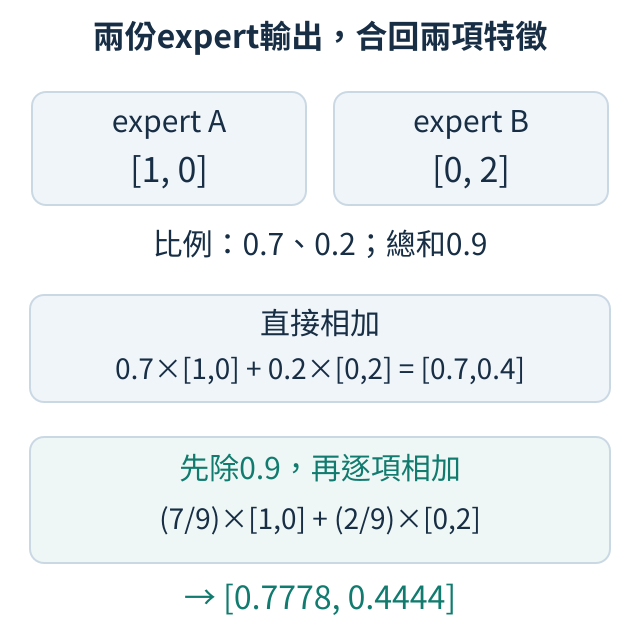
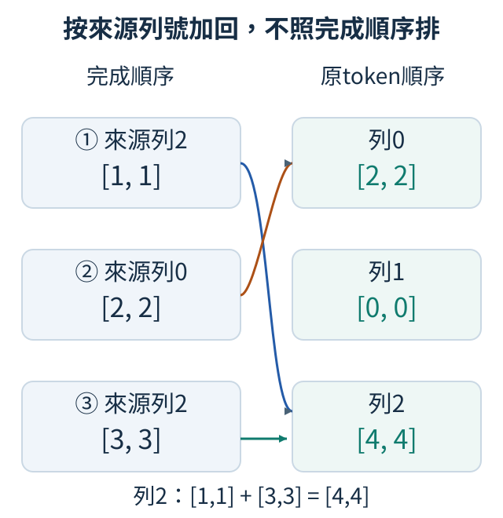

# 第 15 章：從 Dense 到 Mixture of Experts（MoE）

同一個token可以交給一套特徵處理規則，也可以在多套規則中選少數幾套。本章沿著「準備規則、選路、合併、學會選路」建立Mixture of Experts（MoE，專家混合）。固定的小數字讓你看見每個token走了哪條路；接著分清總容量、每次工作量與實際速度，才知道這種設計在什麼條件下值得使用。

## 15.1 Dense 的計算方式是什麼？

一句話有兩個token，和一句話有四個token，模型是否需要兩倍的權重？答案取決於我們是否分清「儲存規則」與「使用規則」。這裡的token是文字切分後的單位；每個單位進入模型時是一列特徵數字。在[一層模型](04.md#4.4)裡，注意力讓不同位置交換訊息，接著每個位置各自通過同一個小型前饋網路（Feed-Forward Network，FFN）。本節的材料是一張二列、每列兩項特徵的表；增加的是輸入列，先不要改處理它的權重。

Dense在本章指每個token都使用同一組完整FFN，沒有先挑選某幾組權重。例如FFN先把兩個特徵擴成三個，經啟動函數，再收回兩個。第一張表有 `2×3=6` 個權重，第二張有 `3×2=6` 個，共12個。不論處理兩列還是四列，這兩張表都不會多一份；但四列要做四次相同種類的計算，因此工作量比兩列多。共享參數意味著用同一規則，並不是所有位置只計算一次。

下列程式直接指定兩張表，不需訓練就能追蹤輸出。`relu`把負值改成零、保留正值，是兩次矩陣乘法之間的非線性步驟。這裡不加bias，也就是沒有額外常數，讓參數數量恰好符合上面的12。

```python
import torch

up = torch.tensor([[1.0, 0.0, 1.0], [0.0, 1.0, 1.0]])
down = torch.tensor([[1.0, 0.0], [0.0, 1.0], [1.0, 1.0]])


def ffn(x):
    return torch.relu(x @ up) @ down


x = torch.tensor([[1.0, 2.0], [2.0, 1.0]])
for batch in (x, torch.cat([x, x], dim=0)):
    print("輸出", ffn(batch).tolist())
    print("token數", len(batch), "權重數", up.numel() + down.numel())
```

`@`的規則是每列輸入對上權重表的每一欄，同位置先相乘、再相加，產生該欄的一個結果。第一列 `[1,2]`乘up時，三欄分別算 `1×1+2×0=1`、`1×0+2×1=2`、`1×1+2×1=3`，得到 `[1,2,3]`。都為正所以relu不改它；再乘down，兩欄分別算 `1×1+2×0+3×1=4`、`1×0+2×1+3×1=5`，得到 `[4,5]`。第二列用同一規則得到 `[5,4]`。第一次輸出是這兩列，第二次則重複兩遍；兩次印出的權重數都為12。`torch.cat`沿列方向把輸入接起來，沒有複製模型；`numel`只數表中的元素，不數輸出與中間特徵。

後續的Mixture of Experts（MoE，專家混合）會準備多組FFN，讓每個token只選其中少數組。現在這個Dense規則是比較基準：要知道MoE省掉什麼，先知道Dense對每列完整計算了哪些東西。不能從「Dense只存一套」推論它一定用較少計算，也不能從token增加推論參數跟著增加；輸入長度、參數容量、工作量是三個不同量。

練習把兩個輸入各重複三遍，執行前預測共有六列輸出、仍然12個權重。核對後，再手算第一列結果。若增加的只是列數，FFN的每列規則保持不變；若要讓FFN變寬，則必須連兩張權重表的形狀一起改。

<details>
<summary>選讀：來源、量測條件與原始實報</summary>

接著把基準真的拿去學文字。[T.8](../training.md#T.8)的MoE實驗中，寬度64的Dense有兩層，每層FFN中間寬度256，含bias共33,088個參數，整個模型共141,568個。它更新180次後，51篇驗證故事的代價2.29999，52篇最後檢查2.32093；不是上述12個權重的玩具程式。留出代價與完整目標數會在[15.13](15.md#15.13)並排，讓這個基準有真正的品質與成本記錄。

</details>

## 15.2 能否準備多組 FFN？

同一個輸入 `[1,2]`，我們想準備「保留、兩倍、交換特徵」三種獨立規則。在[Dense的規則](15.md#15.1)裡，所有token都使用同一組FFN；現在先建立三組各有自己權重的FFN，下一節再決定誰處理哪個輸入。每一組稱為expert（專家）。這個名字只是結構上的稱呼：剛建立時，它們只有初始化的數字，不會天生分成「數學專家」和「中文專家」。專長必須從訓練後的資料與行為觀察。

先用最簡單的線性層代表每位expert。輸入 `[1,2]`，第一位使用單位矩陣，輸出仍是 `[1,2]`；第二位把每個數字乘2，輸出 `[2,4]`；第三位交換兩個特徵，輸出 `[2,1]`。三者接收相同形狀，產生相同形狀，裡面的數字卻各自儲存。真實expert通常採用前節的兩層FFN；這裡縮成一層，只把「獨立權重」這件事隔離出來。

```python
import torch
from torch import nn

experts = nn.ModuleList([nn.Linear(2, 2, bias=False) for _ in range(3)])
tables = [torch.eye(2), 2 * torch.eye(2), torch.tensor([[0.0, 1.0], [1.0, 0.0]])]
with torch.no_grad():
    for expert, table in zip(experts, tables):
        expert.weight.copy_(table)
x = torch.tensor([[1.0, 2.0]])
print("各自輸出", [e(x).tolist() for e in experts])
print("同一權重", experts[0].weight is experts[1].weight)
print("權重總數", sum(p.numel() for p in experts.parameters()))
shared = nn.Linear(2, 2, bias=False)
repeated = nn.ModuleList([shared, shared, shared])
print("重複引用總數", sum(p.numel() for p in repeated.parameters()))
```

`ModuleList`是讓PyTorch登記一串子模組的容器；它本身不替你選expert，也不替你執行輸入。前面的列表推導式每次呼叫 `nn.Linear`，所以真的建立三個模組。`zip(experts,tables)`把兩串內容按位置配對：第一次取第0位expert和第0張table，接著是第1對、第2對；迴圈因此依序填好三張權重表。`copy_`只是在不記錄梯度時填入已知表格，方便核對，並沒有把三個權重綁成一個物件。第一行應是 `[[[1,2]],[[2,4]],[[2,1]]]`，第二行為False。

`experts.parameters()`依序提供這個容器裡登記的可學參數。`sum(p.numel() for p in experts.parameters())`可以逐步讀成：每次取一張參數表叫p，用 `p.numel()`數這張表的元素，再由 `sum`把每次得到的數字加起來。本例就是先得到4、4、4，再加成12；最後一行對repeated做同樣的計數。

第三行為12，因為三張二乘二表各有四個權重。最後一行卻為4：把同一個shared放進列表三次，PyTorch列出可學參數時會辨認這些引用屬於同一份數字。三個名稱不會創造三份獨立容量。這也呼應[權重共享](14.md#14.6)的差別：相同數值、相同形狀與同一物件並不是同一件事。

目前程式把三位都算了一次，只為檢查各自的規則，還沒有省計算。後面需要一個根據輸入做選擇的router，把token送往少數expert；如果始終讓三位都算，再把結果平均，參數增加，運算也增加。

練習在輸出前加一個 `no_grad` 區塊，將 `experts[0].weight` 乘3。先預測只有第一個輸出變成 `[3,6]`，再執行核對。這個手動修改只用到上面已有的工具，可以直接證明三份權重會獨立改變。

<details>
<summary>選讀：來源、量測條件與原始實報</summary>

正式MoE比較在兩層各放四份獨立FFN，共八份、264,704個expert參數；加上router與共享部分，總數340,608，詳見[15.10](15.md#15.10)。這些數量能證明多存了規則，不能證明八份已各有專長。我們的短訓報告只有路由選擇與文字評估，沒有按語言或學科核驗專業分工，因此不把expert命名為「英文」或「數學」專家。

</details>

## 15.3 如何決定找誰處理？

三位expert對 `[1,2]` 分別輸出一倍、兩倍與三倍。如果希望第三位占一半、前兩位各四分之一，最後應得到 `[2.25,4.5]`。準備好[獨立expert](15.md#15.2)後，我們需要根據輸入算出這樣的混合比例：同一個token應使用哪些規則、各占多少？可以讓一個小型線性層讀取token的特徵，替每位expert產生分數，再轉成比例。這個分配模組叫router（路由器）。它不是預先寫好的「看到數字就送數學專家」規則，而是可學權重所形成的決定；訓練時需要學習訊號告訴它怎樣分配較有用。

先不做只能選一位的決定，而讓每位expert都輸出，最後按比例混合。假設router替三位產生分數 `[0,0,log(2)]`。這裡 `math.log` 是自然對數：它問「把約2.718的數e取幾次方，會得到2？」答案約0.6931。相反的 `exp(s)` 是把e取s次方，所以 `exp(0)=1`、`exp(log(2))=2`；Python的 `math.exp` 可直接核對這兩個對應。softmax先對各分數做這個取指數的動作，得到 `[1,1,2]`，再除以總和4，比例就是 `[0.25,0.25,0.5]`。若三位對相同輸入 `[1,2]` 分別輸出原值、兩倍與三倍，最後會是原值的 `0.25×1+0.25×2+0.5×3=2.25` 倍，也就是 `[2.25,4.5]`。

這叫soft routing，因為用連續權重混合，而非只留下某個離散選項。它適合先理解router的角色，但每位expert都完成計算，還沒有稀疏計算的節省。下面把router本身設成固定矩陣；三位的輸出也手設成倍數，避免隨機權重干擾核對。

程式把 `[1,2]` 當作一個token的兩項特徵。`torch.stack(..., dim=1)` 將三位expert的輸出排在新的expert軸，得到 `(1,3,2)`：第0軸是token，第1軸是expert，第2軸是特徵。router比例原本只有 `(1,3)`，每位expert一個數；`prob[:,:,None]` 在末尾增加長度1的特徵軸，成為 `(1,3,1)`。相乘時，同一expert的比例就會重複用在它的兩項特徵。最後 `sum(1)` 沿expert軸把三份加起來，得到 `(1,2)`，留下每個token的混合特徵。

```python
import math
import torch

x = torch.tensor([[1.0, 2.0]])
router_weight = torch.tensor([[0.0, 0.0, math.log(2)], [0.0, 0.0, 0.0]])
scores = x @ router_weight
prob = scores.softmax(-1)
expert_outputs = torch.stack([x, 2 * x, 3 * x], dim=1)
output = (prob[:, :, None] * expert_outputs).sum(1)
print("分配比例", prob.tolist())
print("混合輸出", output.tolist())
```

`router_weight`有兩列三欄，把兩項特徵轉成三個分數。`@`是矩陣乘法：每列輸入與權重表的每一欄對應相乘再相加。此處三欄算出 `1×0+2×0=0`、`1×0+2×0=0`、`1×log(2)+2×0=log(2)`；只有第三欄第一列不為零，因此第三個分數由x第一項決定。`softmax(-1)`的 `-1` 指定最後一軸，在這張分數表就是三位expert的方向。輸出應接近上述 `[0.25,0.25,0.5]` 與 `[[2.25,4.5]]`，浮點數末位可能略有差異。

三項比例合計為一，但不能據此說第三位有50%的答對率。它們是混合係數，描述當前路由的分配，並沒有經過答案正確率的校準。router可能偏好某位，是因為該位輸出較合用、數值尺度不同，或目前訓練走進偏斜狀態，需要另外觀察。

練習只把 `router_weight` 第三欄的 `math.log(2)` 改成0。先預測三位各占三分之一，混合倍數變成 `(1+2+3)/3=2`，所以輸出為 `[2,4]`；再執行核對。若你想省運算，接下來還需真的停止執行未選中的expert，不能只把它的混合係數設得很小。

<details>
<summary>選讀：來源、量測條件與原始實報</summary>

在[正式MoE報告](https://github.com/birdhackor/tiny-perceptron-vlm/blob/main/docs/course-experiments/results/moe.json)中，top-2、輔助係數0.01的第二層，四位平均softmax比例約 `[0.2875,0.1772,0.2652,0.2701]`，實際分派份額卻是 `[0.2065,0.2692,0.2260,0.2983]`。它們不同，因為後者數的是進入前兩名的次數，不是原softmax值相加。看比例只能知道router的連續分數分布；是否真的讓各expert收到工作，要到[15.8](15.md#15.8)檢查離散選擇。

</details>

## 15.4 能只啟動少數 experts 嗎？

如果有八位expert，讓每位都算完再混合，儲存和計算都比Dense增加。我們真正希望的是保留多套規則，但每個token只花其中少數幾套的計算成本。[router](15.md#15.3)依token特徵算出各expert分數，softmax轉成比例。現在只保留比例最大的k位，這叫top-k routing。先用 `[0.1,0.7,0.2]` 選出兩位，再確認沒有把第三位也算完；這兩步一起成立，才有少算的機會。

例如三位的比例是 `[0.1,0.7,0.2]`。top-2選第1位和第2位（索引從0開始），對應比例0.7與0.2；top-1只選第1位。另一個token比例 `[0.6,0.3,0.1]`則top-2選第0與第1位。不同token可以走不同路，因此儲存的三套權重不代表每個token都執行三套。k是每個token要選幾位，不是整個batch（一起處理的一批輸入）只選幾位。

```python
import torch

prob = torch.tensor([[0.1, 0.7, 0.2], [0.6, 0.3, 0.1]])
for k in (2, 1):
    weights, chosen = prob.topk(k, dim=-1)
    print("k", k, "expert索引", chosen.tolist())
    print("原比例", weights.tolist())
    print("保留比例總和", weights.sum(-1).tolist())
```

輸入兩列代表兩個token，三欄代表三位expert。`topk`沿最後一軸挑最大的k項，回傳值與原欄索引；它不計算expert、也不重新正規化比例。k=2時索引為 `[[1,2],[0,1]]`，保留總和約0.9與0.9；k=1時為 `[[1],[0]]`，總和約0.7與0.6。注意 `tolist()`可能顯示0.699999等尾數，這是二進位浮點表示造成的，應看接近的數字。

被選中的比例總和小於一，是因為未選的部分被拿掉了。下一節會決定如何合併與是否再除以保留總和。這裡先把兩件事分開：chosen是整數索引，決定要執行哪位；weights是連續數值，決定輸出乘多少。梯度描述微調數字對誤差的影響，詳見[W.6](../first-steps.md#W.6)。索引在微小改動下通常不變，跨過排名邊界時又突然跳到另一位，因此不能像一般連續運算那樣對「選誰」直接求梯度。保留的比例在選擇未換人的範圍內，仍隨分數連續改變，所以誤差能沿比例的微小變化回到router，告訴它怎樣調整分數。

要讓稀疏路由真的省計算，實作必須先選擇，再只執行被選的expert。若先算三位輸出、最後只取兩位，輸出形式雖然像top-2，三位的計算成本卻已花掉。訓練與效能比較都應檢查實際執行路徑，而不是只看結果裡有幾個非零係數。

練習把第一列改成 `[0.1,0.2,0.7]`，先預測top-2索引變成 `[2,1]`，數值仍是 `[0.7,0.2]`，再重跑核對。再把k改成3，確認所有比例保留、總和回到一。若遇到相同分數，不要假設各裝置一定選同一個索引順序；在比較實驗中應避免未說明的平手情況。

<details>
<summary>選讀：來源、量測條件與原始實報</summary>

把這個選擇規則放進[正式MoE短訓與驗證](15.md#15.13)的兩層模型後，我們另記錄完整驗證集的分派統計；這個模型每層有四位expert，條件與結果可由該節連到正式報告。不同長度的故事同批計算時，需要先補成相同長度；PAD就是為補齊而放入的佔位符號。這裡的「有效輸入位置」指排除這些補齊佔位後、實際參與分派統計的位置，共39,256個。top-1每層統計39,256筆分派，top-2則78,512筆；一個token經過兩位expert會被數兩次。因此比較「某位占多少」時，分母應是有效輸入數×k，不能都除以token數，也不能把兩層的工作誤當同一層。報告保留每層四位的完整次數，讓分母與分派份額都能核對。

</details>

## 15.5 選中多位 expert 怎麼合併？

選出兩位expert後，模型下一層仍然只期待每個token有一個特徵向量。我們不能直接把兩個向量接起來，否則寬度會加倍；也不能只取最後完成的一位，否則前一位白算了。[top-k](15.md#15.4)已回傳被選者與原比例；現在要沿特徵逐項加權相加，讓兩位的結果回到原本每個token的寬度。

取選中比例0.7、0.2，兩位輸出分別 `[1,0]` 與 `[0,2]`。直接用原比例相加，得到 `[0.7,0.4]`；若希望選中兩位的比例合計為一，就先除以0.9，變成 `7/9` 和 `2/9`，結果約 `[0.7778,0.4444]`。兩種規則都合理，但數值尺度不同，實作與解釋必須一致。本教材top-2採用重新正規化，top-1則保留原softmax比例，原因會在[router梯度](15.md#15.7)說明。

下圖的兩條路都來自同一個token。各expert先產生兩項特徵，再乘上自己的比例，最後相同欄位相加。上下兩行顯示是否重新正規化的差別；它們都只有兩項輸出，沒有把寬度加倍。



```python
import torch

weights = torch.tensor([0.7, 0.2])
outputs = torch.tensor([[1.0, 0.0], [0.0, 2.0]])
normalized = weights / weights.sum()
print("直接合併", (weights @ outputs).round(decimals=4).tolist())
print("重算比例", normalized.round(decimals=4).tolist())
print("正規化合併", (normalized @ outputs).round(decimals=4).tolist())
```

`outputs`兩列代表兩位expert，各有兩項特徵。這次 `weights @ outputs`可看成簡短的加權和：第一項是 `0.7×1+0.2×0`，第二項是 `0.7×0+0.2×2`。它不是把token特徵轉到新的寬度，而是沿expert方向收集相同特徵。三行輸出應分別為 `[0.7,0.4]`、`[0.7778,0.2222]`、`[0.7778,0.4444]`。

正規化後的輸出落在兩位輸出的加權混合之間，但不保證接近原輸入。模型中的每位expert使用[前饋網路](15.md#15.1)（Feed-Forward Network，FFN）處理特徵：先擴展特徵、做逐項非線性處理，再縮回原寬度。FFN本來就可以大幅改變特徵；是否再把原輸入加回，是外層[殘差路徑](04.md#4.2)的責任。不要因為合併有加法，就把「expert結果之間相加」與「原輸入加回」混成同一步。

練習只交換outputs的兩列，保持weights不變。先手算正規化結果為 `[0.2222,1.5556]`，再重跑。這可以檢查你是否把每個比例對上正確expert；若比例與輸出一起交換，結果則不變。再思考只有一位時除以自身會得到什麼，先記住係數恆為1，後續便能理解為何影響router的學習。

<details>
<summary>選讀：來源、量測條件與原始實報</summary>

正式比較也沿用這個約定：top-2先除以選中總和，top-1保留原softmax比例。後者的原始加權形式可對照[Switch Transformer第2.1節、式1–2](https://arxiv.org/pdf/2101.03961v3)；本教材的top-2再正規化是另一個明示的選擇，不能把兩種係數當同一個算法。本次模型確實完成更新，但哪種規則更適合其他任務仍需要另設比較。

</details>

## 15.6 Token 怎麼送出再排回來？

原本輸入三個token，輸出也應保留三列、順序不變。但MoE會先按expert分組工作，工作完成的順序可能是「第2列、第0列、又一份第2列」。如果照完成順序直接排成輸出，就把詞的位置弄亂；如果同一列被兩位expert處理時後者覆蓋前者，又會丟失[加權合併](15.md#15.5)的其中一份。送出時需要記住來源列號，收回時按列號相加。

我們希望收回後仍是原來三列，而且同列的兩份不能漏掉。用三筆已經乘好router比例的貢獻來看：來源列號是 `[2,0,2]`，貢獻向量分別為 `[1,1]`、`[2,2]`、`[3,3]`。先建立三列全零的結果。第一筆加到第2列，第二筆加到第0列，第三筆再次加到第2列；最後第0列 `[2,2]`，第1列 `[0,0]`，第2列 `[4,4]`。原列號從0開始，數字2表示第三列。

下圖左側按完成順序列出三份貢獻，箭頭依「列0或列2」送往右側原token位置。兩條箭頭匯入列2表示相加，不是覆蓋；列1沒有箭頭，這個刻意省略工作的例子中保持全零。



程式用 `index_add_` 實作圖中的加回動作。`index_add_`沿指定軸依索引累加；第一個引數0指列方向，rows給每筆的目的列，contributions給要加的向量。名稱尾端 `_` 表示它直接修改result，沒有另外建立回傳結果。

```python
import torch

rows = torch.tensor([2, 0, 2])
contributions = torch.tensor([[1.0, 1.0], [2.0, 2.0], [3.0, 3.0]])
result = torch.zeros(3, 2)
result.index_add_(0, rows, contributions)
print("相加結果", result.tolist())
overwritten = torch.zeros(3, 2)
for row, value in zip(rows, contributions):
    overwritten[row] = value
print("覆蓋結果", overwritten.tolist())
```

第一行應是 `[[2,2],[0,0],[4,4]]`。後面的迴圈刻意用賦值，第三筆取代第一筆，所以第二行最後一列只有 `[3,3]`。這個反例讓我們看見，同樣完成三筆工作，合併方式錯了仍會丟數字。

前面的「送出」通常用索引選出某位expert負責的輸入列，稱為dispatch；這裡的「依原列號加回」稱為combine。rows記錄的是token身份，不是expert身份。即使同一expert收到很多token，它的每一份輸出仍要回到各自來源列；同一token被多位選中，才會有多筆回到同列。

本例第1列保持零，是因為我們沒有給它任何貢獻；不是說正常MoE應忽略第二個token。本教材使用dropless，意思是所有選中的工作都會執行，不因某位expert太忙而丟棄。有容量上限的設計則要另外處理溢出，後面[容量不足](15.md#15.12)會區分這件事。現在先確保分組與收回沒有改變原有的計算內容。

練習把rows改成 `[1,0,1]`，先預測第1列變成 `[4,4]`、第2列全零，再重跑兩條路徑。接著交換第一筆與第三筆的排列，核對相加結果不變，但覆蓋結果變成 `[1,1]`。正確合併不應依完成先後而漏掉一份貢獻。

<details>
<summary>選讀：來源、量測條件與原始實報</summary>

正式訓練用的`MoEFFN`也先找出各expert的來源列，僅執行被選中的expert，再以`index_add_`合併。這是一個方便閱讀的Python分派迴圈，並未使用專用稀疏GPU核心。同批故事要補成相同長度才能組成整齊的輸入表，這個動作叫padding，補入的佔位符號叫PAD，可回看[有效輸入位置](15.md#15.4)。目前expert的運算仍受到這張補齊後的表的形狀影響，沒有因為統計忽略PAD就自動跳過它們的工作。路由統計排除這些佔位；[輔助損失](15.md#15.9)也排除它們，這是鼓勵分派較均衡的額外訓練項，避免把補齊工作算成真實輸入的負載。它是否值得使用，要同時看[15.11](15.md#15.11)的實測成本與[15.13](15.md#15.13)的品質，不能由資料流畫得正確就推論已加速。

</details>

## 15.7 Router 怎麼收到學習訊號？

選中expert固定輸出2，目標卻是0；我們希望router下次減少這位的貢獻。選誰的整數索引不能像連續數字一樣微分，但[合併比例](15.md#15.5)仍可能改變輸出。本節用[梯度](../first-steps.md#W.6)追蹤這條路：微調router分數時，誤差如何改變？再比較把唯一比例正規化成1會發生什麼。

假設兩位的router分數是 `[log(2),0]`。`math.log`是自然對數，問「約2.718的數e取幾次方會得到2」，答案約0.6931；softmax使用相反的自然指數 `exp`，所以 `exp(log(2))=2`、`exp(0)=1`，再各除以總和3，比例便是 `[2/3,1/3]`，top-1選第一位；完整的分數換比例例子可回看[15.3](15.md#15.3)。這位的輸出固定為2，希望最後輸出接近0，於是用輸出的平方作誤差。若保留原比例，輸出是 `2×2/3=4/3`，誤差16/9；微調第一位的分數會改變2/3這個比例，因此誤差能沿比例回傳給router。

但若top-1也把唯一比例除以選中總和，結果成為 `p/p=1`，不論p微小變大或變小，輸出都是2，誤差都是4。這條路給router的梯度便為零。不是PyTorch忘記學習，而是我們把唯一可以連續改變的係數消掉了。

```python
import math
import torch

for renormalize in (False, True):
    scores = torch.tensor([math.log(2), 0.0], requires_grad=True)
    prob = scores.softmax(-1)
    p = prob.topk(1).values[0]
    gate = p / p if renormalize else p
    output = gate * 2
    loss = output.square()
    loss.backward()
    print("重新正規化", renormalize, "輸出", round(output.item(), 4), "梯度", scores.grad.round(decimals=4).tolist())
```

兩輪各建立一份scores，避免前一輪的梯度累加干擾。`requires_grad=True`讓PyTorch記錄從scores到loss的運算，`backward`沿這些運算求導數。未重新正規化時輸出1.3333，梯度約 `[1.1852,-1.1852]`；若沿梯度的反方向更新，第一個分數減小、第二個增加，選中者的比例降低，符合我們想降低輸出的目標。重新正規化時輸出2.0，梯度兩項都是0。

這個數值例子不代表所有MoE都必須使用相同約定。其他方法可能設計不同的連續近似，或加入額外的路由學習目標；本教材的top-1保留原softmax機率，讓任務誤差能透過gate教router。top-2重新正規化後仍有兩個相對比例可變，不會自動變成恆定係數，所以不能把top-1的結論直接套到top-2。

練習只把expert輸出2改成1。先預測未正規化的輸出減半，而平方誤差對scores的梯度變成原來四分之一，約 `[0.2963,-0.2963]`；重跑核對。重新正規化那條路仍是零梯度。這能分清「誤差大小變了」與「router是否保有學習路徑」兩個問題。

<details>
<summary>選讀：來源、量測條件與原始實報</summary>

[正式MoE報告](https://github.com/birdhackor/tiny-perceptron-vlm/blob/main/docs/course-experiments/results/moe.json)的top-1、輔助係數0模型也核對了這條路，模型比較條件見[15.13](15.md#15.13)。驗證窗口是從故事切出的短段，每段最多128個輸入位置；這次文字按UTF-8規則表示成0至255的數值單位，叫byte；有效目標是這些位置實際要預測的下一byte或故事結束符號，補齊用的PAD佔位不算入。這次取前八個窗口，共1,004個有效目標，只用文字預測的任務代價求導。每個router權重都有一個梯度數字；「梯度長度」把這些數字各自平方、相加再開平方，合成整組變化的大小。開平方就是找一個平方後等於總和的非負數，例如梯度 `[3,4]` 的平方總和為25，長度便為5。

訓練前兩層router權重的梯度長度約0.00668、0.00658；180次更新後為0.02446、0.01400，均非零。這證明在本次輸入和係數約定下有任務學習訊號，沒有證明離散的expert索引能直接求導或路由已最優。[輔助目標](15.md#15.9)是鼓勵分派較均衡的額外誤差項，加入總訓練目標前會乘上輔助係數；係數0表示不加入，0.01表示乘0.01。報告的輔助梯度另以未乘係數的值記錄，比較兩個目標的影響時還要乘回0或0.01，不能直接比較原始長度。

</details>

## 15.8 為什麼 token 都跑去同一位 expert？

準備三位expert，並不保證它們都得到工作。router如果一開始稍微偏向第一位，就可能讓它接到更多token、得到更多學習機會；其他兩位很少更新，表現差距又讓router繼續偏向第一位。這種只使用少數甚至一位expert的狀態叫routing collapse（路由塌縮）。要診斷它，不能只看模型宣告有幾位expert，還要數實際選擇。

為了看清[比例與排名](15.md#15.4)的差別，固定使用top-1，讓十二個token都有相同分數 `[8,0,0]`。我們預期十二筆都去第一位，再把優勢縮到0.1，看排名是否真的分散。這是刻意製造的偏斜，不靠某次隨機訓練碰巧發生。softmax後第一位的比例約0.9993，其餘各0.0003；十二筆選擇都會落在索引0，實際工作數為 `[12,0,0]`。

```python
import torch

for advantage in (8.0, 0.1):
    scores = torch.tensor([[advantage, 0.0, 0.0]]).repeat(12, 1)
    prob = scores.softmax(-1)
    chosen = prob.topk(1, dim=-1).indices
    counts = torch.bincount(chosen.flatten(), minlength=3)
    print("分數優勢", advantage)
    print("平均比例", prob.mean(0).round(decimals=4).tolist())
    print("工作次數", counts.tolist())
```

`repeat(12,1)`把一列分數重複十二次。`flatten`將十二列一欄的索引攤成清單，`bincount`數每個非負整數出現幾次；`minlength=3`保留未被選中的expert欄位，不讓它們從報告消失。優勢8時平均比例約 `[0.9993,0.0003,0.0003]`，工作次數為 `[12,0,0]`。

第二輪把優勢降到0.1，平均比例變成約 `[0.3559,0.3220,0.3220]`，看起來已接近均勻；工作次數卻仍是 `[12,0,0]`。原因是top-1只看排名，第一位每次還是最大。這個對照非常重要：平均router機率與實際負載是不同統計。負載可用各位被選次數除以總選擇次數，這裡依然是 `[1,0,0]`，不是上面的三項機率。

均勻負載也不等於品質最好；某些輸入確實可能更適合某位expert。但如果所有種類的token長期集中在同一位，其他參數沒有發揮作用，系統還可能因單位工作過多而塞住。因此應同時記錄不同時間、不同資料類型的選擇分布和任務誤差。這個受控反例只證明偏斜如何形成與如何辨識，沒有宣稱真實訓練一定會塌縮。

練習只把第二個expert的分數也設成0.2，也就是每列 `[0.1,0.2,0]`。先預測十二筆改送索引1，而非自動平均分給三位，再執行核對。接著用兩組不同分數各重複六列，你應能用bincount看見 `[6,6,0]`。分散工作需要不同輸入產生不同排名，不能只讓每一列的比例更平坦。

<details>
<summary>選讀：實際分派次數與負載熵的算法</summary>

下面的實測會提到「輔助項」：它是訓練時額外加入、用來鼓勵router較均衡分派工作的誤差。「輔助係數」決定把這個額外項乘上多少，再加到文字預測誤差上；係數0表示這次沒有把它加入訓練目標。完整公式留到下一節[15.9](15.md#15.9)。

實測top-1、輔助係數0的第二層，四位在全部有效驗證輸入上收到 `[8536,25630,4875,215]` 筆，占39,256筆的 `[21.74%,65.29%,12.42%,0.55%]`，完整比較見[15.13](15.md#15.13)。這是偏斜使用，卻還不是全部工作都去一位。可再用「負載熵」把份額的分散程度概括成一個數字：每位的份額f各算 `-f*log(f)`，再把各項相加。這裡log是自然對數，問「約2.718的數e取幾次方會得到f」，Python用 `math.log(f)`計算。份額為0的項直接記0，不呼叫 `log(0)`；份額越接近0，這一項的貢獻也越接近0。

例如四位均勻時各占0.25，`log(0.25)`約-1.3863，各項為 `-0.25×(-1.3863)=0.3466`，四項合計約1.3863，也就是 `log(4)`。用熵除以這個均勻值，便把均勻負載記成1。若份額為 `[1,0,0,0]`，第一項因 `log(1)=0`而為0，其餘按零份額規則也為0，合計與正規化結果都是0。這兩端分別表示全去一位與整體份額均勻。

下面用實際次數重算，避免只拿四捨五入的百分比代入。`fractions`把各次數除以總次數，得到份額；`terms`逐項計算上述貢獻，`if f > 0 else 0.0`處理零份額；最後相加並除以四位均勻時的熵，印出0.64755。

```python
import math

counts = [8536, 25630, 4875, 215]
fractions = [count / sum(counts) for count in counts]
terms = [-f * math.log(f) if f > 0 else 0.0 for f in fractions]
print(round(sum(terms) / math.log(len(counts)), 5))
```

這個熵彙整整份驗證集，不保證每一批、每一類文字都均勻；不同批各自集中到不同expert，也可能加總成高熵。報告因此保留各位次數、平均機率與逐批輔助項的加權平均值。這個平均先把每批的輔助項乘上該批有效輸入數，全部相加後再除以有效輸入總數；有效輸入較多的批次占比較大。閱讀結果時應一起看這些統計。加上輔助目標後會怎樣，接著看[15.9](15.md#15.9)。

</details>

## 15.9 怎麼鼓勵較均衡的使用？

如果[十二筆工作都去第一位expert](15.md#15.8)，其他expert很少得到學習機會。我們可以在原本預測答案的誤差之外，再加一個提醒router不要長期集中工作的數字。這叫auxiliary loss（輔助誤差）：它不是答案的另一種標註，而是為了改善路由行為而加入的訓練目標。我們沿用三位expert，把實際工作份額和連續比例合在一個項裡，讓[router可微的比例](15.md#15.7)得到額外提醒。

取三位expert，令f表示每位實際被選中的次數占全部選擇的比例，p表示每位softmax比例在各token上的平均。計算 `3 × (f₀p₀+f₁p₁+f₂p₂)`，前面的3是expert數。若三位各接三分之一的工作，平均比例也各三分之一，結果為1。若所有工作去第一位、平均比例 `[0.8,0.1,0.1]`，結果為 `3×0.8=2.4`。降低這個項，通常會鼓勵減少擁擠expert的平均比例。

下面的`cases`是字典，用案例名稱對應一張比例表。`cases.items()`提供一對對的「名稱、比例表」；`for name, prob`每次取出其中一對，把名稱放進`name`、比例表放進`prob`。因此同一段迴圈會依序處理「較均衡」與「集中」兩組案例。

```python
import torch

cases = {
    "較均衡": torch.tensor([[0.8, 0.1, 0.1], [0.1, 0.8, 0.1], [0.1, 0.1, 0.8]]),
    "集中": torch.tensor([[0.8, 0.1, 0.1], [0.8, 0.1, 0.1], [0.8, 0.1, 0.1]]),
}
for name, prob in cases.items():
    chosen = prob.argmax(-1)
    fraction = torch.bincount(chosen, minlength=3).float() / len(chosen)
    mean_prob = prob.mean(0)
    auxiliary = 3 * (fraction.detach() * mean_prob).sum()
    total = 0.5 + 0.01 * auxiliary
    print(name, "負載", fraction.tolist(), "輔助項", round(auxiliary.item(), 4), "總誤差", round(total.item(), 4))
```

兩組輸入都是三個token、三位expert的比例。`argmax`選每列最大者，`bincount`數實際工作；`mean(0)`則算每一欄的平均比例。`fraction.detach()`表示把離散次數視為固定統計，不沿選擇索引求導數；真正訓練時，梯度會沿mean_prob回到softmax和router。這裡比例直接手設，程式只核對公式，並未執行訓練。

輸出「較均衡」的負載約 `[0.3333,0.3333,0.3333]`，輔助項1，總誤差0.51；「集中」為 `[1,0,0]`，輔助項2.4，總誤差0.524。0.5是刻意固定的示範任務誤差，0.01是輔助項係數。真實任務誤差會隨分配改變，所以不能單純追求輔助項最低：某位expert可能確實更適合某些token，強迫均勻也可能傷害答案品質。

這個公式也不是完美的「負載不平均程度」。例如所有softmax比例相同時，平手選擇可能仍集中，輔助項卻為1；因此訓練仍須記錄實際負載，不能只看auxiliary loss。係數應用獨立驗證資料比較答案誤差、負載與耗時，而不是固定沿用示範0.01。

練習只把係數0.01改成1，先預測兩種總誤差變成1.5與2.9，再執行核對。這說明放大係數會讓路由目標在總誤差中占更多份量，並不等於完成了更好的文字模型。

<details>
<summary>選讀：原論文公式、有效分母與四組短訓結果</summary>

此輔助項對照[Switch Transformer第2.2節、式4–6](https://arxiv.org/pdf/2101.03961v3)。本次top-2把f的分母改成有效輸入數×2，兩層各計輔助項再相加，係數0.01作用在這個總和。任務代價只按有效答案／下一byte目標算，路由輔助項則按有效輸入位置算，兩種分母不可混用。

下表另用未參與權重更新的故事評估文字預測。驗證資料用來比較設定；最後檢查是另一份預先分開保留的資料，用來報告完成訓練後的表現，不能再拿它反覆挑選設定，理由見[5.10](05.md#5.10)。兩份都從訓練資料中留出，因此它們的評估誤差也叫留出代價；這裡數字越低，表示在該批故事上猜下一個目標的平均代價越小。

| 設定 | 第一／二層負載熵÷log4 | 驗證任務代價 | 最後檢查任務代價 |
| --- | --- | ---: | ---: |
| top-1，係數0 | 0.74231／0.64755 | 2.30115 | 2.32369 |
| top-1，係數0.01 | 0.99499／0.97937 | 2.29775 | 2.31963 |
| top-2，係數0 | 0.99800／0.75365 | 2.28011 | 2.30320 |
| top-2，係數0.01 | 0.99944／0.99254 | 2.27819 | 2.30170 |

四組均完成180次更新。這輪0.01的整體負載較均勻，任務代價也略低，但數字沒有證明對其他隨機種子或資料都如此。隨機種子是控制初始化等隨機步驟的起始設定，換種子可能改變學習起點與結果。表中的留出代價不含輔助項，訓練過程記錄的誤差（history中的loss欄位）才含它。報告的`mean_batch_auxiliary`是按有效輸入數加權的逐批平均：例如top-2、0.01第二層為0.99063，不是把全驗證集的f、p重新相乘，也不是必須大於等於1的精確不均量。

</details>

## 15.10 模型究竟有多大？

「這個MoE有一億個參數，但每個token只啟動兩千萬個」聽起來像兩種互相矛盾的大小。其實前者問模型要保存多少可學數字，後者問每個token經過哪些權重。即使某位expert這次沒有被選中，它的權重仍需要儲存，下次不同token可能會用到它。這和[Dense的共享](15.md#15.1)是同一個區分：儲存了哪些規則，與這個token使用哪些規則，是兩個不同問題。少選expert不會刪掉未選者的權重。

用容易核對的尺寸計算。每個expert把寬度4擴成8，再收回4，兩張表共 `4×8+8×4=64` 個權重，不計bias。四位expert共256，router把四個輸入特徵轉成四個分數，需要 `4×4=16` 個。此MoE FFN總共272個權重。每個token若選兩位，經過的expert權重約128個，加router16，共144。這是此FFN的局部估計，還沒有加上attention、字嵌入與其他層。

```python
width, hidden, k = 4, 8, 2
one_expert = width * hidden + hidden * width
for experts in (4, 8):
    router = width * experts
    total = experts * one_expert + router
    active = k * one_expert + router
    print("expert數", experts, "總權重", total, "每token使用估計", active, "FP32權重bytes", total * 4)
```

程式只計數，不建立隨機模型或聲稱測到執行記憶體。`width`是每個token的特徵數，`hidden`是FFN中間寬度，`k`是每個token選幾位。四位時輸出272、144、1088；八位時544、160、2176。FP32每個權重用四bytes，所以最後一欄只算權重數字的儲存量，不含容器與額外狀態。

expert數加倍、k固定，全部expert的儲存增加一倍，啟動的expert部分仍為128；但router也要替更多候選打分，所以使用估計從144增為160，不是完全不變。若加入完整模型的共享部分，總權重和每token使用估計都要再加它們，不能把這兩個FFN數字當作整個模型大小。

「使用了多少權重」也不是精確乘加次數，更不是實測速度。運算形狀、分派開銷及記憶體搬移都會影響成本；訓練還要存[梯度](../first-steps.md#W.6)，也就是微小改權重對誤差的影響，以及優化器狀態：更新權重時用來記住過去變化的附加數字。推理會有[cache快取](16.md#16.3)，為接續生成保存已算過的前文資訊，還有每次運算產生的中間特徵。因此報告MoE規模時，至少應列總參數、每token選幾位，以及這個估計涵蓋哪些模組。只說「活躍參數少」不足以讓小記憶體裝置容納全部權重。

練習只把k由2改成1。先預測總權重和FP32 bytes完全不變，四位時使用估計降為80、八位時降為96，再重跑核對。這直接區分「模型能存多少規則」與「這次計算花了多少規則」兩個問題。

<details>
<summary>選讀：來源、量測條件與原始實報</summary>

完整訓練模型的兩層共有264,704個expert參數、512個router參數與75,392個其他參數，總數340,608。報告將全部非expert參數，加上每層選中expert的參數，稱為`active_parameter_proxy_per_token`：top-1得到142,080，top-2得到208,256。這個容量代理連整張字表與位置表都算入。[字表](02.md#2.1)按文字單位的編號（token ID）查出一列特徵，[位置表](04.md#4.1)則按位置編號查出一列特徵；一個token通常各查一列，這個代理卻刻意把兩張完整表的參數全列入。因此它並非每個token實際讀取的權重格數，也不是浮點運算次數；例如一次浮點乘法加上一次加法，通常計為兩次運算。它適合明確記錄匹配口徑，不能單獨證明乘加量、速度或GPU峰值省了多少。

</details>

## 15.11 少算一些就一定更快嗎？

每個token只執行兩位expert，為何小型MoE有時比Dense更慢？想像原本一份工作直接在同一張表上完成，現在要先排名、把輸入分組、處理多張小表、再按原位置加回。省下的矩陣乘法可能小於新增加的分派成本。這一節在[送出與合併](15.md#15.6)的工作之外，量實際耗時。每次使用權重較少是一個起點，真正要回答的卻是同一份輸入誰先算完。

先固定CPU、同一份輸入與單一計算執行緒，減少小矩陣測量被執行緒調度干擾。輸入形狀 `[2,8,8]` 表示兩段序列、每段八個token、每個token八項特徵。Dense中間寬度16；MoE有四位、各寬度4，每次選兩位。就矩陣權重粗估，Dense每token經過256個FFN權重，MoE的兩位共128個、另加32個router權重；但索引與合併仍未列入。

```python
import time
import torch
from tiny_perceptron.modern import DenseFFN, MoEFFN

torch.manual_seed(0)
torch.set_num_threads(1)
x = torch.randn(2, 8, 8)
layers = [("Dense", DenseFFN(8, hidden=16)), ("MoE", MoEFFN(8, experts=4, top_k=2, hidden=4))]
with torch.no_grad():
    for name, layer in layers:
        layer.eval()
        for _ in range(5):
            layer(x)
        start = time.perf_counter()
        for _ in range(30):
            layer(x)
        elapsed = (time.perf_counter() - start) / 30
        params = sum(p.numel() for p in layer.parameters())
        print(name, "參數", params, "毫秒/次", round(elapsed * 1000, 4))
```

`manual_seed(0)`固定產生隨機數的起始設定，使重跑能建立同一份隨機輸入和初始權重；`randn(2,8,8)`建立指定形狀、含正負小數的隨機輸入。`layer.parameters()`列出該模組的可學數字表，`p.numel()`數每張表的格數，外面的 `sum`把各表數量相加。

`no_grad`停用記錄反向運算，`eval`切換成推理模式，這裡只測向前計算。先跑五次叫warmup（暖機），讓初次初始化不混入主要測量；`perf_counter`提供計時讀數，三十次總時間再除以30，得到每次平均，最後乘1000換成毫秒。兩行參數應為Dense 280、MoE 336。Dense矩陣256，加中間16項與輸出8項bias（額外加上的常數），共280。MoE每位expert矩陣64，加4項與8項bias，共76；四位是304，加router的32個矩陣權重，共336。router不含bias，因此不要再加四項。前段使用權重粗估只算矩陣，故與全部參數不同。

耗時沒有跨機器固定答案。你應比較同一輪兩行的「毫秒/次」，再重跑幾輪看看結論是否穩定；這個小CPU例子常會看到MoE較慢，不能假設減少矩陣權重使用量必然加速。它也不證明大型GPU上的MoE較慢：大矩陣、專用分派運算與不同硬體會改變成本比例。

這組尺寸旨在觀察分派開銷，不是品質公平比較。兩者總參數與結構不同，而且程式根本未訓練；因此不能用較快的一行宣稱回答更好。若量GPU，還需同步等待運算完成，否則計時可能只量到工作排入佇列的時間。

一個L4的小型完整訓練例子也呈現這個取捨：相同故事批次、16段、每段最多128位置，Dense寬64每次更新中位數12.676毫秒，top-2、輔助係數0.01的Python MoE為27.242毫秒。時間含向前、反向、梯度核對與更新。這支持「少用部分矩陣權重，仍可能較慢」，沒有把所有差異歸因單一分派操作；完整條件與其他尺寸列在末尾。

練習只把x的每段長度由8改成64，保持特徵寬度與層設定。先預測總工作增加、每次時間可能增加，但固定分派開銷占比可能下降；再比較兩者時間的比值。練習不要求特定誰勝出，要求你以同一台機器的重複量測回答。

<details>
<summary>選讀：來源、量測條件與原始實報</summary>

真正的GPU訓練更新則得到下面結果，使用NVIDIA L4這款GPU。訓練資料與抽樣順序相同，每批16段故事片段，每段最多128個位置。表中top-1與top-2表示每個token分別選一位或兩位expert；係數0.01是[鼓勵分派均衡的輔助誤差](15.md#15.9)的乘數，把這個額外項乘0.01再加到文字預測誤差上。

毫秒欄略過前三步、同步後取中位數，計入一次完整更新：向前從輸入算出預測與誤差，反向再求各權重的梯度；梯度檢查確認沒有無限大或無效數值，裁剪則把過大的整組梯度縮小；最後AdamW依梯度與過去變化的記錄更新權重。AdamW的更新規則可先看[逐項調整步幅](05.md#5.4)。這些工作都計入GPU時間，因此量測範圍比上面的CPU FFN推論多。

| 設定 | 毫秒／更新 | 計時支線開始前已配置MiB | 該支線訓練峰值MiB |
| --- | ---: | ---: | ---: |
| Dense，寬度64 | 12.676 | 35.693 | 112.648 |
| Dense，寬度80 | 11.965 | 67.945 | 119.091 |
| Dense，寬度104 | 14.054 | 68.413 | 129.432 |
| top-1，係數0.01 | 27.630 | 68.454 | 120.711 |
| top-2，係數0.01 | 27.242 | 68.454 | 133.961 |

MiB是2²⁰ bytes。每支線開始訓練前重設CUDA allocator（PyTorch管理GPU tensor記憶體的配置器）峰值，數值包含當時仍駐留的其他模型、梯度、更新器與中間量；開始前配置不同，所以不是各模型單獨部署的記憶體比賽。它也不含reserved未使用空間、driver及框架之外的配置。[完整報告](https://github.com/birdhackor/tiny-perceptron-vlm/blob/main/docs/course-experiments/results/moe.json)同時保留峰值與扣除開始前配置的增量。這輪Python MoE更新較慢；既沒有隔離分派時間，也沒有大型專用核心測試，不把慢多少全部歸因一個操作。

</details>

## 15.12 Expert 容量不夠怎麼辦？

如果六個token都選同一位expert，這位可以無限制接收嗎？本教材的小型CPU實作會處理所有選中的工作，稱為dropless：選中後不因負載多而丟棄。但有些大型系統為了固定工作緩衝區大小，會設定每位expert最多接幾筆。當實際工作超過這個capacity（容量上限），必須另定處理規則，不能悄悄忽略後面的token。

沿用[top-1選擇](15.md#15.4)，現在只數六個token分到兩位expert的工作。平均每位應有三筆，但[實際負載](15.md#15.8)可能很偏。若將容量設為平均的約三分之二，每位只能接兩筆。實際選擇是 `[0,0,0,1,0,0]`，工作數 `[5,1]`：第一位超過三筆，第二位雖有空間，並不表示那三筆已自動轉給它。

```python
import math
import torch

chosen = torch.tensor([0, 0, 0, 1, 0, 0])
tokens, experts, k = len(chosen), 2, 1
capacity_factor = 2 / 3
capacity = math.ceil(capacity_factor * tokens * k / experts)
counts = torch.bincount(chosen, minlength=experts)
overflow = (counts - capacity).clamp(min=0)
print("每位容量", capacity)
print("工作次數", counts.tolist())
print("超出筆數", overflow.tolist())
print("總超出", overflow.sum().item())
```

`tokens*k`是全部分派筆數，除以expert數是平均工作量；capacity_factor把這個平均放大或縮小，`ceil`向上取整，因為容量只能是整數。`clamp(min=0)`把負數改成零：第二位只有一筆，`1-2=-1`表示有餘裕，不應算成負的溢出。輸出容量2、工作 `[5,1]`、超出 `[3,0]`、總超出3。

這個程式只計數，沒有丟工作，也沒有改模型。真正加入容量政策時，至少有三種選擇：drop跳過超出的expert貢獻；fallback讓另一條預設路徑處理；reroute嘗試送往下一位expert。後兩者需要定義新的選擇與合併規則；第一種也要交代被跳過的token是否仍走[殘差路徑](04.md#4.2)，也就是保留原輸入並加上本層變化的路徑、訓練誤差如何計算。不能只把超額輸出設成零就當作所有語意已解決。

容量是每位個別的限制。即使總容量足夠，路由不均仍可能溢出；本例將capacity_factor設為1，總容量六筆，但第一位需要五筆、容量只有三，仍超出兩筆。這正是平衡路由不只影響參數使用，也影響系統能否順利處理工作的原因。報告結果時要同時列實際超額率與答案品質。這裡超額率定義為「總超出筆數除以總分派筆數tokens×k」，原例為3/6=50%。不要用跳過工作換到的速度冒充相同計算。

練習只把capacity_factor改成1，先預測capacity為3、overflow為 `[2,0]`；再改成2，預測capacity為6、無溢出。重跑核對後說明：容量變大不改router的選擇，只改有多少工作能留在原路徑。主教材仍採dropless，所以這些容量數字是設計分析，不是已啟用的丟棄政策。

<details>
<summary>選讀：來源、量測條件與原始實報</summary>

這個容量公式可對照[Switch Transformer第2.2節、式3](https://arxiv.org/pdf/2101.03961v3)，但本次七組訓練沒有啟用固定expert容量、丟棄或重送。即使[15.8](15.md#15.8)的某位負載偏高，模型仍處理選中的工作。因此實報沒有「drop率降低」或「fallback改善」的成績；不能把上述手算超出率標成已訓練模型的實測。

</details>

## 15.13 如何公平比較 Dense／MoE？

如果MoE多存了四套FFN，卻拿它與只有一套、相同寬度的Dense比較，品質提升可能只是來自更多參數。反過來，若兩者存一樣多，MoE每個token又可能用較少計算。公平比較必須先回答：我們想固定儲存容量，還是固定每個token的大致工作量？按[總權重](15.md#15.10)匹配，和按每次使用估計匹配，不會自然產生同一個Dense尺寸；[實測時間](15.md#15.11)還要另外列出。先用四位小expert把兩種尺寸各算一次。

用不含bias的玩具尺寸推算：特徵寬度4，每位expert中間寬度2，單位有 `4×2+2×4=16` 個權重。四位共64，router另有16，總共80。若Dense也要80個權重，它的中間寬度應是10，因為 `4×10+10×4=80`。但MoE若top-1，每token使用估計只有 `16+16=32`；按這個估計配Dense，寬度4就足夠。兩種「匹配」得到10和4，回答的是不同問題。

```python
width, expert_hidden, experts = 4, 2, 4
per_expert = 2 * width * expert_hidden
router = width * experts
total = experts * per_expert + router
for k in (1, 2):
    active = k * per_expert + router
    same_parameters_hidden = total / (2 * width)
    same_active_estimate_hidden = active / (2 * width)
    print("k", k, "MoE總權重", total, "使用估計", active)
    print("同總參數Dense寬度", same_parameters_hidden, "同使用估計Dense寬度", same_active_estimate_hidden)
```

程式輸入都是架構尺寸，沒有訓練或計時。k=1時總權重80、使用估計32，兩個Dense寬度10與4；k=2時總權重仍80，使用估計48，寬度10與6。這裡結果剛好是整數，真實尺寸可能需要取整並報出剩餘差距。你應從輸出看見top-k影響工作量，不影響已存的expert套數。

按使用權重數匹配只是計算成本的初步代理，不能直接稱為精確FLOPs匹配。FLOPs是浮點運算次數，還需把router、啟動函數、合併，以及完整模型的attention等納入。即使運算次數接近，索引與搬移成本仍可能讓時間不同，所以應另列實測耗時、最高記憶體占用與[路由負載](15.md#15.8)：各expert被選次數，以及次數占總分派筆數的比例。參數匹配則應數實際模組的全部參數，包含bias及共享部分，不能只沿用此簡化算式。

完成尺寸選擇後，兩個模型還應使用相同訓練資料、相同已讀token數、相同[驗證集](05.md#5.10)，也就是留作比較方案、其誤差不直接用來更新權重的資料。再重複幾個隨機種子：種子指定亂數起點，讓初始化可重現；換幾個起點能檢查差異是否只是偶然。若只用不同資料訓練各一次，結果混入資料與偶然性，無法歸因架構。最後分別報「同總參數」和「同計算預算」的比較，讓讀者知道結論在什麼資源條件下成立。

一輪TinyStories小模型比較，得到下面三個結果。表中的Dense寬80、104指完整模型的特徵寬度，與前面玩具算式的FFN中間寬度不同；改完整模型寬度也改變attention與字表形狀，並非只調FFN。這裡的每token容量代理，把全部非expert參數，加上每層選中expert的參數；它連整張字表也列入，並不是每個token實際讀取的格數或精確FLOPs。

| 比較版本 | 總參數 | 每token容量代理 | 驗證代價 |
| --- | ---: | ---: | ---: |
| Dense模型寬80：近似匹配MoE容量代理 | 207,680 | 207,680 | 2.28200 |
| Dense模型寬104：近似匹配MoE總參數 | 329,888 | 329,888 | 2.22603 |
| MoE top-2，輔助係數0.01 | 340,608 | 208,256 | 2.27819 |

代價是下一byte／故事結束目標的平均負log機率，越低表示在這批留出原文上較容易預測。MoE對前一種基準略低，對後一種基準較高：固定哪種資源，會改變結論。原比較七組各更新180次、讀337,761個有效訓練目標，驗證39,256個目標；只有seed 42一輪，不能把微小差距當成穩定優勢。完整七組、最後檢查與近似匹配差距留在選讀。

練習只把experts由4改成8，保留原來的兩輪迴圈；這次先只比較印出k=1的那一輪。先手算總權重160、使用估計48，同總參數Dense寬度20、同使用估計寬度6，再執行核對。程式也會另外印出k=2的結果，請依前面的公式分清兩輪使用的是不同k。這也提醒router隨expert數變大，計算匹配時不能假設它始終免費。

<details>
<summary>選讀：來源、量測條件與原始實報</summary>

我們依[T.8](../training.md#T.8)的完整TinyStories切分，實際做了兩種匹配。Dense寬度在16到160的四倍數中，選總參數最接近目標者：匹配top-1代理142,080得到寬度64、141,568個，少512；匹配top-2代理208,256得到寬度80、207,680個，少576；匹配MoE總數340,608則是寬度104、329,888個，少10,720（約3.15%）。這些是近似匹配；模型寬度不同，也不能共用全部初始化。

| 模型 | 總參數 | 每token容量代理 | 驗證代價 | 最後檢查代價 |
| --- | ---: | ---: | ---: | ---: |
| Dense，匹配top-1代理 | 141,568 | 141,568 | 2.29999 | 2.32093 |
| Dense，匹配top-2代理 | 207,680 | 207,680 | 2.28200 | 2.30906 |
| Dense，匹配MoE總數 | 329,888 | 329,888 | 2.22603 | 2.24943 |
| MoE top-1，係數0 | 340,608 | 142,080 | 2.30115 | 2.32369 |
| MoE top-1，係數0.01 | 340,608 | 142,080 | 2.29775 | 2.31963 |
| MoE top-2，係數0 | 340,608 | 208,256 | 2.28011 | 2.30320 |
| MoE top-2，係數0.01 | 340,608 | 208,256 | 2.27819 | 2.30170 |

七組各完成180次更新、337,761個有效訓練目標，驗證與最後檢查分別計39,256、41,914個目標，包含各篇結束。top-2、0.01比代理相近的Dense略低，比總容量相近的Dense卻高；固定哪種資源，會得到不同比較。這只是seed 42的一輪短訓，差異沒有多種子的不確定性估計，代理也不是相同FLOPs。速度與記憶體另見[15.11](15.md#15.11)。

我們固定保存top-2、0.01為後續教學教師，沒有按驗證成績選最好的一列。它在第一筆最後檢查提示 `Once upon a time, there ` 上仍生成 `tthe the the the the the the the`；代價略低並不等於有可用故事能力。[實報](https://github.com/birdhackor/tiny-perceptron-vlm/blob/main/docs/course-experiments/results/moe.json)保存完整留出代價、每側前八篇生成、梯度與每層負載，讀者可核對上述取捨。

</details>
