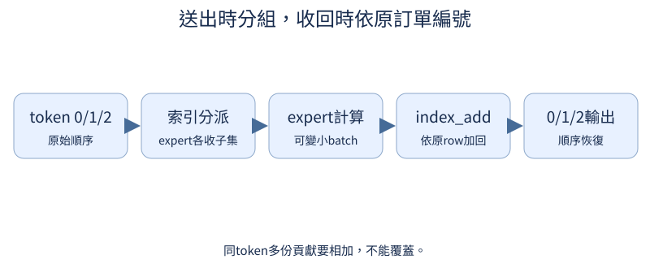

# 第 15 章：從 Dense 到 Mixture of Experts（MoE）

前置：第4章Dense FFN。把token想成訂單，experts像不同廚師，router像分單員。這個譬喻只描述分工：專家不會天生知道中文或數學，專長需由資料與訓練觀察。實作是dropless小型MoE，不需分散式系統。

## 15.1 Dense 的計算方式是什麼？

**先想一想：**T加倍會讓參數加倍嗎？


Dense每筆訂單都走同一位完整廚師，不管內容是什麼。每token使用同一套FFN，是MoE比較的起點。

**把直覺寫成數學：**FFN參數沿token軸共享；每個token的矩陣乘法仍要做。

**最小實驗：**以下程式只處理這節的問題。

```python
from tiny_perceptron.modern import DenseFFN

layer = DenseFFN(8)
for t in (2, 4):
    print(t, layer(torch.randn(1, t, 8)).shape, sum(p.numel() for p in layer.parameters()))
```

**如何讀結果：**參數固定，計算隨token數增加；不要把「共享」誤解成只算一次。

**只改一件事：**只改FFN hidden，觀察所有token使用的同一層變大。

## 15.2 能否準備多組 FFN？

**先想一想：**把同一module放列表三次，是三位獨立廚師嗎？

先準備多套獨立FFN。即使shape相同，它們有不同權重；沒有router時還不知道每筆訂單送哪一位。

**把直覺寫成數學：**E個expert的參數約E×單expert參數。

**最小實驗：**以下程式只處理這節的問題。

```python
from tiny_perceptron.modern import DenseFFN

experts = nn.ModuleList([DenseFFN(4, hidden=8) for _ in range(3)])
x = torch.ones(1, 4)
print([e(x).detach().tolist() for e in experts])
assert experts[0].up.weight is not experts[1].up.weight
```

**如何讀結果：**要新建每一個expert；複製引用會讓參數共用，不是多專家。

**只改一件事：**只故意共用同一module，檢查is身份。

## 15.3 如何決定找誰處理？

**先想一想：**所有expert都forward，MoE是不是已經少算？

soft router先讓每位廚師都做一份，再按比例混合。容易理解但沒有稀疏計算優勢；用它過渡到top-k。

**把直覺寫成數學：**p=softmax(W_router x)，o=Σ_e p_e expert_e(x)。

**最小實驗：**以下程式只處理這節的問題。

```python
router = nn.Linear(4, 3)
x = torch.ones(2, 4)
p = router(x).softmax(-1)
expert_outputs = torch.stack([x, 2 * x, 3 * x], dim=1)
output = (p[:, :, None] * expert_outputs).sum(1)
print(p, output)
assert torch.allclose(p.sum(-1), torch.ones(2))
```

**如何讀結果：**三個expert輸出在此手設，方便核對混合；真實FFN需要獨立權重。

**只改一件事：**只把router權重設零，觀察均勻混合。

## 15.4 能只啟動少數 experts 嗎？

**先想一想：**k=1會讓所有廚師都做嗎？

top-k只送給分數最高的少數廚師。選中哪些是離散決定，gate權重仍是連續數值；兩件事的梯度性質不同。

**把直覺寫成數學：**topk取每token最大的k個p值與expert索引。

**最小實驗：**以下程式只處理這節的問題。

```python
prob = torch.tensor([[0.1, 0.7, 0.2], [0.6, 0.3, 0.1]])
weights, chosen = prob.topk(2, dim=-1)
print(chosen, weights)
```

**如何讀結果：**這裡還沒dispatch；下一節計算gate合併。選中indices本身不可微。

**只改一件事：**只把k改為1。

## 15.5 選中多位 expert 怎麼合併？

**先想一想：**權重0.7、0.2重新除0.9後合計是多少？



有多位被選中時，用gate權重加總回同一個feature向量。常見top-2會重新正規化選中權重；top-1要特別留意梯度問題。

**把直覺寫成數學：**output=Σ_selected gate_e·expert_e(x)；本教材top-1保留原softmax機率。

**最小實驗：**以下程式只處理這節的問題。

```python
weights = torch.tensor([0.7, 0.2])
normalized = weights / weights.sum()
outputs = torch.tensor([[1.0, 0.0], [0.0, 2.0]])
print(normalized, normalized @ outputs)
assert torch.allclose(normalized.sum(), torch.tensor(1.0))
```

**如何讀結果：**輸出可以不落在原token附近；是否保留residual由外層block負責。

**只改一件事：**只交換兩位expert的輸出。

## 15.6 Token 怎麼送出再排回來？

**先想一想：**兩位expert都處理token0，用賦值覆蓋會丟什麼？

分單會改變工作順序，完成後要把結果依原token索引送回。index_add讓同token多位expert的貢獻加在一起，不覆蓋掉前一位。

**把直覺寫成數學：**dispatch=index選取；combine=依token原row加回。

**最小實驗：**以下程式只處理這節的問題。

```python
rows = torch.tensor([2, 0, 2])
contributions = torch.tensor([[1.0, 1.0], [2.0, 2.0], [3.0, 3.0]])
result = torch.zeros(3, 2)
result.index_add_(0, rows, contributions)
print(result)
assert torch.equal(result[2], torch.tensor([4.0, 4.0]))
```

**如何讀結果：**row1沒有任務時保持0；dropless指選中的token不會因容量而丟掉。

**只改一件事：**只把index_add改成覆蓋，觀察token2少一份貢獻。

## 15.7 Router 怎麼收到學習訊號？

**先想一想：**top-1 router grad=0一定是PyTorch壞了嗎？

選擇indices不能微分，但選中的gate機率可以。top-1若把唯一權重除以自己就恆為1，任務loss就無法經gate教router。

**把直覺寫成數學：**p/p=1的導數為0；保留原p或另用可微策略與auxiliary訊號。

**最小實驗：**以下程式只處理這節的問題。

```python
from tiny_perceptron.modern import MoEFFN

layer = MoEFFN(4, experts=3, top_k=1)
output, auxiliary, chosen = layer(torch.randn(2, 3, 4))
output.square().mean().backward()
print("router任務梯度", layer.router.weight.grad.norm().item())
assert layer.router.weight.grad.norm() > 0
```

**如何讀結果：**不是所有MoE實作都用同convention；本教材公式與程式明確對應。

**只改一件事：**只在選中top-1後把gate改成1，重查router梯度。

## 15.8 為什麼 token 都跑去同一位 expert？

**先想一想：**第一位expert有大量訂單，代表它真的最專業嗎？

分單員如果總選同一位，其他廚師很少學習。用受控偏置製造collapse比等待一次訓練偶然發生更容易看懂。

**把直覺寫成數學：**load=count_selected/總選擇次數；不要把soft probability平均和實際load混為一談。

**最小實驗：**以下程式只處理這節的問題。

```python
scores = torch.tensor([[8.0, 0.0, 0.0]]).repeat(12, 1)
chosen = scores.topk(1, -1).indices
load = torch.bincount(chosen.flatten(), minlength=3)
print("受控collapse", load.tolist())
```

**如何讀結果：**偏置反例是結構診斷；自然訓練是否出現需記錄router histogram。

**只改一件事：**只減小第一位分數優勢，觀察仍可能全選同一位。

## 15.9 怎麼鼓勵較均衡的使用？

**先想一想：**負載最平均就一定任務最準確嗎？

負載平衡項鼓勵不要只用同一位。但它和任務loss可能衝突，過強會為平均而分錯單。

**把直覺寫成數學：**aux=E·Σ_e fraction_selected_e·mean_probability_e；選擇頻率stop-gradient。

**最小實驗：**以下程式只處理這節的問題。

```python
from tiny_perceptron.modern import MoEFFN

layer = MoEFFN(4, experts=3, top_k=2)
out, aux, chosen = layer(torch.randn(2, 4, 4))
task = out.square().mean()
total = task + 0.01 * aux
total.backward()
print(task.item(), aux.item(), chosen.tolist())
```

**如何讀結果：**系數0.01是示範配方，需用validation選擇；load、品質與時間一起記錄。

**只改一件事：**只把aux系數提高100倍。

## 15.10 模型究竟有多大？

**先想一想：**top-1會讓未使用的expert權重不佔記憶體嗎？

全部廚師的工具都要存，即使每份訂單只用兩位。MoE總參數可很大，每token啟動expert較少；共享attention另算。

**把直覺寫成數學：**total=shared+E·expert；active_per_token≈shared+k·expert，router另列。

**最小實驗：**以下程式只處理這節的問題。

```python
from tiny_perceptron.modern import MoEFFN

layer = MoEFFN(8, experts=4, top_k=2)
expert = sum(p.numel() for p in layer.experts[0].parameters())
router = sum(p.numel() for p in layer.router.parameters())
print("FFN總參數", 4 * expert + router, "每token啟動估計", 2 * expert + router)
```

**如何讀結果：**這是FFN局部估計，不是完整模型FLOPs或實測memory；固定dtype時再換bytes。

**只改一件事：**只把expert數加倍但k不變。

## 15.11 少算一些就一定更快嗎？

**先想一想：**四位小廚師加分單，會一定快過一位大廚師嗎？

少做理論乘法不保證更快。分單、索引、小矩陣與Python loop都有成本；小CPU模型MoE可能更慢。

**把直覺寫成數學：**wall time需warmup與重複，GPU另同步；total/active參數不是速度測量。

**最小實驗：**以下程式只處理這節的問題。

```python
import time
from tiny_perceptron.modern import DenseFFN, MoEFFN

x = torch.randn(2, 8, 8)
for name, layer in (("Dense", DenseFFN(8)), ("MoE", MoEFFN(8, experts=4, top_k=2))):
    layer(x)
    start = time.perf_counter()
    for _ in range(10):
        layer(x)
    print(name, (time.perf_counter() - start) / 10, "秒/forward，本機tiny測量")
```

**如何讀結果：**當前函數沒有優化dispatch kernel，不能把CPU結果外推到大GPU多節點。

**只改一件事：**只增加token數T，觀察相對開銷。

## 15.12 Expert 容量不夠怎麼辦？

**先想一想：**容量2而有5單，沒處理的3單該怎麼記錄？

先讓所有訂單都送到選中專家，再考慮每位廚師容量上限。超過上限要明確選擇drop、fallback或再分派，不能默默丟token。

**把直覺寫成數學：**capacity≈ceil(capacity_factor·tokens·k/experts)。

**最小實驗：**以下程式只處理這節的問題。

```python
chosen = torch.tensor([0, 0, 0, 1, 0, 0])
capacity = 2
counts = torch.bincount(chosen, minlength=2)
overflow = (counts - capacity).clamp(min=0)
print(counts.tolist(), "overflow", overflow.tolist())
print("本模型dropless；容量限制為另設policy的選修")
```

**如何讀結果：**這個數值檢查沒有改變主模型；實現capacity版本時測輸出與梯度，不只是load。

**只改一件事：**只改capacity，保持router選擇。

## 15.13 如何公平比較 Dense／MoE？

**先想一想：**Dense與MoE hidden相同，總參數就相同嗎？

比較需要先選一種公平：存一樣多參數，或每token做近似一樣的計算。兩種match往往導致不同寬度，結果要分兩張表。

**把直覺寫成數學：**params-matched與compute-matched是不同實驗；另匹配資料、tokens與seed。

**最小實驗：**以下程式只處理這節的問題。

```python
from tiny_perceptron.modern import DenseFFN, MoEFFN

for name, layer in (("Dense", DenseFFN(8, hidden=32)), ("MoE", MoEFFN(8, experts=4, top_k=2, hidden=8))):
    print(name, sum(p.numel() for p in layer.parameters()))
print("另搜hidden以匹配總參數；記錄差距，品質待GPU訓練")
```

**如何讀結果：**這裏只比較參數候選，不宣稱已經compute-matched；router與共享attention也要列。

**只改一件事：**只把top_k改成1，觀察總參數不變、啟動計算變。
