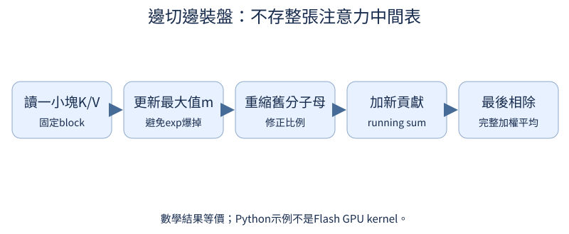

# 第 16 章：由量測帶出效率 BKM

前置：已有第4章能forward與生成的模型。像整理廚房，先找哪一步最慢再改工作流程。CPU小例只驗證數值與資料契約；GPU速度、峯值記憶體與編譯收益必須在讀者的硬體實測。

## 16.1 最慢或最佔空間的是哪裡？

**先想一想：**最大的參數層一定是最慢的層嗎？


只看總時間像知道整餐花多久，卻不知道是在切菜還是等烤箱。profiler把各運算花費列出；先看瓶頸，別一次打開所有優化。

**把直覺寫成數學：**時間、參數bytes、activation峯值是不同量；profiler本身也有開銷。

**最小實驗：**以下程式只處理這節的問題。

```python
from tiny_perceptron.model import TinyLM, ModelConfig
from torch.profiler import profile, ProfilerActivity

model = TinyLM(ModelConfig(width=8))
x = torch.tensor([[1, 2, 3]])
with profile(activities=[ProfilerActivity.CPU]) as p:
    model(x)
print(p.key_averages().table(sort_by="self_cpu_time_total", row_limit=5))
```

**如何讀結果：**只有CPU活動；GPU需CUDA activity與同步。先warmup，再測多次，避免將初始化當穩態。

**只改一件事：**只增加T，找attention相關成本是否增加。

## 16.2 讀提示和生成下一字有何差別？

**先想一想：**提示越長，第一字延遲與後面每字延遲會一樣增加嗎？

prefill像先讀完題目，decode像逐字續寫。兩階段工作量不同：前者有整段query，後者每步只有一格但讀取越來越長的cache。

**把直覺寫成數學：**TTFT與decode tokens/s分開；總延遲還含I/O和tokenizer。

**最小實驗：**以下程式只處理這節的問題。

```python
from tiny_perceptron.model import TinyLM, ModelConfig

model = TinyLM(ModelConfig(width=8))
prefix = torch.tensor([[1, 2, 3, 4]])
prefill = model(prefix)
decode = model(torch.tensor([[5]]), cache=prefill["cache"])
print("prefill logits", prefill["logits"].shape, "decode logits", decode["logits"].shape)
```

**如何讀結果：**不是用相同T的forward假裝decode；第16.3核對兩條路徑同結果。

**只改一件事：**只增加prefix長度，觀察decode query仍只有1格。

## 16.3 生成時重算了什麼？

**先想一想：**cache使用後logits理應改變嗎？

把已讀前文的Key/Value存好，下一字不用重新做舊前文投影。Query仍是新字，且可以看所有過去cache。

**把直覺寫成數學：**cache保存每層K/V與位置偏移；它不是把最終答案緩存。

**最小實驗：**以下程式只處理這節的問題。

```python
from tiny_perceptron.model import TinyLM, ModelConfig

model = TinyLM(ModelConfig(width=8))
ids = torch.tensor([[1, 2, 3, 4]])
full = model(ids)["logits"][:, -1]
prefix = model(ids[:, :3])
cached = model(ids[:, 3:], cache=prefix["cache"])["logits"][:, 0]
print((full - cached).abs().max().item())
assert torch.allclose(full, cached, atol=1e-6)
```

**如何讀結果：**等價檢查先於速度比較；本最小cache不支援混合padding長度，不能悄悄誤用。

**只改一件事：**只把最後token改掉，保持prefix cache，仍應等於新的full forward。

## 16.4 KV cache 怎麼縮小？

**先想一想：**四個Q head、一個KV head，cache能縮幾倍？

多位Query讀者共用較少Key/Value記憶筆記，是GQA的直覺。cache可變小，但投影結構改變，不是原權重任意reshape就有相同品質。

**把直覺寫成數學：**K/V heads=Hkv，Q heads=Hq；Hq必須整除Hkv，本實作存未擴張cache。

**最小實驗：**以下程式只處理這節的問題。

```python
from tiny_perceptron.model import TinyLM, ModelConfig

ids = torch.tensor([[1, 2, 3]])
for kv in (4, 1):
    model = TinyLM(ModelConfig(width=16, heads=4, kv_heads=kv))
    cache = model(ids)["cache"]
    print(kv, sum(t.numel() * t.element_size() for pair in cache for t in pair), "cache bytes")
```

**如何讀結果：**cache縮小不保證任務品質或wall time改善；另訓練匹配架構。

**只改一件事：**只改prefix長度，確認cache bytes線性變化。

## 16.5 Padding 花掉多少工作？

**先想一想：**加EOS就能阻止後面文件看前文嗎？


packing把短文件放同一長序列，減少PAD。若希望文件互相隔離，要另外設segment mask；EOS只是結束符，不是看不見的牆。

**把直覺寫成數學：**allowed=causal AND same_segment；也要處理每文件position與boundary targets。

**最小實驗：**以下程式只處理這節的問題。

```python
from tiny_perceptron.attention import attention_mask

position = torch.arange(5)
segment = torch.tensor([[0, 0, 1, 1, 1]])
allowed = attention_mask(position, position, segments=segment)
print(allowed[0, 0].int())
assert not allowed[0, 0, 4, 0] and allowed[0, 0, 4, 2]
```

**如何讀結果：**此圖是隔離契約；如果刻意串接文件，要明確允許跨文件context。兩種不能混着比較。

**只改一件事：**只移除segments，觀察跨文件可見位置。

## 16.6 Batch 放不下怎麼辦？

**先想一想：**1token與10token的兩個micro-batch，各半權重正確嗎？


大batch放不下，拆成幾次算梯度、最後一次step。每個micro-batch先算loss sum，再除共同有效token總數，不能平均「各batch平均」。

**把直覺寫成數學：**gradient=Σ loss_sum_micro / total_valid_tokens。

**最小實驗：**以下程式只處理這節的問題。

```python
from tiny_perceptron.model import loss_sum

layer = nn.Linear(3, 4)
x = torch.randn(3, 3)
labels = torch.tensor([1, 2, 3])
total_tokens = 3
for rows in (slice(0, 1), slice(1, 3)):
    loss, count = loss_sum(layer(x[rows]), labels[rows])
    (loss / total_tokens).backward()
print("累積梯度", layer.weight.grad.norm().item())
```

**如何讀結果：**沒有step，驗證累加機制；真實訓練要先zero_grad、最後一次clip與step。

**只改一件事：**只改爲每micro獨自平均，比較與整batch的梯度差。

## 16.7 精度能降低嗎？

**先想一想：**佔同樣bytes就代表可表示的範圍一樣嗎？

用較短的浮點表示可省空間與加快某些硬體，但動態範圍與精度也改了。autocast替適合運算選dtype，loss等敏感量常保留FP32。

**把直覺寫成數學：**FP16與BF16都16bits，但exponent/mantissa配置不同；訓練FP16常需GradScaler。

**最小實驗：**以下程式只處理這節的問題。

```python
a = torch.randn(4, 4)
b = torch.randn(4, 4)
with torch.autocast("cpu", dtype=torch.bfloat16):
    low = a @ b
full = a @ b
print(low.dtype, "誤差", (low.float() - full).abs().max().item())
```

**如何讀結果：**這是CPU BF16數值例，不能證明CUDA Tensor Core加速。MPS/CUDA依支持選dtype並測。

**只改一件事：**只把輸入幅度放大，觀察數值風險。

## 16.8 手寫 attention 怎麼換成最佳化介面？

**先想一想：**手寫mask裏的True是允許，傳SDPA時要反轉嗎？


先手算做對，再換同數學條件的SDPA。它可能選不同後端；True在這個API代表「允許看」，不一定和其他mask API一致。

**把直覺寫成數學：**SDPA默認內部縮放QKᵀ/√D；不要提前縮一次又讓它再縮一次。

**最小實驗：**以下程式只處理這節的問題。

```python
from tiny_perceptron.attention import manual_attention

q, k, v = [torch.randn(1, 1, 4, 3) for _ in range(3)]
allowed = torch.ones(4, 4, dtype=torch.bool).tril()[None, None]
manual, _ = manual_attention(q, k, v, allowed)
optimized = F.scaled_dot_product_attention(q, k, v, attn_mask=allowed, dropout_p=0.0)
print((manual - optimized).abs().max().item())
assert torch.allclose(manual, optimized, atol=1e-6)
```

**如何讀結果：**dropout_p=0在兩路固定；模型梯度等價另由核心tests驗證。

**只改一件事：**只把mask反轉，說明爲什麼結果不再相同。

## 16.9 Attention 中間矩陣為何佔空間？

**先想一想：**沒有存整張T×T表，還能求完整softmax平均嗎？



FlashAttention像一邊切菜一邊裝盤，不把整張巨大中間表來回搬存儲。關鍵是分塊與online softmax仍得到同數學結果，不是近似丟掉注意力。

**把直覺寫成數學：**維護每行running最大值、分母與加權分子，換最大值時同時重新縮放。

**最小實驗：**以下程式只處理這節的問題。

```python
from tiny_perceptron.efficiency import online_attention

q, k, v = torch.randn(3, 4), torch.randn(7, 4), torch.randn(7, 2)
reference = (q @ k.T / (4**0.5)).softmax(-1) @ v
streamed = online_attention(q, k, v, block_size=2)
print((reference - streamed).abs().max().item())
assert torch.allclose(reference, streamed, atol=1e-6)
```

**如何讀結果：**這份Python CPU數值版不是Flash GPU kernel，反向也不具其省memory實現。實際用相容GPU的SDPA後端測峯值。

**只改一件事：**只把block_size改爲3，結果仍應等價。

## 16.10 怎麼用重算換記憶體？

**先想一想：**少存中間結果，會免費節省而不增加運算嗎？

訓練需保存forward中間結果供backward。checkpointing只留部分，backward再算一次，像少存筆記、多重做一遍。不是模型檔案checkpoint。

**把直覺寫成數學：**時間換activation memory；dropout等隨機狀態要保持可重現。

**最小實驗：**以下程式只處理這節的問題。

```python
from torch.utils.checkpoint import checkpoint

layer = nn.Sequential(nn.Linear(4, 8), nn.GELU(), nn.Linear(8, 4))
x = torch.randn(2, 4, requires_grad=True)
y = checkpoint(layer, x, use_reentrant=False)
y.square().sum().backward()
print(y.shape, x.grad.norm().item())
```

**如何讀結果：**CPU這格檢查可微與輸出；峯值memory取捨要在實際訓練GPU上量測。

**只改一件事：**只用正常layer(x)，覈對相同seed權重的梯度。

## 16.11 編譯有何代價與收益？

**先想一想：**只量第一次compiled調用，可以推斷長跑速度嗎？

編譯先花時間分析與生成優化路徑，之後纔可能更快。短任務可能不回本；動態shape或Python分派可能觸發重編譯。

**把直覺寫成數學：**總時間=編譯開銷+N×穩態時間；N很小時未必有收益。

**最小實驗：**以下程式只處理這節的問題。

```python
layer = nn.Linear(4, 3)
x = torch.randn(2, 4)
compiled = torch.compile(layer, backend="eager")
assert torch.allclose(compiled(x), layer(x))
print("圖捕獲接口通過；backend=eager不是速度優化")
print("真實實驗另用默認backend，並記錄首跑、warmup、steady-state")
```

**如何讀結果：**eager避免Notebook意外長編譯，只檢查接口。實際GPU編譯需單獨入口，不用這個結果宣傳加速。

**只改一件事：**只改變輸入shape，觀察真實backend是否重新編譯。
