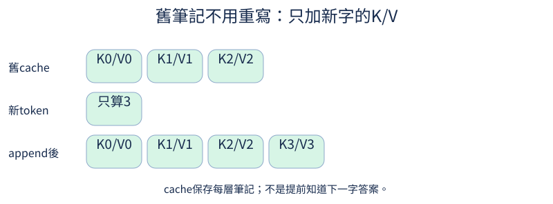
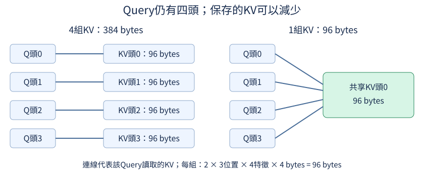
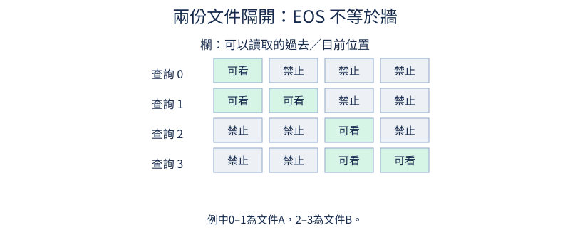
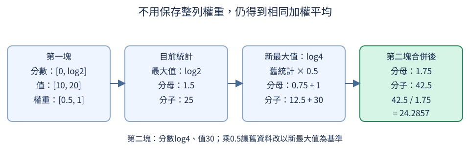

# 第 16 章：由量測帶出效率 BKM

模型慢、長對話快取太大，或訓練批次放不下，原因可能完全不同。本章先從[定位成本](16.md#16.1)開始，再分別檢查生成快取、短文件裝填、梯度累積與精度。後半段追蹤注意力分塊、反向重算及編譯的數值與資源取捨。每個CPU小例子先建立可核對的運算關係，真正的速度與最高記憶體收益則要在指定硬體、輸入長度與工作模式下量測。

## 16.1 最慢或最佔空間的是哪裡？

模型跑完用了兩秒，究竟慢在注意力、特徵處理，還是程式第一次初始化？只看總時間，像只知道一餐準備了多久，卻不知道該改善哪個步驟。開始改效率以前，先量出成本的位置。本章標題的BKM指Best Known Method，也就是在明確條件下目前已知的做法；條件變了，應重新量測，不能把某個選項名稱當成速度保證。

前置是[一層模型的組成](04.md#4.5)與[矩陣使用量不等於耗時](15.md#15.11)。這裡使用已備妥的TinyLM小型文字模型：輸入token ID，經查表、注意力與FFN後，替每個位置輸出詞表分數。profiler（效能剖析器）會記錄各運算的時間與呼叫次數，幫我們找到下一個值得研究的瓶頸。

```python
import torch
from torch.profiler import profile, ProfilerActivity
from tiny_perceptron.model import TinyLM, ModelConfig

torch.set_num_threads(1)
model = TinyLM(ModelConfig(width=8)).eval()
ids = torch.tensor([[1, 2, 3]])
with torch.no_grad():
    for _ in range(3):
        model(ids)
    with profile(activities=[ProfilerActivity.CPU]) as p:
        for _ in range(5):
            result = model(ids)
print("分數形狀", tuple(result["logits"].shape))
print(p.key_averages().table(sort_by="self_cpu_time_total", row_limit=5))
print("權重bytes", sum(v.numel() * v.element_size() for v in model.parameters()))
```

輸入一列三個ID，預設詞表264項，第一行應為 `(1,3,264)`，可確認確實執行了整個模型而非空迴圈。先跑三次暖機，避免把第一次初始化當成穩定成本；再記錄五次向前計算，`key_averages`依運算名稱彙整。這裡只開CPU活動，不會替你量到GPU工作。

表中的Self CPU表示運算自身花的時間，不包含子運算；CPU total還包括它呼叫的子運算。按Self排序有助找直接耗時的工作，但不能把全部total列加起來，因為父子可能重複計數。`# of Calls`是記錄期間呼叫次數：有些線性層在模型裡出現多次，五輪後次數自然比5大。`aten::`前綴是PyTorch底層運算名稱，例如矩陣乘法與softmax；在此TinyLM中，`aten::index_select`對應字與位置的查表，`aten::softmax`或`aten::_softmax`對應注意力分數轉權重，`aten::gelu`則對應FFN中的啟動函數。這樣才能由名稱追到模型哪一段；表的排序可能隨本機量測改變。

最後一行的`numel()`回報參數表有幾個元素，`element_size()`回報每個元素占幾bytes，兩者相乘才是該表的數字bytes，再沿所有參數表相加。此設定6104個FP32參數、每個4bytes，應得24416bytes；它與表中的微秒是不同單位。執行時還有中間特徵、生成用的cache；訓練更有梯度與優化器狀態，所以權重大小不能代表最高記憶體占用。profiler本身也會增加開銷，主要用於定位，總耗時應另以重複計時核對。

練習把ids改成 `torch.arange(1,13)[None]`，也就是一段十二個token。先預測分數形狀變成 `(1,12,264)`、權重bytes不變，再重跑比較前五項時間。短CPU例子可能排序不穩定，應多跑幾輪；你要找的是隨序列長度變大的成本，而不是記住某台機器某次的第一名。

## 16.2 讀提示和生成下一字有何差別？

輸入一段提示後，模型先等待一會才吐出第一個字，接著逐字續寫。這兩種等待來自不同工作：一開始要處理整段提示，後面每次只處理剛加入的token。前者稱prefill，後者稱decode。這裡token是文字切分後的一個生成單位，可能是字、詞片段或一個字的部分，[不一定是一個完整字](06.md#6.7)；程式的ID代表這些單位。若只用一個「每秒幾字」平均值，可能掩蓋長提示造成的首字等待，或每一步生成隨前文變長而變慢的情況。

前置是[注意力查詢與被查詢](03.md#3.3)、[取回內容](03.md#3.4)與[下一字分數](04.md#4.6)。Query是目前位置提出的查詢，Key供比對，Value是比對後取回的內容。prefill對提示的每個位置都有Query；decode只對剛加入的位置做新的Query，但仍要讀前面所有Key和Value。把已算好的K、V保存起來供後續使用，叫KV cache（快取）。

假設提示ID是 `[1,2,3,4]`，prefill產生四個位置的分數，其中最後一個位置用來選擇下一個token。為了觀察形狀，下面直接假定接著選到ID5，把它送入decode。此例不宣稱隨機模型真的會選5，也不測語言品質。`eval()`把模型切換成推理模式；`torch.no_grad()`暫停記錄訓練用的反向梯度，因為這裡只看向前形狀，不需要保存反向計算。兩者用途不同，可回顧[eval與梯度](05.md#5.17)。

```python
import torch
from tiny_perceptron.model import TinyLM, ModelConfig

model = TinyLM(ModelConfig(width=8)).eval()
prefix = torch.tensor([[1, 2, 3, 4]])
with torch.no_grad():
    prefill = model(prefix)
    decode = model(torch.tensor([[5]]), cache=prefill["cache"])
print("prefill分數", tuple(prefill["logits"].shape))
print("decode分數", tuple(decode["logits"].shape))
print("第一層K形狀", tuple(prefill["cache"][0][0].shape), tuple(decode["cache"][0][0].shape))
```

預設詞表264項，前兩行應為 `(1,4,264)` 與 `(1,1,264)`：一段提示的四個位置，對比一個新位置。`prefill["cache"]`存每層的一對K、V，`[0][0]`取第一層的K。其形狀從 `(1,1,4,8)`變成 `(1,1,5,8)`，四軸依序是一段輸入、一個注意力頭、前文長度、每頭八個特徵。新Query只有一格，保存的前文卻從四格增加到五格。

所以decode不是與prefill相同長度的向前計算，也不是只看新token、完全忽略前文。前文投影可以重用，注意力比對與加權取回仍須讀cache；生成越長，cache越大，每一步需要讀的內容也可能增加。下一節會核對這條快取路徑與重算整段是否輸出相同。

量服務體驗時，可以分開報TTFT（Time To First Token，從送出請求到第一個token的等待時間）與後續decode的tokens/s。TTFT可能包含文字切分、資料傳入及排隊，不等於本例的prefill呼叫時間；也應註明提示長度、輸出長度與同時處理的請求數，才能比較。

練習只把prefix改成六個ID，仍只送一個新ID進decode。先預測分數形狀 `(1,6,264)`與 `(1,1,264)`，K長度6與7，再執行核對。你應能指出哪些工作隨提示變長，哪些軸在每步生成時仍保持一格。

## 16.3 生成時重算了什麼？

模型讀完 `[1,2,3]`，再加入ID4，最直接的做法是把 `[1,2,3,4]`整段重新送入。可是前面三個位置的Key、Value不是已經算過了嗎？因果注意力只允許每個位置讀到自己和過去，因此加入未來的ID4不會改變前面三個位置的特徵；我們可以保留它們各層的K、V，下次只算新位置。本節要先核對這樣重用是否保持結果相同，再談省時間。

前置是[prefill與decode的形狀](16.md#16.2)和[因果遮罩](03.md#3.6)。cache保存每層注意力裡的Key與Value，不是把完整回答記起來，也不是免去新位置的所有工作。新token仍要查表、算Query與自己的K/V、對所有過去位置做注意力，再經過[FFN前饋網路](04.md#4.4)，也就是對每個位置各自轉換特徵的兩層網路；省掉的是舊位置重複的投影與特徵處理。

圖中的0、1、2、3是位置編號，並非本例輸入ID。上列K0/V0至K2/V2是已保存的三個位置；中列「只算3」是新位置的K/V；下列append意指接到原快取後面，成為四格。新Query比較的是下列完整筆記，不能只比較新格。



```python
import torch
from tiny_perceptron.model import TinyLM, ModelConfig

torch.manual_seed(0)
model = TinyLM(ModelConfig(width=8)).eval()
ids = torch.tensor([[1, 2, 3, 4]])
with torch.no_grad():
    full = model(ids)["logits"][:, -1]
    prefix = model(ids[:, :3])
    step = model(ids[:, 3:], cache=prefix["cache"])
    cached = step["logits"][:, 0]
error = (full - cached).abs().max().item()
print("兩路分數形狀", tuple(full.shape), tuple(cached.shape))
print("最大差異", error)
assert torch.allclose(full, cached, atol=1e-6)
```

`ids[:,:3]`取前三個ID，`ids[:,3:]`只取第四個。重算整段時最後位置索引為-1；快取路徑只有新位置，所以取索引0。兩者都是用讀完ID4後的狀態預測下一個token，不能拿prefill最後位置的分數與它比較，因為那是只讀到ID3時的預測。兩路形狀應同為 `(1,264)`，最大差異通常為零或很小的浮點尾數，assert要求接近到指定容忍範圍。

位置也必須對齊。新位置不能重新當成位置0，程式根據cache已有三格，自動從位置3開始；若忘記這個offset（起始偏移），即使K/V形狀正常，結果也可能不同。若改了前文、權重或位置規則，舊cache通常要重建，不能繼續沿用。此小實作也沒有處理同batch內不同有效長度的padding快取，不能把固定長度例子默默推到那種輸入。

練習只把最後ID4改成ID5，仍用相同前三個ID的prefix cache；先預測兩路仍接近，再執行核對。接著把第一個ID改掉，必須重新建立prefix。區分這兩種改動，你就知道快取保存的是哪一段計算，而非一份對所有問題都通用的答案。

## 16.4 KV cache 怎麼縮小？

如果每個注意力頭都保存一份Key、Value，長對話會讓快取占用持續增加。可以保留多個Query頭，讓幾個Query頭共用同一組K、V嗎？前置是[多頭注意力](03.md#3.7)與[KV快取](16.md#16.3)：每個頭用一小組特徵做比對，K、V按每層、每頭、每個過去位置保存。多個Query頭共用較少的KV頭，叫Grouped-Query Attention（GQA，分組查詢注意力）。

例如模型寬度16，Query有四頭，每頭四項特徵。FP32是32位元浮點數，每個數占4 bytes。若KV也有四頭，三個位置、一段輸入，用FP32保存K和V的數字需 `2×4×3×4×4=384` bytes：第一個2是K與V各一份，最後一個4是每個FP32數字的bytes。若四個Query頭改共用一個KV頭，只有頭數由4變1，快取變成96 bytes。Query仍然各自計算，並不是把四個頭全部合成同一個查詢。

下圖的「頭0至3」是注意力頭編號，不是位置編號。左側每個Query讀自己的KV，右側四個Query都讀同一組；連線表示讀取關係，每組仍保存三個位置，96 bytes的計算條件與上述相同。



```python
import torch
from tiny_perceptron.model import TinyLM, ModelConfig

ids = torch.tensor([[1, 2, 3]])
with torch.no_grad():
    for kv_heads in (4, 1):
        model = TinyLM(ModelConfig(width=16, heads=4, kv_heads=kv_heads)).eval()
        cache = model(ids)["cache"]
        size = sum(t.numel() * t.element_size() for pair in cache for t in pair)
        print("KV頭數", kv_heads, "K形狀", tuple(cache[0][0].shape), "bytes", size)
```

此例只有一層。`cache`中的每個pair是一層的K、V。`t.numel()`數出tensor的元素個數，`t.element_size()`給每元素占用的bytes，相乘就是該tensor的數字儲存量；迴圈再把各層的K、V兩份加總。K形狀分別是 `(1,4,3,4)`與 `(1,1,3,4)`，bytes為384與96。這個實作保存未擴張的KV；比對時讓Query讀共享內容，不把四份重複副本存進cache，否則儲存收益會消失。

一般分組設定要求Query頭數能被KV頭數整除，例如四個Query、兩個KV，每組有兩個Query；全部Query共用一個KV的情況也常稱Multi-Query Attention（MQA）。投影權重的形狀與共享方式會改變，不能隨意把訓練好的四頭KV重排成一頭，就宣稱原模型功能保持不變。

快取縮四倍也不代表整個模型記憶體縮四倍：權重、其他中間特徵仍然存在。它不保證實際耗時或答案品質改善，需要在相容架構上訓練、核對快取路徑與量測。此程式只是同一輸入的結構與儲存比較，兩個模型權重各自初始化，沒有做品質競賽。

練習只把ids延長成六個ID，先預測K的位置軸加倍、bytes變成768與192，比例仍四倍，再執行核對。你應能分辨「前文變長」與「KV頭數減少」分別改了哪個儲存維度。

## 16.5 Padding 花掉多少工作？

訓練設定每段固定四格，兩份短文件各只有兩個token，若分別補到四格，就有八個位置、只有四個是真實內容。補進去的PAD雖然不算答案誤差，普通矩陣運算仍可能處理它們。把短文件接到同一段、充分使用這四格，叫sequence packing（序列裝填）。但我們若想讓兩份文件各自獨立，接起來時還要阻止它們互相讀取，不能只省空間而改了學習問題。

前置是[因果遮罩](03.md#3.6)和[填充位置](07.md#7.7)。PAD是補齊長度的符號，EOS是文件或回答結束的符號。EOS只是模型看到的一個token，不會讓注意力自動失明。例如A占位置0、1，B占2、3；普通因果遮罩允許位置3讀0至3，其中就包含A。若需要文件隔離，除了不能看未來，還要限制Query與Key屬於同一文件。

圖的列是Query所在位置，欄從左至右是可讀位置0至3。綠格代表允許，灰格代表禁止。B的兩列雖然排在A之後，左側兩欄仍為灰色；右上角禁止是因果限制，左下角禁止則來自跨文件隔離，兩者理由不同。



```python
import torch
from tiny_perceptron.attention import attention_mask

position = torch.arange(4)
segment = torch.tensor([[0, 0, 1, 1]])
allowed = attention_mask(position, position, segments=segment)
print("隔離文件", allowed[0, 0].int().tolist())
causal_only = attention_mask(position, position)
print("只用因果的最後一列", causal_only[0, 0, -1].int().tolist())
```

`segment`每項記錄該位置的文件編號；0與1不是權重或時間，是兩份文件的身份。`attention_mask`把「Key位置不晚於Query」與「文件編號相同」取交集，返回batch、head、Query、Key四軸布林表。batch是同時處理的資料筆數，head是[一種注意力讀法](03.md#3.7)；本例這兩軸的長度都為1，完整形狀是 `(1,1,4,4)`。`[0,0]`取第一段、第一頭，`int`把True/False印成1/0。四列應為 `[1,0,0,0]`、`[1,1,0,0]`、`[0,0,1,0]`、`[0,0,1,1]`，正好對應圖。只用因果的最後一列則為 `[1,1,1,1]`。

packing還需處理每份文件的位置編號，以及跨邊界的下一字答案。例如A的EOS後面雖接著B第一字，不應把「預測B第一字」當成A的目標，除非你有意訓練跨文件續寫。每份文件可以重新從位置0開始，但注意力遮罩仍要知道文內先後與segment，不能把兩個位置0誤當同一token。這段程式只核對隔離遮罩，沒有悄悄完成資料裝填的所有步驟。

練習只移除 `segments=segment`，先預測位置2也能讀0、1，與圖左下角不同，再執行核對。裝填減少PAD不代表同樣比例的速度收益：某些實作仍建立完整方陣，需看實際運算；若刻意允許文件互相讀取，也要將它記成另一種訓練設定。

## 16.6 Batch 放不下怎麼辦？

想讓三筆資料一起決定一次更新，記憶體卻只能同時放其中一兩筆，可以分次計算、最後再更新嗎？可以，但要把各份資料的誤差按原本的比例相加，不能平均「兩次各自的平均」。這種做法叫gradient accumulation（梯度累積）：多次向後計算都加到同一份梯度，最後只做一次參數更新。前置是[梯度暖身](../first-steps.md#W.6)；梯度表示改動權重對誤差的影響，PyTorch的backward預設會累加它。

用一個權重w=1與三個輸入 `[1,2,3]`，希望輸出全為零，誤差取各輸出的平方。整批平均誤差是 `(1+4+9)/3=14/3`，對w的梯度是 `2×(1+4+9)/3=28/3`，約9.3333。若拆成一筆與兩筆，第一份誤差和1，第二份誤差和13；兩份都除以共同總數3，累加仍是原來的14/3。

```python
import torch

x = torch.tensor([1.0, 2.0, 3.0])
whole = torch.tensor(1.0, requires_grad=True)
(whole * x).square().mean().backward()
accumulated = torch.tensor(1.0, requires_grad=True)
wrong = torch.tensor(1.0, requires_grad=True)
for part in (x[:1], x[1:]):
    ((accumulated * part).square().sum() / len(x)).backward()
    ((wrong * part).square().mean() / 2).backward()
print("整批梯度", round(whole.grad.item(), 4))
print("正確累積", round(accumulated.grad.item(), 4))
print("錯誤平均", round(wrong.grad.item(), 4))
```

`x[:1]`取索引1之前，也就是第一筆；`x[1:]`取索引1到結尾，也就是後兩筆，切片終點本身不包含在內。三個權重初值相同但獨立，分別核對三種計算。正確那行先取每份的誤差和，再除以共同的3；每次backward會把新貢獻加到accumulated.grad。錯誤那行先對份內求平均，再讓兩份各占一半，相當於第一筆占一半、第二與第三筆各占四分之一，已不是三筆等權。輸出應為9.3333、9.3333與7.5：程式能跑不代表平均方式正確。

真實語言模型通常按有效答案token計算誤差，這裡「有效」指[確實納入答案誤差的位置](07.md#7.3)，[PAD](07.md#7.7)則是補齊長度的符號，不是要學的答案。有的micro-batch（拆出的較小批次）只有一個有效token，有的有十個，因此分母應是累積範圍內的有效token總數，不是迴圈次數，也不是包含PAD的表格大小。只有每份有效數完全相同時，「各份平均再平均」才會與整體平均相同。

訓練操作順序也很重要：先清除前一輪梯度，再對各份backward，最後才裁剪梯度（整份梯度過大時一起縮小，避免更新突然太大），再做一次step更新權重。若每份都step，後一份看到的是更新後的權重，就不再是同一個大batch。此例沒有step，只驗證梯度。有些運算依同一批資料共同計算平均值等統計，拆批就可能改變它；dropout則是在訓練時隨機關閉部分特徵，分次計算可能抽到不同遮罩。這些行為需另核對，不能把任何模型分批都視為無條件等價。

練習只改拆法為兩筆與一筆：`(x[:2],x[2:])`。先預測正確梯度仍9.3333，錯誤方式改為11.5，再執行核對。拆法不該影響同一整批的權重，如果結果變了，先檢查每筆資料到底被分配了多少份量。

## 16.7 精度能降低嗎？

同一個權重若用四bytes保存，與用兩bytes保存，前者通常能分辨更細的差異；後者省空間，也可能讓支援它的硬體更快。但兩種「兩bytes浮點數」不一定能表示相同範圍。先回顧[數值尺度](14.md#14.2)：後續運算不只在乎形狀，還會受數字大小影響。本節要觀察較短的浮點表示如何改變一次矩陣乘法。

FP32是32位元浮點數，一個數字四bytes；FP16與BF16都是16位元、兩bytes。浮點表示可粗略想成「有效數字×某個次方」：存較多有效數字的位元，附近刻度更細；存較多次方的位元，可表示的極大與極小數範圍更寬。FP16通常比BF16有更細的相對精度，但最大有限值約65504；BF16保留較寬的次方範圍，最大值約3.39×10³⁸，接近FP32。

用固定輸入做CPU的BF16小實驗。第一個矩陣的數字刻意接近整數，BF16可能把1.001等值捨入到1，讓輸出有可追蹤的差異。`autocast`是PyTorch依運算選擇較低精度的介面；這裡只在包住的矩陣乘法使用，不手動改原輸入的儲存型別。

```python
import torch

a = torch.tensor([[1.001, 2.002], [3.003, 4.004]])
b = torch.tensor([[0.5, 1.0], [1.5, -1.0]])
full = a @ b
with torch.autocast("cpu", dtype=torch.bfloat16):
    low = a @ b
print("原輸入型別", a.dtype, "低精度輸出", low.dtype)
print("FP32", full.round(decimals=4).tolist())
print("BF16", low.float().tolist())
print("最大差異", round((full - low.float()).abs().max().item(), 4))
```

第一行應看到原輸入仍torch.float32，輸出是torch.bfloat16。FP32結果約 `[[3.5035,-1.001],[7.5075,-1.001]]`，BF16約 `[[3.5,-1],[7.5,-1]]`，最大差異約0.0075。`low.float()`把結果轉回FP32，只為方便比較，不能恢復先前已被捨入丟掉的細節。這個差異不是一層權重學壞了，而是表示與運算精度改變。

混合精度訓練通常讓合適的矩陣運算用低精度，某些誤差計算與累加仍用FP32。[梯度](../first-steps.md#W.6)是損失對參數的變化率，由反向傳播沿計算關係求出，用來決定更新方向。FP16計算中的微小梯度可能太小而無法表示，變成零，這叫下溢。GradScaler是管理這個尺度的工具：先把損失乘上倍率，例如1024，再反向傳播算出同樣放大1024倍的梯度，更新參數前再除以同一倍率，縮回原尺度。放大是為了減少計算途中小量變成零的情形，不是把學習率任意放大1024倍。這是額外的數值管理，不能只改dtype就假設訓練安全。BF16範圍較寬，也仍會有捨入誤差；每個硬體支援的運算不同，應核對結果與實際耗時。

練習只把a乘10，先預測最大絕對差異大致放大，而非保持0.0075；重跑看實際捨入結果。再把a改成全整數，預測本例兩路更接近。CPU數字核對能說明精度取捨，不能證明GPU加速或整個模型品質保持不變。

## 16.8 手寫 attention 怎麼換成最佳化介面？

手寫注意力讓每一步容易檢查，但矩陣分數、遮罩、softmax與加權取回分開執行，也可能多次配置與搬移中間資料。PyTorch提供把這段運算合在一起的介面，稱scaled dot-product attention（縮放點積注意力，SDPA）。更換時第一件事不是計時，而是確認輸入軸、縮放和遮罩語意相同；否則較快的結果可能已經算了另一個問題。

前置是[分數縮放](03.md#3.5)、[因果遮罩](03.md#3.6)與[多頭的形狀](03.md#3.7)。每個頭的Query、Key有D項特徵，原分數是 `QKᵀ/√D`，softmax後乘Value。本例一段輸入、一頭、四位置、每位置三項特徵，所以Q/K/V形狀都是 `[1,1,4,3]`，D=3。布林遮罩True在這個SDPA介面表示「允許讀」，不是「遮掉」。

圖的列是Query，欄是Key位置，對角線包含自己，左下角是過去，右上角是未來。綠色允許、灰色禁止；下方的最後位置可以讀四格，而第一位置只能讀自己。下面程式的 `tril`正是建立這個下三角規則。


```python
import torch
import torch.nn.functional as F

torch.manual_seed(0)
q, k, v = [torch.randn(1, 1, 4, 3) for _ in range(3)]
allowed = torch.ones(4, 4, dtype=torch.bool).tril()[None, None]
scores = q @ k.transpose(-2, -1) / (3**0.5)
weights = scores.masked_fill(~allowed, float("-inf")).softmax(-1)
manual = weights @ v
optimized = F.scaled_dot_product_attention(q, k, v, attn_mask=allowed, dropout_p=0.0)
print("輸出形狀", tuple(optimized.shape))
print("最大差異", (manual - optimized).abs().max().item())
assert torch.allclose(manual, optimized, atol=1e-6)
```

`transpose(-2,-1)`只交換Key的最後兩軸，保留batch和head；`[None,None]`替四乘四遮罩補上前兩軸，以便同一規則套到注意力分數。手寫路徑先縮放一次，把禁止格填成負無窮大，它們softmax後權重為零。SDPA內部已做相同縮放，傳入q時不要再先除√3，否則會縮放兩次。`dropout_p=0.0`停用隨機丟棄權重，讓兩路比較同一數學問題。[模型的eval評估模式](05.md#5.17)會停用模型層中的某些訓練行為，但這個SDPA函式仍照傳入的`dropout_p`執行；評估時也必須明確傳0.0，不能期待它隨模型模式自動清零。

輸出形狀應為 `(1,1,4,3)`，最大差異通常是零或約10⁻⁷的浮點尾數，assert確認接近。SDPA可能依裝置、精度和形狀選擇不同底層算法；[FlashAttention](16.md#16.9)是一種減少注意力中間資料讀寫的GPU實作，使用SDPA介面不保證選到它，更不保證在CPU小尺寸下加速。模型訓練還要核對梯度，這個例子只隔離向前數值與資料契約。

練習只將SDPA的 `attn_mask=allowed` 改成 `attn_mask=~allowed`，保留手寫路徑。先預測兩路不再相同，再執行觀察assert失敗；這不是最佳化誤差，而是可見位置完全改變。練習結束改回原遮罩，再把`torch.manual_seed(0)`的0改成1，從頭執行以產生另一組可重現的Q/K/V。先預測輸出形狀不變、兩路仍應接近且assert通過，再核對，確認對齊不是只發生在原來那組輸入。

## 16.9 Attention 中間矩陣為何佔空間？

長度T的注意力要比較每個Query與每個Key，分數表有T×T格。T由4增到8，格數由16變64；若T=8192，一個頭就有約6711萬格。即使不增加模型權重，保存分數與softmax權重的中間表也可能很占記憶體。能否分塊讀Key、Value，一邊計算一邊累積結果，不把整張表放在主記憶體裡？

前置是[SDPA的縮放點積與softmax](16.md#16.8)。FlashAttention的關鍵做法是分塊與減少中間資料搬移；它仍計算完整注意力，不是任意丟掉低權重位置。先看一個Query、三個候選：分數 `[0,log(2),log(4)]`，Value為 `[10,20,30]`。取指數得到 `[1,2,4]`，加權結果 `(10+40+120)/7=24.2857`。我們要在兩塊內得到同一數字。

softmax為避免指數太大，會減去本列最大分數。第一塊只有前兩項，最大是log2，指數權重 `[0.5,1]`，分母1.5，加權分子25。第二塊帶來log4，最大值改了；舊分子、分母都要乘 `exp(log2-log4)=0.5`，再加新權重1與新Value30，得到分母1.75、分子42.5。兩者相除仍24.2857。只保留分母或忘記同步縮放分子，都會算錯。

圖中的分子是尚未除以總權重的加權總和，箭頭是處理先後。第三框的「×0.5」把舊統計改到新最大值的基準，再加入第二塊，並不是給第二塊額外折扣。



```python
import math
import torch

scores = torch.tensor([0.0, math.log(2), math.log(4)])
values = torch.tensor([10.0, 20.0, 30.0])
m = torch.tensor(float("-inf"))
denominator = torch.tensor(0.0)
numerator = torch.tensor(0.0)
for start in range(0, 3, 2):
    block = scores[start : start + 2]
    new_m = torch.maximum(m, block.max())
    factor = torch.exp(m - new_m)
    weight = torch.exp(block - new_m)
    denominator = denominator * factor + weight.sum()
    numerator = numerator * factor + (weight * values[start : start + 2]).sum()
    m = new_m
    print("分母/分子", denominator.item(), numerator.item())
print("分塊結果", round((numerator / denominator).item(), 4))
print("完整結果", round((scores.softmax(0) * values).sum().item(), 4))
```

初始最大值是負無窮大，第一次縮放係數為零，沒有舊貢獻。兩輪印出1.5/25與1.75/42.5，最後兩行都是24.2857。`range(0,3,2)`每次讀最多兩項，最後只有一項；沒有保存完整softmax權重。這種依序更新統計的技巧稱online softmax，online指逐塊處理，不是連上網路。

這個CPU標量例子只示範數學。實際FlashAttention還將Query、Key、Value分塊放入GPU較快的片上記憶體，安排專用運算與反向重算；Python迴圈本身不具這些速度或訓練記憶體收益。要驗證收益，應在相容硬體使用對應SDPA後端，再量測時間與最高記憶體占用。

練習把每塊大小由2改成1：`range(0, 3, 2)`最後的2，以及兩處切片`scores[start : start + 2]`、`values[start : start + 2]`裡的2，都一起改成1。迴圈步長與每次讀取數量要一致，才不會重複讀取候選。先預測中間統計出現三輪，但最終仍24.2857，再執行核對。分塊方式應影響儲存與工作安排，不能改變所計算的加權平均。

## 16.10 怎麼用重算換記憶體？

訓練時，向前計算不只是產生答案，也會留下中間特徵，讓向後計算知道每個權重怎麼影響誤差。如果層很深或輸入很長，這些特徵可能比權重本身更占記憶體。可以少存一些，等向後計算需要時，再從較早的輸入重算嗎？這叫activation checkpointing（中間特徵檢查點）：拿額外計算換較少保留的特徵，不是把模型存成權重檔的checkpoint。

前置是[梯度暖身](../first-steps.md#W.6)與[特徵處理的MLP](14.md#14.4)。以「四項特徵擴成八項、套GELU、再收回四項」為例，普通訓練會保存導數計算需要的中間結果；checkpoint版本把這段當作可重算區域，保留必要邊界資料，向後時再執行區域中的運算。權重沒有刪掉，誤差目標也應保持相同。

```python
import torch
from torch import nn
from torch.utils.checkpoint import checkpoint

torch.manual_seed(0)
layer = nn.Sequential(nn.Linear(4, 8), nn.GELU(), nn.Linear(8, 4))
base = torch.randn(2, 4)
x_plain = base.clone().requires_grad_()
x_recompute = base.clone().requires_grad_()
y_plain = layer(x_plain)
y_recompute = checkpoint(layer, x_recompute, use_reentrant=False)
y_plain.square().sum().backward()
y_recompute.square().sum().backward()
print("輸出形狀", tuple(y_recompute.shape))
print("輸出最大差", (y_plain - y_recompute).abs().max().item())
print("輸入梯度最大差", (x_plain.grad - x_recompute.grad).abs().max().item())
assert torch.allclose(x_plain.grad, x_recompute.grad, atol=1e-6)
```

輸入兩列、每列四項特徵，兩條路共用同一個layer和相同數值的輸入，但x各自獨立，以便比較梯度。`requires_grad_`使輸入也記錄梯度；`checkpoint`包住整段layer，`use_reentrant=False`選用會記錄前向求導關係、在反向時按需重算中間結果的方式，框架自己管理這些重算，不要求你另寫求導程序。兩個誤差都是輸出平方和，沒有更新權重，所以後算的那條路仍使用同一份權重。

輸出形狀應是 `(2,4)`，輸出最大差與輸入梯度最大差應為零或小於容忍範圍的尾數。共享layer的權重梯度會被兩次backward累加，這是本例刻意不拿來直接比較的部分；真正核對權重梯度時，應先清除前一條路的累積或用獨立副本。這裡只確認重算路徑能保持向前結果和輸入導數，沒有量到記憶體節省比例。

重算不是免費收益。選很小區域可能省不了多少，選很大區域則可能重做更多計算；要量實際訓練的最高記憶體與每步時間。dropout是在訓練時隨機把部分特徵設為零的運算，這次保留哪些格、清零哪些格的記錄稱為隨機遮罩。若重算區域含這類運算，就要重現原來的隨機狀態，使用同一個遮罩，才能求出當初那次前向計算的導數；框架通常會管理這件事，但自行改變裝置或在函數內修改外部狀態仍需特別核對。

練習只把中間寬度8改成16，兩個Linear的尺寸都要一起改。先預測輸出仍 `(2,4)`，兩路差異仍接近零，再重跑。它增加可重算的中間特徵，卻不改對齊要求；此小CPU例子不適合替大型GPU模型宣稱節省了多少記憶體。

## 16.11 編譯有何代價與收益？

同一段模型要反覆執行，系統可以先分析運算，建立一條較適合硬體的執行路徑，之後重用它。這叫編譯，但分析與產生程式本身也花時間。如果只跑十次就結束，開始時省不了幾毫秒的工作，卻可能付出數秒準備成本；長期反覆執行才有機會回本。因此「第一次compiled呼叫多久」與「暖機後每次多久」必須分開量。

前置是[暖機與計時](15.md#15.11)及[先確認數值相同](16.md#16.8)。假設編譯準備要2秒，原來每次0.01秒，編譯後每次0.006秒，一次省0.004秒，需要500次才能抵過準備成本。跑100次時，原版1秒、編譯版2.6秒；跑1000次時，原版10秒、編譯版8秒。這些是算式示例，並非你的裝置測量結果。

```python
import torch
from torch import nn

layer = nn.Linear(4, 3).eval()
x = torch.ones(2, 4)
compiled = torch.compile(layer, backend="eager")
with torch.no_grad():
    expected, actual = layer(x), compiled(x)
print("輸出形狀", tuple(actual.shape))
print("介面最大差", (expected - actual).abs().max().item())
setup, plain_per_call, compiled_per_call = 2.0, 0.01, 0.006
for calls in (100, 1000):
    print("假設呼叫數", calls, "原版秒數", plain_per_call * calls, "編譯版秒數", setup + compiled_per_call * calls)
```

輸入兩列四項特徵，線性層輸出形狀 `(2,3)`，同一layer的兩條路最大差應為0或很小的尾數。`torch.compile`先建立包住layer的可呼叫物件，主要的分析與編譯工作通常延後到第一次`compiled(x)`才依實際輸入發生。運算圖是這次執行的tensor運算及它們彼此依賴的記錄，捕捉就是建立這份記錄；backend選擇如何執行這份圖。這裡的eager意為立即執行，捕捉後仍交給PyTorch原本的運算方式執行，不產生最佳化的原生程式，讓CPU小例子能快速核對介面。因此這個最大差只能證明此介面例子對齊，不能聲稱已有速度收益。

後兩行則只計算上述假設：100次的1與2.6，1000次的10與8。它們沒有拿 `perf_counter`量到編譯時間；將理論情境寫成程式，是讓你清楚看到呼叫次數如何改變總成本。實際比較應使用適合硬體的backend，記錄首次`compiled(x)`的完整時間，再量暖機後的重複呼叫；只量建立包裝物件那行會漏掉延後發生的準備工作。在GPU還要等待工作完成，才能量出完整執行成本。

輸入形狀變化、Python條件分支或分派邏輯可能讓編譯器建立更多運算圖，也可能回退到普通執行。比如MoE每批路由不同，不能預設和固定尺寸Dense有相同收益。測完一次固定長度並不足以涵蓋真實服務；應選代表性的短長輸入，檢查是否重新編譯及數值是否仍對齊。

練習只把假設準備時間setup由2改成4。先預測回本需要1000次，此時兩路都約10秒，100次的編譯版變4.6秒，再執行核對。你不需要真的等四秒，這是在分析成本條件；要回答你的模型值得不值得編譯，仍要把假設換成真實重複量測。
