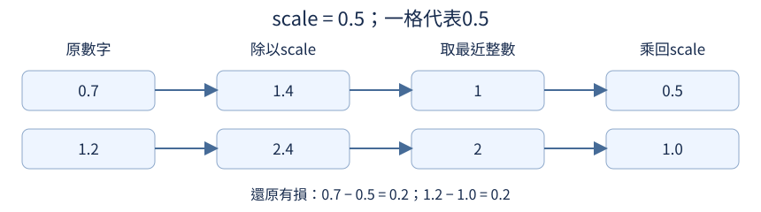
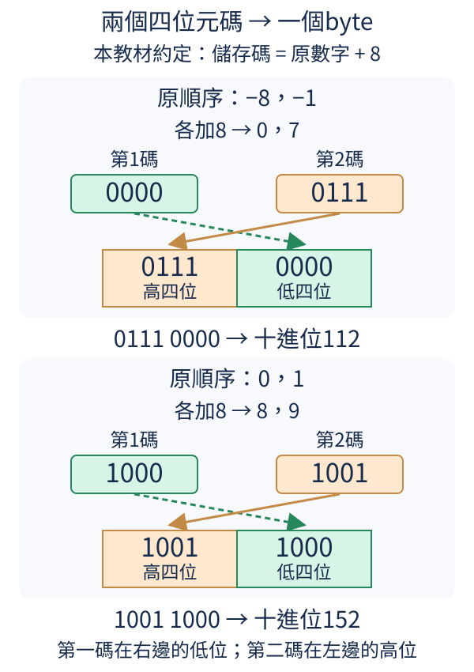
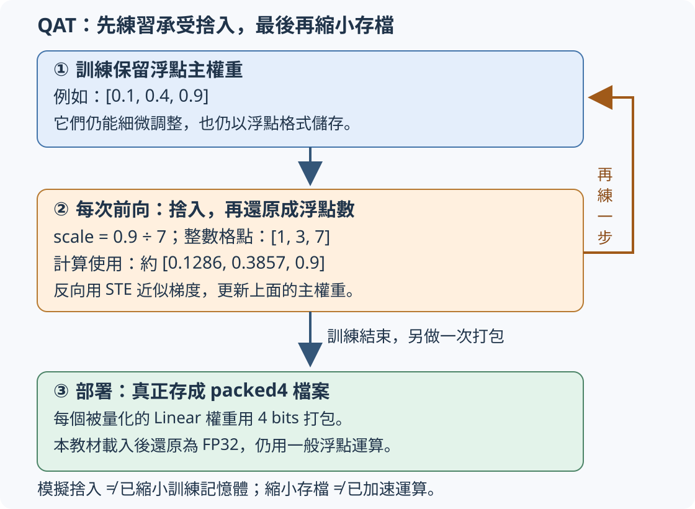

# 第 17 章：量化，用更少位元表示模型

模型權重是許多數字；減少每個數字的儲存位元，可以讓同一套模型規則占較少空間，也會失去部分細節。本章先從[權重bytes](17.md#17.1)與刻度還原開始，逐步比較位元數、分組與真正的四位元打包。接著檢查中間特徵範圍、極端值與訓練時模擬量化，最後回到答案和行為。參考運算先還原浮點數，方便追蹤誤差；儲存收益與硬體速度分別量測。

## 17.1 權重到底佔多少空間？

模型有兩千個參數，究竟需要兩千bytes，還是八千bytes？參數只表示可學數字的個數，還要知道每個數字用幾個位元保存。量化就是嘗試用較少的表示格子保存權重，節省模型儲存與讀取成本；開始談誤差以前，先把空間算清楚。前置是[矩陣暖身](../first-steps.md#W.5)：一張64列、32欄的權重表有 `64×32=2048` 個數字。

bit（位元）可存兩種狀態，八個bits組成一個byte（位元組）。FP32用32bits存一個浮點數，每個占4bytes；FP16用16bits，每個2bytes；int8用8bits存一個整數，每個1byte。因此同一張2048格表，原始數字部分分別需要8192、4096與2048bytes。表的形狀沒變，改的是每格表示數字的方式，能表示的數值範圍與細節也會改變。

```python
import torch

weight = torch.zeros(64, 32)
for dtype in (torch.float32, torch.float16, torch.int8):
    converted = weight.to(dtype)
    count = converted.numel()
    per_value = converted.element_size()
    print(dtype, "元素", count, "每格bytes", per_value, "總bytes", count * per_value)
```

輸入全零只為隔離空間問題，不是訓練好的模型。`to(dtype)`建立指定數值型別的表；`numel`數元素，三次都應為2048；`element_size`回報每格實際占幾bytes，依序4、2、1。最後一欄對應上述8192、4096、2048。這段刻意不寫檔，因為檔案還可能含形狀、型別、名稱與容器資訊，單張表的數字bytes不等於完整檔案大小。

現在也有[完整已訓練模型的量化實報](https://github.com/birdhackor/tiny-perceptron-vlm/blob/main/docs/course-experiments/results/quantization.json)：141,568個模型參數的FP32數值合計566,272 bytes，保存成`fp32.pt`則是588,358 bytes。4-bit轉換後參數個數仍相同，數值儲存168,736 bytes，`model.pt`為182,277 bytes；8-bit則是226,336與242,085 bytes。三個檔案都沒有optimizer，原始浮點檔仍含續訓相關的隨機狀態與不同metadata，因此檔案比不能直接當作純權重位元比。這是私有實跑產物的大小；另行公開、剔除隨機狀態後的匯出檔要重新量，不能照抄這些bytes。

4-bit／8-bit在這份實報中描述的是線性層加權係數的存法：115,200個係數換成低位元，其餘25,728個數字與640個偏置仍保存為FP32，共26,368個浮點數。偏置是每個輸出加權和後多加的數。量化版本還新增1,416個FP32刻度值，用來說明整數格子如何還原到原來的數值範圍；刻度的運算下一節再展開，本節先把它們的儲存也算進來。

| 數值儲存部分 | 原FP32模型（bytes） | 4-bit版本（bytes） | 8-bit版本（bytes） |
| --- | ---: | ---: | ---: |
| 115,200個加權係數 | 460,800 | 57,600 | 115,200 |
| 26,368個其餘數字與偏置，保留FP32 | 105,472 | 105,472 | 105,472 |
| 新增1,416個FP32還原刻度 | 0 | 5,664 | 5,664 |
| 合計 | 566,272 | 168,736 | 226,336 |

兩個4-bit係數放在一byte，所以115,200個需要115,200÷2＝57,600 bytes；保留的FP32數字占26,368×4＝105,472，刻度占1,416×4＝5,664。因此4-bit這一欄就是57,600＋105,472＋5,664＝168,736 bytes。這個合計已包括仍用FP32的數字與新增刻度；檔案的名稱、形狀與其他容器資訊，才是再加到合計以外的部分。因此要核對壓縮率，先問哪些數字改了表示，再按各部分的存法相加。

直接把任意浮點權重 `.to(torch.int8)`也不是完整量化方法：例如0.7會變成整數0，沒有記錄該如何還原的刻度。這裡全零在各型別都能準確表示，才方便只比較儲存。下一節會用scale說明少量整數格子如何對應原來的浮點範圍，才能合理討論壓縮誤差。

權重縮小也不代表整個執行記憶體同比例縮小。生成時還要保存[KV cache](16.md#16.3)，向前計算有中間特徵；訓練時另外保存[權重梯度](../first-steps.md#W.6)，也就是損失對各權重的變化率，用來提示每個權重如何調整。優化器是執行更新的工具，還可能保存過去更新的歷史資訊，作為決定下一步大小的狀態。這些資料可能仍使用FP32或自己的型別。評估記憶體限制時，應分開記錄權重檔案、載入過程與執行的最高占用，不能只報這一張表。

練習只把行數64改成128，先預測元素變4096，各型別的總bytes全部加倍為16384、8192、4096，每格bytes保持不變；再執行核對。如果你能清楚說明哪些量由形狀決定、哪些由dtype決定，就準備好理解「參數少」與「低位元」兩種不同的省空間方式。

## 17.2 浮點數怎麼放進少量整數格子？

權重可能是0.7或1.2，整數欄位卻只能放0、1、2等數字。直接去掉小數，會把許多不同權重變成同一個0；比較合理的做法是讓整數每一格代表某個浮點間隔。這個間隔叫scale（刻度）。前置是[每種表示占多少bytes](17.md#17.1)：int8可用較少空間，但我們還要保存數字如何對應原範圍的規則。

假設scale=0.5，整數1代表0.5，2代表1.0，-1代表-0.5。0.7先除以0.5得到1.4，再取最近整數1；保存1，還原時乘回0.5，得到0.5。原值與還原值差0.2，這是刻度變粗時失去的細節。1.2同理變2.4、取整數2、還原1.0。把浮點數映成少量離散格子的步驟稱quantization（量化）；乘回刻度近似還原稱dequantization（反量化）。

圖的箭頭分別是除刻度、取整數、乘刻度，兩列就是上面兩個數值。注意最右端沒有還原成最左端：保存的整數只告訴我們最近哪個格子，沒有記住原值在格子附近的偏移。



```python
import torch

x = torch.tensor([-0.7, 0.2, 0.7, 1.2])
scale = 0.5
q = (x / scale).round().clamp(-127, 127).to(torch.int8)
restored = q.float() * scale
print("整數格", q.tolist())
print("還原值", restored.tolist())
print("差值", (x - restored).round(decimals=4).tolist())
```

輸入四個固定浮點數。`torch.tensor([...])`把Python清單做成可逐格運算的數字表；`x / scale`讓每格各自除以同一刻度，`x - restored`則讓同位置的兩個數相減。`round`逐格取最近整數，`clamp`把超出範圍的數字限制在端點；此例沒有碰到端點，但真實低位元欄位範圍有限，不能略過這步。這裡採對稱int8範圍-127至127，雖然int8也能存-128，我們為正負對稱保留一種編碼不用。最後 `to(int8)`真的將每格存成一byte，而不是留在浮點tensor裡假裝已壓縮。

還原時的`q.float()`先把整數表轉成FP32浮點數表，數字仍是[-1,0,1,2]，再讓每格乘scale，得到-0.5、0.5這些有小數的近似值。`tolist()`把數字表轉成普通Python清單，方便閱讀列印結果；它不會改動原表。

輸出q為 `[-1,0,1,2]`，還原 `[-0.5,0,0.5,1]`，差值 `[-0.2,0.2,0.2,0.2]`。0.2被映成0並非程式錯誤，是因為它更靠近刻度0而非0.5。一般最近格的捨入在未截斷時，誤差不超過半格；超出端點後則可能更大。剛好在兩格中間時，PyTorch round採最近偶數，不是所有情況都往上。

這些差值是便於閱讀的近似十進位寫法。實際`.round(decimals=4).tolist()`仍可能印出`0.20000000298023224`：`round`的結果仍存在有限精度的浮點tensor裡，0.2只能近似表示；`tolist()`轉成普通Python清單時顯示出這個保存值，沒有把每個數字格式化成四位小數。[1.9的浮點數說明](01.md#1.9)可幫你區分這種很小的表示尾數與本例約0.2的量化誤差。

練習只把scale改成0.25，先預測整數為 `[-3,1,3,5]`，還原 `[-0.75,0.25,0.75,1.25]`，各項絕對差約0.05，再執行核對。刻度更細能保留細節，但同樣127個正格只覆蓋到31.75，範圍也縮小了；選scale必須一起考慮精度與極值。

## 17.3 轉回浮點會差多少？

把權重量化、反量化後，每格只差0.2，模型輸出也會只差0.2嗎？不一定。線性層把每個權重誤差乘輸入，再沿特徵相加；有的方向會相加，有的會互相抵消。前置是[刻度與還原](17.md#17.2)及[加權矩陣](../first-steps.md#W.5)。本節用同一張權重表、兩種輸入，讓你看見權重誤差與運算誤差的關係。

權重兩列為 `[0.7,0.2]`和 `[-0.7,1.2]`，scale=0.5後還原成 `[0.5,0]`與 `[-0.5,1]`。每格絕對差都是0.2。對輸入 `[1,1]`，原輸出 `[0.9,0.5]`，還原權重算出 `[0.5,0.5]`：第一列兩項誤差相加成0.4，第二列正負誤差抵消成0。若輸入 `[1,-1]`，則是另一列的誤差相加。這說明不能把單個權重誤差直接當成輸出上限。

```python
import torch

w = torch.tensor([[0.7, 0.2], [-0.7, 1.2]])
scale = 0.5
restored = (w / scale).round() * scale
x = torch.tensor([[1.0, 1.0], [1.0, -1.0]])
original_output = x @ w.T
compressed_output = x @ restored.T
print("權重平均絕對差", round((w - restored).abs().mean().item(), 4))
print("原輸出", original_output.round(decimals=4).tolist())
print("還原權重輸出", compressed_output.round(decimals=4).tolist())
print("逐項輸出差", (original_output - compressed_output).round(decimals=4).tolist())
```

w每列代表一個輸出特徵，x每列是一筆輸入；`.T`把權重轉置，`@`將每筆輸入與各權重列做點積。`abs().mean()`先取差值絕對值再平均，常稱mean absolute error（MAE，平均絕對誤差）；它避免正負差直接平均而互相消失。此例沒有超出整數端點，暫時只用round還原。`restored`仍用浮點數保存，沒有像[17.2](17.md#17.2)那樣轉存為int8；這次先看數值改變如何影響運算，尚未縮小儲存容器。

第一個`print`裡，`mean()`得到只含一個數的tensor，`.item()`把這個數取成普通Python數字；外層的Python `round(數字,4)`再將它捨入到四位小數，本例顯示0.2，不會補成0.2000。這一步只整理取出的平均值，沒有改動w或restored。下方的`tensor.round(decimals=4)`則把逐格捨入結果仍放在原數值型別的tensor中，稍後會說明它為何可能印出長尾數。

第一行MAE為0.2。原輸出約為 `[[0.9,0.5],[0.5,-1.9]]`，還原權重輸出 `[[0.5,0.5],[0.5,-1.5]]`，逐項差約 `[[0.4,0],[0,-0.4]]`。你可以逐列手算核對。這組輸出MAE也剛好0.2，但它只是本例的平均，不代表每格差都一樣，更不代表換輸入後仍是0.2。

實際列印可能看到 `0.8999999761581421` 與 `0.4000000059604645`，分別是上面的約0.9與約0.4。浮點數用有限位數保存小數，有些十進位小數只能近似保存；`.round(decimals=4)`的結果也仍保存在浮點tensor裡。`.tolist()`把容器改成Python清單，沒有替文字輸出設定小數位數，所以保存的近似值可能顯出很長的尾數。閱讀這幾行時，先核對正負號與約0、0.4的差值，再核對MAE。

以符號寫，輸出差是 `x @ (w-restored).T`：x是輸入，括號是同一份權重的還原差。輸入變大，誤差通常也可能被放大；輸入方向改變，誤差相加與抵消方式也會改變。因此量化品質要用代表真實任務的輸入與完整模型檢查，不能只看隨機權重或一張MAE表。模型還可能把負數一律改成0、正數保持原值，讓負半邊的變化消失、正半邊保留；這種輸入與輸出變動沒有固定比例的規則叫[非線性](02.md#2.4)。串接這些規則與更多層後，誤差會繼續改變，需要檢查最後輸出。

練習在`original_output`計算前插入`x = x * 10`，不動w、scale或restored。先預測權重MAE仍0.2，非零輸出差變成±4，輸出MAE變2，再重跑核對。這個簡單變動能證明：同一份壓縮權重，不同輸入尺度下的影響可以大不相同。

## 17.4 零點偏移有什麼作用？

四位元有16種編碼，若原數值範圍是-1到2，為何一定要平均分給負側和正側？可以把16個整數碼0至15對應到這段不對稱範圍，另外記住「哪個整數碼代表浮點零」。這個整數碼叫zero-point（零點）。前置是[刻度與反量化](17.md#17.2)：scale決定相鄰格差多少，zero-point決定浮點零落在哪一格。

取 `[-1,0,1,2]`，範圍寬3，用0至15之間十五個間隔，scale是 `3/15=0.2`。-1應落在碼0，浮點零比-1多五格，所以zero-point=5；1落在10，2落在15。保存 `[0,5,10,15]`後，還原先減5再乘0.2，恰好得到原值。注意整數碼0對應浮點-1，而不是浮點零；「零點」名字指浮點0對應的碼5。

```python
import torch

x = torch.tensor([-1.0, 0.0, 1.0, 2.0])
low = min(x.min().item(), 0.0)
high = max(x.max().item(), 0.0)
scale = (high - low) / 15
zero = round(-low / scale)
q = (x / scale + zero).round().clamp(0, 15).to(torch.uint8)
restored = (q.float() - zero) * scale
print("scale/zero", scale, zero)
print("整數碼", q.tolist())
print("還原", restored.round(decimals=4).tolist())
```

`x.min()`與`x.max()`先從數字表取出最小值和最大值，各自得到只含一個數的tensor；`.item()`再取出其中的普通Python數字。本例得到-1.0與2.0。外層Python `min(...,0.0)`選兩者較小的數，使low不大於0；`max(...,0.0)`選較大的數，使high不小於0。因此本例low＝-1.0、high＝2.0；若資料全在2至3，這兩行則得到low＝0、high＝3，範圍仍包含浮點零。

這樣才能為浮點零安排合法整數碼。`zero`用Python的`round`取最近整數；`q`先縮放、加零點再取整與限制範圍。uint8表示不含負數的八位元整數容器，此時只使用0至15的16種碼，尚未把兩個四位元碼裝進一byte。這裡是表示規則，不是完整檔案打包。

輸出scale約0.2、zero為5，整數碼 `[0,5,10,15]`，還原 `[-1,0,1,2]`。此例剛好落在刻度上，所以沒有捨入誤差；一般數字仍會有。帶刻度與零點的方式常叫affine quantization（仿射量化），相對於把零固定在整數零、正負對稱分格的方式，多了一個可保存的偏移。

能準確還原浮點零很實用，因為補齊或空白特徵常使用零；但這不表示所有非零值都精確，也不表示所有量化實作採unsigned碼。本章後面的int4打包使用-8至7的signed數字，再映到儲存碼，必須知道各層在使用哪種表示，不能看到「4-bit」就直接混用。

練習把x改成 `[-2,0,1]`。先預測scale仍0.2，zero移到10，整數碼為 `[0,10,15]`，再執行核對。範圍寬度不變，刻度不變，但零的位置不同；這正是scale與zero-point分工的差別。

## 17.5 一組 scale 應該管多大範圍？

同一張權重表有一列最大只有0.08，另一列最大到80，若全表使用一把刻度尺，小列會發生什麼？為了容納80而選的粗刻度，可能把整列小數都壓成0。前置是[scale與範圍](17.md#17.2)及[權重誤差傳到輸出](17.md#17.3)。這一節調整的不是位元數，而是哪些數字必須共用同一個scale。

四位元對稱量化使用-7至7，最大正格是7。全表最大80，scale=`80/7≈11.4286`；0.01、0.03、0.05、0.08除以這個數，全都接近0，最近整數都是0。若讓小列自己使用scale=`0.08/7≈0.0114286`，它們會量化成 `[1,3,4,7]`，還原已很接近原數。大列仍用原來的80/7，不必因小列的改善而縮小可表示範圍。

```python
import torch
from tiny_perceptron.quantization import quantize_symmetric

w = torch.tensor([[0.01, 0.03, 0.05, 0.08], [10.0, 30.0, 50.0, 80.0]])
for per_row in (False, True):
    q, scale = quantize_symmetric(w, bits=4, per_channel=per_row)
    restored = q.float() * scale
    error = (w - restored).abs().mean(-1)
    print("每列獨立", per_row, "整數", q.tolist())
    print("每列MAE", error.round(decimals=4).tolist(), "scale格數", scale.numel())
```

w兩列各代表一個輸出特徵對輸入的權重。此函數的 `per_channel=True` 指每個輸出channel各一個scale，在這張線性層權重表中就是「每列獨立」，不是每個輸入欄位。False時scale只有一格，會乘到全表；True時形狀是兩列一欄，各列scale乘該列四項。`mean(-1)`沿每列求平均絕對誤差，不讓大列的數字把小列改善掩蓋。

全表共用時整數第一列全零，第二列 `[1,3,4,7]`，每列MAE約 `[0.0425,2.5]`；逐列時兩列都是 `[1,3,4,7]`，但不同scale讓還原大小不同，MAE約 `[0.0025,2.5]`。scale格數從1變2，若使用FP32，刻度數字本身由4bytes增為8bytes。不能只算整數碼，漏掉這些metadata（還原需要的附加資訊）。

也可讓一列內固定數量的權重共用一個scale，叫per-group量化。組越小，極端值牽連的數字越少，但需存更多刻度、分組大小，以及尾端不足一組如何處理。極端地讓每個權重都有自己的scale，可能幾乎沒有捨入誤差，卻把原本的浮點資訊藏回大量scale中，壓縮收益反而消失。選分組就是精度與附加成本的取捨。

練習只把w第一列乘1000，讓兩列數值範圍相同。先預測全表與逐列的還原誤差會接近，逐列卻仍多存一個scale，再重跑核對。這能說明逐列不是對所有矩陣都免費改善，而是特別有助於不同列尺度差很大的情況。

## 17.6 從 8-bit 降到 4-bit 會發生什麼？

八位元可區分256種編碼，四位元只有16種。若都要覆蓋-1到1，四位元格子通常較粗，更多不同原值會擠到同格；它也只需一半的整數位元。前置是[對稱刻度](17.md#17.2)與[刻度附加成本](17.md#17.5)。我們要對同一份權重做兩種轉換，不能用兩份不同隨機權重來比較，否則差異也可能來自輸入本身。

本教材對稱八位元使用-127至127，scale為最大絕對值除127；四位元使用-7至7，scale則除7。這兩種規則各保留一種編碼不使用，讓正負端點對稱。取33個從-1均勻到1的權重，間隔0.0625；八位元刻度約0.007874，四位元約0.142857，後者許多值需要更大幅度的捨入。

```python
import torch
from tiny_perceptron.quantization import quantize_symmetric

w = torch.linspace(-1, 1, 33)
for bits in (8, 4):
    q, scale = quantize_symmetric(w, bits)
    restored = q.float() * scale
    error = (w - restored).abs()
    packed_bytes = (w.numel() * bits + 7) // 8
    print("bits", bits, "MAE", round(error.mean().item(), 6), "最大差", round(error.max().item(), 6))
    print("理想整數bytes", packed_bytes, "目前q容器bytes", q.numel() * q.element_size())
```

`linspace`包含兩個端點，一共33項。`abs()`逐格取絕對值，因此error保存每個原值與還原值的距離。`error.mean()`取這些距離的平均，`error.max()`取其中最大值；兩者都得到單格tensor，`.item()`再取出普通Python數字，外層Python `round(...,6)`將它捨入到六位小數供列印。

第一行同時報平均絕對誤差與最大誤差，避免只看平均漏掉最糟位置。此例八位元MAE約0.001909，四位元約0.034632；最大差約0.003937與0.071429。具體輸出可能在末位有浮點差異，但比較用的是同一個w與同一個範圍。

第二行要分清理想與實際。`numel()`數出表中有幾項，`element_size()`回報每項實際佔多少bytes，兩者相乘是目前容器的數值bytes。理想打包公式`(項數×bits＋7)//8`先算總bits；`//8`只保留除以8後的整數部分，先加7就能在有剩餘bits時補足最後一byte。例如132bits加7是139，139整除8得17；若剛好128bits，135整除8仍是16。

八位元33項需33bytes，四位元共132bits，必須放在17bytes中，最後半byte空著。函數回傳的q兩次都用int8容器，所以目前仍各占33bytes：四位元數值只限制可用碼，還沒有把兩碼塞進一byte。下一個[打包實驗](17.md#17.8)才會真的縮容器，完整表示還要另存scale。不能只用理想bit數宣稱目前檔案已變小。

較低位元的平均誤差通常較大，不代表每個數字都嚴格較差。零和端點能在兩種刻度都精確表示；若原數剛好落在四位元格子，四位元也可能比八位元更準。更不能把這張權重表的誤差直接等同文字品質：輸入、不同層敏感度與輸出決策都會影響整體結果。

練習只把w改成 `torch.arange(-7,8).float()/7`。`arange(-7,8)`從-7逐次加1，包含-7但不包含右端的8，所以產生-7、-6、…、7，共15項；`float()`轉為浮點表，再逐格除以7。先預測四位元誤差幾乎零，因為每項就在它的格子上；八位元不一定全部精確，再重跑核對。這個例子不推翻較粗刻度的一般取捨，而是提醒比較應看實際數值分布與任務，不用「4-bit一定每項更差」取代檢查。

## 17.7 先只量化權重可以嗎？

權重在模型載入後固定，中間特徵卻隨每個輸入變動。要先體驗壓縮，可以只把權重存成低位元表示，而保留輸入與運算使用浮點數，這叫weight-only quantization（只量化權重）。前置是[逐列刻度](17.md#17.5)和[權重誤差傳遞](17.md#17.3)。這個選擇省掉目前對中間特徵範圍的判斷，但仍需要核對輸出。

用兩列權重 `[0.7,0.2]`與 `[-0.7,1.2]`，各列使用自己的四位元scale。第一列最大0.7，刻度0.1，兩項剛好落在整數7與2；第二列最大1.2，刻度1.2/7，-0.7會還原成約-0.6857。因此對輸入 `[1,1]`，原輸出 `[0.9,0.5]`，壓縮版本約 `[0.9,0.5143]`。我們保持輸入不變，才能把差異歸到同一份權重的轉換。

```python
import torch
from torch import nn
from tiny_perceptron.quantization import QuantizedLinear

layer = nn.Linear(2, 2, bias=False)
with torch.no_grad():
    layer.weight.copy_(torch.tensor([[0.7, 0.2], [-0.7, 1.2]]))
compressed = QuantizedLinear(layer, bits=4)
x = torch.tensor([[1.0, 1.0]])
print("儲存碼型別", compressed.values.dtype, "輸出型別", compressed(x).dtype)
print("原輸出", layer(x).detach().round(decimals=4).tolist())
print("壓縮輸出", compressed(x).round(decimals=4).tolist())
print("壓縮buffer bytes", compressed.storage_bytes())
```

`QuantizedLinear`接收已經有權重的線性層，依每列刻度轉換，保存整數碼與scale。本例bits=4時，`values`是打包後的uint8容器，四個四位元數放成兩bytes；打包與拆回的細節在[下一節](17.md#17.8)。bits=8時則把每個帶正負號的整數碼各存成一個int8，不把兩碼合進一byte。scale兩個FP32數占八bytes，因此本例最後一行應為10，不是只看整數碼的2。這裡沒有bias，避免額外偏移影響計數。

第一行應是torch.uint8與torch.float32。這個對照說明「存成整數」不代表「矩陣乘法用整數」。教材的參考forward先拆碼、乘scale還原浮點權重，再用普通浮點線性運算；中間特徵x與輸出仍用FP32。原輸出和壓縮輸出應對上手算，第二項差約0.0143；型別本身並不能說明品質好壞。

buffer指模組保存但不交給一般梯度更新的資料，和普通Parameter不同。這份轉換以推理檢查為主，不是直接接原優化器繼續訓練的配方。載入時也要保留bits、shape與scale等還原資訊，不能只保存 `values`就期待任何層都知道如何拆解。

本次整模型轉換保留文字與位置嵌入、各正規化層的FP32參數，合計102,912 bytes；bias也維持FP32，但隨被替換的Linear存進buffer。這些選擇在[實報的`retained_float_modules`](https://github.com/birdhackor/tiny-perceptron-vlm/blob/main/docs/course-experiments/results/quantization.json)與逐層buffer清單中明示，所以只說「4-bit模型」並不代表每個數字都只有四位元。

此參考實作可能在每次forward建立臨時浮點權重，所以存儲較小不保證更快，也不保證最高執行記憶體按相同比例下降。真正利用低位元資料的專用運算要看硬體支援；這裡先得到一個可讀、可核對的輸出基準。

練習只把bits改成8，先預測第一行的儲存碼型別改為torch.int8，輸出仍是torch.float32；四個整數碼占四bytes，加兩個scale共12bytes。再執行核對：本固定例的壓縮輸出約為 `[0.8984,0.5008]`，比四位元更接近原輸出。原layer與x保持不變，讓你只比較位元數的影響。

## 17.8 4-bit 如何真的存成較小檔案？

七個四位元數若各放一個int8元素，仍會占七bytes，只限制數值範圍並沒有省掉容器。要真正縮小，可以把兩個四位元碼放進同一byte：一個占低四位，另一個占高四位。七個值需四bytes，最後半個byte作為補格；還原時必須知道原來只有七個，才能裁掉補格。前置是[bit數與容器大小](17.md#17.6)及[刻度還原](17.md#17.2)。

本教材允許signed值-8至7，先加8，得到0至15的儲存碼。例如-8變0，四位元寫成0000；-1變7，寫成0111。第一碼放低四位，第二碼往左移四位再合併，byte便是 `0111 0000`，十進位112。這套「加8」是我們的編碼約定，其他格式可能不同，拆碼時必須使用配套規則。

這是打包器可容納的範圍；本章量化函數實際採正負對稱的-7至7，會留下代表-8的儲存碼不用。兩者不能混為一談：打包不改整數值，量化才決定哪些整數格子能表示浮點權重。

圖由上方例子開始讀：原數字-8、-1各加8，映成四位元碼0000、0111。綠色虛線把第一碼指向byte右側的低四位，橘色實線把第二碼指向左側的高四位。交叉箭頭指示碼存入哪四位；拆回時仍依第一碼、第二碼還原原數字的順序。下方例子的0、1同理變成1000、1001，byte為10011000，也就是152。



```python
import torch
from tiny_perceptron.quantization import pack_int4, unpack_int4

q = torch.tensor([-8, -1, 0, 1, 7, 2, 3], dtype=torch.int8)
packed = pack_int4(q)
restored = unpack_int4(packed, q.shape)
print("原數字", q.tolist())
print("packed", packed.tolist(), "bytes", packed.numel() * packed.element_size())
print("拆回", restored.tolist())
assert torch.equal(q, restored)
```

`pack_int4`先攤平q，加8映成碼；把第二碼用 `<<4`左移，再與第一碼用位元OR合併。這裡兩碼占不同四位區域，OR就像把它們各自填進空位，不是浮點相加。拆回時 `&15`留下低四位，`>>4`移出高四位，再各減8。q.shape提供原形狀與元素數，避免將尾端補格當作真實權重。

第二行應為 `[112,152,175,139]`，占四bytes。第三組7、2加8得15、10，byte為 `10×16+15=175`；最後3加8得11，另一格補成碼8（還原為0），byte為 `8×16+11=139`。拆回輸出應與原七項完全相同，assert核對的是整數碼的無損打包，不代表先前浮點量化沒有誤差。

完整模型還要保存scale、原形狀與位元數；若線性層有bias，還要保存這份加在輸出上的偏移值，見[2.3的線性層配方](02.md#2.3)。所以四bytes只是這段整數資料區（buffer）。存檔可能另有標頭，也就是記錄型別、形狀等資訊的部分，真正的檔案大小要另量。打包省儲存，但普通線性運算不能直接拿112等byte當權重乘輸入，必須先按格式拆解或使用懂該格式的專用運算。

正式4-bit模型的13個Linear共保存57,600 bytes整數碼、5,664 bytes逐列scale與2,560 bytes浮點bias，合計65,824 bytes的buffer。其他浮點參數還需102,912 bytes，兩邊相加才是[17.1](17.md#17.1)的168,736 bytes。報告`storage.buffers`逐層列出這些數字，能核對刻度確實存下來了；它們是實際容器大小，不是先用參數個數除以二推估的理想值。

練習只在q最後加一項4。先預測仍占四bytes，最後byte由139變203，因為高四位不再補碼8，而是4加8得到12；拆回應有八項。重跑核對，說明原元素數為何是打包格式不可缺的一部分。

## 17.9 已訓練模型怎麼直接轉換？

手上已有訓練好的權重，想先壓縮看看，是否一定要重新訓練？Post-Training Quantization（PTQ，訓練後量化）是在既有權重上選刻度、轉換表示，再用同一批輸入評估。最基本的weight-only PTQ只依權重範圍選scale，通常不需要先收集中間特徵。前置是[只量化權重的線性層](17.md#17.7)：轉換保留原模型架構的大部分運算，差異來自那些被量化的權重。

關鍵是從同一份權重出發。若分別建立兩個隨機模型，再量化其中一個，輸出不同可能來自初始化，而不是壓縮。應先保留原版，再深複製它，對副本逐層轉換。深複製意味著把參數數值複製到獨立物件，後續修改副本不會回頭改原版。

```python
import copy
import torch
from tiny_perceptron.model import TinyLM, ModelConfig
from tiny_perceptron.quantization import replace_linear_layers

torch.manual_seed(0)
original = TinyLM(ModelConfig(width=8, tied=False)).eval()
ids = torch.tensor([[1, 2, 3]])
with torch.no_grad():
    before = original(ids)["logits"]
    quantized = replace_linear_layers(copy.deepcopy(original), bits=4)
    after = quantized(ids)["logits"]
    original_again = original(ids)["logits"]
print("兩版形狀", tuple(before.shape), tuple(after.shape))
print("原版是否被改", (before - original_again).abs().max().item())
print("量化分數MAE", (before - after).abs().mean().item())
```

輸入一段三個token，預設詞表264項，兩版形狀都應為 `(1,3,264)`。`.eval()`把模型切到評估模式，讓會區分訓練與評估的層採用評估行為；`torch.no_grad()`則讓這個區塊的運算不記錄求導關係，兩者的差別見[5.17](05.md#5.17)。`copy.deepcopy`先建立完整獨立副本；`replace_linear_layers`在這份副本內把Linear換成參考QuantizedLinear，因此不要把原版直接傳進去再假設它仍未量化。這個函數不替換字嵌入與正規化層，所以也不是「全部數字都改四位元」。

第二行應為0，確認原版沒有被轉換改動。第三行通常是非零小數，表示同一輸入各位置、各詞表分數的平均絕對差；它不是答錯率，也沒有固定跨模型合格門檻。本例使用隨機權重，只驗證轉換流程與比較方法，沒有稱它完成了真實訓練後品質評估。實際PTQ要先載入選定的訓練權重，使用同樣的原版與副本流程，再做獨立任務檢查。

正式實驗則載入[T.4的直接SFT模型](../training.md#T.4)，寬64、兩層、不共享輸入輸出表，再以原45筆訓練題更新120次，batch16、學習率0.003、seed42，讀到13,610個有效回答目標。這份更新後的FP32才是共同來源；4-bit與8-bit各從它直接轉換，沒有再訓練，也沒有先轉8-bit再降4-bit。原始家族切分仍為45／5／10筆，分別來自9／1／2個屬性家族，三側無交集。兩份packed檔重新載入後才評估，結果見[17.15](17.md#17.15)，完整重跑入口見[T.9](../training.md#T.9)。來源模型原來的5/10與這次FP32的6/10之間另有120次更新，不能把那一題進步歸功於量化。

這裡明確 `tied=False`，避免[輸入輸出權重共享](14.md#14.6)造成另一個問題：若原輸出與embedding共用一份權重，將輸出換成量化buffer後，共享關係可能改變。這時不只表示精度不同，還改了共享語意，必須另外設計與交代，不能默默當作普通等價替換。

PTQ若也量化中間特徵，還需要[範圍校準](17.md#17.12)，不等於現在這個weight-only方法。保存轉換版時也要保存格式與還原資訊，讓載入與運算使用同一套規則。

練習只將bits由4改成8，保持隨機種子、原版與ids不變。先預測形狀和原版不變檢查仍相同，分數MAE通常降低，再執行核對。若要比較速度，應使用另一個明確計時實驗，不能從這個MAE推斷加速。

## 17.10 壓縮後怎麼實際運算？

低位元檔案已變小，生成速度卻沒有變快，甚至更慢，可能是什麼原因？因為「怎麼存」與「怎麼算」是兩個問題。參考QuantizedLinear每次先拆碼、乘scale，重建浮點權重，再交給普通線性運算；它能提供可核對的數值基準，但多了還原工作和臨時矩陣。前置是[只量化權重](17.md#17.7)與[實際打包](17.md#17.8)。

例如一層有32個輸出、64個輸入，權重2048個FP32占8192bytes，bias有32個占128bytes，原始數字合計8320。四位元權重打包占1024bytes，各輸出列的scale占128bytes，bias仍128，共1280。儲存明顯減少，然而參考forward還原出的浮點權重又是8192bytes，不會因來源小就自動變成低位元乘法。

```python
import torch
from torch import nn
from tiny_perceptron.quantization import QuantizedLinear

layer = nn.Linear(64, 32)
compressed = QuantizedLinear(layer, bits=4)
x = torch.ones(2, 64)
float_bytes = sum(p.numel() * p.element_size() for p in layer.parameters())
print("原層數字bytes", float_bytes)
print("壓縮buffer bytes", compressed.storage_bytes())
print("整數碼bytes", compressed.values.numel() * compressed.values.element_size())
print("運算結果", tuple(compressed(x).shape), compressed(x).dtype)
```

前三行應為8320、1280與1024。第一行含原權重與bias，第二行含壓縮碼、scale與bias，第三行只看碼。這種分開列報讓你看見刻度與偏移的固定成本，而不把「8320變1024」當作完整層的儲存比。輸入兩列64項特徵，最後輸出形狀 `(2,32)`、型別torch.float32：數值運算仍為浮點。

專用低位元kernel指理解打包格式與刻度、替特定硬體安排乘法和讀取的底層運算。有的邊讀小塊權重邊反量化，不建立整張浮點權重；有的使用特定整數或混合精度路徑。能否加速依硬體、形狀、位元格式與實作而定，不是把buffer改成uint8就能讓普通Linear知道怎麼算。

[GPTQ原論文的實用加速段落](https://arxiv.org/abs/2210.17323v2)也把收益歸到專用的量化矩陣／浮點向量kernel與較少記憶體讀取，沒有把所有乘法改成整數。本工具採更直白的逐層完整反量化，也沒有實作GPTQ的權重校正。在本次L4測量，46-token提示、暖機後重複三次，FP32／4-bit／8-bit的prefill平均約2.405／4.958／2.768毫秒；固定八步、不因EOS早停的decode平均每步約2.371／4.882／2.814毫秒。這份小模型的參考4-bit路徑較慢，符合拆碼需要額外工作的可能性，不能外推成所有低位元後端都較慢。

三版探針的CUDA已配置記憶體峰值比探針起點多335,872／376,320／359,936 bytes。這些是PyTorch allocator在本次前向期間的額外峰值；測量時其他版本仍同時留在GPU上，起點已有68,655,616 bytes。它們沒有量隔離程序的模型載入峰值、CUDA driver或所有保留記憶體，也不能用來宣稱4-bit整個執行只需376,320 bytes，或會隨檔案比例省RAM。各次探針會重設峰值計數，所以最外層報告的peak也有自己的測量範圍。

因此完整評估至少有四件不同的量：檔案bytes、載入時的最高記憶體、運行時的最高記憶體，以及[prefill與decode耗時](16.md#16.2)。decode可能受讀權重頻寬影響，小型CPU矩陣則可能被拆碼開銷主導。每次還原的暫存資料也算進最高占用，不能只用模塊buffer大小當成執行需求。

本節不加入新的硬體套件，先保留可讀的參考結果；選擇其他後端時，需要核對支援格式、數值與同一輸入下的計時。量速度前先暖機，也就是載入模型後，用同樣形狀的輸入試跑幾次，這些試跑不列入正式計時。若後端會在第一次呼叫編譯運算，先等這次呼叫完成，再開始重複測量並取平均；載入與首次編譯耗時另外記錄。如何計時可看[5.9的小型測量](05.md#5.9)。

練習只把bits改成8。先預測整數碼2048bytes，scale與bias各128，總buffer2304，輸出仍float32、形狀仍 `(2,32)`，再執行核對。兩版存儲不同，運算介面的形狀相同；速度必須另量，不能從這些bytes代算。

## 17.11 Activation 也量化會改變什麼？

只量化權重時，每個輸入的中間特徵仍是浮點數。若也把這些特徵放到低位元格子，是否只是再省一點空間？它還會增加另一條誤差來源，而且特徵每次輸入都不同。這裡activation指各層的輸入或中間特徵，不是單指GELU等啟動函數。前置是[只量化權重](17.md#17.7)和[輸入如何放大或抵消權重誤差](17.md#17.3)。

本節與接下來的範圍、極端值例子是CPU上可核對的數值機制。本章已完成的整模型量化與[QAT實報](https://github.com/birdhackor/tiny-perceptron-vlm/blob/main/docs/course-experiments/results/qat.json)都只量化Linear權重，`activation_quantization`為false；它們沒有跑中間特徵校準、截斷或低位元activation訓練，不能把那些GPU分數當作本節方法的成績。

先用同一刻度0.5，隔離兩種誤差。權重w兩列 `[0.7,0.2]`、`[-0.7,1.2]`，兩筆輸入x也取這兩列。權重還原是 `[0.5,0]`與 `[-0.5,1]`；只改w時保留原x。若連x也改成上述還原值，兩邊的差會一起進入點積。每項輸出誤差未必都變大，有的正好抵消，但多了一個需要評估的改動。

```python
import torch

x = torch.tensor([[0.7, 0.2], [-0.7, 1.2]])
w = torch.tensor([[0.7, 0.2], [-0.7, 1.2]])
scale = 0.5


def simulate_quantization(t):
    return (t / scale).round() * scale


qx, qw = simulate_quantization(x), simulate_quantization(w)
reference = x @ w.T
weight_only = x @ qw.T
both = qx @ qw.T
print("原輸出", reference.round(decimals=4).tolist())
for name, output in (("只改權重", weight_only), ("權重加特徵", both)):
    print(name, output.round(decimals=4).tolist(), "MAE", round((reference - output).abs().mean().item(), 4))
```

函數先量化再反量化，返回的仍是浮點tensor，用來模擬格子誤差，沒有打包，也沒有使用可讀取低位元編碼的專用運算程式（kernel）。scale刻意固定，真實權重與activation通常可能使用不同刻度；當前不談如何估計，先把兩邊放進相同數值規則。

以下數字取近似值；實際列印可能顯示浮點小數的長尾，讀法見[17.3](17.md#17.3)。原輸出約為 `[[0.53,-0.25],[-0.25,1.93]]`。只改權重得到約 `[[0.35,-0.15],[-0.35,1.55]]`，MAE0.19；兩邊都改得到 `[[0.25,-0.25],[-0.25,1.25]]`，MAE0.24。觀察非對角兩項：權重單獨量化時有誤差，加入特徵量化反而剛好回到原值-0.25。這不是整體更好，而是誤差方向偶然抵消；最後1.93變1.25則更差。

權重固定，activation的範圍卻隨句子長度、內容或模態改變。只在一個輸入上選得合適的刻度，其他輸入可能碰到截斷或細節消失；多層誤差還會影響後續層的特徵分布。因此要分別記錄權重與特徵的位元數、分組方式、可表示的最小與最大數值，以及超出範圍時是否壓回端點等處理規則，再用獨立資料做完整任務檢查，不能只用單層平均誤差排名。

練習只把x第一列改成 `[1,0]`，w保持不變。先預測這列已在0.5格子上，所以「只改權重」與「兩邊都改」的第一列輸出相同，都是 `[0.5,-0.5]`；再執行核對。這個練習能直接檢驗：多一個量化位置不表示每個輸入都一定新增誤差，關鍵在它落在哪些格子。

## 17.12 如何決定 activation 的量化範圍？

權重可以先看固定數值的最大值，中間特徵卻每次輸入都變。若校準時只見到-1到1，之後有一項3，會怎樣？我們需要明確選擇：每次用當前特徵估範圍，或先用代表性資料固定範圍。前者叫dynamic quantization（動態範圍量化），後者是static quantization（固定範圍量化）；這兩個名字在本節只用來區分中間特徵的範圍何時決定。

前置是[權重與特徵雙邊量化](17.md#17.11)與[刻度和截斷](17.md#17.2)。Calibration（校準）用一些代表實際工作情況的輸入收集範圍，本身不一定更新模型權重。例子中校準特徵 `[-0.5,0.2,0.8,1]`，最大絕對值1，四位元對稱刻度為1/7。新的評估特徵是 `[-0.2,0.4,3]`：3已超過固定範圍，會被壓回端點1。

```python
import torch

calibration = torch.tensor([-0.5, 0.2, 0.8, 1.0])
evaluation = torch.tensor([-0.2, 0.4, 3.0])
fixed_max = calibration.abs().max()
dynamic_max = evaluation.abs().max()


def simulate(x, maximum):
    scale = maximum / 7
    return (x / scale).round().clamp(-7, 7) * scale


for name, maximum in (("固定", fixed_max), ("動態", dynamic_max)):
    restored = simulate(evaluation, maximum)
    overflow = (evaluation.abs() > maximum).sum().item()
    print(name, "範圍", maximum.item(), "超出項數", overflow, "還原", restored.round(decimals=4).tolist())
```

校準與評估是兩份獨立輸入，避免悄悄拿評估結果重新選最有利的範圍。固定那行範圍1、超出1項，還原約 `[-0.1429,0.4286,1]`；動態那行範圍3、超出0項，還原 `[0,0.4286,3]`。3在動態範圍被完整保留，但刻度變成3/7，-0.2更靠近0，失去細節。這個對照說明不截斷極值與保留小值精度有取捨，不能只看「超出項數0」判定最好。

動態方法需要在每次運算檢查當前特徵，可能增加額外工作。固定方法省去這部分，但校準資料若沒有涵蓋實際分布，之後可能頻繁截斷。語言、長度、圖像內容或音量變化都可能改變特徵範圍；應挑代表工作場景的校準樣本，並記錄統計方法，本例記錄最大絕對值。另一種方法會先把收集到的絕對值由小到大排列，取能涵蓋例如99%資料的界線，稱為第99百分位數；這會允許最極端的少數值被截斷，換取較細刻度。兩種方法都應報告所用資料，避免只用一段安靜短輸入。

校準資料可以和訓練來源配合選取，但最終測試資料要保留作獨立評估。若看最終測試哪個range最好再選它，報告的結果已經受到測試答案影響，無法代表新輸入。位元數與校準方法也應一起記錄，讓別人能重現相同轉換。

練習只在calibration最後增加一項3，evaluation保持不變。先預測固定最大值也變3，兩條路還原相同，再執行核對。這是一個受控範圍實驗；真實工作應依資料分布設計校準，而不是為每個評估錯誤臨時補一項。

## 17.13 極端值為什麼讓其他值難表示？

四個特徵 `[0.1,0.2,0.3,100]`共用一個四位元刻度，前三個會不會全消失？對稱量化為容納100，scale設成100/7約14.2857；前三個除以它都接近零，結果確實全落到整數0。這種少數比其他值大很多的數字叫outlier（極端值）。前置是[共用刻度的取捨](17.md#17.5)和[固定範圍截斷](17.md#17.12)。

可以先將數值限制在-1至1，再按這個範圍量化，稱clipping（截斷）。此時scale變1/7，前三個能保留更細資訊，但100被改成1，再也還原不到100。必須分開報多數小值的誤差與極值誤差；如果只把還原結果與「截斷後的輸入」比較，就會隱藏截斷本身損失的99。

```python
import torch
from tiny_perceptron.quantization import quantize_symmetric

x = torch.tensor([0.1, 0.2, 0.3, 100.0])
for clip in (False, True):
    source = x.clamp(-1, 1) if clip else x
    q, scale = quantize_symmetric(source, bits=4)
    restored = q.float() * scale
    error = (x - restored).abs()
    print("截斷", clip, "還原", restored.round(decimals=4).tolist())
    print(
        "小值MAE",
        round(error[:3].mean().item(), 4),
        "極值差",
        round(error[-1].item(), 4),
        "全部MAE",
        round(error.mean().item(), 4),
    )
```

兩種方法使用同一個原始x。`source`只決定量化時看哪個範圍，算誤差時都使用 `x-restored`，這是關鍵一行。`error[:3]`挑前三個小值，`error[-1]`挑極值，讓兩種代價都出現在報告。沒有截斷時還原 `[0,0,0,100]`，小值MAE0.2、極值差0、全部MAE0.15。

截斷後還原約 `[0.1429,0.1429,0.2857,1]`，小值MAE約0.0381，極值差99，全部MAE約24.7786。小值精度明顯改善，但全部平均反而大幅變差。不能挑其中一欄就宣布方法勝出；極值在任務中是噪音還是重要特徵，會影響哪種取捨合理。這個實驗沒有任務模型，只展示數值代價。

如果極值有實際用途，其他選擇包括縮小共享scale的分組，或讓敏感位置維持較高精度；但它們也會增加附加資訊或運算成本。選截斷門檻時，先用[17.12的校準資料](17.md#17.12)估計會遇到的數值範圍。驗證資料是未拿來更新模型權重、但可用來比較不同門檻設定的題目；觀察各設定的輸出與任務品質後，再選門檻。最後另用不參與校準或門檻選擇的獨立測試題評估，分組原則見[1.2](01.md#1.2)。不能為了某個誤差表好看就把大值刪掉，也不能用最後測試題反覆挑出最漂亮的設定。

練習只把最後100改成2，保持截斷範圍不變。先預測截斷後的極值差從99降為1，而小值還原仍相同；不截斷的scale則變2/7，小值不再全歸零。重跑核對小值MAE約0.0667與0.0381。你應能指出改善來自「極值大小或刻度」的哪一個改動。

## 17.14 模型能預先適應量化誤差嗎？

訓練好的模型直接量化，可能對粗刻度很敏感。可以在訓練期間就讓它看見量化後的特徵與權重，學習避開容易受傷的表示嗎？這叫Quantization-Aware Training（QAT，量化感知訓練）。但我們在[梯度暖身](../first-steps.md#W.6)知道，學習需要微小變動如何影響誤差；round取整在格子內幾乎不變，直接對它求梯度常得到零，難以教上游權重。

先回顧[刻度捨入](17.md#17.2)。輸入 `[0.1,0.4,0.9]`，本工具的四位元對稱量化使用-7至7的整數碼，最大正碼是7，所以把最大絕對值0.9除以7得到scale，還原約 `[0.1286,0.3857,0.9]`。QAT常用fake quantization（模擬量化）：向前確實使用這些還原數字，向後卻用一個近似規則，例如把取整視為「輸入原樣通過」來傳梯度。這叫straight-through estimator（STE，直通估計），不是取整函數真正的導數。

圖的第一格保存可小幅更新的FP32主權重，第二格用剛才的scale得到整數`[1,3,7]`，再還原成前向數值。回到第一格的箭頭表示每次誤差沿STE近似路徑更新主權重；下一次前向會重新模擬，而不是只量化一次就永遠不動。訓練完成後，第三格才把整數、scale與形狀存成真正packed4檔，部署仍用本工具的FP32反量化參考計算。這三步把「學習時體驗誤差」與「最後怎麼保存」接了起來。



```python
import torch
from tiny_perceptron.quantization import fake_quantize

x = torch.tensor([0.1, 0.4, 0.9], requires_grad=True)
y = fake_quantize(x, bits=4)
y.sum().backward()
print("向前", y.detach().round(decimals=4).tolist())
print("STE梯度", x.grad.tolist())
hard = x.detach().clone().requires_grad_()
scale = 0.9 / 7
plain = (hard / scale).round() * scale
plain.sum().backward()
print("直接round梯度", hard.grad.tolist())
```

`fake_quantize`用 `x + (還原值-x).detach()`實作這個示範。向前數值中x相消，剩下還原值；`detach`阻止括號裡的修正項回傳梯度，向後只剩外面直接的x路徑。誤差先取y總和，對各y的導數是1，因此x.grad得到 `[1,1,1]`。建立hard時，`x.detach()`先切斷與原x的求導關係，`.clone()`複製數值到獨立資料，`.requires_grad_()`再把這份副本設為接下來可求導的輸入；它不會接回原x的關係。因此hard可保存自己的梯度，普通round路徑得到 `[0,0,0]`。兩條路的向前捨入規則相同，向後規則刻意不同。

第一行約 `[0.1286,0.3857,0.9]`，比原始輸入有小偏移；第二行並不是說這些偏移的精確導數為1，而是我們選擇了可用於學習的近似。這讓訓練有機會調整權重，減少換成低位元時的任務損失。近似是否有效仍需實驗，不能從「有非零梯度」推論模型一定改善。

模擬量化一般仍保留浮點權重，向前計算（forward）臨時體驗格子誤差，所以這個例子沒有生成較小權重檔，也沒有使用專為低位元資料安排讀取與乘加的底層運算（kernel）。完整QAT流程需要加入適當模擬位置、訓練、轉換成實際打包格式，然後使用轉換版重新檢查任務品質與成本。若模擬規則和最後儲存格式不同，訓練時適應的誤差也可能對不上。

[Jacob等人的模擬量化原文第3節](https://arxiv.org/abs/1712.05877v1)也分開浮點訓練圖與低位元推論圖；我們只採其中「先體驗捨入誤差」的思路，沒有複製其整數推論引擎。[STE原文第4節](https://arxiv.org/abs/1308.3432v1)把直接傳梯度稱為有偏的估計，正好提醒我們：有梯度是能更新的條件，品質改善另靠結果證明。

正式流程從[T.4的直接SFT底座](../training.md#T.4)各複製一份，以相同初始化、相同抽題索引、seed42、batch16與學習率0.003，分別做350次普通FP32微調與350次weight-only QAT。兩支都實際完成350次optimizer更新、各讀39,348個回答與EOS目標。QAT針對每個輸出列以最大絕對值除7求scale，捨入至-7至7、反量化後前向，反向則採上述STE；和最後`QuantizedLinear`的規則相同。這與上方單向量、共用一把刻度的CPU例子不同，正式模型使用逐列刻度。

| 共同底座的支線 | 額外更新 | 測試答對／10題 | 測試回答NLL／69目標 |
| --- | ---: | ---: | ---: |
| 原FP32 | 0 | 5 | 0.5058 |
| 原版直接PTQ4 | 0 | 4 | 0.5262 |
| 普通FP32微調 | 350 | 6 | 0.4896 |
| 普通微調後PTQ4 | 350 | 6 | 0.4066 |
| QAT浮點主權重 | 350 | 4 | 0.5398 |
| QAT後正式packed4 | 350 | 4 | 0.5979 |

公平的QAT對照是兩支都有350次更新的packed版，而不是只和零次更新的直接PTQ比。本輪QAT比普通微調後PTQ少答對兩題，NLL多約0.1913；驗證五題兩者都2/5，但NLL分別0.5273與1.1811。驗證代價降低沒有在這批最後題轉成收益，不能用「預先適應」保證成功，也不能看過最後題再改設定把失敗藏掉。六版測試都EOS10/10且無非法控制ID，停止正常仍不等於答案正確。

在一筆完整帶標準答案前文的測試輸入上，QAT模擬forward與重新載入的packed4最大logit差為0；這檢查部署規則對上，沒有證明學生答對。`qat_float.pt`保留浮點主權重，普通FP32載入後不含模擬round，不能把它和「啟用fake quant的模型」混稱。部署使用`model.pt`，tensor儲存168,736 bytes、原私有檔183,045 bytes；`qat_fake-training.pt`另保存optimizer，若續訓還需恢復QAT wrapper。完整報告和其他支線在[QAT實報](https://github.com/birdhackor/tiny-perceptron-vlm/blob/main/docs/course-experiments/results/qat.json)。已有SFT的`model.pt`與`dataset.json`時，可用下列入口在CPU重做全流程；正式L4數字不等於你CPU重跑的時間：

```bash
.venv/bin/python -m scripts.course_experiments.run --experiment qat --device cpu
.venv/bin/python scripts/infer.py outputs/course-experiments/course-v1/qat/model.pt --chat --prompt "color=red;shape=square;pitch=high;describe" --tokens 24 --json
```

這題標準答案是`square`，正式QAT部署版卻答`circle`，普通微調後PTQ答`square`。同樣的四位元儲存仍可能保存不同決策；兩支的tensor bytes相同，檔案bytes的差還包含metadata，不能當成QAT減少參數的證據。

練習只把第一個誤差 `y.sum()` 改成 `y.square().sum()`。先預測STE梯度變成兩倍量化後的y，約 `[0.2571,0.7714,1.8]`，再重跑核對。直接round那條路維持原來的總和誤差，仍是零；這能區分誤差函數提供的學習訊號與模擬量化採用的近似傳遞規則。

## 17.15 品質與行為保留了多少？

量化前後平均分數只差0.005，是否就能放心說模型行為相同？如果兩個候選原本差距更小，這點誤差足以換掉第一名，甚至讓回答提早結束。前置是[權重誤差的輸出影響](17.md#17.3)與[下一字分數](04.md#4.6)：模型的logits是各候選的未正規化分數，greedy生成直接取最大分數者，並不根據平均誤差決定答案。

假設候選只有EOS與「貓」。EOS是[結束符號](07.md#7.9)，選中它代表回答停止。原分數 `[1,1.005]`讓「貓」勝出；量化後只有第一項增加0.01，變 `[1.01,1.005]`，現在EOS勝出。平均絕對差是 `(0.01+0)/2=0.005`，很小，但可觀察的行為從繼續寫變成結束。下一步的輸入也會跟著改變，所以差異可能沿生成過程擴大。

```python
import torch

tokens = ["<EOS>", "貓"]
original = torch.tensor([1.0, 1.005])
quantized = torch.tensor([1.01, 1.005])
mae = (original - quantized).abs().mean().item()
print("分數MAE", round(mae, 4))
print("原版選擇", tokens[original.argmax().item()])
print("量化版選擇", tokens[quantized.argmax().item()])
```

輸入兩個固定分數向量，只模擬一個位置的邊界，不是整個語言模型。`argmax`回傳最大值的索引，`.item()`取得整數，再查tokens顯示候選文字。輸出應為0.005、「貓」與「<EOS>」。這證明小數值差不能保證離散選擇不變，沒有證明實際量化模型一定會提早結束；真正行為必須透過生成來觀察。

評估時讓原版與量化版使用同一批提示、相同輸入處理與生成設定。先核對[跨切詞可比較的BPB](06.md#6.5)：它把負對數機率換算成每個原始byte的平均位元成本，讓不同token長度的預測代價可比較。再看任務正確率與具體輸出，不只看訓練誤差或分數MAE。

格式检查可問JSON是否可解析、回答是否完整保留必要欄位、結束符號是否使用合適；誠實检查可問缺乏資訊時是否說明不確定，而不是更有自信地編答案；安全與拒絕检查則重跑既有情境，看哪些原來合適的回應改變。應按類別列差異，而不是用一個平均高分掩蓋少數明顯退步。這些結论只涵蓋實際測試情境，不需在此假設全面保證。

這次真正量化實跑的最後10題，FP32／4-bit／8-bit都答對6題，完成匹配也都是6/10，EOS則都是10/10；三版的十筆原始生成ID逐項相同，沒有非法控制ID。可是共同69個回答與EOS目標的平均負對數代價（NLL，越低表示標準答案機率越高）分別為0.4565／0.4278／0.4554。代價能改變，最高分答案卻剛好沒跨過邊界，不能由這輪答案相同推論所有提示都相同。驗證五題更直接顯示差異：依FP32／4-bit／8-bit順序，答對2／1／2題，共同有效目標36個，代價約0.9151／0.9291／0.9118。量化沒有補上來源的能力缺口：`color=blue;shape=circle;pitch=low;color?`仍答`re`，並未答對`blue`。完整逐題結果保存在[量化實報](https://github.com/birdhackor/tiny-perceptron-vlm/blob/main/docs/course-experiments/results/quantization.json)，本輪只測合成屬性問答，沒有測JSON、日期澄清或安全拒絕。

[17.14的QAT](17.md#17.14)則保留了一個整模型反例：同樣350次更新後，普通微調再PTQ答6/10，QAT再打包答4/10。後者將紅色方形的`describe`答成`circle`，前者答`square`；兩者都正常EOS結束。比較要沿同一個實驗內的共同底座與更新預算進行，不能把另一組120次更新的量化模型混進來，當成只改QAT的對照。

同時量檔案大小與最高記憶體，並分開記錄[prefill與decode時間](16.md#16.2)：prefill是先讀取完整提示的計算，decode是之後逐步產生新文字的計算，兩段各自計時，才能看出成本改在哪裡。若用抽樣生成，隨機種子是決定隨機數起點的設定；例如用 `torch.manual_seed(0)`固定這個起點，在原版與量化版各次生成之前都重設成0，配對比較同一批提示。還可換成1、2等種子，記錄每組設定與結果差異，而不是只報最好一次。greedy則直接選最高分候選，不抽樣；也要註明這項設定，避免把抽樣的偶然變化全算到量化。

練習只把原版第二項1.005改成2，量化版也同步改成2。先預測MAE仍0.005，但兩版都選「貓」，再執行核對。相同誤差在不同排名餘裕下可能有不同後果，這正是平均數字與實際行為都要檢查的原因。
