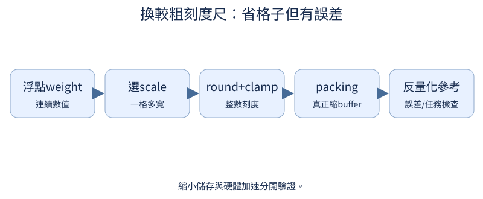
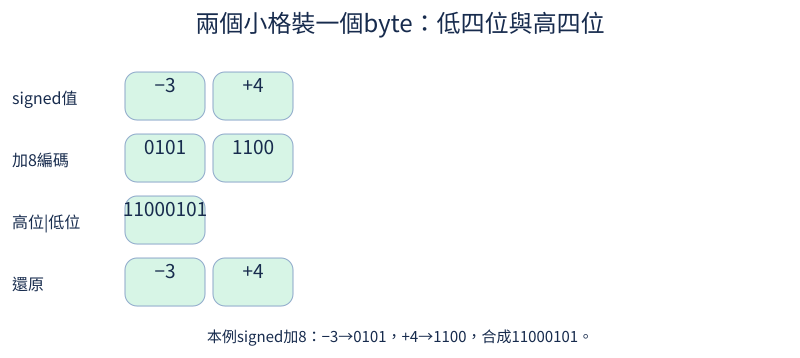

# 第 17 章：量化，用更少位元表示模型

前置：第2章Linear與數值。像把連續刻度尺改成較粗的格子：先看誤差，再看真正的儲存bytes，最後才談硬體加速。quantization.py的參考Linear會反量化，不會假裝是低位元kernel。

## 17.1 權重到底佔多少空間？

**先想一想：**把權重減半，所有訓練memory都減半嗎？



參數個數與每格bytes共同決定權重payload。訓練還要optimizer狀態，推論還要KV與activation，所以權重文件小不等於執行memory一樣小。

**把直覺寫成數學：**bytes=numel×element_size；FP32爲4，FP16爲2，int8爲1。

**最小實驗：**以下程式只處理這節的問題。

```python
weight = torch.zeros(64, 32)
for dtype in (torch.float32, torch.float16, torch.int8):
    converted = weight.to(dtype)
    print(dtype, converted.numel() * converted.element_size())
```

**如何讀結果：**這裏只算這張表，tensor容器與metadata另計；optimizer可還有多份FP32狀態。

**只改一件事：**只把矩陣行數加倍。

## 17.2 浮點數怎麼放進少量整數格子？

**先想一想：**scale=0.5時，0.7會存成哪個整數、還原多少？

把刻度尺整體縮放，再四捨五入到整數格子。scale越粗，誤差通常越大；太細又會讓極值超出有限整數範圍。

**把直覺寫成數學：**q=round(x/scale)，x_hat=q×scale；對稱int8常用−127..127。

**最小實驗：**以下程式只處理這節的問題。

```python
x = torch.tensor([-0.7, 0.2, 0.7, 1.2])
scale = 0.5
q = (x / scale).round()
restored = q * scale
print(x, q, restored, x - restored)
```

**如何讀結果：**round會把多個原數映成同格，資訊有損；不要把誤差0.2誤當算法bug。

**只改一件事：**只把scale減半。

## 17.3 轉回浮點會差多少？

**先想一想：**weight誤差很小，輸出誤差就必定同樣小嗎？

權重誤差會經過輸入累加到輸出；同樣權重誤差，在不同輸入上可能有不同影響。先比較一層，再擴大模型。

**把直覺寫成數學：**Δy=x·(W_hat−W)ᵀ；誤差取決於x與誤差方向。

**最小實驗：**以下程式只處理這節的問題。

```python
from tiny_perceptron.quantization import quantize_symmetric

w = torch.randn(3, 4)
q, scale = quantize_symmetric(w, 4)
restored = q * scale
x = torch.randn(2, 4)
print("權重MAE", (w - restored).abs().mean().item(), "輸出MAE", (x @ w.T - x @ restored.T).abs().mean().item())
```

**如何讀結果：**當前隨機輸入是數值demo，不代表所有真實activation。

**只改一件事：**只把x幅度乘10，觀察輸出誤差。

## 17.4 零點偏移有什麼作用？

**先想一想：**輸入都在2到3，爲什麼只用對稱範圍可能浪費格子？

範圍不以0爲中心時，zero-point把整數0格搬到合適位置。先讓浮點0能還原，並保存scale與zero-point。

**把直覺寫成數學：**q=round(x/s)+z；x_hat=(q−z)s；affine min/max需包括0。

**最小實驗：**以下程式只處理這節的問題。

```python
from tiny_perceptron.quantization import quantize_affine

x = torch.tensor([0.0, 0.2, 1.0, 3.0])
q, s, z = quantize_affine(x, bits=4)
restored = (q.float() - z) * s
print(q, s, z, restored)
assert restored[0].abs() < 1e-6
```

**如何讀結果：**這份參考用unsigned 0..15；int4 packing章節用signed值，兩個表示不要混。

**只改一件事：**只把範圍改成−3到1，觀察zero-point移動。

## 17.5 一組 scale 應該管多大範圍？

**先想一想：**一行很大、一行很小，共用scale會損害誰？

一把scale管整張表，極值會牽連其他行。每row或每group各用刻度能降低部分誤差，但要存更多metadata。

**把直覺寫成數學：**per-output-channel scale:[out,1]；per-group還需保存分組尺寸與尾塊規則。

**最小實驗：**以下程式只處理這節的問題。

```python
from tiny_perceptron.quantization import quantize_symmetric

w = torch.tensor([[0.01, 0.03, 0.05, 0.08], [10.0, 30.0, 50.0, 80.0]])
for channel in (False, True):
    q, s = quantize_symmetric(w, 4, per_channel=channel)
    print(channel, "每行MAE", (w - q * s).abs().mean(-1), "scale格數", s.numel())
```

**如何讀結果：**per-channel以output row爲單位；per-group可把同一row再分更短組，需另外比較metadata。

**只改一件事：**只把大行極值減小。

## 17.6 從 8-bit 降到 4-bit 會發生什麼？

**先想一想：**4bit比8bit誤差一定每一格都更大嗎？



4bit只有16種編碼，8bit有256種。固定同一組weight才能看位元數取捨；理論payload還沒包括scale與packing padding。

**把直覺寫成數學：**理論payload=參數數×bits/8；對稱量化可能保留一個未用編碼。

**最小實驗：**以下程式只處理這節的問題。

```python
from tiny_perceptron.quantization import quantize_symmetric

w = torch.linspace(-1, 1, 33)
for bits in (8, 4):
    q, s = quantize_symmetric(w, bits)
    print(bits, "平均誤差", (w - q * s).abs().mean().item(), "理論bytes", w.numel() * bits / 8)
```

**如何讀結果：**平均趨勢不是每個數字的嚴格排序；比較實際任務還要轉換整模型。

**只改一件事：**只使用恰好落在4bit刻度的原數。

## 17.7 先只量化權重可以嗎？

**先想一想：**權重buffer是uint8，乘法就自動int4了嗎？

weight-only先壓縮weight，activation仍浮點。參考forward先反量化再Linear，用它檢查誤差，但不預設執行更快。

**把直覺寫成數學：**y=x·dequantize(qW)ᵀ+b；運算仍是浮點。

**最小實驗：**以下程式只處理這節的問題。

```python
from tiny_perceptron.quantization import QuantizedLinear

layer = nn.Linear(32, 16)
compressed = QuantizedLinear(layer, 4)
x = torch.randn(2, 32)
print(
    "stored",
    compressed.values.dtype,
    "output",
    compressed(x).dtype,
    "MAE",
    (layer(x) - compressed(x)).abs().mean().item(),
)
```

**如何讀結果：**明確分開存儲dtype與compute dtype；專門kernel放17.10的硬體延伸。

**只改一件事：**只改爲8bit，比較誤差與buffer bytes。

## 17.8 4-bit 如何真的存成較小檔案？

**先想一想：**7個int4數應佔7bytes還是4bytes？

兩個4bit格可以裝進一個byte，一個放低四位、一個放高四位。奇數長度最後留一個padding格，還原時用原shape裁掉。

**把直覺寫成數學：**packed=low|(high<<4)；unpack分別用&15與>>4，再還原signed偏移。

**最小實驗：**以下程式只處理這節的問題。

```python
from tiny_perceptron.quantization import pack_int4, unpack_int4

q = torch.tensor([-8, -1, 0, 1, 7, 2, 3], dtype=torch.int8)
packed = pack_int4(q)
restored = unpack_int4(packed, q.shape)
print(q.tolist(), packed.tolist(), "bytes", packed.numel())
assert torch.equal(q, restored) and packed.numel() == 4
```

**如何讀結果：**這裏真的縮小整數buffer；完整模型文件還含scale、bias與容器header。

**只改一件事：**只把長度改成8，觀察是否仍4bytes。

## 17.9 已訓練模型怎麼直接轉換？

**先想一想：**拿兩份不同隨機模型比較，能隔離量化誤差嗎？

PTQ是在已訓練權重上做轉換。最小weight-only範圍來自weight本身，通常不需要activation校準；品質需用獨立評估集。

**把直覺寫成數學：**同checkpoint→原版與轉換版，不重新隨機初始化兩份模型比較。

**最小實驗：**以下程式只處理這節的問題。

```python
import copy
from tiny_perceptron.model import TinyLM, ModelConfig
from tiny_perceptron.quantization import replace_linear_layers

original = TinyLM(ModelConfig(width=8))
quantized = replace_linear_layers(copy.deepcopy(original), 4)
ids = torch.tensor([[1, 2, 3]])
print("同權重轉換logits MAE", (original(ids)["logits"] - quantized(ids)["logits"]).abs().mean().item())
```

**如何讀結果：**這裏只用隨機weight驗證轉換程式；真實PTQ另載trained checkpoint並評任務、行爲。

**只改一件事：**只改變bits，不改原weight與輸入。

## 17.10 壓縮後怎麼實際運算？

**先想一想：**buffer變小就可宣傳decode加速嗎？

壓得小與算得快需要不同證據。專門kernel直接利用低位元weight；參考反量化實現可能較慢甚至臨時分配大浮點矩陣。

**把直覺寫成數學：**記錄文件大小、載入峯值、prefill/decode、execution peak；不要只看numel。

**最小實驗：**以下程式只處理這節的問題。

```python
from tiny_perceptron.quantization import QuantizedLinear

layer = nn.Linear(64, 32)
compressed = QuantizedLinear(layer, 4)
float_bytes = sum(p.numel() * p.element_size() for p in layer.parameters())
print("權重payload", float_bytes, "compressed buffers", compressed.storage_bytes())
print("低位元backend需選實際硬體支持；本參考版不聲稱kernel加速")
```

**如何讀結果：**TorchAO等是可選硬體延伸，不增加隱藏依賴；接口和支持列表會隨版本變化。

**只改一件事：**只增加每channel scale overhead，覈對儲存收益。

## 17.11 Activation 也量化會改變什麼？

**先想一想：**只在一種短輸入量到的range能代表所有輸入嗎？

activation每次輸入不同，範圍也變化。權重與activation誤差會一起進入輸出，不宜只用一張weight誤差圖判斷模型表現。

**把直覺寫成數學：**y_hat=Q(x)·Q(W)ᵀ；多個層還會累積誤差。

**最小實驗：**以下程式只處理這節的問題。

```python
from tiny_perceptron.quantization import quantize_symmetric

x = torch.randn(2, 4)
w = torch.randn(3, 4)
qx, sx = quantize_symmetric(x, 4)
qw, sw = quantize_symmetric(w, 4)
print("weight-only誤差", (x @ w.T - x @ (qw * sw).T).abs().mean().item())
print("weight+activation誤差", (x @ w.T - (qx * sx) @ (qw * sw).T).abs().mean().item())
```

**如何讀結果：**不同誤差方向可能抵銷，平均誤差不必每例單調增加。

**只改一件事：**只放大一筆activation。

## 17.12 如何決定 activation 的量化範圍？

**先想一想：**只用安靜音訊校準，會適合很大音量嗎？

動態range每次看當前activation；靜態校準用代表性training/calibration輸入先估範圍。不能拿final test選最合意range。

**把直覺寫成數學：**校準估計與held-out評估分開；統計max、percentile等各有假設。

**最小實驗：**以下程式只處理這節的問題。

```python
calibration = torch.tensor([-0.5, 0.2, 0.8, 1.0])
evaluation = torch.tensor([-0.2, 0.4, 3.0])
fixed_max = calibration.abs().max()
dynamic_max = evaluation.abs().max()
print(
    "固定range",
    fixed_max.item(),
    "當前range",
    dynamic_max.item(),
    "超出固定範圍",
    int((evaluation.abs() > fixed_max).sum()),
)
```

**如何讀結果：**這是數值範圍例；先前training資料collection不把校準集當新的訓練目標。

**只改一件事：**只加一筆大幅度calibration，重新檢查範圍。

## 17.13 極端值為什麼讓其他值難表示？

**先想一想：**把100壓到1會讓小值好很多，但總誤差呢？

少量巨大值讓共用刻度變粗，大多數小值擠到同一格。clipping犧牲極值還原換多數值精度，是否划算需看輸出任務。

**把直覺寫成數學：**分別報bulk error與outlier error；不能只用一個全局平均隱藏取捨。

**最小實驗：**以下程式只處理這節的問題。

```python
from tiny_perceptron.quantization import quantize_symmetric

x = torch.tensor([0.1, 0.2, 0.3, 100.0])
for clipped in (False, True):
    source = x.clamp(-1, 1) if clipped else x
    q, s = quantize_symmetric(source, 4)
    restored = q * s
    print(
        clipped, "小值MAE", (x[:3] - restored[:3]).abs().mean().item(), "極值error", (x[-1] - restored[-1]).abs().item()
    )
```

**如何讀結果：**clipping門檻需validation選擇；別把很大的極值誤差漏掉。

**只改一件事：**只改極值從100降爲2。

## 17.14 模型能預先適應量化誤差嗎？

**先想一想：**forward用了round，爲什麼grad還不是0？

QAT讓forward先體驗刻度誤差，再用近似梯度學習。round本身幾乎處處導數0，straight-through estimator把backward近似成恆等。

**把直覺寫成數學：**fake_quant=x+(dequant(quant(x))−x).detach()；forward與backward使用不同規則。

**最小實驗：**以下程式只處理這節的問題。

```python
from tiny_perceptron.quantization import fake_quantize

x = torch.tensor([0.1, 0.4, 0.9], requires_grad=True)
y = fake_quantize(x, 4)
y.sum().backward()
print("forward", y.detach(), "近似grad", x.grad)
assert torch.equal(x.grad, torch.ones_like(x))
```

**如何讀結果：**這裏只檢查STE；真的QAT需訓練後convert再評，不把fake quant當已壓縮權重文件。

**只改一件事：**只移除detach構造，觀察round梯度造成的差異。

## 17.15 品質與行為保留了多少？

**先想一想：**平均logit只差0.01，就保證greedy序列一樣嗎？

壓縮後重跑同一批內容與行爲檢查。小logits誤差也可能跨過argmax邊界，改變格式、EOS或事實答案；不能只報weight MAE。

**把直覺寫成數學：**比較原版/量化版的BPB、任務正確率、格式、誠實、安全、成本。

**最小實驗：**以下程式只處理這節的問題。

```python
a = torch.tensor([1.0, 1.005])
b = torch.tensor([1.01, 1.005])
print("平均誤差", (a - b).abs().mean().item(), "argmax", a.argmax().item(), b.argmax().item())
assert a.argmax() != b.argmax()
```

**如何讀結果：**這個邊界反例說明必須實際生成與評價；安全檢查仍只支持測到的情境。

**只改一件事：**只把原本分數差擴大到1，觀察小誤差較不易翻轉。
