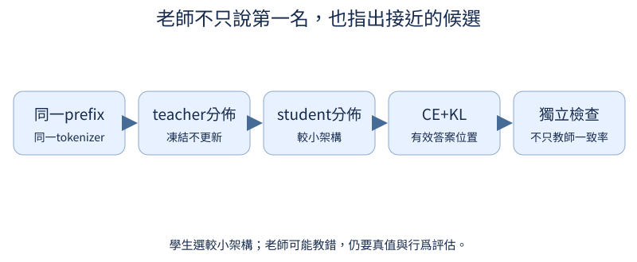

# 第 18 章：蒸餾，讓小模型向教師學習

前置：CE、模型輸出與學生訓練。教師像經驗較多的老師：可以只給答案，也可展示對各候選的分配。老師可能說錯；學生也須真的選較小架構。此處只驗loss與梯度，正式蒸餾需讀者提供已訓練教師。

## 18.1 教師能提供什麼學習訊號？

**先想一想：**只拿到老師最終文字，能知道所有候選的概率嗎？



教師可以給整段文字供SFT，也可以給每個位置的候選分佈。兩種信號的接口、成本與適用tokenizer不同，先分清楚。

**把直覺寫成數學：**黑盒=generated answers；白盒=teacher logits/probabilities。

**最小實驗：**以下程式只處理這節的問題。

```python
signals = {"answer": "4", "distribution": {"4": 0.8, "3": 0.15, "5": 0.05}}
print(signals)
print("答案來自生成；分佈需要模型forward訪問，兩者不能互相冒充")
```

**如何讀結果：**示例分佈是手設，保持和真實teacher結果區分。

**只改一件事：**只保留answer字段，指出哪些蒸餾loss不能再用。

## 18.2 怎麼讓學生本身更小？

**先想一想：**學生和老師width/layers一樣，文件會自動變小嗎？

蒸餾信號本身不會自動減參數；必須讓學生更淺、窄或結構不同。先記錄未蒸餾學生作基準，再看信號有沒有幫忙。

**把直覺寫成數學：**params_teacher與params_student分別計算，不能只因命名student就叫小模型。

**最小實驗：**以下程式只處理這節的問題。

```python
from tiny_perceptron.model import TinyLM, ModelConfig

teacher = TinyLM(ModelConfig(width=16, layers=2))
student = TinyLM(ModelConfig(width=8, layers=1))
print("teacher", teacher.description()["parameters"], "student", student.description()["parameters"])
```

**如何讀結果：**雙方詞表先一致以便白盒；小學生品質是否可接受需獨立評價。

**只改一件事：**只降低layers，保持width。

## 18.3 只能看到教師回答也能學嗎？

**先想一想：**人寫題解拿來SFT，能說已經完成teacher distillation嗎？

教師生成答案後保存來源與版本，再按SFT資料訓練學生。先過濾不一致、無法驗證或違反目標的答案；GSM8K人寫步驟不能標成教師生成。

**把直覺寫成數學：**black-box distillation複用assistant-only CE；教師生成成本另算。

**最小實驗：**以下程式只處理這節的問題。

```python
record = {
    "messages": [{"role": "user", "content": "2+2=?"}, {"role": "assistant", "content": "4"}],
    "teacher_revision": "待真實教師生成時填寫",
    "provenance": "人工示例，非教師生成",
}
print(record)
print("教師生成→驗證答案→保存JSONL→train.py --task sft --data ... --train")
```

**如何讀結果：**只看到答案可以不同tokenizer，因爲先decode成文字再由學生encode；這不同於白盒分佈對齊。

**只改一件事：**只改provenance字段爲真實模型commit，前提是確實執行生成並保存。

## 18.4 第一名以外的選項有什麼價值？

**先想一想：**老師認爲3比100更接近4，hard label會表達嗎？

硬答案只強調冠軍，soft targets還透露誰像第二名。相關候選的相對概率可能給學生更多結構，但錯誤偏好也會傳過去。

**把直覺寫成數學：**one-hot=[1,0,0]與teacher=[.7,.2,.1]含不同訊息。

**最小實驗：**以下程式只處理這節的問題。

```python
hard = torch.tensor([1.0, 0.0, 0.0])
soft = torch.tensor([0.7, 0.2, 0.1])
print("候選[4,3,100]", hard, soft)
assert torch.allclose(soft.sum(), torch.tensor(1.0))
```

**如何讀結果：**token概率不等於數值距離的必然編碼；例子只是展示可能的額外訊息。

**只改一件事：**只讓老師對錯誤候選給最高概率。

## 18.5 如何顯示較低機率的候選？

**先想一想：**T變大，冠軍優勢通常變大還是變小？

提高蒸餾temperature讓較低分候選更可見。它作用在loss裏的分佈，不是推論抽樣的temperature；兩個值應分別保存。

**把直覺寫成數學：**p_T=softmax(logits/T)，T>0；本教材KL乘T²補償梯度尺度變化。

**最小實驗：**以下程式只處理這節的問題。

```python
z = torch.tensor([4.0, 1.0, 0.0])
for temperature in (1.0, 2.0, 4.0):
    print(temperature, (z / temperature).softmax(0))
```

**如何讀結果：**變平不保證更好的學生，過高也可能把有用差異抹平。

**只改一件事：**只把候選分數差擴大。

## 18.6 教師與學生的 token 對得上嗎？

**先想一想：**老師詞表[貓,狗]、學生[狗,貓]，能直接KL嗎？

白盒逐token對概率時，兩邊每一欄必須代表同一個token。只看V相同不夠；ID交換會把老師的「貓」當成學生的「狗」。

**把直覺寫成數學：**詞表集合、ID順序、special tokens與prefix對齊都要一致。

**最小實驗：**以下程式只處理這節的問題。

```python
teacher_vocab = ["貓", "狗"]
student_vocab = ["狗", "貓"]
print(teacher_vocab, student_vocab, "同尺寸", len(teacher_vocab) == len(student_vocab))
assert teacher_vocab != student_vocab
print("CLI白盒固定共享ByteTokenizer，避免只比較維度就接受")
```

**如何讀結果：**異tokenizer的白盒要額外對齊算法，留進階；黑盒文字生成則可各自encode。

**只改一件事：**只把學生ID順序調成完全一致。

## 18.7 教師需要跟著更新嗎？

**先想一想：**兩邊都有grad的loss，還是固定教師嗎？

教師是固定指導，不跟着學生loss更新。eval處理模塊行爲，no_grad不建教師圖，requires_grad=False確保teacher權重沒進訓練。

**把直覺寫成數學：**optimizer只收student參數；teacher計算成本仍是真實成本。

**最小實驗：**以下程式只處理這節的問題。

```python
from tiny_perceptron.model import TinyLM, ModelConfig

teacher = TinyLM(ModelConfig(width=16)).eval().requires_grad_(False)
student = TinyLM(ModelConfig(width=8))
ids = torch.tensor([[1, 2]])
with torch.no_grad():
    t = teacher(ids)["logits"]
s = student(ids)["logits"]
print(t.requires_grad, s.requires_grad)
assert not t.requires_grad and s.requires_grad
```

**如何讀結果：**這裏只用隨機模型檢查凍結，不代表這個teacher有可教能力。

**只改一件事：**只取消no_grad但仍freeze，解釋圖何時還會因輸入requires_grad而建立。

## 18.8 如何學習整個分佈？

**先想一想：**把方向反過來，是同一個loss嗎？

雙方看同一個已知回答prefix，預測同一個下一token。用teacher概率加權log差，方向是KL(teacher||student)，再只平均有效答案格。

**把直覺寫成數學：**KL(p||q)=Σ_i p_i(log p_i−log q_i)；torch.kl_div輸入順序先student log概率、再teacher概率。

**最小實驗：**以下程式只處理這節的問題。

```python
from tiny_perceptron.alignment import distillation_kl

student = torch.randn(1, 3, 4, requires_grad=True)
teacher = torch.randn(1, 3, 4, requires_grad=True)
labels = torch.tensor([[-100, 1, 2]])
loss = distillation_kl(student, teacher, labels, temperature=2.0)
loss.backward()
print(loss.item(), student.grad[:, 0], teacher.grad)
assert student.grad[:, 0].abs().sum() == 0 and teacher.grad is None
```

**如何讀結果：**ignored位置無直接KL；prefix仍可作爲context取得學生間接梯度。

**只改一件事：**只把ignored位置變有效，觀察loss分母與梯度。

## 18.9 標準答案和教師偏好怎麼一起學？

**先想一想：**alpha=0應回到哪種訓練？

混合標準答案CE和教師分佈KL，既保留標註真值，也接受額外候選訊息。alpha與T²convention必須記錄，不能只寫「蒸餾loss」。

**把直覺寫成數學：**L=(1−alpha)CE+alpha·T²·KL，0≤alpha≤1；本helper內部已乘T²，外層別再乘。

**最小實驗：**以下程式只處理這節的問題。

```python
from tiny_perceptron.alignment import distillation_loss
from tiny_perceptron.model import masked_loss

s = torch.randn(1, 2, 4, requires_grad=True)
t = torch.randn(1, 2, 4)
y = torch.tensor([[1, 2]])
for alpha in (0.0, 0.5, 1.0):
    print(alpha, distillation_loss(s, t, y, alpha=alpha).item())
assert torch.allclose(distillation_loss(s, t, y, alpha=0.0), masked_loss(s, y))
```

**如何讀結果：**temperature改變梯度也改變候選分佈；調參用validation，test保留。

**只改一件事：**只移除T²縮放，記錄你改了哪種convention。

## 18.10 蒸餾是否幫到學生？

**先想一想：**學生很像教師，但教師本身錯，是否算成功？

同一學生架構、初始化與資料預算比較純SFT和蒸餾。教師額外forward或生成不是免費，另列時間與tokens成本。

**把直覺寫成數學：**matched student與budget；評價使用獨立真值，不能拿teacher一致率替代正確率。

**最小實驗：**以下程式只處理這節的問題。

```python
plans = [
    {"method": "SFT", "student_width": 8, "steps": 100, "teacher_forward": False},
    {"method": "KL", "student_width": 8, "steps": 100, "teacher_forward": True},
]
print(plans)
print("入口：train.py --task distill --teacher checkpoints/teacher.pt --train --width 8")
```

**如何讀結果：**這裏只給可執行計劃，未聲稱蒸餾提升；無teacher時CLI正式訓練會拒絕繼續。

**只改一件事：**只改teacher的品質，保持學生配置。

## 18.11 教師的風格和錯誤會被學走嗎？

**先想一想：**老師每題都拒絕，學生模仿成功是任務成功嗎？

老師的風格、錯誤與過度拒絕都可能被學生模仿。先檢查生成資料，再分別評價內容、格式、安全與正常完成，不只比相似度。

**把直覺寫成數學：**教師一致率、標準答案正確率、行爲指標獨立列。

**最小實驗：**以下程式只處理這節的問題。

```python
teacher_answers = ["不知道", "不知道", "不知道"]
truth = ["2", "4", "資訊不足"]
student_answers = teacher_answers.copy()
print("教師一致率", sum(a == b for a, b in zip(teacher_answers, student_answers)) / 3)
print("示例真值exact match", sum(a == b for a, b in zip(truth, student_answers)) / 3)
```

**如何讀結果：**構造例只說明一致與正確不同。真值中的不確定可接受措辭需人工rubric，不能只exact match。

**只改一件事：**只修正教師一個已知錯誤回答。

## 18.12 MoE 教師能教 Dense 學生嗎？

**先想一想：**老師MoE、學生Dense，shape不能直接相同嗎？

教師內部可以有許多廚師，學生只留一套Dense廚房；只要輸出詞表與prefix一致，KL不要求內部層數相同。

**把直覺寫成數學：**interface-matched而非architecture-matched；總參數與active成本分別報。

**最小實驗：**以下程式只處理這節的問題。

```python
from tiny_perceptron.model import TinyLM, ModelConfig

teacher = TinyLM(ModelConfig(width=16, experts=3, top_k=2))
student = TinyLM(ModelConfig(width=8))
ids = torch.tensor([[1, 2]])
print(teacher(ids)["logits"].shape, student(ids)["logits"].shape)
assert teacher(ids)["logits"].shape == student(ids)["logits"].shape
```

**如何讀結果：**shape檢查不要求加載隨機MoE作真實teacher；正式用已驗證有能力的checkpoint。

**只改一件事：**只改學生vocab_size，看到白盒接口爲什麼壞了。

## 18.13 圖片／音訊能力能如何蒸餾？

**先想一想：**老師16個視覺token、學生4個，直接KL整條序列行嗎？


教師與學生看同一圖片／聲音／問題，比較相同回答位置的分佈。先保持模態展開長度契約；不同視覺token數時不能逐格盲對齊。

**把直覺寫成數學：**文字答案positions必須映射到同一語義token；內部feature distillation另設目標。

**最小實驗：**以下程式只處理這節的問題。

```python
teacher_visual, student_visual, answer_tokens = 16, 4, 3
teacher_answer_positions = list(range(teacher_visual, teacher_visual + answer_tokens))
student_answer_positions = list(range(student_visual, student_visual + answer_tokens))
print(teacher_answer_positions, student_answer_positions)
print("先按對應答案位置gather，再比較同一詞表分佈")
```

**如何讀結果：**這個索引表不含role等額外位置，真實映射從expand labels的有效位置取得。

**只改一件事：**只改音訊frame數，檢查同樣需要答案位置映射。

## 18.14 蒸餾後再量化能省多少？

**先想一想：**只報teacher與量化學生，能知道蒸餾有沒有幫助嗎？

先由更小學生學習，再把學生的數值存得更緊，是兩條省成本路線組合。要保留未蒸餾學生，才知道品質來自哪項。

**把直覺寫成數學：**四組：teacher、SFT student、distilled student、quantized distilled student；成本與品質並排。

**最小實驗：**以下程式只處理這節的問題。

```python
from tiny_perceptron.model import TinyLM, ModelConfig
from tiny_perceptron.quantization import replace_linear_layers

student = TinyLM(ModelConfig(width=8))
before = sum(p.numel() * p.element_size() for p in student.parameters())
compressed = replace_linear_layers(student, 4)
after = sum(t.numel() * t.element_size() for t in list(compressed.parameters()) + list(compressed.buffers()))
print("隨機學生轉換payload", before, after, "品質仍需四組真實checkpoint評估")
```

**如何讀結果：**不把隨機學生轉換叫「蒸餾完成」；真的組合要先執行蒸餾，再PTQ與行爲retention測試。

**只改一件事：**只選擇8bit，記錄儲存與誤差取捨。
